# ALB 

ALB (Application Load Balancer) is a load balancer operating at the
application layer and supporting HTTP, HTTPS and QUIC (Quick UDP
Internet Connections).

A VIP is a private IP address belonging to a VPC. ALB VIPs are used to
receive requests.

An ALB instance offers two IP modes: static mode and dynamic mode.

The listener allows to check the connection requests. It can be of type
HTTP or HTTPS. There is also another type of listener, QUIC, which
allows an encrypted connection to transmit QUIC requests. QUIC is an
improved secure protocol similar to TLS/SSL.

You can define forwarding rules in listeners to define how requests are
routed to the backend servers of a server group.

ALB instances can be protected against accidental deletion.

Different types of certificates are supported: those from the SSL
Certificates service, CA certificates or server certificates issued by a
third party.

The backend server groups are the ECS instances that receive the client
requests redistributed by the ALB instance.

The security is ensured by ACLs that allow to manage white and black
lists.

Health Checks are used to monitor the conditions of server groups. You
can create HTTP or HTTPS Health Checks.

The TLS security policy allows to specify the supported versions of TLS
as well as the supported encryption algorithms.

## Introduction to ALB 

ALB instances can be Internet and internally oriented.

Internet-facing ALB instances use EIPs and EIP bandwidth plans. EIP
bandwidth plans allow sharing and transferring bandwidth of resources in
the same region. The advantage is to reduce Internet bandwidth costs.
Billing can be done by bandwidth (pay-by-bandwidth) or by the enhanced
95th percentile. A domain name on the Internet can be resolved to an EIP
or to a canonical domain name on the ALB via the CNAME.

An Internet-facing ALB instance can have several EIPs in different
zones. This ensures high availability.

A VIP is a private IP address belonging to a VPC. ALB VIPs are used to
receive requests.

The components of an ALB instance are:
-   The ALB instance provides the load balancing service at Layer 7.
    Incoming traffic is distributed over multiple backend servers. The
    benefit is increased throughput and application availability.
-   Listeners are protocol and port specific. Each ALB instance must
    have at least one listener.
-   The forwarding rules indicate how the ALB instance distributes
    requests to the backend servers of the server groups. It is possible
    to specify cookie, HTTP header and host conditions.
-   Server groups are groups of backend servers. These backend servers
    can be ECS (Elastic Compute Service), ECI (Elastic Container
    Instances) or ENI (Elastic Network Interfaces) instances. An ECS
    instance can be a backend server. A group of servers can be
    associated with several ALB instances. The maximum is 1000 backend
    servers per server group.
-   The Health Check is a Health Check on ECS instances to verify the
    availability of the backend servers. The ALB instance checks the
    health of these backend servers. If a Health Check fails, the ALB
    instance does not forward any more requests to this backend server
    until this server is declared healthy again.

There are two editions of ALB instances:
-   Basic ALB instances (Basic Edition),
-   Standard ALB instances (Standard Edition).

The Basic edition does not support the following features:
-   rewriting, redirecting or resending a fixed response,
-   cookie-based routing,
-   routing based on HTTP methods,
-   routing based on request strings,
-   end-to-end transmission via HTTPS,
-   the custom TLS cipher suite.

## Creation of an ALB instance 

The ALB instance and the backend servers (e.g. ECS instances) must be
deployed in the same region.

To ensure high availability, it is recommended to select at least two
zones.

The IP mode offers two modes:
-   Static IP,
-   Dynamic IP.

With the static IP address, each zone can only have one IP address. It
cannot be changed. The limit is 100 000 QPS (query per second).

With the dynamic IP address, each zone can offer several dynamic IP
addresses.

Internet-oriented instances have a public IP address. This allows access
to the ALB instance via the Internet. To access the Internet, the
Internet-oriented ALB instances use EIPs.

Intranet-oriented instances have a private IP address. The ALB instance
can only be accessed from the Alibaba Cloud network.

At least one ECS instance is running in each zone. ECS instances are
added to a security group that allows access to port 80 or port 443 via
HTTP or HTTPS.

The server group is used to process the requests received by the ALB
instance.

If the result of the Health Check of the ALB instance is "healthy", it
means that the ECS backend instances are ready to process the requests
distributed by the ALB instance.

To create an Internet-facing ALB instance:
-   Go to the `SLB` console,
-   Click on `ALB | Instances`,
-   Click on `Create ALB Instance`,
-   `Region`: this is the region in which the instance will be
    located,
-   `VPC`: this is the VPC in which to create the instance,
-   `Area`: these are the areas of the specified region,
-   `IP mode`: this is the IP mode (`Static IP` or `Dynamic IP`),
-   `Edition`: this`` is the edition (`Basic` or `Standard`),
-   `Network Type`: this is the type of ALB instance (`Internet` for
    Internet oriented and `Internal` for internally oriented),
-   `Billing Method`: this is`` the billing method,

When `Network Type` is `Internet`, the possible values are
`Pay-by-Data-Transfer`, `Pay-by-Bandwidth` and
`Pay-by-Classic-95th-Percentile-Bandwidth`.
-   `Instance Name`: this is the name of the ALB instance,
-   `Resource Group`: this is the resource group to which the instance
    belongs,
-   Click on `Buy Now`,
-   Click on `Activate Now`.

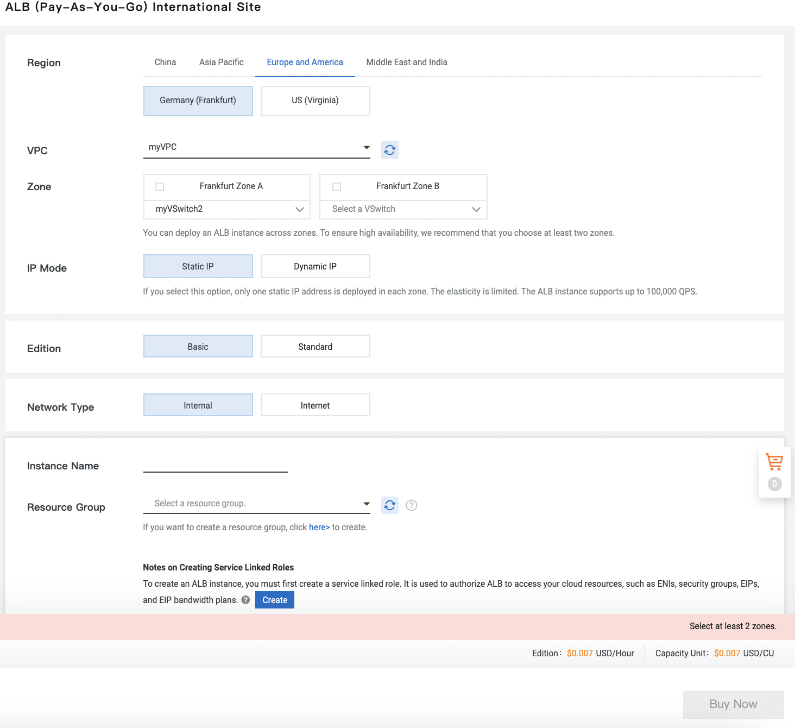{width="4.5in" height="4.11875in"}

To allow ALB to access your cloud resources, you must first create a
role related to the service. If you have not already done so, you must
click on the `Create` button:

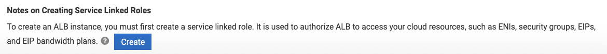{width="4.5in" height="0.4076388888888889in"}

To configure a listener:
-   Go to the `SLB` console,
-   Click on `ALB | Instances`,
-   Click on the instance ID,

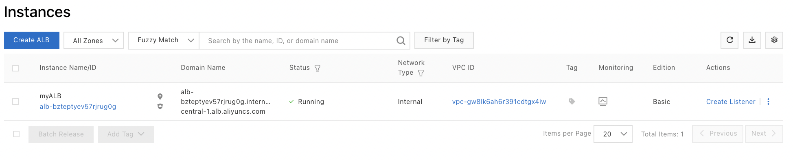{width="4.5in" height="0.9104166666666667in"}
-   Click on `Create Listener` on the line of the instance,
-   `Listener Protocol`: this is the listener protocol,
-   `Listening Port`: this is the listening port of the ALB instance,

In general, port 80 is used for HTTP and port 443 for HTTPS. Valid
values range from 1 to 65535.
-   `Listener Name`: this is`` the name of the listener,
-   Click on `Modify` next to `Advanced Settings`,
-   `Enable HTTP/2` (if `HTTPS` is selected for `Listener
    Protocol`): indicates whether HTTP/2 is enabled for the front-end
    protocol used by the ALB instance,
-   `Idle Connection Timeout Period` (except for HTTP/2): this is the
    timeout period for inactive connections (from 1 to 60 in seconds);
    after the timeout period, the ALB instance closes the connection,
-   `Connection Request Timeout Period`: this is`` the time the
    request is waiting for (between 1 and 180 seconds),

After the timeout, the ALB instance returns a HTTP 504 error to the
client.
-   `Gzip Compression`: indicates whether Gzip compression is enabled,
-   `Add HTTP Header Fields`: these are the added HTTP header fields:

```{=html}
<!-- -->
```
-   `X-Forwarded-For` (for HTTP and HTTPS): retrieves the real IP
    address of the client,
-   `SLB-ID:` retrieves the ID of the ALB instance,
-   `X-Forwarded-Proto`: retrieves the listening protocol of the ALB
    instance,
-   `X-Forwarded-Clientcert-subjectdn` (for HTTPS): retrieves
    information about the owner of the client certificate,
-   `X-Forwarded-Clientcert-issuerdn` (for HTTPS): retrieves
    information about the authority that issues the client's
    certificate,
-   `X-Forwarded-Clientcert-fingerprint` (for HTTPS): retrieves the
    digital fingerprint of the client certificate,
-   `X-Forwarded-Clientcert-clientverify` (for HTTPS): retrieves the
    result of the client certificate verification,
-   `X-Forwarded-Port`: retrieves the listening ports of the ALB
    instance,
-   `X-Forwarded-Client-Port` (for HTTP and HTTPS): retrieves the port
    used by the client,

```{=html}
<!-- -->
```
-   Click on `Next`.

{width="3.3722200349956255in"
height="4.385964566929134in"}

Configure an SSL certificate:
-   Click on the` Modify` button next to` Advanced Settings`,`
-   Server Certificate`: this is the server certificate,
-   `TLS Security Policy`: this is the TLS security policy,

The TLS security policy contains the TLS protocols and 0.d cipher suites
available for HTTPS listeners.
-   Click on `Next`.

{width="2.5107753718285215in"
height="2.1062620297462815in"}

Select a server group for the HTTPS listener:
-   Select a server group,
-   Click on `Next`,
-   Click on `Submit`,
-   Click on `OK`.

## Changing the zones of an ALB instance 

You can enable or disable fields in an ALB instance:
-   Go to the `SLB` console,
-   Click on `ALB | Instances`,
-   Click on `Modify Zone/Subnet` in the instance line,

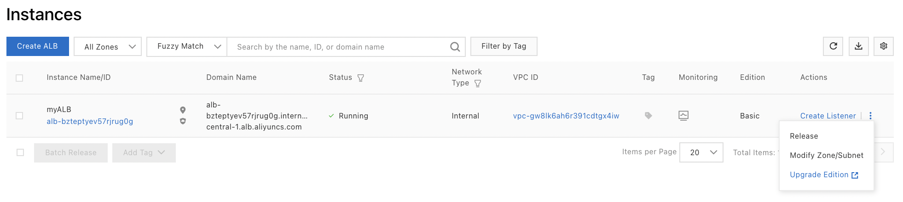{width="4.5in" height="1.0090277777777779in"}
-   Check the areas,
-   Click on `OK`.

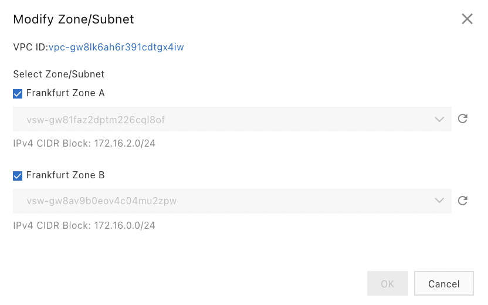{width="2.5302777777777776in"
height="1.5814238845144357in"}

## Configuration of the protection against deletion 

You can activate or deactivate the protection against deletion of ALB
instances. This protection protects against accidental deletion of ALB
instances.

To configure deletion protection:
-   Go to the `SLB` console,
-   Click on `ALB | Instances`,
-   Click on the instance ID,
-   Click on the `Instance Details` tab,

{width="4.5in"
height="2.598611111111111in"}
-   Click on `Enable Deletion Protection`.

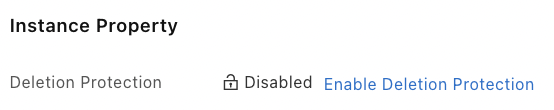{width="1.4872025371828521in"
height="0.2952930883639545in"}

## Adding tags 

You can use tags to classify ALB instances. Each ALB instance can have
several tags.

To add tags:
-   Go to the `SLB` console,
-   Click on `ALB | Instances`,
-   Click on the tag icon in the `Tag` column,

{width="0.21613298337707787in"
height="0.42221456692913384in"}
-   Click on `Add`,
-   `Tag Key`: this is the key,
-   `Tag Value`: this is the value of each tag,
-   Click on `OK`.

{width="2.774708005249344in"
height="2.467262685914261in"}

## The Listeners 

### Add a HTTP listener 

A HTTP listener is used to check connection requests. It can be
configured when the ALB instance is created or afterwards.

HTTP listeners are used for example for web applications or mobile
games.

To add a HTTP listener to an ALB instance:
-   Go to the `SLB` console,
-   Click on `ALB | Instances`,
-   Click on `Create Listener` on the line of the instance,
-   `Listener Protocol`: this is`` the protocol used for the
    listener (here `HTTP`),
-   `Listener Port`: this is`` the listening port of the ALB
    instance,
-   `Listener Name`: this is`` the name of the listener,
-   `Idle Connection Timeout Period`: this is`` the timeout period
    for inactive connections (from 1 to 60 seconds),
-   `Connection Request Timeout Period`: this is`` the time the
    request is waiting for (from 1 to 180 seconds),
-   `Gzip Compression`: indicates whether Gzip compression is enabled
    or not,
-   `Add HTTP Header Fields:` these are the added HTTP headers:

```{=html}
<!-- -->
```
-   `X-Forwarded-For`: retrieves the real IP address of the client,
-   `SLB-ID:` retrieves the ID of the ALB instance,
-   `X-Forwarded-Proto`: retrieves the listening protocol used by the
    ALB instance,
-   `X-Forwarded-Port`: retrieves the listening port of the ALB
    instance,
-   `X-Forwarded-Client-Port:` retrieves the port used by the client,

```{=html}
<!-- -->
```
-   Click on `Next`,

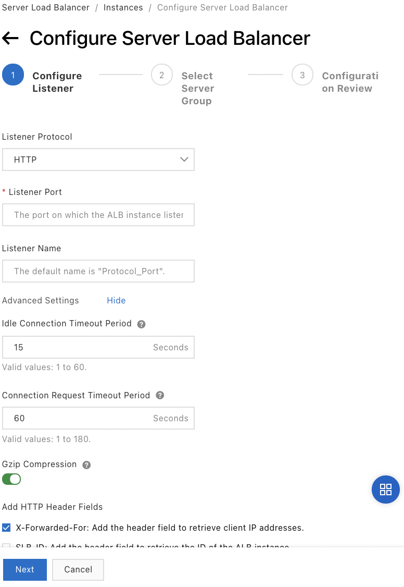{width="2.6149278215223095in"
height="3.7944706911636046in"}
-   Select a server group,
-   Check the selected backend servers,
-   Click on `Next`,
-   Click on `Submit`.

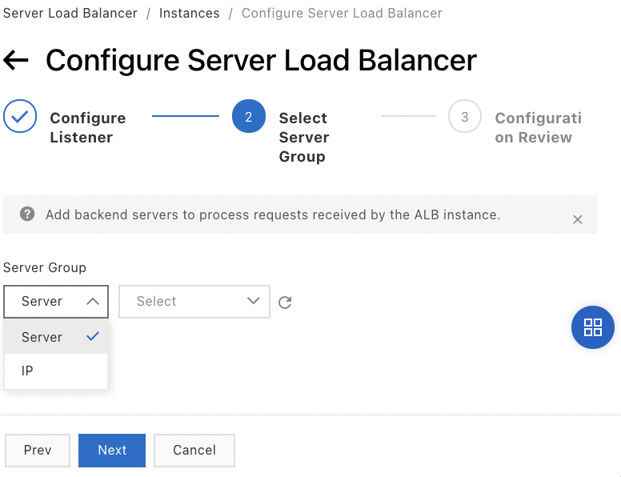{width="2.2558639545056867in"
height="1.7326290463692038in"}

### Add a HTTPS listener 

Use HTTPS listeners for encrypted connections.

To configure a HTTPS listener on an ALB instance:
-   Go to the `SLB` console,
-   Click on `ALB | Instances`,
-   Click on `Create Listener` on the line of the instance,
-   `Listener Protocol`: this is`` the listener protocol,
-   `Listening Port`: this is`` the listening port of the ALB
    instance (usually port 80 for HTTP and port 443 for HTTPS); valid
    values range from 1 to 65535,
-   `Listener Name`: this is`` the name of the listener,
-   Click on `Modify` next to `Advanced Settings`,
-   `Enable HTTP/2`: indicates whether HTTP/2 is enabled for the
    front-end protocol used by the ALB instance,
-   `Idle Connection Timeout Period` (except for HTTP/2): this is the
    timeout period for inactive connections (from 1 to 60 in seconds);
    after the timeout period, the ALB instance closes the connection,
-   `Connection Request Timeout Period`: this is`` the time the
    request will take (between 1 and 180 seconds); after the timeout
    period, the ALB instance returns a HTTP 504 error to the client,
-   `Gzip Compression`: indicates whether Gzip compression is enabled,
-   `Add HTTP Header Fields:` these are the added HTTP header fields:

```{=html}
<!-- -->
```
-   `X-Forwarded-For`: retrieves the real IP address of the client,
-   `SLB-ID:` retrieves the ID of the ALB instance,
-   `X-Forwarded-Proto`: retrieves the listening protocol of the ALB
    instance,
-   `X-Forwarded-Clientcert-subjectdn`: retrieves information about
    the owner of the client certificate,
-   `X-Forwarded-Clientcert-issuerdn`: retrieves information about the
    authority that issues the client's certificate,
-   `X-Forwarded-Clientcert-fingerprint`: retrieves the digital
    fingerprint of the client certificate,
-   `X-Forwarded-Clientcert-clientverify:` retrieves the result of the
    client certificate verification,
-   `X-Forwarded-Port`: retrieves the listening ports of the ALB
    instance,
-   `X-Forwarded-Client-Port:` retrieves the port used by the client,

```{=html}
<!-- -->
```
-   `QUIC Update`: indicates whether the QUIC update feature is
    enabled,
-   `Associate QUIC Listener` (if `QUIC Update` is activated): this
    is the QUIC listener to associate with the ALB instance,
-   Click on `Next`,

{width="2.467528433945757in"
height="4.031818678915136in"}
-   Click on` Modify` next to` Advanced Settings,
-   Server certificate`: this is the server certificate; it is also
    possible to buy one by clicking on `Buy Certificate` in the list,

This is the certificate that is used to identify the server. It must be
uploaded to the ALB instance.
-   `TLS security policy`: this is`` the TLS security policy,

It contains the TLS protocol versions and cipher suites available for
HTTPS listeners. It is necessary for mutual and one-way authentication.
-   Click on `Next`,

{width="2.641854768153981in"
height="2.594154636920385in"}
-   Enable mutual authentication,
-   Select an uploaded CA certificate or purchase one by clicking on
    `Purchase a CA certificate`,
-   Click on `Next`.
-   Select a server group from the drop-down list,
-   Click on `Next`,
-   Click on `Submit`.

To create a HTTPS listener, it is necessary to configure an SSL
certificate. There are different types of certificates:
-   `Server certificate`,
-   `Client certificate`,
-   `CA certificate`.

`Server certificate` is the certificate that is used to identify the
server. The browser uses it to verify that the certificate sent by the
server is signed and issued by a trusted certificate authority (CA). It
must be uploaded to the ALB instance.

`Client certificate` is the certificate used to identify the client.
The server identifies the client by verifying the certificate sent by
the client. For mutual authentication, it must be installed on the
client. It is not required for one-way authentication.

`CA certificate` is the certificate used by the server to verify the
signature of the client certificate. If the signature is not valid, the
connection request is denied. For mutual authentication it must be
installed on the ALB instance. It is not necessary for one-way
authentication.

### Add a QUIC listener 

A QUIC listener uses an encrypted connection to transmit QUIC requests.

QUIC (Quick UDP Internet Connections) is a secure protocol used for
communication between clients and CDN nodes. It is also used to speed up
the delivery of content.

To configure a QUIC listener:
-   Go to the `SLB` console,
-   Click on `ALB | Instances`,
-   Click on `Create Listener` on the line of the instance,
-   `Listener Protocol`: this is`` the protocol used for the
    listener (`QUIC` here),
-   `Listener Port`: this is the listening port of the ALB instance,
-   `Listener Name`: this is`` the name of the listener,
-   `Connection Request Timeout Period`: this is`` the time the
    request is waiting for (from 1 to 180 seconds),
-   `Gzip Compression`: indicates whether Gzip compression is enabled
    or not,
-   `Add HTTP Header Fields:` these are the added HTTP headers:

```{=html}
<!-- -->
```
-   `SLB-ID:` retrieves the ID of the ALB instance,
-   `X-Forwarded-Proto`: retrieves the listening protocol used by the
    ALB instance,
-   `X-Forwarded-Port`: retrieves the listening port of the ALB
    instance,

```{=html}
<!-- -->
```
-   Click on `Next`,

{width="3.040520559930009in"
height="4.224352580927384in"}
-   `Server Certificate`: this is the SSL server certificate,

The ALB instance uses this certificate to decrypt a client's requests
after closing the connection with the client.
-   Click on `Next`,

{width="1.980851924759405in"
height="1.249037620297463in"}
-   Select a server group,
-   Click on `Next`,
-   Click on `Submit`.

## The Forward rules 

### Manage forward rules for listeners 

Forwarding rules for listeners define how requests are routed to the
backend servers of a server group.

These rules are inbound or outbound and include conditions and actions.

Incoming rules define the conditions and incoming actions.

Outbound rules define inbound and outbound conditions and outbound
actions.

The operation is as follows:
-   The client sends a request to the ALB instance.
-   The ALB instance forwards this request to a backend server according
    to the incoming forwarding rule configured for the ALB instance.
-   The backend server returns the response to the client based on the
    outbound transfer rule configured for the ALB instance.

A forward rule must have at least one `Forward`, `Redirect` or
`Return Fixed Responses` action.

`Inbound` conditions can be: `Domain Name`, `Path`, `HTTP
Header`, `Query String`, `HTTP Request Method`, `Cookie` and
`Source IP Address`.

Incoming actions can be: `Forward`, `Redirect`, `Return Fixed
Responses`, `Rewrite`, `Add Header`, `Remove Header`, `Throttle
Traffic` and `Mirror Traffic`.

Outgoing conditions can be: `Response Status Code` and `Response
Header`.

The outgoing actions can be: `Add Header` and `Remove Header`.

### Create a forward rule 

A default forward rule can be created when the listener is created or
afterwards with custom forward rules.

A rule looks like this:

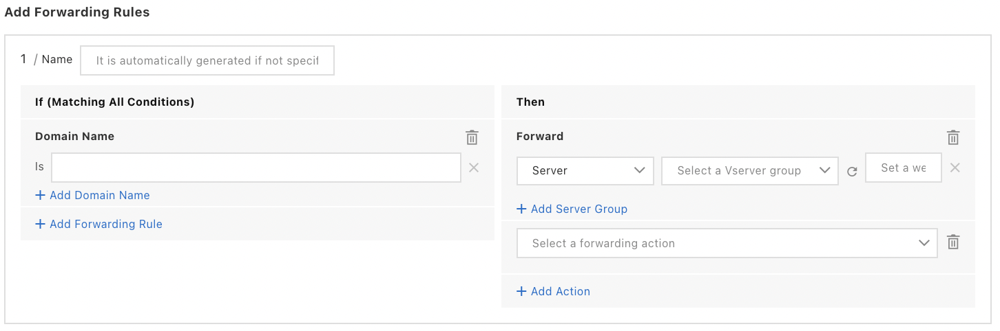{width="4.5in" height="1.49375in"}

To create a forward rule:
-   Go to the `SLB` console,
-   Click on `ALB | Instances`,
-   Click on the instance ID,
-   Click on the `Listener` tab,

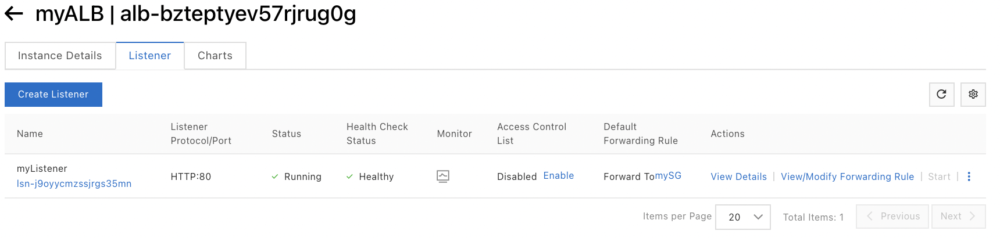{width="4.5in" height="1.0729166666666667in"}
-   Click `View/Modify Forwarding Rule` on the line of the listener,

{width="3.2666754155730535in"
height="0.736010498687664in"}
-   Select `Inbound Forwarding Rules` or `Outbound Forwarding
    Rules`,
-   Click on `Add New Rule`,

{width="4.5in"
height="2.0069444444444446in"}
-   `Name`: this is`` the name of the forward rule,
-   `If (Matching All Conditions):` select the arrival condition used:

```{=html}
<!-- -->
```
-   `Domain Name:` these are the domain names (supports `*` and
    `?` ),
-   `Path`: this is the path,
-   `HTTP Header:` these are the http headers,

The name appears in the `Key` field and the value in the `Value`
field.
-   `Query String`: these are the strings of queries in the form of
    key-value pairs,
-   `HTTP Request Method:` these are the HTTP request methods,
-   `Cookie`: these are the cookies,
-   `Source IP Address:` these are the IP addresses or CIDR blocks,

{width="2.2796062992125985in"
height="1.3899256342957131in"}
-   `Then:` this is the outgoing condition:

```{=html}
<!-- -->
```
-   `Response Status Code`: this is`` the HTTP status code of the
    response to the client,

Valid values range from 100 to 599. It is possible to specify value
ranges in the form "200-204".
-   `Response Header:` these are the HTTP headers of the response,

The name of the header appears in the `Key` field and its content in
the `Value` field.

{width="1.9652077865266842in"
height="0.9826049868766404in"}
-   `+ Add Action`: these are the actions associated with each
    condition:

```{=html}
<!-- -->
```
-   `Forward`: adds server groups using the list,

You can enable session persistence for these server groups.
-   `Redirect`: select the protocol in the Protocol list and then
    select a status code in the `Status Code` list; enter the domain
    `name`, `port` and `path` of the destination to which to
    forward the requests; enter a `query` string,
-   `Return Fixed Responses`: enter the HTTP status code in `Status
    Code`; select a `Response` Content Type and then enter the
    `Response` Content,
-   `Rewrite`: enter the `Domain` Name and `Path` of the
    destination to which you want to direct your requests, then enter a
    string in the `Query` field,
-   `Add Header`: enter the name and content of the header to add to
    the query; this header replaces the existing headers in the query,
-   `Remove Header:` enter the content of the header to be deleted,
-   `Throttle Traffic`: enter the maximum number of requests per
    second (from 1 to 100000),

Once the limit is reached, new connection requests are dropped.
-   `Mirror Traffic`: select the server group,

{width="2.2686581364829395in"
height="0.4372769028871391in"}
-   Click on `OK`.

ALB Basic Edition instances only support `Forward` and `Add Header`
actions.

An "or" is applied between the values of a condition.

A logical "and" is applied between the conditions.

### Modify a forward rule 

To change a forward rule:
-   Go to the `SLB` console,
-   Click on `ALB | Instances`,
-   Click on the instance ID,
-   Click on the `Listener` tab,
-   Click `View/Modify Forwarding Rule` on the line of the instance,
-   Click on the `Forwarding Rules` tab,
-   Select `Inbound Forwarding Rules` or `Outbound Forwarding
    Rules`,
-   Click on the pen icon (edit) to the right of the rule to be
    modified,
-   Click on `Save`.

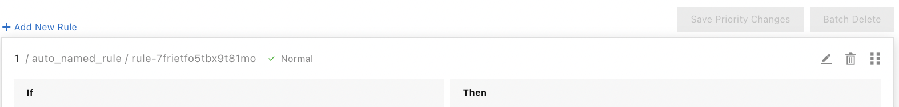{width="4.5in" height="0.5430555555555555in"}

### Change the priority of a forward rule 

Forward rules are evaluated in order of priority. A lower number
indicates a higher priority. The priority of the default forward rule
cannot be changed.

To change the priority of a forward rule:
-   Go to the `SLB` console,
-   Click on `ALB | Instances`,
-   Click on the instance ID,
-   Click on the `Listener` tab,
-   Click `View/Modify Forwarding Rule` on the line of the listener,
-   Click on the `Forwarding Rules` tab,
-   Select `Inbound Forwarding Rules` or `Outbound Forwarding
    Rules`,
-   Move the position of the rule,
-   Click `Save Priority Changes`.

### Delete a forward rule 

The default forwarding rule of a listener cannot be deleted.

Deleting a listener deletes all forward rules for that listener.

To remove custom transfer rules from a listener:
-   Go to the `SLB` console,
-   Click on `ALB | Instances`,
-   Click on the instance ID,
-   Click on the `Listener` tab,
-   Click `View/Modify Forwarding Rule` on the line of the listener,
-   Click on the `Forwarding Rules` tab,
-   Select `Inbound Forwarding Rules` or `Outbound Forwarding
    Rules`,
-   Click on the trash can icon to the right of the rule,
-   Click on `OK`.

{width="4.5in" height="0.5430555555555555in"}

## Management of the Certificates

To configure an ALB listener, you can:
-   use a certificate from the `SSL Certificates` service,
-   upload a server certificate issued by a third party,
-   upload the certificate authority (CA).

ALB supports:
-   one-way authentication:

```{=html}
<!-- -->
```
-   The client verifies the identity of the server.
-   The reverse is not true: the server does not verify the identity of
    the client.
-   A server certificate must be associated with HTTPS listeners and
    QUIC listeners.

```{=html}
<!-- -->
```
-   mutual authentication:

```{=html}
<!-- -->
```
-   The client verifies the identity of the server and the server
    verifies the identity of the client.
-   A CA certificate and a server certificate must be associated with
    the listener to verify the identity of the client.
-   This authentication method does not support QUIC listeners.

To manage certificates in an ALB instance:
-   Go to the `SLB` console,
-   Click on `ALB | Instances`,
-   Click on the instance ID,
-   Click on the `Listener` tab,
-   Click `Manage Certificate` on the line of the listener,
-   Click on the `Certificates` tab,
-   Click on the `Server Certificates` or `CA Certificates` tab,
-   Click on `Change` on the certificate line,
-   Select a server certificate from the list or purchase one.

To add a certificate to associate with the listener:
-   Go to the `SLB` console,
-   Click on `ALB | Instances`,
-   Click on the instance ID,
-   Click on the `Listener` tab,
-   Click `Manage Certificate` on the line of the listener,
-   Click on the `Server Certificates` tab,
-   Click on `Add Extended Validation Certificate`,
-   Click on the `CA Certificates` tab,
-   Enable or disable `Mutual Authentication`.

If you are using mutual authentication, a CA certificate must be
purchased the first time a listener is activated.

To avoid service interruptions, it is recommended to replace a
certificate before it expires.

## The backend server groups 

The ALB instance distributes requests received from clients to the
backend servers specified in the server groups.

This distribution depends on the conditions defined in the forward rule.
This rule defines the conditions, the groups of recipient servers and
the associated ports.

ALB creates a server group with ECS instances deployed in different
zones and defines a virtual IP address for this group, which ensures
high performance and high availability.

It is possible to create several server groups to handle different types
of requests.

You can configure Health Check for each server group added to an ALB
instance. By default, Health Check is enabled for all server groups.

ALB continuously monitors the conditions of all backend servers in the
server group.

### Manage server groups 

An ALB instance needs a server group containing backend servers.

The ALB instance distributes client requests to the backend servers
using the protocols and ports specified for the server group by default.

To create a listener or add a forward rule to a listener, a server group
must be specified.

### Create a server group 

The servers must be in the same VPC as the server group.

To create a server group:
-   Go to the `SLB` console,
-   Click on `ALB | Server Groups`,
-   Click on `Create Server Group`,
-   `Server Group Type`: this is the type of server group
    (`Instance` or `IP`),
-   `Server Group Name`: this is`` the name of the server group,
-   `VPC`: this is the VPC,
-   `Backend Server Protocol`: this is the backend protocol:

```{=html}
<!-- -->
```
-   `HTTP (default)`: these backend servers can be associated with
    HTTPS, HTTP and QUIC listeners,
-   `HTTPS`: these backend servers can be associated with HTTPS
    listeners,

```{=html}
<!-- -->
```
-   `Scheduling Algorithm`: this`` is the scheduling algorithm:

```{=html}
<!-- -->
```
-   `Weighted Round-Robin`: backend servers with a higher weight
    receive more requests than those with a lower weight,
-   `Weighted Least Connections`: backend servers with the fewest
    active connections,
-   `Source IP Consistent Hashing`: requests from the same source IP
    address are distributed to the same backend server,

```{=html}
<!-- -->
```
-   `Resource Group`: this is`` the resource group to which the ALB
    instance belongs,
-   `Session Persistence`: the listener forwards requests from the
    same client to a specific backend server,
-   `Cookie Persistence` (if `Session Persistence` is enabled): this
    is the method of managing the cookie:

```{=html}
<!-- -->
```
-   `Insert Cookie`: the ALB instance inserts a cookie (`SERVERID`)
    in the first response sent to the client; subsequent requests
    contain the cookie; the listener then delivers the request to the
    specified backend server,
-   `Rewrite Cookie`: when ALB detects an user-defined cookie, the ALB
    instance rewrites the original cookie with the user-defined cookie;
    subsequent requests contain the user-defined cookie; the listener
    delivers the request to the specified backend server,

```{=html}
<!-- -->
```
-   `Session Persistence Timeout Period` (if `Session Persistence`
    is enabled): this is the session persistence timeout (from 1 to
    86400 seconds),
-   `Configure Health Check`: enables or disables Health Checks,
-   `Select and Load Health Check`: select and load a Health Check;
    the Health Check can be associated with a server group or a listener
    once created,
-   `Protocol` (of the Health Check) (only for HTTP): this is the
    protocol of the Health Check:

```{=html}
<!-- -->
```
-   `HTTP`: simulates a Web browser accessing resources of the
    instance with `HEAD` or `GET` requests; allows to check if the
    instance is healthy,
-   `TCP`: sends SYN handshake packets to the instance to check if the
    instance is healthy,

```{=html}
<!-- -->
```
-   `Health Check Method` (if `Protocol` is on `HTTP`): this is
    the method used for the `HTTP Health Check`; valid values are
    `HEAD` and `GET`):

```{=html}
<!-- -->
```
-   `HEAD` (default): backend servers must support `HEAD` requests;
    if not, the `GET` method must be used,
-   `GET`: if the size of the request exceeds 8 Kb, the request is
    truncated; however, this does not affect the result of the Health
    Check,

```{=html}
<!-- -->
```
-   `Protocol` (if `Protocol` of the Health Check is `HTTP`): this
    is the version of the HTTP protocol; valid values are `HTTP1.0`
    and `HTTP1.1`,
-   `Port`: this is the port used by the Health Check:

```{=html}
<!-- -->
```
-   `Backend Server Port` (default): this is the port used by the
    backend servers for the Health Check,
-   `Custom Port`: this is`` the port used for the Health Check;
    valid values are from 1 to 65535,

```{=html}
<!-- -->
```
-   `Path`: this is the URL of the Health Check page,
-   `Health Check Domain Name`: this is`` the domain name used for
    Health Check:

```{=html}
<!-- -->
```
-   `Backend Server Internal IP` (default): uses the private IP
    addresses of the backend servers as domain names for the Health
    Checks,
-   `Custom Domain Name`: this is`` the domain name used for the
    Health Check,

```{=html}
<!-- -->
```
-   `Normal Status Codes` (if Health Check `Protocol` is on
    `HTTP`): these are the HTTP status codes indicating that the
    Health Check is normal; valid values are `http_2xx` (default),
    `http_3xx`, `http_4xx` and `http_5xx`,
-   `Response Timeout Period`: this is the amount of time to wait for
    a response to the Health Check (default is 5 seconds); if this time
    is exceeded, the Health Check will fail; valid values range from 1
    to 300 seconds,
-   `Health Check Interval`: this is the interval between two
    consecutive Health Checks (2 seconds by default); valid values range
    from 1 to 50 seconds,
-   `Healthy Threshold`: this is`` the number of successful Health
    Checks (3 by default) required for an unhealthy backend server to
    become healthy again; valid values range from 2 to 10,
-   `Unhealthy Threshold`: this is the number of failed Health Checks
    (2 by default) required for a healthy backend server to become
    unhealthy; valid values range from 2 to 10,
-   To save the Health Check configuration as a template, check `Save
    Configuration as Template`,
-   Click on `Create`.

{width="2.5634765966754154in"
height="3.242322834645669in"}

{width="2.522595144356955in"
height="2.90799321959755in"}

{width="2.2967038495188103in"
height="1.699844706911636in"}
-   

+-----------------------------------------------------------------------+
| {width="2.5259076990376204in"   |
| height="3.194805336832896in"}                                         |
|                                                                       |
| {width="2.4446872265966753in"   |
| height="2.8181824146981627in"}                                        |
|                                                                       |
| {width="2.2744488188976377in"   |
| height="1.6833727034120736in"}                                        |
|                                                                       |
| -                                                                     |
+=======================================================================+
+-----------------------------------------------------------------------+

### Add backend servers 

The default weight is 100. The higher the weight, the more requests the
server receives.

If session persistence is enabled, requests may not be distributed
evenly among the backend servers.

To stop a server from receiving requests, set a weight of 0.

To add backend servers to a server group:
-   Go to the `SLB` console,
-   Click on `ALB | Server Groups`,
-   Click on `Modify Backend Server` on the line of the server group,
-   Click on the `Backend Servers` tab,
-   Click on `Add Backend Server`,

{width="3.278636264216973in"
height="1.2244291338582678in"}
-   Select the backend servers to add,
-   Click on `Next`,

{width="3.680352143482065in"
height="1.489747375328084in"}
-   Specify the ports and weights of the backend servers,
-   Click on `OK`.

{width="4.091501531058618in"
height="1.7306791338582677in"}

### Delete a server group 

A server group can be deleted if it is not specified in the forwarding
rules of the listeners.

To delete a server group:
-   Go to the `SLB` console,
-   Click on `ALB | Server Groups`,
-   Click on `Delete` on the line of the group,
-   Click on `OK`.

### Add a backend server by specifying its ENI 

An ENI (Elastic Network Interface) is a virtual network interface. It
can be attached to an ECS instance. ENIs allow you to deploy
high-availability clusters, to perform cheap failovers and to finely
manage the network.

It is possible to add a backend server to a server group of an ALB
instance by specifying the IP address of its primary or secondary ENI.
-   Go to the `SLB` console,
-   Click on `ALB | Server Groups`,
-   Click on `Modify Backend Server` on the line of the group,
-   Click on the `Backend Servers` tab,
-   Click on `Add Backend Server`,
-   `Select Backend Server Type`: select ECS/ENI,

{width="0.7287543744531934in"
height="0.47546806649168855in"}
-   Activate `Advanced Mode`,

{width="0.650774278215223in"
height="0.15184820647419073in"}
-   Select the ECS instance to add,
-   Click on `Next`,
-   Specify the ports and weights of the backend servers,
-   Click on `Add`.

## Securing with ACLs 

It is possible to define at the listener level:
-   a whitelist: the listener only forwards requests from IP addresses
    or CIDR blocks added to this list; if the whitelist is empty, the
    listener does not forward any requests,
-   a black list: the listener does not forward requests from IP
    addresses or CIDR blocks added to this list; if the black list is
    empty, the listener forwards all requests.

### Create a network ACL 

To create a network ACL:
-   Go to the `SLB` console,
-   Click on `ALB | Access Control`,
-   Click on `Create ACL`,

{width="3.050113735783027in"
height="0.8298381452318461in"}
-   `ACL Name`: this is`` the name of the network ACL,
-   `Resource Group`: this is the group of resources,
-   Click on `OK`.

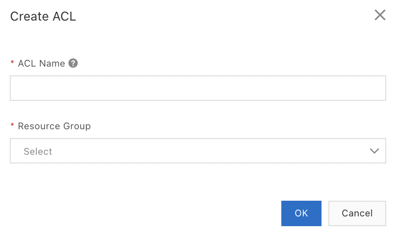{width="1.8873818897637795in"
height="1.116408573928259in"}

### Add IP address entries 

To add IP addresses or CIDR blocks to a network ACL:
-   Go to the `SLB` console,
-   Click on `ALB | Access Control`,
-   Click `Manage ACL` on the line of the ALB instance,

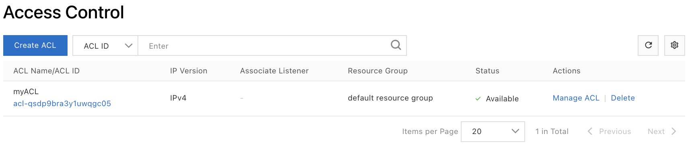{width="4.5in" height="0.9805555555555555in"}
-   Click on `Add Entry` or `Add Multiple Entries`,

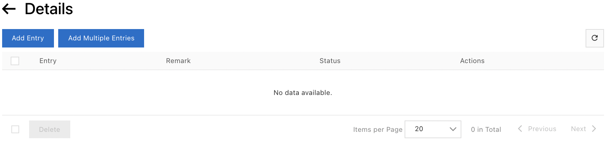{width="4.5in" height="1.0805555555555555in"}
-   `IP Address/CIDR Block`: these are IP addresses or CIDR blocks
    (one entry per line),
-   `Remark`: these are notes,
-   Click on `Add`.

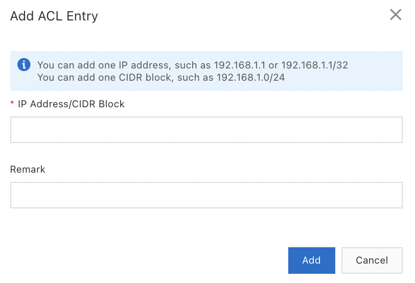{width="2.059701443569554in"
height="1.4052373140857393in"}

### Activate ACL 

To specify white lists or black lists for listeners:
-   Go to the `SLB` console,
-   Click on `ALB | Instances`,
-   Click on the ID of the ALB instance,
-   Click on the `Listener` tab,
-   Click on `View Details` of the line of the listener,
-   Enable access control,

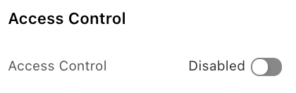{width="0.9624245406824147in"
height="0.3024759405074366in"}
-   `Access Control Method`: this is the access control method; valid
    values are `Whitelist` and `Blacklist`,
-   `Access Control List`: this is the ACL,
-   Click on `OK`.

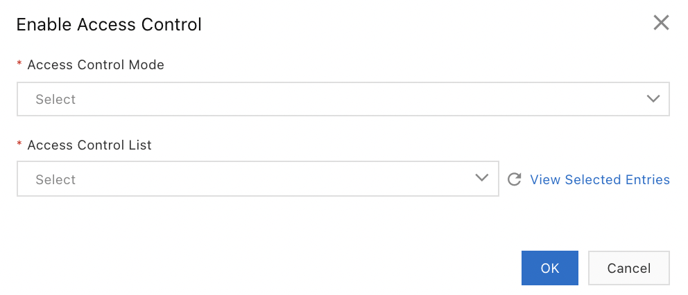{width="2.068594706911636in"
height="0.888409886264217in"}

### Disable ACL

To disable the ACL of a listener:
-   Go to the `SLB` console,
-   Click on `ALB | Instances`,
-   Click on the ID of the ALB instance,
-   Click on the `Listener` tab,
-   Click on `View Details` on the line of the listener,
-   Disable the listener,

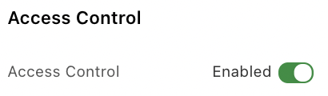{width="1.014517716535433in"
height="0.2969335083114611in"}
-   Click on `OK`.

## The ALB Health Checks 

Health Checks are used to monitor the conditions of server groups. This
allows to evaluate the availability of the backend servers of the server
groups.

Frequent Health Checks can impact the availability of workloads.

To configure Health Checks:
-   Go to the `SLB` console,
-   Click on `ALB | Health Check`,
-   Click on `Create Health Check`,

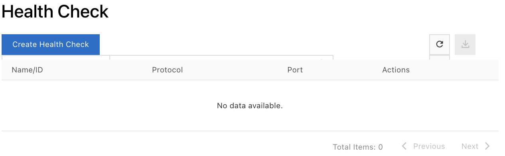{width="3.4190168416447944in"
height="1.0584175415573054in"}
-   `Name`: this is the name,
-   `Protocol:` this is the protocol of the Health Check:

```{=html}
<!-- -->
```
-   `HTTP`: simulates a Web browser accessing resources of the
    instance with `HEAD` or `GET` requests; allows to check if the
    instance is healthy,
-   `TCP`: sends SYN handshake packets to the instance to check if the
    instance is healthy,

```{=html}
<!-- -->
```
-   `Health Check Method` (if `Protocol` is on `HTTP`): this is
    the method used for the HTTP Health Check; valid values are `HEAD`
    and `GET`):

```{=html}
<!-- -->
```
-   `HEAD` (default): backend servers must support `HEAD` requests;
    if not, the `GET` method must be used,
-   `GET`: if the size of the request exceeds 8 Kb, the request is
    truncated; however, this does not affect the result of the Health
    Check,

```{=html}
<!-- -->
```
-   `HTTP Version` (if Health Check `Protocol` is set to `HTTP`):
    this is the HTTP protocol version; valid values are `HTTP1.0` and
    `HTTP1.1`),
-   `Port`: this is the port used by the backend servers for the
    Health Check,
-   `Path`: this is the URL of the Health Check page,
-   `Domain Name`: this is the domain name used for the Health Check,
-   `Normal Status Codes` (if Health Check `Protocol` is on
    `HTTP`): these are the HTTP status codes indicating that the
    Health Check is normal; valid values are `http_2xx` (default),
    `http_3xx`, `http_4xx` and `http_5xx`,
-   `Response Timeout Period`: this is`` the time to wait for a
    response to the Health Check, 5 seconds by default (valid values
    range from 1 to 300 seconds),

If this time is exceeded, the Health Check will fail.
-   `Health Check Interval`: this is the interval between two
    consecutive Health Checks, 2 seconds by default (valid values range
    from 1 to 50 seconds),
-   `Healthy Threshold`: this is`` the number of successful Health
    Checks (3 by default) required for an unhealthy backend server to
    become healthy again (valid values range from 2 to 10),
-   `Unhealthy Threshold`: this is the number of failed Health Checks
    (2 by default) required for a healthy backend server to become
    unhealthy (valid values range from 2 to 10),
-   Click on `Create`.

+-----------------------------------------------------------------------+
| {width="2.6078062117235348in"   |
| height="2.9917333770778654in"}                                        |
|                                                                       |
| {width="2.3739752843394575in"   |
| height="2.458238188976378in"}                                         |
|                                                                       |
| {width="2.446015966754156in"    |
| height="1.8035575240594925in"}                                        |
+=======================================================================+
+-----------------------------------------------------------------------+

## The TLS security policies 

A TLS security policy can be specified when creating a HTTPS listener.
The TLS security policy allows to specify the supported TLS versions as
well as the supported encryption algorithms.

Default security policies:
-   `tls_cipher_policy_1_0`: provides optimal compatibility and basic
    security,
-   `tls_cipher_policy_1_1`: ensures high compatibility and standard
    security,
-   `tls_cipher_policy_1_2`: provides high compatibility and advanced
    security,
-   `tls_cipher_policy_1_2_strict`: supports only PFS (perfect
    forward secrecy) cipher suites and offers optimal security,
-   `tls_cipher_policy_1_2_strict_with_1_3`: supports only PFS
    (perfect forward secrecy) cipher suites and offers optimal security.

To create a custom TLS security policy:
-   Go to the `SLB` console,
-   Click on `ALB | TLS Security policies`,

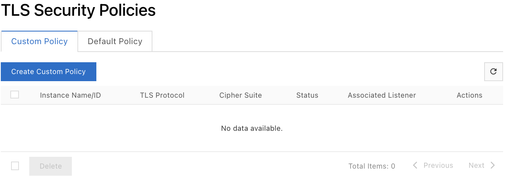{width="3.4903379265091865in"
height="1.2463943569553806in"}
-   Click on `Create Custom Policy`,
-   `Name`: this is the name of the TLS security policy,
-   `Minimal Version`: this`` is the version to create:

```{=html}
<!-- -->
```
-   TLS 1.0 or later,
-   TLS 1.1 or later,
-   TLS 1.2 or later,

```{=html}
<!-- -->
```
-   `Enable TLS 1.3`: indicates whether TLS 1.3 is enabled; to do so,
    the selected cipher suite must support TLS 1.3,
-   `Cipher Suite`: this is`` the cipher suite to be used; it must
    be supported by the specified TLS version,
-   Click on `Create`.

{width="1.874511154855643in"
height="1.6199464129483814in"}

