Alibaba Cloud Guide

Bruno Delb

Copyright © 2021 Bruno Delb

All rights reserved.

ISBN: 979-10-92929-06-5

*To my children, Vincent and Julie.*

TABLE OF CONTENTS

[Introduction [1](#introduction)](#introduction)

[I. VPC [3](#vpc)](#vpc)

[1. The VPC and classic networks
[4](#the-vpc-and-classic-networks)](#the-vpc-and-classic-networks)

[2. The VPC [4](#the-vpc)](#the-vpc)

[3. The VRouter [9](#the-vrouter)](#the-vrouter)

[4. The vSwitch [10](#the-vswitch)](#the-vswitch)

[5. The VPC and the default vSwitch
[13](#the-vpc-and-the-default-vswitch)](#the-vpc-and-the-default-vswitch)

[6. The Network ACLs [13](#the-network-acls)](#the-network-acls)

[7. To go further [18](#to-go-further)](#to-go-further)

[II. RAM [20](#ram)](#ram)

[1. The users [21](#the-users)](#the-users)

[2. The groups [24](#the-groups)](#the-groups)

[3. The Roles [26](#the-roles)](#the-roles)

[4. Access control to resources
[30](#access-control-to-resources)](#access-control-to-resources)

[5. Authorization policies
[31](#authorization-policies)](#authorization-policies)

[III. EIP [38](#eip)](#eip)

[1. The different types of IP addresses
[39](#the-different-types-of-ip-addresses)](#the-different-types-of-ip-addresses)

[2. EIP Association [39](#eip-association)](#eip-association)

[3. The bandwidth [42](#the-bandwidth)](#the-bandwidth)

[IV. ECS [45](#ecs)](#ecs)

[1. The ECS instance [46](#the-ecs-instance)](#the-ecs-instance)

[2. Creation of an instance
[48](#creation-of-an-instance)](#creation-of-an-instance)

[3. Creation of an instance from a custom image
[53](#creation-of-an-instance-from-a-custom-image)](#creation-of-an-instance-from-a-custom-image)

[4. Using the Launch Template
[55](#using-the-launch-template)](#using-the-launch-template)

[5. Modification of an ECS instance
[59](#modification-of-an-ecs-instance)](#modification-of-an-ecs-instance)

[6. Changing the IP address
[66](#changing-the-ip-address)](#changing-the-ip-address)

[7. Management of the instance life cycle
[70](#management-of-the-instance-life-cycle)](#management-of-the-instance-life-cycle)

[8. The identity of the instance, the metadata and the User Data
[75](#the-identity-of-the-instance-the-metadata-and-the-user-data)](#the-identity-of-the-instance-the-metadata-and-the-user-data)

[9. Connection to an ECS instance
[79](#connection-to-an-ecs-instance)](#connection-to-an-ecs-instance)

[10. The Images [86](#the-images)](#the-images)

[11. The Tags [95](#the-tags)](#the-tags)

[12. The disks [99](#the-disks)](#the-disks)

[13. The Security groups
[110](#the-security-groups)](#the-security-groups)

[14. THE ENI [121](#the-eni)](#the-eni)

[15. The Snapshots [128](#the-snapshots)](#the-snapshots)

[16. Monitoring [135](#monitoring)](#monitoring)

[17. The Deployment Sets
[140](#the-deployment-sets)](#the-deployment-sets)

[V. Auto Scaling [144](#auto-scaling)](#auto-scaling)

[1. The Scaling Group [145](#the-scaling-group)](#the-scaling-group)

[2. The Scaling rules [152](#the-scaling-rules)](#the-scaling-rules)

[3. The hooks [155](#the-hooks)](#the-hooks)

[4. The configuration of the instances
[157](#the-configuration-of-the-instances)](#the-configuration-of-the-instances)

[5. The tasks [160](#the-tasks)](#the-tasks)

[6. The management of the instances
[164](#the-management-of-the-instances)](#the-management-of-the-instances)

[7. Monitoring [171](#monitoring-1)](#monitoring-1)

[VI. NAT gateway [178](#nat-gateway)](#nat-gateway)

[1. The concepts of DNAT and SNAT
[179](#the-concepts-of-dnat-and-snat)](#the-concepts-of-dnat-and-snat)

[2. Management of a NAT gateway
[179](#management-of-a-nat-gateway)](#management-of-a-nat-gateway)

[3. Management of a DNAT table
[180](#management-of-a-dnat-table)](#management-of-a-dnat-table)

[4. Management of a SNAT table
[182](#management-of-a-snat-table)](#management-of-a-snat-table)

[5. Association and disassociation of an EIP with a NAT Gateway
[184](#association-and-disassociation-of-an-eip-with-a-nat-gateway)](#association-and-disassociation-of-an-eip-with-a-nat-gateway)

[6. Protection of a NAT Gateway with Anti-DDoS
[185](#protection-of-a-nat-gateway-with-anti-ddos)](#protection-of-a-nat-gateway-with-anti-ddos)

[VII. CLB [186](#clb)](#clb)

[1. The CLB instance [187](#the-clb-instance)](#the-clb-instance)

[2. The incoming and outgoing flows
[188](#the-incoming-and-outgoing-flows)](#the-incoming-and-outgoing-flows)

[3. The life cycle of a CLB instance
[189](#the-life-cycle-of-a-clb-instance)](#the-life-cycle-of-a-clb-instance)

[4. Tag association [192](#tag-association)](#tag-association)

[5. The Listeners [193](#the-listeners)](#the-listeners)

[6. The Health Check [209](#the-health-check)](#the-health-check)

[7. The backend servers
[214](#the-backend-servers)](#the-backend-servers)

[8. Management of the Certificates
[219](#management-of-the-certificates)](#management-of-the-certificates)

[9. The logs [229](#the-logs)](#the-logs)

[10. Access control with ACLs
[240](#access-control-with-acls)](#access-control-with-acls)

[11. Traffic monitoring [242](#traffic-monitoring)](#traffic-monitoring)

[12. The API Inspector [244](#the-api-inspector)](#the-api-inspector)

[13. Optimization [245](#optimization)](#optimization)

[VIII. ALB [248](#alb)](#alb)

[1. Introduction to ALB
[249](#introduction-to-alb)](#introduction-to-alb)

[2. Creation of an ALB instance
[250](#creation-of-an-alb-instance)](#creation-of-an-alb-instance)

[3. Changing the zones of an ALB instance
[255](#changing-the-zones-of-an-alb-instance)](#changing-the-zones-of-an-alb-instance)

[4. Configuration of the protection against deletion
[256](#configuration-of-the-protection-against-deletion)](#configuration-of-the-protection-against-deletion)

[5. Adding tags [257](#adding-tags)](#adding-tags)

[6. The Listeners [257](#the-listeners-1)](#the-listeners-1)

[7. The Forward rules [265](#the-forward-rules)](#the-forward-rules)

[8. Management of the Certificates
[270](#management-of-the-certificates-1)](#management-of-the-certificates-1)

[9. The backend server groups
[271](#the-backend-server-groups)](#the-backend-server-groups)

[10. Securing with ACLs [278](#securing-with-acls)](#securing-with-acls)

[11. The ALB Health Checks
[281](#the-alb-health-checks)](#the-alb-health-checks)

[12. The TLS security policies
[283](#the-tls-security-policies)](#the-tls-security-policies)

[IX. OSS [285](#oss)](#oss)

[1. The storage classes
[287](#the-storage-classes)](#the-storage-classes)

[2. Connection to the OSS console
[288](#connection-to-the-oss-console)](#connection-to-the-oss-console)

[3. Management of the bucket
[289](#management-of-the-bucket)](#management-of-the-bucket)

[4. The bucket management rules
[301](#the-bucket-management-rules)](#the-bucket-management-rules)

[5. The access control [313](#the-access-control)](#the-access-control)

[6. The bucket encryption
[317](#the-bucket-encryption)](#the-bucket-encryption)

[7. Creation of a website
[318](#creation-of-a-website)](#creation-of-a-website)

[8. Acceleration of a domain name
[322](#acceleration-of-a-domain-name)](#acceleration-of-a-domain-name)

[9. The back-to-origin rules
[335](#the-back-to-origin-rules)](#the-back-to-origin-rules)

[10. Monitoring [338](#monitoring-2)](#monitoring-2)

[11. Inter-regional replication
[342](#inter-regional-replication)](#inter-regional-replication)

[12. Image processing [345](#image-processing)](#image-processing)

[X. CDN [347](#cdn)](#cdn)

[1. Basic and origin server configuration
[349](#basic-and-origin-server-configuration)](#basic-and-origin-server-configuration)

[2. HTTPS acceleration [351](#https-acceleration)](#https-acceleration)

[3. Back-to-origin configuration
[359](#back-to-origin-configuration)](#back-to-origin-configuration)

[4. The cache [368](#the-cache)](#the-cache)

[5. The access control
[375](#the-access-control-1)](#the-access-control-1)

[6. Performance optimization
[381](#performance-optimization)](#performance-optimization)

[7. The Video service [384](#the-video-service)](#the-video-service)

[8. EdgeScript and EdgeRoutine
[386](#edgescript-and-edgeroutine)](#edgescript-and-edgeroutine)

[9. Monitoring [387](#monitoring-3)](#monitoring-3)

[10. The logs [391](#the-logs-1)](#the-logs-1)

[XI. Apsara for MySQL [394](#apsara-for-mysql)](#apsara-for-mysql)

[1. The different database engines
[395](#the-different-database-engines)](#the-different-database-engines)

[2. The RDS instance [396](#the-rds-instance)](#the-rds-instance)

[3. The account [402](#the-account)](#the-account)

[4. The database [404](#the-database)](#the-database)

[5. The instance parameters
[406](#the-instance-parameters)](#the-instance-parameters)

[6. Securing [408](#securing)](#securing)

[7. Connection [413](#connection)](#connection)

[8. The read-only instances
[416](#the-read-only-instances)](#the-read-only-instances)

[9. The database proxies
[419](#the-database-proxies)](#the-database-proxies)

[10. The disaster Recovery
[420](#the-disaster-recovery)](#the-disaster-recovery)

[11. Modification of the instance
[423](#modification-of-the-instance)](#modification-of-the-instance)

[12. Upgrade of the RDS instance
[427](#upgrade-of-the-rds-instance)](#upgrade-of-the-rds-instance)

[13. Migration [428](#migration)](#migration)

[14. Monitoring and auditing
[429](#monitoring-and-auditing)](#monitoring-and-auditing)

[15. Backing up a database
[434](#backing-up-a-database)](#backing-up-a-database)

[16. Billing [447](#billing)](#billing)

[XII. DNS [448](#dns)](#dns)

[1. Management of the Domain names
[449](#management-of-the-domain-names)](#management-of-the-domain-names)

[2. Management of the groups
[451](#management-of-the-groups)](#management-of-the-groups)

[3. Management of the DNS records
[452](#management-of-the-dns-records)](#management-of-the-dns-records)

[4. Import and export of DNS records
[458](#import-and-export-of-dns-records)](#import-and-export-of-dns-records)

[5. DNS optimization [459](#dns-optimization)](#dns-optimization)

[6. Securing [463](#securing-1)](#securing-1)

[7. Monitoring [465](#monitoring-4)](#monitoring-4)

[XIII. Cloud Monitor [466](#cloud-monitor)](#cloud-monitor)

[1. The application groups
[467](#the-application-groups)](#the-application-groups)

[2. The alarm templates
[469](#the-alarm-templates)](#the-alarm-templates)

[3. The contacts [471](#the-contacts)](#the-contacts)

[4. Alarm rules [473](#alarm-rules)](#alarm-rules)

[5. Host monitoring [475](#host-monitoring)](#host-monitoring)

[6. Event monitoring [480](#event-monitoring)](#event-monitoring)

[7. Customized monitoring
[483](#customized-monitoring)](#customized-monitoring)

[8. Site monitoring [489](#site-monitoring)](#site-monitoring)

[9. The dashboard [492](#the-dashboard)](#the-dashboard)

[XIV. Anti-DDoS [496](#anti-ddos)](#anti-ddos)

[1. The different solutions offered
[497](#the-different-solutions-offered)](#the-different-solutions-offered)

[2. The Traffic Security Manager
[498](#the-traffic-security-manager)](#the-traffic-security-manager)

[3. Anti-DDoS Origin on demand
[501](#anti-ddos-origin-on-demand)](#anti-ddos-origin-on-demand)

[4. Cleaning configuration
[502](#cleaning-configuration)](#cleaning-configuration)

[5. The bodies [504](#the-bodies)](#the-bodies)

[6. The blackhole policies
[505](#the-blackhole-policies)](#the-blackhole-policies)

[XV. Container Registry [509](#container-registry)](#container-registry)

[1. The namespaces [510](#the-namespaces)](#the-namespaces)

[2. The repositories [511](#the-repositories)](#the-repositories)

[3. The builds [512](#the-builds)](#the-builds)

[4. Access control to repositories
[515](#access-control-to-repositories)](#access-control-to-repositories)

[5. Image security scan
[516](#image-security-scan)](#image-security-scan)

[XVI. Case study [517](#case-study)](#case-study)

[1. Launching a web server on an ECS instance
[518](#launching-a-web-server-on-an-ecs-instance)](#launching-a-web-server-on-an-ecs-instance)

[2. Creating a mySQL RDS database
[528](#creating-a-mysql-rds-database)](#creating-a-mysql-rds-database)

[3. Hosting of a static website on OSS and distribution via CDN
[534](#hosting-of-a-static-website-on-oss-and-distribution-via-cdn)](#hosting-of-a-static-website-on-oss-and-distribution-via-cdn)

# Introduction  {#introduction .list-paragraph}

Founded in 2009 as Aliyun to meet the internal needs of the Alibaba
eco-system, Aliyun became Alibaba Cloud in 2017. To date, Alibaba Cloud
dominates the cloud market in China and Asia while AWS dominates the
market outside Asia. As a result, Alibaba Cloud holds 40% of the Chinese
market while it is fourth in the world, behind AWS and Azure.

Alibaba Cloud can also count on the immensity of China to launch
full-scale experiments and improve its technologies at a speed unmatched
anywhere in the world. This is being done in particular in the field of
artificial intelligence and Deep Learning. One example among many, City
Brain, which was launched in 2017 at the Computing Conference. City
Brain optimizes urban traffic in real time: traffic lights, requesting a
police patrol, adapting the pace of public transport according to the
traffic in real time, etc \...

Alibaba Cloud also differentiates itself in other ways. For example,
Alibaba Cloud offers a huge number of services, many of which are not
available at AWS. Other cloud providers are far behind.

It also differentiates itself on price, offering rates in the vast
majority significantly lower than AWS. Security is also taken into
account at all levels on Alibaba Cloud, as in ECS instances.

For western companies wishing to have a presence in China, Alibaba Cloud
is the obvious choice because of its leadership position and because
Alibaba Cloud takes into account China\'s regulatory requirements at the
technical level and provides support for Internet Content Provider (ICP)
processes that range from deploying a website in mainland China to
generating revenue or providing a platform in China.

In this book, you will discover the essential services of Alibaba.
We\'ll start with the basics, setting up a network with VPC and VSwitch.
Then we will see how to manage users with RAM. We will then use an
essential service, virtual machines with ECS and then scaling these ECS
instances with Auto Scaling and high availability with Load Balancing
with SLB. We will also look at object storage with OSS and accelerated
content distribution with CDN and DNS record management. Then we will
study databases with RDS focusing on the MySQL engine. Then we will
implement Cloud Monitor and secure Cloud services with Anti-DDoS.
Finally, we will implement Docker image storage with Container Registry.

We will then look at three case studies. The first one is the launch of
an ECS instance which allows for example to run Docker containers or to
install other software. The second is the creation of a RDS database
with the MySQL engine. The third is the hosting of a static website on
OSS and its distribution via CDN.

# VPC

Alibaba Cloud is a public cloud. VPC (Virtual Private Cloud) allows to
create your own private cloud within the Alibaba public cloud.

Specifically, VPC allows to create an isolated network environment on
Alibaba Cloud.

You can specify the IP address space and a CIDR (Classless Inter-Domain
Routing) block. The CIDR block is a method of allocating IP addresses. A
routing table is used to define the routes of packets.

NACLs (Network Access Control Lists) are used to manage network access
permissions at the VPC level using rules.

The vSwitch is used to connect cloud resources to a VPC. A default VPC
and vSwitch are created automatically.

The VRouter is a hub in a VPC, connecting the vSwitches of the VPC and
serving as a gateway to connect the VPC to other networks.

It is possible to establish a connection between the Alibaba Cloud VPC
and an existing data center via a physical connection or VPN,
facilitating a migration to the cloud.

## The VPC and classic networks 

The network can be of two types: VPC-based or traditional. Services
deployed within a classic network are deployed within the Alibaba Cloud
infrastructure while services deployed within a VPC network are deployed
in an isolated virtual environment within the Alibaba Cloud.

With the VPC network, private IP addresses are unique at the VPC level
while with the classic network, they are unique at the network level.
This means that two VPCs can have the same private IP address.

Moreover, with the VPC network, the instances can only communicate with
the instances of the same VPC, while with the classic network they can
communicate with all the instances of the same account and region.

## The VPC 

The VPC (Virtual Private Cloud) is a custom virtual private cloud. It is
possible to create instances of Alibaba Cloud products in these VPCs. It
is region specific and fully isolated.

VPCs can communicate with IPv4 or IPv6 addresses, although IPv4 is the
default protocol.

The VPC can communicate with the Internet using a NAT Gateway or an EIP
associated with an ECS instance.

It can also communicate with a Data Center or another VPC using Express
Connect, VPN Gateway or SAG (Smart Access Gateway).

By using Express Connect to interconnect VPCs, communication is done
through the Intranet. By avoiding the Internet, data is better protected
against theft. This also prevents the instability of the Internet
quality. Finally, it is possible to make VPCs from different regions
communicate.

There can be a maximum of two VPCs per account. It is possible to lift
this limit. To do so, you need to open a ticket for it.

To secure the data transmission, security isolation is provided with L2
logical isolation.

### VPC isolation 

Isolation is thus ensured at different levels:

-   ECS instances of different users are located in different VPCs,

-   VPCs are isolated using a tunnel ID,

-   vSwitches and VRouters are used to divide the VPC into subnets,

-   the ECS instances of a subnet are interconnected through the same
    vSwitch,

-   To interconnect VPCs, you must use a public IP address (EIP or IP
    NAT),

-   Security groups manage access control to ECS instances in a VPC
    (layer 3).

### CIDR blocks 

A CIDR (Classless Inter-Domain Routing) block is a method of allocating
IP addresses. It replaces the old system based on classes A, B and C.

The CIDR blocks available for VPCs are \`192.168.0.0/16\`,
\`172.16.0.0/12 \`and \`10.0.0.0/8\`. The subnet mask, specified after
the \`/\`, must be between 8 and 24 bits long.

The CIDR blocks of the VPC cannot be modified once created. It is
therefore important to plan them broadly enough from the start. However,
it is possible to create a second CIDR, but it must be associated with a
different vSwitch.

### VPC management 

We will see how to display, create, modify and delete a VPC.

To create a VPC, you must specify:

-   a private network segment in the form of a CIDR block,

-   a vSwitch.

To create a VPC in the console:

-   Go to the \`VPC \`console,

-   Click on VPCs,

{width="4.5in" height="2.8125in"}

-   Select the region,

-   Click on \`Create VPC\`,

-   Enter the name of the VPC,

-   Refer to the CIDR,

-   Optionaly enter the description,

-   Click on \`OK\`.

{width="4.5in"
height="2.5555555555555554in"}

{width="4.5in" height="3.04375in"}

The VPC is created when its status changes to \`Available\`.

To view information about a VPC:

-   Go to the \`VPC \`console,

-   Click on \`VPCs\`,

-   Select the region,

-   Click on the instance ID.

The basic information about the VPC are displayed: name, ID, status,
region, CIDR, default VPC, creation date and time, \...

{width="4.5in" height="1.69375in"}

Information about the deployed resources are also displayed (ECS
instances, SLB, vSwitch, security groups).

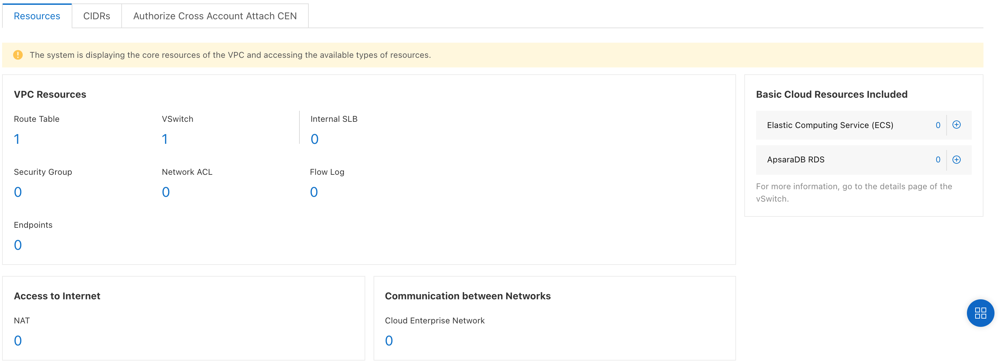{width="4.5in" height="1.6402777777777777in"}

The default VPCs are marked as \`Default\`.

To edit a VPC:

-   Go to the \`VPC \`console,

-   Click on \`VPCs\`,

-   Select the region,

-   Click on the instance ID,

-   To change the name of the VPC, click on \`Edit \`next to \`Name\`,

-   To change the description of the VPC, click on \`Edit \`next to
    \`Description\`.

To add a second CIDR block to a VPC:

-   Go to the \`VPC \`console,

-   Click on \`VPCs\`,

-   Select the region,

-   Click on \`Manage \`on the VPC line,

-   Click on \`CIDRs\`,

-   Click on \`Add IPv4 CIDR\`,

-   \`VPC\`: this is the VPC to which the CIDR block is added,

-   \`Secondary CIDR\`: this\` \`is the configuration method of the
    second CIDR block:

```{=html}
<!-- -->
```
-   \`Default CIDR Block\`: specifies the CIDR block,

-   \`Custom CIDR Block\`: specifies the CIDR block and the subnet,

```{=html}
<!-- -->
```
-   Click on \`OK\`.

The secondary CIDR block comes from the list of default CIDR blocks:
\`192.168.0.0/16\`, \`172.16.0.0/12\` and \`10.0.0.0/8\`.

To delete a VPC:

-   Go to the \`VPC \`console,

-   Click on \`VPCs\`,

-   Select the region,

-   Click on the ID of the VPC to be deleted,

-   Click on the trash can icon.

To delete a VPC, you must first delete all instances of the VPC.

## The VRouter 

The VRouter is a hub in a VPC, connecting the vSwitches of the VPC and
serving as a gateway to connect the VPC to other networks. A VPC can
only have one VRouter.

It is created automatically at the same time as the VPC and is destroyed
at the same time as the VPC.

The VRouter supports static routing (except ECMP equal cost routes) but
not dynamic routing (such as BGP and OSPF).

Each VRouter has a single routing table. This routing table contains a
list of routing entries. These entries affect all instances of the VPC.

Each entry in the routing table defines the \"next hop\", i.e. the next
destination of the data packets when routing the traffic. These entries
can be system or custom.

The \"system\" entries cannot be created or deleted. When a VPC is
created, a system route is automatically created to go from the VPC
instances to outside the VPC. In contrast, \"custom\" entries can be
created and deleted by users.

You cannot delete a routing table:

-   it is created automatically when the VPC is created,

-   it is deleted when the VPC is deleted.

Isolation is achieved through tunneling technology. Each VPC has a
unique tunnel ID. This tunnel ID is encapsulated in each data packet
transmitted between ECS instances within a VPC. Communication between
two tunnels is therefore impossible.

To create a routing table:

-   Go to the \`VPC \`console,

-   Click on \`VPC\`,

-   Select the region,

-   Click \`Route Tables\`,

-   Click \`Create Route Table\`,

-   \`Resource Group:\` this is\` \`the name of the group,

-   \`VPC\`: this is the VPC,

-   \`Name\`: this is the name of the routing table,

-   \`Description\`: this is the description,

-   Click on \`OK\`.

{width="2.8492508748906387in"
height="1.6260072178477691in"}

To add an entry to a routing table:

-   Go to the \`VPC \`console,

-   Click on \`VPC\`,

-   Select the region,

-   Click \`Route Tables\`,

-   Click on the instance ID,

-   Click on \`Create Route entry\`,

-   Click on the \`Custom \`tab,

-   Click \`Add Route Entry\`,

-   \`Name\`: this is\` \`the name of the entry,

-   \`Destination CIDR Block:\` this\` \`is the destination CIDR block,

-   \`Next Hop Type\`: this is the type of instance (\`ECS Instance\`,
    \`VPN Gateway\`, \`NAT Gateway\`, \`Secondary ENI \`or \`Forwarding
    Router\`),

-   Click on \`OK\`.

To delete a routing entry:

-   Go to the \`VPC \`console,

-   Click \`Route Tables\`,

-   Select the region,

-   Click on the instance ID,

-   Click on the \`Route Entry List \`tab,

-   Click on \`Delete \`on the line of the entry.

## The vSwitch 

The vSwitch is used to connect Cloud resources to a VPC. When creating
an instance of a Cloud product, you must specify the vSwitch in which
this instance is located.

When creating a vSwitch, you must specify a CIDR block. This CIDR block
must belong to the CIDR block of the VPC where the vSwitch is located.

The first and last three IP addresses of the CIDR block are reserved.
The remaining IP addresses are used to provide private IP addresses.

This CIDR block cannot conflict with a CIDR block of an existing
vSwitch. It also cannot contain a destination network segment in an
existing custom route.

An ECS instance can be migrated from one vSwitch to another provided it
is under the same VRouter of the same VPC.

To create a vSwitch from the console:

-   Go to the \`VPC \`console,

-   Select the region,

-   Click on \`vSwitches\`,

-   Click on \`Create vSwitch\`,

-   \`Resource Group\`: this is the resource group in which to add the
    vSwitch,

-   \`Name\`: this is the name of the vSwitch,

-   \`VPC\`: this is the VPC (not modifiable),

-   \`CIDR\`: this is the CIDR block of the VPC, displayed once the VPC
    is selected,

-   \`Zone\`: this is the zone,

-   \`IPv4 CIDR Block\`: this is the CIDR block of the VPC,

-   \`Description\`: this is the description,

-   Click on \`OK\`.

The subnet mask must be between 16 and 29. The available private IP
addresses come from this CIDR block.

{width="3.089229002624672in"
height="3.6846675415573054in"}

To modify a vSwitch:

-   Go to the \`VPC \`console,

-   Click on \`VPCs\`,

-   Select the region,

-   Click on \`vSwitches\`,

-   Click on the vSwitch ID,

-   Click \`Edit \`next to the vSwitch name or description.

To delete a vSwitch:

-   Go to the \`VPC \`console,

-   Click on \`VPCs\`,

-   Select the region,

-   Click on the vSwitch ID,

-   Click on \`Delete\`.

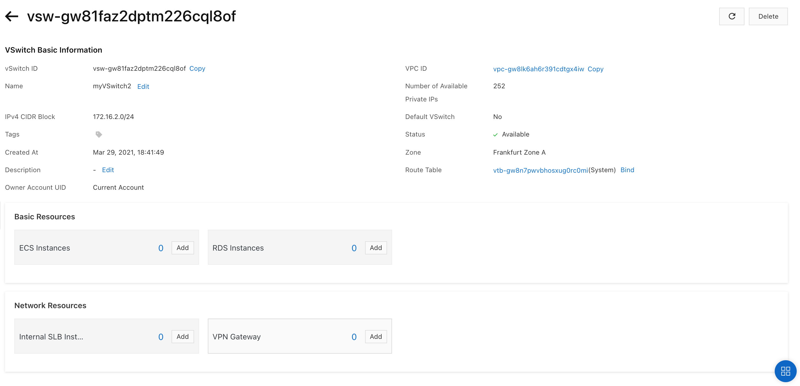{width="4.5in" height="2.1770833333333335in"}

Before you can delete a vSwitch, you must delete all instances connected
to that vSwitch.

## The VPC and the default vSwitch 

A default VPC and vSwitch are created automatically to simplify the
setup of product instances. There is only one default VPC per region and
one default vSwitch per zone.

Default VPCs and default vSwitches are not included in the allocated VPC
and vSwitch quotas.

They cannot be created manually. If they have been deleted, they will be
recreated when they are needed, when an instance is created.

The default CIDR mask for a VPC is 16 bits (\`/16\`), which can provide
up to 65,536 private IP addresses. The default CIDR mask of a vSwitch is
20 bits (\`/20\`), which can provide up to 4096 private IP addresses.

## The Network ACLs 

NACLs (Network Access Control Lists) are used to manage network access
permissions at the VPC level using rules.

Once associated with a vSwitch, a network ACL controls the incoming and
outgoing traffic of the ECS instances associated with that vSwitch. The
network ACL and the vSwitch must be in the same VPC. In addition, a
vSwitch can only be associated with one NACL.

Network ACLs are stateless. This means that you must define incoming and
outgoing rules independently. A stateless network ACL denies all
incoming and outgoing access.

The network ACL does not filter traffic between ECS instances associated
with the vSwitch.

A rule includes the following information:

-   \`Priority\`: this is the priority,

-   \`Policy\`: this\` \`is the policy, which can be to allow
    (\`allow\`) traffic or to deny (\`deny\`) it,

-   \`Protocol\`: this is\` \`the type of protocol (\`All\`, \`ICMP\`,
    \`GRE\`, \`TCP \`or \`UDP\`),

-   \`Source CIDR block\`: this is the source CIDR block from which
    incoming traffic is transmitted,

-   \`Destination CIDR block\`: this is the destination CIDR block to
    which outgoing traffic is transmitted,

-   \`Destination port range\`: this is\` \`the destination port range
    to which the incoming rule applies,

-   \`Destination port range\`: this is\` \`the range of destination
    ports to which the outbound rule applies.

The smaller the value of the priority, the higher the priority. The
rules are therefore applied starting from priority 1 and the evaluation
stops as soon as a rule is applied.

When creating a network ACL, an inbound rule (with \`Source CIDR
block\`) and an outbound rule (with \`Destination CIDR block\`) are
created by default:

-   \`Priority\`: \`1\`

-   \`Protocol:\` \`all\`

-   \`Source CIDR block/Destination CIDR block:\` \`0.0.0.0/0\`

-   \`Destination port range:\` \`-1/-1\`

-   \`Action:\` \`Allow\`

-   \`Type:\` \`Custom\`

Let\'s look at the difference between the network ACLs of vSwitches and
the security groups of ECS instances.

Network ACLs are called stateless because the returned traffic must be
explicitly allowed by a rule. Security groups are called stateful
because the returned traffic is automatically authorized.

A vSwitch can only have one network ACL associated with it, while an ECS
instance can have multiple security groups associated with it.

Finally, with network ACLs, the evaluation stops at the first rule
checked, whereas with security groups, all rules are evaluated.

At the time of writing this book, network ACLs are not yet public. To
benefit from them, you may have to open a ticket.

To create a network ACL with the console Managing network ACLs with the
console:

-   Go to the \`VPC \`console,

-   Click on \`ACL \| Network ACL\`,

-   Select a region,

-   Click on \`Create Network ACL\`,

-   \`VPC\`: this is the VPC where the network ACL is created,

-   \`Name\`: this is\` \`the name,

-   \`Description\`: this is the description,

-   Click on \`OK\`.

The network ACL must be in the same region as the VPC. Please note that
not all instance families support NACLs.

It is possible to create rules. Rules are either inbound or outbound.
Inbound rules indicate whether a vSwitch\'s ECS instances are accessible
from the Internet or private networks. Outbound rules manage the access
of a vSwitch\'s ECS instances to the Internet or to private networks.

To create a rule:

-   Go to the \`VPC \`console,

-   Click on \`ACL \| Network ACL\`,

-   Select a region,

-   Click on the instance ID,

To create an inbound rule:

-   Click on the \`Inbound Rule \`tab,

-   Click \`Manage Inbound Rule\`,

-   \`Priority\`: this is the order in which the incoming rules take
    effect,

To change the priority, you must drag the rules to reorder them.

-   \`Rule Name\`: this is\` \`the name of the rule,

-   \`Action\`: this is\` \`the action of the rule; valid values are:

```{=html}
<!-- -->
```
-   \`Accept\`: the ECS instances in the vSwitch are accessible,

-   \`Drop\`: ECS instances in the vSwitch are not accessible,

```{=html}
<!-- -->
```
-   \`Protocol:\` this is the layer 4 protocol; the values are:

```{=html}
<!-- -->
```
-   \`ALL\`: all protocols,

-   \`ICMP\`: ICMP (Internet Control Message Protocol),

-   \`GRE\`: GRE (Generic Routing Encapsulation),

-   \`TCP\`: TCP (Transmission Control Protocol),

-   \`UDP\`: UDP (User Datagram Protocol),

```{=html}
<!-- -->
```
-   \`Source IP Address\`: this is the source CIDR block to which the
    data is transmitted (default value \`0.0.0.0/32\`),

-   \`Source Port Range\`: this is the range of source ports.

{width="4.5in"
height="1.6118055555555555in"}

ACL rules take effect in descending order of priority: a lower value
indicates a higher priority.

Port ranges are defined in the format \`\<FIRST_PORT\>/\<LAST_PORT\>.\`
Each port is a value that can range from 1 to 65535. \`-1/-1 \`indicates
that all ports are available.

To create an outbound rule:

-   Click on the \`Outbound Rule \`tab,

-   Click \`Manage Outbound Rule\`,

-   \`Priority\`: this is the order in which the incoming rules take
    effect,

To change the priority, you must drag the rules to reorder them.

-   \`Rule Name\`: this is\` \`the name of the rule,

-   \`Action\`: this is\` \`the action of the rule; valid values are:

```{=html}
<!-- -->
```
-   \`Accept\`: the ECS instances in the vSwitch are accessible,

-   \`Drop\`: ECS instances in the vSwitch are not accessible,

```{=html}
<!-- -->
```
-   \`Protocol:\` this is the layer 4 protocol; the values are:

```{=html}
<!-- -->
```
-   \`ALL\`: all protocols,

-   \`ICMP\`: ICMP (Internet Control Message Protocol),

-   \`GRE\`: GRE (Generic Routing Encapsulation),

-   \`TCP\`: TCP (Transmission Control Protocol),

-   \`UDP\`: UDP (User Datagram Protocol),

```{=html}
<!-- -->
```
-   \`Destination IP Address\`: this is the destination CIDR block to
    which the data is transmitted (default value \`0.0.0.0/32\`),

-   \`Destination Port Range\`: this is the range of destination ports.

{width="4.5in"
height="1.5840277777777778in"}

To associate a network ACL with a vSwitch:

-   Go to the \`VPC \`console,

-   Click on \`ACL \| Network ACL\`,

-   Select a region,

-   Click on \`Associate vSwitch \`on the NACL line,

-   Click on the \`Resources \`tab,

-   Click on \`Associate vSwitch\`,

-   Select the vSwitch,

-   Click on \`Associate\`.

{width="3.2634208223972005in"
height="2.6706660104986875in"}

To unlink a network ACL from a vSwitch:

-   Go to the \`VPC \`console,

-   Click on \`Network ACL\`,

-   Select a region,

-   Click on \`Associate vSwitch \`on the NACL line,

-   Click on the \`Associate vSwitch \`tab,

-   Click on \`Unbind \`on the vSwitch line,

-   Click on \`OK\`.

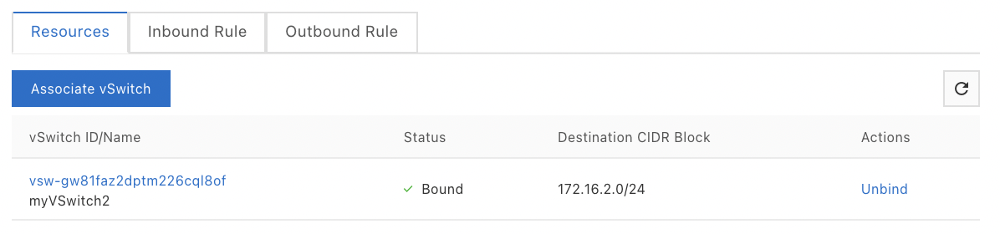{width="4.218231627296588in"
height="0.9875087489063867in"}

The network ACL no longer controls the traffic of ECS instances in the
vSwitch.

To delete a network ACL:

-   Go to the \`VPC \`console,

-   Click on \`Network ACL,\`

-   Select a region,

-   Click on \`Delete \`on the NACL line,

-   Click on \`OK\`.

## To go further 

Shared VPCs allow multiple Alibaba Cloud accounts to share resources
from a shared VPC.

A VPC can be attached to a CEN (Cloud Enterprise Network) of the same or
another account. The CEN instance allows a private connection to be
established between two VPCs or between a VPC network and an on-premises
data center.

ClassicLink allows ECS instances connected to a classic network to
communicate with resources located in a VPC. These ECS instances can
only be connected to one VPC network of the same region and created with
the same account. They can only communicate with the ECS instances of
the primary CIDR block of the VPC. Several conditions must be met in
order to activate ClassicLink. See the documentation for details.

A HAVIP (High-Availability Virtual IP Address) is a private IP address
that can be created and released as a resource. HAVIPs can be used with
High Availability (HA) software. Each ECS instance has one private IP
address (a primary IP address). To increase the number of available
private IP addresses, you can associate HAVIPs with this ECS instance.
HAVIPs are floating private IP addresses: they can be associated with or
dissociated from ECS instances or ENIs by ARP announcements. The ECS or
ENI instance must belong to the same subnet as the HAVIP, i.e. to the
same vSwitch.

At the time of this writing, HAVIPs are not yet public. To benefit from
them, you may need to open a ticket.

VPC Flow provides flow logs of the incoming and outgoing traffic of the
ENIs of a VPC or vSwitch. These logs are used to monitor network traffic
and troubleshoot network problems. These logs are stored in the Log
Service. The maximum duration of the capture of this information is
about 10 minutes. At the time of writing, VPC Flow is not yet public. To
benefit from it, you may have to open a ticket.

DHCP (Dynamic Host Configuration Protocol) is used to transmit IP
addresses and domain names from DNS servers to servers on a network,
including ECS instances. By default, the IP addresses of Alibaba Cloud
DNS servers are stored on ECS instances. But private domain names cannot
be resolved by Alibaba Cloud DNS. The DHCP option set allows to define a
DNS configuration that is associated with the VPC. New ECS instances
deployed in this VPC then use this configuration.

At the time of writing this book, DHCP Options Set is not yet public. To
take advantage of it, you may have to open a ticket.

# RAM 

RAM (Resource Access Management) allows to manage the identity and
authorizations of users.

Users can be grouped into groups. Roles can be used to define virtual
users as well as authorization policies to control access to resources.
Finally, access can be secured by implementing dual authentication
(MFA).

## The users 

The RAM-User is an identity that links to an user or application.
Through the permissions that are granted to this identity, the user or
application can access resources in the cloud.

The overall process is as follows:

-   Log in to the main Alibaba Cloud account or with the account of a
    RAM user with RAM service access permission.

-   Create a RAM user.

-   Add it to a group.

-   Attach an authorization policy to the user or the group to which it
    belongs.

-   If the user needs to access the console, define a \`logon
    password\`.

-   If the user needs to call APIs, create an \`access key\`.

All that remains is to provide the user with the connection URL, the
user name and the associated password.

For console access, it is recommended to enable MFA, especially if the
user has sensitive permissions. This is a double authentication.

You can customize the login URL by specifying a company alias. To do
this:

-   Go to the \`RAM \`console,

-   Click on \`Settings\`,\`

-   \`Click on \`Advanced\`,

-   Click on \`Edit \`next to \`Default Domain\`,

-   Enter the new domain (in the form \`XXX.onaliyun.com\`),

-   Click on \`OK\`.

{width="3.184695975503062in"
height="0.8605555555555555in"}

To change the password policy:

-   Go to the \`RAM \`console,

-   Click on \`Settings\`,

\`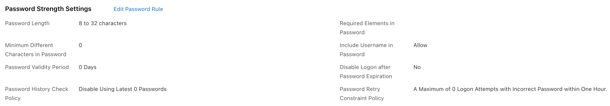{width="4.5in" height="0.7881944444444444in"}

-   \`Click on \`Edit Password Rule \`next to the text \`Password
    Strength Settings\`,

-   Change information,

-   Click on \`OK\`.

{width="2.9610148731408574in"
height="4.116632764654418in"}

To change the security configuration:

-   Go to the \`RAM \`console,

-   Click on \`Settings\`,\`

\`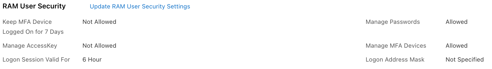{width="4.5in"
height="0.6347222222222222in"}\`

-   \`Click on \`User RAM User Security Settings\`,

-   Enter the information,

-   Click on \`Save Changes\`.

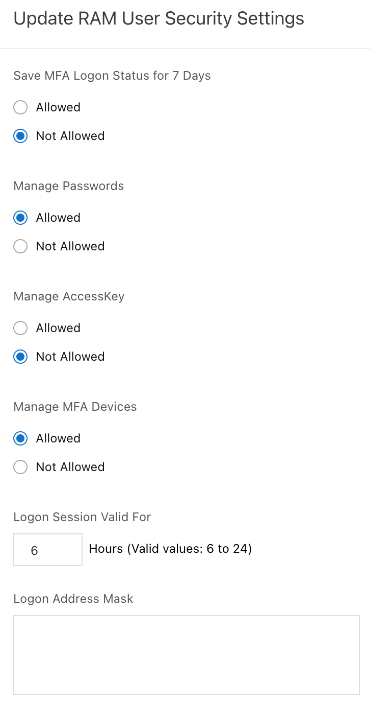{width="1.5771281714785652in"
height="2.984686132983377in"}

To create a RAM user:

-   Go to the \`RAM \`console,

-   Under \`Identities\`, click on \`Users\`,\`

-   \`Click on \`Create User\`,

-   Enter the information,

-   Click on \`OK\`.

{width="3.1633683289588803in"
height="1.7549857830271216in"}

To create an user by specifying a \`login password\`, required to access
the console:

-   Go to the \`RAM \`console,

-   Click on \`Users\`,\`

-   \`Click on \`Create User\`,

-   Enter the \`Logon\` Name,

-   Enter the display \`name\`,

-   Check \`Access Console\`,

-   Select \`Custom Logon Password\`,

-   Enter the password.

To specify the login password after the use is created:

-   Go to the \`RAM \`console,

-   Click on \`Users\`,\`

-   \`Click on the username,

-   Click on \`Enable Console Logon\`,

-   Select \`Custom Logon Password\`,

-   Enter the password.

You can optionally specify that the user must change this password on
the first login.

An \`AccessKey \`is the equivalent of the login password used for
console access but for API calls.

For security reasons, the \`AccessKey \`is displayed only during
creation. Remember to save it. If you lose it, you will have to recreate
another one.

To create an \`AccessKey\`:

-   Go to the \`RAM \`console,

-   Click on \`Users\`,\`

-   \`Click on the user,

-   Click on \`Create AccessKey\`.

Copy and save the values of \`AccessKey ID \`and \`AccessKey Secret \`or
download this information by clicking on \`Download CSV File\`.

MFA (Multi-Factor Authentication) increases the level of security by
requiring a six-digit verification code that changes every 30 seconds.
This code must be entered at login once the user has entered their
username and password.

To obtain this code, the user uses a \"virtual MFA\" mobile application
compatible with the TOTP (Time-based One-Time Password) algorithm of the
RFC 6238 standard.

To activate a virtual MFAn user for an user:

-   Go to the \`RAM \`console,

-   Click on \`Users\`,\`

-   \`Click on the username,

-   Click on \`Enable Virtual MFA Device\`.

In an MFA mobile application such as Google Authenticator, scan the
displayed QR code and enter two successive codes. The double
authentication is now activated.

## The groups 

To facilitate the management of users, they can be grouped into groups.

Before deleting the group, it is recommended to delete all users of this
group.

To create a group:

-   Go to the \`RAM \`console,

-   Click on \`Groups\`,\`

-   \`Click on \`Create Group\`,

-   \`Group Name\`: this is the name of the group that serves as an
    identifier,

-   \`Display Name\`: this is the name displayed for the group,

-   Click on \`OK\`.

{width="2.9814730971128607in"
height="2.362173009623797in"}

To add members of a group:

-   Go to the \`RAM \`console,

-   Click on \`Groups\`,\`

-   \`Click on the group name,

-   Click on \`Add Group Members\` of the group,

-   Click on the usernames to add them to the group,

-   Click on \`OK\`.

To remove a member from a group:

-   Go to the \`RAM \`console,

-   Click on \`Groups\`,\`

-   \`Click \`Remove from Group \`on the group member\'s line,

-   Click on \`OK\`.

To rename a group:

-   Go to the \`RAM \`console,

-   Click on \`Groups\`

-   Click on the group name,

-   Click on \`Modify Basic Information\`,

-   Modify the group,

-   Click on \`OK\`.

To delete an account:

-   Go to the \`RAM \`console,

-   Click on \`Groups\`,

-   Click on \`Delete \`on the line of the group,

-   Click on \`OK\`.

## The Roles 

Unlike a RAM user, a RAM role is a virtual user. It has no identity or
credentials and must be assumed by a trusted Alibaba Cloud account.

While an user has a login password or an \`AccessKey \`and can use MFA,
a role has none of that. Instead, it has permission policies.

For physical users, permissions are granted via a text-based role, while
for virtual users, permissions are granted via a role, which acts as a
virtual user.

When creating a role, you must:

-   specify the Alibaba Cloud account that assumes this role,

-   grant permissions to this role.

The user who assumes the role is then given an STS (temporary security
token) that allows them to access the authorized resources for that
role. This role token is a temporary \`AccessKey \`that can be used to
call Alibaba Cloud services APIs.

For an user to use a role that has been granted to him, he must log in
and then perform a \`SwitchRole \`operation to switch from his real
identity to the role identity. He can then perform the operations
allowed for this role. To return to the real identity, he must perform a
\`Switch Back to Logon Identity \`operation.

The role ARN is used to designate the role resource. It is displayed in
the role detail page.

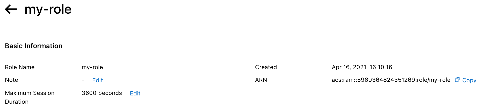{width="4.5in" height="1.0229166666666667in"}

The real user who assumes the role is designated by \"Trusted Actors\".

Roles are mainly used for:

-   access between accounts (e.g. to perform operations on resources or
    manage permissions between multiple accounts),

-   a temporary authorization (e.g. to allow a mobile application to
    perform operations on the resources).

A role can be assumed by a RAM user belonging to this or another Alibaba
Cloud account. For security reasons, a role cannot be assumed by this
account itself.

To create a role:

-   Go to the \`RAM \`console,

-   Click on \`RAM Roles\`,

-   Click on \`Create RAM Role\`,

-   Select a role type (\`Alibaba Cloud Account\`, \`Alibaba Cloud
    Service \`or \`IdP\`),

-   Select \`Alibaba Cloud Account\`,

{width="3.3278291776027995in"
height="1.9920756780402449in"}

-   Click on \`Next\`,

-   \`RAM Role Name\`: this\` \`is the name of the role,

-   \`Trusted Alibaba Cloud Account\`: select \`Current Alibaba Cloud
    Account\`,

This is the account that will assume this role: your own account
(\`Current Alibaba Cloud Account\`) or another one (\`Other Alibaba
Cloud Account\`).

{width="2.9487871828521435in"
height="2.4523173665791775in"}

-   Click on \`OK\`.

The created RAM role does not have any permissions at the moment. To add
the following permissions to the RAM user:

-   Go to the \`RAM \`console,

-   Click on RAM Roles,

-   Click on \`Add Permissions \`on the line of the role,

-   \`Authorized Scope\`: this\` \`is the authorization scope:

```{=html}
<!-- -->
```
-   \`Alibaba Cloud Account\`: permission takes effect on the current
    Alibaba Cloud Account,

-   \`Specific Resource Group\`: it takes effect on a specific resource
    group,

```{=html}
<!-- -->
```
-   \`Principal\`: this is the RAM role to which to give permissions (by
    default the current RAM role),

-   \`Select Policy\`: select policies,

-   Click on \`OK\`,

-   Click on \`Complete\`.

{width="4.1665879265091865in"
height="3.84251968503937in"}

To use this role in the console, you can connect to the console at
\`https://signin.aliyun.com/switchRole\`.

{width="2.329686132983377in"
height="1.9101268591426073in"}

The user can now perform operations in the console with the role
identity.

This role can also be used with the API by calling the \`AssumeRole
\`operation with the \`AccessKey \`to get an STS.

To get the ARN for the role or edit the role information, click on the
role name and then click \`Copy \`next to \`ARN\`.

To delete a role, click \`Delete \`on the line of the role.

## Access control to resources 

There are three ways to access the resources:

-   from the console,

-   by a call to an API,

-   by using a client tool.

Log in to the console from the \`RAM user logon \`URL displayed in the
\`RAM \`console \`Overview \`page. Enter the user name and password.

You are connected. Now you will assume a role. To do so, place the mouse
on your avatar and click on \`Switch Identity:\`

{width="1.5858398950131234in"
height="1.7444247594050744in"}

Now enter the company alias and the role name:

{width="2.5962325021872266in"
height="2.110240594925634in"}

Here you are connected by taking on a role.

To return to the identity, place the mouse on your avatar again and
click on \`Back to Logon Identity\`:

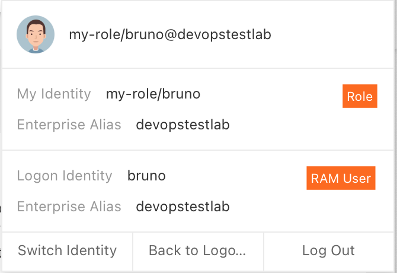{width="1.7720866141732283in"
height="1.2166688538932633in"}

## Authorization policies

Permissions allow you to authorize or prohibit certain operations on
resources under certain conditions.

Each resource has an owner, which is an Alibaba Cloud account. It
controls the permissions on the resources and can give permission to an
user. However, the resources created by this user belong to the main
Alibaba Cloud account. So the main account owns all the resources.

By default, an user has no permissions. The owner of the main account
must give them some. An authorization policy is a group of permissions
described with the Authorization Policy Language (APL). It specifies the
resources, the operations allowed and the associated conditions.

There are two types of authorization policies:

-   system policies,

-   custom policies.

System policies are general permission groups managed by Alibaba Cloud
(example: full permissions for ECS). They are not editable.

Custom policiess are user-created policies and are therefore editable.
The permissions specified in them are more refined.

To grant an user a permission, you need to attach the permission policy
to the user or the group he belongs to. The two types of permission can
be mixed.

Here is an example of an authorization policy giving read-only
permission to objects in \`oss://mybucket/website/ \`provided they are
accessed from IP address \`17.1.2.3:\`

{

\"Version\": \"1\",

\"Statement\": \[

{

\"Action\": \[ \"oss:Get\*\", \"oss:List\*\" \],

\"Effect\": \"Allow\",

\"Resource\": \"acs:oss:\*:\*:mybucket/website/\*\",

\"Condition\": {

\"IpAddress\": { \"acs:SourceIp\": \"17.1.2.3\" }

}

}

\]

}

A RAM authorization policy is therefore a JSON format file including the
version, a list of orders (\`Statement\`), each including four items:

-   the effects (\`Effect\`): this is the type of authorization (\`Allow
    \`or \`Deny\`),

-   resources (\`Resource\`): this is a list of objects on which the
    authorizations are based, expressed in the format
    \`acs:\<SERVICE_NAME\>:\<REGION\>:\<ACCOUNT_ID\>:\<RESOURCE_ID\>\`,

-   actions (\`Action\`): this is a list of operations performed on the
    specified resources, expressed in the format
    \`\<SERVICE_NAME\>:\<ACTION_NAME\>\`,

-   conditions (\`Condition\`): this is a list of conditions for the
    authorization to take effect.

It is possible to assign several policies to the same user. In this
case, \`Deny \`orders have priority over \`Allow\` orders.

When an item allows multiple values, it can be expressed with commas
(\`,\`) and square brackets (\`\[ \]\`).

In addition, wildcards (\`\* \`for zero to many letters) and (\`? \`for
one letter) can be used in strings.

The conditions are optional.

There can be several condition clauses (for example: \`IpAddress\`). In
this case, the condition is met when all the condition clauses are met.

When several values are specified, the condition is met when one of the
values is encountered.

A condition can be:

-   a type,

-   a keyword.

The type conditions are:

-   \`String\`: supported methods are \`StringEquals\`,
    \`StringNotEquals\`, \`StringEqualsIgnoreCase\`,
    \`StringNotEqualsIgnoreCase\`, \`StringLike \`and \`StringNotLike\`,

-   \`Numeric\`: the supported methods are \`NumericEquals\`,
    \`NumericEquals\`, \`NumericLessThan\`, \`NumericLessThanEquals\`,
    \`NumericGreaterThan \`and \`NumericGreaterThanEquals\`,

-   \`Date\`: the supported methods are \`DateEquals\`,
    \`DateNotEquals\`, \`DateLessThan\`, \`DateLessThanEquals\`,
    \`DateGreaterThan \`and \`DateGreaterThanEquals\`,

-   \`Boolean:\` the \`Bool \`method is supported,

-   \`IP address:\` the supported methods are \`IpAddress \`and
    \`NotIpAddress\`.

Keyword conditions are expressed in the format
\`acs:\<CONDITION_KEY\>\`:

-   \`acs:CurrentTime\`: this\` \`is the date and time of reception of
    the request, in ISO 8601 format (example: 2021-03-02T20:01:02Z),

-   \`acs:SecureTransport:\` indicates if a secure channel like HTTPS is
    used to send requests,

-   \`acs:SourceIp:\` corresponds to the IP address of the client
    sending the requests,

-   \`acs:MFAPresent:\` indicates if MFA is activated.

When the authorization policy includes several orders with an \`Allow
\`and \`Deny \`effect for the same resource, \`Deny \`has priority.

Authorization policies can be changed. However, the old authorization
policy remains available for some time. Moreover, if the new policy is
incorrect, a rollback must be performed. That\'s why Alibaba Cloud
allows managing multiple versions of authorization policies. The active
one is called the default verison.

If an authorization policy contains multiple versions, to delete it, you
must first delete all but the default version.

When an user tries to access a resource using a RAM role, thus using a
STS token, the evaluation process is as follows:

-   Does the authorization policy attached to the STS token allow
    access?

-   Does the authorization policy attached to the role identity allow
    access?

-   Does the user\'s primary account have access authorization?

-   Does the account have cross-account authorization (in case the
    account is not the owner of the resource)?

To view the list of system policies:

-   Go to the \`RAM \`console,

-   Click on \`RAM Roles\`,

-   Click on the role name.

To create an authorization policy for an account:

-   Go to the \`RAM \`console,

-   Click on \`RAM Roles\`,

-   Click on \`Create RAM Role\`,

-   \`Select Trusted Entity\`: select \`Alibaba Cloud Account\`,

-   Click on \`Next\`,

{width="2.901136264216973in"
height="2.157944006999125in"}

-   \`RAM Role Name\`: this\` \`is the name of the role,

-   \`Note\`: these are comments,

-   \`Select Trusted Alibaba Cloud Account\`: select \`Current Alibaba
    Cloud Account\`,

-   Click on \`OK\`.

{width="3.0758180227471565in"
height="3.069647856517935in"}

To change a policy:

-   Go to the \`RAM \`console,

-   Click on \`RAM Roles\`,

-   Click on the role name,

-   Click on the \`Trust Policy Management \`tab,

-   Click on \`Edit Trust Policy\`,

-   Change the policy,

-   Click on \`OK\`.

{width="4.5in"
height="2.701388888888889in"}

To delete an authorization policy:

-   Go to the \`RAM \`console,

-   Click on \`RAM Roles\`,

-   Click on \`Delete \`on the line of the role,

-   Click on \`OK\`.

To attach a policy to a RAM user:

-   Go to the \`RAM \`console,

-   Click on \`Users\`,

-   Click on \`Add Permissions \`on the user\'s line,

-   \`Principal\`: this is the user (or group or role) concerned,

-   \`Select Policy\`: select the policies to attach to the user,

-   Click on \`OK,\`

-   Click on \`Complete\`.

{width="4.5in"
height="3.654166666666667in"}

To attach a policy to an user group:

-   Go to the \`RAM \`console,

-   Click on \`Groups\`

-   Click on \`Add Permissions \`on the line of the group,

-   \`Principal\`: this is the group (or user or role) concerned,

-   \`Select Policy\`: select the policies to attach to the user,

-   Click \`OK\`.

-   Click \`Complete\`.

{width="4.5in"
height="3.6305555555555555in"}

# EIP 

A VPC provides three types of IP addresses: private IP addresses, public
IP addresses for ECS and EIP (Elastic IP) addresses.

An ENI allows an ECS instance to use multiple EIP addresses.

The \"Cut-Through\" mode allows to replace the private IP address of the
ENI by an EIP.

The bandwidth of the EIP can be adjusted.

## The different types of IP addresses 

IP addresses allow access to Cloud product instances. They also allow
the cloud product instances to provide external services.

A VPC provides three types of IP addresses:

-   private IP addresses,

-   public IP addresses for ECS,

-   EIP (Elastic IP) addresses.

Private IP addresses are assigned to VPC product instances when they are
created. They are assigned from the CIDR block of the vSwitch to which
the instance belongs. They are used to provide internal access between
ECS instances, between an ECS instance and another Cloud service or an
internal SLB instance.

The public IP addresses for ECS are assigned at the time of the creation
of the ECS instance. They cannot be dissociated.

EIP (Elastic IP) addresses can be associated and dissociated at any
time.

It is possible to migrate from a public IP address to an EIP. However,
there are some conditions to respect. They are detailed in the official
Alibaba Cloud documentation.

In the remainder of this chapter, we will focus on EIPs.

## EIP Association 

There is a limit of 20 EIPs per account.

EIPs are public IP address resources that can be dynamically linked to
ECS instances. By binding an EIP to an ECS instance, this instance is
connected to the Internet. The EIP must however be created in the same
region as the ECS instance.

The ECS instance can be used as a SNAT or DNAT gateway. The SNAT gateway
allows other instances of the same VPC to provide access to the
Internet. The DNAT gateway allows other instances of the same VPC to
provide services via the Internet.

The EIP is a public IP address that you purchase. This EIP can be linked
to an ECS instance, an ENI, an SLB instance or a NAT gateway:

-   associated with an SLB instance in the same region, the instance can
    transmit requests from the Internet,

-   associated with an ENI, the corresponding ECS instance can access
    the Internet and provide external services,

-   associated with an ECS instance, the EIP allows the instance to
    communicate with the Internet,

-   in combination with a NAT gateway from the same region, the EIP
    allows to configure DNAT and SNAT entries.

Located in the Alibaba Cloud public network gateway, it is associated
with the NIC (Network Interface Card) of an ECS instance using the NAT
method. The public IP address is therefore not visible to the operating
system.

A released EIP can be reused if it has not been used by another user.

To request an EIP:

-   Go to the \`EIP \`console,

-   Click on \`Create EIP\`,

-   Specify region, network traffic, maximum bandwidth, billing cycle
    and quantity purchased,

-   Click on \`Buy Now\`,

-   Click on \`Activate Now\`.

{width="4.5in" height="2.2243055555555555in"}

To associate an EIP with an ECS instance:

-   Go to the \`EIP \`console,

-   Select the region,

-   Select a EIP,

-   Click on \`Bind Resource\`,

-   \`Instance Type\`: select the instance type (supported values are
    \`ECS Instance\`, \`SLB Instance\`, \`NAT Gateway \`and \`Secondary
    ENI\`),

-   \`Select an instance to bind\`: this is the ECS instance to bind the
    EIP to,

-   Click on \`OK\`.

{width="4.31911198600175in"
height="3.691240157480315in"}

Dissociate a EIP from an ECS instance:

-   Go to the \`EIP \`console,

-   Select the region,

-   Select a EIP,

-   Click on \`Unbind \`on the EIP line.

To release a EIP:

-   Go to the \`EIP \`console,

-   Select the region,

-   Select a EIP,

Ensure that the status of the moment is \`Available\`.

-   Click on \`\... \| Release \`on the EIP line,

-   Click on \`OK\`.

To change the IP address of an ECS instance of type VPC:

-   Go to the \`ECS \`console,

-   Click on \`Instances\`,

-   Select the region,

-   Click on the ECS instance ID,

Make sure that the ECS instance status is \`Stopped\`. If necessary,
click on \`More \| Instance Status \| Stop \| OK \`on the line of the
instance.

-   Click on \`More \| Network and Security Group \| Modify Private IP
    Address \`on the line of the instance,

-   \`VSwitch\`: this is the vSwitch of the instance,

-   \`Private IP Address\`: this is the private IP address,

If none is specified, an IP address will be randomly selected from the
vSwitch CIDR block.

{width="2.982697944006999in"
height="2.469472878390201in"}

When you associate an EIP with a secondary ENI, the \"Cut-Through\" mode
allows to replace the private IP address of the ENI with the EIP. The
ENI then becomes an Internet network interface: the IP address is then
visible to the operating system.

This mode requires DHCP to be enabled and security group rules to allow
remote access.

## The bandwidth 

Depending on your needs, you can adjust the EIP bandwidth (\`Max
Bandwidth\`). By default, it is 5 Mbps. The EIP is charged according to
the traffic.

It is possible to share the bandwidth of ECS instances, SLB instances
and NAT gateways associated with EIPs. To do this, use the \`Internet
Shared Bandwidth \`feature available in the VPC console.

In case of a DDoS attack, it is possible to disassociate the EIP from
the ECS instance and associate a new one. It is also possible to use the
Anti-DDoS Pro service. But if you use an SLB instance, you can also
simply disassociate the EIP from the ECS instance and then associate it
with the SLB instance.

To check the traffic on the EIP:

-   Go to the \`EIP \`console,

-   Select the region,

-   Click on the ID of a EIP,

-   Click on the \`Monitoring and O&M \`tab.

{width="4.5in" height="2.8958333333333335in"}

Traffic and bandwidth monitoring information is displayed.

To change the bandwidth of a EIP:

-   Go to the \`ECS \`console,

-   Click on \`Instances\`,

-   Select a region,

-   Click on \`\... \| Modify Configuration \`on the EIP line,

-   \`Max Bandwidth\`: this is the new peak bandwidth,

-   Click on \`Buy Now\`.

{width="4.5in"
height="3.098611111111111in"}

# ECS 

ECS (Elastic Compute Service) is a compute service whose CPU and memory
characteristics depend on the ECS instance family. It is possible to
connect to the ECS instance, install software and run processes.

You can manage the life cycle of an ECS instance. An ECS instance can be
created manually, from a custom image or by using a Launch Template.

You can change some parameters of an ECS instance (its type, the
bandwidth used by its EIP, the method of charging for network usage, the
instance\'s bandwidth and its private or public IP address). Its public
IP address can also be converted to an EIP.

The instance identity, accessible via REST API, provides a description
of the instance, which allows it to be validated. The metadata provides
basic information about the instance. The User Data allows to customize
the behavior of the boot.

The connection to the instance depends on the operating system (Linux or
Windows).

ECS instances are created from a selected image in the Marketplace.

The tags assigned to the instances simplify the handling of the ECS
instances.

The instances have a system disk and one or more data disks. There are
several categories of disks, with different characteristics (latency,
performance and durability, \...).

Security groups are used to filter packets in order to isolate
instances. There are basic security groups, which are simplified, and
advanced ones.

An ENI (Elastic Network Interface) is a virtual NIC (Network Interface
Controller) which allows to manage the network in a fine way and to set
up high availability or to carry out failovers.

It is possible to make backups (snapshots) manually or automatically by
creating a snapshot policy.

The monitoring of the ECS instances can be done by the ECS console or by
an API.

Finally, Deployments Sets allow you to control the distribution of
instances on the physical servers.

## The ECS instance 

The billing method can be \`Subscription \`or \`Pay-As-You-Go\`.
Subscription allows to obtain significant discounts. Pay-per-use allows
to pay only for what you use.

The region and area in which the instance is deployed cannot be changed
after creation.

The ECS instance is based on an image. The image can be public, custom,
shared or from a Marketplace.

To connect to a Linux instance, you can use a SSH key pair or a
password, while for Windows you can only use a password.

An instance can have a maximum of 16 disks. There are two types of
disks:

-   system disks (\`System Disk\`),

-   data disks (\`Data Disk\`).

The system disk is needed to install the operating system.

The data disk is optional and contains the data. It can be empty. It can
be encrypted. It can be created from a snapshot.

The billing method for the disk is the same as for the instance. A
\`subscription \`disk must be released together with the corresponding
instance, while a \`Pay-As-You-Go \`disk can be released separately or
together with the instance.

The network type used by the instance can be VPC or classic network.
With the VPC network type, Alibaba Cloud creates a VPC and a vSwitch by
default. The classic network is only for ECS instances that were first
used before June 16, 2016.

Only certain instance types support ENIs. ENIs are released with the
instance.

A public IP address can be assigned to the instance at creation. In this
case, it cannot be detached from the instance. If the instance does not
need to access the Internet or if the VPC instances use an EIP to access
the Internet, it is not necessary to assign a public IP address.

User Data allows to provide code that customizes the instance at
startup.

To view information about the ECS instances in an account on the
Instance List page:

-   Go to the \`ECS \`console,

-   Click on \`Instances\`,

{width="4.5in"
height="1.2229166666666667in"}

-   Select the region,

-   Click on the wheel icon {width="0.20959536307961504in"
    height="0.20343066491688538in"},

-   Change the filter,

-   Click on \`OK\`.

{width="2.8132283464566927in"
height="1.8233891076115485in"}

## Creation of an instance 

To create an instance using a system disk snapshot, you can use the
wizard.

To create an instance using the wizard:

-   Go to the \`ECS \`console,

-   Click on \`Instances\`,

-   Click on \`Create Instance\`,

-   \`Billing Method\`: this is the billing method (\`Subscription \`or
    \`Pay-As-You-Go\`),

{width="3.4513090551181103in"
height="0.24500109361329833in"}

If the billing method is \`Subscription\`, specify the duration and
whether automatic renewal should be activated (\`Auto renewal\`).

-   \`Region\`: this is the region,

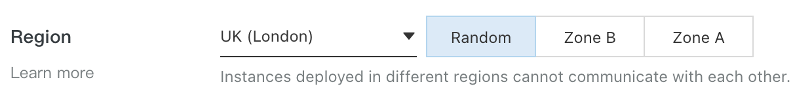{width="2.9383125546806648in"
height="0.35459208223972005in"}

The region cannot be changed after creation.

-   \`Zone\`: this is the zone,

The area cannot be modified after creation. An area is randomly
assigned.

-   \`Instance Type\`: this is the type of instance,

Not all instance types are available in all regions.

{width="4.5in"
height="2.026388888888889in"}

-   \`Quantity\`: this is\` \`the number of instances,

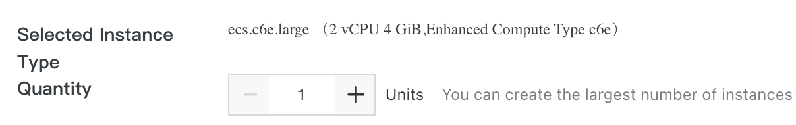{width="3.722108486439195in"
height="0.5853138670166229in"}

-   \`Image\`: this is the image,

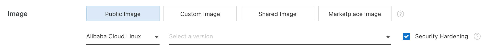{width="4.5in" height="0.44930555555555557in"}

The image serves as the basis for the instance.\`

-   System Disk \`(required): this is the system disk; specify the Cloud
    Disk category and its size,

The system disk is needed to install the operating system.

The list of Cloud Disk categories depends on the selected region.

The default size is 40 GiB and the maximum is 500 GiB. If the size of
the selected image file is greater than 40 GiB, the disk size will
correspond to the size of the image.

-   \`Data Disk \`(optional): this is the data disk,

It is possible to create an empty data disk, possibly encrypted or from
a snapshot.

There can be a maximum of 16 disks.

If the selected instance type has local disks, these disks are
displayed.

The category and quantity of disks depends on the type of instance.

{width="4.5in"
height="0.9034722222222222in"}

-   \`Backup Period\`: this is the automatic snapshot policy,

The automatic snapshot policy triggers the backup by default every day
at 6:00 am and has a retention period of 7 days.

-   \`Data Source:\` this is the source,

-   Click on \`Next: Networking\`,

-   \`Network Type\`: select \`VPC \`and a vSwitch,

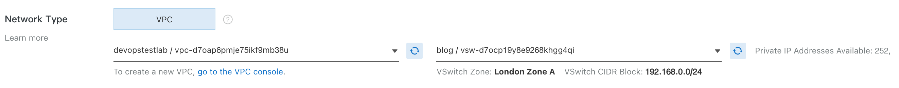{width="4.5in" height="0.4423611111111111in"}

-   To assign a public IP address to the instance, select \`Assign
    Public IPv4 Address\`, \`Pay-By-Traffic \`and then the bandwidth,

{width="4.5in" height="0.81875in"}

-   \`Select Security Group\`: this\` \`is the security group,

{width="4.5in"
height="1.4951388888888888in"}

-   If the instance type supports ENIs, you can add one and specify a
    vSwitch,

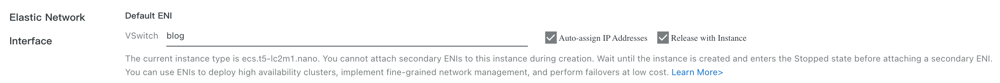{width="4.5in" height="0.37777777777777777in"}

-   Click on \`Next: System Configurations\`,

-   \`Logon Credentials\`: these are the connection identifiers (a pair
    of SSH keys or a password for Linux, a password for Windows),

{width="3.4056277340332457in"
height="0.5050634295713036in"}

-   Specify the name of the instance,

-   \`Instance RAM role\`: this is the RAM role assigned to the
    instance,

-   \`User Data\`: this is the code that customizes the instance at
    startup,

-   Click \`Next: Grouping\`,

-   Click \`Save as launch template \`(optional) to save the
    configuration as a Launch Template,

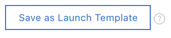{width="1.1754680664916886in"
height="0.26430774278215224in"}

-   To be guided to use the APIs, click on \`View Open API\`,

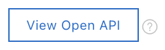{width="0.986917104111986in"
height="0.30429899387576553in"}

-   Click on \`Create Instance\`.

To create an instance with the same configuration as an ECS instance,
duplicate this ECS instance with the same configuration:

-   Go to the \`ECS \`console,

-   Select the region,

-   Click on \`Instances\`,

-   Click on \`More \| Buy Same Type \`on the line of the instance,

{width="4.5in"
height="2.6729166666666666in"}

-   To modify a configuration, click on the pencil icon
    {width="0.18409120734908135in"
    height="0.13636373578302713in"}.

To create a preemptible instance:

-   Go to the \`ECS \`console,

-   Select \`Instances\`,

-   Click on \`Create Instance\`,

-   \`Billing Method\`: select \`Preemptible Instance\`,

-   \`Maximum Price for Instance Type\`: this is\` \`the maximum price
    you are willing to pay,

{width="2.378891076115486in"
height="0.4350284339457568in"}

If your bid is higher than the current market price, the instance
starts.

-   Select the number of instances to purchase,

-   Click on \`Next \`until the last page,

-   Click on \`Create Instance\`.

A preemptible instance is marked \`Pay-As-You-Go-Preemptible \`in the
instance list.

To view details about ECS instances:

-   Go to the \`ECS \`console,

-   Click on \`Instances\`,

-   Select a region,

-   Click on the instance ID.

The following information is displayed:

-   \`Basic Information\`: this is the basic information (image ID,
    instance name, region, zone, instance type, instance type familiy,
    key pair name for Linux, instance RAM role, tags, CPU, memory, I/O
    optimization, operating system, \...),

{width="4.5in"
height="3.3493055555555555in"}

-   \`Network Information:\` this is the configuration information (type
    of networks, IP addresses, information on the VPC, \...),

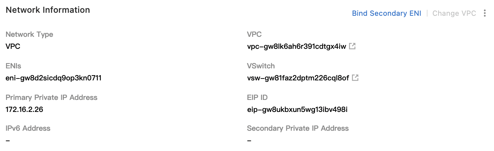{width="4.1442825896762905in"
height="1.273982939632546in"}

-   \`Billing Information\`: this is the payment information (billing
    method, network usage),

{width="4.006522309711286in"
height="0.523073053368329in"}

-   \`Other Information\`: this is other information (instance type, SSH
    key pair, RAM role, \...).

## Creation of an instance from a custom image 

To create an ECS instance with the same operating system, applications
and data, you can create a custom image and use it to create the new
instance.

The image and the instance must be in the same region. If this is not
the case, you have to copy the custom image to the region of the future
instance.

If the owner of the image is another account, the image must be shared
with you.

If the selected image contains more than one snapshot of more than one
data disk, the corresponding number of Cloud Disks will automatically be
created as data disks.

By default, the size of each disk is equal to that of the source
snapshot. This size can be increased but not decreased.

To create an instance from a custom image:

-   Go to the \`ECS \`console,

-   Click on \`Instances & Images \| Images,\`

-   Select the region where the image is located,

-   Click on the \`Custom Image \`or \`Shared Image \`tab,

-   Select the image,

-   Click on \`Create Instance \`on the image line.

{width="4.5in"
height="4.575694444444444in"}

## Using the Launch Template 

A Launch Template is an ECS instance template that you can use to
quickly create ECS instances.

Each account can create a maximum of 30 Launch Templates per region.

A template cannot be modified once created.

A Launch Template can be created in the ECS console or in the purchase
page of an ECS instance.

Creating a Launch Template from the ECS console allows to create an
instance with a single click just after creating the Launch Template.
All parameters are optional. If some parameters of the Launch Template
are not mandatory, then the value of these parameters must be filled in.
However, it is recommended to configure the mandatory parameters to
simplify the creation of instances.

To create a Launch template in the ECS console:

-   Go to the \`ECS \`console,

-   Select \`Deployment & Elasticity \| Launch Templates\`,

-   Select a region,

-   Click on \`Create Template\`,

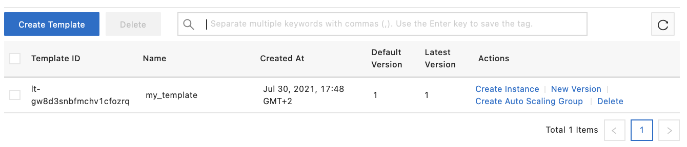{width="4.5in" height="0.9673611111111111in"}

-   Configure the parameters as for creating an ECS instance,

If a Launch Template has already been created, \`Clone Template \`is
displayed to allow you to select an existing Launch Template.

-   Click \`Next Advanced Configuration\`,

-   Click \`Next Confirm Configuration\`,

-   \`Template Name\`: this is the name of the template,

-   \`Version Description\`: this is the description,

-   Click on \`Create Launch Template\`.

{width="4.5in"
height="3.7152777777777777in"}

To view the created template, click on \`View Template\`.

Creating a Launch Template from the ECS purchase page allows to create
an instance and save its configuration as a Launch Template.

To create a Launch Template on the ECS purchase page:

-   Go to the \`ECS \`console,

-   Select \`Instances & Images \| Instances\`,

-   Select a region,

-   Click on \`Create Instance\`,

-   Configure the ECS instance,

-   Click \`Save as Launch Template\`,

{width="2.9528346456692915in"
height="0.2729549431321085in"}

-   \`Template Name\`: this is the name,

-   \`Version Description\`: this is the description,

-   Click on \`Save\`,

{width="3.605371828521435in"
height="1.8026859142607174in"}

-   Click on \`View Template\`.

To use a Launch Template:

-   Go to the \`ECS \`console,

-   Click on \`Deployment & Elasticity \| Launch Templates,\`

-   Click on \`Create Instance \`on the template version line,

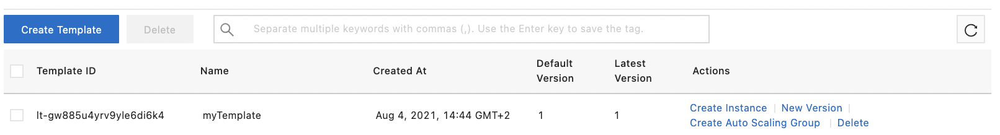{width="4.5in" height="0.6083333333333333in"}

-   Select the template and the version,

-   To modify the configuration, click on the edit icon
    {width="0.14772747156605423in"
    height="0.1313134295713036in"}.

To create a \`Subscription \`instance, select a subscription duration
and click on \`Create Order\`. To create a \`Pay-As-You-Go \`instance,
click directly on \`Create Instance\`.

To delete a Launch Template:

-   Go to the \`ECS \`console,

-   Click on \`Deployment & Elasticity \| Launch Templates\`,

-   Click on \`Delete \`on the line of the template to be deleted,

-   Click on \`OK\`.

A Launch Template can have several versions. Each Launch Template can
have a maximum of 30 versions.

When creating a new version of Launch Template, all parameters are
optional.

When deleting a Launch Template, all associated versions are deleted.

It is not possible to delete the default version of the Launch Template.

To create a new version of Launch Template using the ECS console:

-   Go to the \`ECS \`console,

-   Select \`Deployment & Elasticity \| Launch Templates\`,

-   Click on \`New Version \`on the template line,

-   Configure the parameters,

-   On the last page, click on \`New Template Version\`,

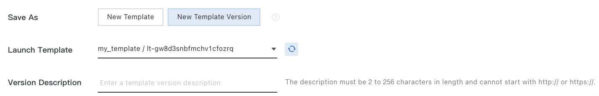{width="4.5in" height="0.7277777777777777in"}

-   Select the template,

-   Click on \`Create Launch Template\`.

To change the default version of a Launch Template:

-   Go to the \`ECS \`console,

-   Click on \`Deployment & Elasticity \| Launch Templates\`,

-   Click on the template ID,

-   Click on \`Set as Default \`on the version line.

{width="4.5in"
height="2.982638888888889in"}

To delete a version of Launch Template:

-   Go to the \`ECS \`console,

-   Click on \`Deployment & Elasticity \| Launch Templates\`,

-   Click on the template ID,

-   Click on \`Delete \`on the line of the version to be deleted,

-   Click on \`OK\`.

## Modification of an ECS instance 

You can configure the Internet bandwidth of an ECS instance.

It is possible to change the billing method for network usage
(\`Pay-By-Bandwidth \`or \`Pay-By-Traffic\`).

With \`Pay-by-bandwidth\`, billing is done on the basis of the specified
bandwidth. The outgoing bandwidth is limited to this value.

With \`Pay-by-traffic\`, billing is based on the actual traffic used. In
order to avoid excessive costs caused by an explosion of outgoing
traffic, you can configure a peak bandwidth value for outgoing traffic.

It is possible to change the operating system of a running ECS instance.
If the instance is hosted in a region outside mainland China, it is
possible to switch between Linux and Windows. In regions outside
mainland China, it is only possible to switch between Linux and Windows
versions.

After resetting the password, it is necessary to reboot, which may cause
disruptions to services.

To reset the password of an instance:

-   Go to the \`ECS \`console,

-   Click on \`Instances & Images \| Instances\`,

-   Select the region,

-   Select \`More \| Password/Key Pair \| Reset Password \`on the line
    of the instance,

-   Enter a new password,

-   Click on \`Submit\`.

{width="4.5in"
height="1.9201388888888888in"}

### Change the type of the instance 

The type of a \`Subscription \`instance can be changed but for an
upgrade. However, both the vCPU and the memory size must be changed, not
just one of them. Also, the period between upgrades of an instance must
be at least five minutes.

To upgrade \`Subscription \`instances:

-   Go to the \`ECS \`console,

-   Click on \`Instances & Images \| Images\`,

-   Select a region,

-   Click on \`Upgrade/Downgrade \`on the \`Subscription \`instance
    line,

{width="4.5in"
height="1.520138888888889in"}

-   Select \`Upgrade\`,

-   Click on \`Continue\`,

-   Enter the instance type, public bandwidth and disk billing method,

-   Click on \`Create Order\`.

The billing method for disks and network usage can also be converted
from \`Pay-As-You-Go \`to \`Subscription\`.

The configuration of a \`Pay-As-You-Go \`instance can also be changed.
To do this, the instance must be in the \`Stopped \`state.

To change the configuration of a \`Pay-As-You-Go \`instance:

-   Go to the \`ECS \`console,

-   Click on \`Instances & Images \| Instances,\`

-   Select the region,

-   Click on \`Change Instance Type \`on the line of the instance,

-   Select the new instance type,

-   Click on \`Change\`.

{width="4.5in"
height="2.7881944444444446in"}

The change takes effect after restarting the instance.

### Modify the bandwidth of an EIP 

It is possible to change the bandwidth of an ECS instance connected to a
VPC that has an EIP.

To change the EIP Internet bandwidth:

-   Go to the \`ECS \`console,

-   Click on \`Instances & Images \| Instances,\`

-   Select the region,

-   Click on \`Upgrade/Downgrade \`on the line of the instance,

-   Select \`Bandwidth Adjustment\`,

-   Click on \`Continue\`,

{width="2.781007217847769in"
height="1.3269860017497812in"}

-   Specify the new peak bandwidth,

-   Click on \`Buy Now\`.

{width="3.9677187226596677in"
height="2.564935476815398in"}

### Change the network usage billing method for a Subscription instance 

The instance must have a public IP address.

To switch from \`Pay-By-Bandwidth \`to \`Pay-By-Traffic\`, your account
must have the \`downgrade \`privilege. To find out if it has this
privilege:

-   Go to the \`ECS \`console,

-   Click on \`Privileges & Quotas.\`

To change the billing method from \`Pay-By-Bandwidth \`to
\`Pay-By-Traffic\`:

-   Go to the \`ECS \`console,

-   Click on \`Instances & Images \| Instances,\`

-   Select a region,

-   Click on \`Upgrade/Downgrade \`on the line of the instance,

-   Click on \`Downgrade \`and \`Bandwidth Configuration\`,

-   Click on \`Continue\`,

-   Select \`Pay-By-Traffic\`,

-   Enter the peak bandwidth value,

-   Click on \`Confirm\`.

The change takes effect immediately.

To change the billing method from \`Pay-By-Traffic \`to
\`Pay-By-Bandwidth\`:

-   Go to the \`ECS \`console,

-   Click on \`Instances & Images \| Instances,\`

-   Select a region,

-   Click on \`Upgrade/Downgrade \`on the line of the instance,

-   Select \`Upgrade\`,

-   Click on \`Continue\`,

-   Select \`Pay-By-Bandwidth\`,

-   Enter the value of the bandwidth,

-   Click on \`Confirm\`.

The change takes effect immediately.

### Modify the bandwidth of a Subscription instance with an EIP 

You can modify the bandwidth configuration. If the modification is a
downgrade, you must have the \`downgrade \`privilege. To know if you
have this privilege:

-   Go to the \`ECS \`console,

-   Click on \`Privileges & Quotas.\`

You can change the public bandwidth or the maximum bandwidth:

-   For instances using \`pay-by-bandwidth \`network usage billing, you
    can upgrade or downgrade the public bandwidth.

-   For instances using \`Pay-by-traffic \`network usage billing, you
    can change the maximum bandwidth.

There must be a minimum delay of 5 minutes between two successive
modifications.

To upgrade the public bandwidth of an instance using \`pay-by-bandwidth
\`billing:

-   Go to the \`ECS \`console,

-   Click on \`Instances & Images \| Instances,\`

-   Select a region,

-   Click on \`Upgrade/Downgrade \`on the line of the instance,

-   Select \`Upgrade\`,

-   Click on \`Continue\`,

-   Change the bandwidth,

-   Click on \`Upgrade \`or \`Create Order\`.

If the instance does not have a public IP address, it has no public
bandwidth.

To downgrade the public bandwidth of instances with \`pay-by-bandwidth
\`billing:

-   Go to the \`ECS \`console,

-   Click on \`Instances & Images \| Instances,\`

-   Select a region,

-   Click on \`Upgrade/Downgrade \`on the line of the instance,

-   Select \`Downgrade \`and \`Bandwidth Configuration\`,

-   Click on \`Continue\`,

-   Change the bandwidth,

-   Click on \`Downgrade Now\`.

The change is immediate.

After downgrading the bandwidth of a classic network instance to 0
Mbit/s, the public IP address of the instance is retained. On the other
hand, for a VPC instance, the public IP address of the instance is
released.

To change the maximum bandwidth:

-   Go to the \`ECS \`console,

-   Click on \`Instances & Images \| Instances,\`

-   Select a region,

-   Click on \`Upgrade/Downgrade \`on the line of the instance,

-   Select the method,

-   Click on \`Continue\`,

-   To change the maximum bandwidth or select the \`Pay-by-bandwidth
    \`billing method, select \`Upgrade\`,

-   To change only the maximum bandwidth, click on \`Downgrade \`and
    \`Bandwidth Configuration \`

-   Change the maximum bandwidth.

The \`Pay-by-traffic \`billing method charges according to the actual
traffic volume. Changing only the maximum bandwidth does not change the
costs.

Maximum bandwidth helps avoid high outbound bandwidth costs due to
excessive outbound traffic.

A change from \`Pay-by-traffic \`to \`Pay-by-bandwidth \`may require
paying for bandwidth in advance.

### Modify the bandwidth of a Pay-As-You-Go instance 

You can change the bandwidth of a \`Pay-As-You-Go \`instance.

You must wait at least five minutes between bandwidth changes.

You can change the billing method for network usage (\`Pay-By-Bandwidth
\`or \`Pay-By-Traffic\`) or the public bandwidth or peak traffic
bandwidth.

After changing the public bandwidth of a classic network instance to 0
Mbit/s, the public IP address of the instance is kept. For a VPC
instance, however, it is released.

To change the bandwidth:

-   Go to the \`ECS \`console,

-   Click on \`Instances & Images \| Instances,\`

-   Select a region,

-   Click on \`Configuration Change \| Change Pay-as-you-go Instance
    Bandwidth \`on the line of the instance,

-   Change the peak bandwidth,

-   Select the \`Pay-By-Bandwidth \`or \`Pay-By-Traffic \`network usage
    billing method,

-   Specify the public bandwidth or the peak bandwidth of the traffic,

-   Click on \`Confirm\`.

{width="4.5in"
height="2.3368055555555554in"}

The change is effective immediately.

## Changing the IP address 

You can change the private and public IP address of an ECS instance. It
is also possible to change the public IP address to EIP.

### Change private IP address 

You can change the private IP address of an ECS instance.

To change the private IP address and vSwitch of an ECS instance:

-   Go to the \`ECS \`console,

-   Click on \`Instances & Images \| Instances,\`

-   Select the region,

-   Click on \`Instance Status \| Stop \`on the line of the instance,

-   Once the instance is stopped, click on the instance ID,

-   In the \`Network Information\` section, click on \`\... \| Modify
    Private IP Address\`,

{width="4.5in"
height="1.5458333333333334in"}

-   \`VSwitch\`: this is the VSwitch,

-   Click on \`Modify\`,

{width="2.7954101049868765in"
height="2.3079385389326332in"}

-   Click on \`Instance Status \| Restart \`on the line of the instance.

The change takes effect once the instance is restarted.

Ensure that the current vSwitch and the selected vSwitch are in the same
zone.

If you do not want to change the vSwitch, enter a new IP address.

### Change the public IP address 

If the instance has a public IP address, you can change it within six
hours after the instance is created.

For this, the instance must be in the \`Stopped \`state.

If no public IP address was assigned when the instance was created, then
you can only:

-   use an EIP,

-   modify the public bandwidth of the ECS instance to allocate a fixed
    public IP address.

To change the public IP address of an ECS instance:

-   Go to the \`ECS \`console,

-   Click on \`Instances & Images \| Instances,\`

-   Select the region,

-   Select \`Network and Security Group \| Change Public IP Address \`on
    the line of the instance,

-   Click on \`Start Now\`.

{width="2.6346686351706037in"
height="1.5035498687664042in"}

### Convert a public IP address of a VPC instance to EIP 

On a VPC-based ECS instance, it is possible to convert a public IP
address to an EIP. The public IP address can then be kept and associated
with another ECS instance.

To convert a public IP address to EIP:

-   Go to the \`ECS \`console,

-   Click on \`Instances & Images \| Instances,\`

-   Select the region,

-   Select \`Network and Security Group \| Convert to EIP \`on the line
    of the instance,

-   Click on \`OK\`.

{width="2.6873818897637793in"
height="1.3125863954505688in"}

The ECS instance must be in \`Stopped \`or \`Running \`state.

The Internet access of the instance is not disrupted.

The EIP address can be dissociated from the instance. You can then bind
it to another instance or release it.

### Convert a public IP address of a classic network instance to EIP 

When manually releasing an ECS instance of the classic network type and
Pay-As-You-Go type, you can convert its public IP address into an EIP.
This EIP can then be used with a VPC ECS instance.

If the instance is of type Pay-As-You-Go, it must be in \`Stopped\`
status.

If it is of the \`Subscription \`type, it must be in \`Expired \`or \`To
Be Released \`status. The instance must also use \`Pay-By-Traffic
\`Internet bandwidth billing.

It is recommended to perform a snapshot before the operation.

If the bandwidth before the conversion is 0 Mbps, it increases to 1 Mbps
after the migration.

The NIC (Network Interface Controller) and the MAC address of the
classic network ECS instances are not kept after the migration.

Please note that an EIP address that is not linked to an ECS instance is
still charged.

To convert the public IP address of a classic network type and
\`Subscription \`type instance to EIP:

-   Go to the \`ECS \`console,

-   Click on \`Instances & Images \| Instances,\`

-   Select a region,

-   Click on \`Release \`on the line of the instance,

-   Select \`Release Now\`,

-   Select \`Convert the public IP address of the ECS instance in a
    classic network to an EIP address\`,

-   Click on \`Next\`,

-   Click on \`OK\`.

For \`Pay-As-You-Go \`instances:

-   Go to the \`ECS \`console,

-   Click on \`Instances & Images \| Instances,\`

-   Select a region,

-   Click on \`Instance Status \| Release \`on the line of the instance,

-   Select \`Release Now\`,

-   Select \`Convert the public IP address of the ECS instance in a
    classic network to an EIP address\`,

-   Click on \`Next\`,

-   Click on \`OK\`.

## Management of the instance life cycle 

In this section, we will study the life cycle of an ECS instance, in
particular the following phases:

-   start-up,

-   stop,

-   hibernation,

-   restart,

-   release,

-   reactivation.

### Start an instance 

To start a stopped instance:

-   Go to the \`ECS \`console,

-   Click on \`Instances & Images \| Instances,\`

-   Select the region,

-   Select \`Instance Status \| Start \`on the line of the instance,

-   Click on \`OK\`.

{width="0.4417804024496938in"
height="0.5177110673665791in"}

Once started, the status of the instance changes to \`Running\`.

### Stop a Subscription instance 

If you stop a \`Subscription \`instance before the end of its billing
cycle, the bill for that cycle does not change. If \`auto-renewal \`has
been enabled, you are still billed for the stopped instance at the
beginning of each new billing period.

To stop a running instance:

-   Go to the \`ECS \`console,

-   Click on \`Instances & Images \| Instances,\`

-   Select the region,

-   Select \`Instance Status \| Stop \`on the line of the instance,

-   \`Stopped By\`: select \`Stop \`(clean stop) or \`Force Stop\`,

-   Click on \`OK\`.\`

\`Once stopped, the status of the instance changes to \`Stopped\`.

### Stop a Pay-As-You-Go instance 

By default, billing continues until the instance is released.

To stop an instance:

-   Go to the \`ECS \`console,

-   Click on \`Instances & Images \| Instances,\`

-   Select the region,

-   Select \`Instance Status \| Stop \`on the line of the instance,

-   \`Stopped By\`: this is the way to stop the instance:

```{=html}
<!-- -->
```
-   \`Stop\`: clean stop,

-   \`Force Stop\`: forced stop,

```{=html}
<!-- -->
```
-   \`Stop Mode\`: this is the stop mode:

The stop mode is only available for VPC instances with the option \`No
Fees for Stopped Instances (VPC-Connected) \`activated.

-   \`Retain Instance and Continue Charging After Instance Is Stopped\`,

-   \`No Charges After Instance Is Stopped\`: no longer charges the
    instance, except for disks, EIP and bandwidth,

```{=html}
<!-- -->
```
-   Click on \`OK\`.

\`{width="2.564225721784777in"
height="1.7075054680664916in"}

### \`Hibernate an instance 

Hibernating an instance allows to keep an instance in a state for a
certain period of time without being able to perform any maintenance
operation. However, the execution environment of the applications is
preserved, which means that when the instance is restored, the
applications pick up where they left off, unlike a reboot where the
system restarts and everything starts again from scratch. Both disk and
memory are therefore saved.

For \`Subscription \`instances, neither the instance expiration time nor
the bill is affected.

For \`Pay-As-You-Go \`instances, if you have selected the \`No Fees for
Hibernated Instances \`option during hibernation, hibernation is not
charged.

For an instance to hibernate, there are several conditions:

-   The \`instance hibernation\` feature must be enabled when the
    instance is created.

-   The hibernation agent must be installed on the instance.

-   The custom image used to create the instance must be encrypted.

The instance hibernation function cannot be deactivated after it has
been activated.

### Restart an instance 

To restart an instance:

-   Go to the \`ECS \`console,

-   Click on \`Instances & Images \| Instances,\`

-   Select the region,

-   Select the instance: it must be in \`Running \`state,

-   Click on \`Instance Status \| Restart \`on the line of the instance,

-   Select a restart mode,

-   Click on \`OK\`.

In order to be restarted, the instance must be in \`Running \`status.
Restarting causes an interruption of service.

### Release an instance automatically 

\`Subscription \`instances are automatically released when the billing
cycle expires. Once released, the instance data cannot be recovered. It
is therefore recommended to make a backup before.

To activate the \`Automatic Release \`of a \`Pay-As-You-Go \`instance:

-   Go to the \`ECS \`console,

-   Click on \`Instances & Images \| Instances,\`

-   Select the region,

-   Select \`Instance Status \| Release \`on the line of the instance,

-   Select \`Scheduled Release\`,

The instance can be released in two ways. With \`Release immediately\`,
the instance is released at once. With \`Scheduled Release\`, the
instance is released at the specified time. This time must be at least
30 minutes after the current time.

-   Activate \`Automatic Release\`,

If the \`Automatic Release \`parameter is not set, the instance
continues to be billed until it is released.

-   Specify the date and time of release,

-   Click on \`Next\`,

-   Click on \`OK\`.

To disable automatic release:

-   Go to the \`ECS \`console,

-   Click on \`Instances & Images \| Instances,\`

-   Select the region,

-   Select \`Instance Status \| Release \`on the line of the instance,

-   Select \`Scheduled Release\`,

-   Disable \`Automatic Release\`,

-   Click on \`Next\`,

-   Click on \`OK\`.

{width="2.6428926071741032in"
height="2.4944346019247594in"}

### Release an instance manually

To reduce costs, it is recommended to release instances when you no
longer need them.

To release an instance manually and immediately:

-   Go to the \`ECS \`console,

-   Click on \`Instances & Images \| Instances,\`

-   Select the region,

-   Select \`Instance Status \| Release \`on the line of the instance,

-   Select \`Release Now\`,

-   Click on \`Next\`,

-   Click on \`OK\`.

{width="2.4396008311461066in"
height="2.2622779965004374in"}

### Reactivate an instance 

For a \`Pay-As-You-Go \`instance, if the due date of an overdue payment
is not paid within 15 days, the instance is stopped and its status is
changed to \`Expired\`. You then have an additional 15 days to pay and
reactivate it. To do this, you have to submit a ticket. After this time,
the instance is released and the data is lost.

To reactivate an instance:

-   Go to the \`ECS \`console,

-   Click on \`Instances & Images \| Instances,\`

-   Select the region,

-   Select \`Reactivate \`on the line of the instance,

-   Specify whether the instance should be reactivated immediately or at
    a specific time.

The reactivation time is about 10 minutes.

## The identity of the instance, the metadata and the User Data 

### Instance identity 

The instance identity describes and validates an instance. It allows to
quickly locate an instance and provide authentication to perform actions
like software updates, access control, \... It allows for example to
make sure that the instance you are using is your instance, or you can
confirm the source of a server.

The instance identity consists of two items:

-   a document that describes the attributes of an instance (example:
    \`account-id\`, \`instance-id\`, \`region-id\`, \`image-id\`, \...),

-   an associated signature: it verifies the identity of the instance
    using the PKCS#7 encryption method.

To verify the identity of the instance, use OpenSSL:

-   Connect to the Linux instance,

-   Retrieve the instance identity document:

\`DOCUMENT=(curl
http://100.100.100.200/latest/dynamic/instance-identity/document)\`,

-   Retrieve the associated signature:

\`SIGNATURE=(curl
http://100.100.100.200/latest/dynamic/instance-identity/pkcs7)\`

-   Verify instance identity:

openssl smime -verify -in \$SIGNATURE -inform PEM -content \$DOCUMENT
-certfile AliyunPubkey -noverify \> /dev/null

To improve the security of the signature, you can use the audience
parameter with a random string. This parameter must be used in the
document, the document signature and must be added in the OpenSSL
command in the format \`\"audience\":\"\<VALUE\>\".\` The parameters
must be separated by a comma.

### Metadata 

The metadata of an ECS instance are basic information about the instance
(instance ID, IP address, operating system, \...). It is used to manage
the instances.

Manual changes made to the instance are not reflected in the metadata.

The metadata also includes dynamic elements generated after the first
start of the instance (system events, instance identifiers, user data,
\...).

The most important URLs are:

-   To retrieve the metadata of an instance:
    \`http://100.100.100.200/latest/meta-data/,\`

-   To retrieve the ECS instance ID:
    \`http://100.100.100.200/latest/meta-data/instance-id,\`

-   To retrieve the image ID:
    \`http://100.100.100.200/latest/meta-data/image-id,\`

-   To retrieve the list of upcoming system events:
    \`http://100.100.100.200/latest/maintenance/active-system-events,\`

-   To retrieve the identity document of the instance:
    \`http://100.100.100.200/latest/dynamic/instance-identity/
    document\`,

-   To retrieve the User Data of the instance, used at startup:
    \`http://100.100.100.200/latest/user-data\`.

Here is a list of other available metadata:

-   \`/hostname\`: this is the name of the instance at the operating
    system level,

-   \`/mac\`: this is the MAC address of the instance,

-   \`/private-ipv4\`: this\` \`is the private IP address,

-   \`/eipv4\`: it is the public IP address and the EIP associated with
    the main NIC,

-   \`/vpc-id\`: this is the ID of the VPC,

-   \`/vSwitch-id\`: this is the ID of the vSwitch.

Under linux, use the \`curl\` command (example: \`curl
http://100.100.100.200/latest/meta-data/\`); under Windows use
\`Invoke-RestMethod\` (example: \`Invoke-RestMethod
http://100.100.100.200/latest/meta-data/\`).

There are two modes of access to ECS instance metadata: normal mode and
enhanced mode. The enhanced mode uses token-based authentication access.
This protects against Server-Side Request Forgery (SSRF) attacks. In an
SSRF attack, the attacker takes advantage of a server\'s vulnerabilities
to send requests to the server to access resources on the internal
network. The enhanced security mode is therefore recommended.

The principle of the enhanced security mode is as follows:

-   Send a request for creation of a token by specifying the duration of
    validity (TTL),

-   When requesting metadata, specify the generated token using the HTTP
    header \`x-aliyun-ecs-metadata-token\`.

Here is an example:

TOKEN=\`curl -X PUT \"http://100.100.100.200/latest/api/token\" -H
\"X-aliyun-ecs-metadata-token-ttl-seconds: 21600\"\`

curl http://100.100.100.200/latest/meta-data/instance-id -H
\"X-aliyun-ecs-metadata-token: \$TOKEN\"

### User Data

The User Data allow to customize the behavior of the boot and to pass
data to the instance (example: automatically update packages, activate
services, display logs, install dependencies, \...).

This User Data must be encoded in base 64 before being transmitted and
its size cannot exceed 16 KB. Moreover, User Data can only be used with
VPC type instances.

Specifically, at boot time, as soon as the instance goes into the
\`Running \`state, the system executes the User Data with \`root
\`permissions and then runs the initialization scripts in the
\`/etc/init \`directory.

To create User Data:

-   Create a text file whose first line can be:

```{=html}
<!-- -->
```
-   for Linux: user-data \`(#! /bin/sh\`), cloud-config
    (\`#cloud-config\`), include file or compressed script with gzip
    \`(#include \`followed by a line with the URL), upstart job
    (\`#upstart-job\`),

-   for Windows: \`\[bat\] \`or \`\[powershell\]\`,

```{=html}
<!-- -->
```
-   Upload the file to OSS (this is the recommended method),

-   Retrieve the link.

-   Define a validity period for the link.

-   Go to the \`ECS \`console,

-   Create an instance,

-   Advance to the \`System Configurations (Optional) \`page,

-   Click on \`Advanced (based on instance RAM roles or cloud-init)\`,

-   \`User Data\`: this is the User Data script,

-   If the User Data is Base64 encrypted, check \`Enter Based64 Encoded
    Information\`,

{width="4.5in"
height="1.7972222222222223in"}

-   Connect to the instance,

-   Display the results of the User Data,

cat /etc/part-001.conf

To display the User Data:

-   Connect to the instance,

-   Run the command: \`curl http://100.100.100.200/latest/user-data\`.

To edit the User Data:

-   Go to the \`ECS \`console,

-   Click on \`Instances & Images \| Instances,\`

-   Select the region,

-   Click on \`Instance Settings \| Sets User Data \`on the line of the
    instance,

-   Modify User Data,

-   Click on \`OK\`.

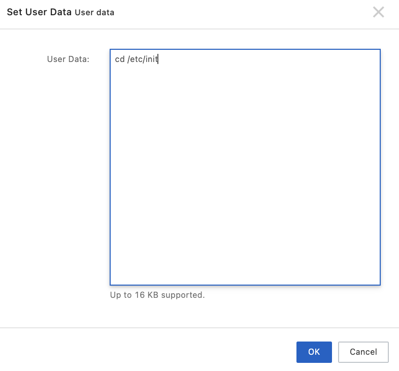{width="2.8935269028871393in"
height="2.6872287839020124in"}

Before changing the User Data, the instance must be stopped.

If you need to restart a VPC-based \`Pay-As-You-Go \`instance
immediately after changing the User Data, it is recommended to disable
the setting.

## Connection to an ECS instance 

If no Internet access is required, you can connect via the Management
Terminal from the console.

+---------------------+----------------------+------------------------+
| Source host         | Guest destination    | Connection method      |
+=====================+======================+========================+
| Windows, Linux, Mac | Linux                | VNC                    |
|                     |                      |                        |
|                     |                      | SSH key pair or        |
|                     |                      | password (SSH/PuTTY)   |
+---------------------+----------------------+------------------------+
| Windows             | Windows              | VNC                    |
|                     |                      |                        |
|                     |                      | Remote Desktop         |
|                     |                      | Connection             |
+---------------------+----------------------+------------------------+
| Linux               | Windows              | VNC                    |
|                     |                      |                        |
|                     |                      | rdesktop               |
+---------------------+----------------------+------------------------+
| Mac                 | Windows              | VNC                    |
|                     |                      |                        |
|                     |                      | Microsoft Remote       |
|                     |                      | Desktop Connection for |
|                     |                      | Mac                    |
+---------------------+----------------------+------------------------+

### Connecting with VNC 

You can connect to an ECS instance via VNC from the console. This method
works even if the instance does not have a public IP address.

To connect via VNC to a Linux instance:

-   Go to the \`ECS \`console,

-   Click on \`Instances & Images \| Instances,\`

-   Select the region,

-   Click on \`Connect \`on the line of the instance,

When you\` \`first connect, click on \`Modify VNC Password \`to change
the password.

{width="2.7638287401574804in"
height="1.8331692913385826in"}

-   Enter the VNC password,

-   Click on \`OK\`,

{width="2.800356517935258in"
height="1.4364785651793526in"}

-   Enter the password.

{width="4.5in"
height="0.6680555555555555in"}

To connect via VNC to a Windows instance, follow the same procedure but
once the password has been entered:

-   Select \`Send Remote Command \| CTRL+ALT+DELETE\`,

-   Enter the user name (\`Administrator\`),

-   Enter the password.

To change the VNC password:

-   Go to the \`ECS \`console,

-   Click on \`Instances & Images \| Instances,\`

-   Select the region,

-   Click on \`Connect \`on the line of the instance,

-   Click on \`Modify VNC Password\`,

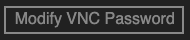{width="0.7919958442694663in"
height="0.16673556430446193in"}

-   Enter the new password,

-   Click on OK.

### Connect to a Linux instance with a password 

To be able to connect to an instance, it must be in \`Running \`state.

In addition, a security group must allow the SSH protocol:

  ------------------------------------------------------------------------------
  Rule        Authorization   Protocol   Port    Authorization   Authorization
  direction   policy          type       range   type            object
  ----------- --------------- ---------- ------- --------------- ---------------
  Inbound     Allow           SSH (22)   22/22   IP addresses    0.0.0.0/0

  ------------------------------------------------------------------------------

From Linux or MacOS, type the command:

ssh root@\<IP_ADDRESS\>

To connect to a Linux instance from Windows, use a remote connection
tool such as PuTTY:

-   Run \`putty.exe\`,

-   Click on \`Session\`,

-   \`Host Name\`: this is\` \`the public IP address or EIP of the
    instance,

-   \`Port\`: enter port \`22\`,

-   \`Connection Type\`: select \`SSH\`,

-   \`Saved Session\`: to avoid re-entering all these settings next
    time, you can enter a name for the saved settings and click
    \`Save\`,

-   Click on \`Open\`,

-   Click on \`Yes\`,

-   Enter the user name and password of the instance.

When you first connect, PuTTY displays an alert saying that PuTTY cannot
guarantee that the instance you specified is the one you think it is. To
help you verify that it is the right one, the instance fingerprint is
displayed. Once you confirm that it\'s the one you think it is, PuTTY
copies the public key to the PuTTY cache so you won\'t get this alert
the next time you connect.

### Managing SSH key pairs 

The SSH key pair only applies to Linux instances. Only 2048 bit RSA key
pairs are supported.

Alibaba Cloud holds the public key. You need to keep the private key
safe.

The private key is in PEM format.

To create a SSH key pair:

-   Go to the \`ECS \`console,

-   Select \`Networks & Security \| SSH Key Pairs,\`

-   Select the region,

-   Click on \`Create SSH Key Pair\`,

-   \`SSH Key Pair Name\`: this is\` \`the name of the key pair,

-   \`Creation Type\`:

```{=html}
<!-- -->
```
-   \`Auto-create\`: Alibaba Cloud creates a pair of keys for you,

The private key is automatically downloaded. Remember to save it
securely.

-   \`Import\`: imports a public key encoded in base 64,

If you are using a third-party tool to generate an RSA key pair, you
need to import the base 64 encoded public key into Alibaba Cloud by
selecting \`Import.\`

-   Click on \`OK\`.

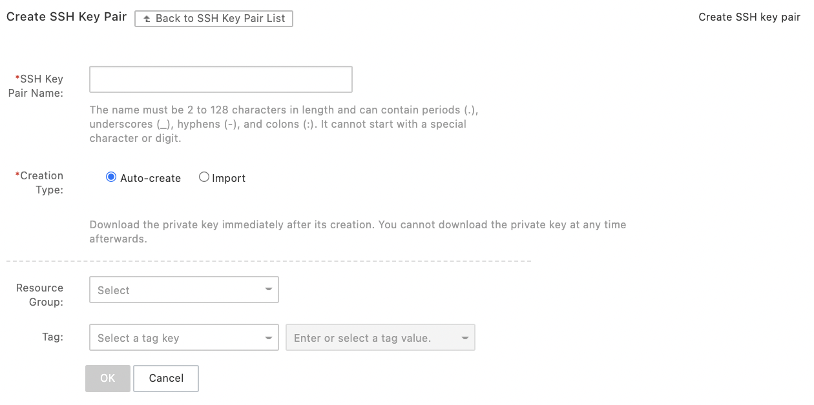{width="4.5in" height="2.2430555555555554in"}

Then you have to download the private key. It is needed to connect to
the ECS instance.

An ECS instance can only be attached to one SSH key pair.

If you change the SSH key pair while the ECS instance is in the
\`Running \`state, you must restart the instance.

If the ECS instance is configured for password-based authentication,
this feature is disabled automatically once a SSH key pair is associated
with this instance.

After removing a SSH key pair, you must reset the instance password.

To bind a SSH key pair to an ECS instance:

-   Go to the \`ECS \`console,

-   Click on \`Networks & Security \| SSH Key Pairs,\`

-   Select the region,

-   Click on \`Bind \`on the key pair line,

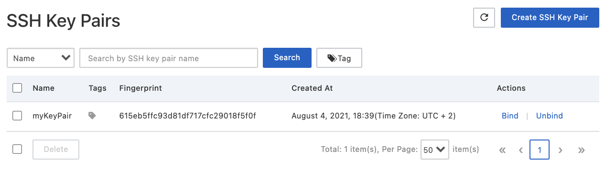{width="3.4366732283464567in"
height="0.9774365704286964in"}

-   Select one or more instances,

-   Click on \`OK\`.

{width="3.780217629046369in"
height="2.597150043744532in"}

To detach a SSH key pair:

-   Go to the \`ECS \`console,

-   Click on \`Networks & Security \| SSH Key Pairs,\`

-   Select the region,

-   Click \`Unbind \`on the key pair line,

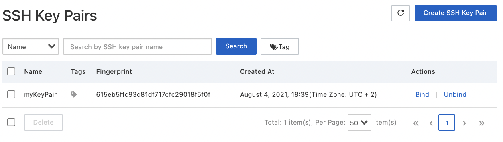{width="3.816231408573928in"
height="1.0824431321084864in"}

-   Select one or more instances,

-   Click on \`OK\`.

{width="3.753477690288714in"
height="2.4322309711286088in"}

Once you no longer need the SSH key pair, you can delete it. After
deletion, this key pair remains associated with the associated ECS
instances. The name of the key pair cannot be reused for a new key pair.

To delete a key pair:

-   Go to the \`ECS \`console,

-   Click on \`Networks & Security \| SSH Key Pairs,\`

-   Select a region,

-   Select one or more key pairs,

-   Click on \`Delete\`.

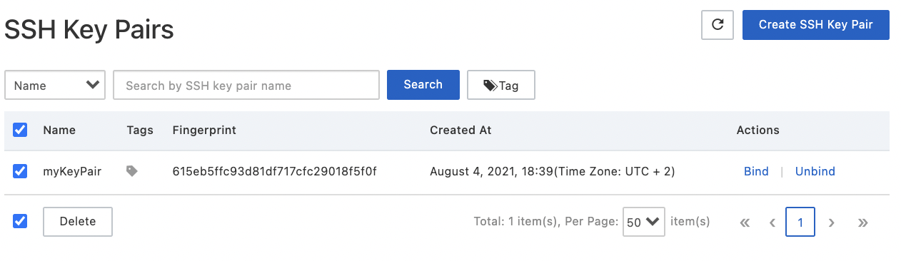{width="4.5in" height="1.304861111111111in"}

### Connect to a Linux instance with a SSH key pair 

To be able to connect to a Linux instance with a SSH key pair, you must
have authorized the SSH protocol in a security group:

  -------------------------------------------------------------------------------
  Rule        Authorization   Protocol   Port     Authorization   Authorization
  direction   policy          type       range    type            object
  ----------- --------------- ---------- -------- --------------- ---------------
  Inbound     Allow           SSH (22)   22/22    IP addresses    0.0.0.0/0

  -------------------------------------------------------------------------------

From Linux, there are two ways to connect:

-   Without configuration file:

```{=html}
<!-- -->
```
-   Modify file attributes:

chmod 400 \<PEM_PRIVATE_FILE\>

-   Connect to the instance:

ssh -i \<PEM_PRIVATE_FILE\> root@\<IP_ADDRESS\>

-   With configuration file:

```{=html}
<!-- -->
```
-   Add to the file \`/root/.ssh/config\`:

Host \<INSTANCE_NAME\>

HostName \<IP_ADDRESS\>

Port 22

User root

IdentityFile \<PEM_PRIVATE_FILE\>

-   Restart the SSH service,

service sshd restart

-   Connect to the ECS instance with SSH:

ssh \<INSTANCE_NAME\>

To connect from Windows, you can use a tool like PuTTY.

If you are using a \`.pem \`private key file, as generated by Alibaba
Cloud, you must convert it to \`.ppk \`format:

-   Launch PuTTYgen,

-   \`Type of key to generate:\` select \`RSA\`,

-   Click on \`Load\`,

-   Select the \`.pem \`private key file,

-   Click on \`OK\`,

-   Click on \`Save private key\`,

-   Click on \`Yes\`,

-   Enter the name of the private key,

-   Click on \`Save\`.

Now, start PuTTY then:

-   Select \`Connection \| SSH \| Auth\`,

-   Click on \`Browse\... \`,

-   Select the \`.ppk \`file,

-   Click on \`Session\`,

-   \`Host Name (or IP address)\`: this is\` \`the username and IP
    address of the instance in the format
    \`\<USERNAME\>@\<IP_ADDRESS\>\`,

-   \`Port\`: enter port \`22\`,

-   \`Connection type\`: select \`SSH \`as connection type,

-   Click on \`Open\`.

### Connect to a Windows instance 

To be able to connect to a Windows instance, you must have authorized
the SSH protocol in a security group:

  ----------------------------------------------------------------------------------
  Rule        Authorization   Protocol   Port range  Authorization   Authorization
  direction   policy          type                   type            object
  ----------- --------------- ---------- ----------- --------------- ---------------
  Inbound     Allow           RDP (3389) 3389/3389   IP addresses    0.0.0.0/0

  ----------------------------------------------------------------------------------

From Linux, to create a remote connection, you can use \`rdesktop\`.

-   Run \`rdesktop\`,

-   Run the command:

rdesktop -u \<USERNAME\> -p \<PASSWORD\> -f -g 1024\*720 \<IP_ADDRESS\>
-r clipboard:PRIMARYCLIPBOARD -r disk:sunray=/home/paul

The options used are the following:

-   \`-f:\` activates the full screen display,

-   \`-g:\` specifies the graphic resolution,

-   \`-r:\` specifies a multimedia configuration:

-   \`-r clipboard:PRIMARYCLIPBOARD\`: performs a direct copy/paste
    between the instances and the local host,

-   \`-r disk:mydirectory=/home/paul\`: associates a local directory
    with a directory of the instance.

To be able to connect to a Windows instance from Windows, you can use
Microsoft Terminal Services Client:

-   Select \`Start \| icon \| Remote Desktop Connection\`,

-   Click on \`Show Options\`,

-   Enter the IP address of the instance,

-   Enter the user name (\`Administrator\`),

-   Click on \`Connect\`.

To copy a local file to the instance, click on \`Local Resources\`.

To copy a text, select \`Clipboard\`.

## The Images 

An Alibaba Cloud Marketplace image contains all the elements needed to
create an ECS instance. It can store data from the system disk or the
system disk and data disks.

The images are classified in the following categories:

-   public images: provided by Alibaba Cloud,

-   custom images: created from instances, snapshots or from a local
    device,

-   shared images: these are provided and shared by other Alibaba Cloud
    accounts,

-   Alibaba Cloud Marketplace images: these are provided by Alibaba
    Cloud or third-party ISVs (Independent Software Vendors).

Some images may result in a charge.

Alibaba Cloud Linux is a secure, stable and high performance operating
system.

If you change the image, the data on the system disk will be lost.
Therefore, it is recommended to back up your data before.

### Custom images 

Custom images allow to create ECS instances with identical operating
system and environment. They are based on ECS disk snapshots.

A custom image can only be used in the region where it was created.

It is possible to change the operating system of an instance.

An instance created from a custom image can be upgraded in terms of CPU,
memory, bandwidth and disks.

It is recommended to unmount all data disks before creating a custom
image: the \`/etc/fstab \`file should not contain any information about
data disks.

Do not modify:

-   The \`/etc/fstab \`file,

-   the kernel version,

-   system disk partitions,

-   critical system files (\`/sbin\`, \`/bin\`, \`/lib\`, \...),

-   the default login name (\`root\`).

If the custom image contains data disks, the ECS instance is created
with these new data disks.

### Find an image 

You can search for an image by type, name, ID or snapshot ID.

To find an image with the console:

-   Go to the \`ECS \`console,

-   Click on \`Instances & Images \| Images\`,

-   Select a region,

-   Select an image type (\`Custom Image\`, \`Public Image\`, \`Shared
    Image\`, \`Marketplace Images\`),

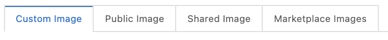{width="2.773708442694663in"
height="0.29106846019247595in"}

-   Select a search criterion and its value then click on the search
    icon.

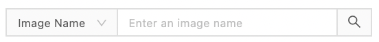{width="2.6242180664916885in"
height="0.29474956255468066in"}

To find an image with the API:

-   Go to the \`OpenApi Explorer (https://api.aliyun.com\`),

{width="4.5in"
height="2.5861111111111112in"}

-   Click on \`Elastic Compute Service\`,

-   Enter the API endpoint, the region and the corresponding parameters,

-   Click on \`Submit Request\`.

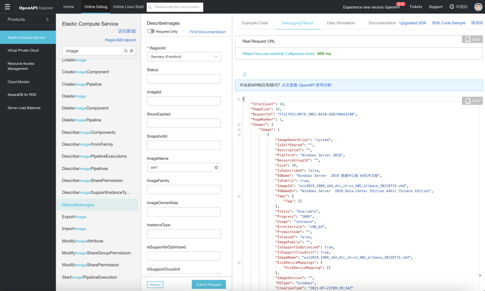{width="4.5in" height="2.7006944444444443in"}

IDs for custom images and images in the Alibaba Cloud Marketplace start
with \`m\`.

### Create a custom image using a snapshot 

A custom image is created from a system disk snapshot only, not from
data.

It is recommended to remove sensitive data before creating the image for
security reasons.

If a snapshot is selected, the disk size is the same as the snapshot
size. By default, the disk capacity of the snapshot is 5 GiB.

To create a custom image:

-   Go to the \`ECS \`console,

-   Click on \`Instances & Images \| Instances,\`

-   Select a region,

-   Click on \`Manage \`on the line of the instance,

-   Click on the \`Snapshot \`tab,

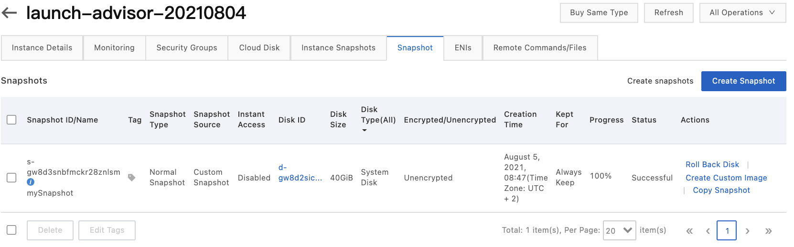{width="4.5in" height="1.4076388888888889in"}

-   Click on \`Create Custom Image \`of the snapshot whose disk type is
    \`System Disk\`,

-   \`System Snapshot ID\`: this is the snapshot ID,

-   \`Custom Image Name\`: this is the name of the custom image,

-   \`Custom Image Description\`: this\` \`is its description,

-   Check \`Add Data Disk Snapshot\`,

-   Select the data disk snapshots by clicking on \`Add\`,

-   Click on \`Create\`.

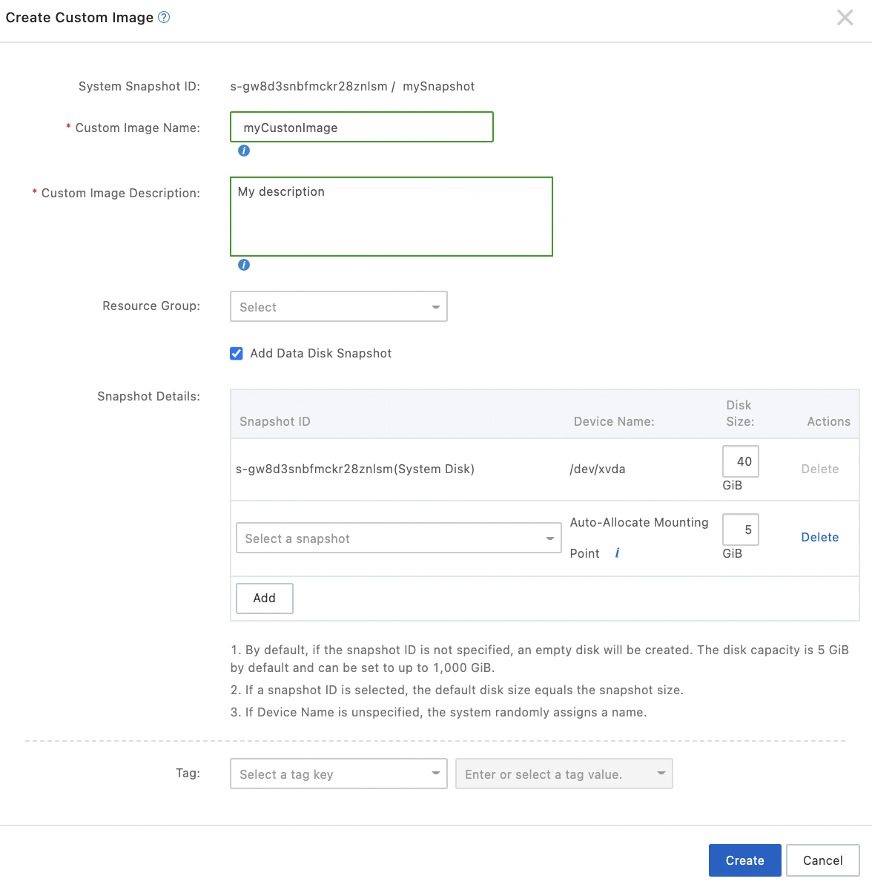{width="3.935343394575678in"
height="4.0155063429571305in"}

### Create a custom image using an instance 

It is possible to create a custom image based on an ECS instance. For
this, a snapshot is automatically created for all disks.

During creation, the status of the instance should not change.

It is not possible to export custom images that contain data disks.

To create a custom image using an instance:

-   Go to the \`ECS \`console,

-   Click on \`Instances & Images \| Instances,\`

-   Select the region,

-   Click on \`Disk and Image \| Create Custom Image \`on the line of
    the instance,

-   \`Custom Image Name\`: this is the name of the new image,

-   \`Custom Image Description\`: this is its description,

-   Click on \`Create\`.

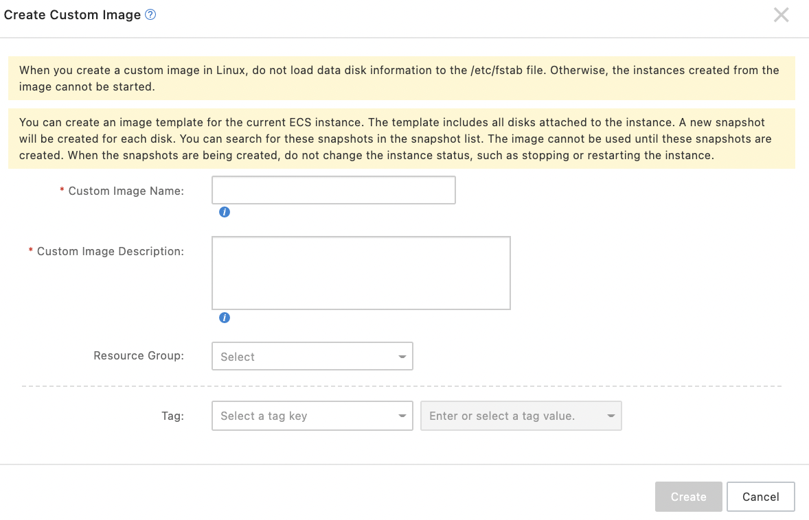{width="4.089393044619422in"
height="2.631599956255468in"}

### Edit an image 

To change the name and the description of a custom image:

-   Go to the \`ECS \`console,

-   Select \`Snapshots & Images \| Images,\`

-   Select the region,

-   Click on the pen icon next to the image name,

-   Enter the new name,

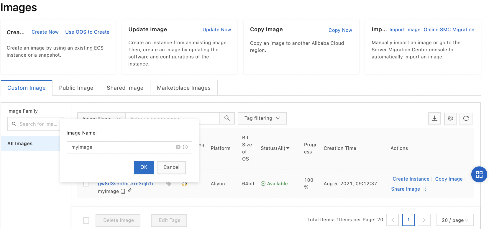{width="4.5in" height="2.10625in"}

-   Click on \`\... \| Modify Description \`the line of the instance,

-   Enter the new description,

-   Click on \`OK\`.

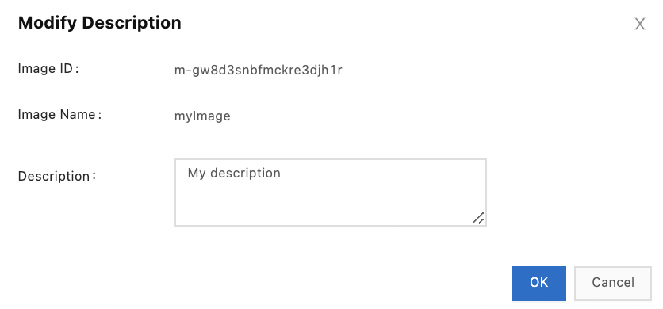{width="2.9507534995625546in"
height="1.3765627734033246in"}

### Delete an image 

To delete a custom image:

-   Go to the \`ECS \`console,

-   Select \`Snapshots & Images \| Images,\`

-   Select the region,

-   Click on the \`Custom Image \`tab,

-   Click on \`\... \| Delete Image \`on the image,

-   \`Delete Snapshots Contained Within Images\`: indicates whether
    snapshots contained within images should also be deleted

-   Click on \`OK\`.

{width="2.3776957567804025in"
height="0.937503280839895in"}

### Copy an image 

A custom image can be copied from one region to another. Copy an image
allows to deploy an application in another region.

When copying a custom image, a snapshot is created in the target region.
The image is then created from this new snapshot. However, user data,
roles and permissions are lost.

To copy an image:

-   Go to the \`ECS \`console,

-   Select \`Snapshots & Images \| Images,\`

-   Select the region,

-   Click on \`Copy Image \`on the line of the image to copy,

-   \`Destination Region\`: this is the target region,

-   \`Custom Image Name\`: this is the name of the image displayed in
    the other region,

-   \`Description\`: this is the description of the image displayed in
    the other region,

-   Click on \`OK\`,

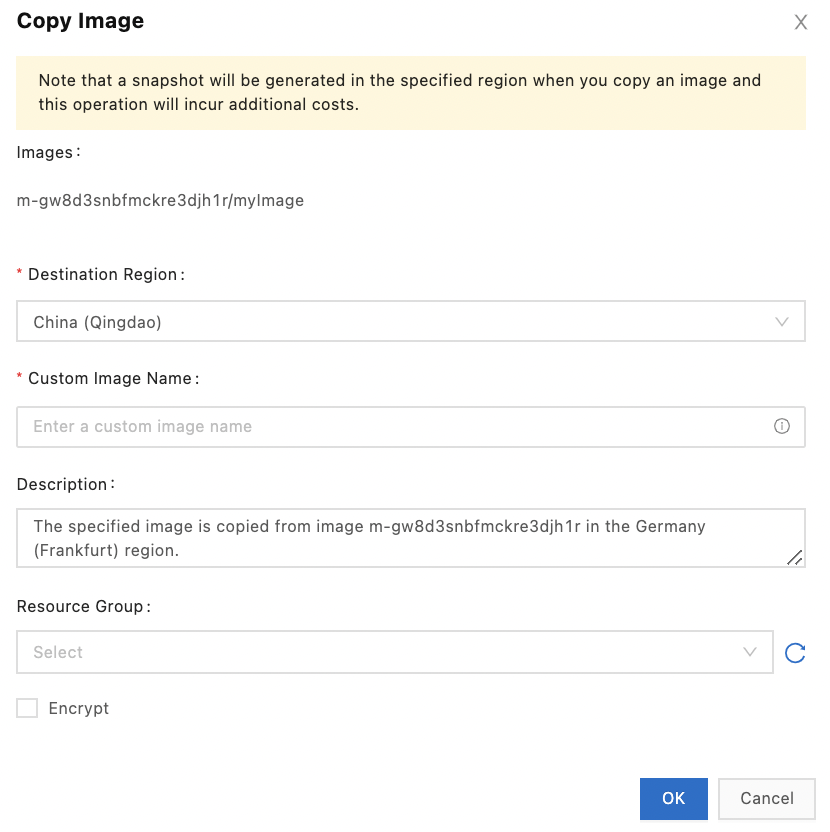{width="2.678510498687664in"
height="2.6851246719160105in"}

-   Switch to the target region,

-   Check the status of the project.

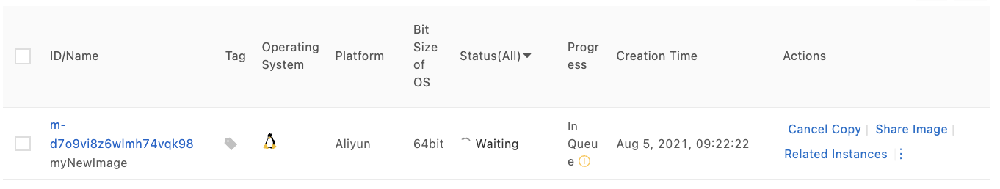{width="4.5in" height="0.8520833333333333in"}

### Share an image 

Sharing an image allows to quickly create ECS instances tailored to your
needs.

Shared images do not consume the image quota of the account.

It is only possible to share images that you have created yourself. A
custom image can be shared with up to 50 users in the same region. It
cannot be shared in another region.

The integrity and security of shared images is not guaranteed.

If the custom image has been shared with other accounts, before it can
be deleted, the sharing relationships for the image must be removed.
These other users will not be able to reinitialize their system drives
since the image will no longer be available.

To share an image:

-   Go to the \`ECS \`console,

-   Select \`Snapshots & Images \| Images,\`

-   Select the region,

-   Click on \`Share Image \`on the line of the image to share,

-   \`Account\`: this is the account ID for sharing,

-   Click on \`Share Image\`.

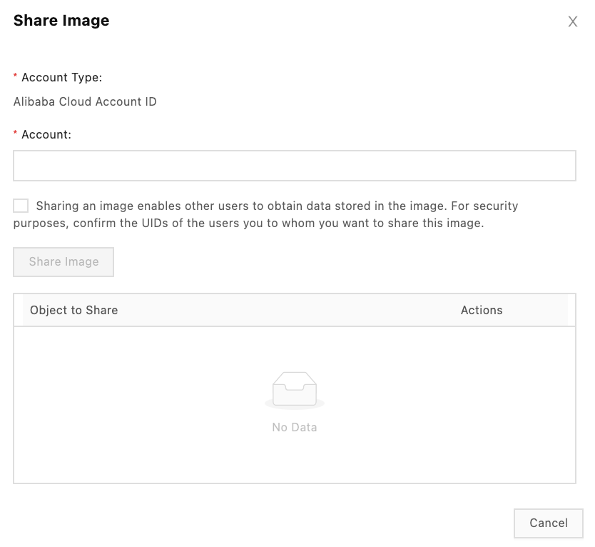{width="2.849045275590551in"
height="2.6169017935258094in"}

To cancel sharing:

-   Go to the \`ECS \`console,

-   Select \`Snapshots & Images \| Images,\`

-   Select the region,

-   Click on \`Share Image \`on the image line,

-   Click on \`Cancel Sharing \`on the line of the account that
    currently has sharing.

Accounts with whom the image is shared can see this image in \`Snapshots
& Images \| Images \| Shared Images \`in the correct region.

If you need to obtain your account ID:

-   Place the cursor on the user\'s avatar at the top right of the
    screen,

-   Click on the \`Security Settings \`tab\`.

{width="1.4879407261592301in"
height="1.5146292650918636in"}

\`The account number is then displayed.

### Import an image 

You can use the imported custom image to create an ECS instance or to
replace the system disk.

Imported custom images can come from servers or VMs.

It is possible to import on-premise image files into ECS.

Under Linux, follow these steps:

-   install a compliance tool to verify that the configuration meets the
    requirements,

-   install cloud-init to allow the initialization of the instances,

-   install the VirtIO drivers to allow the ECS instances to start,

-   convert the image file format,

-   import the image.

It is recommended to use the compliance tool to create standards
compliant images. The compliance tool can detect configuration
non-conformity and generate reports in text or JSON format. This tool
only supports Linux.

In Windows, follow these steps:

-   install the VirtIO driver,

-   convert the image file format,

-   import the image.

If the operating system you are using is not supported by Alibaba Cloud
and cloud-init could not be installed, you need to select \`Customized
Linux\` during import. You should then add a scan script to the image to
facilitate automatic configuration.

## The Tags 

A tag contains a key-value pair. Tags allow resources to be grouped into
categories and to manage these resources in a unified way.

Each key in a resource must be unique. Tag information is not shared
between regions.

The limit is 20 tags per resource. If a tag is detached and no longer
attached to any other resource, it is automatically deleted.

### Add a tag to a resource 

To attach a tag to a resource:

-   Go to the \`ECS \`console,

-   Click on \`Tags\`,

-   Select a region,

-   Click on \`Create/Bind Tags\`,

{width="3.1909711286089237in"
height="0.9705872703412074in"}

To create a tag, enter its name. To modify one, click on the tag and
then click on \`+ Add\`. It is the same for the value.

-   \`Tag Key:\` this is the key of the tag,

-   \`Tag Value\`: this is its value,

-   Click on \`Next\`,

{width="3.1892705599300086in"
height="2.1197812773403326in"}

-   Click on \`Next\`,

-   Select resources of the same type,

-   Click on \`OK\`,

-   Click on \`Close\`.

{width="3.1994542869641296in"
height="2.1137139107611547in"}

Once created, the tag is displayed in the list:

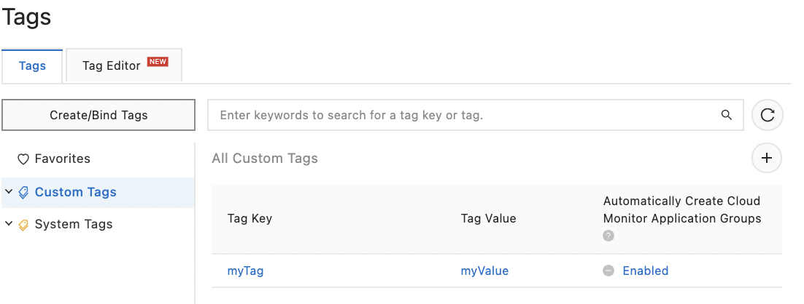{width="3.551284995625547in"
height="1.3470767716535432in"}

### Delete a tag 

You cannot directly delete a tag. However, if a tag is not attached to
any other resource, it is automatically deleted.

To unlink a tag from an instance:

-   Go to the \`ECS \`console,

-   Click on \`Tags\`,

-   Click on the key of a tag,

{width="3.033523622047244in"
height="1.1506791338582678in"}

-   Select one of the values displayed for the tag key,

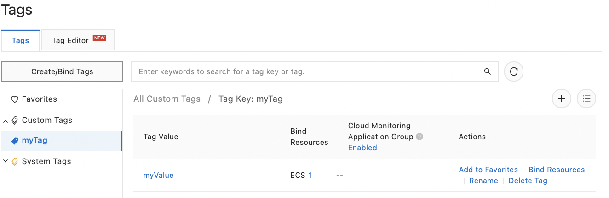{width="4.5in" height="1.4680555555555554in"}

-   Click on the \`Resources \`tab,

-   Select resources,

-   Move the cursor to \`Batch Operation\`,

-   Click on \`Unbind Tags\`.

{width="3.7158628608923885in"
height="2.0259470691163606in"}

### Search for resources using tags 

There are two ways to search for resources using tags.

The first one is done from the resources page:

-   Go to the \`ECS \`console,

-   Click on \`Instances & Images \| Instances,\`

-   Select a region,

-   Click on \`Tags\`,

-   Select a key.

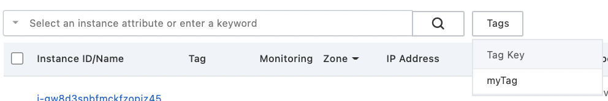{width="3.4469444444444446in"
height="0.5766185476815399in"}

The second is from the tags page:

-   Go to the \`ECS \`console,

-   Click on \`Tags\`,

-   Select a region,

-   Click on the \`Tags \`tab,

-   Select a key,

-   Click on one of the values of the tag key,

{width="4.1881791338582675in"
height="1.6306747594050743in"}

-   Click on \`Resources\`.

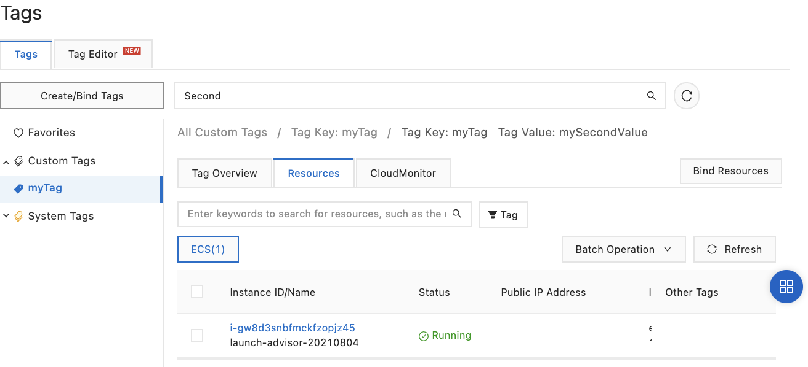{width="4.201563867016623in"
height="1.9153423009623798in"}

## The disks 

Block Storage is a high-performance, low-latency block storage service
for ECS instances. It is similar to a physical disk:

-   It supports random read and write operations.

-   It can be formatted.

-   It can contain a file system.

The disks use triplicate storage technology. This distributed file
system provides stable, efficient and reliable access to data in ECS
instances. Data reliability reaches 99.9999999%.

Local disks are a first type of block storage service. These are
physical disks attached to the physical machines that host the ECS
instances. They have low latency, high random IOPS and high throughput.
However, since they are attached to a single physical machine, they
present a risk of SPOF (Single Point Of Failure). They are therefore
suitable for high performance needs in storage I/O and mass storage. On
the other hand, the cost is high.

There are two categories of local disks:

-   local NVMe SSDs: they are suitable for online games, ecommerce,
    real-time streaming, NoSQL databases, distributed file systems, \...

-   local SATA HDDs: they are suitable for Big Data, mass storage and
    offline processing.

Cloud Disks are a second type of block storage service. They use the
\"tripilicate storage\" technology. This technology provides low
latency, high performance, durability and reliability. Thanks to the
triplicate storage mechanism, the data durability is 99.9999999% (nine
9).

A data Cloud Disk can be created with the console or with the API. It
must be in the same region and zone as the ECS instance. An ECS instance
can have up to 16 Cloud Disks.

It is not recommended to create a large data disk from the snapshot of a
small data disk.

After restoring a system disk, the login password or SSH key pair of the
ECS instance is retained.

Cloud Disks can be used as a system disk or a data disk. The system
disks contain the operating systems. Their life cycle is the same as the
ECS instances to which they are attached. The data disks store the
application data and can be created together with the instances or
separately.

Cloud Disks are classified into the following categories:

-   Enhanced SSDs (ESSDs),

-   Standard SSDs,

-   Ultra disks,

-   Basic disks.

ESSDs have low latency and can provide up to one million IOPS
(Input/Output operations Per Second). They are suitable for OLTP
(transactional) databases, NoSQL databases and ELK (Elasticsearch,
Logstash and Kibana) log analysis.

Standard SSDs offer consistently high random IOPS and high data
reliability. They are suitable for I/O-intensive applications, small and
medium relational databases, and NoSQL databases.

Ultra disks are cost-effective and offer average random IOPS and high
data reliability. They are suitable for system disks, development and
testing.

The Basic disks are from the previous generation and are no longer
available for purchase.

ESSDs have different PL (Performance Level):

  -------------------------------------------------------------------------
                PL3            PL2            PL1            PL0
  ------------- -------------- -------------- -------------- --------------
  I/O           Very high      High           Moderate       Moderate
  performance                                                

  Latency       Very low       Low            Low            Low

  Capacity      1.261 à 32.768 461 à 32.768   20 à 32.768    40 à 32.768
  (GiB)                                                      

  Data          99.9999999%    99.9999999%    99.9999999%    99.9999999%
  durability                                                 

  IOPS per disk min (1,800 +   min (1,800 +   min (1,800 +   min (1,800 +
                50 × capacity, 50 × capacity, 50 × capacity, 12 × capacity,
                1,000,000)     100,000)       50,000)        10,000)

  Throughput    min (120 + 0.5 min (120 + 0.5 Min (120 + 0.5 min (100 +
  per disk      × capacity,    × capacity,    × capacity,    0.25 ×
  (MB/s)        4,000)         750)           350)           capacity, 180)

  Usage         Large critical Average        Small and      
                databases,     databases,     medium MySQL   
                high usage     average ELK    and SQL Server 
                commercial     log clusters,  databases,     
                software       average        small and      
                               commercial     medium ELK log 
                               software       clusters,      
                                              commercial     
                                              software,      
                                              contained      
                                              applications   
  -------------------------------------------------------------------------

The file system used is shown in the following table:

  -----------------------------------------------------------------------
  Operating system        File system             Partition tool
  ----------------------- ----------------------- -----------------------
  Linux                   ext4 or xfs             parted

  Windows                 NTFS                    Disk management
  -----------------------------------------------------------------------

If you have created a data disk larger than 2 TiB from snapshots of a
data disk smaller than 2 TiB, you must first convert the partition
format from MNR to GPT and then format the data disk.

To partition and format a data disk larger than 2 TiB attached to a
Linux instance, you must use the GPT file system format instead of xfs
or ext4.

### Create a Cloud Disk 

To create a Cloud Disk:

-   Go to the \`ECS \`console,

-   Select \`Storage & Snapshots \| Disks,\`

-   Click on \`Create Disk\`,

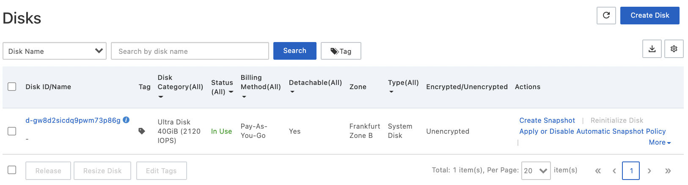{width="4.5in" height="1.2180555555555554in"}

-   Select region and area,

-   \`Storage\`: this is the disk category,

-   \`Quantity\`: this is the number of disks,

-   Click on \`Preview\`,

-   Click on \`Create\`.

{width="4.5in" height="5.5625in"}

It is not recommended to use Logical Volume Manager (LVM) volumes.

It is possible to create a Cloud Disk from the snapshot of an existing
system or data disk. As the data is retrieved from OSS, the initial
performance of the disk is reduced. In order to achieve normal
performance, it is therefore recommended to read each data block at
least once before going into production.

To create a Cloud Disk from a snapshot of an existing system or data
disk:

-   Go to the \`ECS \`console,

-   Select \`Storage & Snapshots \| Disks,\`

-   Click on \`Create Disk\`,

-   Click on \`Create from Snapshot\`,

{width="4.5in" height="0.3284722222222222in"}

-   Select a snapshot,

{width="3.2999332895888016in"
height="1.5267279090113737in"}

-   \`Attach\`: indicates to attach the disk to the instance (\`Attach
    to ECS Instance\`) or not (\`Not Attach\`),

-   \`Billing Method\`: this is\` \`the billing method of the disk
    (\`Pay-As-You-Go \`or \`Subscription\`),

-   \`Storage\`: this is the category of the disk and its capacity,

-   \`Quantity\`: this is the quantity of records,

-   \`Release\`: indicates whether the disks should be released at the
    same time as the release of the snapshots or the release of the ECS
    instance (only if \`Attach to ECS Instance \`has been selected for
    \`Attach\`),

-   Click on \`Preview\`,

-   Click on \`Create\`.

### Attaching a Cloud Disk 

The CloudDisk created at the same time as the ECS instances are attached
automatically.

A created Cloud Disk can be attached to an ECS instance at any time but
only as a data disk. However, the ECS instance must be in \`Running \`or
\`Stopped \`state and the Cloud Disk in \`Available \`state.

A Cloud Disk can only be attached to one ECS instance at a time.

To attach a Cloud Disk to an ECS instance:

-   Go to the \`ECS \`console,

-   Click on \`Instances & Images \| Instances,\`

-   Select a region,

-   Click on the ECS instance ID,

-   Click on the \`Cloud Disk \`tab,

-   Click on \`Attach Disk\`,

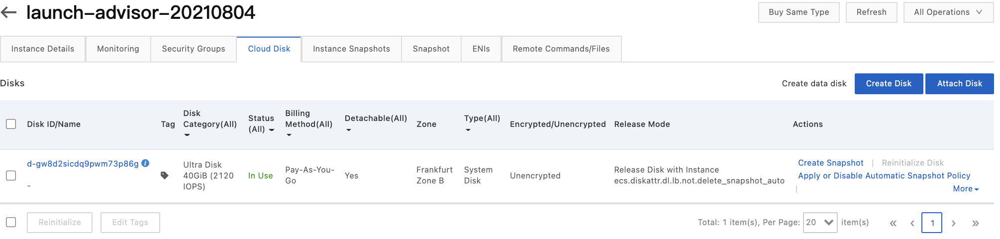{width="4.5in" height="1.0791666666666666in"}

-   \`Target Disk\`: select a disk with status \`Unmounted \`in the same
    region and area,

-   \`Release Disk with Instance\`: allows to release the disk together
    with the ECS instance,

-   \`Delete Automatic Snapshots While Releasing Disk\`: allows to
    delete automatic snapshots from the disk while releasing the ECS
    instance,

-   Click on \`OK\`,

-   Click on \`Attach\`.

{width="2.8360640857392827in"
height="2.087221128608924in"}

To attach a Cloud Disk from the disks page:

-   Go to the \`ECS \`console,

-   Select \`Storage & Snapshots \| Disks,\`

-   Select a region,

-   Select \`More \| Attach \`on the disk line (this disk must be in
    \`Unattached\` state\`)\`,

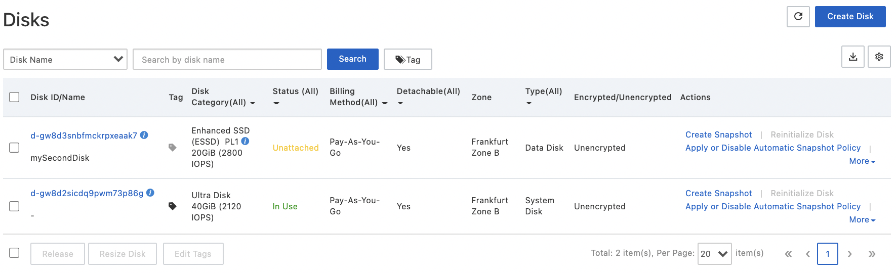{width="4.5in" height="1.3729166666666666in"}

-   \`Target Instance\`: this is the target ECS instance; it must be in
    the same zone,

-   \`Release Disk with Instance\`: allows to release the disk with the
    ECS instance,

-   \`Delete Automatic Snapshots While Releasing Disk\`: allows to
    delete automatic snapshots from the disk while releasing the ECS
    instance,

-   Click on \`Attach\`.

{width="2.722107392825897in"
height="1.873128827646544in"}

Manual snapshots are not deleted.

A Pay-As-You-Go Cloud Disk attached to an ECS instance can be detached
and then released if it is a data disk. If it is a system disk, it
cannot.

The Cloud Disk must be in \`In Use \`status.

Under Linux, it is recommended to unmount the partition with the
\`umount \`command and disable automatic mounting in the \`/etc/fstab
\`file. Under Windows, it is recommended to set the Cloud Disk to
\`Offline \`status with \`Disk Management \`to preserve data integrity.

To detach a disk from the ECS instances page:

-   Go to the \`ECS \`console,

-   Click on \`Instances & Images \| Instances,\`

-   Select a region,

-   Click on the ECS instance ID,

-   Click on the \`Cloud Disk \`tab,

{width="4.5in"
height="1.3583333333333334in"}

-   Select \`More \| Detach \`on the disk line,

-   Click on \`OK\`.

{width="3.097419072615923in"
height="2.2766983814523183in"}

The status of the disk changes to \`Unattached\`.

To detach a data disk from the disks page:

-   Go to the \`ECS \`console,

-   Select \`Storage & Snapshots \| Disks,\`

-   Select a region,

-   Select \`More \| Detach \`on the disk line,

-   Click on \`OK\`.

{width="2.7228838582677164in"
height="1.8808070866141733in"}

### Release a disk 

When you no longer need a system disk, it is recommended to release it
to avoid costs. The disk must be in \`Available \`state.

Disks billed as \`Subscription \`can only be released with the ECS
instance.

On release, automatic snapshots are released, unlike manual snapshots
which are kept. But this behavior can be modified.

To release a disk manually:

-   Go to the \`ECS \`console,

-   Select \`Storage & Snapshots \| Disks,\`

-   Select a region,

-   Select \`More \| Release \`on the disk line,

-   Click on \`Confirm Release\`.

{width="2.954446631671041in"
height="1.6860411198600176in"}

To have the disk automatically released together with the ECS instance,
you must activate \`Release with Instance \`when creating the instance
or do the following for an existing instance:

-   Go to the \`ECS \`console,

-   Select \`Storage & Snapshots \| Disks,\`

-   Select a region,

-   Select \`More \| Modify Disk Property \`on the disk line,

-   Check \`Release Disk with Instance\`,

-   Click on \`OK\`.

{width="2.798860454943132in"
height="1.4175710848643919in"}

### Resize a disk 

It is possible to resize a Cloud Disk. However, there are constraints
related to the image and the size of the disk.

Under Linux, the system disk capacity cannot be reduced, but you can
increase it. The maximum capacity of a system disk is 500 GiB.

Before changing a disk, it is recommended to make a backup during
off-peak hours.

It is important to make sure that the system disk has enough storage
space for the snapshot creation.

After changing the system disk under Linux, if a data disk is mounted
automatically, this configuration is lost. It is therefore recommended
to:

-   save the \`/etc/fstab \`file,

-   write the new partition and mount information to the /etc/fstab
    file,

-   mount file systems,

-   check disk space usage: \`df -h\`.

After a disk change, the snapshot policy is inoperative since the disk
ID has changed. You must then recreate a policy.

Under Windows, you can resize a data disk. The data disk can be resized,
but not the file system.

Before, it is recommended to create a manual snapshot. To do so, this
disk must be in \`Available \`or \`In Use \`status and the associated
ECS instance must be in \`Running \`or \`Stopped \`status. It is then
necessary to reboot.

### Reset a disk 

Reset this disk allows to restore a system or data disk to the state in
which it was created.

The snapshot policies are kept and the snapshots already made are
preserved.

The instance that uses the disk must be in \`Stopped \`status.

To reset a data disk:

-   Go to the \`ECS \`console,

-   Click on \`Instances & Images \| Instances,\`

-   Select a region,

-   Click on the ECS instance ID,

-   Click on \`Disks\`,

-   Click on \`Reinitialize Disk \`on the disk line,

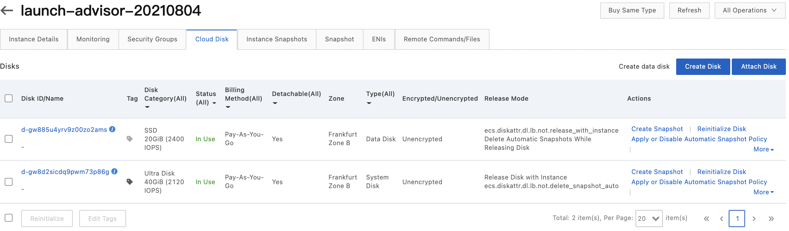{width="4.5in" height="1.3229166666666667in"}

-   Click on \`Confirm\`.

{width="2.427080052493438in"
height="1.4952012248468942in"}

### Replace the system disk with a public image 

If you want to change the operating system, you can replace the system
disk. In this case, the disk ID changes. However, the type of Cloud Disk
cannot be changed.

The disk image can be replaced with any image available on Alibaba
Cloud.

In order to avoid encountering a quota problem, it is recommended to
delete the snapshots of the old system disk.

When replacing the system disk between Linux and Windows, the file
format of the data disk may be unidentifiable. It is recommended to
reset the disk and format it according to the default file system of the
new operating system.

If you still want to keep important data on this disk:

-   when switching from Windows to Linux, install software such as
    NTFS-3G to make NTFS recognized under Linux; you must also use a
    password or SSH key pair for authentication,

-   to switch from Linux to Windows, install software such as \`Ext2Read
    \`or \`Ext2Fsd \`to make Windows recognize \`ext3\`, \`ext4 \`and
    \`XFS.\`

To replace the system disk with a public image:

-   Go to the \`ECS \`console,

-   Click on \`Instances & Images \| Instances,\`

-   Select a region,

-   Click on the ECS instance ID,

-   Select \`More \| Disk and Image \| Replace System Disk \`on the disk
    line,

-   Click on \`OK\`,

{width="2.7678226159230097in"
height="1.787979002624672in"}

-   \`Image\`: this is the image,

-   \`System Disk\`: this is the category of system disk,

-   \`Security Settings\`: this is the authentication method during the
    connection,

-   Click on \`Create Order\`.

{width="4.5in"
height="3.6555555555555554in"}

## The Security groups 

A security group is a kind of virtual firewall that filters packets to
isolate instances.

An ECS instance must have at least one security group. If necessary, use
the default security group. A security group can be attached to several
ECS instances.

Instances in different security groups cannot communicate with each
other unless you create a rule to allow it.

The security groups are stateful: if an outgoing packet is allowed, the
incoming packets corresponding to this connection are implicitly
allowed. The timeout period is 910 seconds.

There are two types of security groups:

-   Basic Security Groups,

-   Advanced Security Groups.

The Basic Security Group supports \`allow \`and \`forbid \`rules. If no
rule is specified, all incoming flows are forbidden and all outgoing
flows are allowed. It is possible to allow flows between security
groups.

The Advanced Security Group only concerns VPC type instances. Only
\`allow \`rules are allowed. If no rule is specified, all incoming and
outgoing flows are forbidden. Access to an instance of another security
group is forbidden, while access to an instance of the same security
group must be explicitly allowed by a rule. Advanced Security Groups
simplify the policy configuration of security group rules.

Managed Security Groups are managed by some cloud services. It is not
possible to perform any operations on groups. They are used to ensure
the availability of cloud services.

Some security groups are created by the system, others are created
manually. A default security group is created by Alibaba Cloud. This
includes default rules for ICMP, SSH (port 22), RDP (port 3389), HTTP
(port 80) and HTTPS (port 443) protocols.

The priority of manually created rules range from 1 to 100, with 100
being the lowest priority. The priority of the default rules is 1 and
was 110 before May 27, 2020.

In a Basic Security Group, by default, all incoming traffic is denied
and all outgoing traffic is allowed.

In an Advanced Security Group, all outgoing and incoming traffic is
denied.

In an Advanced Security Group, you cannot:

-   specify the \`Priority \`parameter,

-   specify the \`Security Group \`choice for \`Authorization Type\`,

-   specify the \`Forbid \`choice for \`Action\`.

The following is a list of typical ECS instance ports:

-   21: FTP,

-   22: SSH,

-   23: Telnet,

-   25: SMTP,

-   80: HTTP,

-   110: POP3,

-   143: IMAP,

-   443: HTTPS,

-   1433/1434: SQL Server,

-   1521: Oracle,

-   3306: MySQL,

-   3389: Windows Server Remote Desktop Services,

-   8080: Proxy port,

-   137, 138, 139: NetBIOS protocol.

Some operators may block certain ports, which they consider unsafe. In
this case, the solution is to change the port.

A CIDR block or \`0.0.0.0/0 \`indicates all IP addresses.

### Create a security group 

To create a security group:

-   Go to the \`ECS \`console,

-   Select \`Networks & Security \| Security Groups,\`

-   Select the region,

-   Click on \`Create Security Group\`,

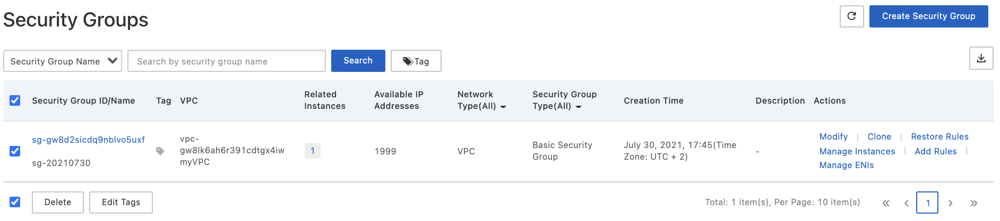{width="4.5in" height="0.9986111111111111in"}

-   \`Template\`: this is the template,

You can select the template for Linux or Windows web servers, or you can
completely customize the security group.

-   \`Security Group Name\`: this is\` \`the name of the security group,

-   \`Description\`: this is the description,

-   \`Network Type\`: this\` \`is the type of network:

```{=html}
<!-- -->
```
-   For a VPC-based security group, select a VPC.

-   For a security group based on a classic network, select \`Classic
    Network\`.

To create a VPC, click on \`Create VPC\`.

-   \`Resource Group\`: this is the group of resources to which the user
    belongs,

-   \`Security Group Type\`: this is the type of security group (\`Basic
    Security Group\` or \`Advanced Security Group\`),\`

-   Tags\`: these are the attached tags,

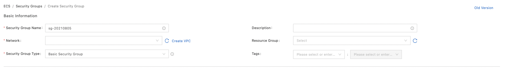{width="4.5in" height="0.6305555555555555in"}

-   Click on \`Outbound \`to create an outbound rule, i.e. where ECS
    instances access other ECS instances via Intranet or Internet,

-   Click \`Inbound \`to create an inbound rule, i.e. where other ECS
    instances access this ECS instance or Internet resources access this
    ECS instance,

-   Click on \`Add Rule \`on the security group line: a line is added,

For a traditional network-based security group, you can select
\`Internet Ingress\`, \`Internet Egress\`, \`Inbound \`or \`Outbound\`.

-   \`Action\`: select \`Allow \`or \`Forbid\`,

-   \`Priority\`: this is the priority (from 1 to 100); the smallest
    values have the highest priority,

The priority cannot be changed for Advanced Security Groups.

-   \`Protocol Type \`and \`Port Range\`: the port range depends on the
    selected protoco ; the proposed values are:

```{=html}
<!-- -->
```
-   \`All \`(\`-1/-1\`): i.e. all ports,

-   \`All ICMP (-1/-1\`): i.e. all ports (used for \`ping \`commands and
    network status detection),

-   \`All GRE (-1/-1\`): i.e. all ports (used for VPN),

-   \`Custom TCP \`and \`Custom UDP\`: allows to customize the port
    ranges, each port can be from 1 to 65535,

-   \`SSH \`(\`22/22\`): used to connect remotely to a Linux instance
    with \`ssh\`,

-   \`TELNET \`(\`23/23\`): used to connect remotely to a Linux instance
    with \`telnet\`,

-   \`HTTP \`(\`80/80\`),

-   \`HTTPS \`(\`443/443\`),

-   \`MS SQL \`(\`1433/1433\`),

-   \`Oracle \`(\`1521/1521\`),

-   \`MySQL \`(\`3306/3306\`),

-   \`RDP \`(\`3389/3389\`): used to remotely connect to a Windows
    instance,

-   \`PostgreSQL \`(\`5432/5432\`),

-   \`Redis \`(\`6379/6379\`),

Port 25 is restricted and cannot be opened by the security group rules.
To open it, you have to open a ticket.

-   \`Authorization Object\`: it is an IPv4 CIDR block (or \`0.0.0.0/0
    \`to indicate all IP addresses) or a security group,

The choice of a Security Group allows the instances of a security group
of the same VPC or of another account to access the instances of this
security group. This only affects the internal network and the Basic
Security Groups.

-   \`Description\`: this is the description,

-   Click on \`OK\`.

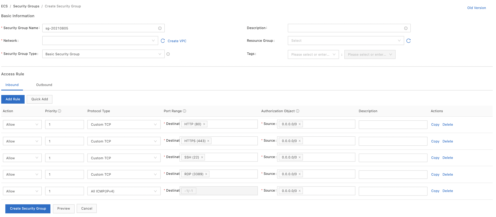{width="4.5in" height="1.9708333333333334in"}

The effect of the safety groups is usually immediate.

ECS instances can belong to different security groups. They can
therefore have several conflicting security group rules. Which rule
takes effect depends on the \`Priority \`settings and the authorization
policy:

-   If the rules have the same priority, the \`Forbid \`rule takes
    precedence over the \`Allow rule\`,

-   If the rules have different priorities, the rule with the highest
    priority takes effect first.

### Display the contents of the security groups 

To display the list of security groups:

-   Go to the \`ECS \`console,

-   Click on \`Networks & Security \| Security Groups,\`

-   Select the region,

-   Select \`VPC ID \`as search criteria,

-   Select the name or ID of the VPC.

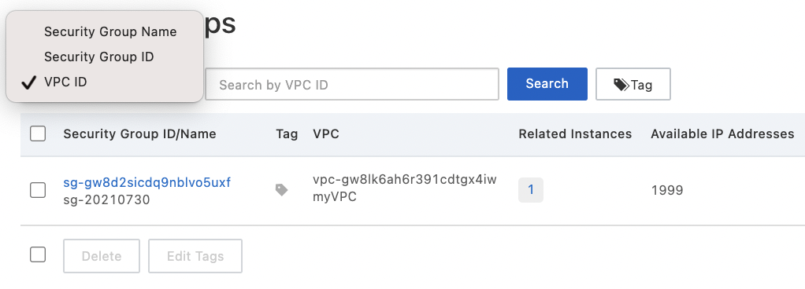{width="3.2508573928258966in"
height="1.1704090113735783in"}

To display the security group rules:

-   Go to the \`ECS \`console,

-   Click on \`Networks & Security \| Security Groups,\`

-   Select the region,

-   Click on \`Add Rules \`on the security group line,

-   Select the tab corresponding to the direction (\`Inbound \`or
    \`Outbound\`).

{width="4.5in"
height="2.2333333333333334in"}

### Associate a security group with an instance 

To add an instance to a security group:

-   Go to the \`ECS \`console,

-   Click on \`Instances & Images \| Instances,\`

-   Select the region,

-   Click on \`Manage Instances \`on the line of the instance,

-   Click on the \`Security Groups \`tab,

-   Click on \`Add to Security Group\`,

{width="4.5in"
height="1.2409722222222221in"}

-   Select the security group,

-   To select multiple security groups, click on \`Join Multiple
    Security Groups\`,

-   Click on \`OK\`.

{width="2.6615365266841646in"
height="1.6240310586176727in"}

### Modify a security group 

To change the attributes of a security group:

-   Go to the \`ECS \`console,

-   Click on \`Networks & Security \| Security Groups,\`

-   Select the region,

-   Click \`Modify \`on the security group line,

-   \`Security Group Name\`: this\` \`is the name,

-   \`Description\`: this is the description,

-   Click on \`OK\`.

{width="3.2308016185476816in"
height="1.8532239720034995in"}

To change the rules of a security group:

-   Go to the \`ECS \`console,

-   Click on \`Networks & Security \| Security Groups,\`

-   Select the region,

-   Click on \`Add Rules \`on the security group line,

-   Select the tab corresponding to the direction (\`Inbound \`or
    \`Outbound\`),

{width="4.5in"
height="2.1791666666666667in"}

-   Click on \`Modify \`on the line of the rule to be modified,

-   Change the rule,

-   Click on \`Save\`.

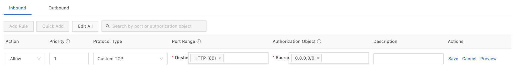{width="4.5in" height="0.5993055555555555in"}

### Delete a security group 

Deleting a security group removes all associated rules. Before
proceeding, check that no ECS instance uses this security group and that
no security group refers to this security group.

To delete a security group:

-   Go to the \`ECS \`console,

-   Click on \`Networks & Security \| Security Groups,\`

-   Select the region,

-   Select one or more security groups,

-   Click on \`Delete\`,

-   Click on \`OK\`.

To delete a rule from a security group:

-   Go to the \`ECS \`console,

-   Click on \`Networks & Security \| Security Groups,\`

-   Select the region,

-   Click on \`Add Rules \`on the security group line,

-   Select the tab corresponding to the direction (\`Inbound \`or
    \`Outbound\`),

-   Click on \`Delete \`on the line of the rule to be deleted,

-   Click on \`OK\`.

### Import and export rules 

It is possible to export the security group rules to a JSON file.

To export the security group rules:

-   Go to the \`ECS \`console,

-   Click on \`Network & Security \| Security Groups,\`

-   Select the region,

-   Click on \`Add Rules \`on the security group line,

-   Click on \`Export \`and select the JSON or CSV export format.

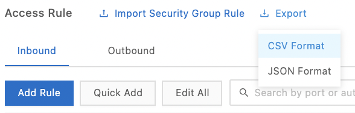{width="2.01173009623797in"
height="0.6432064741907262in"}

It is possible to import the rules of a security group from different
regions.

Up to 100 security group rules can be imported. New imported rules do
not overwrite existing rules.

To import rules from an export:

-   Go to the \`ECS \`console,

-   Click on \`Network & Security \| Security Groups,\`

-   Select the region,

-   Click on \`Add Rules \`on the security group line,

-   Click on \`Import Security Group Rules\`,

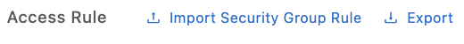{width="2.331071741032371in"
height="0.2241415135608049in"}

-   Click on \`Select a file\`,

-   Select the file,

-   Click on \`Start\`.

{width="4.127989938757655in"
height="1.8646030183727034in"}

### Cloning a security group 

It is possible to clone a security group across different regions and
network types.

To clone a security group:

-   Go to the \`ECS \`console,

-   Select \`Networks & Security \| Security Groups\`,

-   Select the region,

-   Click on \`Clone \`on the security group line,\`

-   Destination Region\`: this is the region suitable for the new
    security group,

-   \`Security Group Name\`: this is the name of the new security group,

-   \`Description\`: this is the description,

-   \`Network Type\`: this is the type of network,

-   \`VPC\`: this is the VPC (if the network type is VPC),

-   Click on \`OK.

{width="2.902571084864392in"
height="2.584990157480315in"}

### \`Restore the rules of a security group 

It is possible to restore the original security group rules. This
restoration can be done in a complete and partial way.

With \`Completely Restore\`, the original rules overwrite the current
rules.

With \`Partially\` \`Restore\`, rules that only exist in the current
security group are added to the original security group. Rules that only
exist in the original group are ignored.

Both security groups must be in the same region and of the same network
type.

To restore a security group\'s rules:

-   Go to the \`ECS \`console,

-   Select \`Networks & Security \| Security Groups,\`

-   Select the region,

-   Click on \`Restore Rules \`on the security group line,

-   \`Destination Security Group\`: select a security group,

-   \`Restoration Type\`: select the \`Completely Restore \`or
    \`Partially Restore \`method,

-   Check the expected result,

The rules in green only exist in the current security group and the
rules in red do not exist in the current security group.

-   Click on \`OK\`.

{width="3.600227471566054in"
height="2.130690069991251in"}

## THE ENI 

An ENI (Elastic Network Interface) is a virtual NIC (Network Interface
Controller). It can be associated with an ECS VPC instance and can be
used to deploy high-availability clusters, perform low-cost failover and
manage the network in a fine-grained way.

Only I/O-optimized instance types and VPC-type instances support ENI.

The ENI can be migrated between instances. When an ENI is unlinked and
then linked to another ECS instance, its attributes remain unchanged.

When creating an ECS instance, if you create an ENI, it is automatically
associated with the ECS instance. An ECS instance can have multiple
secondary ENIs as long as they are in the same area of the same VPC, but
the vSwitch can be different.

An ENI can have several secondary private IP addresses.

The attributes of an ENI are:

-   the type of ENI: this is the type of the ENI,

Primary ENIs are created with the instance and have the same life cycle
as the associated ECS instances.

Secondary ENIs can be created separately and are freely associated or
dissociated.

-   the VPC: this is the VPC in which the ENI must be located,

The ENI and the ECS instance to which it is linked must be in the same
VPC.

-   the area: this is the area in which the ENI is located,

The vSwitch to which the ENI belongs must be in the same zone as the
instance to which the ENI is associated.

-   the safety group,

When an ECS instance is moved to another security group, the primary ENI
is also moved, unlike the secondary ENIs.

-   the EIP,

An ENI can be associated with one or more EIPs.

-   the primary private IP address,

-   the secondary private IP address,

The secondary private IP address can be assigned or revoked.

The primary or secondary private IP addresses must be within the range
of the VSwitch\'s inactive CIDR block.

-   The MAC address (Media Access Control): this is the identifier of
    the ENI.

### Create an ENI 

When creating an instance in the console, you can attach two ENIs: a
primary and a secondary one. Once the instance is started, it is
possible to add a secondary ENI.

To create an ENI:

-   Go to the \`ECS \`console,

-   Select \`Networks & Security \| ENIs,\`

-   Select the region,

-   Click on \`Create ENI\`,

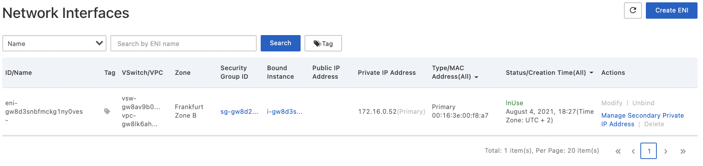{width="4.5in" height="1.0673611111111112in"}

-   \`ENI Name\`: this is\` \`the name of the ENI,

-   \`VPC\`: this is the VPC,

-   \`VSwitch\`: this is the vSwitch,

-   \`Primary Private IP\`: this is\` \`the private IP address of the
    ENI,

The IP address must be available in the CIDR block of the specified
vSwitch. If none is specified, an IP address is automatically assigned.

-   \`Security Group\`: this is the security group of the VPC,

-   \`Description\`: this is\` \`the description of the ENI,

-   Click on \`OK\`.

{width="2.920530402449694in"
height="4.132010061242345in"}

### Attaching an ENI to an instance 

The ENI must be in \`Available \`status and the instance must be in
\`Stopped \`or \`Running \`status.

If the ECS instance is of type VPC, the ENI must be in the same VPC.

An ENI can only be linked to one ECS instance at a time but an ECS
instance can have several ENIs. Only one secondary ENI can be attached
to an ECS instance.

For the following image types, the ENIs are identified automatically and
do not require any configuration:

-   Centos 7.3 64-bit,

-   Centos 6.8 64-bit,

-   Windows Server 2008 R2 and later.

For other types of images, you have to configure the ENI manually.

To attach an ENI to an instance:

-   Go to the \`ECS \`console,

-   Select \`Networks & Security \| ENIs,\`

-   Select the region,

-   Click on \`Bind to Instance \`on the ENI line,

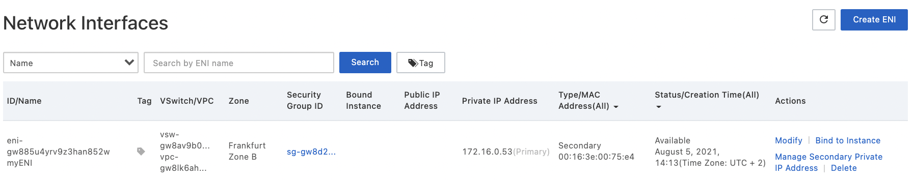{width="4.5in" height="0.8881944444444444in"}

-   \`Select Instance\`: this is the instance,

-   Click on \`OK\`.

{width="2.392594050743657in"
height="1.1903893263342082in"}

### Detach an ENI from an instance 

Only the secondary ENI can be detached from the instance. The ENI must
be in \`Bound \`state and the ECS instance must be in \`Stopped \`or
\`Running \`state.

To detach a secondary ENI from an instance:

-   Go to the \`ECS \`console,

-   Select \`Networks & Security \| ENIs,\`

-   Select the region,

-   Click on \`Unbind \`on the ENI line,

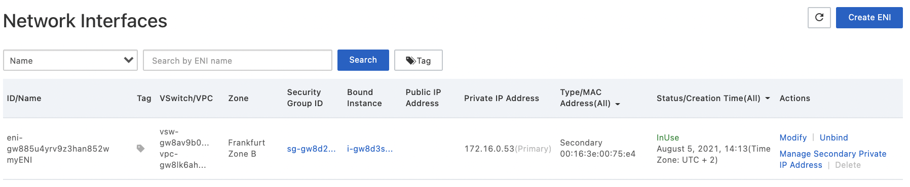{width="4.5in" height="0.9270833333333334in"}

-   Click on \`OK\`.

{width="2.766920384951881in"
height="1.1554461942257217in"}

### Associate a secondary private IP address with an ENI 

You can associate multiple secondary private IP addresses with a primary
or secondary ENI. This allows an ECS instance to host multiple
applications or assists in failover by disassociating and then
associating the ENI with another instance.

The number of private IP addresses that an ENI can have depends on the
type of instance.

The ECS instance must be in \`Running \`or \`Stopped \`status.

To associate a secondary private IP address:

-   Go to the \`ECS \`console,

-   Click on \`Network & Security \| ENIs\`,

-   Select a region,

-   Click on \`Manage Secondary Private IP Address \`on the ENI line,

{width="4.5in" height="0.8881944444444444in"}

-   Click on \`Assign New IP\`,

{width="2.7969313210848643in"
height="0.7087281277340333in"}

-   Click on \`OK\`.

{width="2.8506528871391077in"
height="3.2052252843394577in"}

### Modify an ENI 

To edit a primary ENI:

-   Go to the \`ECS \`console,

-   Select \`Networks & Security \| Security Groups,\`

-   Select the region,

-   Click \`Manage Instances \`on the security group line,

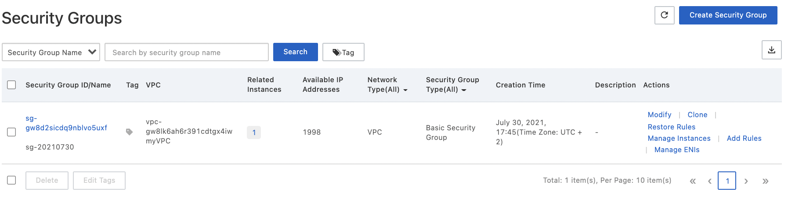{width="4.5in" height="1.1590277777777778in"}

-   To add a primary ENI to the security group:

```{=html}
<!-- -->
```
-   Click on \`Add Instance\`,

-   Click on the instance ID,

-   Click on \`OK\`,

{width="0.841599956255468in"
height="0.24433508311461066in"}

-   To remove a primary ENI:

```{=html}
<!-- -->
```
-   Select the instance,

-   Click \`Remove from Security Group\`,

{width="1.3768339895013124in"
height="0.8484273840769904in"}

-   Click on \`OK\`.

{width="2.667606080489939in"
height="1.4153127734033246in"}

To change the attributes of a secondary ENI:

-   Go to the \`ECS \`console,

-   Select \`Networks & Security \| ENIs\`,

-   Select the region,

-   Click on \`Modify \`on the ENI line,

-   \`ENI Name\`: this is\` \`the name of the ENI,

-   \`Security Group\`: these are the security groups, the ENI must be
    maintained in at least one security group.

-   \`Description\`: this is the description.

-   Click on \`OK\`.

{width="3.066891951006124in"
height="2.372108486439195in"}

The ENI must be in \`Available \`or \`Bound \`state.

### Delete an ENI 

Only a secondary ENI can be deleted. The ENI must be in \`Available
\`state. The primary IP address is then released. Deleted ENIs are
automatically removed from all associated security groups.

When releasing an ECS instance, all attached ENIs are deleted.

To delete an ENI:

-   Go to the \`ECS \`console,

-   Select \`Networks & Security \| ENIs,\`

-   Select the region,

-   Click on \`Delete \`on the ENI line,

-   Click on \`OK\`.

## The Snapshots 

A snapshot records the state of the data on a disk at a precise moment.
It allows to save data and to customize images.

The incremental mode implies that the first snapshot of the disk saves
the data of the whole disk, which takes more time. Subsequent snapshots,
on the other hand, are created more quickly.

The duration of the creation of a snapshot also depends on the volume of
data created since the creation of the first snapshot.

Snapshots can be performed automatically, using a policy, or manually. A
manual snapshot cannot be performed while an automatic snapshot is being
performed.

### Create a snapshot 

It is recommended to start these operations during off-peak hours to
avoid service interruptions.

It is also recommended not to change the state of the ECS instance while
creating the snpashot.

A snapshot can be done automatically or manually.

To create an automatic snapshot, you must define an automatic snapshot
policy. An automatic snapshot policy is a set of parameters. A maximum
of 100 automatic snapshot policies can be created per region.

To create an automatic snapshot policy:

-   Go to the \`ECS \`console,

-   Select \`Storage & Snapshots \| Snapshots,\`

-   Select a region,

-   Click on the \`Automatic Snapshot Policies \`tab,

{width="4.5in"
height="1.117361111111111in"}

-   Click \`Create Policy \`to create a policy or click \`Modify Policy
    \`in the \`Actions \`column to modify a policy,

-   \`Name\`: this is the name of the policy,

-   \`Executed At:\` this is time,

-   \`Execution Frequency\`: this is the execution frequency,

-   \`Keep Snapshots\`: this is the number of days that a snapshot
    should be kept (from 1 to 65535 days or permanently) (by default 30
    days), \`Always Keep \`to not set a limit on the number of days,

-   \`Tag\`: add tags to snapshots,

-   \`Cross-Region Replication for Snapshots\`: if enabled, automatic
    snapshots are copied to the destination region,

-   \`Destination Region \`(if \`Cross-Region Replication for Snapshots
    \`is enabled): this is the region to which to copy snapshots,

-   \`Retention Time of Snapshot Copies \`(if \`Cross-Region Replication
    for Snapshots \`is enabled): this is the retention time of snapshot
    copies in the destination region,

```{=html}
<!-- -->
```
-   \`Keep For\`: this is the snapshot retention period (from 1 to 65536
    days),

-   \`Always Keep Snapshots Regardless of the Limit of Snapshots\`: if
    enabled, copies of snapshots in the destination region are kept
    indefinitely,

```{=html}
<!-- -->
```
-   Click on \`OK\`.

{width="3.068562992125984in"
height="5.528444881889763in"}

When the number of snapshots exceeds the limit, the oldest automatically
created snapshots are deleted.

To create a snapshot manually, the ECS instance state must be \`Running
\`or \`Stopped \`and the disk state must be \`Running\`. Manually
created snapshots must be deleted manually.

If the snapshot is created on an extended volume using a multi-partition
disk, you can use it to rollback a Cloud Disk.

To create a snapshot:

-   Go to the \`ECS \`console,

-   Select the region,

-   Click on \`Instances & Images \| Instances,\`

-   Click on \`Manage \`on the line of the instance,

-   Click on the \`Cloud Disk \`tab,

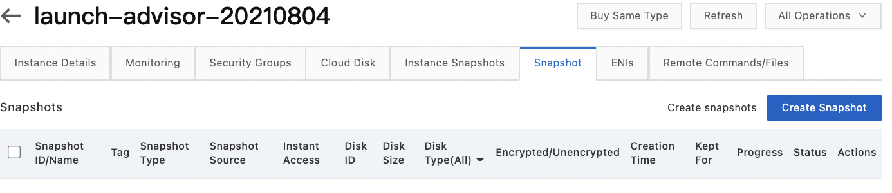{width="4.5in" height="0.9805555555555555in"}

-   Click on \`Create Snapshot \`on the disk line,

-   Enter the name of the snapshot,

-   Click on \`Create\`.

{width="3.2876443569553806in"
height="2.614388670166229in"}

### Apply an automatic snapshot policy to disks 

To apply an automatic snapshot policy to disks from the disks menu:

-   Go to the \`ECS \`console,

-   Select \`Storage & Snapshots \| Disks,\`

-   Select the region,

-   Click \`Apply or Disable Automatic Snapshot Policy \`on the disk
    line,

-   Enable \`Automatic Snapshot Policy\`,

-   \`Name\`: this is the snapshot policy,

-   Click on \`OK\`.

{width="2.871312335958005in"
height="2.0688517060367455in"}

To apply an automatic snapshot policy to disks from the snapshot menu:

-   Go to the \`ECS \`console,

-   Select \`Storage & Snapshots \| Snapshots,\`

-   Select the region,

-   Click on the \`Automatic Snapshot Policies \`tab,

-   Click \`Apply or Disable Policy \`on the policy line,

{width="4.5in"
height="1.551388888888889in"}

-   Click on the \`Disks Without Policy Applied \`tab,

-   Select the automatic snapshot policy,

-   Click \`Apply Policy\`.

If the policy is already enabled, you can disable it by clicking
\`Disable Policy\`.

{width="3.2318985126859143in"
height="2.0329035433070866in"}

It is possible to obtain the list of Cloud Disks without an associated
automatic snapshot policy by selecting \`Disks without Policy Applied\`.

Automatic snapshots are named with the format \`auto_yyyymmdd_1\`.

### Delete a snapshot 

In order to avoid paying unnecessary storage fees, it is recommended to
delete unnecessary automatic snapshots when the quota has been reached.
By default, automatic snapshots are not deleted when disks are released.

If the snapshot was used to create a custom image, the associated image
must be deleted before the snapshot can be deleted.

To delete a manual snapshot:

-   Go to the \`ECS \`console,

-   Select \`Storage & Snapshots \| Snapshots,\`

-   Select a region,

-   Click on the \`Snapshots \`tab,

-   Select a snapshot,

-   Click on \`Delete\`,

-   Click on \`OK\`.

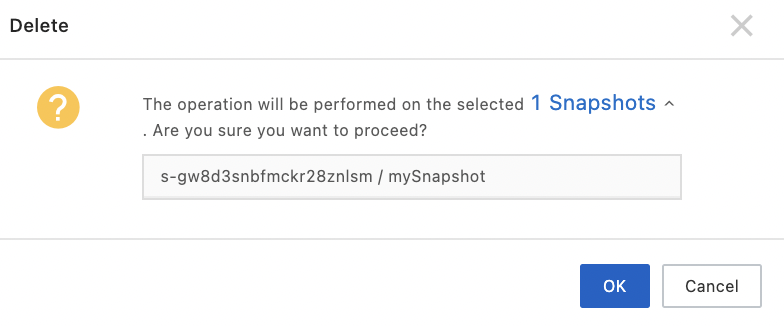{width="2.6937357830271216in"
height="1.1198950131233596in"}

To delete an automatic snapshot policy:

-   Go to the \`ECS \`console,

-   Select \`Storage & Snapshots \| Snapshots,\`

-   Select a region,

-   Click on the \`Automatic Snapshot Policies \`tab,\`

-   \`Click \`Delete Policy \`on the policy line,

-   Click on \`OK\`.

{width="2.631622922134733in"
height="1.1257491251093614in"}

To delete a snapshot automatically along with the disks:

-   Go to the \`ECS \`console,

-   Click on \`Storage & Snapshots \| Disks,\`

-   Select the region,

-   Click on \`More \| Modify Disk Property \`on the disk line,\`

-   \`Select or deselect \`Delete Automatic Snapshots While Releasing
    Disk\`,

-   Click on \`OK\`.

{width="2.649306649168854in"
height="1.5842683727034121in"}

### Display the chain of snapshots 

A snapshot chain includes all the snapshots of a Cloud Disk. It has an
identifier identical to that of the disk. It includes the following
information:

-   the list of snapshot nodes: each node represents a snapshot,

-   the size of the snapshot,

-   the quota: it concerns both automatic and manual snapshots.

To display the size of a snapshot of a disk:

-   Go to the \`ECS \`console,

-   Select the region,

-   Select \`Storage & Snapshots \| Snapshots,\`

-   Click on the \`Snapshot Chains \`tab,

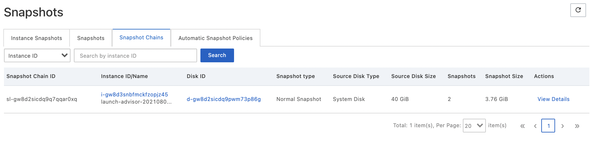{width="4.5in" height="1.073611111111111in"}

-   Click on \`View Details\`.

{width="4.5in"
height="2.1083333333333334in"}

## Monitoring 

Monitoring the status of the ECS instances ensures that they are
functioning normally.

This can be done by the ECS monitoring service or by Cloud Monitor.

ECS allows to monitor CPU usage, network traffic and disk I/O for a
specific instance.

Cloud Monitor allows to monitor instances with a wider range of metrics
and with finer granularity.

ECS thus allows to monitor:

-   CPU usage: this is the percentage of ECS computing units allocated
    and used on the instance,

This data is accessible from ECS, Cloud Monitor, ECS API or once
connected, with the \`top \`command under Linux and \`Task Manager
\`under Windows.

-   network traffic: this is the bandwidth usage for traffic entering
    and leaving the ECS instance in kbps.

Cloud Monitor allows to measure Internet and Intranet traffic.

### Monitor through the console 

To access the ECS monitoring service:

-   Go to the \`ECS \`console,

-   Click on \`Instances & Images \| Instances,\`

-   Select the region,

-   Click on the instance ID,

-   Click on the \`Monitoring \`tab,

-   Specify the time period for the query.

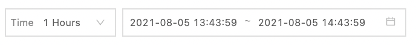{width="2.6032786526684166in"
height="0.28764654418197727in"}

The time period selected has an impact on the granularity of the data
displayed.

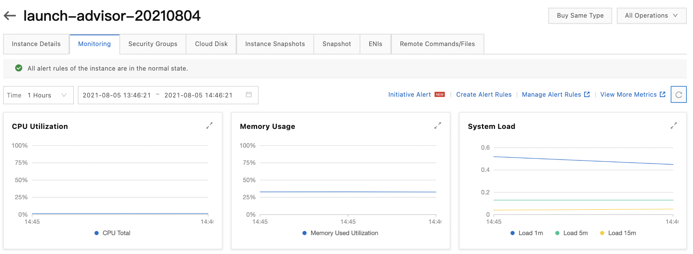{width="4.5in" height="1.6548611111111111in"}

To view monitoring data in Cloud Monitor:

-   Go to the \`Cloud Monitor \`console,

-   Click on \`Host Monitoring\`.

{width="4.5in"
height="1.1166666666666667in"}

To install the \`Cloud Monitor \`agent on the ECS instance (it must be
installed), click on \`Aliyun ECS install \`or \`Not Aliyun ecs install
\`if the instance is not an ECS instance.

{width="2.74336176727909in"
height="2.459288057742782in"}

To view the data, click on \`Monitoring Charts \`in the instance row.

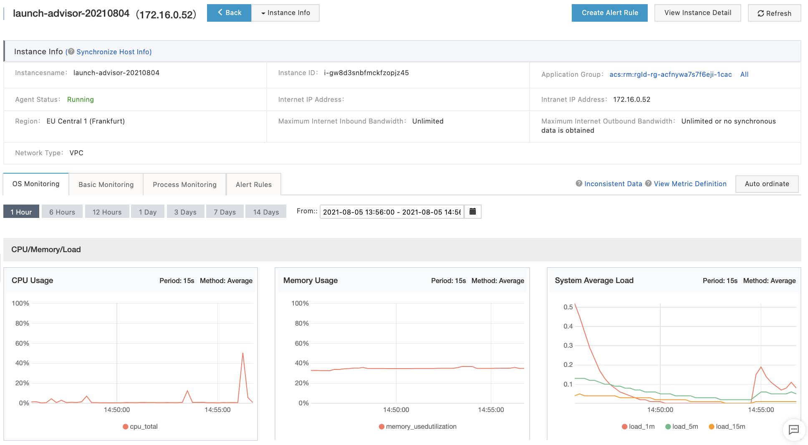{width="4.5in" height="2.477777777777778in"}

To add alarm rules, click on \`Alert Rules \`in the instance row.

{width="4.5in"
height="1.4513888888888888in"}

### Monitoring by the ECS API 

The ECS API provides access to metrics with the
\`DescribeInstanceMonitorData\`, \`DescribeDiskMonitorData \`and
\`DescribeEniMonitorData \`operations.

The following metrics are available:

  -----------------------------------------------------------------------
  Metric                        Description
  ----------------------------- -----------------------------------------
  \`Instance\`                  Instance ID

  \`CPU Usage\`                 Percentage of ECS calculation units
                                allocated and used

  \`Intranet inbound traffic\`  Incoming internal network traffic (in
                                kbits)

  \`Intranet outbound traffic\` Outgoing internal network traffic (in
                                kbits)

  \`Intranet bandwidth\`        Internal network traffic per time unit
                                (in kbits/s)

  \`Public network inbound      Incoming Internet traffic (in kbits)
  traffic\`                     

  \`Public network outbound     Outgoing Internet traffic (in kbits)
  traffic\`                     

  \`Public network bandwidth\`  Internet traffic per time unit (in
                                kbits/s)

  \`Disk read IOPS\`            Number of disk read operations (per
                                second)

  \`Disk write IOPS\`           Number of disk write operations (per
                                second)

  \`Disk read BPS\`             Number of bytes read from the disk per
                                second (in bytes/s)

  \`Disk write BPS\`            Number of bytes written to the disk per
                                second (in bytes/s)
  -----------------------------------------------------------------------

The difference between Kb and KB: 1 Kb is equal to 1000 bits and 1 KB is
equal to 1024 bytes. So, for example, 1 Mbps = 125 KB/s.

Network traffic is measured in kbps.

### System events 

System events are scheduled and recorded maintenance events of ECS
resources. They occur, for example, during security updates or
unexpected failures.

Alibaba Cloud performs routine maintenance on the physical servers. In
case of hardware or software failure or other such problems, ECS
instances are migrated to healthy servers. You do not receive any
notification for these operations. ECS instances are not affected by
this routine maintenance.

On the other hand, you are notified about system events on the ECS
instances. If it is a planned system event, you are notified in advance
with the impact of the event on the instance and the expected execution
point (expected execution date). It is recommended that you back up the
data and distribute the incoming traffic before the operation.

Here are some examples of system events:

-   Scheduled restart,

-   Unscheduled restart,

-   Stoped instance,

-   Released instance, \...

The event can have the following status:

-   \`scheduled \`(intermediate state): planned but not executed,

-   \`avoided\`: recommended actions performed in advance,

-   \`executing \`(intermediate state): in progress,

-   \`executed\`: executed,

-   \`canceled\`: the ECS instance cancelled the event,

-   \`failed\`: not corrected.

The processing of planned system events goes through two phases:

-   \`User operation period\`: after receiving the notification (e.g. 3
    days before the shutdown of an instance with subscription, 24 to 48
    hours before the correction of a system failure, etc \...), you can
    manage the event in advance by yourself or wait for the event to be
    triggered.

-   \`System action period\`: after this waiting period (less than 6
    hours), you receive a report on system events.

With unscheduled system events, you receive a notification but wait
period. You do not have the opportunity to perform an action.

To view the system event history:

-   Go to the \`ECS \`console,

-   Select \`Events\`,

-   Click on the tab of the type of event you want to monitor.

{width="4.5in"
height="1.0972222222222223in"}

### Capture the screen of an instance 

To help analyze and troubleshoot instance failures, it is possible to
get a screenshot of an ECS instance in \`Running \`state in real time.

To display the console output of an instance:

-   Go to the \`ECS \`console,

-   Click on \`Instances & Images \| Instances,\`

-   Select the region,

-   Click on \`More \| Operations and Troubleshooting \| Get Instance
    Screenshot \`on the line of the instance to generate the screenshot
    of the instance,

{width="2.8657972440944883in"
height="2.64290135608049in"}

-   Click on \`More \| Operations and Troubleshooting \| Get Instance
    Console Output \`on the line of the instance to display the console
    output.

{width="2.911036745406824in"
height="2.351291557305337in"}

## The Deployment Sets 

A Deployment Set allows to control the distribution of instances on
different physical servers. This allows to implement disaster tolerance
and business continuity.

A Deployment Set can contain a maximum of 7 instances in a zone.

To create a Deployment Set:

-   Go to the \`ECS \`console,

-   Select \`Deployment & Elasticity \| Deployment Sets,\`

-   Select the region,

-   Click on \`Create Deployment Set\`,

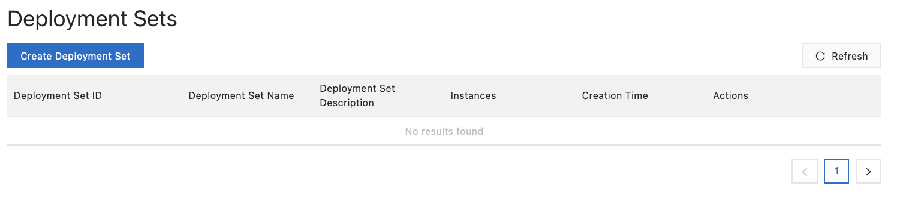{width="4.5in" height="0.9986111111111111in"}

-   \`Name\`: this is\` \`the name,

-   \`Description\`: this is the description,

-   \`Strategy\`: this is the strategy,

The only option currently available is \`High availability\`.

-   Click on \`OK\`.

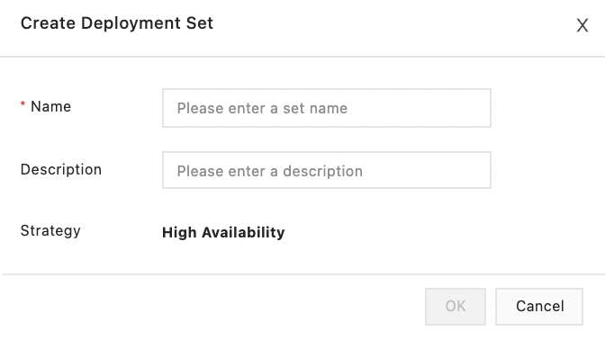{width="2.3765168416447944in"
height="1.336790244969379in"}

To create an instance in a Deployment Set:

-   Go to the \`ECS \`console,

-   Select \`Deployment & Elasticity \| Deployment Sets,\`

-   Select a region,

-   Click on \`Create Instance \`on the Deployment Set line,

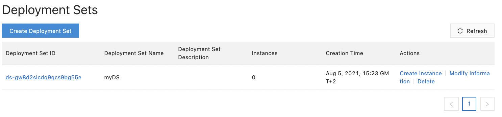{width="4.5in" height="1.0541666666666667in"}

-   Click on the \`Custom Launch \`onget.

You will find the classic instance creation screen. However, there are
two important new parameters:

-   \`Sequential Suffix \`(optional): this is the suffix added to the
    name of instants and host names (from 001 to 999),

{width="2.54621719160105in"
height="0.23772528433945755in"}

-   \`Deployment Set\`: this is the Deployment Set.

{width="4.5in"
height="0.6097222222222223in"}

Note that the number of instances must take into account the number of
instances already existing in this area.

To move an instance to another Deployment Set:

-   Go to the \`ECS \`console,

-   Select \`Instances & Images \| Instances,\`

-   Select the region,

-   Select \`More \| Instance Settings \| Change Deployment Set \`on the
    line of the instance,

-   \`Destination Deployment Set\`: this\` \`is the Deployment Set,

-   \`Force Change\`: indicates whether the system moves the instance to
    a new host and restarts the instance (\`Yes\`) or only attaches the
    Deploy Set to the new host,

-   Click on \`OK\`.

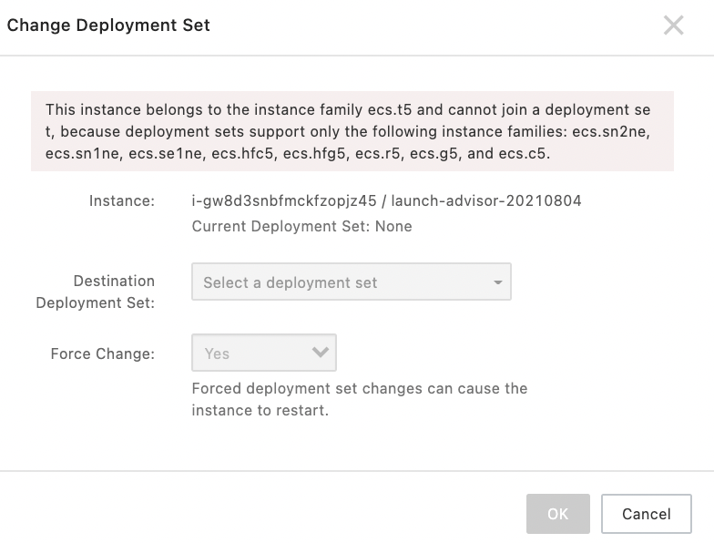{width="2.6564359142607175in"
height="2.0193832020997373in"}

The instance must be in \`Stopped \`or \`Running \`state.

To change the Deployment Set information:

-   Go to the \`ECS \`console,

-   Select \`Deployment & Elasticity \| Deployment Sets,\`

-   Select the region,

-   Click \`Modify Information \`on the Deployment Set line,

-   \`Name\`: this is the name of the Deployment Set,

-   \`Description\`: this is its description,

-   Click \`OK\`.

To delete a Deployment Set:

-   Go to the \`ECS \`console,

-   Select \`Deployment & Elasticity \| Deployment Sets,\`

-   Select the region,

-   Click \`Delete \`on the Deployment Set line,\`

-   \`Click on \`OK\`.

A Deployment Set cannot be deleted if it contains an instance.

# Auto Scaling 

Auto Scaling is a service that allows to automatically adjust the number
of ECS instances according to the needs and rules. These ECS instances
are grouped in Scaling Groups.

A Scaling Group is therefore a group of ECS instances that are
dynamically scaled according to scaling rules and the minimum or maximum
number of ECS instances. These instances can be configured either by a
Scaling Configuration, defined in the Auto Scaling console, or by a
Launch Template, defined in the ECS console.

Scaling rules can be executed in three ways: manually, by a scheduled
task or by an event-triggered task.

A scheduled task allows to execute a specified scaling rule at a
specified time. An event-triggered task allows to adjust the number of
instances in a Scaling Group when a particular event occurs.

The Scaling Group uses a Health Check to ensure that there are the
correct number of healthy ECS instances in the group.

Scaling activities are then triggered when a scaling rule is triggered
or when an ECS instance is added or deleted manually.

ECS instances can however be added or removed manually from a Scaling
Group. The rules applied are different from those used for instances
added or removed automatically. ECS instances can be put in a standby
state (\`StandBy\`) or in a state that prevents their automatic removal
from the Scaling Group (\`Protected\`).

The cooldown period ensures that Auto Scaling will not perform new
scaling activities following a scaling activity for a certain period of
time.

It is possible to perform scaling in parallel using the \`Expected
Number of Instances \`feature.

Lifecycle hooks are used to trigger actions based on events related to
the lifecycle of Scaling Groups. This typically allows to install
software or to configure the ECS instance.

Due to resource shortages, it can happen that the ECS instances are not
evenly distributed in the zones. It is then possible to rebalance the
distribution of the ECS instances.

A SLB instance can be associated with a Scaling Group to distribute
traffic to the ECS instances of the Scaling Group. RDS instances can
also be associated to automate the update of the white list when adding
or removing ECS instances.

Auto Scaling performs monitoring of scaling events and you can view the
logs. Event notifications can be sent to CloudMonitor or MNS (Message
Service) when monitoring scaling activities.

## The Scaling Group 

### The cooldown period 

The cooldown period is the period during which Auto Scaling cannot
execute new scaling activities following a scaling activity. Thus,
scaling activities triggered by event-driven tasks are rejected.
However, manual operations and scheduled tasks are applied. The cooldown
period starts after the last ECS instance is added or removed from the
group.

The cooldown period can be changed in the Scaling Group or from a
scaling rule. The value defined in the rule has priority.

### Expected number of instances 

The \`Expected Number of Instances \`feature of the Scaling Group allows
to perform scaling in parallel. This removes some limitations. This
feature can only be activated when creating the Scaling Group.

### Create a Scaling Group 

To create a Scaling Group:

-   Go to the \`Auto Scaling \`console,

-   Click on \`Scaling Groups\`,

-   Select a region,

-   Click on \`Create\`,

-   \`Scaling Group Name\`: this is the name of the group,

-   \`Instance Configuration Source\`: this is the configuration source
    of the group; supported values are:

```{=html}
<!-- -->
```
-   \`Launch Templates\`: uses a Launch Template to create the ECS
    instances; you have to select a Launch Template,

-   \`Select Existing Instance\`: uses the configurations of an existing
    ECS instance as a template to create ECS instances; you must then
    select an ECS instance (\`Add Existing Instance\`),

-   \`Create from Scratch\`: does not use any template; the created
    Scaling Group will be in a disabled state,

```{=html}
<!-- -->
```
-   \`Tag\`: these are the tags associated with Scaling Group,

These tags are associated to the Scaling Groups. Other tags can be
associated to instances.

-   \`Instance Removing Policy\`: this is the policy used to filter and
    remove ECS instances; the value of the \`Filter First \`and \`Then
    Remove from Results \`fields must be different:

```{=html}
<!-- -->
```
-   \`Earliest Instance Created Using Scaling Configuration (\`only for
    \`Filter First)\`: filters the instances created based on the
    earliest Scaling Configuration and Launch Template,

-   \`Earliest Created Instance\`: filters the instances created as soon
    as possible,

-   \`Most Recent Created Instance\`: filters the most recently created
    instances,

-   \- \`No Policy - (\`only for \`Then Remove from Results)\`: Auto
    Scaling does not filter instances based on \`Then Remove from
    Results\`,

If more than one ECS instance meets the conditions, one is randomly
removed.

-   \`Suspended Processes\`: suspends certain processes depending on the
    operation:

```{=html}
<!-- -->
```
-   \`Scale-out\`: rejects all scale-out requests,

-   \`Scale-in\`: rejects all scale-in requests,

-   \`Health Check\`: suspends the Health Check and does not remove
    unhealthy ECS instances,

-   \`Scheduled Task\`: at the end of the task execution time, does not
    trigger the scaling rules associated with the task,

-   \`Event-triggered Task\`: when an alert associated with a task is
    triggered by an event, does not trigger the scaling rules associated
    with the task,

```{=html}
<!-- -->
```
-   \`Enable Deletion Protection for Scaling Group\`: prevents the
    Scaling Group from being deleted in the console or with the API,

-   \`Health Check for Instances\`: regularly checks the status of ECS
    instances,

If an ECS instance is not in the \`Running \`state, it is removed from
the Scaling Group.

-   \`Minimum Number of Instances\`: automatically adds ECS instances to
    the Scaling Group if the number of instances is lower than the
    minimum number,

-   \`Maximum Number of Instances\`: automatically removes ECS instances
    from the Scaling Group if the number of instances exceeds the
    maximum number,

-   \`Expected Number of Instances\`: this is\` \`the expected number of
    instances,

-   \`Default Cooldown Time (Seconds)\`: this\` \`is the cooldown time,

-   \`Network Type\`: this is\` \`the type of network,

The instances must have the same network type as the Scaling Group.

-   \`Scaling Policy \`(if \`Network Type \`is \`VPC \`only): this is
    the scaling policy for multi-zone; supported values are:

```{=html}
<!-- -->
```
-   \`Priority Policy\`: creates instances with priority in the region
    where the vSwitch with the highest priority is located,

-   \`Balanced Distribution Policy\`: distributes ECS instances evenly
    across the zones where vSwitches reside,

\`Balanced Distribution Policy \`is for cases where the Scaling Group is
associated with multiple vSwitches spread across more than two zones. If
the ECS instances are not evenly distributed between zones, use the
\`Rebalance Distribution \`feature to evenly distribute them.

-   \`Cost Optimization Policy\`: creates ECS instances according to the
    unit prices of the vCPUs in ascending order,

Only applies in cases where several instance types are specified in the
Scaling Configuration.

-   \`Instance Reclaim Mode \`(for VPC network type only): this is the
    recovery mode:

```{=html}
<!-- -->
```
-   \`Release Mode\`: during a scale-in event, automatically releases
    the specified number of ECS instances; during a scale-out event,
    automatically creates the specified number of ECS instances,

-   \`Shutdown and Reclaim Mode: \`improves scaling efficiency,

During a scale-in, the status of the deleted ECS instances becomes \`No
Fees for Stopped Instances (VPC-Connected)\`. You are no longer charged
for vCPU, memory and public IP addresses but you are charged for disks
and EIPs. During a scale-out, the instances that were previously stopped
are used first.

-   \`VPC \`(if \`Network Type \`is \`VPC \`only): this is the VPC used,

-   \`Select VSwitch \`(if \`Network Type \`is \`VPC \`only): this is
    the vSwitch used,

To deploy ECS instances across multiple zones, you must specify multiple
vSwitches located in different zones.

-   \`Add Existing Instance\`: ECS instances can be added manually to a
    Scaling Group, except if \`Instance Configuration Source \`is set to
    \`Create from Scratch\`,

If \`Expected Number of Instances \`is specified and there are
instances, its value increases automatically.

Normally instances are not released when they are removed from the
Scaling Group. But if \`Enable the scaling group to manage the instance
lifecycle \`is selected, the instances are released when they are
manually removed from the Scaling Group or automatically when they are
unhealthy.

-   \`Associate CLB Instance:\` select a CLB instance and edit the
    server groups that allow to process the received requests,

-   \`Associate ALB Server Group:\` this is the group of servers that
    allow to distribute the requests to the backend servers,

-   \`Associate RDS Instance\`: associate ApsaraDB RDS instances to the
    Scaling Group,

The internal IP addresses of the ECS instances added to the Scaling
Group are automatically added to the white lists of the RDS instances.

-   Click on \`OK\`.

{width="4.3140365266841645in"
height="2.768173665791776in"}

{width="4.316070647419073in"
height="2.352703412073491in"}

{width="4.31420384951881in"
height="2.286055336832896in"}

{width="4.312268153980752in"
height="1.9720570866141733in"}

### View information about a Scaling Group 

To view information about a Scaling Group:

-   Go to the \`Auto Scaling \`console,

-   Click on \`Scaling Groups\`,

-   Select a region,

-   Click on \`Details \`on the line of the group.

### Modify a Scaling Group 

To modify a Scaling Group:

-   Go to the \`Auto Scaling \`console,

-   Click on \`Scaling Groups\`,

-   Select a region,

-   Click on \`Edit \`on the line of the group,

-   Change the parameters,

-   Click on \`OK\`.

If the minimum or maximum number of instances is changed and the number
of instances falls outside this range, Auto Scaling automatically adds
or removes ECS instances to adjust.

### Activate or deactivate a Scaling Group 

To enable or disable a Scaling Group:

-   Go to the \`Auto Scaling \`console,

-   Click on \`Scaling Groups\`,

-   Select a region,

-   Click on \`\... \| Enable \`or on \`\... \| Disable \`on the line of
    the group.

### Delete a Scaling Group 

In order to delete a Scaling Group, the Scaling Group deletion
protection must be disabled. Deleting a Scaling Group will delete its
configurations and scaling rules.

If any ECS instances are in the \`Running \`state, they are stopped. The
manually added instances are then deleted and the automatically added
instances are released.

To delete a Scaling Group:

-   Go to the \`Auto Scaling \`console,

-   Click on \`Scaling Groups\`,

-   Select a region,

-   Click on \`Delete \`on the line of the group,

-   Click on \`OK\`.

### Change the deletion protection status of a Scaling Group 

The Scaling Group Deletion Protection prevents the Scaling Group from
being deleted from the Auto Scaling console or with the API.

To change the deletion protection status of a Scaling Group:

-   Go to the \`Auto Scaling \`console,

-   Click on \`Scaling Groups\`,

-   Select a region,

-   Click on \`\... \| Set Deletion Protection \`on the line of the
    group,

-   To activate the protection, activate \`Deletion Protection\`,

-   To disable it, turn off \`Deletion Protection\`,

-   Click on \`OK\`.

### Suspend and resume a scaling process 

It is possible to suspend a number of processes (scaling-in,
scaling-out, Health Check, scheduled task and event-driven task). After
resumption, the process takes into account the changes that took place
during the suspension. This allows for better control of a Scaling
Group.

To suspend or resume a scaling process:

-   Go to the \`Auto Scaling \`console,

-   Click on \`Scaling Groups\`,

-   Select a region,

-   Click on \`Edit \`on the line of the group,

-   To suspend a process, select the process to suspend in the
    \`Suspended Processes \`section,

-   To resume a process, remove it,

-   Click on \`OK\`.

## The Scaling rules 

A scaling rule is used to trigger a scaling activity or to set the
minimum and maximum number of ECS instances in a scaling group.

### Create a scaling rule 

Alibaba Cloud offers several types of scaling rules:

-   simple scaling rule,

-   scaling rule for target tracking,

-   predictive scaling rule,

-   step-by-step scaling rule.

A simple scaling rule allows to increase or decrease the number of ECS
instances in a Scaling Group according to a specified number.

A target tracking scaling rule automatically calculates the number of
ECS instances needed to keep a Cloud Monitor metric close to the target
value. It then triggers the necessary ECS instance scaling activities.

A predictive scaling rule defines the minimum and maximum number of ECS
instances by using Machine Learning to analyze the monitoring data
history of the Scaling Group to predict the values of the specified
metrics.

A step scaling rule allows to define for each step a scaling rule
triggered by event. Each rule defines a scaling policy.

We will only see here how to create a simple scaling rule:

-   Go to the \`Auto Scaling \`console,

-   Click on the group ID,

-   Click on the \`Scaling Rules and Activities \`tab,

-   Click on \`Create Scaling Rule\`,

-   \`Rule Name\`: this is\` \`the name of the rule,

-   \`Rule Type\`: this is the type of rule; select \`Simple Scaling
    Rule\`,

-   \`Start Time\`: these are the conditions for the execution of the
    task,

-   \`Operation\`: this is\` \`the operation to be performed:

```{=html}
<!-- -->
```
-   goes to *n* instances,

-   adds *n* instances,

-   adds *n%* of the instances,

-   deletes *n* instances,

-   deletes *n%* of the instances,

```{=html}
<!-- -->
```
-   \`Instance Warmup Time (optional)\`: this is the cooling period (in
    seconds),

-   Click on \`OK\`.

{width="4.5in"
height="2.540277777777778in"}

### Modify a scaling rule 

To modify a scaling rule:

-   Go to the \`Auto Scaling \`console,

-   Click on \`Scaling Groups\`,

-   Select a region,

-   Click on \`Details \`on the line of the group,

-   Click on the \`Scaling Rules and Activities \`tab,

-   Click on \`Edit \`on the line of the rule,

-   Click on \`OK\`.

### Delete a scaling rule 

To delete a scaling rule:

-   Go to the \`Auto Scaling \`console,

-   Click on \`Scaling Groups\`,

-   Select a region,

-   Click on \`Details \`on the line of the group,

-   Click on the \`Scaling Rules and Activities \`tab,

-   Click on \`Delete \`on the rule line,

-   Click on \`OK\`.

### Run a scaling rule 

If no scaling activity is in progress, it is possible to scale the ECS
instances temporarily.

To perform a scaling manually:

-   Go to the \`Auto Scaling \`console,

-   Click on \`Scaling Groups\`,

-   Select a region,

-   Click on \`Details \`on the line of the group,

-   Click on the \`Scaling Rules and Activities \`tab,

-   Click on the link in the \`Start Time \`column on the rule line.

It is also possible to run a scaling rule automatically at a specified
time or when an event occurs.

## The hooks

The hooks on the life cycle of the Scaling Groups allow to trigger an
action when an event related to the life cycle occurs. For example, they
allow ECS instances to be put in \`Pending \`state when a scaling
activity is triggered in order to perform operations. This typically
allows installing software or configuring the ECS instance.

When a hook is triggered, it is possible to send a notification to MNS.

### Create a life cycle hook on a Scaling Group 

To create a life cycle hook on a Scaling Group:

-   Go to the \`Auto Scaling \`console,

-   Click on \`Scaling Groups\`,

-   Select a region,

-   Click on \`Details \`on the line of the group,

-   Click on the \`Lifecycle Hook \`tab,

-   Click on \`Create Lifecycle Hook\`,

-   \`Name\`: this is\` \`the name of the hook,

-   \`Applicable Scaling Activity Type\`: this\` \`is the type of
    scaling activity that triggers the hook; supported values are:

```{=html}
<!-- -->
```
-   \`Scale-in Event\`,

-   \`Scale-out Event\`,

```{=html}
<!-- -->
```
-   \`Timeout Period\`: this is the timeout period (from 30 to 21600
    seconds),

The ECS instance remains in \`Pending \`state during this time.

-   \`Execution Policy\`: this is the action performed once the timeout
    has completed the hook; supported values are:

```{=html}
<!-- -->
```
-   \`Continue\`: executes the event,

-   \`Reject\`: releases the created ECS instance (in case of a
    scale-out event) or removes the ECS instance (in case of a scale-in
    event),

```{=html}
<!-- -->
```
-   \`Notification Method\`: sends a notification when the hook is
    triggered; supported values are:

```{=html}
<!-- -->
```
-   \`No Notification (default)\`: no notification,

-   \`MNS Topic:\` sends a notification to an MNS topic,

-   \`MNS Queue\`: sends a notification to the MNS queue,

-   \`OOS Template\`: sends a notification to the OOS (Operation
    Orchestration Service),

```{=html}
<!-- -->
```
-   Click on \`OK\`.

{width="4.5in"
height="2.7979166666666666in"}

### Modify a hook 

To modify a hook:

-   Go to the \`Auto Scaling \`console,

-   Click on \`Scaling Groups\`,

-   Select a region,

-   Click on \`Details \`on the line of the group,

-   Click on the \`Lifecycle Hook \`tab,

-   Click on \`Modify \`on the hook line,

-   Change the parameters,

-   Click on \`OK\`.

The name of the hook cannot be changed.

### Delete a hook 

To delete a hook:

-   Go to the \`Auto Scaling \`console,

-   Click on \`Scaling Groups\`,

-   Select a region,

-   Click on \`Details \`on the line of the group,

-   Click on the \`Lifecycle Hook \`tab,

-   Click on \`Delete \`on the line of the hook,

-   Click on \`OK\`.

## The configuration of the instances 

The possible configuration sources for the ECS instances of the Scaling
Groups are the Scaling Configurations and the Launch templates.

The Launch Template is a feature of ECS and must be created from the ECS
console.

### Create a Scaling Configuration 

With the Scaling Configuration, you define the configuration of the ECS
instance as when it was created except that it is not created. It will
be used as a template when Auto Scaling creates an ECS instance.

To create a Scaling Configuration:

-   Go to the \`Auto Scaling \`console,

-   Select a region,

-   Click on \`Details \`on the line of the group,

-   Click on the \`Instance Configuration Source \`tab,

-   Click on the \`Scaling Configurations \`tab,

-   Click on \`Create Scaling Configuration\`,

-   \`Billing Method\`: this is the billing method; the supported values
    are:

```{=html}
<!-- -->
```
-   \`Pay-As-You-Go\`,

-   \`Preemptible Instance\`,

The price of the \`Preemptible \`Instance fluctuates according to the
evolution of supply and demand. The advantage is their price but the
disadvantage is that they can be claimed.

-   \`Instance Type\`: this\` \`is the type of instance,

Several instance types can be selected. Thus, if one instance type is
not available, another is used.

Moreover, it is possible to define weights for each type of instance
according to its performance.

-   \`Image\`: this is the image used to create the instance,

-   \`Storage\`: this is the storage; it can be a system disk or data
    disks,

-   \`Public IP Address\`: this is\` \`the assigned IPv4 address,

-   \`Security Group\`: this\` \`is the security group.

-   Click on \`Next: System Configurations\`,

-   \`Tags\`: these are the tags,

-   \`Logon Credentials\`: these are the login credentials,

For Linux, you can either specify a SSH key pair or specify this
information after creation. For Windows, this information can only be
specified after creation.

-   \`Instance Name\`: this is\` \`the name of the instance,

-   \`Host\`: this is the host name,

-   Click on \`Show \`next to \`Advanced (based on instance RAM roles or
    cloud-init)\`,

-   \`RAM Role\`: these are the RAM roles attached to the instances,

Temporary Security Token Service (STS) tokens can be used for API calls.
The use of STS tokens increases the security of the \`AccessKey \`pair
and provides a finer granularity of authorization management.

-   \`User Data\`: this is\` \`the code that allows to customize the ECS
    instance at boot time,

-   Click on \`Next: Preview\`,

-   \`Scaling Configuration Name\`: this is the name of the Scaling
    Configuration,

-   Click on \`Create\`,

-   Click on \`Enable Configuration\`.

### Modify a Scaling Configuration 

After modifying a Scaling Configuration, the ECS instances already
created are not modified.

To modify a Scaling Configuration:

-   Go to the \`Auto Scaling \`console,

-   Click on \`Scaling Groups\`,

-   Select a region,

-   Click on \`Details \`on the line of the group,

-   Click on the \`Instance Configuration Source \`tab,

-   Click on the \`Scaling Configurations \`tab,

-   Click on \`Edit \`on the configuration line,

-   Configure the \`Billing Method\`, \`Instance Type\`, \`Image\`,
    \`Storage\`, \`Public IP Address \`and \`Security Group \`settings,

-   Click on \`Next: System Configurations\`,

-   Configure the \`Tags\`, \`Logon Credentials\`, \`Instance Name \`and
    \`RAM Role \`parameters,

-   Click on \`Next: Preview\`,

-   Enter the name of the Scaling Configuration,

-   Click on \`Modify\`.

### Delete a Scaling Configuration 

To delete a Scaling Configuration:

-   Go to the \`Auto Scaling \`console,

-   Select a region,

-   Click on \`Details \`on the line of the group,

-   Click on the \`Instance Configuration Source \`tab,

-   Click on the \`Scaling Configurations \`tab,

-   Click on \`Delete \`on the configuration line,

-   Click on \`OK\`.

### Apply a Scaling Configuration 

Only one Scaling Configuration can be in active state in a Scaling
Group. If you apply a Scaling Configuration, the previous one goes to
the inactive state.

To apply a Scaling Configuration:

-   Go to the \`Auto Scaling \`console,

-   Select a region,

-   Click on \`Details \`on the line of the group,

-   Click on the \`Instance Configuration Source \`tab,

-   Click on the \`Scaling Configurations \`tab,

-   Click on \`Apply \`on the configuration line,

-   Click on \`OK\`.

## The tasks 

There are several types of tasks:

-   scheduled tasks,

-   tasks triggered by an event.

Here we will study how to manage each of these types of tasks.

### Scheduled tasks 

A scheduled task allows to execute a specified scaling rule at a
specified time. They are very useful to create instances before peaks of
activity and release them afterwards.

To create a scheduled task:

-   Go to the \`Auto Scaling \`console,

-   Click on \`Scaling Tasks \| Scheduled Tasks\`,

-   Select a region,

-   Click on \`Create Scheduled Task\`,

-   \`Task Name\`: this is the name of the task,

-   \`Description\`: this is the description,

-   \`Executed At:\` this is the time of execution of the scheduled
    task,

-   \`Scaling Group\`: this is the associated Scaling Group,

-   \`Scaling Method\`: this is the scaling method used:

```{=html}
<!-- -->
```
-   \`Select Existing Scaling Rule:\` this is the scaling rule that will
    be executed,

-   \`Configure Number of Instances in Scaling Group\`: this is the
    minimum, maximum and expected number of instances in the Scaling
    Group,

```{=html}
<!-- -->
```
-   \`Retry Interval (Seconds)\`: this is the time at which retries
    expire (from 0 to 21600 seconds),

If a scaling activity fails, it is executed again within this time
frame.

-   \`Recurrence\`: this is the recurrence period: the task can be
    performed repeatedly every day, every week or every month,

-   Click on \`OK\`.

{width="3.731395450568679in"
height="2.8284897200349954in"}

The periods are expressed in cron format with the time zone UTC+0. For
China, you have to add 8 hours. Sunday corresponds to the day of the
week 7.

To edit a scheduled task:

-   Go to the \`Auto Scaling \`console,

-   Click on \`Scaling Tasks \| Scheduled Tasks\`,

-   Select a region,

-   Click on \`Edit \`on the line of the task,

-   Change the parameters,

-   Click on \`OK\`.

To delete a scheduled task:

-   Go to the \`Auto Scaling \`console,

-   Click on \`Scaling Tasks \| Scheduled Tasks\`,

-   Select a region,

-   Click on \`Delete \`on the line of the task,

-   Click on \`OK\`.

To activate or deactivate a task:

-   Go to the \`Auto Scaling \`console,

-   Click on \`Scaling Tasks \| Scheduled Tasks\`,

-   Select a region,

-   Click \`Enable \`or \`Disable \`on the line of the task,

-   Click on \`OK\`.

### Tasks triggered by an event 

Event-triggered tasks allow to adjust the number of instances in a
Scaling Group when a particular event occurs. They are very useful when
traffic is not predictable.

The event is triggered by CloudMonitor when a specified alarm is
triggered. It can be an event triggered by the system monitoring or a
custom event.

For system monitoring events, Auto Scaling installs the CloudMonitor
agent on the Scaling Group instances. However, it is necessary to
activate \`New purchase ECS automatically installs cloud monitoring \`in
the CloudMonitor console.

Custom monitoring events are based on custom metrics. They must
therefore be defined in CloudMonitor. These metrics can be sent via API
or SDK. It is recommended to create a group of applications in
CloudMonitor and to send these metrics to this group.

To create a monitoring task:

-   Go to the \`Auto Scaling \`console,

-   Click on \`Scaling Tasks \| Event-triggered Tasks\`,

-   Select a region,

-   Click on \`Create Event-triggered Task\`,

-   \`Name\`: this is the name of the task,

-   \`Description\`: this is the description,

-   \`Resource Monitored\`: this is the Scaling Group to watch,

-   \`Monitoring Type\`: this\` \`is the type of monitoring:

```{=html}
<!-- -->
```
-   \`System Monitoring\`: this is monitoring based on the predefined
    metrics of CloudMonitoring,

-   \`Custom Monitoring\`: this is the custom monitoring; you must
    select the application group, the metric and the dimension, defined
    in CloudMonitor,

```{=html}
<!-- -->
```
-   \`Reference Period\`: this\` \`is the reference period (1, 5 or 15
    minutes),

The shorter the period, the more frequently alerts are triggered.

-   \`Condition\`: this is the trigger condition: select a function
    (\`Average\`, \`Max \`or \`Min\`), an operator and a threshold
    (example: the average CPU usage of the ECS instances in the Scaling
    Group exceeds 80%),

-   \`Triggered After\`: this is the number of times the condition is
    met before the alert is triggered (1, 2, 3 or 5 times),

-   \`Effective Period\`: this is\` \`the effective period of the task,

-   \`Trigger Rule\`: this is the triggered rule,

-   Click on \`OK\`.

{width="3.962623578302712in"
height="2.829484908136483in"}

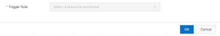{width="4.5in" height="0.7534722222222222in"}

To display a monitoring task:

-   Go to the \`Auto Scaling \`console,

-   Click on \`Scaling Tasks \| Event-triggered Tasks\`,

-   Select a region,

-   For a system monitoring task, click on the \`System Monitoring
    \`tab,

-   For a custom monitoring task, click on the \`Custom Monitoring
    \`tab,

-   Click on the task ID.

To edit or delete a monitoring system task:

-   Go to the \`Auto Scaling \`console,

-   Click on \`Scaling Tasks \| Event-triggered Tasks\`,

-   Select a region,

-   Click on the \`System Monitoring \`tab,

For a custom monitoring task, click on the \`Custom Monitoring \`tab.

-   Click on \`Edit Event-triggered Task \`on the task line,

-   Change the parameters.

-   Click on \`OK\`.

Only the monitored resource and the type of monitoring cannot be
changed.

When creating a task, you can specify only one triggered rule and it
must belong to the same Scaling Group. However, you can later add
several others and from any Scaling Group in the same region.

To activate or deactivate a task:

-   Go to the \`Auto Scaling \`console,

-   Click on \`Scaling Tasks \| Event-Triggered Tasks\`,

-   Select a region,

-   For a system monitoring task, click on the \`System Monitoring
    \`tab,

-   For a custom monitoring task, click on the \`Custom Monitoring
    \`tab,

-   Click \`Enable \`or \`Disable \`on the task line,

-   Click on \`OK\`.

To change the triggered rules:

-   Go to the \`Auto Scaling \`console,

-   Click on \`Scaling Tasks \| Event-Triggered tasks\`,

-   Select a region,

-   For a system monitoring task, click on the \`System Monitoring
    \`tab,

-   For a custom monitoring task, click on the \`Custom Monitoring
    \`tab,

-   Click on \`Edit Trigger Rule \`on the task line,

-   To add a rule, click on \`Add Rules\`,

-   To delete a rule, click \`Delete \`on the rule line,

-   Add or delete rules,

-   Click on \`OK\`.

## The management of the instances 

There are a number of ways to manage instances:

-   Scaling Groups,

-   the Health Check,

-   manual addition, removal and deletion of an instance in a Scaling
    Group,

-   \`StandBy\`, \`Protected \`and \`Stopped \`states,

-   rebalancing the distribution of ECS instances,

-   the association of an SLB instance with a Scaling Group.

### The life cycle of ECS instances in a Scaling Group 

Auto Scaling constantly checks if the ECS instances are healthy. It
removes or releases unhealthy ones.

For automatically created ECS instances:

-   During a scale-out, Auto Scaling automatically creates ECS
    instances.

-   During a scale-in, it stops them and releases them.

For ECS instances created manually and then added to a Scaling Group:

-   If the Scaling Group is configured to manage the lifecycle of ECS
    instances, the instances are stopped and released during a scaling
    event.

-   Otherwise, they are removed from the Scaling Group but not released.

When an ECS instance is removed from a Scaling Group, its internal IP
address is not automatically removed from the whitelist of the RDS
instance attached to the Scaling Group.

In addition, during scaling operations, some operations may be
interrupted.

A subscription instance can be added manually to a Scaling Group. But
the latter cannot manage its life cycle.

When adding or removing an instance from a Scaling Group, the instances
can go through the following service states:

-   \`Pending\`: the ECS instance is being added to a Scaling Group,

-   \`Adding:Wait\`: the ECS instance is in a waiting state while a
    lifecycle hook is running,

-   \`InService\`: the ECS instance is working normally,

-   \`Standby\`: the ECS instance is out of service; its life cycle must
    be managed manually,

-   \`Protected\`: the ECS instance works normally but Auto Scaling does
    not manage its life cycle; it must be managed manually,

-   \`Stopped\`: the ECS instance is stopped,

Once stopped, the ECS instance is no longer charged but you are charged
for disks and EIPs. To stop an ECS instance in a Scaling Group,
\`Instance reclaim mode \`must be set to \`Shutdown and Reclaim Mode\`.

-   \`Removing\`: the ECS instance is being removed from the Scaling
    Group,

-   \`Removing:Wait\`: the instance is waiting for the scale-in event of
    the hook to finish.

### The Health Check instance 

When the Health Check is activated, Auto Scaling manages the life cycle
of the ECS instances in the Scaling Group. If it detects an instance in
a state other than \`Running\`, it is considered unhealthy.

-   If the Scaling Group manages the lifecycle of ECS instances, Auto
    Scaling deletes and releases instances created automatically by Auto
    Scaling or added manually.

-   If the Scaling Group does not manage the life cycle of ECS
    instances, Auto Scaling removes the instances manually added to the
    Scaling Group without releasing them.

### Display ECS instances 

To display ECS instances:

-   Go to the \`Auto Scaling \`console,

-   Click on \`Scaling Groups\`,

-   Select a region,

-   Click on \`Details \`on the line of the group,

-   Click on the \`Instances \`tab.

The \`Auto Created \`tab displays the ECS instances that are
automatically created by Auto Scaling and the \`Manually Added \`tab
displays the instances that are manually added to the Scaling Group.

### Manually add an ECS instance to a Scaling Group 

In order to manually add an ECS instance to a Scaling Group, the
instance must be in \`Running \`state, be in the same region as the
Scaling Group and have the same network type as the Scaling Group.
Moreover, the Scaling Group must be in \`Enabled \`state and not have
any scaling activity in progress.

To manually add an ECS instance to a Scaling Group:

-   Go to the \`Auto Scaling \`console,

-   Click on \`Scaling Groups\`,

-   Select a region,

-   Click on \`Details \`on the line of the group,

-   Click on the \`Instances \`tab,

{width="4.5in"
height="1.7534722222222223in"}

-   Click on the \`Manually Added \`tab,

-   Click on \`Add Existing Instance\`,

-   Select the ECS instances by clicking on \`Add\`.

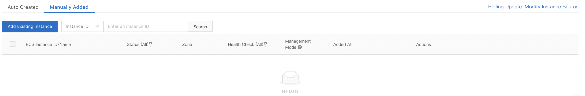{width="4.5in" height="0.7458333333333333in"}

If \`Enable the scaling group to manage the instance lifecycle \`has
been activated, ECS instances that have been manually added to the
Scaling Group will be removed and released during a scale-in event.

### Manually remove and delete an ECS instance 

To be able to manually remove and delete an instance, the Scaling Group
must be in \`Enabled \`state and no scaling activity must be in
progress.

It is possible to manually delete an ECS instance in a Scaling Group
without having to wait for the cooldown period. However, it is not
possible to delete an instance manually if the number of ECS instances
falls below the minimum number after deletion.

To manually remove and delete an ECS instance:

-   Go to the \`Auto Scaling \`console,

-   Click on \`Scaling Groups\`,

-   Select a region,

-   Click on \`Details \`on the lie of the group,

-   Click on the \`Instances \`tab,

-   To select an automatically created ECS instance, click on the \`Auto
    Created \`tab,

-   To select a manually added ECS instance, click on the \`Manually
    Added \`tab,

-   Click on \`Remove from Scaling Group \`on the line of the instance,

-   Click on \`Delete Instance \`on the line of the instance,

-   Configure the automatic dissociation of the ECS instance from the
    SLB and RDS instances,

-   Click on \`OK\`.

### Place or remove an ECS instance from the Standby state 

An ECS instance that is not needed can be put in a \`Standby\` state. It
is then no longer used by the Auto Scaling: its Health Check will be
ignored. If the Scaling Group is deleted, this ECS instance is
automatically removed from the \`Standby \`state and released.

To place an ECS instance in the \`Standby \`state:

-   Go to the \`Auto Scaling \`console,

-   Click on \`Scaling Groups\`,

-   Select a region,

-   Click \`Manage \`on the line of the group,

-   Click on \`ECS Instances\`,

-   To select an automatically created ECS instance, click on the \`Auto
    Created \`tab,

-   To select a manually added ECS instance, click on the \`Manually
    Added \`tab,

-   To put the instance in \`Standby \`state, click on \`Switch to
    Standby \`on the ilne of the instance,

-   To remove the instance from the \`Standby \`state, click on \`Remove
    from Standby \`on the line of the instance,

-   Click on \`OK\`.

### Place or remove an instance from the Protected state 

An ECS instance in \`Protected \`state prevents it from being
automatically removed from a Scaling Group. However, it is no longer
used by the Auto Scaling: its Health Check is ignored.

To release the ECS instance, you must remove it from the \`Protected
\`state and then remove it from the Scaling Group.

To place or remove an instance from the \`Protected \`state:

-   Go to the \`Auto Scaling \`console,

-   Click on \`Scaling Groups\`,

-   Select a region,

-   Click \`Manage \`on the line of the group,

-   Click on \`ECS Instances\`,

-   To select an automatically created ECS instance, click on the \`Auto
    Created \`tab,

-   To select a manually added ECS instance, click on the \`Manually
    Added \`tab,

-   To put the instance in \`Protected \`state, click on \`Switch to
    Protected \`on the line of the instance,

-   To remove the instance from the \`Protected \`state, click on
    \`Remove from Protected \`on the line of the instance,

-   Click on \`OK\`.

### Putting an ECS instance in the Stopped state 

If the \`Instance Reclaim Mode \`of the instances of a Scaling Group is
set to \`Shutdown and Reclaim Mode\`, the ECS instance can be manually
placed in the \`Stopped \`state. Auto Scaling will preferably start
those instances that are in the \`Stopped \`state.

However, there are two conditions to this:

-   The ECS instance must have been created automatically.

-   The network type of the Scaling Group must be VPC.

The ECS instance is no longer charged: activating \`No Fees for Stopped
Instances (VPC-Connected) \`is therefore not necessary. However, disks
and EIPs are still charged.

To place an ECS instance in the \`Stopped \`state:

-   Go to the \`Auto Scaling \`console,

-   Click on \`Scaling Groups\`,

-   Select a region,

-   Click on \`Details \`on the line of the group,

-   Click on the \`Instances \`tab,

-   Click on the \`Auto Created \`tab,

-   Click on \`Switch to Stopped \`on the ECS instance line,

-   Click on \`OK\`.

### Rebalance the distribution of ECS instances 

Due to resource shortages, it may happen that ECS instances are not
evenly distributed in the zones. In this case you can rebalance their
distribution:

-   Go to the \`Auto Scaling \`console,

-   Select a region,

-   Click on \`Details \`on the Scaling Group line,

-   Click on the \`Instances \`tab,

-   Click on the \`Auto Created \`tab,

-   Click on \`Rebalance Distribution\`,

-   Click on \`Confirm Execution\`.

The\` \`message \`The rebalancing task has been assigned \`is then
displayed at the top right of the page.

Prerequisites are:

-   The Scaling Group must be associated with several vSwitches spread
    over at least two zones.

-   The Scaling Group\'s multi-zone scaling policy must be \`Balanced
    Distribution Policy\`.

-   The network type of the Scaling Group must be VPC.

### Associate an SLB instance with a Scaling Group 

A SLB instance can be associated with a Scaling Group to distribute
traffic to the ECS instances in the Scaling Group. If the network type
is VPC, the SLB instance and the Scaling Group must be in the same VPC;
if the network type is classic, they must be in the same region.

It is also necessary that at least one listener is configured on the SLB
instance and that the Health Check is activated on the SLB instance.

To associate an SLB instance with a Scaling Group:

-   Go to the \`Auto Scaling \`console,

-   Click on \`Scaling Groups\`,

-   Select a region,

-   Click on \`Edit \`on the line of the group,

-   \`Network Type\`: this is\` \`the type of network,

The network cannot be modified once the Scaling Group is created.

-   \`Associate CLB Instance\`: these are the SLB instances to associate
    with the Scaling Group as well as the backend server groups for the
    SLB instance,

-   Configure the other parameters.

{width="4.5in"
height="3.0493055555555557in"}

## Monitoring 

In order to monitor Scaling Group operations, you can set up
notifications.

### Scaling events 

When a scaling rule is executed or when an instance is manually added or
removed from a Scaling Group, a scaling activity is triggered.

When ECS instances are automatically added or deleted, the process is as
follows:

-   Health Check,

-   Execution of the scaling activity,

-   Creation of ECS instances.

-   Assigning IP addresses to ECS instances,

-   Adding ECS instances to the RDS instance whitelist,

-   Starting the ECS instances,

-   Addition of the ECS instances to the backend server group of the SLB
    instance.

When ECS instances are automatically removed from the Scaling Group
after a scaling rule is executed, the process is as follows:

-   Health Check,

-   Execution of the scaling activity,

-   Removal of the ECS instances from the SLB instance backend server
    group,

-   Stopping the ECS instances,

-   Removal of ECS instances from the RDS instance white list,

-   Releasing of ECS instances,

-   Changing the number of instances in the Scaling Group.

When instances are manually added to a Scaling Group, the process is as
follows:

-   Health Check,

-   Checking the status of the ECS instances,

-   Execution of the scaling activity,

-   Addition of ECS instances to the Scaling Group,

-   Changing the number of instances in the Scaling Group,

-   Adding ECS instances to the RDS instance whitelist,

-   Addition of the ECS instances to the backend server group of the SLB
    instance.

When instances are manually removed from a Scaling Group, the process is
as follows:

-   Health Check,

-   Execution of the scaling activity,

-   Stoping the transfer of traffic by the SLB instance to the ECS
    instances,

-   Waiting 60 seconds,

-   Removal of ECS instances from the SLB instance backend server group,

-   Removal of ECS instances from the RDS instance white list,

-   Modification of the number of instances of the Scaling Group,

-   Withdrawal of the ECS instances from the Scaling Group.

When a scaling activity fails to add ECS instances to a Scaling Group,
Auto Scaling does a rollback of these ECS instances but keeps the
scaling activity. However, these ECS instances are still billed until
they are released, either automatically or manually.

When a scaling activity fails to add all the expected instances, the
Scaling Group does not reach its expected capacity. In this case, you
can manually add existing ECS instances to the Scaling Group, manually
trigger a scaling rule, or use scheduled or event-driven tasks to add
instances.

To view the details of a scaling activity:

-   Go to the \`Auto Scaling \`console,

-   Click on \`Scaling Groups\`,

-   Select a region,

-   Click on \`Details \`on the line of the group,

-   Click on the \`Scaling Rules and Activities \`tab,

-   Click on the \`Scaling Activities \`tab,

-   Click on the ID of the scaling activity.

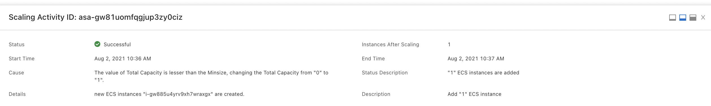{width="4.5in" height="0.6722222222222223in"}

The status of a scaling activity can be \`Rejected\`, \`Executing\`,
\`Successful\`, \`Warning \`or \`Failed\`.

### Notifications 

Event notifications can be sent to CloudMonitor or MNS (Message Service)
when monitoring scaling activities.

CloudMonitor allows to display statistics on events. MNS allows
notification messages to be transferred between distributed components.
The queue model of MNS allows messages to be sent and received in a
point-to-point mode. Each message can only be consumed by one consumer.
The MNS topic model allows messages to be published and subscribed to
and notifications to one or more recipients.

### Create an event notification 

To create an event notification:

-   Go to the \`Auto Scaling \`console,

-   Click on \`Scaling Groups\`,

-   Select a region,

-   Click on \`Details \`on the line of the group,

-   Click on the \`Notifications \`tab,

-   Click on \`Create Event Notification\`,

{width="2.846398731408574in"
height="1.3955260279965005in"}

-   \`Notification Method\`: this is the notification method; the
    supported values are:

```{=html}
<!-- -->
```
-   \`CloudMonitor\`,

-   \`MNS Topic\`,

-   \`MNS Tail\`,

```{=html}
<!-- -->
```
-   \`Event Notification Type\`: this is the type of event notification;
    supported values are:

```{=html}
<!-- -->
```
-   \`Successful Scale-out Event\`: add all ECS instances,

-   \`Successful Scale-in Event\`: removal of all ECS instances,

-   \`Failed Scale-out Event\`: scale-out triggered without adding the
    ECS instances,

-   \`Failed Scale-in Event\`: scale-in triggered without removing the
    ECS instances,

-   \`Rejected Scaling Activity:\` scaling activity request received
    rejected,

-   \`Start of Scale-out Event\`: scale-out triggered and ECS instances
    added,

-   \`Start of Scale-in Event\`: triggered scale-in and removal of ECS
    instances,

-   \`Expiration of Scheduled Task\`: notifications sent daily for 7
    days,

-   \`Partly Successful Scale-out Event\`: scale-out triggered with the
    addition of some ECS instances only,

-   \`Partly Successful Scale-in Event\`: triggered scale-in and removal
    of some ECS instances only,

```{=html}
<!-- -->
```
-   Click on \`OK\`.

### Display an event notification 

To view an event notification:

-   Go to the \`Auto Scaling \`console,

-   Click on \`Scaling Groups\`,

-   Select a region,

-   Click on \`Details \`on the line of the group,

-   Click on \`Notifications\`,

-   Click on the link in the \`Notification Method \`column of the
    event.

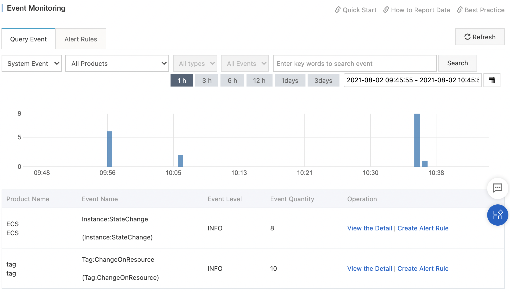{width="4.5in" height="2.578472222222222in"}

To view an event notification from CloudMonitor:

-   Go to the \`CloudMonitor \`console,

-   Go to the \`Event Monitoring \`page,

-   Select \`System Event\`,

-   Select \`Auto Scaling\`.

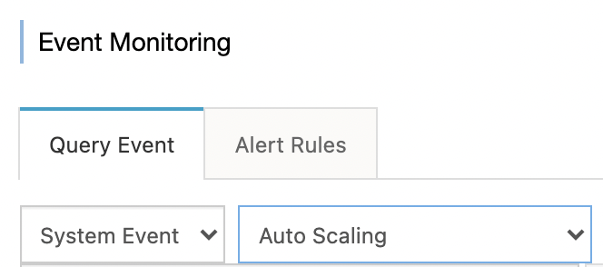{width="1.234332895888014in"
height="0.5464971566054243in"}

The system messages related to Auto Scaling are then displayed.

You can also select the \`MNS Topic \`notification method as below:

{width="3.1982010061242345in"
height="1.4762062554680664in"}

In this case, you can view the notifications in the MNS topics screen:

-   Go to the \`MNS \`console,

-   Go to the \`Topics \`page.

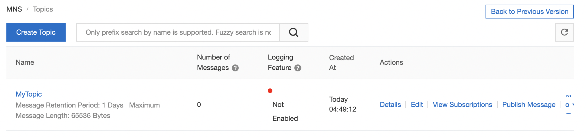{width="4.5in" height="1.0569444444444445in"}

The Number of \`messages \`column of the topics shows the number of
events. To see the details of the messages, you have to subscribe with a
client.

You can also select the type of notification for MNS queues:

{width="3.2407666229221346in"
height="1.4338396762904637in"}

In this case, you can view the notifications in the MNS Queues screen:

-   Go to the \`MNS \`console,

-   Go to the \`Tails \`page.

{width="4.5in"
height="1.0305555555555554in"}

The number in the \`Available Messages \`column shows the number of
events. To see the details of the messages, click \`More \| Send
Messages \| Receive Message \`on the row. The list of messages is then
displayed in the \`Receive Message \`section.

### Editing an event notification 

To edit an event notification:

-   Go to the \`Auto Scaling \`console,

-   Click on \`Scaling Groups\`,

-   Select a region,

-   Click on \`Details \`on the line of the group,

-   Click on the \`Notifications \`tab,

-   Click on \`Edit \`on the event line,

-   Change the parameters,

-   Click on \`OK\`.

It is not possible to change the notification method of an event
notification.

### Delete an event notification 

To delete an event notification:

-   Go to the \`Auto Scaling \`console,

-   Click on \`Scaling Groups\`,

-   Select a region,

-   Click on \`Details \`on the line of the group,

-   Click on the \`Notifications \`tab,

-   Click on \`Delete \`on the event line,

-   Click on \`OK\`.

# NAT gateway 

A NAT Gateway allows ECS instances deployed in a VPC to access the
Internet without being accessible from the Internet. SNAT is used to
fulfill this role.

A NAT Gateway also allows ECS instances deployed in a VPC to be accessed
from the Internet by associating EIPs with ECS instances. This role is
performed by the DNAT.

NAT Gateways use the Anti -DDoS service to secure these accesses.

## The concepts of DNAT and SNAT 

DNAT (Destination Network Address Translation) is used to redirect
incoming packets whose destination is a public address or port to a
private IP address or port within the network.

SNAT (Source Network Address Translation) is executed after the routing
decision while DNAT is executed before the routing decision.

SNAT is used to access the Internet from the Cloud network.

DNAT is used, for example, to make a website hosted in the Cloud network
accessible from the Internet.

## Management of a NAT gateway 

To create a NAT Gateway instance:

-   Go to the \`NAT Gateway \`console,

-   Click on \`Create NAT Gateway\`,

-   \`Region and Zone\`: this is the region,

The region must be the same as that of the VPC instance.

-   \`Zone\`: this is the zone where to deploy the instance,\`

-   VPC ID\`: this is the VPC in which the NAT Gateway is created; the
    VPC cannot be changed later,

-   \`VSwitch ID\`: this is the vSwitch to which the NAT Gateway is
    attached,\`

-   Gateway Type\`: this is the type of NAT Gateway (\`Enhanced\` or
    \`Standard\`),\`

-   Billing Method\`: this is\` \`the billing method,\`

-   Billing Cycle\`: this is the billing cycle of the NAT Gateway
    instance.

-   Click on \`Activate Now\`,

-   Click on \`Buy Now\`.

{width="4.5in"
height="3.5055555555555555in"}

A VPC can only have one NAT Gateway.

VPCs with a destination CIDR block \`0.0.0.0/0 \`do\` \`not appear in
the list.

To modify a NAT Gateway instance:

-   Go to the \`NAT Gateway \`console,

-   Select the region,

-   Click on \`Manage \`on the line of the instance to be modified,

-   Change the name and description,

-   Click on \`OK\`.

To delete a NAT Gateway instance:

-   Go to the \`NAT Gateway \`console,

-   Select the region,

-   Click on \`\... \| Delete \`on the line of the instance to be
    deleted,

-   Click on \`OK\`.

## Management of a DNAT table 

DNAT allows to map a public IP address of a VPC ECS instance to a
private IP address of the VPC. The public IP address is then used to
provide access from the Internet.

A NAT Gateway instance includes a DNAT table, each entry of which
includes:

-   a public IP address,

-   a public port,

-   a private IP address,

-   a private port,

-   a protocol.

The data packets received from the public IP address are then forwarded
to the ECS instance according to the mapping rules.

DNAT supports port mapping and IP address mapping.

With port mapping, the NAT Gateway forwards requests for the specified
protocol and port to the selected ECS instance on the specified port.

With IP address mapping, the NAT Gateway forwards requests for the
specified IP address to the selected ECS instances. Requests to the
public IP address are forwarded to the corresponding ECS instance.

To add a DNAT entry:

-   Go to the \`NAT Gateway \`console,

-   Select the region,

-   Click \`Configure DNAT\` on the line of the instance,

-   Click \`Create DNAT Entry\`,

-   \`Select Public IP Address\`: this is the public IP address,

-   \`Select Private IP Address\`: this is the private IP address of the
    ECS instance,

It can be specified manually (it must be part of the VPC private IP
address set) or automatically (by selecting an ECS instance of the VPC).

-   \`Port Settings\`: this is the mapping method:

```{=html}
<!-- -->
```
-   \`Any Port\`: this is the method for mapping IP addresses,

The ECS instance receives requests from all ports and protocols.

-   \`Specific Port\`: this\` \`is the method of mapping ports,

The NAT Gateway instance forwards requests for the specified port and
protocol to the specified ECS instance on the specified port.

-   \`Entry Name\`: this is\` \`the name of the entry,

-   Click on \`Confirm\`.

{width="4.5in"
height="3.672222222222222in"}

To edit a DNAT entry:

-   Go to the \`NAT Gateway \`console,

-   Select a region,

-   Click \`Configure DNAT \`on the line of the instance,

-   Click on \`Edit \`on the line of the entry,

-   Modify the entry,

-   Click on \`Confirm\`.

To delete a DNAT entry:

-   Go to the \`NAT Gateway \`console,

-   Select the region,

-   Click \`Configure DNAT \`on the line of the instance,

-   Click on \`Delete \`on the line of the entry,

-   Click on \`OK\`.

## Management of a SNAT table 

SNAT is an Internet proxy service for ECS instances of type VPC. The ECS
instances can then access the Internet.

A NAT Gateway has a SNAT table. Each entry includes:

-   a vSwitch: this is where the ECS instance is located,

-   a public IP address: this is the EIP linked to the NAT Gateway.

When an ECS instance of the specified vSwitch sends an Internet access
request, the ECS instance uses the public IP address of the NAT Gateway
instance to access the Internet. This is the default behavior of ECS
instances.

To add a SNAT entry:

-   Go to the \`NAT Gateway \`console,

-   Select the region,

-   Click \`Configure SNAT Gateway\` on the line of the instance,

-   Click on \`Create SNAT Entry\`,

-   If\` Specify vSwitch\` is selected, the ECS instances attached to
    the vSwitch use the EIP to access the Internet:\`

```{=html}
<!-- -->
```
-   Select vSwitch\`: this is the vSwitch,

-   \`vSwitch CIDR Block:\` this is the CIDR block of the selected
    vSwitch,

```{=html}
<!-- -->
```
-   If\` Specify ECS\`, the ECS instances use the EIP to access the
    Internet:\`

```{=html}
<!-- -->
```
-   Select ECS Instance\`: these are the ECS instances,

-   \`ECS CIDR Block\`: this is the CIDR block of the selected ECS
    instance,

```{=html}
<!-- -->
```
-   \`Select Public IP Address\`: this is the public IP address used to
    access the Internet:

```{=html}
<!-- -->
```
-   \`Use One IP Address\`: this is the EIP used,

-   \`Use Multiple IP Addresses\`: these are the EIPs used (they must
    all have the same bandwidth plan),

```{=html}
<!-- -->
```
-   \`Entry Name\`: this is the name of the entry,

-   Click on \`Confirm\`.

{width="4.5in"
height="3.577777777777778in"}

To edit a SNAT entry:

-   Go to the \`NAT Gateway \`console,

-   Select the region,

-   Click on \`Configure SNAT \`on the line of the instance,

-   Click on \`Edit \`on the line of the entry,

-   Modify the entry,

-   Click on \`Confirm\`.

To delete a SNAT entry:

-   Go to the \`NAT Gateway \`console,

-   Select the region,

-   Click on \`Configure SNAT\` on the line of the instance,

-   Click on \`Remove \`on the line of the entry,

-   Click on \`OK\`.

## Association and disassociation of an EIP with a NAT Gateway 

A NAT Gateway instance must have an associated EIP.

To associate an EIP:

-   Go to the \`NAT Gateway \`console,

-   Select the region,

-   Click on \`Associate Now \`on the line of the instance,\`

-   Public IP\`: this is the EIP to be associated,

-   Click on OK.

{width="2.113487532808399in"
height="0.7044958442694663in"}

To disassociate an EIP:

-   Go to the \`NAT Gateway \`console,

-   Select the region,

-   Click on the instance ID,

-   Click on \`Dissociate \`on the line of the instance,

-   Click \`OK\`.

## Protection of a NAT Gateway with Anti-DDoS 

Alibaba Cloud provides Anti-DDoS protection for NAT Gateway instances.
The principle is the same as for SLB instances.

The thresholds are calculated as follows:

  -----------------------------------------------------------------------
  EIP bandwidth     Scrubbing         Scrubbing         Default
                    threshold for     threshold for     blackholing
                    maximum traffic   maximum traffic   threshold
                    (bits/s)          (packets/s)       
  ----------------- ----------------- ----------------- -----------------
  \<= 800 Mbps      800 Mbps          120,000           1.5 Gbps

  \> 800 Mbps       Configured        Configured        Configured
                    bandwidth         bandwidth x 150   bandwidth x 2
  -----------------------------------------------------------------------

# CLB 

A CLB (Classical Load Balancer) instance provides a load balancing
service. You have control over their life cycle. The incoming and
outgoing flows pass through this instance. This instance can have an
EIP.

Listeners can be created for different protocols (TCP and UDP for layer
4, HTTP and HTTPS for layer 7) to distribute requests after they have
been checked. ACLs allow to control access to these listeners by using a
whitelist or a blacklist of IP addresses.

Health Checks can be created to verify the availability of the services
of the ECS instances. It is possible to consult the logs on these
operations. Moreover, to avoid that ECS instances are declared healthy
or not healthy too quickly, CLB proposes the concept of time window.

CLB supports the SSL/TSL SNI protocol extension, which allows HTTPS
requests on different domain names to be forwarded to different backend
servers.

You can use different types of certificates: a SSL Certificate, a
third-party certificate or a self-signed CA certificate.

Backend ECS instances are grouped into the Default Server Group or a
VServer Group. These servers can then receive weights and a server group
can be put on hold.

It is possible to perform searches and analysis on access logs. It is
also possible to store them in an OSS bucket and share them with another
RAM user.

To increase availability, you can implement multi-zone deployment.

To increase fault tolerance, you can implement cross-region load
balancing using a Global Traffic Manager instance.

CLB uses the Anti-DDoS Basic service to secure CLB instances, including
the concepts of thresholds and security credit scores.

## The CLB instance 

A CLB (Classic Load Balancer) instance provides a load balancing
service. To create one, you must:

-   create a CLB instance,

-   add listeners,

-   add backend servers.

The CLB instance can work:

-   on the Internet: it has a public IP address,

-   on the intranet: it has a private IP address.

An intranet CLB instance can use a classic or VPC network.

With a conventional network, the IP address is assigned automatically by
Alibaba Cloud. Only conventional ECS instances can be used.

With a VPC network, the IP address is allocated from the CIDR of the
vSwitch to which the ECS instance belongs. Only ECS VPC instances can be
used.

The incoming and outgoing flow goes through the CLB instance.

## The incoming and outgoing flows 

### The incoming flow 

For TCP/UDP and HTTP/HTTPS protocols, incoming traffic must first be
transmitted through the LVS cluster.

For listeners:

-   Layer 4 (UDP or TCP front-end protocol): LVS cluster node servers
    distribute requests directly to ECS instances on the backend,

-   layer 7 (HTTP front-end protocol):

```{=html}
<!-- -->
```
-   the node servers of the LVS cluster distribute requests to the
    Tengine cluster,

-   then the node servers of the Tengine cluster distribute the requests
    to the backend ECS instances,

```{=html}
<!-- -->
```
-   Layer 7 (HTTPS front-end protocol): this is the same as with the
    HTTP protocol except that before the requests are distributed to the
    ECS instances, the certificates are validated by the Key Server and
    the data packets are decrypted.

### The outgoing flow 

If the ECS instances only handle CLB distributed traffic, there is no
need for public bandwidth. An EIP, a NAT gateway or a public IP address
are not required.

If the ECS instances provide external services or if they need to access
the Internet, it is necessary to use a public IP address, an EIP or a
NAT gateway.

Traffic that passes through the Internet is charged, while Intranet
traffic is not.

The outbound traffic of the CLB instances is charged. However, the
traffic between the CLB instances and the ECS backend instances is not.

Outbound traffic from an EIP or NAT gateway is charged. If the ECS
instance has a public IP address, its outbound traffic is charged.

If an ECS backend instance needs to access the Internet, it must have a
public IP address using an EIP or NAT gateway.

## The life cycle of a CLB instance 

To create an IPv4 CLB instance:

-   Go to the \`Server Load Balancer \`console,

-   Click on \`CLB \| Instances\`,

-   Click on \`Create CLB\`,

-   \`Region\`: this is the region in which the CLB instance is located,

-   \`Zone Type:\`

```{=html}
<!-- -->
```
-   \`Single zone\`: the CLB instance is deployed in a single zone only,

-   \`Multi-zone\`: the CLB instance is deployed in two zones,

The instance in the primary zone distributes the traffic. If it fails,
the instance in the backup zone automatically takes over the traffic
distribution.

-   \`Primary Zone\`: this is the primary zone,

-   \`Backup Zone\`: this\` \`is the backup zone,

-   \`Instance Name\`: this is the name of the instance,\`

-   Instance Type\`: this is the type of instance: \`Internet \`(it has
    a public IP address) or \`Intranet \`(it has a private IP address),

-   \`Instance Spec\`: these are the performance specifications of the
    instance,

-   \`IP version\`: this is the IP version of the instance (IPv4 or
    IPv6),

To create an IPv6 instance, select \`IPv6\`.

-   \`Quantity\`: this\` \`is the number of instances to create,

-   Click on \`Buy Now\`.

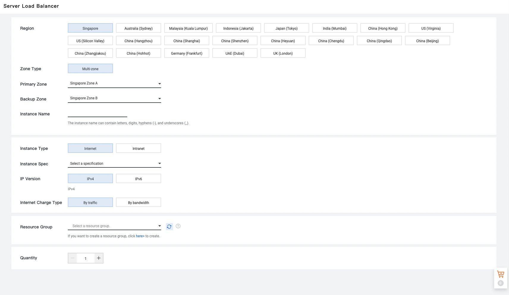{width="4.5in" height="2.607638888888889in"}

IPv6 extends IP addresses from 32 bits to 128 bits.

Only a few zones can create IPv6 instances. Moreover, they must be
performance guaranteed.

Because of the larger size of the IPv6 head, if you are using an UDP
listener on an IPv6 CLB instance, the MTU of the NIC communicating with
the CLB instance on the ECS instance must not be greater than 1480 so
that packets are not discarded due to their size.

To start or stop a CLB instance:

-   Go to the \`Server Load Balancer \`console,

-   Click on \`CLB \| Instances\`,

-   Select the region,

-   Click on \`Start \`or \`Stop \`on the line of the instance.

{width="4.5in"
height="1.7222222222222223in"}

To associate a EIP with the ECS instance:

-   Go to the \`Server Load Balancer \`console,

-   Click on \`CLB \| Instances\`,

-   Select the region,

-   Selection \`\... \| Bind EIP\` on the line of the instance (it must
    be of type VPC),

-   \`IP address\`: this\` \`is the EIP,

-   Click on \`OK\`.

{width="2.2299518810148733in"
height="2.039648950131234in"}

To release a CLB instance:

-   Go to the \`Server Load Balancer \`console,

-   Click on \`CLB \| Instances\`,

-   Click on \`Release \`on the line of the instance,

-   Select \`Release Now \`or \`Release on Schedule\`,

-   Click on \`Next\`,

-   Click on \`OK\`.

{width="2.4610454943132107in"
height="2.3976202974628174in"}

Billing stops immediately although release operations are performed in
30 minute to 1 hour cycles.

If a CLB instance is overdue, it is added to a list of expired
instances.

It works normally for 24 hours.

After this period, if the payment is not settled, it is stopped and
locked.

After 7 days, it is released.

## Tag association 

Tags are used to classify CLB instances. A tag includes a key and a
value.

A CLB instance can have a maximum of 10 tags.

To add a tag:

-   Go to the \`Server Load Balancer \`console,

-   Select \`CLB \| Instances\`,

-   Select the region,

-   Click on the instance ID,

-   Select \`Edit Tags\`,

-   To create a new tag :

```{=html}
<!-- -->
```
-   Click on \`New Tag,

-   \`Enter the key and the value,

-   Click on \`OK\`,

```{=html}
<!-- -->
```
-   Click on \`OK\`.

To add the tag, click on \`Saved Tags \`then select the tag.

{width="2.2822681539807523in"
height="2.2132360017497814in"}

To search for instances using a tag:

-   Go to the \`Server Load Balancer \`console,

-   Click on \`CLB \| Instances\`,

-   Select the region.

You can select a tag from the \`Select a tag \`list.

{width="1.113043525809274in"
height="0.40268700787401573in"}

To delete a tag:

-   Go to the \`Server Load Balancer \`console,

-   Click on \`CLB \| Instances\`,

-   Select the region,

-   Click on the instance ID,

-   Select \`Edit Tags\`,

-   Click on the cross icon next to the tag,

-   Click on \`OK\`.

If the tag is not associated with another instance, it is deleted.

## The Listeners 

The listener checks the connection requests.

CLB supports the:

-   TCP and UDP (layer 4),

-   HTTP and HTTPS (layer 7).

TCP is suitable for cases where reliability requirements are important
and speed can be low (e.g. email, file transmission, classic websites,
\...). UDP is suitable for cases where real time is more important than
reliability (e.g. video conferences, financial quotations, \...).

HTTP is suitable for small websites and mobile games. HTTPS is suitable
for cases where the transmission must be encrypted.

### Add a TCP listener 

To add a TCP listener:

-   Go to the \`Server Load Balancer \`console,

-   Select \`CLB \| Instances\`,

-   Select the region of the instance,

-   Click on \`Add Listener \`on the line of the instance,

-   \`Configure Listener\`: this is the type of protocol,

-   Click on \`Modify \`to the right of \`Advanced\`,

-   \`Listening Port\`: this is the listening port that receives
    requests (between 1 and 65535),

-   \`Listener Name\`: this is\` \`the name of the listener,

-   \`Scheduling Algorithm\`: this is the\` \`algorithm used:

```{=html}
<!-- -->
```
-   \`Weighted Round-Robin (WRR)\`: backend servers with a higher weight
    receive more requests than those with a lower weight,

-   \`Round-Robin (RR)\`: requests are distributed equally and
    sequentially to the backend servers,

-   \`Consistent Hash (CH)\`, based on the source IP address: the same
    source IP addresses are programmed on the same backend server,

-   \`Consistent Hash (CH), \`based on the tuple source IP address /
    destination IP address / source port / destination port: the same
    flows are scheduled on the same backend server,

```{=html}
<!-- -->
```
-   \`Enable Session Persistence:\` allows to enable session
    persistence,

In this case, all session requests from the same client are sent to the
same backend server.

In the case of TCP listeners, requests from the same IP address are sent
to the same backend server.

-   \`Enable Access Control: \`enables the access control function,

-   \`Access Control Method \`(if \`Enable Access Control \`is enabled):
    this is the access control method used:

```{=html}
<!-- -->
```
-   \`Whitelist\`: only requests from IP addresses or CIDR blocks on the
    list are forwarded,

This method is suitable for cases where access is limited to certain IP
addresses.

-   \`Blacklist\`: requests from IP addresses or CIDR blocks included in
    the list are not forwarded,

This method is suitable for cases where certain IP addresses are denied
access. If the list is empty, all requests are forwarded.

-   \`Access Control List \`(if \`Enable Access Control \`is activated):
    this is the list used by the white list or the black list,

-   \`Enable Connection Draining\`: connections to backend servers
    continue to work normally for a specified period of time after they
    are removed or after a failed Health Check,

-   \`Enable Peak Bandwidth Limit\`: enables the peak bandwidth limit
    (for bandwidth-based CLB instances),

By default, all listeners share the bandwidth of the CLB instance.
However, it is possible to limit the traffic passing through the
listeners by defining bandwidth peaks for each listener. The sum of all
these peaks cannot exceed the bandwidth of this instance,

-   \`Idle Timeout\`: this\` \`is the time of inactivity of the
    connection (from 10 to 900 seconds),

-   \`Obtain Client Source IP Address:\` allows the backend server to
    obtain the real IP address of the client,

-   \`Automatically Enable Listener after Creation:\` allows to
    automatically activate the listener after its creation,

-   Click on \`Next\`,

{width="3.3137915573053367in"
height="5.12665791776028in"}

-   \`Forward Requests To\`: it is possible to use the default server
    group configured for the instance (\`Default Server Group\`), to
    configure a server group (\`VServer Group\`) or a group of
    active/standby servers (\`Primary/Secondary Server Group\`),

For the following, let\'s suppose that we choose \`Default Server
Group\`.

-   Click on \`Add More\`,

-   Select the ECS instances,

-   Click on \`Next\`,

-   \`Configure weight and port:

```{=html}
<!-- -->
```
-   Port:\` this is the open port on the backend server (from 1 to
    65535),

-   \`Weight:\` this is the weight of the backend server,

The higher the weight, the more requests it receives. If the weight is
0, no requests are received.

-   Click on \`Add\`,

-   Click on \`Next\`,

{width="4.5in"
height="2.752083333333333in"}

-   Click on \`Modify \`next to \`Advanced \`to modify the Health Check
    configuration,

Health Check improves service availability by detecting backend server
failures.

-   Click on \`Next\`,

-   Click on \`Submit\`,

-   Click on \`OK\`.

### Add a UDP listener 

Because of the larger size of the IPv6 head, if you are using a UDP
listener on an IPv6 CLB instance, the MTU of the NIC communicating with
the CLB instance on the ECS instance must not be greater than 1480 so
that packets are not discarded due to their size.

To add a UDP listener, proceed in the same way as for adding a TCP
listener, except for the following points.

First of all, the CH (Consistency Hash) algorithm includes in addition
to Source IP and Tuple the \`QUIC ID \`choice. This is a consistent hash
based on the QUIC Connection ID. The same QUIC Connection IDs are
programmed on the same backend server.

In addition, the \`Enable Session Persistence\`, \`Idle Timeout \`and
\`Listener Name \`parameters are not available.

### Add a HTTP listener 

To add a HTTP listener:

-   Go to the \`Server Load Balancer \`console,

-   Select \`CLB \| Instances\`,

-   Select the region of the instance,

-   Click on \`Configure Listener \`on the line of the instance,

-   \`Select Listener Protocol\`: this is the type of protocol (\`HTTP
    \`here),

-   \`Listening Port\`: this is the listening port that receives
    requests (between 1 and 65535),

-   \`Listener Name\`: this is the name of the listener,\`

-   \`Click\` on Modify\` next to\` Advanced\`,\`

-   Scheduling Algorithm\`: this is the algorithm used:

```{=html}
<!-- -->
```
-   \`Weighted Round-Robin (WRR)\`: backend servers with a higher weight
    receive more requests than those with a lower weight,

-   \`Round-Robin (RR)\`: requests are distributed equally and
    sequentially to the backend servers,

```{=html}
<!-- -->
```
-   \`Redirection: \`allows to transfer or not the traffic from the HTTP
    listener to a HTTPS listener,

-   \`Enable Session Persistence:\` allows to activate the session
    persistence. Both methods are possible:

In this case, all requests of the same client session are sent to the
same server backend. Persistence is based on cookies.

-   \`Insert cookie\`: CLB adds a cookie (\`SERVERID\`) at the first
    response of the backend server. For the following requests, CLB
    retrieves this cookie and distributes the requests to the same
    backend server. The value of the timeout period must be specified,

-   \`Rewrite cookie\`: vou set the cookie yourself in the HTTP
    response. You only have to define the timeout period and manage the
    life cycle of the cookie yourself on the backend server,

```{=html}
<!-- -->
```
-   \`Enable Access Control: \`enables the access control function,

-   \`Access Control Method \`(if \`Enable Access Control \`is enabled):
    this is the access control method used:

```{=html}
<!-- -->
```
-   \`Whitelist\`: only requests from IP addresses or CIDR blocks on the
    list are forwarded,

This method is suitable for cases where access is limited to certain IP
addresses.

-   \`Blacklist\`: requests from IP addresses or CIDR blocks included in
    the list are not forwarded,

This method is suitable for cases where certain IP addresses are denied
access. If the list is empty, all requests are forwarded.

-   \`Access Control List \`(if \`Enable Access Control \`is activated):
    this is the list used by the whitelist or the blacklist,

-   \`Enable Peak Bandwidth Limit: \`enables the Peak Bandwidth Limit
    (for bandwidth-based CLB instances),

By default, all listeners share the bandwidth of the CLB instance.
However, it is possible to limit the traffic passing through the
listeners by defining bandwidth peaks for each listener. The sum of all
these peaks cannot exceed the bandwidth of this instance.

-   \`Idle Timeout\`: this\` \`is the time of inactivity of the
    connection (from 10 to 900 seconds),

-   \`Request Timeout\`: this is\` \`the time the request is waiting for
    (1 to 180 seconds),

After this time without a response from the backend server, the CLB
instance stops waiting and sends a HTTP 504 error code to the client.

-   \`Enable Gzip Compression:\` allows to activate or not the Gzip
    compression. Gzip supports \`text/xml\`, \`text/plain\`,
    \`text/css\`, \`application/javascript\`,
    \`application/x-javascript\`, \`application/rss+xml\`,
    \`application/atom+xml \`and \`application/xml \`file types,

-   \`Add HTTP Header Fields\`: these are the custom HTTP headers added:

```{=html}
<!-- -->
```
-   \`X-Forwarded-For \`to get the source IP address of the client,

-   \`SLB-ID \`to retrieve the ID of the CLB instance,

-   \`SLB-IP \`to get the public IP address of the CLB instance,

-   \`X-Forwarded-Proto \`to retrieve the listening protocol used by the
    CLB instance,

```{=html}
<!-- -->
```
-   \`Obtain Client Source IP Address:\` allows the backend server to
    obtain the real IP address of the client,

-   \`Automatically Enable Listener after Creation:\` allows to
    automatically activate the listener after its creation,

-   Click on \`Next\`,

+-----------------------------------------------------------------------+
| {width="2.9753543307086616in"   |
| height="2.5901202974628172in"}                                        |
|                                                                       |
| {width="3.002288932633421in"    |
| height="3.6296216097987752in"}                                        |
+=======================================================================+
+-----------------------------------------------------------------------+

-   \`Forward Requests To\`: it is possible to use the default server
    group configured for the instance (\`Default Server Group\`) or to
    configure a group of servers (\`VServer Group\`),

For the following, let\'s suppose that we choose \`Default Server
Group\`.

-   Click on \`Add more\`,

-   Select the ECS instances,

-   Click on \`Add\`,

-   \`Configure weight and port:

```{=html}
<!-- -->
```
-   Port:\` this is the open port on the backend server (from 1 to
    65535),

-   \`Weight:\` this is\` \`the weight of the backend server,

The higher the weight, the more requests it receives. If the weight is
0, no requests are received.

-   Click on \`Next\`,

{width="4.5in"
height="2.752083333333333in"}

-   Click on \`Modify \`to modify the Health Check configuration,

The Health Check improves the availability of services by detecting
backend server failures.

-   Click on \`Next\`,

-   Click on \`Submit\`,

-   Click on \`OK\`.

### Add a HTTPS listener 

HTTPS uses a server certificate or a CA certificate that you must
upload. The possibilities are:

-   \`Server certificate\`: identifies the server,

Upload it to CLB\'s \`Certificate Management \`system. The client uses
it to check if the certificat sent by the server is issued by a trusted
center. It enables one-way and mutual authentication.

-   \`Client certificate \`(client certificate): identifies the client,

Install the certificate on the client. This proves the client user\'s
identity. It is possible to sign a client certificate with a self-signed
CA certificate. It allows mutual authentication.

-   \`CA certificate \`(CA certificate): authenticates the signature on
    the client certificat.

This starts a secure connection. Upload it to the CLB instance. It
enables mutual authentication.

The uploaded certificat must be in PEM format. It takes up to 3 minutes
to process.

HTTPS listeners do not support SNI (Server Name Indication). In order to
use it, you must use TCP listeners and then configure SNI on the ECS
backend instances.

The retention time for HTTPS listener session tickets is 300 seconds.

To add a HTTPS listener:

-   Go to the \`Server Load Balancer \`console,

-   Select \`CLB \| Instances\`,

-   Select the region of the instance,

-   Click on \`Configure Listener \`on the line of the instance,

-   \`Select Listener Protocol\`: this\` \`is the type of protocol
    (HTTPS here),

-   \`Listening Port\`: this is the listening port that receives
    requests (between 1 and 65535),

-   \`Listener Name\`: this is the name of the listener,\`

-   Scheduling Algorithm\`: this is the algorithm used:

```{=html}
<!-- -->
```
-   \`Weighted Round-Robin (WRR)\`: backend servers with a higher weight
    receive more requests than those with a lower weight,

-   \`Round-Robin (RR)\`: requests are distributed equally and
    sequentially to the backend servers,

```{=html}
<!-- -->
```
-   \`Enable Session Persistence:\` allows to activate the session
    persistence ; both methods are possible:

In this case, all requests of the same client session are sent to the
same server backend. Persistence is based on cookies.

-   \`Insert cookie\`: CLB adds a cookie (\`SERVERID\`) at the first
    response of the backend server,

For the following requests, CLB retrieves this cookie and distributes
the requests to the same backend server. The value of the timeout period
must be specified.

-   \`Rewrite cookie\`: you set the cookie yourself in the HTTP
    response,

You only have to define the timeout period and manage the life cycle of
the cookie yourself on the backend server.

-   \`Enable HTTP/2:\` allows to activate HTTP 2.0,

-   \`Enable Access Control: \`enables the access control function,

-   \`Access Control Method \`(if \`Enable Access Control \`is enabled):
    this is the access control method used:

```{=html}
<!-- -->
```
-   \`Whitelist\`: only requests from IP addresses or CIDR blocks on the
    list are forwarded,

This method is suitable for cases where access is limited to certain IP
addresses.

-   \`Blacklist\`: requests from IP addresses or CIDR blocks included in
    the list are not forwarded,

This method is suitable for cases where certain IP addresses are denied
access. If the list is empty, all requests are forwarded.

-   \`Access Control List \`(if \`Enable Access Control \`is activated):
    this is the list used by the white list or the black list,

-   \`Enable Peak Bandwidth Limit\`: enables the peak bandwidth limit
    (for bandwidth-based CLB instances).

By default, all listeners share the bandwidth of the CLB instance.
However, it is possible to limit the traffic passing through the
listeners by defining bandwidth peaks for each listener. The sum of all
these peaks cannot exceed the bandwidth of this instance.

-   \`Idle Timeout\`: this\` \`is the time of inactivity of the
    connection (from 10 to 900 seconds),

-   \`Request Timeout\`: this is the time the request is waiting for (1
    to 180 seconds),

After this time without a response from the backend server, the CLB
instance stops waiting and sends a HTTP 504 error code to the client.

-   \`Enable Gzip Compression:\` allows to activate or not the Gzip
    compression. Gzip supports \`text/xml\`, \`text/plain\`,
    \`text/css\`, \`application/javascript\`,
    \`application/x-javascript\`, \`application/rss+xml\`,
    \`application/atom+xml \`and \`application/xml \`file types,

-   \`Add HTTP Header Fields\`: these are the custom HTTP headers added:

```{=html}
<!-- -->
```
-   \`X-Forwarded-For \`to get the source IP address of the client,

-   \`SLB-ID \`to retrieve the ID of the CLB instance,

-   \`SLB-IP \`to get the public IP address of the CLB instance,

-   \`X-Forwarded-Proto \`to retrieve the listening protocol used by the
    CLB instance,

```{=html}
<!-- -->
```
-   \`Obtain Client Source IP Address:\` allows the backend server to
    obtain the real IP address of the client,

-   \`Automatically Enable Listener after Creation:\` allows to
    automatically activate the listener after its creation,

-   Click on \`Next\`,

-   \`Select Server Certificate\`: select the server certificate or
    click on \`Create Server Certificate \`to purchase or upload one,

{width="3.3031364829396326in"
height="3.868441601049869in"}

You must first have purchased or uploaded a certificate in the SSL
Certificates console. This is what the certificate purchase page looks
like:\
\
{width="2.5106594488188976in"
height="2.7380905511811022in"}

-   Click on \`Modify \`next to \`Advanced\`,

-   Activate \`Enable Mutual Authentication,

-   Select CA Certificate\`: select the CA certificate or click on
    \`Create CA Certificate \`to purchase or upload one,

-   \`TLS Security Policy: \`this is the TLS security policy. The
    supported values are:

It contains the available versions of the TLS protocol and the suites of
supported encryption algorithms. Only the \`guaranteed-performance\`
instances allow to choose the TLS security policy to use.

-   \`tls_cipher_policy_1\_0\`: ensures the best compatibility and but
    the security is weaker (1.0),

-   \`tls_cipher_policy_1\_1\`: ensures good compatibility and security
    (1.1),

-   \`tls_cipher_policy_1\_2\`: ensures good compatibility and high
    security level (1.2),

-   \`tls_cipher_policy_1\_2_strict\`: supports only direct security
    cipher suites and very high security level (1.2),

-   \`tls_cipher_policy_1\_2_strict_with_1\_3\`: supports only direct
    security cipher suites with very high security level (1.2 and 1.3),

```{=html}
<!-- -->
```
-   Click on \`Next\`,

{width="3.4017311898512688in"
height="3.028485345581802in"}

-   \`Forward Requests To\`: it is possible to use the default server
    \`group\` configured for the instance, to configure a server group
    (\`VServer Group\`) or a group of active/pending servers,

For the following, let\'s suppose that we choose \`Default Server
Group\`.

-   Click on \`Add more\`,

-   Select the ECS instances,

-   Click on \`Next\`,

-   \`Configure weight and port:

```{=html}
<!-- -->
```
-   Port:\` this is the open port on the backend server (from 1 to
    65535),

-   \`Weight\`: this is\` \`the weight of the backend server,

The higher the weight, the more requests it receives. If the weight is
0, no requests are received.

-   Click on \`Add\`,

-   Click on \`Next\`,

-   Click on \`Modify \`to modify the Health Check configuration,

The Health Check improves the availability of services by detecting
backend server failures.

-   Click on \`Submit\`,

-   Click on \`OK\`.

### Install multiple SSL certificates on a single IP address 

Guaranteed-performance HTTPS listeners support multiple certificats
configuration. It allows requests on different domain names to be
forwarded to different backend servers.

SNI (Server Name Indication) is an extension of the SSL/TLS protocol
that allows a server to install multiple SSL certificates on a single IP
address. The certificate configured for each domain name is used. If
none is specified, the HTTPS listener\'s certificate is used.

Only CLB instances with guaranteed performance support the SNI. To do
this, use the domain name extension.

To add a certificate to a domain name:

-   Go to the \`Server Load Balancer \`console,

-   Select \`CLB \| Instances\`,

-   Click on the ID of the CLB instance,

-   Click on the \`Listener \`tab,

-   Select \`Manage Additional Certificate \`on the line of the
    listener,

We assume that a listener has already been set up on this CLB instance.

{width="1.832001312335958in"
height="0.9035378390201225in"}

-   Click on \`Add Additional Certificate\`,

-   \`Additional Certificate\`: this is the domain name (example:
    www.mywebsite.com) or with a wildcard (example:
    \`\*.mywebsite.com\`),

The domain name in the certificate must be the same as the one added in
the domain name extension.

-   \`Select Server Certificate\`: this\` \`is the certificate
    associated with the domain name,

-   Click on \`OK\`,

{width="3.4627504374453193in"
height="2.1123851706036745in"}

-   Click \`Configure Rule\`,

{width="2.705333552055993in"
height="1.0337051618547681in"}

-   Click on \`Add Forwarding Rules\`,

-   \`Configure the rules,

-   \`Click on\` Add Forwarding Rules,

-   Click on the cross to close the popup.

\`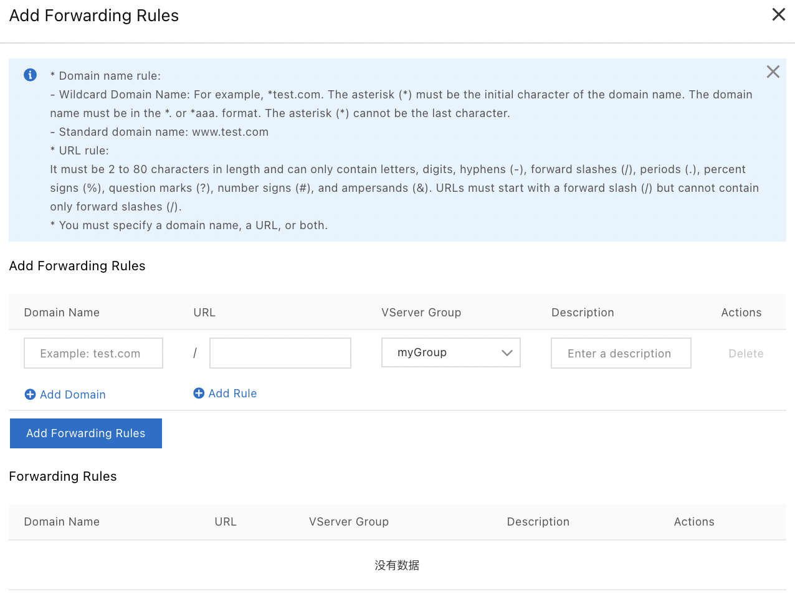{width="3.430854111986002in"
height="2.6297911198600175in"}

To change the forward rules:

-   Go to the \`Server Load Balancer \`console,

-   Select \`CLB \| Instances\`,

-   Click on the ID of the CLB instance,

-   Click on the \`Listener \`tab,

-   Click on \`Set Forwarding Rule \`on the line of the listener.

To change the certificate for a domain name:

-   Go to the \`Server Load Balancer \`console,

-   Select \`CLB \| Instances\`,

-   Click on the ID of the CLB instance,

-   Click on the \`Listener \`tab,

-   Select \`Manage Additional Certificate \`on the line of the
    listener,

-   Click on \`Edit \`on the domain name extension line,

-   \`Select Server Certificate\`: this\` \`is the new certificate,

-   Click on \`OK\`.

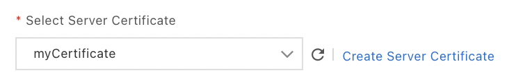{width="2.5304811898512685in"
height="0.4158902012248469in"}

To remove a certificate from a domain name:

-   Go to the \`Server Load Balancer \`console,

-   Select \`CLB \| Instances\`,

-   Click on the ID of the CLB instance,

-   Click on the \`Listener \`tab,

-   Select \`Manage Additional Certificate \`on the line of the
    listener,

-   Click on \`\... \| Remove \`on the line of the domain name
    extension,

-   Click on \`OK\`.

## The Health Check 

The CLB instance checks the availability of the services of the ECS
instances by performing Health Checks.

If an ECS instance is \`unhealthy\`, CLB stops distributing requests to
that instance until it becomes \`healthy\` again.

If the service has a lot of traffic, these Health Check operations can
have an impact on the service. To reduce this impact, it may be
appropriate to increase the interval between checks.

Data transmission and Health Checks are processed simultaneously by the
node servers of the LVS cluster and the Tengine cluster. If an
\`unhealthy \`state is detected on an instance, all servers in the
cluster are informed.

The Health Checks are performed on the IP address range
\`100.64.0.0/10\`. This range is therefore blocked on the backend
servers at the Security Groups level. However, if you use iptables or an
equivalent, you must allow the CIDR block \`100.64. 0.0/10\`.

For HTTP and HTTPS listeners (layer 7), the Health Check is performed by
sending HTTP requests of type \`HEAD \`by CLB.

For HTTPS listeners, the data transmitted is not in HTTPS in order to
improve performance.

The HTTP and HTTPS (Layer 7) Health Check process is as follows:

-   The Tengine node server sends a HTTP \`HEAD \`request to
    \`\<IP_ADDRESS\>:\<PORT\>\<HEALTH_PATH\>.\`

-   The backend server returns a HTTP status code.

-   If the Tengine node server does not receive a response within the
    timeout, the ECS instance is declared \`unhealthy\`.

-   If it receives it in time, it compares the returned HTTP status code
    with the one specified in the lister configuration.

-   If the code is the same, the ECS instance is declared \`healthy\`;
    otherwise, it is declared \`unhealthy\`.

The TCP Health Check process is as follows:

-   The LVS node server sends a TCP SYN packet to
    \`\<IP_ADDRESS\>:\<HEALTH_PORT\>\` of the\` \`ECS instance.

-   If this port is listening normally, the server returns a TCP SYN and
    ACK packet.

-   If the server of the LVS node does not receive data within the
    timeout period, the ECS instance is declared \`unhealthy\`.

-   If the data is received on time, the ECS instance is declared
    \`healthy\`.

-   The LVS node server then sends an RST data packet to the ECS
    instance to terminate the TCP connection.

UDP listeners are based on the detection of a UDP packet. Here is the
process:

-   The LVS node server sends a UDP packet to
    \`\<IP_ADDRESS\>:\<HEALTH_PORT\>.\`

-   If the corresponding port of the ECS instance is not listening
    normally, the server returns an ICMP error message \`port XXX
    unreachable\`.

-   If the LVS node server receives the ICMP error message within the
    timeout period, the ECS instance is declared \`unhelathy\`;
    otherwise, it is declared \`healthy\`.

On Linux, setting up anti-ICMP protection can slow down the sending of
ICMP messages. In this case, the ICMP error message may arrive too late,
after the CLB instance has declared the ECS instance \`healthy\`. The
solution is to use custom requests and responses.

### The time window 

To avoid that Health Checks declare ECS instances \`healthy \`or
\`unhleathy \`too quickly, this state is declared only after a certain
number of Health Check failures or successes.

This time window is based on:

-   \`Health Check interval\`: this\` \`is the frequency of the Health
    Check,

-   \`Response timeout\`: this is the waiting time for the response,

-   \`Health Check threshold\`: this is the number of consecutive
    successful or failed Health Checks.

The calculation method for the time window for:

-   a failed Health Check: \`Response Timeout x Unhealthy Threshold +
    Health Check Interval x (Unhealthy Threshold) -1)\`,

-   a successful Health Check: \`(Response Time x Healthy Threshold) +
    Health Check Interval x (Healthy Threshold-1)\`.

The response time is the time between when the Health Check request is
sent and when the response is received.

If an ECS instance is in \`healthy \`state, it receives the requests. If
it is in \`unhealthy \`state, it does not receive them. But if the ECS
instance is in the \`unhealthy \`time window, it still receives the
requests. They will then fail.

### Add a Health Check 

To set up a Health Check:

-   Go to the \`Server Load Balancer \`console,

-   Select \`CLB \| Instances\`,

-   Select the region,

-   Click on the ID of the CLB instance,

-   Click on the \`Listener \`tab,

-   Click on \`Modify Listener \`on the line of the listener,

-   Click twice on \`Next\`,

-   Click on \`Modify \`next to \`Advanced\`,

For TCP listeners, TCP and HTTP Health Checks are supported. The TCP
Health Check is based on the detection of the network layer. The HTTP
Health Check is based on sending \`HEAD \`requests.

-   \`Health Check Method\`: this is the method for the Health Check (by
    default\` HEAD\`),\`

If the backend server does not support the HEAD method, it is necessary
to specify the GET method. In this case, if the response exceeds 8 Kb,
it is truncated.

-   Health Check Port\`: this is the detection port used by the Health
    Check,

By default, this port is configured in the listener.

-   \`Health Check Path \`and \`Health Check Domain Name (Optional)\`:
    this is the address to which the Health Check is sent,

By default, CLB sends a HTTP \`HEAD \`request to the home page of the
web server. To use another one, you just have to specify the URL.

Some Web servers check the \`host \`field of the request. It is
therefore necessary to add it. If a domain name is configured in the
Health Check, CLB automatically adds it to the \`host \`field during
requests. It is therefore necessary to configure a domain name.

-   \`Normal Status Code:\` this is\` \`the HTTP status code indicating
    that the Health Check is normal (by default \`http_2xx \`and
    \`http_2xx\`) (only for the HTTP Health Check),

-   \`Response Timeout: \`this is the time it takes to get a response
    from a Health Check (from 1 to 300 seconds).

After this time, the Health Check fails. The default value is 10 seconds
for UDP listeners and 5 seconds for HTTP/HTTPS/TCP listeners.

-   \`Health Check Interval:\` this\` \`is the time interval between two
    consecutive Health Checks (from 1 to 50 seconds),

The Health Check time of each server in the node is not synchronized.
The default value is 5 seconds for UDP listeners and 2 seconds for
HTTP/HTTPS/TCP listeners.

-   \`Unhealthy Threshold: \`this\` \`is the number of successful Health
    Checks that must occur consecutively for an ECS instance to be
    declared healthy,

-   \`Unhealthy Threshold\`: this is\` \`the number of consecutive
    Health Check failures performed by the same LVS node server on the
    same ECS instance (from 2 to 10). The default value is 3,

-   Click on \`Next\`,

-   Click on \`Submit\`.

{width="2.5973195538057743in"
height="2.7528379265091862in"}

### Remove a Health Check

Only HTTP and HTTPS Health Checks can be closed.

It is not recommended to close a Health Check because the requests could
be distributed to unhelathy ECS instances.

To close a Health Check:

-   Go to the \`Server Load Balancer \`console,

-   Select \`CLB \| Instances\`,

-   Select the region,

-   Click on the ID of the CLB instance,

-   Click on the \`Listener \`tab,

-   Click on \`Modify Listener \`on the line of the listener,

-   Click twice on \`Next\`,

-   Disable \`Enable Health Check\`,

-   Click on \`Next\`,

-   Click on \`Submit\`.

{width="2.5400535870516188in"
height="2.6721522309711285in"}

## The backend servers 

Before creating a CLB instance, you must create ECS instances in the
same region to use them as backend servers. You can group these backend
servers into a virtual server group (VServer group).

Different listeners can be used within a VServer Group.

When a VServer Group is used, requests are forwarded to the ECS
instances belonging to it rather than to the ECS instances of the
default server group.

The ECS and CLB instances must be in the same region.

ECS instances may have a different operating system although it is a
good practice to use the same one to simplify their management.

A CLB instance can use up to 50 listeners.

The listening ports of a CLB instance correspond to the open ports on
the ECS instance.

Each ECS instance can have a weight. ECS instances with a higher weight
will receive more requests.

If the distribution of requests is not uniform:

-   The session persistence feature can unbalance the distribution of
    requests on ECS instances. In this case, the solution is to disable
    it.

-   Collect website access logs over a period of time.

-   Check that the number of logs of the ECS instances matches the CLB
    configuration.

-   If session persistence is enabled, logs for the same IP address must
    be deleted.

-   If weights are configured, check that the log percentage is
    consistent with the weight.

A default server group contains the ECS instances that receive the
requests. If a listener is not associated with a VServer Group or an
\`active/standby\` \`server\` group, the requests are forwarded to the
ECS instances of the default server group.

An \`active/standby\` \`server\` group contains only two ECS instances:

-   the active server,

-   the backup server: no Health Check is performed on this instance.

When the active server is declared \`unhealthy\`, the traffic is
forwarded to the standby server. When it becomes \`healthy \`again, it
receives the traffic again.

Only TCP and UDP (Layer 4) listeners support active/standby server
groups.

VServer Groups allow you to:

-   distribute different requests to different backend servers,

-   configuring transfer rules based on domain names or URLs.

### The default server group 

To add ECS instances to the default server group:

-   Go to the \`Server Load Balancer \`console,

-   Select \`CLB \| Instances\`,

-   Select the region,

-   Click on the instance ID,

-   Click on \`Default Server Group\`,

-   Click on \`Add\`,

-   Select the ECS instances to add,

-   Click on \`Next\`,

-   Specify the weight of each ECS instance,

-   Click on \`Add\`,

-   Click on \`OK\`.

{width="4.5in"
height="1.4597222222222221in"}

The higher the weight, the more requests the instance receives. If the
weight is 0, the instance does not receive any requests.

To change the weight of several servers in batch, change the weight of
the current server and then click on one of the icons:

-   on the first one so that the weight of the servers below is
    modified,

-   on the second one so that the weight of the servers above is
    modified,

-   on the third one so that the weight of all servers is changed,

-   on the fourth one so that the weight is erased.

To change the weight of a backend server:

-   Go to the \`Server Load Balancer \`console,

-   Select \`CLB \| Instances\`,

-   Select the region,

-   Click on the ID of the CLB instance,

-   Click on the \`Default Server Group \`tab,

-   Click on the pencil icon of the server,

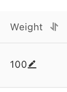{width="0.36253171478565177in"
height="0.49985454943132107in"}

-   Change the weight,

-   Click on \`OK\`.

To remove a backend server:

-   Go to the \`Server Load Balancer \`console,

-   Select \`CLB \| Instances\`,

-   Select the region,

-   Click on the ID of the CLB instance,

-   Click on the \`Default Server Group \`tab,

-   Click on \`Remove \`on the line of the instance.

### The VServer Group 

A VServer Group is a group of ECS instances. If a VServer Group is
associated with a listener, the listener distributes the requests to the
ECS instances of this group.

The transfer of requests follows the following logic:

-   If the requests match a forwarding rule, they are distributed to the
    VServer Group associated with the rule.

-   If no forwarding rule matches and a VServer Group is configured on
    the listener, requests are distributed to the VServer Group
    associated with the listener.

-   If no VServer Group is configured on the listener, requests are
    forwarded to the ECS instances in the default server group.

To create a VServer Group:

-   Go to the \`Server Load Balancer \`console,

-   Select \`CLB \| Instances\`,

-   Select the region,

-   Click on the instance ID,

-   Click on the \`VServer Groups \`tab,

-   Click on \`Create VServer Group\`,

-   \`VServer Group Name\`: this is the name of the group,

-   Click on \`Add\`,

-   Select the instances to add,

-   Click on \`Next\`,

-   \`Port:\` this is the port of the ECS instance that receives the
    requests,

-   \`Weight:\` this is the weight of the ECS instance,

The higher the weight, the more requests the instance receives. If the
weight is 0, the ECS instance receives no requests.

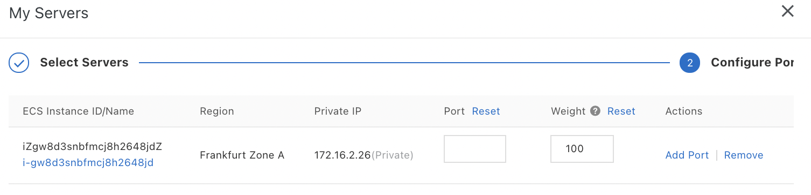{width="4.5in" height="1.0875in"}

-   Click on \`Add\`,

-   Click on \`Create\`.

To change the weight of several servers in batch, change the weight of
the current server and then click on one of the icons:

-   on the first one so that the weight of the servers below is
    modified,

-   on the second one so that the weight of the servers above is
    modified,

-   on the third one so that the weight of all servers is changed,

-   on the fourth one so that the weight is erased.

The ECS instances must be in the same region as the CLB instance and the
VServer Group.

An ECS instance can be added to multiple VServer Groups.

A VServer Group can be associated with several listeners.

To modify a VServer Group:

-   Go to the \`Server Load Balancer \`console,

-   Select \`CLB \| Instances\`,

-   Select the region,

-   Click on the instance ID,

-   Click on the \`VServer Groups \`tab,

-   Click on \`Edit \`on the line of the group,

-   Change the port and weight of the ECS instance,

-   Click on \`Save\`.

To delete a VServer Group:

-   Go to the \`Server Load Balancer \`console,

-   Select \`CLB \| Instances\`,

-   Select the region,

-   Click on the instance ID,

-   Click on the \`VServer Groups \`tab,

-   Click on \`Delete \`on the line of the group,

-   Click on \`OK\`.

### Putting it on standby

The \`active/standby server \`group consists of one backend server
acting as an active server and another as a standby server.

When the active server is \`healthy\`, it receives requests. When it is
\`unhealthy\`, the requests are distributed to the second server,
waiting.

No healthy check is performed on the standby server.

Only TCP and UDP listeners (Layer 4) support the configuration of
active/standby server groups.

To create an active/standby server group:

-   Go to the \`Server Load Balancer \`console,

-   Select \`CLB \| Instances\`,

-   Select the region,

-   Click on the ID of the CLB instance,

-   Click on the \`Primary/Secondary Server Groups \`tab,

-   Click on \`Create Primary/Secondary Server Group\`,

-   \`Primary/Secondary Server Group Name\`: this is the name of the
    group,

-   Click on \`Add\`,

-   Select the instances to add (up to two ECS instances can be added to
    the group),

-   Click on \`Next\`,

-   \`Port:\` this is the port of the ECS instance that receives the
    requests,

To add another port, click on \`Add Port\`.

-   Click on \`Add\`,

-   In the column \`Type\`, check the line of the ECS instance that
    plays the role of server,

-   Click on \`Create\`.

To delete an active/pending server group:

-   Go to the \`Server Load Balancer \`console,

-   Select the region,

-   Click on the instance ID,

-   Click on the \`Primary/Secondary Server Groups \`tab,

-   Click on \`Delete \`on the line of the group to be deleted,

-   Click on \`OK\`.

## Management of the Certificates

You can use three types of certificates with CLB instances:

-   SSL Certificate certificates,

-   third-party certificates,

-   self-signed CA certificates.

However, only certificates in PEM format are supported.

In the case of using a certificat issued by a root CA, this is the only
certificat to upload to the CLB instance. The format of this certificate
must start with \`\-\-\-\-- BEGIN CERTIFICATE \-\-\-\-- \`and end with
\`\-\-\-\-- END CERTIFICATE \`\-\-\-\--.

If you use a certificate issued by an intermediate CA, you get two
certificates.

Place the server certificat first, then the immediate certificat. The
result looks like this:

\-\-\-\-- BEGIN CERTIFICATE \-\-\-\--

\-\-\-\-- END CERTIFICATE \-\-\-\--

\-\-\-\-- BEGIN CERTIFICATE \-\-\-\--

\-\-\-\-- END CERTIFICATE \-\-\-\--

\-\-\-\-- BEGIN CERTIFICATE \-\-\-\--

\-\-\-\-- END CERTIFICATE \-\-\-\--

Upload the certificate chain to the CLB instance.

In addition to uploading the server certificate, the private RSA key of
the certificat must be uploaded. This usually has the following format:

\-\-\-\-- BEGIN RSA PRIVATE KEY \-\-\-\--

\...

\-\-\-\-- END RSA PRIVATE KEY \-\-\-\--

Or:

\-\-\-\-- BEGIN ENCRYPTED PRIVATE KEY \-\-\-\--

\...

\-\-\-\-- END ENCRYPTED PRIVATE KEY \-\-\-\--

Convert the private key \`key.pem \`to \`new_key.pem:\`

openssl rsa -in key.pem -out new_key.pem

To configure a HTTPS listener, you can:

-   directly use a certificat found in the SSL Certificate service: alerts
    are sent just before the certificat expires; client CA certificates
    are not supported,

-   upload the third-party certificat and CA certificate to the CLB
    instance: both the public and private key files for the certificate
    are required; both server HTTPS and client CA certificates are
    supported,

-   use a self-signed CA certificate.

It is then no longer necessary to use certificates on the backend
servers.

A certificate cannot be used in multiple regions. For a certificate to
work in multiple regions, those regions must be selected when the
certificat is created.

It is very strongly recommended that the certificat be replaced before it
expires.

### Use a SSL Certificate 

The first way we have seen to configure a HTTPS listener is to use the
SSL Certificate service. This issues certificats from different providers.
It provides a uniform way to manage the lifecycle of certificats. SSL
Certificate allows to purchase a certificat or upload a third-party
certificat.

To select a certificat from the SSL Certificate service:

-   Go to the \`Server Load Balancer \`console,

-   Select \`CLB \| Certificates\`,

-   Click on \`Create Certificate\`,

-   Select \`Alibaba Cloud Certificates\`,

-   Select the region in which to deploy the certificate,

-   Select the SSL certificate to use,

-   Click on \`Create\`.

### Use a third-party certificate 

The second way we have seen to configure a HTTPS listener is to upload a
third-party certificat and the CA certificate to the SLB instance. It is
necessary to have the public and private key files for the certificate.
HTTPS server and client CA certificates are supported.

To upload a third party certificate:

-   Go to the \`Server Load Balancer \`console,

-   Select \`CLB \| Certificates\`,

-   Click on \`Create Certificate\`,

-   Click on \`Upload Third-party Certificate\`,

-   Click on \`Next\`,

-   \`Certificate Name\`: this is\` \`the name of the certificat,

-   \`Certificate Type\`: this is\` \`the type of certificate:

```{=html}
<!-- -->
```
-   \`Server Certificate\`: this is used for one-way HTTPS
    authentication,

Only the server certificate and the private key are required.

-   \`CA Certificate:\` this is used for HTTPS mutual authentication,

The server certificate and the CA certificate are required.

-   \`Public Key Certificate\`: this is\` \`the content of the
    certificat,

-   \`Private Key\`: this is\` \`the content of the private key of the
    server certificate,

-   \`Region\`: this is the region in which the certificat is uploaded,

-   Click on \`Create\`.

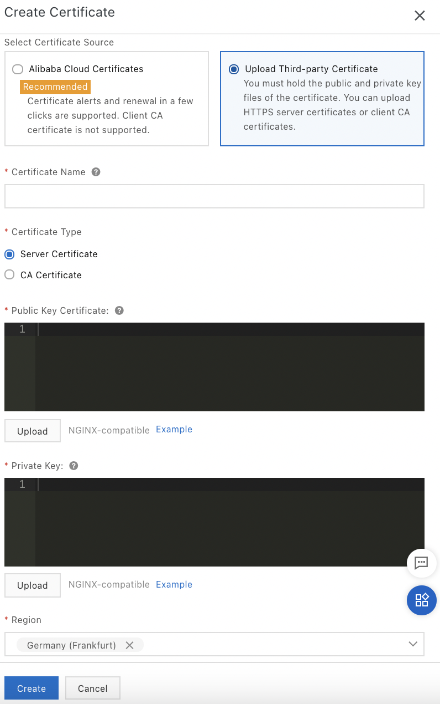{width="2.5504133858267717in"
height="4.069248687664042in"}

### Use a self-signed CA certificate 

The third way we have seen to configure a HTTPS listener is to use a
self-signed CA certificate. To generate such a CA certificate, we can
use Open SSL.

Create a directory \`data \`containing the following directories:

-   \`certificate:\` contains the certificate signed by a CA
    certificate,

-   \`private_key:\` contains the private key of the CA certificate.

#### Preparation of the environment

Start by creating the following directories:

mkdir -p data/certificate data/private_key data/users

Then create an \`openssl.conf \`configuration file with the following
content:

cat \<\<EOF\> data/openssl.conf

\[ca\]

default_ca = foo

\[foo\]

dir = /data

database = /data/index.txt

new_certs_dir = /data/certificate

certificate = /data/private_key/ca.crt

serial = /data/serial

private_key = /data/private_key/ca.key

RANDFILE = /data/private_key/.rand

default_days = 365

default_crl_days = 30

default_md = md5

unique_subject = no

policy = policy_any

\[policy_any\]

countryName = match

stateOrProvinceName = match

organizationName = match

organizationalUnitName = match

localityName = optional

commonName = supplied

emailAddress = optional

EOF

Check that the file has been created:

ls -l data/openssl.conf

For convenience, rather than installing openssl locally, we will use a
Docker \`nginx \`container, which already has \`openssl \`built in:

alias openssl=\"docker run \--rm -it -v \$PWD/data:/data
\--workdir=/data nginx openssl\"

So when you type \`openssl\`, it will be equivalent to running the
\`openssl \`command but in a Docker container.

#### Generation of a private key

Generate a private key:

openssl genrsa -out /data/private_key/ca.key

Check that the file has been created:

ls -l data/private_key/ca.key

#### Generation of a certificate

Generate a certificate (\`.csr\`):

openssl req -new -key /data/private_key/ca.key -out
/data/private_key/ca.csr

You have to answer several questions. The output of the command is:

You are about to be asked to enter information that will be incorporated

into your certificate request.

What you are about to enter is what is called a Distinguished Name or a
DN.

There are quite a few fields but you can leave some blank

For some fields there will be a default value,

If you enter \'.\', the field will be left blank.

\-\-\-\--

Country Name (2 letter code) \[AU\]:FR

State or Province Name (full name) \[Some-State\]:

Locality Name (eg, city) \[\]:Paris

Organization Name (eg, company) \[Internet Widgits Pty
Ltd\]:MyOrganization

Organizational Unit Name (eg, section) \[\]:MyUnit

Common Name (e.g. server FQDN or YOUR name) \[\]:MyName

Email Address \[\]:

Please enter the following \'extra\' attributes

to be sent with your certificate request

A challenge password \[\]:mypassword

An optional company name \[\]:

Check that the file has been created:

ls -l data/private_key/ca.csr

You must specify the domain name of the CLB instance for the \`Common
Name\`. Now generate a \`.crt \`file:

openssl x509 -req -days 365 -in /data/private_key/ca.csr -signkey
private_key/ca.key -out /data/private_key/ca.crt

The output of the command is:

Signature ok

subject=C = FR, ST = Some-State, L = Paris, O = MyOrganization, OU =
MyUnit, CN = MyName

Getting Private key

Check that the file has been created:

ls -l data/private_key/ca.crt

#### Generation of a certificate revocation list

Create a certificate revocation list for client certificate revocation:

touch data/index.txt

openssl ca -gencrl -out /data/private_key/ca.crl -crldays 7 -config
/data/openssl.conf

The \`data/index.txt\` file is the CA key library. The output of the
command is:

Using configuration from /data/openssl.conf

Check that the file has been created:

ls -l data/private_key/ca.crl

#### Client certificate signature

Then generate an RSA private key for the client certificate:

openssl genrsa -des3 -out /data/users/client.key 1024

You must enter a passphrase to protect the private key. The output of
the command is:

Generating RSA private key, 1024 bit long modulus (2 primes)

Enter pass phrase for /data/users/client.key:

Verifying - Enter pass phrase for /data/users/client.key:

Check that the file has been created:

ls -l data/users/client.key

Create a certificate signing request file (\`.csr\`):

openssl req -new -key /data/users/client.key -out /data/users/client.csr

You must enter the passphrase you entered earlier.

The output of the command looks like this:

Enter pass phrase for /data/users/client.key:

You are about to be asked to enter information that will be incorporated

into your certificate request.

What you are about to enter is what is called a Distinguished Name or a
DN.

There are quite a few fields but you can leave some blank

For some fields there will be a default value,

If you enter \'.\', the field will be left blank.

\-\-\-\--

Country Name (2 letter code) \[AU\]:FR

State or Province Name (full name) \[Some-State\]:

Locality Name (eg, city) \[\]:Paris

Organization Name (eg, company) \[Internet Widgits Pty
Ltd\]:MyOrganization

Organizational Unit Name (eg, section) \[\]:MyUnit

Common Name (e.g. server FQDN or YOUR name) \[\]:MyName

Email Address \[\]:

Please enter the following \'extra\' attributes

to be sent with your certificate request

A challenge password \[\]:mypassword

An optional company name \[\]:

The challenge password is the client certificate password. It is not the
password of the client key.

#### Signature of the client key

Before starting, you need to start the starting sequence number for the
private key (4 characters):

echo 0000 \> data/serial

Then sign the client key:

openssl ca -in /data/users/client.csr -cert /data/private_key/ca.crt
-keyfile /data/private_key/ca.key -out /data/users/client.crt -config
/data /openssl.conf

You need to type twice on \`y\`. The output of the command is:

Using configuration from /data/openssl.conf

Check that the request matches the signature

Signature ok

The Subject\'s Distinguished Name is as follows

countryName:PRINTABLE: \'FR\'

stateOrProvinceName:ASN.1 12:\'Some-State

localityName:ASN.1 12:\'Paris\'

organizationName:ASN.1 12:\'MyOrganization\'

organizationalUnitName:ASN.1 12:\'MyUnit\'

commonName:ASN.1 12:\'MyName\'

Certificate is to be certified until Aug 11 19:58:02 2022 GMT (365 days)

Sign the certificate? \[y/n\]:y

1 out of 1 certificate requests certified, commit? \[y/n\]y

Write out database with 1 new entries

Data Base Updated

You can check that the content of the \`data/serial \`file has changed:

cat data/serial

This command should display:

01

#### Conversion of the certificate to PKCS12 format

The PKCS12 format is a format that contains encrypted key pairs.

To convert the certificate to a PKCS12 file:

openssl pkcs12 -export -clcerts -in /data/users/client.crt -inkey
/data/users/client.key -out /data/users/client.p12

You need to enter the password of the client key and then the password
used to export the client certificate. The output of the command is:

Enter pass phrase for /data/users/client.key:

Enter Export Password:

Verifying - Enter Export Password:

Check that the file has been created:

ls -l data/users

#### Conversion between formats

CLB supports only PEM certificate format, so you need to convert the
certificate into this format. Here we present how to convert the
certificate from DER, P7B or PFX format to PEM format.

First, let\'s see how to do a DER to PEM conversion. The DER format is
generally used on Java platforms. The files have the extension \`.der\`,
\`.cer \`or \`.crt\`.

To convert the DER format to PEM, run:

openssl x509 -inform der -in mycertificate.cer -out mycertificate.pem

To convert the private key, run:

openssl rsa -inform der -outform pem -in myprivatekey.der -out
myprivatekey.pem

Next, let\'s see how to do a conversion from P7B to PEM. The P7B format
is generally used by Windows and Tomcat servers.

To convert from P7B to PEM, run:

openssl pkcs7 -print_certs -in incertificate.p7b -out outcertificate.cer

Finally, let\'s see how to convert from PFX to PEM. The PFX format is
generally used by Windows servers.

To convert the certificate from PFX to PEM format, run:

openssl pkcs12 -in certname.pfx -nokeys -out cert.pem

To convert the private key from PFX to PEM format, run:

openssl pkcs12 -in certname.pfx -nocerts -out key.pem -nodes

## The logs 

The logs of the operations performed during the last month on the CLB
instances, the HTTP listeners and the Certificates Server are recorded in
ActionTrail. It is possible to query these logs and store them in OSS.

### View operation logs 

To view the logs:

-   Go to the \`Server Load Balancer \`console,

-   Select \`CLB \| Logs \| Operation Logs\`,

-   Click on \`+ \`on the line of a log,

{width="4.286455599300088in"
height="3.1943350831146105in"}

-   Select the \`Resource Type \`filter,

{width="4.5in" height="0.31319444444444444in"}

-   Select the CLB instance,

-   Select the type of event,

-   Select a time interval,

-   Click on the search icon.

To view more information about a log entry, expand the display.

It is possible to consult the Health Check logs of the last 3 days. To
go further, you must first store them in OSS and then download them.

### View Health Check logs 

To view the Health Check logs generated in the last three days:

-   Go to the \`Server Load Balancer \`console,

-   Select \`CLB \| Logs \| Health Check Logs\`,

-   Click on the \`Logs \`tab.

{width="2.9788746719160106in"
height="1.6094192913385827in"}

The message \`\<IP_ADDRESS_CLB_INSTANCE\>: \<CLB_PORT\> to
\<IP_ADDRESS_ECS_INSTANCE\>: \<ECS_PORT\> abnormal; cause: \<MESSAGE\>\`
indicates that the backend server is experiencing a problem.

The message \`\<IP_ADDRESS_CLB_INSTANCE\>: \<CLB_PORT\> to
\<IP_ADDRESS_ECS_INSTANCE\>: \<ECS_PORT\> normal\` means that the
backend server has returned to normal status.

### Store Health Check logs 

It is possible to enable and disable log storage.

CLB creates an \`AliyunSLBHealthCheckLogs \`folder in the selected OSS
bucket. CLB creates a folder for each day (for example: 20210304).

The logs are generated every hour. They are stored in the corresponding
folder in an object whose name corresponds to the number of the end time
of the logs (example: \`09.txt \`for the time slot 08:00 to 09:00).

Health Check logs are only generated when the backend server encounters
a problem.

To store the Health Check logs in an OSS bucket, first create an OSS
bucket:

-   Go to the \`OSS \`console,

-   Click on \`Buckets\`,

-   Click on \`Create Bucket\`,

-   Configure the bucket,

The bucket must be in the same region as the CLB instance.

-   Click on \`OK\`.

{width="3.2270450568678917in"
height="3.984005905511811in"}

Then allow access to OSS from CLB (this is only necessary for the first
time):

-   Go to the \`Server Load Balancer \`console,

-   Select \`CLB \| Logs \| Health Check Logs \| Log Storage\`,

-   Activate \`OSS\`,

-   Click on \`Activate Now\` to authorize the necessary RAM role,

-   Click on \`Confirm Authorization Policy\`.

Configure RAM:

-   Go to the \`RAM \`console,

-   Click on \`RAM Roles\`,

-   Click on \`Add Permissions \`on the line of \`SLBLogDefaultRole\`,

{width="3.125075459317585in"
height="2.510188101487314in"}

-   \`Enter a policy name\`: enter the name of the \`AliyunOSSFullAccess
    \`permission,

-   Click on the permission,

{width="3.8803608923884516in"
height="3.4665758967629046in"}

-   Click on \`OK\`,

-   Click on \`Complete\`.

Finally, configure Log Storage:

-   Go to the \`Server Load Balancer \`console,

-   Select \`CLB \| Logs \| Health Check Logs\`,

-   Click on the \`Log Storage \`tab,

-   Click on \`Configure Log Storage \`on the line of the region,

-   Select the bucket where to store the logs,

-   Click on \`OK\`,

{width="4.5in" height="2.79375in"}

-   Activate \`Status\`.

{width="0.19965551181102362in"
height="0.246003937007874in"}

### Download Health Check logs 

To download the Health Check logs in OSS:

-   Go to the \`OSS \`console,

-   Click on \`Buckets\`,

-   Click on the log bucket,

-   Click on \`Files\`,

-   Click on the \`AliyunSLBHealthCheckLogs/ \`folder,

-   Click on the log file to download,

-   Click \`View Details \`on the line of the log file,

-   Click on \`Copy\`.

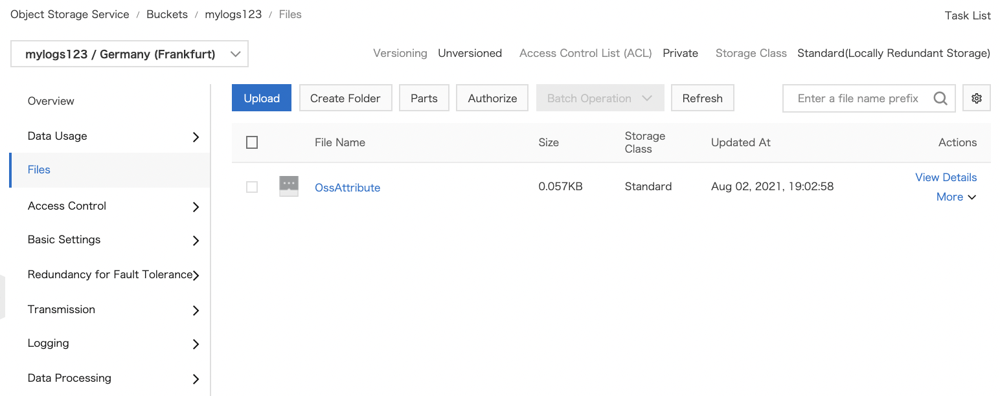{width="4.5in" height="1.7833333333333334in"}

In a web browser, paste the copied URL to download the log file.

### Allow access to access logs to a RAM user 

First of all, the RAM user must be authorized by the Alibaba Cloud
account.

A prerequisite is to have the \`AliyunLogArchiveRole\`. Check that it
exists:

-   Go to the \`RAM \`console,

-   Click on \`RAM Roles\`.

{width="3.6484416010498686in"
height="0.5776695100612423in"}

If the \`AliyunLogArchiveRole does \`not appear, you must create it:

-   Go to the \`Server Load Balancer \`console,

-   Select \`CLB \| Logs \| Access Logs\`,

-   Click on \`Authorize\`,

-   Click on \`Confirm Authorization Policy\`.

To create an access log permission policy for a RAM user:

-   Go to the \`RAM \`console,

-   Click on \`Permissions \| Policies\`,

-   Click on \`Create Policy\`,

-   \`Policy Name\`: this is the name of the policy,

-   \`Configuration Mode\`: select \`Script\`,

-   \`Policy Document\`: enter the content of the policy:

{

\"Statement\": \[

{

\"Action\": \[

\"slb:Create\*\",

\"slb:List\*\"

\],

\"Effect\": \"Allow\",

\"Resource\": \"acs:log:\*:\*:project/\*\"

}, {

\"Action\": \[

\"log:Create\*\",

\"log:List\*\"

\],

\"Effect\": \"Allow\",

\"Resource\": \"acs:log:\*:\*:project/\*\"

}, {

\"Action\": \[

\"log:Create\*\",

\"log:List\*\",

\"log:Get\*\",

\"log:Update\*\"

\],

\"Effect\": \"Allow\",

\"Resource\": \"acs:log:\*:\*:project/\*/logstore/\*\"

}, {

\"Action\": \[

\"log:Create\*\",

\"log:List\*\",

\"log:Get\*\",

\"log:Update\*\"

\],

\"Effect\": \"Allow\",

\"Resource\": \"acs:log:\*:\*:project/\*/dashboard/\*\"

}, {

\"Action\": \"cms:QueryMetric\*\",

\"Resource\": \"\*\",

\"Effect\": \"Allow\"

}, {

\"Action\": \[

\"slb:Describe\*\",

\"slb:DeleteAccessLogsDownloadAttribute\",

\"slb:SetAccessLogsDownloadAttribute\",

\"slb:DescribeAccessLogsDownloadAttribute\"

\],

\"Resource\": \"\*\",

\"Effect\": \"Allow\"

}, {

\"Action\": \[

\"ram:Get\*\",

\"ram:ListRoles\"

\],

\"Effect\": \"Allow\",

\"Resource\": \"\*\"

}

\],

\"Version\": \"1\"

}

-   Click on \`OK\`,

-   Select \`Permissions \| Grants\`,

-   Click on \`Grant Permission\`,

-   \`Authorize Scope\`: this\` \`is the relevant resource group or the
    entire Alibaba Cloud account,

-   \`Principal\`: this is the name of the RAM user, the user group or
    the RAM role,

-   \`Select Policy\`: select the permission that has just been created,

-   Click on \`OK\`.

{width="3.0638976377952756in"
height="3.54996062992126in"}

### Configure access logs 

Access logs collect information about the requests sent to a CLB
instance (time of the request, client IP address, latency, request URL,
server response, \...). These logs are useful in case of problems and to
analyze the traffic (user behavior, geographical distribution, \...).

Only Layer 7 CLB supports access log configuration.

A prerequisite is that the Log Service must be enabled.

Configure access logs on a Layer 7 listener:

-   Go to the \`Server Load Balancer \`console,

-   Select \`CLB \| Logs \| Access Logs\`,

-   Select the region,

-   If necessary, allow the use of access logs:

```{=html}
<!-- -->
```
-   Click on \`Authorize\`,

-   Click on \`Confirm Authorization Policy\`,

The Alibaba Cloud account must allow the use of access logs.

-   Click on \`Configure Logging \`on the line of the CLB instance,

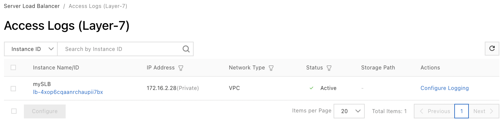{width="4.5in" height="1.11875in"}

-   \`Project\`: this is the project, which allows to group and isolate
    resources,

-   \`LogStore\`: this is a unit of the Log Service,

-   Click on \`OK\`.

{width="3.003954505686789in"
height="2.6952154418197725in"}

If there is no \`LogStore \`available, you have to create a log project
in the Log Service console.

The LogProject project must be in the same region as the CLB instance.

### Search and analyze access logs 

It is possible to search the logs on the following fields:

-   \`body_bytes_sent:\` this is the size of the HTTP body sent back to
    the client (in bytes),

-   \`client_ip:\` this is the IP address of the client,

-   \`host:\` this is the \`host \`header in the request

-   \`http_user_agent:\` this is the \`http_user_agent \`header received
    in the request,

-   \`request_length:\` this is the length of the request including the
    headers,

-   \`request_method:\` this is the method of the request,

-   \`request_time\`: this is the interval between the time the CLB
    instance receives the first request and the time it returns a
    response,

-   \`request_uri:\` this is the URI of the received request,

-   \`slbid:\` this is the ID of the CLB instance,

-   \`status:\` this is the status of the response of the CLB instance,

-   \`upstream_addr:\` this is the IP address and port number of the
    backend server,

-   \`upstream_response_time\`: this is the interval between the time
    the CLB instance sends a request to the backend server and the time
    it sends a response to the client,

-   \`upstream_status\`: this is the status code of the backend server
    response received by the CLB instance.

To search the access logs:

-   Go to the \`Server Load Balancer \`console,

-   Select \`CLB \| Logs,

-   \`Select the type of log (\`Operation Logs\`, \`Access Logs\`,
    \`Health Check Logs\`).

For example, for access logs, click on \`View Logs \`on the line of the
instance.

{width="4.5in"
height="1.1805555555555556in"}

You can also go to the Log Service console:

-   Go to the \`Log Service \`console,

-   Click on the project name,

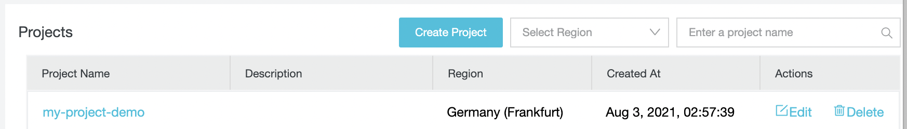{width="4.087933070866142in"
height="0.5854319772528433in"}

-   Click on the \`Logstores \`tab,

-   \`Search Logstores\`: enter the name of the Logstore,

-   Click on the search icon,

{width="0.9793482064741907in"
height="0.5291262029746282in"}

-   Click on the field name or enter a query,

-   Click on \`Search & Analyze.\`

{width="4.5in"
height="2.1680555555555556in"}

### Disable access logs 

To disable access logs:

-   Go to the \`Server Load Balancer \`console,

-   Select \`CLB \| Logs \| Access Logs\`,

-   Select the region,

-   Click on \`Delete \`on the line of the instance,

-   Click on \`OK\`.

## Access control with ACLs 

CLB allows to manage an access control (ACL - Access Control List). To
do this, after configuring an ACL, you can configure rules in the form of
a white list or black list for each listener. Each list includes IP
addresses or CIDR blocks.

It is possible to create several ACLs.

To create an ACL:

-   Go to the \`Server Load Balancer \`console,

-   Select the region,

-   Select \`CLB \| Access Control\`,

-   Click on \`Create Access Control List,

-   Access \`Control List Name: this is the name of the ACL,

-   \`Add Multiple Addresses and Descriptions\`: these are the IP
    addresses,

-   Click on \`Create\`.

{width="2.104265091863517in"
height="2.0026246719160103in"}

To add entries to the ACL:

-   Go to the \`Server Load Balancer \`console,

-   Select the region,

-   Select \`CLB \| Access Control\`,

-   Click on \`Manage \`on the line of the ACL,

{width="2.1192311898512686in"
height="1.0690999562554682in"}

-   Click on \`Add Entry\`,

-   \`IP Address/CIDR Block\`: this\` \`is the IP address or the CIDR
    block,

-   \`Description\`: this is the description,

-   Click on \`Add\`.

{width="2.2610892388451442in"
height="1.4229505686789152in"}

To delete entries:

-   Go to the \`Server Load Balancer \`console,

-   Select the region,

-   Select \`CLB \| Access Control\`,

-   Click on \`Manage \`on the line of the ACL,

-   Click on \`Delete \`on the line of the entry,

-   Click on \`OK\`.

To enable or disable access control:

-   Go to the \`Server Load Balancer \`console,

-   Select the region,

-   Select \`CLB \| Instances\`,\`

-   \`Click on the ID of the CLB instance,

-   Click on the \`Listener \`tab,

-   Click on \`\... \| Set Access Control \`on the line of the listener,

-   \`Enable Access Control\`: enables or disables access control,

-   \`Access Control Method\`: enable access control and select the
    access control method:

```{=html}
<!-- -->
```
-   \`Whitelist\`: only requests from the specified IP addresses or CIDR
    blocks are forwarded,

-   \`Blacklist\`: only requests from specified IP addresses or CIDR
    blocks are not forwarded,

```{=html}
<!-- -->
```
-   \`Access Control List: \`this is the associated ACL,

-   Click on \`OK\`.

{width="2.384896106736658in"
height="1.4743657042869642in"}

When migrating from one ACL to another, it is possible to transfer IP
addresses and CIDR blocks from the old ACL to the new one.

## Traffic monitoring 

Cloud Monitor allows to display traffic information on CLB listeners
such as the number of connections.

To display the monitoring data:

-   Go to the \`Server Load Balancer \`console,

-   Select \`CLB \| Instances\`,

-   Select the region where the CLB instance is located,

-   Click on the monitoring icon on the line of the CLB instance,

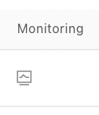{width="0.2926038932633421in"
height="0.33904965004374454in"}

-   Select the metrics to be displayed from the list:

{width="4.405884733158355in"
height="1.7018405511811023in"}

+----------------------+-----------------------------------------------+
| Metric               | Description                                   |
+======================+===============================================+
| \`Traffic\`          | \`Inbound Traffic\`: this is the traffic      |
|                      | consumed by external access                   |
|                      |                                               |
|                      | \`Outbound Traffic\`: this is the traffic     |
|                      | consumed by the CLB instance                  |
+----------------------+-----------------------------------------------+
| \`Packets\`          | \`RX Packets Count\`: this is\` \`the number  |
|                      | of packets received per second                |
|                      |                                               |
|                      | \`TX Packets Count\`: this is\` \`the number  |
|                      | of response packets sent per second           |
+----------------------+-----------------------------------------------+
| \`Concurrent         | \`Active Connections Count\`: this is the     |
| Connections\`        | number of TCP connections established; if     |
|                      | persistent connections are used, a connection |
|                      | can forward several requests at once          |
|                      |                                               |
|                      | \`Inactive Connections Count\`: this is the   |
|                      | number of TCP connections that do not have    |
|                      | the established status (\`netstat -an\`       |
|                      | allows to display active connections)         |
|                      |                                               |
|                      | \`Max Concurrent Connections Count\`: this is |
|                      | the total number of TCP connections.          |
+----------------------+-----------------------------------------------+
| \`New Connections\`  | This is the average number of new TCP         |
|                      | connections established between clients and   |
|                      | the CLB instance                              |
+----------------------+-----------------------------------------------+
| \`Dropped Traffic\`  | \`Dropped Inbound Traffic\`: this is the      |
|                      | amount of inbound traffic dropped per second  |
|                      |                                               |
|                      | \`Dropped Outbound Traffic\`: this is\` \`the |
|                      | amount of outbound traffic dropped per second |
+----------------------+-----------------------------------------------+
| \`Dropped Packets\`  | \`Dropped RX Packets: \`the number of         |
|                      | incoming packets dropped per second           |
|                      |                                               |
|                      | \`Dropped TX Packets\`: the number of         |
|                      | outgoing packets dropped per second           |
+----------------------+-----------------------------------------------+
| \`Dropped            | This is the number of dropped TCP connections |
| Connections\`        | per second                                    |
+----------------------+-----------------------------------------------+

There are also metrics specific to Layer 7 listeners:

  -----------------------------------------------------------------------
  Metric                       Description
  ---------------------------- ------------------------------------------
  \`Layer-7 QPS\`              This is the number of HTTP/HTTPS requests
                               that can be handled per second

  \`Response Time(Listener)\`  This is the average response time of the
                               CLB instance

  \`HTTP Status Code           This is the average number of HTTP
  2XX/3XX/4XX/5XX/Other HTTP   response codes generated by the listener
  Status Code (Listener)\`     

  \`HTTP Status Code 4xx/5xx   This is the average number of HTTP
  (Server)\`                   response codes generated by the backend
                               server

  \`Response Time (Server)\`   This is the average response time of the
                               backend server
  -----------------------------------------------------------------------

Deleting a listener will delete the corresponding alarm rules.

To set up alarm rules:

-   Go to the \`Server Load Balancer \`console,

-   Select the region where the CLB instance is located,

-   Click on the monitoring icon on the line of the instance,

-   Click on \`Threshold Alerting Settings\`,

-   Click on \`Create Alarm Rule\`,

-   Configuring the alarm rule.

## The API Inspector 

API Inspector converts and displays each operation on the console into
API calls in different languages.

Cloud Shell and API Explorer allow to debug the generated code.

To activate \`API Inspector\`:

-   Go to the \`Server Load Balancer \`console,

-   Click on \`Overview\`,

-   Click on \`API Overview\`.

{width="4.5in"
height="1.9395833333333334in"}

To debug online or with the API Explorer, click on \`Online Debug.

\`To debug with Cloud Shell, click on \`Online Linux Shell\`.

## Optimization 

In this section, we will study three optimization techniques:

-   Multi-zone deployment to improve availability,

-   Cross-region load balancing to improve fault tolerance,

-   Anti-DDoS Basic to improve security.

### Improve availability with multi-zone deployment 

To improve availability, CLB instances can be created in multiple zones
within a region. When the data center of a zone fails, CLB automatically
switches to the backup data center in less than 30 seconds. This
requires an instance in each of these zones.

ECS instances associated with a CLB instance must be in the same region
but may be in different areas.

Furthermore, ECS instances and CLB instances are deployed in different
clusters, so that a failure of ECS instances does not induce a failure
of CLB instances.

There is a list of available primary zone/backup zone associations. This
is available on the Alibaba Cloud website but can also be obtained with
the \`DescribeZones \`API.

### Improve fault tolerance with cross-region load balancing 

While SLB provides load balancing of server groups in the same region,
Global Traffic Management provides load balancing of server groups that
are in different regions using DNS resolution. This allows for
inter-regional disaster tolerance and faster access from different
regions.

To create a Global Traffic Manager instance:

-   Go to the \`Alibaba Cloud DNS \`console,

-   Click on \`Global Traffic Manager\`,

-   Click on \`Create Instance\`,

{width="4.5in" height="1.6388888888888888in"}

-   Select the version, quantity and duration of service,

-   Click on \`Buy Now\`.

{width="4.5in"
height="3.2263888888888888in"}

An access domain name of type CNAME is then automatically allocated.

To test the proper functioning of Global Traffic Manager, simply remove
all ECS instances from a region. The SLB service will then become
unavailable and the switchover should take place within 3 minutes.

The configuration of the Global Traffic Manager instance is not covered
in this book.

### Improve security with Anti-DDoS Basic 

The SLB console displays the thresholds used for safety.

SLB benefits from Anti-DDoS Basic, which provides protection up to 5
Gbps.

Traffic from the Internet passes through Alibaba Cloud Security before
reaching the SLB instances.

Anti-DDoS Basic filters out common DDoS attacks and protects SLB
instances from attacks such as SYN flood, UDP flood, ACK flood, ICMP flood
and DNS Query flood. To do this, it uses two thresholds:

-   Scrubbing threshold: When the attack exceeds the scrubbing threshold
    or matches a certain attack pattern, Alibaba Cloud Security filters
    packets, limits the traffic flow and limits the packet speed. This
    threshold is defined based on the bandwidth of the SLB instance.

-   Blackholing threshold: When the attack exceeds the blackholing
    threshold, all incoming packets are dropped. This threshold is
    defined from the user\'s security credit score. This score is
    calculated from your attack history, your purchases, your account
    activity, your security level, etc \... This score is specific to
    each region.

To display the thresholds of an SLB instance:

-   Go to the \`Server Load Balancer \`console,

-   Select the region,

-   Move the mouse over the green DDoS icon on the line of the instance
    to the right of the instance ID,

{width="3.490812554680665in"
height="1.6473622047244094in"}

When the incoming traffic exceeds the \`Traffic Scrubbing Threshold
(bits/s)\`, scrubbing is triggered.

When incoming packets exceed the \`Traffic Scrubbing Threshold
(packets/s)\`, scrubbing is triggered.

When the incoming traffic exceeds the \`Blackholing Threshold\`,
blackholing is triggered.

# ALB 

ALB (Application Load Balancer) is a load balancer operating at the
application layer and supporting HTTP, HTTPS and QUIC (Quick UDP
Internet Connections).

A VIP is a private IP address belonging to a VPC. ALB VIPs are used to
receive requests.

An ALB instance offers two IP modes: static mode and dynamic mode.

The listener allows to check the connection requests. It can be of type
HTTP or HTTPS. There is also another type of listener, QUIC, which
allows an encrypted connection to transmit QUIC requests. QUIC is an
improved secure protocol similar to TLS/SSL.

You can define forwarding rules in listeners to define how requests are
routed to the backend servers of a server group.

ALB instances can be protected against accidental deletion.

Different types of certificates are supported: those from the SSL
Certificates service, CA certificates or server certificates issued by a
third party.

The backend server groups are the ECS instances that receive the client
requests redistributed by the ALB instance.

The security is ensured by ACLs that allow to manage white and black
lists.

Health Checks are used to monitor the conditions of server groups. You
can create HTTP or HTTPS Health Checks.

The TLS security policy allows to specify the supported versions of TLS
as well as the supported encryption algorithms.

## Introduction to ALB 

ALB instances can be Internet and internally oriented.

Internet-facing ALB instances use EIPs and EIP bandwidth plans. EIP
bandwidth plans allow sharing and transferring bandwidth of resources in
the same region. The advantage is to reduce Internet bandwidth costs.
Billing can be done by bandwidth (pay-by-bandwidth) or by the enhanced
95th percentile. A domain name on the Internet can be resolved to an EIP
or to a canonical domain name on the ALB via the CNAME.

An Internet-facing ALB instance can have several EIPs in different
zones. This ensures high availability.

A VIP is a private IP address belonging to a VPC. ALB VIPs are used to
receive requests.

The components of an ALB instance are:

-   The ALB instance provides the load balancing service at Layer 7.
    Incoming traffic is distributed over multiple backend servers. The
    benefit is increased throughput and application availability.

-   Listeners are protocol and port specific. Each ALB instance must
    have at least one listener.

-   The forwarding rules indicate how the ALB instance distributes
    requests to the backend servers of the server groups. It is possible
    to specify cookie, HTTP header and host conditions.

-   Server groups are groups of backend servers. These backend servers
    can be ECS (Elastic Compute Service), ECI (Elastic Container
    Instances) or ENI (Elastic Network Interfaces) instances. An ECS
    instance can be a backend server. A group of servers can be
    associated with several ALB instances. The maximum is 1000 backend
    servers per server group.

-   The Health Check is a Health Check on ECS instances to verify the
    availability of the backend servers. The ALB instance checks the
    health of these backend servers. If a Health Check fails, the ALB
    instance does not forward any more requests to this backend server
    until this server is declared healthy again.

There are two editions of ALB instances:

-   Basic ALB instances (Basic Edition),

-   Standard ALB instances (Standard Edition).

The Basic edition does not support the following features:

-   rewriting, redirecting or resending a fixed response,

-   cookie-based routing,

-   routing based on HTTP methods,

-   routing based on request strings,

-   end-to-end transmission via HTTPS,

-   the custom TLS cipher suite.

## Creation of an ALB instance 

The ALB instance and the backend servers (e.g. ECS instances) must be
deployed in the same region.

To ensure high availability, it is recommended to select at least two
zones.

The IP mode offers two modes:

-   Static IP,

-   Dynamic IP.

With the static IP address, each zone can only have one IP address. It
cannot be changed. The limit is 100 000 QPS (query per second).

With the dynamic IP address, each zone can offer several dynamic IP
addresses.

Internet-oriented instances have a public IP address. This allows access
to the ALB instance via the Internet. To access the Internet, the
Internet-oriented ALB instances use EIPs.

Intranet-oriented instances have a private IP address. The ALB instance
can only be accessed from the Alibaba Cloud network.

At least one ECS instance is running in each zone. ECS instances are
added to a security group that allows access to port 80 or port 443 via
HTTP or HTTPS.

The server group is used to process the requests received by the ALB
instance.

If the result of the Health Check of the ALB instance is \"healthy\", it
means that the ECS backend instances are ready to process the requests
distributed by the ALB instance.

To create an Internet-facing ALB instance:

-   Go to the \`SLB \`console,

-   Click on \`ALB \| Instances\`,

-   Click on \`Create ALB Instance\`,

-   \`Region\`: this is the region in which the instance will be
    located,

-   \`VPC\`: this is the VPC in which to create the instance,

-   \`Area\`: these are the areas of the specified region,

-   \`IP mode\`: this is the IP mode (\`Static IP \`or \`Dynamic IP\`),

-   \`Edition\`: this\` \`is the edition (\`Basic \`or \`Standard\`),

-   \`Network Type\`: this is the type of ALB instance (\`Internet \`for
    Internet oriented and \`Internal \`for internally oriented),

-   \`Billing Method\`: this is\` \`the billing method,

When \`Network Type \`is \`Internet\`, the possible values are
\`Pay-by-Data-Transfer\`, \`Pay-by-Bandwidth \`and
\`Pay-by-Classic-95th-Percentile-Bandwidth\`.

-   \`Instance Name\`: this is the name of the ALB instance,

-   \`Resource Group\`: this is the resource group to which the instance
    belongs,

-   Click on \`Buy Now\`,

-   Click on \`Activate Now\`.

{width="4.5in" height="4.11875in"}

To allow ALB to access your cloud resources, you must first create a
role related to the service. If you have not already done so, you must
click on the \`Create \`button:

{width="4.5in" height="0.4076388888888889in"}

To configure a listener:

-   Go to the \`SLB \`console,

-   Click on \`ALB \| Instances\`,

-   Click on the instance ID,

{width="4.5in" height="0.9104166666666667in"}

-   Click on \`Create Listener \`on the line of the instance,

-   \`Listener Protocol\`: this is the listener protocol,

-   \`Listening Port\`: this is the listening port of the ALB instance,

In general, port 80 is used for HTTP and port 443 for HTTPS. Valid
values range from 1 to 65535.

-   \`Listener Name\`: this is\` \`the name of the listener,

-   Click on \`Modify \`next to \`Advanced Settings\`,

-   \`Enable HTTP/2 \`(if \`HTTPS \`is selected for \`Listener
    Protocol\`): indicates whether HTTP/2 is enabled for the front-end
    protocol used by the ALB instance,

-   \`Idle Connection Timeout Period \`(except for HTTP/2): this is the
    timeout period for inactive connections (from 1 to 60 in seconds);
    after the timeout period, the ALB instance closes the connection,

-   \`Connection Request Timeout Period\`: this is\` \`the time the
    request is waiting for (between 1 and 180 seconds),

After the timeout, the ALB instance returns a HTTP 504 error to the
client.

-   \`Gzip Compression\`: indicates whether Gzip compression is enabled,

-   \`Add HTTP Header Fields\`: these are the added HTTP header fields:

```{=html}
<!-- -->
```
-   \`X-Forwarded-For \`(for HTTP and HTTPS): retrieves the real IP
    address of the client,

-   \`SLB-ID:\` retrieves the ID of the ALB instance,

-   \`X-Forwarded-Proto\`: retrieves the listening protocol of the ALB
    instance,

-   \`X-Forwarded-Clientcert-subjectdn \`(for HTTPS): retrieves
    information about the owner of the client certificate,

-   \`X-Forwarded-Clientcert-issuerdn \`(for HTTPS): retrieves
    information about the authority that issues the client\'s
    certificate,

-   \`X-Forwarded-Clientcert-fingerprint \`(for HTTPS): retrieves the
    digital fingerprint of the client certificate,

-   \`X-Forwarded-Clientcert-clientverify \`(for HTTPS): retrieves the
    result of the client certificate verification,

-   \`X-Forwarded-Port\`: retrieves the listening ports of the ALB
    instance,

-   \`X-Forwarded-Client-Port \`(for HTTP and HTTPS): retrieves the port
    used by the client,

```{=html}
<!-- -->
```
-   Click on \`Next\`.

{width="3.3722200349956255in"
height="4.385964566929134in"}

Configure an SSL certificate:

-   Click on the\` Modify\` button next to\` Advanced Settings\`,\`

-   Server Certificate\`: this is the server certificate,

-   \`TLS Security Policy\`: this is the TLS security policy,

The TLS security policy contains the TLS protocols and 0.d cipher suites
available for HTTPS listeners.

-   Click on \`Next\`.

{width="2.5107753718285215in"
height="2.1062620297462815in"}

Select a server group for the HTTPS listener:

-   Select a server group,

-   Click on \`Next\`,

-   Click on \`Submit\`,

-   Click on \`OK\`.

## Changing the zones of an ALB instance 

You can enable or disable fields in an ALB instance:

-   Go to the \`SLB \`console,

-   Click on \`ALB \| Instances\`,

-   Click on \`Modify Zone/Subnet\` in the instance line,

{width="4.5in" height="1.0090277777777779in"}

-   Check the areas,

-   Click on \`OK\`.

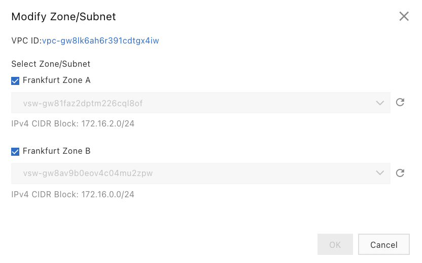{width="2.5302777777777776in"
height="1.5814238845144357in"}

## Configuration of the protection against deletion 

You can activate or deactivate the protection against deletion of ALB
instances. This protection protects against accidental deletion of ALB
instances.

To configure deletion protection:

-   Go to the \`SLB \`console,

-   Click on \`ALB \| Instances\`,

-   Click on the instance ID,

-   Click on the \`Instance Details \`tab,

{width="4.5in"
height="2.598611111111111in"}

-   Click on \`Enable Deletion Protection\`.

{width="1.4872025371828521in"
height="0.2952930883639545in"}

## Adding tags 

You can use tags to classify ALB instances. Each ALB instance can have
several tags.

To add tags:

-   Go to the \`SLB \`console,

-   Click on \`ALB \| Instances\`,

-   Click on the tag icon in the \`Tag \`column,

{width="0.21613298337707787in"
height="0.42221456692913384in"}

-   Click on \`Add\`,

-   \`Tag Key\`: this is the key,

-   \`Tag Value\`: this is the value of each tag,

-   Click on \`OK\`.

{width="2.774708005249344in"
height="2.467262685914261in"}

## The Listeners 

### Add a HTTP listener 

A HTTP listener is used to check connection requests. It can be
configured when the ALB instance is created or afterwards.

HTTP listeners are used for example for web applications or mobile
games.

To add a HTTP listener to an ALB instance:

-   Go to the \`SLB \`console,

-   Click on \`ALB \| Instances\`,

-   Click on \`Create Listener \`on the line of the instance,

-   \`Listener Protocol\`: this is\` \`the protocol used for the
    listener (here \`HTTP\`),

-   \`Listener Port\`: this is\` \`the listening port of the ALB
    instance,

-   \`Listener Name\`: this is\` \`the name of the listener,

-   \`Idle Connection Timeout Period\`: this is\` \`the timeout period
    for inactive connections (from 1 to 60 seconds),

-   \`Connection Request Timeout Period\`: this is\` \`the time the
    request is waiting for (from 1 to 180 seconds),

-   \`Gzip Compression\`: indicates whether Gzip compression is enabled
    or not,

-   \`Add HTTP Header Fields:\` these are the added HTTP headers:

```{=html}
<!-- -->
```
-   \`X-Forwarded-For\`: retrieves the real IP address of the client,

-   \`SLB-ID:\` retrieves the ID of the ALB instance,

-   \`X-Forwarded-Proto\`: retrieves the listening protocol used by the
    ALB instance,

-   \`X-Forwarded-Port\`: retrieves the listening port of the ALB
    instance,

-   \`X-Forwarded-Client-Port:\` retrieves the port used by the client,

```{=html}
<!-- -->
```
-   Click on \`Next\`,

{width="2.6149278215223095in"
height="3.7944706911636046in"}

-   Select a server group,

-   Check the selected backend servers,

-   Click on \`Next\`,

-   Click on \`Submit\`.

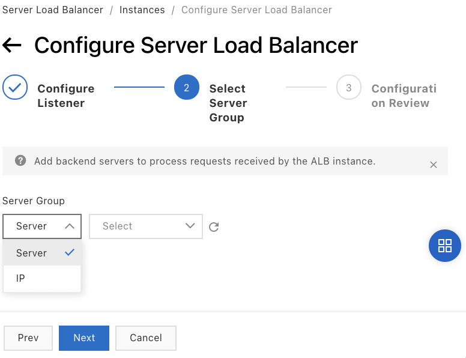{width="2.2558639545056867in"
height="1.7326290463692038in"}

### Add a HTTPS listener 

Use HTTPS listeners for encrypted connections.

To configure a HTTPS listener on an ALB instance:

-   Go to the \`SLB \`console,

-   Click on \`ALB \| Instances\`,

-   Click on \`Create Listener \`on the line of the instance,

-   \`Listener Protocol\`: this is\` \`the listener protocol,

-   \`Listening Port\`: this is\` \`the listening port of the ALB
    instance (usually port 80 for HTTP and port 443 for HTTPS); valid
    values range from 1 to 65535,

-   \`Listener Name\`: this is\` \`the name of the listener,

-   Click on \`Modify \`next to \`Advanced Settings\`,

-   \`Enable HTTP/2\`: indicates whether HTTP/2 is enabled for the
    front-end protocol used by the ALB instance,

-   \`Idle Connection Timeout Period \`(except for HTTP/2): this is the
    timeout period for inactive connections (from 1 to 60 in seconds);
    after the timeout period, the ALB instance closes the connection,

-   \`Connection Request Timeout Period\`: this is\` \`the time the
    request will take (between 1 and 180 seconds); after the timeout
    period, the ALB instance returns a HTTP 504 error to the client,

-   \`Gzip Compression\`: indicates whether Gzip compression is enabled,

-   \`Add HTTP Header Fields:\` these are the added HTTP header fields:

```{=html}
<!-- -->
```
-   \`X-Forwarded-For\`: retrieves the real IP address of the client,

-   \`SLB-ID:\` retrieves the ID of the ALB instance,

-   \`X-Forwarded-Proto\`: retrieves the listening protocol of the ALB
    instance,

-   \`X-Forwarded-Clientcert-subjectdn\`: retrieves information about
    the owner of the client certificate,

-   \`X-Forwarded-Clientcert-issuerdn\`: retrieves information about the
    authority that issues the client\'s certificate,

-   \`X-Forwarded-Clientcert-fingerprint\`: retrieves the digital
    fingerprint of the client certificate,

-   \`X-Forwarded-Clientcert-clientverify:\` retrieves the result of the
    client certificate verification,

-   \`X-Forwarded-Port\`: retrieves the listening ports of the ALB
    instance,

-   \`X-Forwarded-Client-Port:\` retrieves the port used by the client,

```{=html}
<!-- -->
```
-   \`QUIC Update\`: indicates whether the QUIC update feature is
    enabled,

-   \`Associate QUIC Listener \`(if \`QUIC Update \`is activated): this
    is the QUIC listener to associate with the ALB instance,

-   Click on \`Next\`,

{width="2.467528433945757in"
height="4.031818678915136in"}

-   Click on\` Modify\` next to\` Advanced Settings,

-   Server certificate\`: this is the server certificate; it is also
    possible to buy one by clicking on \`Buy Certificate \`in the list,

This is the certificate that is used to identify the server. It must be
uploaded to the ALB instance.

-   \`TLS security policy\`: this is\` \`the TLS security policy,

It contains the TLS protocol versions and cipher suites available for
HTTPS listeners. It is necessary for mutual and one-way authentication.

-   Click on \`Next\`,

{width="2.641854768153981in"
height="2.594154636920385in"}

-   Enable mutual authentication,

-   Select an uploaded CA certificate or purchase one by clicking on
    \`Purchase a CA certificate\`,

-   Click on \`Next\`.

-   Select a server group from the drop-down list,

-   Click on \`Next\`,

-   Click on \`Submit\`.

To create a HTTPS listener, it is necessary to configure an SSL
certificate. There are different types of certificates:

-   \`Server certificate\`,

-   \`Client certificate\`,

-   \`CA certificate\`.

\`Server certificate \`is the certificate that is used to identify the
server. The browser uses it to verify that the certificate sent by the
server is signed and issued by a trusted certificate authority (CA). It
must be uploaded to the ALB instance.

\`Client certificate \`is the certificate used to identify the client.
The server identifies the client by verifying the certificate sent by
the client. For mutual authentication, it must be installed on the
client. It is not required for one-way authentication.

\`CA certificate \`is the certificate used by the server to verify the
signature of the client certificate. If the signature is not valid, the
connection request is denied. For mutual authentication it must be
installed on the ALB instance. It is not necessary for one-way
authentication.

### Add a QUIC listener 

A QUIC listener uses an encrypted connection to transmit QUIC requests.

QUIC (Quick UDP Internet Connections) is a secure protocol used for
communication between clients and CDN nodes. It is also used to speed up
the delivery of content.

To configure a QUIC listener:

-   Go to the \`SLB \`console,

-   Click on \`ALB \| Instances\`,

-   Click on \`Create Listener \`on the line of the instance,

-   \`Listener Protocol\`: this is\` \`the protocol used for the
    listener (\`QUIC \`here),

-   \`Listener Port\`: this is the listening port of the ALB instance,

-   \`Listener Name\`: this is\` \`the name of the listener,

-   \`Connection Request Timeout Period\`: this is\` \`the time the
    request is waiting for (from 1 to 180 seconds),

-   \`Gzip Compression\`: indicates whether Gzip compression is enabled
    or not,

-   \`Add HTTP Header Fields:\` these are the added HTTP headers:

```{=html}
<!-- -->
```
-   \`SLB-ID:\` retrieves the ID of the ALB instance,

-   \`X-Forwarded-Proto\`: retrieves the listening protocol used by the
    ALB instance,

-   \`X-Forwarded-Port\`: retrieves the listening port of the ALB
    instance,

```{=html}
<!-- -->
```
-   Click on \`Next\`,

{width="3.040520559930009in"
height="4.224352580927384in"}

-   \`Server Certificate\`: this is the SSL server certificate,

The ALB instance uses this certificate to decrypt a client\'s requests
after closing the connection with the client.

-   Click on \`Next\`,

{width="1.980851924759405in"
height="1.249037620297463in"}

-   Select a server group,

-   Click on \`Next\`,

-   Click on \`Submit\`.

## The Forward rules 

### Manage forward rules for listeners 

Forwarding rules for listeners define how requests are routed to the
backend servers of a server group.

These rules are inbound or outbound and include conditions and actions.

Incoming rules define the conditions and incoming actions.

Outbound rules define inbound and outbound conditions and outbound
actions.

The operation is as follows:

-   The client sends a request to the ALB instance.

-   The ALB instance forwards this request to a backend server according
    to the incoming forwarding rule configured for the ALB instance.

-   The backend server returns the response to the client based on the
    outbound transfer rule configured for the ALB instance.

A forward rule must have at least one \`Forward\`, \`Redirect \`or
\`Return Fixed Responses \`action.

\`Inbound \`conditions can be: \`Domain Name\`, \`Path\`, \`HTTP
Header\`, \`Query String\`, \`HTTP Request Method\`, \`Cookie \`and
\`Source IP Address\`.

Incoming actions can be: \`Forward\`, \`Redirect\`, \`Return Fixed
Responses\`, \`Rewrite\`, \`Add Header\`, \`Remove Header\`, \`Throttle
Traffic \`and \`Mirror Traffic\`.

Outgoing conditions can be: \`Response Status Code \`and \`Response
Header\`.

The outgoing actions can be: \`Add Header \`and \`Remove Header\`.

### Create a forward rule 

A default forward rule can be created when the listener is created or
afterwards with custom forward rules.

A rule looks like this:

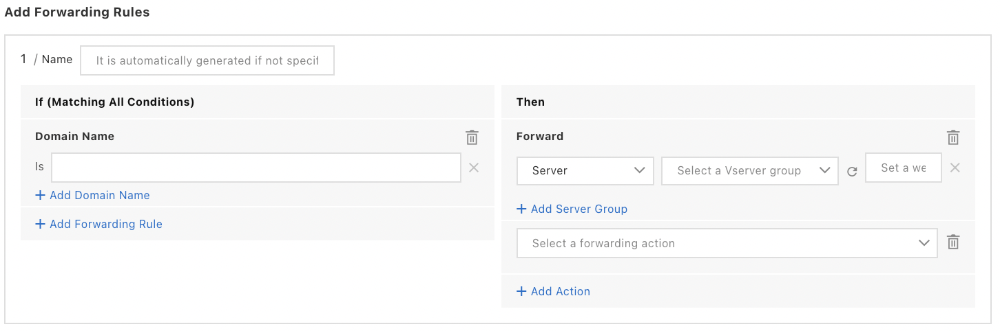{width="4.5in" height="1.49375in"}

To create a forward rule:

-   Go to the \`SLB \`console,

-   Click on \`ALB \| Instances\`,

-   Click on the instance ID,

-   Click on the \`Listener \`tab,

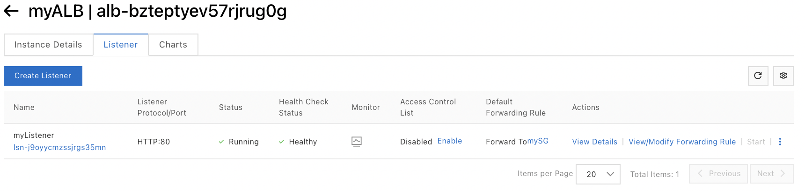{width="4.5in" height="1.0729166666666667in"}

-   Click \`View/Modify Forwarding Rule \`on the line of the listener,

{width="3.2666754155730535in"
height="0.736010498687664in"}

-   Select \`Inbound Forwarding Rules \`or \`Outbound Forwarding
    Rules\`,

-   Click on \`Add New Rule\`,

{width="4.5in"
height="2.0069444444444446in"}

-   \`Name\`: this is\` \`the name of the forward rule,

-   \`If (Matching All Conditions):\` select the arrival condition used:

```{=html}
<!-- -->
```
-   \`Domain Name: \`these are the domain names (supports \`\* \`and \`?
    \`),

-   \`Path\`: this is the path,

-   \`HTTP Header:\` these are the http headers,

The name appears in the \`Key \`field and the value in the \`Value
\`field.

-   \`Query String\`: these are the strings of queries in the form of
    key-value pairs,

-   \`HTTP Request Method: \`these are the HTTP request methods,

-   \`Cookie\`: these are the cookies,

-   \`Source IP Address: \`these are the IP addresses or CIDR blocks,

{width="2.2796062992125985in"
height="1.3899256342957131in"}

-   \`Then:\` this is the outgoing condition:

```{=html}
<!-- -->
```
-   \`Response Status Code\`: this is\` \`the HTTP status code of the
    response to the client,

Valid values range from 100 to 599. It is possible to specify value
ranges in the form \"200-204\".

-   \`Response Header:\` these are the HTTP headers of the response,

The name of the header appears in the \`Key \`field and its content in
the \`Value \`field.

{width="1.9652077865266842in"
height="0.9826049868766404in"}

-   \`+ Add Action\`: these are the actions associated with each
    condition:

```{=html}
<!-- -->
```
-   \`Forward\`: adds server groups using the list,

You can enable session persistence for these server groups.

-   \`Redirect\`: select the protocol in the Protocol list and then
    select a status code in the \`Status Code \`list; enter the domain
    \`name\`, \`port \`and \`path\` of the destination to which to
    forward the requests; enter a \`query\` string,

-   \`Return Fixed Responses\`: enter the HTTP status code in \`Status
    Code\`; select a \`Response \`Content Type and then enter the
    \`Response\` Content,

-   \`Rewrite\`: enter the \`Domain\` Name and \`Path \`of the
    destination to which you want to direct your requests, then enter a
    string in the \`Query \`field,

-   \`Add Header\`: enter the name and content of the header to add to
    the query; this header replaces the existing headers in the query,

-   \`Remove Header:\` enter the content of the header to be deleted,

-   \`Throttle Traffic\`: enter the maximum number of requests per
    second (from 1 to 100000),

Once the limit is reached, new connection requests are dropped.

-   \`Mirror Traffic\`: select the server group,

{width="2.2686581364829395in"
height="0.4372769028871391in"}

-   Click on \`OK\`.

ALB Basic Edition instances only support \`Forward \`and \`Add Header
\`actions.

An \"or\" is applied between the values of a condition.

A logical \"and\" is applied between the conditions.

### Modify a forward rule 

To change a forward rule:

-   Go to the \`SLB \`console,

-   Click on \`ALB \| Instances\`,

-   Click on the instance ID,

-   Click on the \`Listener \`tab,

-   Click \`View/Modify Forwarding Rule \`on the line of the instance,

-   Click on the \`Forwarding Rules \`tab,

-   Select \`Inbound Forwarding Rules \`or \`Outbound Forwarding
    Rules\`,

-   Click on the pen icon (edit) to the right of the rule to be
    modified,

-   Click on \`Save\`.

{width="4.5in" height="0.5430555555555555in"}

### Change the priority of a forward rule 

Forward rules are evaluated in order of priority. A lower number
indicates a higher priority. The priority of the default forward rule
cannot be changed.

To change the priority of a forward rule:

-   Go to the \`SLB \`console,

-   Click on \`ALB \| Instances\`,

-   Click on the instance ID,

-   Click on the \`Listener \`tab,

-   Click \`View/Modify Forwarding Rule \`on the line of the listener,

-   Click on the \`Forwarding Rules \`tab,

-   Select \`Inbound Forwarding Rules \`or \`Outbound Forwarding
    Rules\`,

-   Move the position of the rule,

-   Click \`Save Priority Changes\`.

### Delete a forward rule 

The default forwarding rule of a listener cannot be deleted.

Deleting a listener deletes all forward rules for that listener.

To remove custom transfer rules from a listener:

-   Go to the \`SLB \`console,

-   Click on \`ALB \| Instances\`,

-   Click on the instance ID,

-   Click on the \`Listener \`tab,

-   Click \`View/Modify Forwarding Rule \`on the line of the listener,

-   Click on the \`Forwarding Rules \`tab,

-   Select \`Inbound Forwarding Rules \`or \`Outbound Forwarding
    Rules\`,

-   Click on the trash can icon to the right of the rule,

-   Click on \`OK\`.

{width="4.5in" height="0.5430555555555555in"}

## Management of the Certificates

To configure an ALB listener, you can:

-   use a certificate from the \`SSL Certificates \`service,

-   upload a server certificate issued by a third party,

-   upload the certificate authority (CA).

ALB supports:

-   one-way authentication:

```{=html}
<!-- -->
```
-   The client verifies the identity of the server.

-   The reverse is not true: the server does not verify the identity of
    the client.

-   A server certificate must be associated with HTTPS listeners and
    QUIC listeners.

```{=html}
<!-- -->
```
-   mutual authentication:

```{=html}
<!-- -->
```
-   The client verifies the identity of the server and the server
    verifies the identity of the client.

-   A CA certificate and a server certificate must be associated with
    the listener to verify the identity of the client.

-   This authentication method does not support QUIC listeners.

To manage certificates in an ALB instance:

-   Go to the \`SLB \`console,

-   Click on \`ALB \| Instances\`,

-   Click on the instance ID,

-   Click on the \`Listener \`tab,

-   Click \`Manage Certificate \`on the line of the listener,

-   Click on the \`Certificates \`tab,

-   Click on the \`Server Certificates \`or \`CA Certificates \`tab,

-   Click on \`Change \`on the certificate line,

-   Select a server certificate from the list or purchase one.

To add a certificate to associate with the listener:

-   Go to the \`SLB \`console,

-   Click on \`ALB \| Instances\`,

-   Click on the instance ID,

-   Click on the \`Listener \`tab,

-   Click \`Manage Certificate \`on the line of the listener,

-   Click on the \`Server Certificates \`tab,

-   Click on \`Add Extended Validation Certificate\`,

-   Click on the \`CA Certificates \`tab,

-   Enable or disable \`Mutual Authentication\`.

If you are using mutual authentication, a CA certificate must be
purchased the first time a listener is activated.

To avoid service interruptions, it is recommended to replace a
certificate before it expires.

## The backend server groups 

The ALB instance distributes requests received from clients to the
backend servers specified in the server groups.

This distribution depends on the conditions defined in the forward rule.
This rule defines the conditions, the groups of recipient servers and
the associated ports.

ALB creates a server group with ECS instances deployed in different
zones and defines a virtual IP address for this group, which ensures
high performance and high availability.

It is possible to create several server groups to handle different types
of requests.

You can configure Health Check for each server group added to an ALB
instance. By default, Health Check is enabled for all server groups.

ALB continuously monitors the conditions of all backend servers in the
server group.

### Manage server groups 

An ALB instance needs a server group containing backend servers.

The ALB instance distributes client requests to the backend servers
using the protocols and ports specified for the server group by default.

To create a listener or add a forward rule to a listener, a server group
must be specified.

### Create a server group 

The servers must be in the same VPC as the server group.

To create a server group:

-   Go to the \`SLB \`console,

-   Click on \`ALB \| Server Groups\`,

-   Click on \`Create Server Group\`,

-   \`Server Group Type\`: this is the type of server group (\`Instance
    \`or \`IP\`),

-   \`Server Group Name\`: this is\` \`the name of the server group,

-   \`VPC\`: this is the VPC,

-   \`Backend Server Protocol\`: this is the backend protocol:

```{=html}
<!-- -->
```
-   \`HTTP (default)\`: these backend servers can be associated with
    HTTPS, HTTP and QUIC listeners,

-   \`HTTPS\`: these backend servers can be associated with HTTPS
    listeners,

```{=html}
<!-- -->
```
-   \`Scheduling Algorithm\`: this\` \`is the scheduling algorithm:

```{=html}
<!-- -->
```
-   \`Weighted Round-Robin\`: backend servers with a higher weight
    receive more requests than those with a lower weight,

-   \`Weighted Least Connections\`: backend servers with the fewest
    active connections,

-   \`Source IP Consistent Hashing\`: requests from the same source IP
    address are distributed to the same backend server,

```{=html}
<!-- -->
```
-   \`Resource Group\`: this is\` \`the resource group to which the ALB
    instance belongs,

-   \`Session Persistence\`: the listener forwards requests from the
    same client to a specific backend server,

-   \`Cookie Persistence \`(if \`Session Persistence \`is enabled): this
    is the method of managing the cookie:

```{=html}
<!-- -->
```
-   \`Insert Cookie\`: the ALB instance inserts a cookie (\`SERVERID\`)
    in the first response sent to the client; subsequent requests
    contain the cookie; the listener then delivers the request to the
    specified backend server,

-   \`Rewrite Cookie\`: when ALB detects an user-defined cookie, the ALB
    instance rewrites the original cookie with the user-defined cookie;
    subsequent requests contain the user-defined cookie; the listener
    delivers the request to the specified backend server,

```{=html}
<!-- -->
```
-   \`Session Persistence Timeout Period \`(if \`Session Persistence
    \`is enabled): this is the session persistence timeout (from 1 to
    86400 seconds),

-   \`Configure Health Check\`: enables or disables Health Checks,

-   \`Select and Load Health Check\`: select and load a Health Check;
    the Health Check can be associated with a server group or a listener
    once created,

-   \`Protocol \`(of the Health Check) (only for HTTP): this is the
    protocol of the Health Check:

```{=html}
<!-- -->
```
-   \`HTTP\`: simulates a Web browser accessing resources of the
    instance with \`HEAD \`or \`GET \`requests; allows to check if the
    instance is healthy,

-   \`TCP\`: sends SYN handshake packets to the instance to check if the
    instance is healthy,

```{=html}
<!-- -->
```
-   \`Health Check Method \`(if \`Protocol \`is on \`HTTP\`): this is
    the method used for the \`HTTP Health Check\`; valid values are
    \`HEAD \`and \`GET\`):

```{=html}
<!-- -->
```
-   \`HEAD \`(default): backend servers must support \`HEAD \`requests;
    if not, the \`GET \`method must be used,

-   \`GET\`: if the size of the request exceeds 8 Kb, the request is
    truncated; however, this does not affect the result of the Health
    Check,

```{=html}
<!-- -->
```
-   \`Protocol \`(if \`Protocol \`of the Health Check is \`HTTP\`): this
    is the version of the HTTP protocol; valid values are \`HTTP1.0
    \`and \`HTTP1.1\`,

-   \`Port\`: this is the port used by the Health Check:

```{=html}
<!-- -->
```
-   \`Backend Server Port \`(default): this is the port used by the
    backend servers for the Health Check,

-   \`Custom Port\`: this is\` \`the port used for the Health Check;
    valid values are from 1 to 65535,

```{=html}
<!-- -->
```
-   \`Path\`: this is the URL of the Health Check page,

-   \`Health Check Domain Name\`: this is\` \`the domain name used for
    Health Check:

```{=html}
<!-- -->
```
-   \`Backend Server Internal IP \`(default): uses the private IP
    addresses of the backend servers as domain names for the Health
    Checks,

-   \`Custom Domain Name\`: this is\` \`the domain name used for the
    Health Check,

```{=html}
<!-- -->
```
-   \`Normal Status Codes \`(if Health Check \`Protocol \`is on
    \`HTTP\`): these are the HTTP status codes indicating that the
    Health Check is normal; valid values are \`http_2xx \`(default),
    \`http_3xx\`, \`http_4xx \`and \`http_5xx\`,

-   \`Response Timeout Period\`: this is the amount of time to wait for
    a response to the Health Check (default is 5 seconds); if this time
    is exceeded, the Health Check will fail; valid values range from 1
    to 300 seconds,

-   \`Health Check Interval\`: this is the interval between two
    consecutive Health Checks (2 seconds by default); valid values range
    from 1 to 50 seconds,

-   \`Healthy Threshold\`: this is\` \`the number of successful Health
    Checks (3 by default) required for an unhealthy backend server to
    become healthy again; valid values range from 2 to 10,

-   \`Unhealthy Threshold\`: this is the number of failed Health Checks
    (2 by default) required for a healthy backend server to become
    unhealthy; valid values range from 2 to 10,

-   To save the Health Check configuration as a template, check \`Save
    Configuration as Template\`,

-   Click on \`Create\`.

{width="2.5634765966754154in"
height="3.242322834645669in"}

{width="2.522595144356955in"
height="2.90799321959755in"}

{width="2.2967038495188103in"
height="1.699844706911636in"}

-   

+-----------------------------------------------------------------------+
| {width="2.5259076990376204in"   |
| height="3.194805336832896in"}                                         |
|                                                                       |
| {width="2.4446872265966753in"   |
| height="2.8181824146981627in"}                                        |
|                                                                       |
| {width="2.2744488188976377in"   |
| height="1.6833727034120736in"}                                        |
|                                                                       |
| -                                                                     |
+=======================================================================+
+-----------------------------------------------------------------------+

### Add backend servers 

The default weight is 100. The higher the weight, the more requests the
server receives.

If session persistence is enabled, requests may not be distributed
evenly among the backend servers.

To stop a server from receiving requests, set a weight of 0.

To add backend servers to a server group:

-   Go to the \`SLB \`console,

-   Click on \`ALB \| Server Groups\`,

-   Click on \`Modify Backend Server \`on the line of the server group,

-   Click on the \`Backend Servers \`tab,

-   Click on \`Add Backend Server\`,

{width="3.278636264216973in"
height="1.2244291338582678in"}

-   Select the backend servers to add,

-   Click on \`Next\`,

{width="3.680352143482065in"
height="1.489747375328084in"}

-   Specify the ports and weights of the backend servers,

-   Click on \`OK\`.

{width="4.091501531058618in"
height="1.7306791338582677in"}

### Delete a server group 

A server group can be deleted if it is not specified in the forwarding
rules of the listeners.

To delete a server group:

-   Go to the \`SLB \`console,

-   Click on \`ALB \| Server Groups\`,

-   Click on \`Delete \`on the line of the group,

-   Click on \`OK\`.

### Add a backend server by specifying its ENI 

An ENI (Elastic Network Interface) is a virtual network interface. It
can be attached to an ECS instance. ENIs allow you to deploy
high-availability clusters, to perform cheap failovers and to finely
manage the network.

It is possible to add a backend server to a server group of an ALB
instance by specifying the IP address of its primary or secondary ENI.

-   Go to the \`SLB \`console,

-   Click on \`ALB \| Server Groups\`,

-   Click on \`Modify Backend Server \`on the line of the group,

-   Click on the \`Backend Servers \`tab,

-   Click on \`Add Backend Server\`,

-   \`Select Backend Server Type\`: select ECS/ENI,

{width="0.7287543744531934in"
height="0.47546806649168855in"}

-   Activate \`Advanced Mode\`,

{width="0.650774278215223in"
height="0.15184820647419073in"}

-   Select the ECS instance to add,

-   Click on \`Next\`,

-   Specify the ports and weights of the backend servers,

-   Click on \`Add\`.

## Securing with ACLs 

It is possible to define at the listener level:

-   a whitelist: the listener only forwards requests from IP addresses
    or CIDR blocks added to this list; if the whitelist is empty, the
    listener does not forward any requests,

-   a black list: the listener does not forward requests from IP
    addresses or CIDR blocks added to this list; if the black list is
    empty, the listener forwards all requests.

### Create a network ACL 

To create a network ACL:

-   Go to the \`SLB \`console,

-   Click on \`ALB \| Access Control\`,

-   Click on \`Create ACL\`,

{width="3.050113735783027in"
height="0.8298381452318461in"}

-   \`ACL Name\`: this is\` \`the name of the network ACL,

-   \`Resource Group\`: this is the group of resources,

-   Click on \`OK\`.

{width="1.8873818897637795in"
height="1.116408573928259in"}

### Add IP address entries 

To add IP addresses or CIDR blocks to a network ACL:

-   Go to the \`SLB \`console,

-   Click on \`ALB \| Access Control\`,

-   Click \`Manage ACL \`on the line of the ALB instance,

{width="4.5in" height="0.9805555555555555in"}

-   Click on \`Add Entry \`or \`Add Multiple Entries\`,

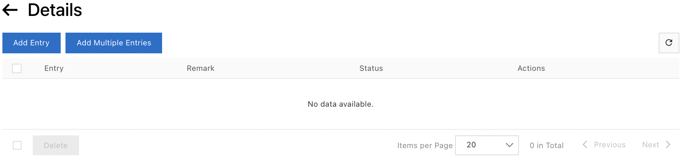{width="4.5in" height="1.0805555555555555in"}

-   \`IP Address/CIDR Block\`: these are IP addresses or CIDR blocks
    (one entry per line),

-   \`Remark\`: these are notes,

-   Click on \`Add\`.

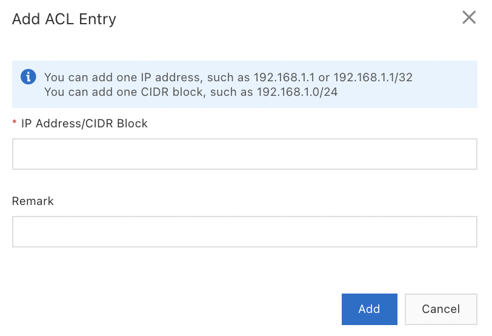{width="2.059701443569554in"
height="1.4052373140857393in"}

### Activate ACL 

To specify white lists or black lists for listeners:

-   Go to the \`SLB \`console,

-   Click on \`ALB \| Instances\`,

-   Click on the ID of the ALB instance,

-   Click on the \`Listener \`tab,

-   Click on \`View Details \`of the line of the listener,

-   Enable access control,

{width="0.9624245406824147in"
height="0.3024759405074366in"}

-   \`Access Control Method\`: this is the access control method; valid
    values are \`Whitelist \`and \`Blacklist\`,

-   \`Access Control List\`: this is the ACL,

-   Click on \`OK\`.

{width="2.068594706911636in"
height="0.888409886264217in"}

### Disable ACL

To disable the ACL of a listener:

-   Go to the \`SLB \`console,

-   Click on \`ALB \| Instances\`,

-   Click on the ID of the ALB instance,

-   Click on the \`Listener \`tab,

-   Click on \`View Details \`on the line of the listener,

-   Disable the listener,

{width="1.014517716535433in"
height="0.2969335083114611in"}

-   Click on \`OK\`.

## The ALB Health Checks 

Health Checks are used to monitor the conditions of server groups. This
allows to evaluate the availability of the backend servers of the server
groups.

Frequent Health Checks can impact the availability of workloads.

To configure Health Checks:

-   Go to the \`SLB \`console,

-   Click on \`ALB \| Health Check\`,

-   Click on \`Create Health Check\`,

{width="3.4190168416447944in"
height="1.0584175415573054in"}

-   \`Name\`: this is the name,

-   \`Protocol:\` this is the protocol of the Health Check:

```{=html}
<!-- -->
```
-   \`HTTP\`: simulates a Web browser accessing resources of the
    instance with \`HEAD \`or \`GET \`requests; allows to check if the
    instance is healthy,

-   \`TCP\`: sends SYN handshake packets to the instance to check if the
    instance is healthy,

```{=html}
<!-- -->
```
-   \`Health Check Method \`(if \`Protocol \`is on \`HTTP\`): this is
    the method used for the HTTP Health Check; valid values are \`HEAD
    \`and \`GET\`):

```{=html}
<!-- -->
```
-   \`HEAD \`(default): backend servers must support \`HEAD \`requests;
    if not, the \`GET \`method must be used,

-   \`GET\`: if the size of the request exceeds 8 Kb, the request is
    truncated; however, this does not affect the result of the Health
    Check,

```{=html}
<!-- -->
```
-   \`HTTP Version \`(if Health Check \`Protocol \`is set to \`HTTP\`):
    this is the HTTP protocol version; valid values are \`HTTP1.0 \`and
    \`HTTP1.1\`),

-   \`Port\`: this is the port used by the backend servers for the
    Health Check,

-   \`Path\`: this is the URL of the Health Check page,

-   \`Domain Name\`: this is the domain name used for the Health Check,

-   \`Normal Status Codes \`(if Health Check \`Protocol \`is on
    \`HTTP\`): these are the HTTP status codes indicating that the
    Health Check is normal; valid values are \`http_2xx \`(default),
    \`http_3xx\`, \`http_4xx \`and \`http_5xx\`,

-   \`Response Timeout Period\`: this is\` \`the time to wait for a
    response to the Health Check, 5 seconds by default (valid values
    range from 1 to 300 seconds),

If this time is exceeded, the Health Check will fail.

-   \`Health Check Interval\`: this is the interval between two
    consecutive Health Checks, 2 seconds by default (valid values range
    from 1 to 50 seconds),

-   \`Healthy Threshold\`: this is\` \`the number of successful Health
    Checks (3 by default) required for an unhealthy backend server to
    become healthy again (valid values range from 2 to 10),

-   \`Unhealthy Threshold\`: this is the number of failed Health Checks
    (2 by default) required for a healthy backend server to become
    unhealthy (valid values range from 2 to 10),

-   Click on \`Create\`.

+-----------------------------------------------------------------------+
| {width="2.6078062117235348in"   |
| height="2.9917333770778654in"}                                        |
|                                                                       |
| {width="2.3739752843394575in"   |
| height="2.458238188976378in"}                                         |
|                                                                       |
| {width="2.446015966754156in"    |
| height="1.8035575240594925in"}                                        |
+=======================================================================+
+-----------------------------------------------------------------------+

## The TLS security policies 

A TLS security policy can be specified when creating a HTTPS listener.
The TLS security policy allows to specify the supported TLS versions as
well as the supported encryption algorithms.

Default security policies:

-   \`tls_cipher_policy_1\_0\`: provides optimal compatibility and basic
    security,

-   \`tls_cipher_policy_1\_1\`: ensures high compatibility and standard
    security,

-   \`tls_cipher_policy_1\_2\`: provides high compatibility and advanced
    security,

-   \`tls_cipher_policy_1\_2_strict\`: supports only PFS (perfect
    forward secrecy) cipher suites and offers optimal security,

-   \`tls_cipher_policy_1\_2_strict_with_1\_3\`: supports only PFS
    (perfect forward secrecy) cipher suites and offers optimal security.

To create a custom TLS security policy:

-   Go to the \`SLB \`console,

-   Click on \`ALB \| TLS Security policies\`,

{width="3.4903379265091865in"
height="1.2463943569553806in"}

-   Click on \`Create Custom Policy\`,

-   \`Name\`: this is the name of the TLS security policy,

-   \`Minimal Version\`: this\` \`is the version to create:

```{=html}
<!-- -->
```
-   TLS 1.0 or later,

-   TLS 1.1 or later,

-   TLS 1.2 or later,

```{=html}
<!-- -->
```
-   \`Enable TLS 1.3\`: indicates whether TLS 1.3 is enabled; to do so,
    the selected cipher suite must support TLS 1.3,

-   \`Cipher Suite\`: this is\` \`the cipher suite to be used; it must
    be supported by the specified TLS version,

-   Click on \`Create\`.

{width="1.874511154855643in"
height="1.6199464129483814in"}

# OSS 

OSS is a cheap, scalable and very reliable storage service.

Objects are stored in buckets. These objects can be grouped in folders.
It is also possible to create a symbolic link on an object. There are
four storage classes: Standard, IA, Archive and Cold Archive. These
classes have different access times, durability and costs. The storage
class of a bucket can be changed.

When you upload an object in multipart mode, the object is broken down
into several parts called fragments.

OSS can automatically decompress ZIP objects uploaded to buckets.

The download of objects stored in buckets can be done from the OSS
console or via a CLI using the credentials of a RAM user. Before the
Archive or Cold Archive objects can be accessed, they must be restored.

These endpoints can be accelerated for both upload and download.

\`Back-to-origin \`rules allow to identify where to find an object if it
is not found in the bucket. These rules can be of two types:
mirror-based or redirection-based.

A bucket can host a static website. It is then possible to use the
custom domain name associated with the bucket. The HTTP headers allow to
customize the HTTP request policies (cache, forced object download),
\... The limit is 100 objects at a time. OSS automatically generates a
public endpoint for the bucket. It is however possible to use a custom
domain name. OSS can be used with CDN to speed up the download of static
objects.

OSS Select allows to search for objects. It is possible to run queries
on the logs in real time. They can also be analyzed. It is possible to
send event notifications when certain operations are performed on OSS
resources.

Lifecycle rules allow you to convert the storage class of objects in a
bucket or to delete objects and specific objects in a bucket. The WORM
(Write Once Read Many) retention policy allows to specify the period of
protection for objects in a bucket.

Objects in buckets can be versioned. Scheduled backup allows to backup
objects in a bucket to HBR (Hybrid Backup Recovery) on a regular basis.

There are three ACL modes for accessing objects. Data can be encrypted
on the server side with a key provided by OSS or with a key provided by
you. OSS supports CORS to allow cross-access and hotlink protection
allows to allow downloads only for a limited number of IP addresses or
domain names. OSS allows the use of signed URLs to protect images from
being used by unauthorized anonymous persons.

The buckets inventory allows to export information (number, dimensions,
storage classes and encryption status of objects) about specific objects
in a bucket.

It is possible to have the requesters pay the cost of the requests and
the traffic.

CRR (Cross-Region Replication) allows automatic and asynchronous
replication of buckets located in different regions.

Before you can use OSS, this service must be activated:

-   Go to the \`OSS \`console,

-   Click on \`Buy Now\`.

When versioning is enabled for a bucket, any overwritten or deleted
object is saved as a previous version of the object. It is therefore
possible to recover objects from a previous version in a bucket.

## The storage classes 

Redundant storage of zones consists of storing buckets redundantly in
three zones in the same region. This option is only available in certain
regions. This option cannot be disabled once it has been enabled.

OSS provides four storage classes:

-   Standard,

-   IA (Instant Access),

-   Archive,

-   Cold Archive.

The Standard class offers high reliability, high availability and high
performance. It is adapted to data sharing applications (photos, videos,
\...).

The IA (Instant Access) class provides highly durable storage at low
cost and a minimum storage duration of 30 days. The minimum billable
size is 64 KB. Objects are accessed in real time. Data retrieval is
charged. This class is suitable for cases where data access is
infrequent (once or twice a month).

The Archive class provides highly durable storage at low prices. The
minimum storage period is 60 days. The minimum billable size is 64 KB.
It is necessary to restore the object before it can be accessed. The
delay is about one minute. Data recovery is charged. This class is
suitable when the data is kept for a long time (archives, medical
images, \...).

The Cold Archive class provides highly durable storage at the lowest
cost. Minimum retention time is 180 days. The minimum billable size is
64 KB. It is necessary to restore the object before it can be accessed.
Restoration time depends on the size of the object and the restoration
mode. Data recovery is charged. This class is suitable if storage is for
an extremely long period of time (for compliance requirements for
example).

The maximum size of an object is 48.8 TB. The number of objects stored
in a bucket is not limited.

Buckets are created in a region but can be accessed from anywhere.

In order to upload objects, you must have write permissions.

Uploaded objects are displayed as files or folders in the OSS console.

## Connection to the OSS console 

To connect to the OSS console, it is possible to use the credentials of
a RAM user.

To create and authorize a RAM user:

-   Go to the \`RAM \`console,

-   Select \`Identities \| Users\`,

-   Click on \`Create User\`,

-   \`Logon Name\`: this is\` \`the name of the connection,

-   \`Display Name\`: this is the display name,

-   \`Access Mode\`: this is the access mode, which can be by connection
    password (\`Console Access\`) or by programming (\`Programmatic
    Access\`),

-   Click on \`OK\`,

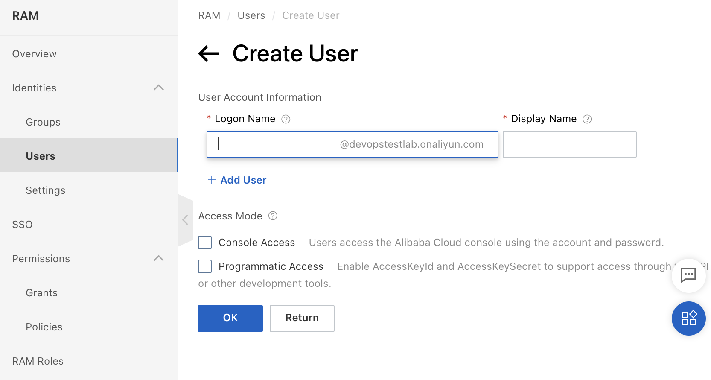{width="3.400952537182852in"
height="1.8169903762029747in"}

-   Select the line of the user,

-   Click on \`Add Permissions\`,

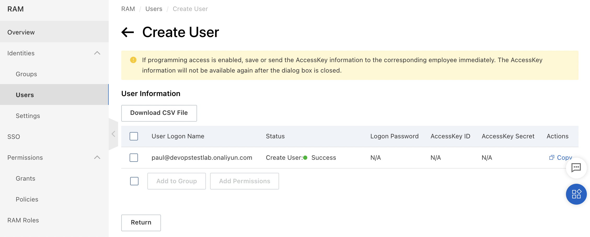{width="4.5in" height="1.8097222222222222in"}

-   Add the desired permissions,

-   Click on \`OK\`.

{width="2.8952919947506564in"
height="2.484679571303587in"}

To use a RAM user\'s credentials to log into the OSS console:

-   Go to the \`RAM \`console,

-   Click on the link next to \`RAM user logon\`.

{width="1.3256200787401575in"
height="0.9109984689413824in"}

To connect to OSS with the user\'s credentials, go to
\`https://oss.console.aliyun.com/\`.

## Management of the bucket

In this section, we will study:

-   creation of a bucket and a folder,

-   adding a tag to a bucket,

-   renaming an object,

-   creation of a symbolic link,

-   deleting an object, a folder and a bucket,

-   modification of the storage class of a bucket,

-   searching objectifs with the classic search or with OSS Select to
    use SQL statements to launch searches,

-   downloading of objects,

-   management of fragments generated during uploads of an object in
    multipart mode.

### Create a bucket 

A bucket contains objects stored in OSS.

Once a bucket is created, you cannot change its name or region.

To create a bucket:

-   Go to the \`OSS \`console,

-   Click on \`Buckets\`,

-   Click on \`Create Bucket\`,

-   \`Bucket Name\`: this is\` \`the name of the bucket; it must be
    unique in any Alibaba Cloud OSS,

-   \`Region\`: this is the region of the bucket,

If the bucket is in mainland China, it is necessary to register with its
real name.

-   \`Storage Class\`: this is\` \`the storage class of the bucket:

```{=html}
<!-- -->
```
-   \`Standard\`,

-   \`IA\`,

-   \`Archive\`,

-   \`Cold Archive\`,

```{=html}
<!-- -->
```
-   \`Zone-redundant Storage\`: enables redundant storage in three zones
    in the same region,

-   \`Versioning:\` allows to activate the versioning,

-   \`Access Control List (ACL)\`: specifies the ACL on the bucket:

```{=html}
<!-- -->
```
-   \`Private\`: only the bucket owner can perform read and write
    operations on objects in the bucket.

-   \`Public Read\`: only the bucket owner can perform write operations
    on objects in the bucket;

-   \`Public Read/Write\`: all users can perform read and write
    operations on objects in the bucket,

```{=html}
<!-- -->
```
-   \`Encryption Method:\` enables or disables server-side encryption
    for the bucket:

```{=html}
<!-- -->
```
-   \`None:\` disables server side encryption,

-   \`OSS-Managed\`: OSS uses keys to encrypt objects and manages these
    keys,

-   \`KMS\`: uses a CMK key stored in KMS to encrypt and decrypt data,

```{=html}
<!-- -->
```
-   \`Real-time Log Query:\` enables or disables the real time log
    query,

OSS uses Log Service. Queries for the last seven days are free.

-   \`Scheduled Backup\`: enables scheduled backup once a day,

HBR (Hybrid Backup Recovery) keeps the backup for one week.

-   Hierarchical Namespace: allows to rename directories or objects,

-   Click on \`OK\`.

+-----------------------------------------------------------------------+
| {width="2.9028532370953632in"   |
| height="3.050683508311461in"}                                         |
|                                                                       |
| 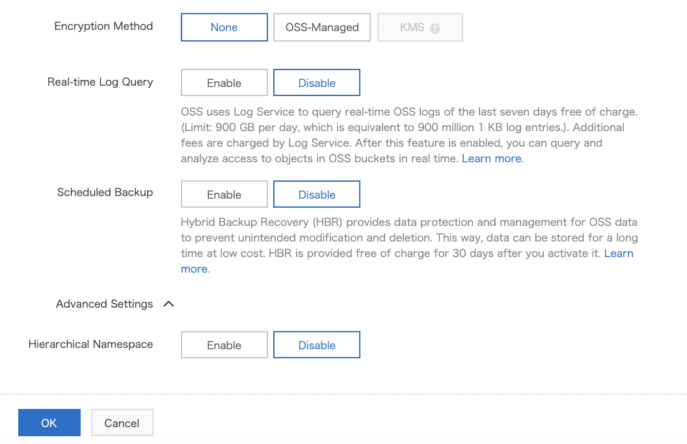{width="2.9870964566929135in"                |
| height="1.9346981627296589in"}                                        |
+=======================================================================+
+-----------------------------------------------------------------------+

### Modify the object storage class 

OSS provides the following storage classes:

-   Standard,

-   IA (Infrequent Access),

-   Archive,

-   Cold Archive.

When the storage class of an object is changed in the OSS console, the
size of the object cannot exceed 1 GB. If the size is larger than 1 GB,
it is recommended to use \`ossutil\`.

To change the storage class of an Archive or Cold Archive object, the
object must first be restored.

If you change the storage class of an object whose storage class is IA,
Archive or Cold Archive and the minimum storage time is not yet reached,
the minimum storage time is charged.

To change the storage class of an object:

-   Go to the \`OSS \`console,

-   Click on \`Buckets\`,

-   Click on the bucket name,

-   Click on \`Files\`,

-   Click on \`Modify Storage Class \`on the line of the object,

{width="4.5in" height="2.025in"}

-   \`Storage Class\`: select the storage class,

-   Click on \`OK\`.

{width="2.3832206911636047in"
height="1.977557961504812in"}

### Download objects 

To download an object:

-   Go to the \`OSS \`console,

-   Click on \`Buckets\`,

-   Click on the bucket name,

-   Click on \`Files\`.

-   Click on \`Download \`on the line of the file.

{width="4.5in"
height="2.0541666666666667in"}

To preview an object, click on \`View Details \`on the line of the file.

{width="2.401065179352581in"
height="3.552687007874016in"}

If the browser supports previews of the file format this object will be
displayed.

To share an object:

-   Click on \`View Details \`on the line of the file,

-   Click on \`Copy File URL\`,

-   Share the URL.

{width="2.3312839020122484in"
height="0.6202373140857392in"}

To share a private object, you must define a validity period in seconds
(\`Validity Period (Seconds)\`) during which the object can be shared
(3600 seconds by default, i.e. one hour). The maximum is 32400 seconds,
or 9 hours.

{width="2.389799868766404in"
height="0.25188867016622923in"}

To get a longer period, it is recommended to use \`ossutil\`,
\`ossbrowser \`or OSS SDK.

If the bucket is linked to a custom domain name:

-   Click on \`View Details \`on the file line,

-   Select the linked custom domain name; to generate different URLs for
    the object, select \`None\`.

When accessing web page objects (HTM, HTML, JSP, PLG, HTX or STM) from a
browser:

-   the page is downloaded if you use an URL generated from an OSS
    domain name (before 09/23/2019, in regions in China, the resource is
    previewed)

-   the page is previewed if you use an URL generated from a custom
    domain name.

For buckets located in regions outside China, the image resource
associated with an URL generated with an OSS domain name or a custom
domain name is previewed.

### Create a folder 

In OSS, data is stored using a flat rather than hierarchical structure.

The OSS console displays objects with names ending in \`/ \`as folders.

To create a folder:

-   Go to the \`OSS \`console,

-   Click on \`Buckets\`,

-   Click on the bucket name,

-   Click on \`Files \| Create Folder\`,

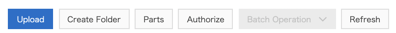{width="2.379717847769029in"
height="0.20088035870516185in"}

-   \`Folder Name\`: this is the name of the folder,

-   Click on \`OK\`.

{width="2.5371358267716535in"
height="1.6413068678915135in"}

### Search for objects 

It is possible to launch a search for objects by specifying a prefix.
This prefix cannot contain the \`/ \`character and is case sensitive.

To search for objects:

-   Go to the \`OSS \`console,

-   Click on \`Buckets\`,

-   Click on the bucket name,

-   Click on \`Files\`,

-   Enter the prefix in the search box.

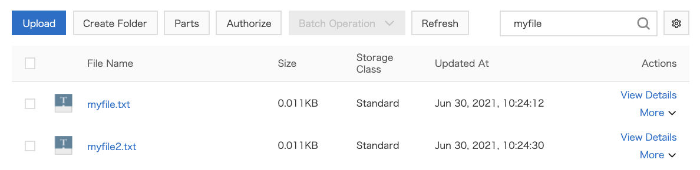{width="2.906420603674541in"
height="0.7095614610673666in"}

### Search for objects with OSS Select 

OSS Select allows to use simple SQL statements to select the contents of
an object. This reduces the amount of data transmitted from OSS. CSV
objects encoded in UTF-8 and compliant with RFC 4180 as well as JSON
objects are supported.

The limit is 40 MB of recovered data. The limit of an object is 128 MB
(beyond that, you have to use the \`SelectObject \`operation).

To use OSS Select:

-   Go to the \`OSS \`console,

-   Click on \`Buckets\`,

-   Click on the bucket name,

-   Click on \`Files\`,

-   Click on \`Select Content \`on the line of the file,

{width="4.5in" height="2.1in"}

-   \`File Type\`: this\` \`is the format of the object (CSV or JSON),

-   \`Delimiter \`(for CSV files): this is the delimiter (\`, \`or
    custom),

-   \`Title Line \`(for CSV files): indicates that the first line
    corresponds to the header,

-   \`JSON Display Mode \`(for JSON files): this is the display mode,

-   \`Compression Format\`: indicates if the file is compressed in gzip
    format,

Click on \`Preview \`to see a preview.

-   Click on \`Next Step\`,

{width="1.9271227034120735in"
height="2.327120516185477in"}

-   \`SQL Editor\`: this is the SQL query to be executed on the file
    data,

-   \`Result\`: this is\` \`the result of the query.

To download the result of the query, click on \`Download\`.

A SQL command can then be executed (example: \`select \* from
my_oss_object where \_2 like \'John\'\`).

{width="1.9527821522309712in"
height="1.1234536307961505in"}

### Rename an object 

From the OSS console you can rename objects up to 1 GB in size. To
rename larger objects, it is recommended to use \`ossutil\`.

After renaming an object, a delete marker is created for the original
object.

Folders cannot be renamed.

To rename an object:

-   Go to the \`OSS \`console,

-   Click on \`Buckets\`,

-   Click on the bucket name,

-   Click on \`Files\`,

-   Click on the pen icon next to the object name,

-   Enter the new name,

-   Click on OK.

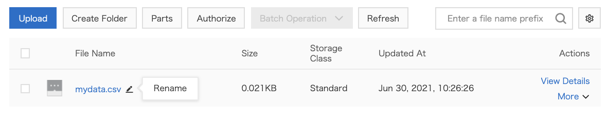{width="2.776463254593176in"
height="0.5694313210848644in"}

### Create a symbolic link 

It is possible to create a symbolic link to point to a frequently used
object in another bucket so that it can be used easily and quickly.

To configure symbolic links:

-   Go to the \`OSS \`console,

-   Click on \`Buckets\`,

-   Click on the bucket name,

-   Click on \`Set Soft Link \`on the line of the file,

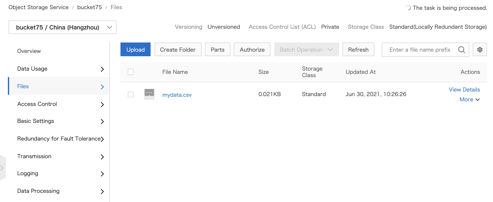{width="4.5in" height="1.8465277777777778in"}

-   \`Source File (full path)\`: this\` \`is the full path of the
    current object,

-   \`Symbolic Link File or Folder\`: this is\` \`the name of the
    symbolic link.

To create a symbolic link in a specific directory, use \`/ \`to specify
the directory.

{width="2.1601662292213475in"
height="2.1158311461067365in"}

### Delete an object 

To delete an object:

-   Go to the \`OSS \`console,

-   Click on \`Buckets\`,

-   Click on the bucket name,

-   Click on \`Files\`,

-   Click on \`Completely Delete \`on the line of the file,

-   Click on \`OK\`.

{width="3.293221784776903in"
height="1.5337871828521434in"}

### Delete a folder 

Deleting a folder means deleting the objects in it.

If the folder contains a large number of files, the duration of the
operation may be long. In this case it is recommended to use life cycle
rules.

To delete a folder:

-   Go to the \`OSS \`console,

-   Click on \`Buckets\`,

-   Click on the bucket name,

-   Click on \`Files\`,

-   If the file is without versioning:

```{=html}
<!-- -->
```
-   Click on \`Completely Delete \`on the line of the folder,

```{=html}
<!-- -->
```
-   If the file is with versioning:

```{=html}
<!-- -->
```
-   \`Display Previous Versions\`: select \`Show,

-   \`Click on \`Completely Delete \`on the line.

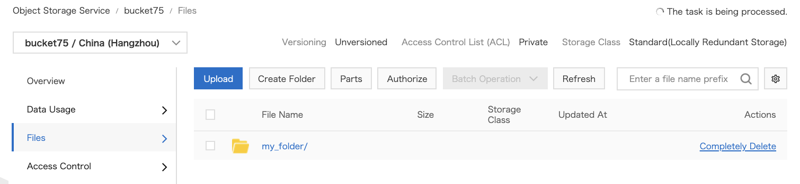{width="3.32251968503937in"
height="0.7701279527559055in"}

To convert a folder to a previous version:

-   \`Display Previous Versions\`: select \`Hide,

-   \`Click on \`Completely Delete \`on the line.

### Delete buckets 

To delete a large number of objects, it is recommended to use lifecycle
rules. In order to be deleted, the bucket must be empty.

Deleted buckets cannot be recovered.

To delete a bucket:

-   Go to the \`OSS \`console,

-   Click on \`Buckets\`,

-   Click on the bucket name,

-   Click on \`Basic Settings \| Delete Bucket \| OK\`.

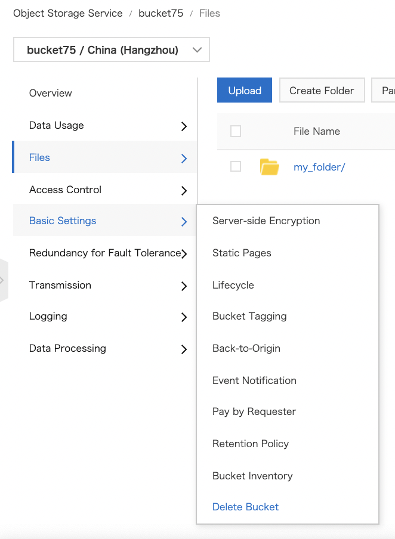{width="1.716017060367454in"
height="2.3433716097987753in"}

### Manage fragments 

When you upload an object in multipart mode, the object is broken down
into several parts called fragments.

Once all these fragments have been uploaded, the
\`CompleteMultipartUpload \`operation can then be called to group these
fragments into a single object.

The multipart mode is especially used when uploading an object in
resumable mode.

It is recommended to set up lifecycle rules to handle unnecessary
fragments that were generated when multipart upload tasks failed.

Fragments cannot be read.

To manage fragments:

-   Go to the \`OSS \`console,

-   Click on \`Buckets\`,

-   Click on the bucket name,

-   Click on \`Files\`,

-   Click on \`Parts\`.

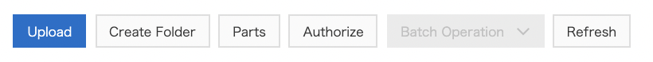{width="2.0261745406824145in"
height="0.1926126421697288in"}

To delete all the fragments in the bucket, click \`Delete All\`.

To delete only certain fragments, click \`Delete \`on the line of the
fragment.

### Add a tag to a bucket 

It is possible to associate tags with buckets. This helps to classify
and manage them.

A tag consists of a key-value pair.

There is a maximum of 20 labels per bucket.

To configure buckets tags:

-   Go to the \`OSS \`console,

-   Click on \`Buckets\`,

-   Click on the bucket name,

-   Click on \`Basic Settings \| Bucket Tagging\`,

-   Click on \`Configure\`,

{width="2.75832895888014in"
height="0.6355227471566054in"}

-   Add tags,

-   Click on \`Save\`.

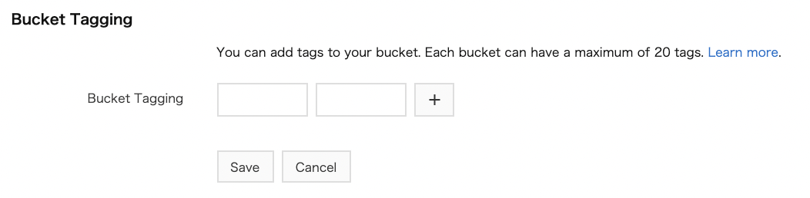{width="2.7358300524934385in"
height="0.6708694225721785in"}

## The bucket management rules 

In this section, we will study:

-   bucket lifecycle rules that allow you to change the storage class of
    objects or to delete specific objects,

-   versioning of objects,

-   content retention policy which allows to specify the period of
    protection of the objects in a bucket,

-   configuration of automatic ZIP decompression rules,

-   implementation of a scheduled backup to HBR,

-   access to Archive or Cold Archive objects,

-   generation of an inventory of buckets,

-   setting up of the payment method by the applicant.

### The rules of the life cycle 

Lifecycle rules allow you to convert the storage class of objects in a
bucket or to remove specific objects from a bucket.

A new life cycle rule takes effect within 24 hours.

Objects that are deleted based on life cycle rules cannot be recovered.

The maximum is 100 lifecycle rules in the OSS console.

To configure the lifecycle rules:

-   Go to the \`OSS \`console,

-   Click on \`Buckets\`,

-   Click on the bucket name,

-   Click on \`Basic Settings \| Lifecycle\`,

{width="3.8817924321959754in"
height="0.5888593613298337in"}

-   Click on \`Configure \| Create Rule\`,

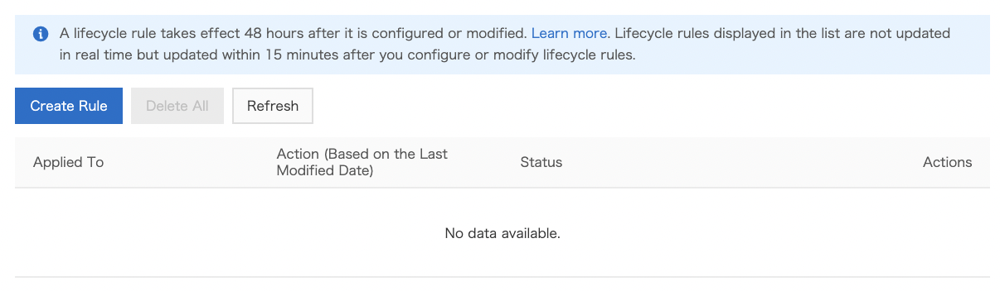{width="2.8649781277340334in"
height="0.8360608048993876in"}

-   \`Status\`: this is\` \`the status (enabled or disabled),

-   \`Applied to\`: these are the policies used to identify the objects
    to be used; possible values are:

```{=html}
<!-- -->
```
-   \`Files with Specified Prefix:\` this rule applies to files with the
    specified prefix,

-   \`Whole Bucket\`: this rule applies to all objects,

```{=html}
<!-- -->
```
-   \`Prefix:\` specifies the prefix (used when \`Files with Specified
    Prefix \`has been selected for \`Applied to\`),

-   \`Tagging:\` specifies the tags that the selected objects must have,

-   \`File Lifecycle\`: configure the lifecycle to be applied when the
    objects expire:

```{=html}
<!-- -->
```
-   \`Validity Period (Days)\`: this is the duration (in days) of
    validity since their last modification,

-   \`Expiration Date\`: this is the expiration date,

-   \`Disabled\`,

```{=html}
<!-- -->
```
-   \`Transit to IA Storage Class\`: transit to IA storage (only for
    Standard objects),

-   \`Transit to Archive Storage Class\`: transit to Archive Storage
    class,

-   \`Delete:\` deletes expired objects,

-   In the \`Delete Parts \`section:

```{=html}
<!-- -->
```
-   \`Part Lifecycle\`: these are the operations performed on the
    deleted parts: \`Validity Period (Days)\`, \`Expiration Data \`or
    \`Disabled\`; this choice is not compatible with \`Tagging\`,

-   \`Delete:\` deletes the games after their expiration.

```{=html}
<!-- -->
```
-   Click on \`OK\`.

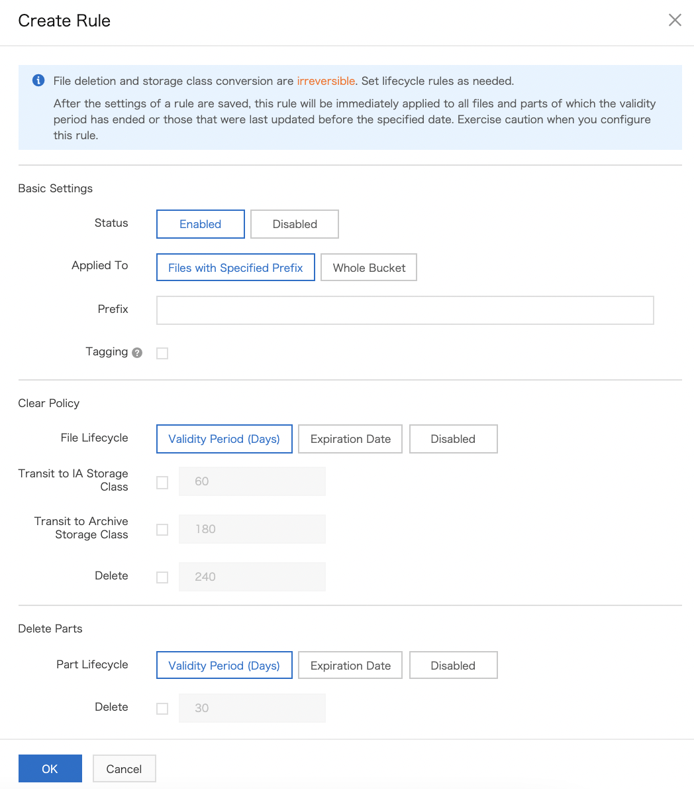{width="3.1050437445319337in"
height="3.5257589676290464in"}

If the buckets are versioned, there are additional parameters:

-   \`Current Version\`:

```{=html}
<!-- -->
```
-   \`Clean Up Delete Marker\`: if the object has only one version and
    this version is marked as to be deleted, OSS deletes this delete
    marker,

```{=html}
<!-- -->
```
-   \`Previous Versions:\`

```{=html}
<!-- -->
```
-   \`File Lifecycle\`: specifies when previous versions expire:
    \`Validity Period (Days) \`or \`Disabled\`,

-   \`Transit to IA Storage Class\`: once become previous version,
    specifies the number of days after which the object passes to IA
    class,

-   \`Transit to Archive Storage Class\`: once it has become a previous
    version, specifies the number of days after which the object goes to
    Archive class,

-   \`Transit to Cold Storage Class\`: once it has become a previous
    version, specifies the number of days after which the object goes to
    Cold class,

-   \`Delete\`: once it has become a previous version, specifies the
    number of days after which the object is deleted.

### Enable versioning 

Objects in buckets can be versioned. Deleted or overwritten objects are
then recorded as a previous version. It is thus possible to recover a
previous version.

It is recommended to delete objects from older versions when they are no
longer in use in order to limit storage costs.

To enable versioning:

-   Go to the \`OSS \`console,

-   Click on \`Buckets\`,

-   Click on the bucket name,

-   Click on \`Redundancy for Fault Tolerance \| Versioning\`,

-   Click on \`Configure\`,

-   \`Versioning\`: select \`Enabled\`,

To stop using object versions, select \`Suspended\`.

-   Click on \`Save\`.

{width="2.8611734470691164in"
height="0.8821948818897638in"}

To retrieve previous versions:

-   Go to the \`OSS \`console,

-   Click on \`Buckets\`,

-   Click on the bucket name,

-   Click on \`Files\`,

-   \`Display Previous Versions\`: select \`Show\`,

-   Click on \`Restore \`on the line of the version.

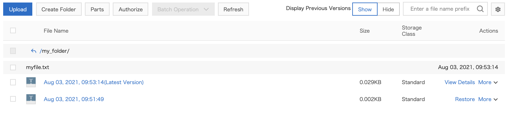{width="4.5in" height="1.00625in"}

To download a previous version:

-   Go to the \`OSS \`console,

-   Click on \`Buckets\`,

-   Click on the bucket name,

-   Click on \`Files\`,

-   \`Display Previous Versions\`: select \`Show\`,

-   Click on the object version or on \`View Details \`on the line of
    the file,

-   Click on \`Download\`.

{width="2.214086832895888in"
height="2.3517836832895886in"}

To delete a previous version:

-   Go to the \`OSS \`console,

-   Click on \`Buckets\`,

-   Click on the bucket name,

-   Click on \`Files\`,

-   \`Display Previous Versions\`: select \`Show\`,

-   Click on \`More \| Completely Delete \`on the line of the version.

If the current version is deleted, the last previous version becomes the
current version.

### Set up retention policy 

The WORM (Write Once Read Many) retention policy allows to specify the
period of time (from 1 day to 70 years) that objects in a bucket are
protected. During this period, these objects cannot be modified or
deleted. The status of the policy becomes \`LOCKED\`. This feature is
incompatible with versioning.

To benefit from this feature, you must open a ticket.

To configure retention policies:

-   Go to the \`OSS \`console,

-   Click on \`Buckets\`,

-   Click on the bucket name,

-   Click on \`Basic Settings \| Retention Policy \| Configure\`,\`

{width="2.8176826334208225in"
height="0.5417946194225722in"}

-   \`Click on \`Create Policy\`,

-   \`Retention Period: \`this is the retention period (from 1 to 70
    days),

-   Click on \`OK\`,

{width="2.505576334208224in"
height="1.3556408573928258in"}

-   Click on \`Lock\`,

-   Click on \`OK\`.

{width="2.862296587926509in"
height="0.46203083989501315in"}

### Restore Archive or Cold Archive objects 

Before Archive or Cold Archive objects can be accessed, they must be
restored.

To restore Archive or Cold Archive objects:

-   Go to the \`OSS \`console,

-   Click on \`Buckets\`,

-   Click on the bucket name,

-   Click on \`Files\`,

-   Click on \`Restore \`on the line of the file.

Restoring archive objects takes about one minute. By default, this
object remains in restored state for one day. To extend this time to a
maximum of 7 days, you can use OSSutil or an SDK.

To restore Cold Archive objects, you need to configure the following
settings:

-   \`Copy Valid Period\`: this is the period during which the object is
    in the restored state,

-   \`Restoration Mode\`: this\` \`is the restoration mode:

```{=html}
<!-- -->
```
-   \`Expedited\`: the object is restored within one hour,

-   \`Standard\`: the object is restored within two to five hours,

-   \`Bulk\`: the object is restored within five to ten hours.

### Configure ZIP decompression rules 

OSS can automatically decompress ZIP objects uploaded to buckets. The
decompressed files are stored in the bucket.

Function Compute must be activated to decompress the ZIP files. If it
hasn\'t been done yet, the console tells you:

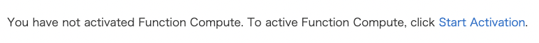{width="2.512208005249344in"
height="0.2015977690288714in"}

This feature is not available in all regions.

It is recommended to use UTF-8 or GB 2312 encoding.

If a ZIP file is in an Archive or Cold Archive storage class bucket, it
is necessary to restore the object before it can be unpacked.

If a ZIP file takes longer than 10 minutes to decompress, the
decompression is aborted.

To configure decompression rules for Zip packages:

-   Go to the \`OSS \`console,

-   Click on \`Buckets\`,

-   Click on the bucket name,

-   Click on \`Data Processing \| Decompress ZIP Package\`,

{width="4.5in"
height="1.2895833333333333in"}\`

-   \`Click on \`Decompress ZIP Package\`,

-   \`Service Authorization\`: authorizes Function Compute to read and
    write data in OSS and execute functions,

-   Click on the \`Authorize \`button on the right,

-   \`Trigger authorized\`: allows OSS to access Function Compute,

-   Click on the \`Authorize \`button on the right,

-   \`Prefix:\` this is the prefix that ZIP packages must have to be
    decompressed,

-   \`Destination Directory\`: this is\` \`the folder where the objects
    are decompressed,

If nothing is specified, they are decompressed in the root folder of the
bucket.

-   Click on \`OK\`.

{width="2.260216535433071in"
height="2.7827143482064742in"}

To change the configuration of the functions:

-   Click on \`Decompress ZIP Package\`,

-   Click on \`Edit \`on the line of the file: the Function Compute
    console is displayed,

-   Click on \`Cancel\`,

{width="2.8238057742782154in"
height="1.993221784776903in"}

-   Click on the \`Overview \`tab,

-   Click on \`Modify Configurations\`,

{width="3.0301388888888887in"
height="1.3500010936132982in"}

-   \`Memory\`: depends on the size of the object to be processed,

The smaller the size of the ZIP package, the smaller this value should
be to reduce the execution costs of the function.

-   \`Timeout\`: this\` \`is the time after which an error message is
    displayed if the function could not be executed,

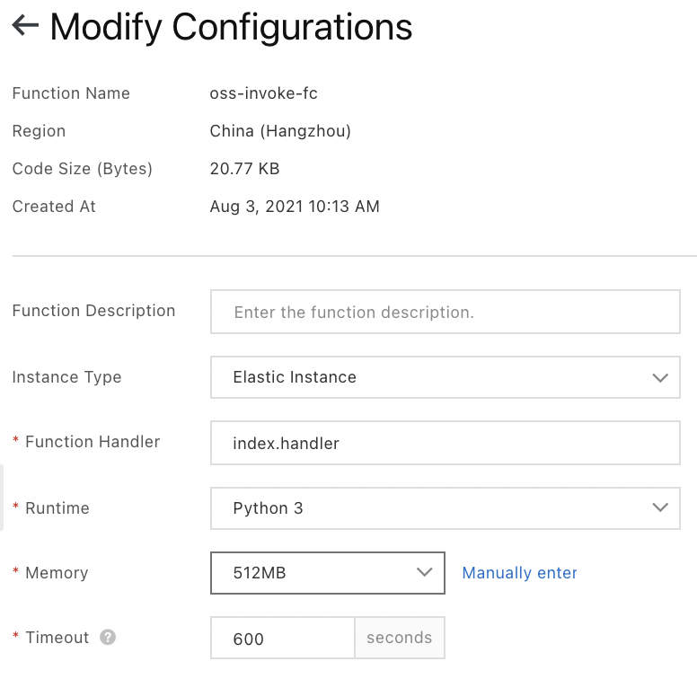{width="2.167256124234471in"
height="2.111402012248469in"}

-   \`Environment Variables:\` these are the environment variables,

{width="1.8714457567804024in"
height="0.713921697287839in"}

-   Click on \`Submit\`.

To remove decompression rules for ZIP packages:

-   Click on \`Decompress ZIP Package\`,

-   Click on \`Edit \`on the line of the file: the Function Compute
    console is displayed,

-   Click on \`Cancel\`,

{width="2.8910739282589675in"
height="2.040705380577428in"}

-   Click on the \`Triggers \`tab,

-   Click on \`Delete \`on the line of the trigger.

{width="4.5in"
height="0.7979166666666667in"}

### Enable scheduled backup 

The scheduled backup of OSS allows to backup objects in a bucket to HBR
(Hybrid Backup Recovery) on a regular basis. If an object is lost, you
can recover the object using HBR.

HBR must have been activated. HBR is not available in all regions.

Scheduled backup cannot be configured for Archive or Cold Archive
storage class buckets. Symbolic links and ACLs are not backed up.

To set up a scheduled backup for an existing bucket:

-   Go to the \`OSS \`console,

-   Click on \`Buckets\`,

-   Click on the bucket name,

-   Click on \`Files \| Scheduled Backup\`: you must have subscribed to
    the OSS Backup server,

-   Click on \`Source Bucket\`.

{width="4.5in"
height="1.8958333333333333in"}

Set up a backup to get a free two-month trial:

-   \`Source OSS Bucket\`: this is the name of the current bucket

-   \`Plan Name\`: this is the name of the backup plan,

If this field is empty, HBR generates a name automatically.

-   \`Start Time\`: this is the start time,

-   \`Pay After Trial Ends\`: indicates if you want to activate the paid
    offer after the two free months.

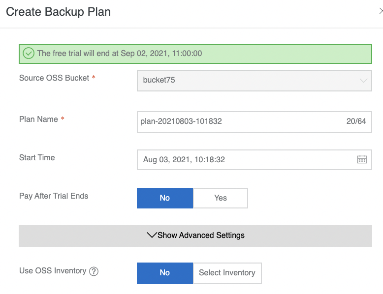{width="2.649283683289589in"
height="2.0364326334208225in"}

Set up a backup to benefit directly from the paid offer:

-   \`Source OSS Bucket\`: this is the name of the current bucket,

-   \`Plan Name\`: this is the name of the backup plan,

If this field is empty, HBR generates a name automatically.

-   \`Start Time\`: this\` \`is the start time,

-   \`Source Path\`: this is the prefix of the objects to be saved,

-   \`Backup Interval\`: this\` \`is the frequency of the backup (in
    days or weeks),

-   \`Retention Policy\`:

```{=html}
<!-- -->
```
-   \`Limited\`: backups are kept for the specified period of time
    before they are deleted,

-   \`Permanent\`: backups are kept permanently,

```{=html}
<!-- -->
```
-   \`Retention Period: \`this is the retention period for backups (in
    days, weeks, months or years); this field is only accessible if
    \`Retention Policy \`is set to \`Limited\`,

-   \`Backup Vault\`: this is\` \`the vault where backups are stored:

```{=html}
<!-- -->
```
-   \`Create Vault\`: creates a new vault,

-   \`Select Vault\`: selects an existing vault.

### Generate buckets inventory 

The buckets inventory allows to export information (number, dimensions,
storage classes and encryption status of objects) about specific objects
in a bucket.

The RAM user must have the following permissions:

-   \`PutBucketInventory\`,

-   \`GetBucketInventory\`,

-   \`ListBucketInventory\`,

-   \`DeleteBucketInventory\`,

-   \`CreateRole\`,

-   \`GetRole\`.

Up to 10 inventories can be configured in the console.

To configure the buckets inventory:

-   Go to the \`OSS \`console,

-   Click on \`Buckets\`,

-   Click on the bucket name,

-   Click on \`Basic Settings \| Bucket Inventory\`,

{width="3.0988418635170603in"
height="0.5188648293963255in"}

-   Click on \`Configure \| Create Inventory\`,

{width="2.9146905074365703in"
height="0.4880314960629921in"}

-   \`Status\`: this is\` \`the inventory status (activated or
    deactivated),

-   \`Rule Name\`: this is\` \`the name of the rule,

-   \`Destination Bucket\`: this is the bucket that will store the
    result,

-   \`Inventory List Path\`: this\` \`is the directory of the bucket
    that will store the result,

-   \`Frequency\`: this\` \`is the frequency with which inventory lists
    are generated (\`Weekly \`or \`Daily\`),

-   \`Encryption Method\`: this is\` \`the encryption method:

```{=html}
<!-- -->
```
-   \`None\`: no encryption,

-   \`AES-256\`: uses AES-256,

-   \`KMS\`: encrypted with the client master key (CMK) managed by KMS,

```{=html}
<!-- -->
```
-   \`Object Versions:\` indicates if only the last version is concerned
    (\`Current Version\`) or if all versions are concerned (\`All
    Versions\`),

-   \`Object Prefix:\` specifis the prefix of the concerned objects,

-   \`Optional Fields\`: lists of optional information to export
    (\`Object Size\`, \`Storage Class\`, \`Last Update Time\`, \`ETag\`,
    \`Multipart Upload \`and \`Encryption Status\`).

{width="2.3897134733158354in"
height="3.3684634733158356in"}

### Activate the payment method by the applicant 

It is possible to have the requesters pay the cost of the requests and
traffic. The bucket owner only pays for storage fees, tag fees and
transfer acceleration.

To set up the on-demand payment method:

-   Go to the \`OSS \`console,

-   Click on \`Buckets\`,

-   Enter the name of the bucket,

-   Click on \`Basic Settings \| Pay by Requester\`,

-   Click on \`Configure\`,

-   \`Pay by Requester\`: this is the method of payment by the requester
    (enabled or disabled),

-   Click on \`Save\`.

{width="3.317267060367454in"
height="0.7105500874890639in"}

## The access control 

In this section, we will study:

-   Setting up bucket policies to allow users to access objects,

-   ACLs to manage access control lists.

### Add a bucket policy 

Bucket policies allow users to access objects.

The bucket owner can grant other users access permissions to objects.

To share private objects with specific users or groups, you can use
bucket policies.

To add bucket policies:

-   Go to the \`OSS \`console,

-   Click on \`Buckets\`,

-   Click on the bucket name,

-   Click on \`Files \| Authorize\`,

{width="2.3452154418197724in"
height="0.1813199912510936in"}

-   Click on \`Authorize\`,

{width="3.485492125984252in"
height="1.202709973753281in"}

-   \`Applied To:\` the possible values are:

```{=html}
<!-- -->
```
-   \`Whole Bucket\`: the policy applies to the entire bucket,

-   \`Specified Resource:\` it applies to specified resources
    (directory, with possibly \`\* \`at the end like \`myfolder/\*\`),

```{=html}
<!-- -->
```
-   \`Accounts:\` the possible values are:

```{=html}
<!-- -->
```
-   \`Anonymous Accounts\`: allows all users,

-   \`RAM Users\`: this is a RAM user of the current account,

-   \`Other Accounts\`: this can be another account (in this case,
    specify the account ID) or a permission to an user or a temporary
    user generated by STS (in this case, specify the ARN in the form
    \`arn:sts::{RoleOwnerUid}:assumed-role/{RoleName}/{RoleSessionName})\`;
    the \`\* \`are allowed (e.g.: \`arn:sts::\*:\*/\*/\*\`)

```{=html}
<!-- -->
```
-   \`Authorized Operation:\` the authorized values are:

```{=html}
<!-- -->
```
-   \`Read Only\`: authorized users can view, list and upload resources,

-   \`Read/Write\`: authorized users can read and write data to the
    resources,

-   \`Any Operation\`: authorized users can perform any operation on the
    resources,

-   \`None:\` authorized users cannot perform any operation on the
    resources,

```{=html}
<!-- -->
```
-   \`Conditions\`: only users who meet these conditions can access the
    resources:

```{=html}
<!-- -->
```
-   \`Access Method\`: specifies the access method (HTTP or HTTPS)
    allowed for accesses (default is both),\`

-   IP =:\` specifies the IP addresses or CIDR blocks that can access
    the resources; separate multiple IP addresses with commas (\`,\`),

-   \`IP \<\>: \`specifies IP addresses or CIDR blocks that cannot
    access resources,

```{=html}
<!-- -->
```
-   Click on \`OK\`.

{width="2.8085094050743655in"
height="3.2089818460192476in"}

Resources are available:

-   through the console (for Alibaba Cloud accounts and authorized RAM
    users),

-   by a URL (for permissions for anonymous users),

-   by \`ossutil \`(for authorized Alibaba Cloud accounts),

-   by \`ossbrowser \`(for authorized Alibaba Cloud accounts),

-   by the SDK OSS.

### Using ACLs 

There are three modes for the ACL (Access Control List):

-   \`Private\`: only the bucket owner can perform read and write
    operations on objects in the bucket.

-   \`Public Read\`: only the bucket owner can perform write operations
    on objects in the bucket; others, including anonymous users, can
    only perform read operations;

-   \`Public Read/Write\`: all users, including anonymous users, can
    perform read and write operations on objects in the bucket.

If you change the ACL of a bucket, the ACLs of all objects that inherit
the ACL of the bucket change accordingly.

It is possible to set up ACLs on objects to control access.

If no ACL has been specified, the ACL of the bucket is used.

The possible ACLs are:

-   \`Inherited from Bucket:\` the ACL of the bucket to which the object
    belongs is used,

-   \`Private\`: only the bucket owner or authorized users can read and
    write to objects in the bucket,

-   \`Public Read\`: only the bucket owner or authorized users can read
    and write to the objects,

-   \`Public Read/Write\`: all users, including anonymous users, can
    perform read and write operations on objects in the bucket.

To change the ACL of a bucket:

-   Go to the \`OSS \`console,

-   Click on \`Buckets\`,

-   Click on the bucket name,

-   Click on \`Files\`,

-   Select \`More \| Set ACL \`on the line of the file,

-   \`Access Control List (ACL)\`: this is the ACL (\`Inherited from
    Bucket\`, \`Private\`, \`Public Read \`or \`Public Read/Write\`),

-   Click on \`OK\`.

{width="2.7623501749781276in"
height="1.4945680227471565in"}

## The bucket encryption 

OSS provides three server-side encryption methods for the bucket:

-   \`None:\` disables server side encryption,

-   \`OSS-Managed\`: OSS uses keys to encrypt objects and manages these
    keys; OSS uses master keys that are regularly rotated,

-   \`KMS\`: uses a CMK key stored in KMS to encrypt and decrypt data;
    before using this encryption, you must enable KMS,

Only the AES-256 algorithm is supported.

It is possible to encrypt data on the server side. In this case, OSS
encrypts the objects before storing them. When downloading the object
from OSS, OSS decrypts the object and returns it decrypted. A HTTP
header indicates that the object is encrypted on OSS.

The following encryption methods are supported:

-   SSE-KMS (Server-Side Encryption using KMS): for encryption, OSS uses
    the default CMK (Customer Master Key) managed by KMS or a specified
    CMK ; the CMK is managed by KMS,

-   SSE-OSS (Server-Side Encryption using OSS-managed keys): OSS manages
    data keys and uses master keys that are regularly rotated.

It is possible to enable server-side encryption when creating a bucket
or on an existing bucket.

To configure server-side encryption on an existing bucket, select the
bucket and enable encryption:

-   Go to the \`OSS \`console,

-   Click on \`Buckets\`,

-   Click on the bucket name,

-   Click on \`Basic Settings \| Server-side Encryption\`,

-   Click on \`Configure\`,

-   \`Encryption Method: \`this is the encryption method (\`None\`,
    \`OSS-Managed \`or \`KMS\`),

-   \`Encryption algorithm \`(if \`OSS-Managed \`is selected for
    \`Encryption Method\`): this is the encryption algorithm (only
    AES-256 is currently supported),

-   \`CMK \`(if \`KMS \`is selected for \`Encryption Method\`): this is
    the key to use,

-   Click on \`Save\`.

{width="3.0936176727909013in"
height="0.6979735345581802in"}

## Creation of a website 

In this section, we will study:

-   hosting of static websites,

-   implementation of CORS to allow cross-access,

-   protection of links to content with hotlink,

-   configuration of the HTTP headers of the objects.

### Hosting static websites 

A bucket can host a static website. It is then possible to use the
custom domain name associated with the bucket.

For security reasons, for uploaded files with HTM, HTML, JSP, PLG, HTX
or STM extension with a MIME text or HTML type, the HTTP
\`Content-Disposition: \'attachment=filename;\' \`header is
automatically added if the default custom domain name is used.

To set up static web hosting:

-   Go to the \`OSS \`console,

-   Click on \`Buckets\`,

-   Click on the bucket name,

-   Click on \`Basic Settings \| Static Pages\`,

-   Click on \`Configure\`,

-   \`Default Homepage\`: this is the home page (similar to
    \`index.html\`),

-   \`Default 404 Page\`: this is\` \`the page returned in case of a 404
    error,

-   Click on \`Save\`.

{width="3.272688101487314in"
height="1.2555402449693789in"}

### Implement CORS rules 

OSS supports CORS (Cross-Origin Resource Sharing) to allow cross access.
To configure it, you have to create rules (10 maximum).

If you are using CDN with OSS, you need to configure the CORS rules in
CDN.

To configure CORS rules:

-   Go to the \`OSS \`console,

-   Click on \`Buckets\`,

-   Click on the bucket name,

-   Click on \`Access Control \| Cross-Origin Resource Sharing (CORS)\`,

-   Click on \`Configure\`,

{width="2.1293471128608923in"
height="0.4764741907261592in"}

-   Click on \`Create Rule\`,

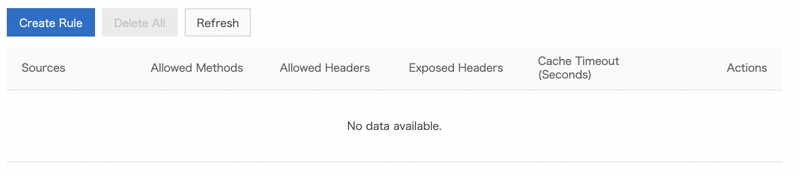{width="3.2442957130358705in"
height="0.7174507874015748in"}

-   \`Sources\`: these are the sources that are allowed to make
    cross-origin queries,

It is possible to specify several rules, one per line. Wildcards are
allowed. The domain names must include the protocols and the port
number.

-   \`Allowed Methods\`: these are the allowed cross-origin request
    methods (possible values are \`GET\`, \`POST\`, \`PUT\`,
    \`DELETE\`,\` \`and \`HEAD\`),

-   \`Allowed Headers:\` these are the response headers for cross-origin
    requests ; the format is \`key:value \`(example: \`content-type:
    text/plain\`) ; there can be several rules. Each one must appear on
    a line.

-   \`Exposed Headers\`: these are the response headers for access
    requests ; wildcards are not allowed,

-   \`Cache Timeout (Seconds)\`: this is the time at which the browser
    caches the response to a prefetch request (\`OPTIONS\`),

-   \`Vary: Origin:\` indicates to return the \`Vary: Origin \`header or
    not,

It is recommended to return the \`Vary \`header if both CORS and
non-CORS queries are sent or if the \`Origin \`header has multiple
values.

-   Click on \`OK\`.

{width="2.577567804024497in"
height="3.4653958880139983in"}

### Protecting links with hotlink 

Hotlink protection configures a referrer whitelist for a bucket. Only
requests from IP addresses or domain names that are included in the
referer whitelist can access the bucket data. These referers are
retrieved in the HTTP referer header field.

Requests that include a HTTP \`Authorization \`header are not checked.

To configure hotlink protection:

-   Go to the \`OSS \`console,

-   Click on \`Buckets\`,

-   Click on the bucket name,

-   Click on \`Access Control \| Hotlink Protection\`,

-   Click on \`Configure\`,

-   \`Referer Whitelist\`: these are IP addresses or domain names (one
    item per line),

-   \`Allow Empty Referer:\` allows requests in which the HTTP referer
    header is empty,

-   Click on \`Save\`.

{width="3.371457786526684in"
height="1.1482720909886264in"}

When previewing a video in MP4 format, the browser sends both a request
with the referer field filled in and another with this field empty. It
is therefore necessary in this case to also allow empty HTTP referer
headers.

### Configure HTTP headers for objects 

HTTP headers allow to customize HTTP request policies (cache, forced
object download), \... The limit is 100 objects at a time.

To configure HTTP headers for:

-   Go to the \`OSS \`console,

-   Click on \`Buckets\`,

-   Click on the bucket name,

-   Click on \`Files\`,

-   Click on \`More \| Set HTTP Header \`on the line of the object,

-   \`Content-Type:\` this is the type and the encoding method,

-   \`Content-Encoding\`: this is the type of compression:

```{=html}
<!-- -->
```
-   \`gzip\`: uses the Lempel-Ziv (LZ77) algorithm with 32-bit CRC
    checking,

-   \`compress\`: uses the Lempel-Ziv-Welch (LZW) algorithm,

-   \`deflate\`: uses the zlib library and the deflate algorithm,

-   \`identity\`: does not compress (default value),

-   \`br\`: uses the Brotli algorithm,

```{=html}
<!-- -->
```
-   \`Content-Language: \`this is the language of the content,

-   \`Content-Disposition\`: this is the access method:

```{=html}
<!-- -->
```
-   \`inline:\` the object is open in the applications (example:
    browser),

-   \`attachment:\` the object is downloaded as a local file; the
    filename parameter allows to specify the name of the local file,

```{=html}
<!-- -->
```
-   \`Cache-Control:\` this is the cache configuration:

```{=html}
<!-- -->
```
-   \`no-cache:\` the cache cannot be used before being checked by the
    server,

-   \`noo-store:\` no cache used,

-   \`public\`: the object can be cached in each node of the route
    through which the response is returned,

-   \`private:\` the object can only be cached on the \`browser\`,

-   \`max-age=\<SECONDS\> \`allows to specify the duration (in seconds)
    of the caching (example: \`public, max-age=30),\`

```{=html}
<!-- -->
```
-   \`Expires:\` this is the time until which the cache is valid;
    \`max-age \`of \`Cache-Control \`overrides this parameter,

-   \`User metadata\`: these are the user metadata of the objects (they
    are prefixed with \`x-oss-meta-\`),

The limit is 8 KB.

-   Click on \`OK\`.

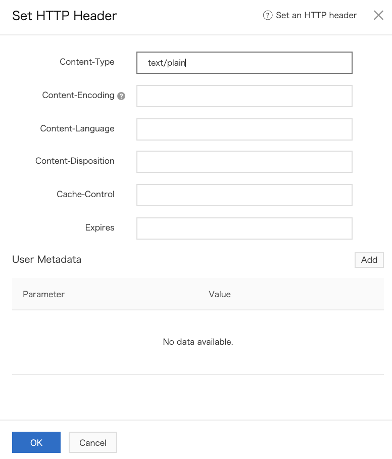{width="2.4625306211723537in"
height="2.8813134295713034in"}

## Acceleration of a domain name 

In this section, we will study:

-   using a custom domain name,

-   using an accelerated domain name to speed up the download of static
    objects and speed up transfers,

-   using acceleration endpoints to speed up the transfer for uploading
    and downloading OSS objects on the Internet,

-   using a SSL certificate on the host of a domain.

### Use a custom domain name 

After uploading objects to a bucket, OSS automatically generates URLs
that include the bucket\'s public endpoint.

To access objects using a custom domain name (CNAME), it is necessary to
link the custom domain name to the bucket.

To link a custom domain name:

-   Go to the \`OSS \`console,

-   Click on \`Buckets\`,

-   Click on the bucket name,

-   Select \`Transmission \| Domain Names\`,

-   Click on \`Bind Custom Domain name\`,

{width="4.5in" height="1.4854166666666666in"}

-   \`Custom Domain Name\`: this is\` \`the domain name to link to
    (wildcard is not allowed),

-   If Alibaba Cloud manages the domain name, click on \`Add CNAME
    Record Automatically \`and then on \`Submit\`.

{width="3.0421194225721786in"
height="1.4567432195975503in"}

Otherwise, add the CNAME record manually:

-   Go to the \`Alibaba Cloud DNS \`console,

-   Click on \`Configure \`on the line of the DNS entry,

{width="3.5836646981627296in"
height="1.1608202099737532in"}

-   Click on \`Add Record\`,

{width="4.5in"
height="1.1270833333333334in"}

-   \`Type\`: select the type of \`CNAME \`record,

-   \`Host\`: this is\` \`the host record based on the prefix of the:

```{=html}
<!-- -->
```
-   To add a top-level domain, enter \`@ \`(example: \`mywebsite.com\`),

-   To add a second level domain, enter the prefix (example: \`www\`),

-   To associate all second level domains with the public endpoint,
    enter \`\*\`,

```{=html}
<!-- -->
```
-   \`ISP Line\`: selects the ISP line used to resolve the domain name,

It is recommended to select \`Default \`so that the optimal line is
automatically selected.

-   \`Value\`: this is the public endpoint of the bucket,

-   \`TTL\`: this is\` \`the update interval of the record,

-   Click on \`Confirm\`.

{width="3.2060258092738407in"
height="2.6504133858267718in"}

A new CNAME record takes effect immediately. Changing a CNAME record
takes up to 72 hours to take effect.

To check the status of the CNAME, run the \`ping \`command on the domain
name. If the request is redirected to \`\*.oss-cn-\*.aliyuncs.com\`,
then the CNAME is active.

To detach a custom domain name from a bucket:

-   Go to the \`OSS \`console,

-   Click on \`Buckets\`,

-   Click on the bucket name,

-   Select \`Transmission \| Domain Names\`,

-   Click on \`Manage Mapping Configuration \`on the line of the domain
    name,

{width="4.5in" height="1.042361111111111in"}

-   Click on \`Unbind\`,

-   Click on \`Close\`.

{width="3.054838145231846in"
height="1.5128051181102362in"}

### Activate transfer acceleration 

Transfer Acceleration is based on OSS\' use of globally distributed data
centers. When a data transfer request is sent, the request is resolved
and optimally routed to the data center where the bucket is located.
This allows customers to access OSS more quickly.

A prerequisite is that the real name must be registered.

The activation and deactivation of this feature requires a delay of 30
minutes.

Once enabled, to use the transfer acceleration, simply use the
acceleration endpoint.

The other endpoints work normally.

If OSS is accessed via HTTP, the transfer acceleration URL can be
accessed via HTTP or HTTPS.

To enable transfer acceleration:

-   Go to the \`OSS \`console,

-   Click on \`Buckets\`,

-   Click on the bucket name,

-   Click on \`Transmission \| Transfer Acceleration\`,

-   Click on \`Configure\`,

-   \`Transfer Acceleration\`: enables or disables transfer
    acceleration,

-   Click on \`Save\`.

{width="2.726078302712161in"
height="1.3945909886264216in"}

Two public endpoints are generated:

-   One for global acceleration
    \`(\<BUCKET_NAME\>.oss-accelerate.aliyuncs.com)\`: this is\` \`the
    recommended choice,

-   Another one for access outside mainland China
    \`(\<BUCKET_NAME\>.oss-accelerate-overseas.aliyuncs.com)\`: this is
    the recommended choice if you have linked this custom domain name to
    a bucket outside mainland China and have not requested an ICP
    filing.

### Use acceleration endpoints 

The acceleration endpoints allow for faster transfer for uploading and
downloading OSS objects over the Internet.

If the custom domain name is linked to a bucket located in mainland
China, you must apply for an ICP filing with the MIIT (Ministry of
Industry and Information Technology).

To implement transfer acceleration based on a custom domain name, you
must bind the domain name to a bucket and configure the CNAME record to
map the custom domain name to an acceleration endpoint.

Users in mainland China cannot access this global access point.

Using the mainland China acceleration endpoint from outside China to
access OSS in mainland China is slower than using the global
acceleration endpoint. It is recommended to use the global acceleration
endpoint in this case.

It is also recommended that you use the global acceleration endpoint
without binding the custom domain name.

The first step is to link a custom domain name to the bucket:

-   Go to the \`OSS \`console,

-   Click on \`Buckets\`,

-   Click on the bucket name,

-   Click on \`Transmission \| Domain Names\`,

-   Click on \`Bind Custom Domain Name\`,

-   \`Custom Domain Name\`: this is the custom domain name,

-   Disable \`Add CNAME Record Automatically\`,

-   Click on \`Submit\`.

{width="3.127652012248469in"
height="1.4528138670166229in"}

Make sure that \`Add CNAME Record Automatically \`is disabled. If a
domain name conflict message is displayed, it means that the domain name
is already linked to another bucket.

The second step is to configure the CNAME record, you must add a CNAME
record to the DNS of your DNS service provider:

-   Go to the \`Alibaba Cloud DNS \`console,

-   Click on \`Configure \`on the line of the domain name,

-   Click on \`Add Record\`,

{width="4.5in" height="1.0791666666666666in"}

-   \`Type\`: this is the CNAME,

-   \`Host\`: this is\` \`the host record based on the prefix of the:

```{=html}
<!-- -->
```
-   To add a top-level domain (example: \`mywebsite.com\`), enter \`@\`.

-   To add a second level domain (example: \`www.mywebsite.com\`), enter
    the prefix (example: \`www\`) of the second level domain.

-   To map all second-level domains to the acceleration endpoint, enter
    \`\*\`.

```{=html}
<!-- -->
```
-   \`ISP Line\`: this is\` \`the ISP line used to resolve the domain
    name,

It is recommended to specify \`Default\`.

-   \`Value\`: this is the acceleration endpoint globally or outside
    mainland China,

-   \`TTL\`: this is\` \`the update interval of the record,

-   Click on \`Confirm\`.

{width="2.860246062992126in"
height="2.3358672353455816in"}

To verify that the custom domain name is resolved:

-   Under Windows, use \`nslookup\`,

-   Under Linux, use \`dig\`.\`

### \`Use an accelerated domain name 

The accelerated domain name allows for faster downloading of static
objects. This feature uses CDN.

OSS is used as the origin and CDN is used to publish the bucket data to
the edge nodes.

For downloading frequently accessed objects, we recommend using Transfer
Acceleration.

To link an accelerated domain name:

-   Go to the \`OSS \`console,

-   Click on \`Buckets\`,

-   Click on the bucket name,

-   Click on \`Transmission \| Domain Names\`,

-   Click on \`Bind Custom Domain Name\`,

-   \`Custom Domain Name\`: this is\` \`the name of the domain to link
    to the bucket,

-   Click on \`Submit\`,

{width="2.977489063867017in"
height="1.3426268591426072in"}

-   Click on \`Transmission \| Domain Names\`,

-   Click on \`Not Configured \`on the line of the domain name,

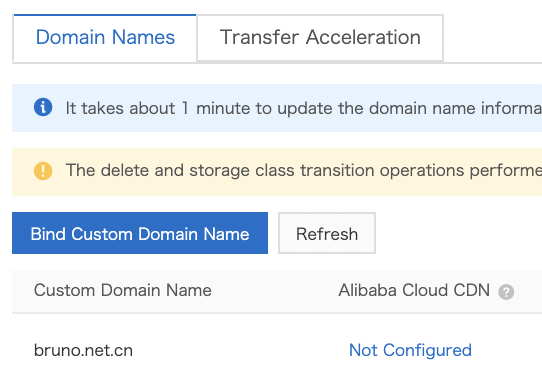{width="1.3576170166229222in"
height="0.9468252405949257in"}

-   \`Domain Name to Accelerate\`: automatically contains the custom
    domain name that is linked to the bucket,

Do not change this value.

-   \`Business Type\`: this is\` \`the type of activity concerning the
    stored content,

-   \`Region\`: this is the region (possible values are \`Mainland China
    Only\`, \`Global \`or \`Global (Excluding Mainland China)\`),

-   \`Origin Servers\`: click on \`Add Origin Server \`and select an OSS
    domain name,

{width="2.598128827646544in"
height="2.957777777777778in"}

-   \`Port\`: this is the access port,

-   Click on \`OK\`,

{width="1.9946062992125984in"
height="1.6954155730533684in"}

-   Click on \`Next\`,

-   You can change the configuration of the CDN,

{width="3.1267924321959755in"
height="2.6317169728783902in"}

-   Click on \`Next\`,

{width="2.909782370953631in"
height="2.2483464566929134in"}

-   Click on \`Return to Domain Names\`.

If your domain name is managed by Alibaba Cloud, a CNAME has been
generated. Otherwise, you need to add a CNAME record to your DNS
provider\'s DNS:

-   Copy the CNAME corresponding to the domain name in CDN,

{width="4.5in"
height="1.0618055555555554in"}

-   Go to the \`Alibaba Cloud DNS \`console,

-   Click on \`Manage DNS\`,

-   Click on \`Configure \`on the line of the domain name,

-   Click on \`Add Record\`,

-   \`Type\`: select \`CNAME\`,

-   \`Host\`: enter the name of the subdomain,

-   \`ISP Line\`: leave the default value,

-   \`Value:\` enter the CNAME value of the CDN,

-   \`TTL:\` leave the default value,

-   Click on \`Confirm\`.

{width="2.8068689851268593in"
height="2.356817585301837in"}

The status of the \`CNAME\` in CDN changes from \`Pending \`to
\`Configured\`:

{width="4.5in"
height="1.0465277777777777in"}

If the domain name is not managed by Alibaba Cloud, you need to do a
verification. The instructions in this case are:

{width="2.8437674978127734in"
height="1.8655643044619423in"}

This check consists in creating a DNS record of type \`TXT\` at your
host on the verification host and containing the specified value:

{width="2.900372922134733in"
height="2.4107108486439195in"}

Automatic cache update (\`Auto\` \`CDN Cache Update\`) for this domain
can be triggered by specific operations.

To enable automatic updating of the CDN cache:

-   Go to the \`OSS \`console,

-   Click on \`Buckets\`,

-   Click on the bucket name,

-   Click on \`Transmission \| Domain Names\`,

{width="4.5in" height="0.9902777777777778in"}

-   Open a ticket,

-   Once the validation is received, click on \`Supported Operations
    \`in the \`Auto CDN Cache Update \`column,

-   Select operations (like \`PutObject\`, \`PostObject\`,
    \`CopyObject\`, \`AppendObject\`, \`PutObjectACL\`, \...),

-   Click on \`OK\`.

{width="1.2284886264216972in"
height="1.0798818897637796in"}

After releasing a custom domain name from a bucket, \`Auto CDN Cache
Update \`cannot be updated in the OSS console but in CDN.

To access the data updated in the CDN cache, you can use the URL in
CNAME/object format but no parameters can be used.

### Use an SSL certificate on a domain host 

To use a custom domain name to access OSS resources via HTTPS, you must
use an SSL certificate. This certificate can be purchased from any
provider.

If you have linked a custom domain name to the bucket, you can host the
certificate in the OSS console:

-   Go to the \`OSS \`console,

-   Click on \`Buckets\`,

-   Click on the bucket name,

-   Select \`Transmission \| Domain Names\`,

-   Click on \`Upload Certificate \`on the line of the domain name,

{width="1.8661297025371828in"
height="0.6952252843394575in"}

-   Enter the private (\`.key \`file) and public (\`.pem \`or \`.rt
    \`file) keys,

-   Click on \`Upload\`.

If you have linked an accelerated domain name to a bucket, you can host
your certificate in CDN:

-   Go to the \`CDN \`console,

-   Click on \`Domain Names\`,

-   Click on \`Manage \`on the line of the domain name,

-   Click on \`HTTPS\`,

-   Click on \`Modify \`next to \`HTTPS Certificate\`,

-   Enable \`HTTPS Secure\`,

-   \`Certificate Source\`: this is the type of certificate to use
    (\`SSL Certificates Service, Custom Certificate (Certificate+Private
    Key)\`, \`Upload Custom Certificate (Certificate)\`, or \`Free
    Certificate\`),

-   Click on \`OK\`.

{width="2.0647922134733157in"
height="2.635158573928259in"}

## The back-to-origin rules 

If an object is not found in a bucket, OSS uses the \`back-to-origin
\`rules if they are defined to request the object from the origin. These
rules can be defined in two ways:

-   mirror-based back-to-origin: objects retrieved from the origin are
    stored in the bucket. This mode is used to migrate to OSS a service
    that is already running on an origin. Back-to-origin rules are used
    to obtain data that is not migrated to OSS.

-   redirection- based back-to-origin: If an object is not found in a
    bucket, OSS redirects the request to the origin. This mode is used
    to redirect requests to different services.

The limit is 20 back-to-origin rules.

### The mirror-based configuration 

The mirroring-based back-to-origin allows to migrate a service that is
already running to OSS without service interruption. They allow to get
the data that is not yet migrated.

To configure a mirror-based back-to-origin rule:

-   Go to the \`OSS \`console,

-   Click on \`Buckets\`,

-   Click on the bucket name,

-   Click on \`Basic Settings \| Back-to-Origin\`,

{width="2.5287937445319337in"
height="0.44800196850393703in"}

-   Click on \`Configure \| Create Rule\`,

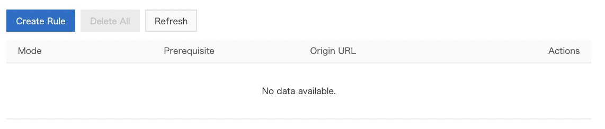{width="2.734847987751531in"
height="0.5845319335083115in"}

-   \`Mode\`: select \`Mirroring\`,

-   \`Prerequisite\`: select \`File Name Prefix\`,

-   \`File Name Prefix\`: this is\` \`the file name prefix (example:
    \`myfolder/\`),

-   \`Origin URL\`: this is the protocol (\`https\`), the domain name
    (\`www.mywebsite.com\`) and the folder,

-   Click on OK.

{width="3.027574365704287in"
height="2.9168449256342956in"}

Once the rule is created, it is displayed in the list:

{width="2.8996587926509187in"
height="0.4761165791776028in"}

When the requester calls
\`https://\<BUCKET_NAME\>.oss-\<REGION\>.aliyuncs.com/\<FOLDER_NAME\>/\<FILENAME\>\`,
if the \`\<FOLDER_NAME\>/\<FILENAME\> \`resource does not exist\` \`in
the \`\<BUCKET_NAME\>\` bucket, OSS sends a request to
\`https://\<DOMAIN_NAME\>/\<FOLDER_NAME\>/\<FILENAME\>.\`

OSS then writes the \`\<FILENAME\> \`object to the \`\<FOLDER_NAME\>\`
folder and returns the object to the requester. If the resource is still
not found, a 404 error is returned.

### The configuration based on redirection 

When developing a new service, you can use the redirection-based
configuration to redirect requests on objects that do not yet exist to
the origin.

To configure a back-to-origin rule based on redirection:

-   Go to the \`OSS \`console,

-   Click on \`Buckets\`,

-   Click on the bucket name,

-   Click on \`Basic Settings \| Back-to-Origin\`,

-   Click on \`Configure \| Create Rule\`,

-   \`Mode\`: select \`Redirection\`,

-   \`Prerequisite\`: two choices are possible:

```{=html}
<!-- -->
```
-   \`HTTP Status Code\`: this is the HTTP status code (from 400 to 599)
    that triggers the redirection,

In general, specify 404.

-   \`File Name Prefix\`: this is the prefix of the file name (example:
    \`myfolder/\`),

```{=html}
<!-- -->
```
-   \`Origin URL\`: select \`Add Prefix or Suffix \`and specify \`https
    \`and \`www.mywebsite.com,\`

-   Click on \`OK\`.

{width="3.421554024496938in"
height="3.28004593175853in"}

The rule now appears in the list of rules:

{width="3.0362674978127733in"
height="0.5355632108486439in"}

If the resource requested by a request
\`https://\<BUCKET_NAME\>.oss-\<REGION\>.aliyuncs.com/\<FOLDER_NAME\>/\<FILENAME\>\`
does not exist, OSS\` \`returns the HTTP code 301 and the redirection
URL \`https://\<DOMAIN_NAME\>/\<FOLDER_NAME\>/\<FILENAME\>.\` The client
that sent the request then accesses this redirection URL.

## Monitoring 

In this section, we will study:

-   OSS logs and notifications, essential for monitoring,

-   execution of log requests in real time,

-   obtaining resource utilization statistics.

### Configure OSS logs 

OSS logs allow to generate logs which are themselves stored in an OSS
bucket.

To configure the logs:

-   Go to the \`OSS \`console,

-   Click on \`Buckets\`,

-   Click on the bucket name,

-   Click on \`Logging \| Logging\`,

-   Click on \`Configure\`,

-   \`Destination Bucket\`: this is the name of the bucket,

-   \`Log Prefix:\` this is the prefix and directory for storing logs,

-   Click on \`Save\`.

{width="2.284134951881015in"
height="1.5541283902012248in"}

### Run log requests in real time 

It is possible to run queries in the console to collect real-time
statistics. The Log service must be enabled and logs must be allowed to
access OSS.

The real-time log query allows to consult the logs of the last seven
days for free. Beyond this period, fees are charged.

To enable or disable real-time log viewing when creating a bucket:

-   Go to the \`OSS \`console,

-   Click on \`Create Bucket\`,

-   \`Real-time Log Query\`: select \`Enable \`to activate the feature,
    \`Disable \`to deactivate it,

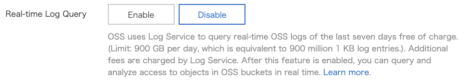{width="2.40624343832021in"
height="0.43594597550306213in"}

-   Click on \`OK\`.

To allow the consultation of logs in real time on a bucket already
created:

-   Go to the \`OSS \`console,

-   Click on \`Buckets\`,

-   Click on the bucket name,

-   Click on \`Logging \| Real-time Log Query\`,

-   Click on \`Activate Now\`.

{width="2.2470199037620295in"
height="1.042020997375328in"}

To query the logs in real time:

-   Go to the \`OSS \`console,

-   Click on \`Buckets\`,

-   Click on the bucket name,

-   Click on \`Logging \| Real-time Log Query,

-   \`To access the log data, click on the \`Original Log \`tab,

-   To access the dashboard, click on the \`Dashboard \`tab.

{width="3.640670384951881in"
height="2.4327318460192475in"}

In the case of setting up on the \`Dashboard \`page, the displayed
dashboard offers four reports:

-   \`Access Center\`: displays the general status (PV, UV, traffic,
    Internet access distribution),

-   \`Audit Center\`: displays statistics on operations on objects,

-   \`Operation Center\`: displays statistics on access logs, including
    the number of requests and the distribution of failed operations,

-   \`Performance Center: \`displays performance statistics (downloads,
    uploads, \...).

### View resource usage statistics 

Basic Statistics are not available in all regions.

To view resource usage:

-   Go to the \`OSS \`console,

-   Click on \`Buckets\`,

-   Click on the bucket name,

-   Click on \`Data Usage \| Basic Statistics\`,

-   The graph on the buckets displays:

```{=html}
<!-- -->
```
-   \`Standard-Actual Storage Usage\`: this is the total storage of the
    Standard bucket,

-   \`Storage Usage\`: this is the total storage of the bucket,

-   \`Billed Storage Usage: \`this is the billed storage of the bucket,

{width="4.5in"
height="1.3388888888888888in"}

-   The Traffic \`Usage \`graph displays:

```{=html}
<!-- -->
```
-   \`CDN Inbound\`: this is the traffic generated when you use the CDN
    to upload files to OSS,

-   \`CDN Outbound\`: this is the traffic generated when you use the CDN
    to download or browse objects in OSS,

-   \`Internet Inbound\`: this is the traffic generated when you upload
    files to OSS via the Internet,

-   \`Internet Outbound\`: this is the traffic generated when accessing
    OSS or downloaded data via the Internet,

-   \`Intranet Inbound\`: this is the traffic generated when you upload
    data to OSS via the internal network,

-   \`Intranet Outbound\`: this is the traffic generated when accessing
    OSS or downloaded data via the internal network,

-   \`Cross-region Replication\`: this is the traffic generated when you
    use CRR to copy data from the source bucket to the destination
    bucket.

{width="4.5in"
height="1.288888888888889in"}

-   The requests per hour graph shows the number of bucket access
    requests per hour (\`5XX\` errors, \`PUT \`requests and \`GET
    \`requests).

```{=html}
<!-- -->
```
-   \`5XX Error: \`corresponds to HTTP status codes 501, 502 and 503,

-   \`PUT Request\`: \`PUT \`requests (\`PutBucket\`, \`GetService\`,
    \...),

-   \`GET Request\`: \`GET \`requests (\`GetBucketInfo\`,
    \`GetBucketAcl\`, \...).

{width="4.5in" height="1.4722222222222223in"}

### Send event notification 

Event notifications are broadcast in real time when operations are
performed on OSS resources:

-   upload new data to OSS,

-   update content,

-   deletion objects,

-   synchronization completed.

Notification is not available in all regions.

To set up an event notification:

-   Go to the \`OSS \`console,

-   Click on \`Buckets\`,

-   Click on the bucket name,

-   Click on \`Basic Settings \| Event Notification \| Configure \|
    Create Rule\`,

-   \`Rule Name: \`this is\` \`the name of the rule,

-   \`Events\`: these are the events that trigger a notification,

-   \`Resource Description\`: this is\` \`the transmitted text:

```{=html}
<!-- -->
```
-   \`Full Name\`: this is the complete path of an object,

-   \`Prefix:\` this is the prefix of the object,

-   \`Suffix\`: this is the suffix of the object,

```{=html}
<!-- -->
```
-   \`Endpoint\`: these are the endpoints where to send notifications,

-   Click on \`OK\`.

These notifications generate a message published in an MNS topic.

## Inter-regional replication 

Cross-region replication (CRR) allows automatic and asynchronous
replication of buckets located in different regions. The metadata of the
bucket are preserved.

This helps to meet disaster recovery or data replication requirements.
The objects in the destination bucket are additional replicas of the
objects in the source bucket.

To activate CRR:

-   Go to the \`OSS \`console,

-   Click on \`Buckets\`,

-   Click on the bucket name,

-   Click on \`Redundancy for Fault Tolerance \| Cross-Region
    Replication\`,

-   Click on \`Configure\`,

{width="2.924772528433946in"
height="0.6874114173228346in"}

-   Click on \`Cross-Region Replication\`,\`

{width="2.9825699912510935in"
height="0.779242125984252in"}

-   Source Region\`: this is\` \`the region where the current bucket is
    located (cannot be changed),

-   \`Source Bucket\`: this is the name of the current bucket (cannot be
    changed),

-   \`Destination Region\`: this is\` \`the region where the destination
    bucket is located,

The region of the origin bucket and the region of the destination bucket
cannot be the same.

-   \`Destination Bucket\`: this is the name of the destination bucket,

-   \`Acceleration Type\`: \`Transfer Acceleration\` must be enabled in
    the relevant regions,

-   \`Applied To\`: these are the source data to be synchronized:

```{=html}
<!-- -->
```
-   \`All Files in Source Bucket\`: synchronizes all objects,

-   \`Files with Specified Prefix\`: synchronizes objects that have the
    prefix specified,

It is possible to specify up to 10 tags that the objects must have.

Versioning must be enabled on the source and destination buckets.

-   \`Operations\`: this is the synchronization policy:

```{=html}
<!-- -->
```
-   \`Add/Change\`: synchronizes only the added or changed data,

-   \`Add/Delete/Change\`: synchronizes all data changes (create,
    overwrite, delete),

```{=html}
<!-- -->
```
-   \`Replicate Historical Data\`: indicates if historical data should
    be synchronized before activating CRR,

-   \`KMS-based Encryption\`: uses the CMK (Customer Master Key) of
    SSE-KMS to generate keys to encrypt data:

```{=html}
<!-- -->
```
-   \`CMK ID\`: this is the ID of the CMK key used for encryption,

This CMK must be in the same region as the destination bucket.

-   \`Authorized RAM Role\`: this\` \`is the role to use: \`New RAM Role
    \`(a new RAM role is created) or \`AliyunOSSRole \`(if this role
    does not exist, it is created),

```{=html}
<!-- -->
```
-   Click on \`OK\`.

{width="2.8157895888013997in"
height="2.7401804461942256in"}

Once configured, CRR rules cannot be changed or deleted.

However, it is possible to disable CRR. The replicated data remains
stored in the destination bucket. Incremental data in the source bucket
is not replicated.

## Image processing 

OSS allows to protect the images from being used by unauthorized
anonymous persons.

With this protection, anonymous people can only access these requests by
using style parameters or by using signed URLs.

Thus, queries of the type \`https://bucketname.\<endpoint\>/objectname
\`are no longer accessible. However, the following query types are
operational:

-   queries with a style parameter:
    \`https://bucketname.\<endpoint\>/objectname?x-oss-process=style/\<StyleName\>,\`

-   queries with a delimiter:
    \`https://bucketname.\<endpoint\>/objectname\<Delimiter\>\<StyleName\>,\`

-   queries with a signature:
    \`https://bucketname.\<endpoint\>/objectname?OSSAccessKeyId=\<ACCESS_KEY\>&Expires=\<EXPIRES\>&Signature=\<SIGNATURE\>.\`

To configure image source protection:

-   Go to the \`OSS \`console,

-   Click on \`Buckets\`,

-   Click on the bucket name,

-   Click on \`Data Processing \| Image Processing (IMG)\`.

The list of rules is then displayed:

{width="3.076398731408574in"
height="1.5714326334208224in"}

They are based on the prefix or suffix of the image objects to protect.
The comparison can be case sensitive or not.

To create a rule:

-   Go to the \`OSS \`console,

-   Click on \`Buckets\`,

-   Click on the bucket name,

-   Click on \`Data Processing \| Image Processing (IMG)\`,

-   Click on \`Create Rule\`.

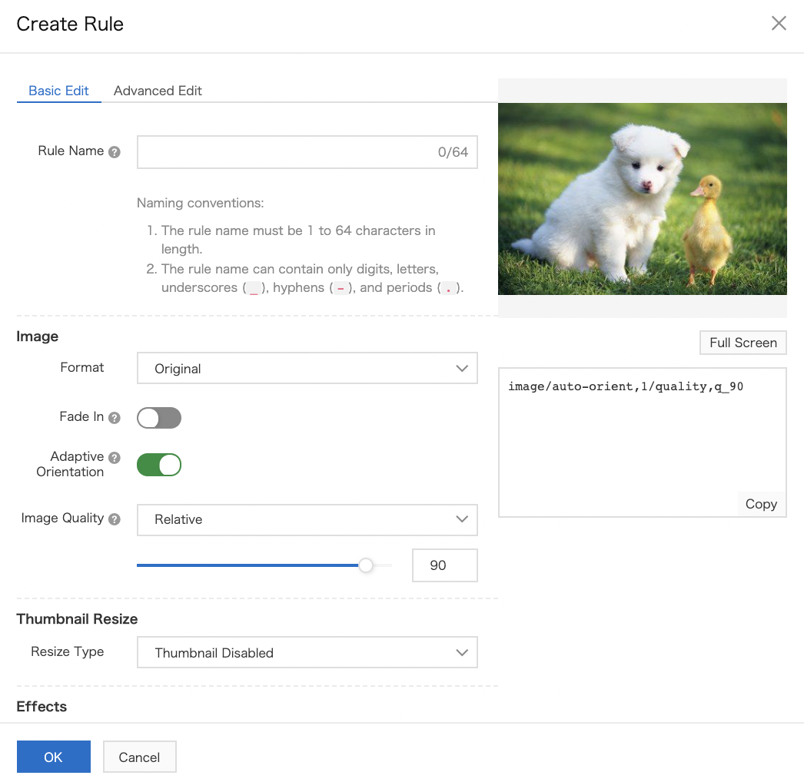{width="3.145638670166229in"
height="3.06165791776028in"}

To set up protected images:

-   Go to the \`OSS \`console,

-   Click on \`Buckets\`,

-   Click on the bucket name,

-   Click on \`Data Processing \| Image Processing (IMG)\`,

-   Click on \`Access Settings\`.

{width="3.080297462817148in"
height="1.3500076552930884in"}

# CDN 

CDN (Content Delivery Network) is a distributed network composed of
clusters of edge node servers distributed in different regions.
EdgeScript allows to customize the operation of CDN by running a script.
EdgeRoutine is a serverless environment for running JavaScript code on
CDN nodes.

CDN is an optimized alternative to web servers. Static resources are
cached on the edge node while dynamic resources use dynamic acceleration
to be faster.

The origin server is the server from which the CDN obtains resources.
The origin host is the domain name of the origin server to which Alibaba
Cloud CDN initiates back-to-source requests. When a request with a URL
containing \`? \`followed by parameters is sent to a CDN node, CDN uses
a filter to determine if it should send it to the origin server. When a
requested resource is not cached on a CDN node, that node retrieves that
resource from the origin server according to the origin protocol policy
and then caches that resource on the node. Cached resources can be
refreshed and prefetched.

HTTPS acceleration is used to encrypt data between clients and CDNs. You
can specify the version of TLS used. It is possible to force a
redirection of client requests to HTTP or HTTPS.

CDN supports HTTP/2 and OCSP stapling. It allows to validate
certificates by retrieving information from the certification authority.
It also supports HSTS. It allows to force clients to connect with HTTPS.
CDN supports SNI. SNI allows the client to determine the hostname to
connect to during a connection. It is an extension of TLS (Transport
Layer Security).

Back-to-origin request headers and responses can be customized. The
timeout of the requests can also be specified. Rewrite rules allow to
rewrite URIs of back-to-origin requests. Cache expiration rules allow
you to set a TTL value for static resources cached on CDNs. The HTML
page displayed corresponding to the HTTP 404 code can be customized.

Access to resources can be controlled by several techniques:

-   by a hotlink protection,

-   by signing the URL,

-   by remote authentication,

-   by a white or black list of IP addresses,

-   by whitelisting or blacklisting HTTP \`User-Agent \`headers.

There are several optimization techniques:

-   Intelligent compression compresses text files.

-   Page optimization removes redundant content from web pages.

-   The new Brotli compression compresses text files more efficiently
    than intelligent compression.

CDN supports video delivery. Object chunking allows the origin server to
send back only pieces of the requested files in order to reduce network
traffic at the back-to-origin level and response time. It also allows to
position yourself directly at a specified position in the video.

Resource monitoring allows for the collection of data on resource usage
based on client IP addresses, geographic locations and ISPs (Internet
Service Providers). It is also possible to obtain statistics on CDN
usage and billing elements. CDN provides logs to help you solve
problems.

## Basic and origin server configuration 

To change the basic information of the CDN service:

-   Go to the \`Alibaba Cloud CDN \`console,

-   Click on \`Domain Names\`,

-   Click on \`Manage \`on the line of the domain name,

{width="4.5in" height="1.101388888888889in"}

-   Click on \`Modify \`next to \`Region\`,

{width="1.7736034558180227in"
height="0.4787095363079615in"}

-   Select the accelerated region:

```{=html}
<!-- -->
```
-   \`Mainland China Only\`: you need to apply for an ICP (Internet
    Content Provider) number from MIIT (Ministry of Industry and
    Information Technology) for the domain name,

-   \`Global\`: you must follow the same procedure as for the Mainland
    China Only choice,

-   \`Global (Excluding Mainland China)\`: PKI number is not required,

```{=html}
<!-- -->
```
-   Click on \`OK\`.

{width="2.365634295713036in"
height="1.8859350393700787in"}

Alibaba Cloud CDN supports the following types of origin servers:

-   OSS endpoints,

-   IP addresses,

-   domain names,

-   Function Compute domain names.

It is possible to specify several IP addresses or domain names, each of
which has a priority (\`Primary \`or \`Secondary\`). If several entries
have the same priority, the round robin algorithm is used.

Layer 4 Health Checks are performed on the origin servers on the
specified port (80 or 443 by default) at a frequency of 2.5 seconds. In
case of three consecutive failures, the origin server is considered
unavailable.

Alibaba Cloud CDN can then switch between the primary and secondary
origin servers.

Once the primary origin server is available again, the switchover is
cancelled.

To configure an origin server:

-   Go to the \`Alibaba Cloud CDN \`console,

-   Click on \`Domain Names\`,

-   Click on \`Manage \`on the line of the domain name,

{width="4.5in" height="1.101388888888889in"}

-   Click on \`Modify \`on the line of the origin,

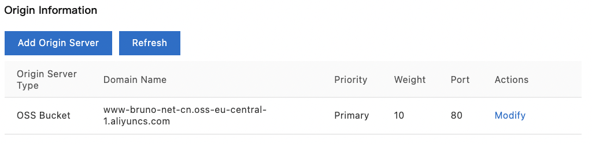{width="2.7657141294838143in"
height="0.6752088801399825in"}

-   \`Origin Info\`:

```{=html}
<!-- -->
```
-   \`OSS Domain\`: this is the public endpoint of an OSS bucket,

-   \`IP\`: these are the public IP addresses of the servers,

-   \`Site Domain\`: these are the domain names of the origin servers,

The domain name of the origin server must be different from the domain
name to be accelerated.

-   \`Function Compute Domain\`: this is the domain name of Function
    Compute; you must specify the region,

```{=html}
<!-- -->
```
-   \`Priority\`: this is the priority (\`Primary\` or\` Secondary\`),\`

-   Weight\`: this is the weight,\`

-   Port\`: this is the port:

```{=html}
<!-- -->
```
-   \`Port 80\`: uses port 80 on HTTP or HTTPS,

-   \`Port 443\`: uses port 443 on HTTP or HTTPS,

If the origin server\'s IP address is associated with multiple domain
names, you must configure SNI (Server Name Indication).

-   Custom port: redirects HTTP requests to origin servers on custom
    ports,

To redirect HTTPS requests, you must open a ticket. It is necessary to
disable the origin protocol policy.

-   Click on \`OK\`.

{width="2.039819553805774in"
height="1.7521052055993in"}

## HTTPS acceleration 

HTTPS allows for secure data transmission between clients and servers
using the SSL (Secure Sockets Layer) protocol.

In this section, we will study:

-   HTTPS acceleration, which enables data encryption between clients
    and CDNs,

-   the certificate configuration,

-   enabling HTTP/2,

-   the configuration of the OCSP stapling which allows to validate the
    certificates by retrieving information from the CA,

-   forcing redirection of client requests,

-   the configuration of the CDN\'s TLS version control in order to
    secure the data exchange between two applications,

-   HSTS to force clients to connect with HTTPS.

### Enable HTTPS secure acceleration 

HTTPS (Hyper Text Transfer Protocol over Secure Socket Layer) is a
secure HTTP channel. It encapsulates HTTP with the SSL/TLS protocol. Its
interest is the protection against attacks.

HTTPS acceleration enables data encryption between clients and CDNs. The
request is encrypted at the CDNs. These CDNs then access the resources
of the origin server based on the configuration of the origin server.

The encryption of a HTTPS request follows the following process:

-   The server sends its public certificate to the client.

-   The client checks the certificate (validity period, reliability of
    the certificate\'s CA, correspondence of the domain name in the
    server\'s certificate with the real domain name, etc.).

-   If the certificate is validated, the client encrypts a randomly
    generated number with the public key and transfers it to the server.

-   The server uses the secret key to decrypt and recover the random
    number that was encrypted.

-   The server encrypts the transmitted data using the retrieved random
    number.

-   The client decrypts the received data using this same random number.

The certificate update takes effect in less than a minute.

To use the acceleration feature, you must upload a certificate and its
secret key in PEM format. The secret key with a password is not
available.

### Configure the certificate 

HTTPS acceleration requires the use of an SSL (Secure Sockets Layer)
certificate. Several formats are supported:

-   Certificates issued by a root CA (Apache, Nginx, \...): their
    extension is \`.crt \`and \`.key\`,

-   Intermediate CA certificates: it contains several certificates,

-   RSA (Rivest, Shamir, Adleman) private keys: their extension is
    \`.pem \`or \`.key\`.

Alibaba Cloud CDN uses certificates issued by the root CA Nginx.

For RSA, you must first generate a \`.pem \`private key:

\`openssl genrsa -out key.pem 2048

\`Then you must add at the beginning of the file \`\-\-\-\--BEGIN
PRIVATE KEY\-\-\-\-- \`and at the end of the file \`\-\-\-\--END RSA
PRIVATE KEY\-\-\-\--:\`

\`openssl rsa -in key.pem -out new_key.pem

\`Alibaba Cloud CDN only supports SSL certificates in PEM
(Privacy-Enhanced Mail) format.

There are different levels of certificate validation:

-   a Domain Validated (DV) certificate,

```{=html}
<!-- -->
```
-   It allows to verify the ownership of a domain name.

```{=html}
<!-- -->
```
-   a validated organization (OV),

```{=html}
<!-- -->
```
-   This is a standard SSL certificate.

-   It allows to verify the identity of an organization.

-   It provides a higher level of confidence than a DV certificate.

-   It is suitable for e-commerce websites,

```{=html}
<!-- -->
```
-   Extended Validation (EV).

```{=html}
<!-- -->
```
-   It follows the guidelines issued by CA/Browser Forum.

-   It is suitable for financial areas.

To specify a certificate:

-   Go to the \`Alibaab Cloud CDN \`console,

-   Click on \`Domain Names\`,

-   Click on \`Manage \`on the line of the domain name,

{width="4.5in" height="1.101388888888889in"}

-   Click on the \`HTTPS \`tab,

-   Click on \`Modify \`next to \`HTTPS Certificate\`,

{width="3.3833497375328085in"
height="0.9194564741907262in"}

-   Enable \`HTTPS Secure\`,

-   \`Certificate Source\`: this is the source of the certificate;
    supported values are \`SSL Certificates Service\`, \`Custom
    Certificate (Certificate+Private Key\`, \`Upload Custom Certificate
    (Certificate)\`, \`Free Certificate\`,

-   \`Certificate Name \`(depending on the certificate source): this is
    the name of the certificate (for \`SSL Certificates Service \`and
    \`Custom Certificate (Certificate+Private Key)\`),

-   \`Certificate (Public Key) \`(depending on the source of the
    certificate): this is the public key (for \`Custom Certificate
    (Certificate+Private Key) \`or \`Upload Custom Certificate
    (Certificate)\`),

-   \`Private Key \`(depending on the certificate source): this is the
    private key (for \`Custom Certificate (Certificate+Private Key)\`),

-   Click on \`OK\`.

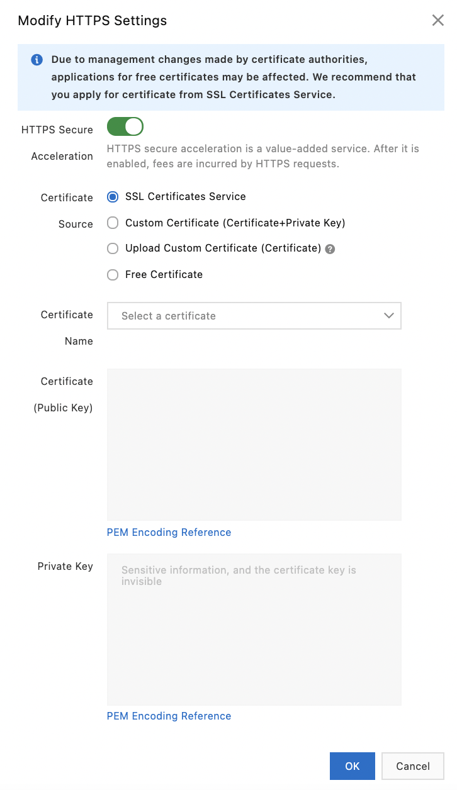{width="2.0719969378827647in"
height="3.5848972003499564in"}

Certificate sources can be:

-   \`SSL Certificates Service\`:

```{=html}
<!-- -->
```
-   This service allows to request certificates from different
    suppliers.

```{=html}
<!-- -->
```
-   \`Custom Certificate (Certificate+Private Key):

```{=html}
<!-- -->
```
-   \`It allows to upload a custom certificate with its private key to
    the \`SSL Certificates Services\`.

```{=html}
<!-- -->
```
-   \`Upload Custom Certificate (Certificate):\`

```{=html}
<!-- -->
```
-   It allows to upload a certifcat without its private key for security
    reasons.

-   You then need to create a CSR (Certificate Signing Request) in the
    Alibaba Cloud CDN console and request a certificate from a
    Certificate Authority (CA).

```{=html}
<!-- -->
```
-   \`Free Certificate:\`

```{=html}
<!-- -->
```
-   These are free SSL certificates valid for one year and are used only
    for HTTPS acceleration.

-   The overall delay can be up to a few days.

### Enable HTTP/2 

HTTP/2, released in 2015, is available on many browsers. Its main
advantages of HTTP/2 are:

-   Multiplexing allows the browser to download all the resources needed
    to display the page with a single request.

-   The volume of data exchanged is reduced by using HTTP header
    compression.

-   The transmission of data in binary is less prone to errors than the
    transmission in text.

-   HTTP/2 Server Push allows resources to be attached to requests. This
    allows certain unsolicited files to be preloaded by the browser,
    improving the responsiveness of these Web sites.

To enable HTTP/2:

-   Go to the \`Alibaba Cloud CDN \`console,

-   Click on \`Domain Names\`,

-   Click on a domain name,

-   Click on \`Manage \`on the line of the domain name,

{width="4.5in" height="1.101388888888889in"}

-   Click on the \`HTTPS \`tab,

-   Enable \`HTTP/2\`.

{width="3.1488768591426073in"
height="0.5141218285214348in"}

HTTPS certificates must be configured.

### Configure OCSP stapling 

OCSP stapling allows certificates to be validated by retrieving
information from the CA. This information is then cached to reduce
latency for certificate validation requests.

To configure OCSP stapling:

-   Go to the \`Alibaba Cloud CDN \`console,

-   Click on \`Domain Names\`,

-   Click on \`Manage \`on the line of the domain name,

-   Click on the \`HTTPS \`tab,

-   Enable \`OCSP stapling\`.

{width="1.103701881014873in"
height="0.3804024496937883in"}

### Configure forced redirection 

It is possible to force a redirection of a client\'s requests. Several
types are supported:

-   \`Default \`(not default),

-   \`HTTP -\> HTTPS: \`requests are redirected to HTTPS,

-   \`HTTPS -\> HTTP: \`requests are redirected to HTTP.

To manage the forced redirection:

-   Go to the \`Alibaba Cloud CDN \`console,

-   Click on \`Domain Names\`,

-   Click on \`Manage \`on the line of the domain name,

-   Click on the \`HTTPS \`tab,

-   Click \`Modify \`next to \`Force Redirect\`,

{width="2.5059722222222223in"
height="0.4629090113735783in"}

-   \`Redirect Type\`: this is the type of redirection,

-   Click on \`OK\`.

{width="2.155071084864392in"
height="0.9355271216097988in"}

### Configure TLS 

TLS (Transport Layer Security) version control of Alibaba Cloud CDN
enables secure data exchange between two applications. HTTPS (HTTP over
TLS) is an application of TLS. The version of TLS can be configured
based on the domain name.

To enable TLS:

-   Go to the \`Alibaba Cloud CDN \`console,

-   Click on \`Domain Names\`,

-   Click on \`Manage \`on the line of the domain name,

-   Click on the \`HTTPS \`tab,

-   Enable or disable TLS versions (\`TLSv1.0\`, \`TLSv1.1\`, \`TLSv1.2
    \`or \`TLSv1.3\`).

{width="2.6479811898512686in"
height="0.8025667104111986in"}

### Configure HSTS 

HSTS (HTTP Strict Transport Security) allows to force clients to connect
with HTTPS. However, it does not protect against cookie hijacking.

HTTP requests are then redirected to HTTPS URLs with HTTP status codes
301 and 302.

Usually, requests cannot be sent to the origin server because they can
be hijacked during redirection. HSTS solves this problem. When the
browser receives a HTTP request, if the HSTS header for the domain name
does not expire, the browser redirects the request to HTTPS with the
HTTP status code 307 (\"Temporary Redirect\").

The format of the HSTS header is
\`Strict-Transport-Security:max-age=expireTime \[;includeSubDomains\]
\[;preload\]\`.

\`max-age \`defines the maximum duration (in seconds) of caching of the
resource.

\`includeSubDomains \`(optional) specifies that the setting applies to
subdomains.

\`preload \`(optional) adds the domain name to the browser\'s preloaded
HSTS list.

To activate HSTS:

-   Go to the \`Alibaba Cloud CDN \`console,

-   Click on \`Domain Names\`,

-   Click on \`Manage \`on the line of the domain name,

-   Click on the \`HTTPS \`tab,

-   Click on \`Modify \`next to \`HSTS\`,

{width="2.772764654418198in"
height="0.5442825896762905in"}

-   Activate \`HSTS\`,

-   \`Expire In\`: this is the length of time the HSTS response is
    cached in the browser (from 0 to 730 seconds),

-   \`Include Subdomains\`: include subdomains; HTTPS must be enabled
    for all subdomains,

-   Click on \`OK\`.

{width="2.380007655293088in"
height="1.9065769903762029in"}

However, before HSTS is enabled, the first HTTP request is redirected to
HTTPS with HTTP status code 301 or 302.

## Back-to-origin configuration 

The origin host is the domain name of the origin server to which Alibaba
Cloud CDN initiates back-to-source requests.

In this section, we will study:

-   configuration of an origin host,

-   configuration of the associated protocol policy,

-   configuration of a back-to-origin authorization for private buckets
    and disabling it,

-   SNI configuration, which allows the client to determine the host
    name to connect to when making a connection,

-   configuration of the timeout of back-to-origin requests,

-   customization of HTTP headers sent by the CDN to origin servers and
    HTTP headers of back-to-origin requests,

-   configuration of the rewriting of URIs and parameters.

### Configure an originating host 

The origin host is the domain name of the origin server to which Alibaba
Cloud CDN initiates back-to-source requests. This server can be
customized. The following domain name types are supported:

-   accelerated domain names,

-   origin domain names,

-   customized domain names.

If more than one domain name is used, requests may include a different
originating host.

The origin host defines a site that is hosted on a specific IP address
while the origin server defines the IP address to which back-to-origin
requests are redirected.

To configure an originating host:

-   Go to the \`Alibaba Cloud CDN \`console,

-   Click on \`Domain Names\`,

-   Click on \`Manage \`on the line of the domain name,

-   Click on the \`Back-to-origin \`tab,

-   Click on \`Modify \`next to \`Origin Host\`,

{width="3.371597769028871in"
height="0.5317541557305336in"}

-   Enable \`Origin Host\`,

-   \`Domain Type\`: this\` \`is the type of domain:

```{=html}
<!-- -->
```
-   \`CDN Domain\`: specifies the accelerated domain name used as the
    origin host,

-   \`Origin Domain\`: specifies the domain name of the origin server
    used as the origin host; Alibaba Cloud CDN uses this domain name to
    retrieve content from the origin server,

-   \`Custom Domain\`: specifies the custom domain name used as the
    originating host.

{width="2.1459317585301836in"
height="1.4306211723534559in"}

### Configure the origin protocol policy 

When a request asks for a resource that is not cached on a CDN node,
that node retrieves that resource from the origin server according to
the origin protocol policy and then caches that resource on the node.

To configure the origin protocol policy:

-   Go to the \`Alibaba Cloud CDN \`console,

-   Click on \`Domain Names\`,

-   Click on \`Manage \`on the line of the domain name,

-   Click on the \`Back-to-origin \`tab,

-   Enable \`Origin Protocol Policy\`,

-   Click on \`Modify\`,

{width="2.966251093613298in"
height="0.4499726596675416in"}

-   \`Redirect \`Type: this is the type of redirection:

```{=html}
<!-- -->
```
-   \`Follow\`: CDN nodes communicate with the origin server using the
    protocol used by the client,

-   \`HTTP\`: HTTP CDNs communicate with origin servers only via HTTP,

-   \`HTTPS\`: CDN nodes communicate with origin servers only via HTTPS,

```{=html}
<!-- -->
```
-   Click on \`OK\`.

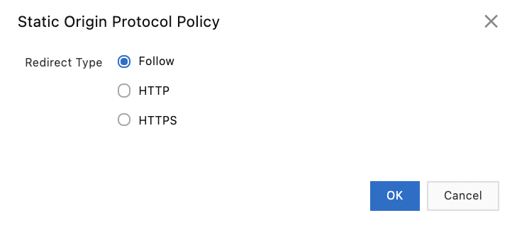{width="2.017419072615923in"
height="0.8885356517935258in"}

### Configure back-to-origin authorization for private buckets 

\`Back-to-origin \`authorization for private buckets allows traffic to
be forwarded from a CDN domain to a private bucket. To secure resources,
you can use hotlink protection and URL signing.

If the website is at risk of attack, it is recommended to purchase the
Anti-DDoS service and not to activate the private bucket authorization.

To enable back-to-origin authentication for a private bucket:

-   Go to the \`Alibaba Cloud CDN \`console,

-   Go to the \`Domain Names \`console,

-   Select the domain name,

-   Click on \`Manage \`on the line of the domain name,

-   Click on the \`Back-to-origin \`tab,

-   In the \`Alibaba Cloud OSS Private Bucket Access \`section, click on
    \`Authorize\`,

-   Confirm authorization.

-   Reload the page.

-   Activate \`Alibaba Cloud OSS Private Bucket Access\`.

The \`AliyunCDNAccessingPrivateOSSRole \`authorization policy is
authorized.

### Disable access to private buckets 

An accelerated domain name that uses a private bucket needs to have
access authorization to that bucket.

To revoke this authorization:

-   Go to the \`RAM \`console,

-   Click on \`Identities \| Roles\`,

-   Search for the \`AliyunCDNAccessingPrivateOSSRole\`,

-   Click on this role,

{width="3.7236187664041993in"
height="1.7043602362204724in"}

-   Click on \`Remove Permission \`on the line of the role,

-   Click on \`OK\`,

{width="3.25492125984252in"
height="1.5315212160979879in"}

-   Click on \`Identities \| Roles\`,

-   Search for the \`AliyunCDNAccessingPrivateOSSRole\`,

-   Click on \`Delete \`on the line of the role,

-   Click on \`OK\`.

{width="3.4877230971128608in"
height="1.6028455818022747in"}

### Configure SNI 

SNI (Server Name Indication) allows the client to determine the host
name to connect to during a connection. It is an extension of TLS
(Transport Layer Security).

With SNI, it is possible to host multiple HTTPS sites using different
certificates on the same IP address and port.

SNI integrates the destination domain name during requests from CDN
nodes to the origin server via HTTPS.

SNI is useless if the origin server is a bucket.

To configure SNI:

-   Go to the \`Alibaba cloud CDN \`console,

-   Click on \`Domain Names\`,

-   Click on \`Manage \`on the line of the domain name,

-   Click on the \`Back-to-origin \`tab,

-   Click on \`Modify \`next to \`Origin SNI\`,

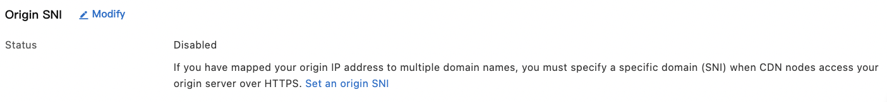{width="3.807574365704287in"
height="0.4448053368328959in"}

-   Activate \`Origin SNI\`,

-   \`SNI:\` this is the domain name served by the origin server,

-   Click on \`OK\`.

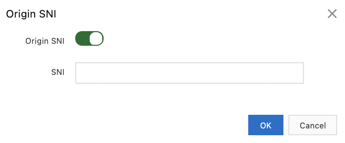{width="1.7035575240594925in"
height="0.7092902449693789in"}

### Specify the timeout for back-to-origin requests 

The timeout of back-to-origin requests corresponds to the maximum time a
node must wait to obtain the results of its requests to the origin
servers. It happens when the requested resource is not in the cache.

This timeout is 30 seconds by default and is a maximum of 900 seconds.
After this time, if the CDN has not received a response, it disconnects
from the origin server.

To specify the timeout for back-to-origin requests:

-   Go to the \`Alibaba Cloud CDN \`console,

-   Click on \`Domain Names\`,

-   Click on \`Manage \`on the line of the domain name,

-   Click on the \`Back-to-origin \`tab,

-   Click on \`Modify \`next to \`Back-to-origin Request Timeout\`,

{width="3.0821773840769904in"
height="0.43331255468066493in"}

-   \`Timeout Value\`: this is the timeout value,

-   Click on \`OK\`.

{width="2.0651509186351706in"
height="0.8107633420822398in"}

### Customize the HTTP headers sent by the CDN to the origin servers 

It is possible to add or remove HTTP headers in requests sent by Alibaba
Cloud CDN to origin servers.

To customize these HTTP headers:

-   Go to the \`Alibaba Cloud CDN \`console,

-   Click on \`Domain Names\`,

-   Click on \`Manage \`on the line of the domain name,

-   Click on the \`Back-to-origin \`tab,

-   Click on the \`Custom Request Header \`tab,

-   Click on \`Customize\`,

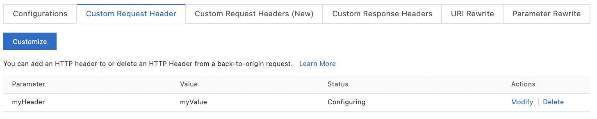{width="3.7743405511811026in"
height="0.7571981627296588in"}

-   \`Parameter\`: select \`Custom Origin Header \`from the list,

-   \`Value:\` this is the value of the parameter,

-   Click on \`OK\`.

{width="1.6247014435695537in"
height="0.6942596237970253in"}

### Customize HTTP headers for back-to-origin requests 

It is possible to customize the HTTP headers of back-to-origin requests:

-   Go to the \`Alibaba Cloud CDN \`console,

-   Click on \`Domain Names\`,

-   Click on \`Manage \`on the line of the domain name,

-   Click on the \`Back-to-origin \`tab,

-   Click on the \`Custom Request Headers (New) \`tab,

-   Click on \`Customize\`,

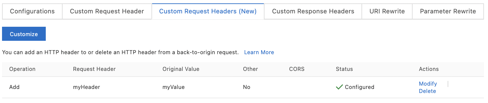{width="4.5in" height="0.9555555555555556in"}

-   \`Operation\`: select the operation (possible values are \`Add\`,
    \`Delete\`, \`Change\`, \`Replace\`),

-   Click on \`OK\`.

{width="2.1586373578302713in"
height="1.2572058180227472in"}

If several operations are performed on the same header, they are
performed in the following order of priority: \`Replace\`, \`Add\`,
\`Change \`and \`Delete\`.

It is also possible to customize the headers of HTTP responses:

-   Go to the \`Alibaba Cloud CDN \`console,

-   Click on \`Domain Names\`,

-   Click on \`Manage \`on the line of the domain name,

-   Click on the \`Back-to-origin \`tab,

-   Click on the \`Custom Response Headers \`tab,

-   Click on \`Customize\`,

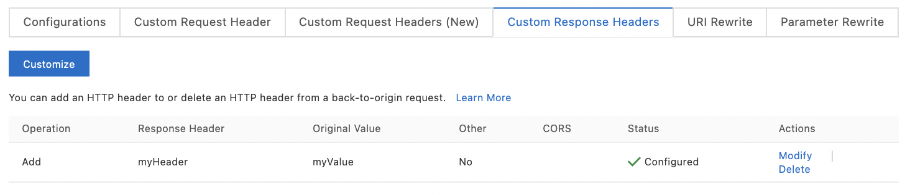{width="4.5in" height="0.9715277777777778in"}

-   \`Operation\`: this is the operation (possible values are \`Add\`,
    \`Delete\`, \`Change\`, \`Replace\`),

-   Click on \`OK\`.

{width="2.133264435695538in"
height="1.234199475065617in"}

Domain names with a wildcard are not supported.

### Configure the rewrite of URIs and parameters 

It is possible to rewrite the URI of back-to-origin requests by creating
rules. This is useful when the URIs are different on the origin server.

To create a URI rewrite rule:

-   Go to the \`Alibaba Cloud CDN \`console,

-   Click on \`Domain Names\`,

-   Click on \`Manage \`on the line of the domain name,

-   Click on the \`Back-to-origin \`tab,

-   Click on the \`URI Rewrite \`tab,

-   Click on \`Add\`,

{width="4.5in"
height="1.2027777777777777in"}

-   \`Original URI:\` this is the source URI (example: \`\^/hello\$\`),

-   \`Final URI:\` this is the target one (example: \`/hello/world\`),

-   \`Flag\`: specifies the behavior when a rule is satisfied and
    several rules have been configured:

```{=html}
<!-- -->
```
-   \`None\`: continues the evaluation of the rules,

-   \`break:\` stops the evaluation of the rules and rewrites the URI
    without its parameters,

-   \`enhance break:\` stops the evaluation of the rules and rewrites
    the URI and its parameters,

```{=html}
<!-- -->
```
-   Click on \`OK\`.

{width="2.2096008311461066in"
height="1.7724540682414698in"}

The URI must start with \`/ \`but must not include \`http:// \`or the
domain name.

The maximum is 50 URI rewriting rules.

To change the parameters in the URLs of back-to-origin requests, you can
create rules to rewrite the parameters:

-   Go to the \`Alibaba Cloud CDN \`console,

-   Click on \`Domain Names\`,

-   Click on \`Manage \`on the line of the domain name,

-   Click on the \`Back-to-origin \`tab,

-   Click on the \`Parameter Rewrite \`tab,

{width="4.5in"
height="0.6402777777777777in"}

-   Activate \`Rewrite Parameters\`,

-   Specify the parameters,

-   Click on \`OK\`.

{width="2.136632764654418in"
height="2.4670199037620297in"}

The rewriting of URIs and parameters can have conflicts between them.

## The cache 

In this section, we will study:

-   creating an expiration rule for the cache,

-   creation of a cache expiration rule for HTTP status codes,

-   creation of a URI rewriting rule,

-   customization of the 404 \"not found\" page,

-   definition of the HTTP response header,

-   refresh and prefetch configuration.

### Create an expiration rule for the cache 

You can set a TTL (Time-To-Live) value for static resources cached on
CDNs. Nodes automatically delete resources that have expired.

The default TTL value is 10 seconds. The maximum value is 3600 seconds.

The priority of cache expiration rules configured on an origin server is
lower than the priority of cache expiration rules defined on CDNs.

Before applying the cache expiration rules, the CDNs compare the
\`If-Match \`value with the \`ETag \`value:

-   If they are identical, the CDN closest to the client returns the
    cached content.

-   If they are different, the CDN retrieves the latest content from the
    origin server and sends it back to the client.

When updating resources on the origin server, it is recommended to use
different names for each version of the resources.

-   Go to the \`Alibaba Cloud CDN \`console,

-   Click on \`Domain Names\`,

-   Click on \`Manage \`on the line of the domain name,

-   Click on \`Cache\`,

-   Click on \`Create Rule\`,

{width="4.5in"
height="1.2395833333333333in"}

-   \`Type\`: this is the type:

```{=html}
<!-- -->
```
-   \`Directory:\` specifies the resources cached in the specified
    directory,

-   \`File Extension\`: specifies the file types of the cached
    resources,

```{=html}
<!-- -->
```
-   \`Object:\` these are file extensions (example: JPG,PNG) or
    directories (example: \`/images/back\`),

-   \`Expire In\`: this is\` \`the TTL value for cached resources,

The maximum value is three years. It is recommended to specify 1 month
or more for static files that are rarely changed. For other files, it
depends on how often they are updated. To disable the cache (for dynamic
files), specify 0 seconds.

-   \`Weight\`: this is the weight of the rule, which indicates the
    priority; the value can go from 1 to 99; the higher the value, the
    higher the priority,

-   Click on \`OK\`.

{width="2.230767716535433in"
height="1.884792213473316in"}

If a resource has more than one rule that applies to it, only the first
one applies.

### Create a cache expiration rule for HTTP status codes 

It is possible to set a TTL value for the returned HTTP status codes:

-   Go to the \`Alibaba Cloud CDN \`console,

-   Click on \`Domain Names\`,

-   Click on \`Manage \`on the line of the domain name,

-   Click on \`Cache\`,

-   Click on the \`Status Code Expiration \`tab,

{width="3.571486220472441in"
height="0.9402701224846894in"}

-   Click on \`Create Rule\`,

-   \`Type\`: this is the type:

```{=html}
<!-- -->
```
-   \`Directory:\` specifies the resources cached in the specified
    directory,

-   \`File Extension\`: specifies the file types of the cached
    resources,

```{=html}
<!-- -->
```
-   \`Object:\` these are file extensions (example: JPG,PNG) or
    directories (example: \`/images/back\`),

-   \`Expire In\`: this is\` \`the TTL value (in seconds),

-   Click on \`OK\`.

{width="2.089432414698163in"
height="2.3460968941382325in"}

This allows nodes to change the HTTP status code returned, outside of
the \`2xx \`codes.

### Create a URI rewrite rule 

To rewrite a URI, you must create a rewrite rule. Alibaba Cloud CDN
checks if incoming requests have a URI rewrite rule that applies. If so,
it performs a 302 redirect to the destination URI.

To create a URI rewrite rule:

-   Go to the \`Alibaba Cloud CDN \`console,

-   Click on \`Domain Names\`,

-   Click on \`Manage \`on the line of the domain name,

-   Click on \`Cache\`,

-   Click on the \`Rewrite \`tab,

{width="3.4679604111986in"
height="0.9140857392825896in"}

-   Click on \`Create\`,

-   \`Original URI:\` this is the original URI,

-   \`Final URI\`: this is\` \`the destination URI,

-   \`Flag\`: indicates the behavior if the rule is satisfied:

```{=html}
<!-- -->
```
-   \`Redirect:\` performs a 302 redirect to the destination URI,

-   \`Break\`: does not rewrite the URI and ignores the other rules,

```{=html}
<!-- -->
```
-   Click on \`OK\`.

{width="2.3681003937007876in"
height="1.8984984689413824in"}

The URI starts with \`/ \`and cannot contain either \`http:// \`or a
domain name.

### Customize the 404 page 

You can customize the HTML page displayed when a HTTP 404 error code is
returned:

-   the default 404 page,

-   a custom 404 page.

To customize the 404 page:

-   Go to the \`Alibaba Cloud CDN \`console,

-   Click on \`Domain Names\`,

-   Click on \`Manage \`on the line of the domain name,

-   Click on \`Cache\`,

-   Select the \`Custom Pages \`tab,

-   Click on \`Customize\`,

{width="3.903137576552931in"
height="1.0793864829396325in"}

-   \`Error Code\`: this is\` \`the error code (400, 403, 404, 405, 414,
    416, 500, 501, 502, 503, 504),

-   \`Description\`: this is the description,

-   \`Link:\` this is the link,

-   Click on \`OK\`.

{width="2.0474617235345582in"
height="1.0265737095363079in"}

The custom 404 page must be stored under the domain of the origin
server.

### Define the HTTP response header 

You can define a HTTP response header.

In addition, the following HTTP response headers can be customized:

-   \`Access-Control-Allow-Credentials\`: specifies if browsers can
    expose responses to Javascript code,

-   \`Access-Control-Allow-Headers:\` specify the header fields that can
    be used in CORS queries,

-   \`Access-Control-Allow-Methods\`: specifies the allowed method for
    CORS requests,

-   \`Access-Control-Allow-Origin\`: specifies the allowed origin domain
    of CORS requests,

-   \`Access-Control-Expose-Headers:\` allows the server to specify the
    response headers accessible by the Javascript code,

-   \`Access-Control-Max-Age\`: specifies the length of time the
    response result is cached during a client-initiated prefetch
    request,

-   \`Cache-control:\` specifies the caching policy at the client level,

-   \`Content-Disposition\`: specifies the default file name provided by
    the client when saving content as a file,

-   \`Content-Type: \`specifies the content type of the response,

-   \`Custom:\` specifies a custom response header.

This customization concerns the responses under the CDN domain name and
not the cache server.

It is not possible to customize HTTP headers for a domain name with a
wildcard.

To customize HTTP response headers:

-   Go to the \`Alibaba Cloud CDN \`console,

-   Go to the \`Domain Names \`page,

-   Click on \`Manage \`on the line of the domain name,

-   Click on \`Cache\`,

-   Click on the \`Custom HTTP Response Hader \`tab,\`

-   \`Click on \`Customize\`,

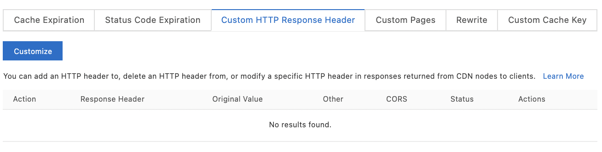{width="4.09798009623797in"
height="1.0403051181102363in"}

-   \`Operation:\` this is the operation (\`Add\`, \`Delete\`,
    \`Modify\`, \`Replace\`) on the response header,

-   \`Response Header: \`this is the response header (select
    \`Custom\`),

-   \`Header Name\`: this is the name of the header (for the \`Custom\`
    choice),

-   \`Header Value\`: this is\` \`the value of the header,

-   \`Allow Duplicates\`: allows (or not) duplicate headers,

-   Click on \`OK\`.

{width="2.587904636920385in"
height="1.5004254155730534in"}

### Configure refresh and prefetch 

Cached resources can be refreshed and prefetched.

To have the CDN nodes retrieve the versions of the resources on the
origin servers, use \"refresh\". The cached data is cleared and the next
time the CDN requests the resources, it will retrieve the resources from
the origin server.

To retrieve frequently requested resources during off-peak hours, use
\"prefetch\". This will increase the cache hit rate and thus speed up
the delivery of content.

To refresh or prefetch resources:

-   Go to the \`Alibaba Cloud CDN \`console,

-   Click on \`Refresh & Prefetch,\`

-   Click on the \`Refresh Cache \`tab,

-   \`Operation\`: this is\` \`the operation to be performed (\`refresh
    \`or \`prefetch\`),

-   \`Object\`: this is\` \`the type of object concerned (\`Directory
    \`or \`URL\`),

-   \`URLs\`: these are the URLs concerned (one per line),

-   Click on \`Submit\`.

{width="2.7632556867891513in"
height="2.833190069991251in"}

To check the resource status:

-   Go to the \`Alibaba Cloud CDN \`console,

-   Click on \`Refresh & Prefetch,\`

-   Click on the \`Records \`tab,

-   Specify a time interval, an operation type and a domain name or URL,

-   Click on \`Search\`.

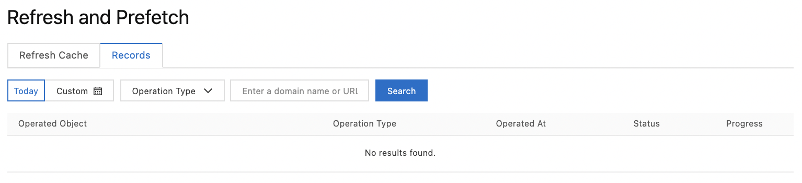{width="3.694996719160105in"
height="0.8427788713910761in"}

## The access control 

In this section, we will study access control to resources by the
following methods:

-   black and white lists of IP addresses or \`User-Agent\`,

-   remote authentication, which allows requests to be redirected to an
    authentication server,

-   URL signing to protect origin servers and CDNs from unauthorized
    access,

-   hotlink protection which allows to filter requests using a white
    list or a black list of \`referer\`.

### Configure a blacklist and a whitelist of IP addresses 

The black and white lists are used to filter users. A blacklisted IP
address cannot access the target domain. The IP address can still access
the CDN node, but it will be denied with a HTTP 403 code. These requests
will therefore appear in the request logs.

Conversely, only whitelisted IP addresses can access the target domain.

To create a whitelist or a blacklist:

-   Go to the \`CDN \`console,

-   Go to the \`Domain Names \`page,

-   Click on \`Manage \`on the line of the domain name,

-   Click on \`Access Control\`,\`

-   \`Click on the \`IP Blacklist/Whitelist \`tab,

-   Click on \`Modify\`,

{width="4.199596456692913in"
height="0.9442607174103237in"}

-   \`Type\`: select \`Blacklist \`or \`Whitelist\`,

-   \`Rules\`: these are IP addresses or CIDR blocks,

-   Click on \`OK\`.

{width="2.558057742782152in"
height="2.393837489063867in"}

### Configure a black list and a white list of User-Agent 

To identify, filter and secure requests from the \`User-Agent\`, you can
create a whitelist or a blacklist.

Requests with a whitelisted \`User-Agent \`can access the resources,
others cannot.

Requests with a blacklisted \`User-Agent\` cannot access resources and
receive a HTTP 403 error and are logged in the CDN logs.

These two lists are mutually exclusive: the one configured last has
effect.

To set up a whitelist or blacklist:

-   Go to the \`Alibaba Cloud CDN \`console,

-   Click on \`Domain Names\`,

-   Click on \`Manage \`on the line of the domain name,

-   Click on \`Access Control\`,

-   Click on the \`UserAgent Blacklist/Whitelist \`tab,

-   Click on \`Modify\`,

{width="3.6033956692913387in"
height="0.6350437445319335in"}

-   \`Type\`: this\` \`is the type of list (\`Whitelist \`or
    \`Blacklist\`),

-   \`Rules\`: these are the values of the \`User Agent\`, separated by
    \`\|\`; the wildcard \`\* \`is supported,

-   Click on \`OK\`.

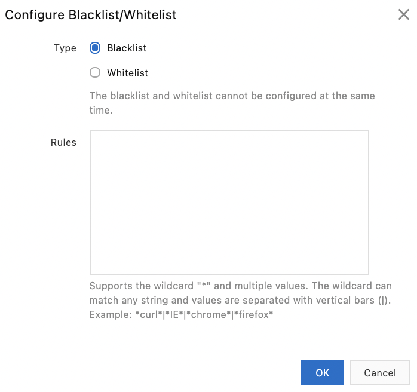{width="2.5644094488188975in"
height="2.4100699912510937in"}

### Configure remote authentication 

Remote authentication allows client requests to be redirected to a
specified authentication server. This protects CDN resources from
unauthorized access.

To configure remote authentication:

-   Go to the \`Alibaba Cloud CDN \`console,

-   Click on \`Domain Names\`,

-   Click on \`Manage \`on the line of the domain name,

-   Click on \`Access Control\`,

-   Click on the \`Remote Authentication \`tab,

-   Enable \`Remote Authentication\`,

{width="3.723248031496063in"
height="0.5665321522309711in"}

-   Configure the parameters,

-   Click on \`OK\`.

+-----------------------------------------------------------------------+
| {width="3.363199912510936in"    |
| height="2.413927165354331in"}                                         |
|                                                                       |
| {width="3.3535312773403323in"   |
| height="2.3360859580052495in"}                                        |
|                                                                       |
| {width="3.3847779965004374in"   |
| height="0.9318580489938758in"}                                        |
+=======================================================================+
+-----------------------------------------------------------------------+

### Enable URL signing 

URL signing helps protect origin servers and CDNs from unauthorized
access.

Here\'s how the process works:

-   The origin server provides a signed URL containing authentication
    information.

-   The client sends its request to the CDN using this signed URL.

-   The CDN checks whether the request is valid using the authentication
    information in the URL.

-   If the request is valid, the resource is returned; otherwise, the
    request is rejected with a 403 error.

To enable URL signing:

-   Go to the \`Alibaba Cloud CDN \`console,

-   Click on \`Domain Names\`,

-   Click on \`Manage \`on the line of the domain name,

-   Click on \`Access Control\`,

-   Click on the \`URL Signing \`tab,

-   Click on \`Modify \`next to \`URL Signing\`,

{width="3.3319805336832897in"
height="2.5185247156605426in"}

-   Enable \`URL Signing\`,

-   \`Type\`: this is\` \`the type of signature; there are three (A, B
    and C),

-   \`Primary Key:\` this is the primary key used for the selected
    signature type,

-   \`Secondary Key:\` this is the secondary key for the selected
    signature type,

-   Click on \`OK\`.

{width="3.2676990376202975in"
height="0.6177362204724409in"}

To generate a signed URL, on the same screen:

-   \`Original URL\`: this is\` \`the URL to be signed,

-   \`Type:\` the type of signature (A, B, or C),

-   \`Cryptographic Key\`: this is the cryptographic key (primary or
    secondary) specified in the URL signature parameters,

-   \`Validity Period\`: this is the period of validity of the signed
    URL (in seconds) (30 minutes by default),

For less than 30 minutes, specify a negative value.

-   Click on \`Generate\`.

{width="1.5486570428696413in"
height="1.9373632983377078in"},

A signed URL and a timestamp are then generated.

### Configure hotlink protection 

Hotlink protection allows to filter requests using a whitelist or a
blacklist of \`referrers\`.

Requests received by CDNs are validated against their HTTP \`referer
\`header. In case of failure, a HTTP 403 error is returned.

The blacklist and the whitelist are mutually exclusive: the one
configured last takes effect.

A wildcard character \`\* \`is automatically added to the entries of
these lists (example: \`\*.mywebsite.com \`for the entry
\`mywebsite.com\`).

It is possible to specify whether requests with an empty \`referer
\`header are validated. This happens if an user enters the URL directly
into the browser address bar.

To configure hotlink protection:

-   Go to the \`Alibaba Cloud CDN \`console,

-   Click on \`Domain Names\`,

-   Click on \`Manage \`on the line of the domain name,

-   Click on \`Access Control\`,

-   Click \`Modify \`next to \`Hotlink Protection\`,

{width="3.642156605424322in"
height="0.6874015748031496in"}

-   \`Type\`: this\` \`is the type of list (\`Whitelist \`or
    \`Blacklist\`),

-   \`Rules\`: these are the authorized domain names, separated by a
    line break,

-   Click on \`OK\`.

{width="2.319009186351706in"
height="2.1883869203849518in"}

## Performance optimization 

In this section, we will study several performance optimization
techniques:

-   intelligent compression, which allows text files to be compressed,

-   page optimization, which removes redundant content from web pages to
    reduce file size,

-   Brotli compression, which allows text files to be compressed more
    efficiently,

-   filtering (retain), which allows to filter the requests to be sent
    to the originating site server.

### Enable smart compression 

Intelligent compression allows text files to be compressed. This
compression changes the MD5 value of the file. MD5 should therefore not
be activated if it is checked.

To enable smart compression:

-   Go to the \`CDN \`console,

-   Go to the \`Domain Names \`page,

-   Click on \`Manage \`on the line of the domain name,

-   Click on \`Optimization\`,

-   Enable \`Inteligent Compression\`.

{width="3.3325656167979in"
height="0.43817038495188104in"}

### Enable page optimization 

Page optimization removes redundant content from web pages (comments and
spaces in HTML, CSS or Javascript files) in order to reduce file size.
This compression changes the MD5 value of the file. MD5 should therefore
not be activated if it is checked.

To enable page optimization:

-   Go to the \`CDN \`console,

-   Go to the \`Domain Names \`page,

-   Click on \`Manage \`on the line of the domain name,

-   Click on \`Optimization\`,

-   Activate \`HTML Optimization\`, \`CSS Optimization \`or \`Javascript
    Optimization\`.

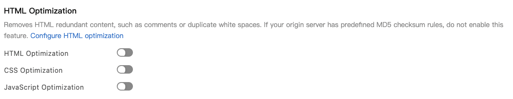{width="2.9261920384951883in"
height="0.5649179790026246in"}

### Configuring Brotli compression 

Brotli compression is used to compress text files. It is a new
compression algorithm that is 15 to 25% more efficient than intelligent
compression.

Brotli compression is used for requests with a HTTP \`Accept-Encoding:
br \`header. If the header specifies both zip (\`gzip\`) and Brotli
(\`br\`), Brotli compression is used.

To activate Brotli compression:

-   Go to the \`Alibaba Cloud CDN \`console,

-   Click on \`Domain Names\`,

-   Click on \`Manage \`on the line of the domain name,

-   Click on \`Optimization\`,

-   Activate \`Brotli Compression\`.

{width="3.2328937007874017in"
height="0.42656167979002624in"}

### Enable filtering 

When a request with a URL containing \`? \`followed by parameters is
sent to a CDN node, CDN uses a filter to determine whether it should
send it to the originating server.

It is recommended to enable filtering (retain) for URLs with unimportant
parameters and not to enable it for URLs with important parameters. In
the latter case, the CDN will keep different versions for each URL.

To retain parameters in URLs:

-   Go to the \`CDN \`console,

-   Go to the \`Domain Names \`page,

-   Click on \`Manage \`on the line of the domain name,

-   Click on \`Optimization\`,

-   Click \`Modify \`in the \`Retain Parameters \`section,

{width="3.786913823272091in"
height="0.5884919072615923in"}

-   Activate \`Parameter Filtering\`,

-   \`Parameter Filtering\`: with parameter filtering, parameters that
    follow the \`? \`in the URL of a request are ignored by CDN nodes,

This increases the cache hit rate. If no parameter is specified, all
parameters following \`? \`are ignored.

-   \`Retain Specified Parameters\`: these are the parameters to be
    retained (10 maximum, separated by \`,\`),

-   \`Retain Origin Parameters\`: retains all parameters of the request
    URL during the back-to-origin process,

-   Click on \`OK\`,

{width="2.277163167104112in"
height="2.2834886264216974in"}

To remove parameters in URLs:

-   Go to the \`CDN \`console,

-   Go to the \`Domain Names \`page,

-   Click on \`Manage \`on the line of the domain name,

-   Click on \`Optimization\`,

-   Click on \`Modify \`next to \`Parameter Filtering (Delete Specified
    Parameters)\`,

{width="3.8412150043744533in"
height="0.5791458880139982in"}

-   Activate \`Parameter Filtering\`,

-   \`Delete Parameters\`: this is the list of parameters to be deleted
    (maximum 10 parameters, separated by a space),

-   \`Retain Origin Parameters\`: all parameters of the URL of a request
    are retained during the back-to-origin process,

-   Click on \`OK\`.

{width="2.392159886264217in"
height="2.3186964129483814in"}

## The Video service 

In this section, we will study:

-   object chunking, which allows the origin server to send back only
    parts of the requested files,

-   video seeking, which allows to access the specified position in the
    video.

### Configure object chunking 

Object chunking allows the origin server to send back only parts of the
requested files. The interest is to reduce the network traffic at the
back-to-origin level as well as the response time.

In order to use chunking, the origin server must support the HTTP
\`Range \`header and handle the HTTP 206 (\`partal content message\`)
status code. Both the request and the response contain the HTTP \`Range
\`header.

If chunking is disabled, the HTTP connection between the client and the
CDN closes after receiving the response. The retrieved resource is not
cached on the CDN.

To configure object chunking:

-   Go to the \`Alibaba Cloud CDN \`console,

-   Click on \`Domain Names\`,

-   Click on \`Manage \`on the line of the domain name,

-   Click on \`Video\`,

-   Click \`Modify \`next to \`Object Chunking\`,

{width="3.3432633420822397in"
height="0.5922944006999125in"}

-   \`Object Chunking\`: this is the status of object chunking:

```{=html}
<!-- -->
```
-   \`On\`: enables Chunking,

With chunking, the origin server returns only pieces of the specified
files.

-   \`Off\`: disables Chunking,

-   \`Force:\` redirects all requests containing the \`Range\` header to
    the origin server,

```{=html}
<!-- -->
```
-   Click on \`OK\`.

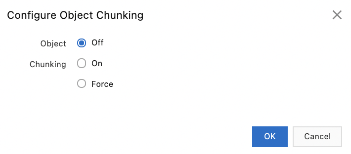{width="2.001065179352581in"
height="0.8794805336832896in"}

### Setting up video search 

Video seeking allows to access a specified position in the video.

The format of the query is
\`http://www.mywebsite.com/myvideo.flv?start=10\`. The \`start
\`parameter specifies the position to access.

The server then searches for the keyframe at that position and returns
the content from there. This way the quality of the video is not
degraded. If no keyframe is found, the server looks for the last
keyframe before the specified position.

The origin server must support HTTP \`Range \`headers. It must also
handle correctly the HTTP 206 status code (partial content).

The supported file formats are MP4 and FLV.

To set up video search:

-   Go to the \`Alibaba Cloud CDN \`console,

-   Click on \`Domain Names\`,

-   Click on \`Manage \`on the line of the domain name,

-   Click on \`Video\`,

-   Click on \`Video Seeking\`,

{width="2.9216087051618547in"
height="0.629407261592301in"}

-   To enable time-based searching of FLV files, enable \`Time-based FLV
    Seeking\`,

-   Click on \`Modify \`next to \`Custom Parameters\`,

-   \`Start Parameter\`: this is\` \`the name of the start parameter
    (start by default),

-   \`End Parameter\`: this is\` \`the name of the end parameter (end by
    default),

-   Click on \`OK\`.

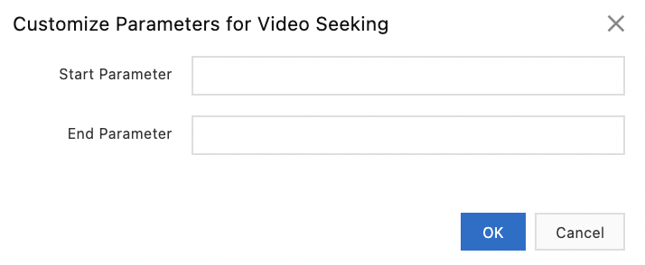{width="1.8211165791776027in"
height="0.7498053368328959in"}

## EdgeScript and EdgeRoutine 

In this section, we will simply define what EdgeScript and EdgeRoutine
are.

### EdgeScript 

EdgeScript allows to run a script in the CDN configuration items to
customize the operation of CDN:

-   A/B testing,

-   authentication,

-   control of request and response headers,

-   cache control,

-   rewriting and redirection,

-   throttling, \...

### EdgeRoutine 

EdgeRoutine (ER) is a serverless environment for executing JavaScript
code on CDNs. This JavaScript code can be deployed with CLI.

EdgeRoutine allows Alibaba Cloud CDN to be customized in serverless
mode, reducing the number of back-to-origin requests and speeding up
content delivery.

## Monitoring 

Resource monitoring collects data on resource usage based on client IP
addresses, geographic locations and ISPs (Internet Service Providers).

Several tools are available for monitoring and analyzing Alibaba Cloud
CDN usage.

To monitor resources:

-   Go to the \`Alibaba Cloud CDN \`console,

-   Click on \`Monitoring & Usage Analytics,\`

-   To get metrics on resources (traffic, visits, HTTP codes, \...),
    click on \`Resource Monitoring\`,

{width="3.2870155293088366in"
height="3.010054680664917in"}

-   To get real time metrics (bandwidth, traffic, requests, \...), click
    on \`Real-time Monitoring\`.

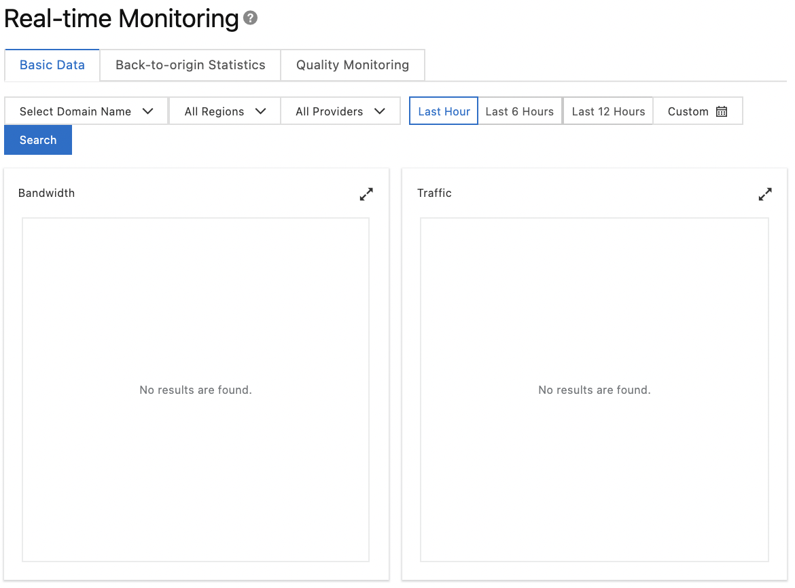{width="3.3648206474190725in"
height="2.4903816710411197in"}

Usage statistics allow the collection of metrics such as:

-   the number of page views (PV),

-   the number of unique visitors (UV),

-   the most used IP addresses (of clients, regions, ISPs)

-   the most used HTTP referer headers,

-   the frequently requested URLs,

-   the most used back-to-origin URLs,

-   the frequently visited domain names.

To display these usage statistics (PV, UV, main IP addresses of clients,
popular URLs, \...):

-   Go to the \`Alibaba Cloud CDN \`console,

-   Click on \`Monitoring & Usage Analytics \| Statistics,\`

-   Select the item to monitor and the metric,

-   Click on \`Search\`.

{width="4.5in"
height="1.9069444444444446in"}

To run queries on network traffic usage, bandwidth usage and number of
requests in a given time slot, for a given domain name or in a given
region:

-   Go to the \`Alibaba Cloud CDN \`console,

-   Click on \`Monitoring & Usage Analytics \| Usage,\`

-   Click on \`Search\`.

{width="4.176829615048119in"
height="2.9766360454943133in"}

To query Alibaba Cloud CDN billing statements:

-   Go to the \`Alibaba Cloud CDN \`console,

-   Click on \`Monitoring & Usage Analytics \| Usage,\`

-   Click on the \`Bill Query \`tab,

-   Select the date or month,

-   Specify a time slot,

-   Click on \`Search\`.

{width="4.5in"
height="3.5347222222222223in"}

To export a bill:

-   Go to the \`Alibaba Cloud CDN \`console,

-   Click on \`Monitoring & Usage Analytics \| Usage,\`

-   Click on the \`Bill Export \`tab,

-   Select a date or a month,

-   Click on \`Create Export Task\`,

-   Click on \`Download \`or \`Delete \`on the line of the bill.

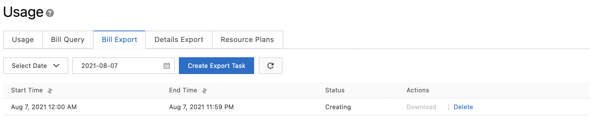{width="4.5in" height="0.98125in"}

To export billing details:

-   Go to the \`Alibaba Cloud CDN \`console,

-   Click on \`Monitoring & Usage Analytics \| Usage,\`

-   Click on the \`Details Export \`tab,

-   Click on \`Create Task\`,

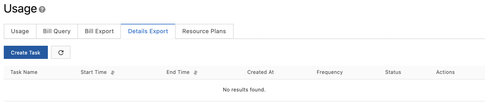{width="4.5in" height="1.00625in"}

-   Configure the parameters of the export task,

-   Click on \`OK\`,

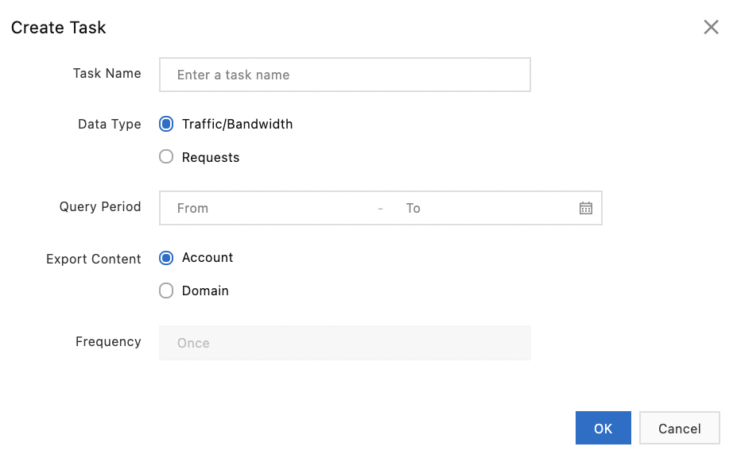{width="2.766119860017498in"
height="1.6976629483814523in"}

-   Click on \`Download \`or \`Delete \`on the line of the bill.

To request details on resource plans:

-   Go to the \`Alibaba Cloud CDN \`console,

-   Click on \`Monitoring & Usage Analytics \| Usage,\`

-   Click on the \`Resource Plans \`tab.

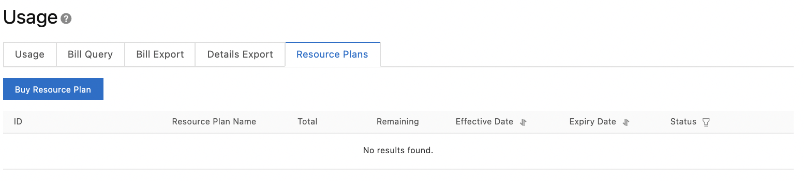{width="3.61630249343832in"
height="0.819248687664042in"}

## The logs 

Alibaba Cloud CDN provides logs to help you resolve issues.

The format of each log file name is
\`\<NAME\>\_\<YEAR\>\_\<MONTH\>\_\<DAY\>\_\<START_TIME\>\_\<END_TIME\>\_\<EXTENSION_FIELDS\>.gz.
EXTENSION_FIELD \`is optional.

Each line corresponds to an event. The format of each line is:

-   the start time of the event (between \`\[ \`and \`\]\`),

-   the IP address of the client,

-   the IP address of the client\'s proxy,

-   the response time (in milliseconds),

-   the header field \`referrer\`,

-   the query method,

-   the URI of the request,

-   the HTTP status code,

-   the message size of the request (in bytes),

-   the size of the response (in bytes),

-   the state of the cache hit,

-   information about the client\'s proxy,

-   the type of resource requested,

-   the protocol used.

To download the logs:

-   Go to the \`Alibaba Cloud CDN \`console,

-   Click on \`Logs \| Offline Logs\`,

-   Select a domain name and a date,

-   Click on \`Search\`,

-   Click on \`Download \`on the log file line.

In general, logs are generated within 24 hours and remain available for
30 days. To keep them longer, it is possible to store them in a bucket.
This storage operation is performed automatically by Function Compute.
The Function Compute service must therefore be activated beforehand. It
is then possible to filter and process the events with Function Compute.

To store logs for a long time in a bucket:

-   Go to the \`Alibaba Cloud CDN \`console,

-   Click on \`Logs \| Offline Logs\`,

-   Click on the \`Log Storage (Function Storage) \`tab,

-   Click on \`Activate Log Storage\`,

{width="3.124192913385827in"
height="1.0582720909886265in"}

-   \`Service Name\`: this is the name of the service,

-   \`OSS Bucket\`: this is the bucket where the logs are stored,

-   Click on \`Next\`,

{width="2.7898873578302714in"
height="1.8797298775153106in"}

-   Click on \`Authorize \`next to \`Service Authorization\`,

This operation allows \`Function Compute \`to write data to the bucket
and execute functions.

-   Click on \`Authorize \`next to \`Trigger Role\`,

This transaction authorizes \`Alibaba Cloud CDN \`to access \`Function
Compute\`.

-   Select the domain name,

-   Click on \`Create\`,

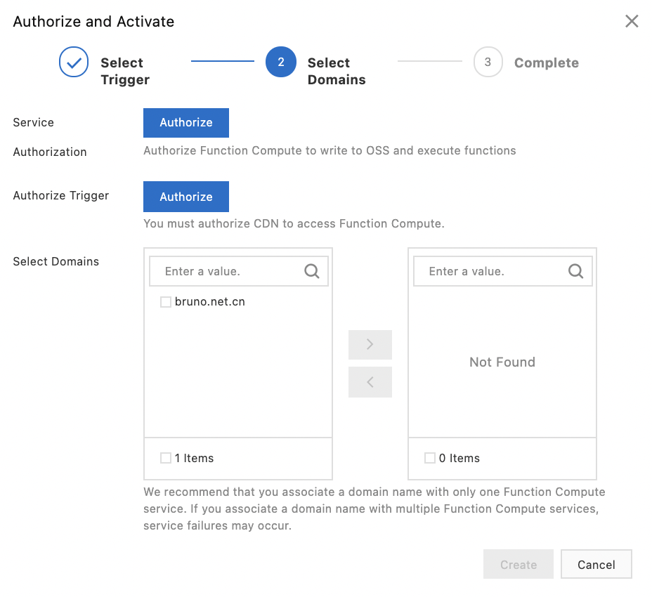{width="2.83378937007874in"
height="2.595452755905512in"}

-   Click on \`Done\`.

# Apsara for MySQL 

ApsaraDB for RDS (Relational Database Service) is a high performance
database service using SSD storage, supporting multiple database engines
(MySQL, SQL Server, PostgreSQL, MariaDB and PPAS - Oracle compatible)
and providing disaster tolerance, backup, recovery, monitoring and
migration services.

The connection to the database is done through an endpoint. This can be
internal or public. It is also necessary to create an account, which can
be standard or privileged, and to add the IP address of the client to
the whitelist. The incoming and outgoing traffic of ECS instances is
controlled by a security group.

Data between the client and the RDS instance is encrypted. Data on disk
can also be encrypted. TDE can encrypt and decrypt incoming and outgoing
data files in real time.

Read-only instances allow the RDS instance to be offloaded if it
receives too many requests. The dedicated proxy provides a single
endpoint for the application, unlike read-only instances.

RDS instances can be configured using a template. It is possible to
update minor and major versions under certain conditions. Maintenance
operations are performed during the maintenance window.

The backup policy allows to schedule data and log backups. A manual
backup is also possible. Backup between different regions is possible
using an OSS bucket. It is possible to backup and restore the whole
database or specific tables. Restoration can be done in another region.
In addition, binary log files can be uploaded to an OSS bucket.

It is also possible to create recovery instances in case of a
geographical disaster (geo-disaster). The switchover from the primary to
the secondary instance can be done manually or automatically. There are
two modes of data replication between the primary and secondary
instances: semi-synchronous and asynchronous.

DTS allows to migrate data between heterogeneous databases.

An ApsaraDB RDS for MySQL database instance can be synchronized with
another instance of the same or another MySQL engine.

Monitoring allows to monitor RDS instances and to trigger alerts. The
metrics can be related to the resources, to the engine and to the
deployment of an instance. The monitoring frequency can be modified.

It is possible to view error logs, slow query logs and operation and
maintenance events performed by both users and Alibaba Cloud on a RDS
instance. SQL Explorer is especially helpful for database
investigations.

## The different database engines 

ApsaraDB for RDS supports several database engines.

MySQL is the most popular open source database. It is part of LAMP, the
open source software stack (Linux + Apache + MySQL + PHP).

AliSQL, developed by Alibaba Cloud based on MySQL, offers advanced
features developed by Alibaba Cloud in addition to MySQL features:
enterprise level security, backup and restore, monitoring, performance
optimization, read-only instance.

SQL Server is one of the main commercial databases. It is part of the
Windows platform (IIS + .NET + SQL Server). It includes Management
Studio, which provides tools such as a script editor.

PostgreSQL is an open source database compatible with SQL but supporting
JSON, IP and geometric data. It supports the High Availability
architecture.

ApsaraDB for MyBase is an enterprise-class database developed by Alibaba
Cloud providing a dedicated cluster and multiple hosts as ECS instances
and advanced features. It supports MySQL, SQL Server and PostgreSQL
database engines. It helps to meet high regulatory compliance and
security requirements.

ApsaraDB RDS for PPAS is a relational database based on PostgreSQL,
secure and scalable enterprise level. Its performance has been improved
and its functionalities enriched. It also allows to run Oracle
applications directly.

ApsaraDB for MariaDB TX (Enterprise Edition) is an enterprise level
database compatible with Oracle. It offers advanced features. It uses
several storage engines, including MySQL InnoDB.

ApsaraDB PostgreSQL Ganos is a space-time engine providing data types,
functions and stored procedures to ApsaraDB for RDS.

In this chapter, we will discuss ApsaraDB for MySQL in more detail.

## The RDS instance 

In this section, we will study:

-   the creation of an instance,

-   the restart of an instance,

-   the release of an instance,

-   the recycle bin, which contains expired or overdue instances,

-   the use of tags.

### Create an instance 

\`Pay-as-you-go \`instances can be converted to \`subscription
\`instances, but the reverse is not true.

To create a RDS for MySQL instance:

-   Go to the \`ApsaraDB for RDS \`console,

-   Click on \`Create Instance\`,

-   \`Billing Method\`: this is the method of billing:

```{=html}
<!-- -->
```
-   \`Subscription\`: the insatnce is charged by prepayment (recommended
    for long-term needs),

-   \`Pay-As-You-Go\`: the instance is billed by the hour (recommended
    for short-term needs),

```{=html}
<!-- -->
```
-   \`Region\`: this is the region of the RDS instance.

It is recommended that you choose the same region as the ECS instance to
avoid having to pay Internet traffic usage fees and to ensure fast
access.

The region cannot be modified once created.

-   \`Database Engine\`: this is the database engine used (here:
    \`MySQL\`),

Supported engines are MySQL, Microsoft SQL Server, PostgreSQL, MariaDB
TX and PolarDB.

-   \`Edition\`: this is the edition of RDS:

```{=html}
<!-- -->
```
-   \`Basic\`,

-   \`Company\`,

-   \`High-availability\`,

The \`Basic \`edition has only one instance. This choice is not
recommended for production environments.

The \`Enterprise \`Edition consists of three instances: a primary
instance and two secondary instances. They are always located in
different areas of the same region to ensure service availability.

The \`High-availability \`edition consists of two instances: a primary
instance and a secondary instance.

-   \`Storage Type\`: this is the type of storage:

```{=html}
<!-- -->
```
-   \`Local SSD\`: this is a SSD located on the same node as the RDS
    instance, which reduces I/O latency,

-   \`Enhanced SSD\`: this is a SSD designed on the new distributed
    block storage architecture and 25GB and RDMA generation which allows
    to reduce latency,

-   \`Standard SSD\`: this is an elastic block storage device designed
    for distributed storage architecture,

\`Local SSD \`storage is an SSD located on the same node as the RDS
instance, which reduces I/O latency.

\`Enhanced SSD \`storage is an SSD designed on the new distributed block
storage architecture and 25GB and RDMA generation, which helps reduce
latency.

\`Standard SSD \`storage is an elastic block storage device designed for
a distributed storage architecture.

-   \`Zone of Primary Node\`: this is the zone to which the primary RDS
    instance belongs,

-   \`Deployment Method\`: this is\` \`the deployment method; it can be:

```{=html}
<!-- -->
```
-   \`Single-zone Deployment\`: deployment is done in a single zone; in
    this case, \`Zone of Primary Node \`and \`Zone of Secondary Node
    \`have the same value,

-   \`Multi-zone Development\`: deployment is done on several zones in
    order to guarantee disaster recovery,

```{=html}
<!-- -->
```
-   \`Zone of Secondary Node\`: this is the zone to which the secondary
    RDS instance belongs,

You can specify a zone or let Alibaba Cloud automatically select one for
you.

-   \`Instance Type\`: this is the type of RDS instance:

```{=html}
<!-- -->
```
-   \`General-purpose (Entry-level)\`,

-   \`Dedicated instance (Enterprise-level)\`,

-   \`Dedicated (dedicated host)\`,

The \`General-purpose (Entry-level) \`instance type provides dedicated
memory and I/O resources but shares CPU and storage with other instances
on the same server.

The \`Dedicated \`instance \`(Enterprise-level) \`instance type provides
dedicated CPU, memory, storage and I/O resources.

The \`Dedicated \`instance type provides all the resources of the server
where the instance is located.

-   \`Capacity\`: this is\` \`the storage capacity for data, system
    files, log files and transaction files,

-   \`Click Next: Instance Configuration,\`

+-----------------------------------------------------------------------+
| \`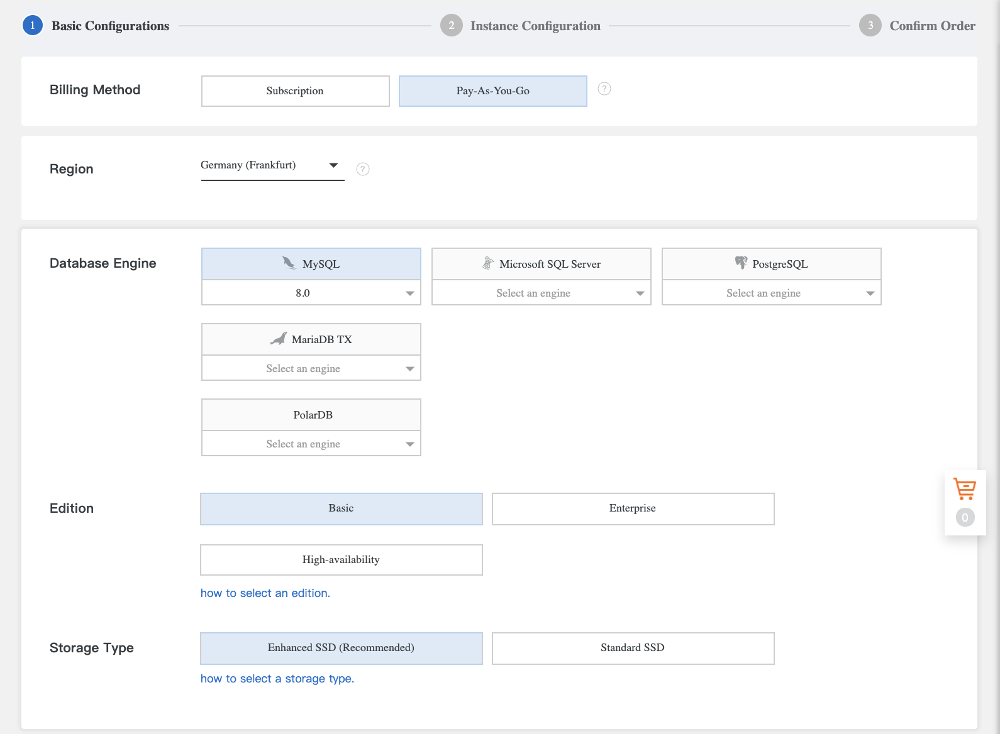{width="3.721247812773403in"               |
| height="2.733508311461067in"}                                         |
|                                                                       |
| 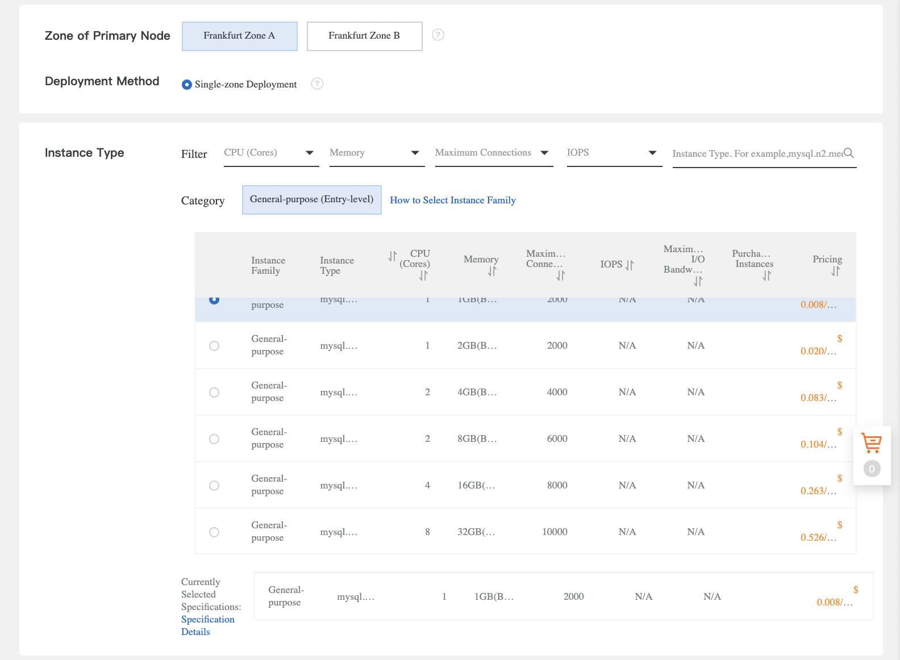{width="3.742688101487314in"                 |
| height="2.7457928696412948in"}                                        |
|                                                                       |
| {width="3.7862292213473316in"   |
| height="1.048225065616798in"}                                         |
|                                                                       |
| \`                                                                    |
+=======================================================================+
+-----------------------------------------------------------------------+

-   \`Network Type: \`select the type of network (this must be the same
    as the RDS instance):

```{=html}
<!-- -->
```
-   \`Classic Network\`: Alibaba Cloud automatically assigns IP
    addresses,

-   \`VPC \`(recommended): allows to customize IP addresses,

-   \`VPC\`: this is the VPC in which the instance is created,

-   \`VSwitch of Primary Node\`: this is the VSwitch in which the
    instance is created,

-   \`Minor Version Upgrade Policy\`: the version upgrade can be done
    manually (\`Manual Upgrade\`) or automatically (\`Automatic
    Upgrade\`),

-   \`Resource Group\`: this is the group to which the instance belongs,

```{=html}
<!-- -->
```
-   Click \`Next: Confirm Order\`,

{width="3.5881091426071743in"
height="3.0155621172353455in"}

-   Click on \`Buy Now\`.

For a subscription instance, you can select \`Auto-Renew Enabled \`to
avoid paying the time extension fee.

### Restart an instance 

Restarting a RDS instance interrupts connections for up to 30 seconds.

To restart a RDS instance:

-   Go to the \`ApsaraDB for RDS \`console,

-   Click on \`Instances\`,

-   Click on the instance ID,

-   Click on \`More \| Restart Instance\`,

-   Click on \`OK\`.

{width="4.5in"
height="1.6243055555555554in"}

### Release an instance 

When a RDS instance is released, its data is deleted. It is therefore
recommended to back up the data of the instance before releasing it.

To release a RDS subscription instance, it is necessary to open a
ticket.

To release a RDS Not-As-You-Go instance:

-   Go to the \`ApsaraDB for RDS \`console,

-   Click on \`Instances\`,

-   Click on the instance ID,

-   Click on \`Release Instance \`next to \`Status\`,

-   Click on \`OK\`.

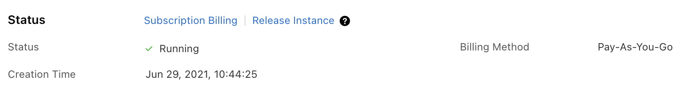{width="3.119892825896763in"
height="0.4289851268591426in"}

To cancel a subscription to a RDS instance, you have to open a ticket.

### Use the recycle bin 

The recycle bin is where expired or overdue instances are stored. It is
possible to unlock, recreate and destroy RDS instances. RDS instances
that are overdue or expired are placed in the recycle bin.

To unlock an instance that has been placed in the recycle bin:

-   Go to the \`ApsaraDB for RDS \`console,

-   Click on \`Locked Instances (n)\`.

{width="4.5in"
height="1.2006944444444445in"}

### Using tags 

If you have a large number of RDS instances, tags help you manage them
by linking them to ECS instances.

Each RDS instance can have up to 20 tags.

It is possible to filter the RDS instances by tag.

To add a tag:

-   Go to the \`ApsaraDB for RDS \`console,

-   Click on \`Instances\`,

-   Click on \`+Add Label \`on the line of the instance,

-   Click on \`Create a label\`,

-   \`Key:\` this is the key of the tag,

-   \`Value:\` this is the value of the tag,

-   Click on \`OK\`.

{width="2.424329615048119in"
height="1.2593044619422573in"}

## The account 

ApsaraDB RDS for MySQL supports two types of database accounts:

-   \`Privileged\` accounts.

-   \`Standard\` accounts.

All these accounts can be managed through the RDS console or through the
API. Standard accounts can also be managed by a SQL command.

A RDS instance can have only one \`Privileged Account\`.

A privileged account has the permissions to manage databases, manage
standard accounts, grant finer grained permissions, and log off a
standard user. A standard account has none of these permissions.

Database permissions must be granted for each standard account and
manually.

To create a privileged account:

-   Go to the \`ApsaraDB for RDS \`console,

-   Click on \`Instances\`,

-   Click on the RDS instance ID,

-   Click on \`Accounts\`,

-   Click on \`Create Account\`,

-   \`Database Account\`: this is\` \`the name of the database,

-   \`Account Type\`: select \`Privilegied Account\`,

-   \`Password\`: this is\` \`the password,

-   \`Confirm Password\`: this is a confirmation of the password,

-   \`Description\`: this is the description,

-   Click on \`Create\`.

{width="3.9005479002624672in"
height="3.3365332458442696in"}

To create a standard account:

-   Go to the \`ApsaraDB for RDS \`console,

-   Click on \`Instances\`,

-   Click on the RDS instance ID,

-   Click on \`Accounts\`,

-   Click on \`Create Account\`,

-   \`Database Account\`: this is\` \`the name of the account,

-   \`Account Type\`: select \`Standard Account\`,

-   \`Authorized Databases\`: these are the authorized databases,

-   \`Password\`: this is\` \`the account password,

-   \`Confirm Password\`: this is\` \`a confirmation of the password,

-   \`Description\`: this is the description,

-   Click on \`Create\`.

To reset an account password:

-   Go to the \`ApsaraDB for RDS \`console,

-   Click on \`Instances\`,

-   Click on the RDS instance ID,

-   Click on \`Accounts\`,

-   Click on \`Reset Password\`,

-   \`New Password\`: this is the new password,

-   \`Confirm New Password\`: this\` \`is the confirmation of the new
    password,

-   Click on \`Create\`.

{width="1.8575503062117236in"
height="1.2813659230096237in"}

If the privileged account is behaving strangely, you can reset the
permissions:

-   Go to the \`ApsaraDB for RDS \`console,

-   Click on \`Instances\`,

-   Click on the instance ID,

-   Click on \`Accounts\`,

-   Click on \`Reset Permisions \`on the line of the account,

-   Enter the password,

-   Click on \`Create\`.

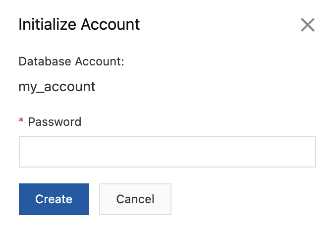{width="1.409359142607174in"
height="0.9619739720034995in"}

## The database 

In this section, we will study the creation and deletion of a database.

### Create a database 

To create a database:

-   Go to the \`ApsaraDB for RDS \`console,

-   Click on \`Instances\`,

-   Click on the instance ID,

-   Click on \`Databases\`,

-   Click on \`Create Database\`,

-   \`Database Name\`: this\` \`is the name of the database; this name
    must be unique among your RDS instances,

-   \`Supported Character Set:\` indicates the supported character set
    (supported values: \`utf8\`, \`gbk\`, \`latin1 \`and \`utf8mb4\`),

-   \`Authorized Account\`: this is\` \`the account authorized to access
    the database, specified in a list,

The account can be specified later. It must be a standard account.

-   \`Account type:\` these are the permissions granted to the database
    (supported values: \`Read/Write\`, \`Read-only\`, \`DDL Only \`and
    \`DML Only\`),

-   \`Description\`: this is a description,

-   Click on \`Create\`.

{width="3.054209317585302in"
height="2.0238845144356956in"}

### Delete a database 

To delete a database:

-   Go to the \`ApsaraDB for RDS \`console,

-   Click on \`Instances\`,

-   Click on the instance ID,

-   Click on \`Databases\`,

-   Click on \`Delete \`on the line of the instance,

-   Click on \`OK\`.

## The instance parameters 

It is possible to reconfigure the settings of a RDS instance. A restart
is required for the changes to take effect.

To display the parameters:

-   Go to the \`ApsaraDB for RDS \`console,

-   Click on \`Instances\`,

-   Click on the instance ID,

-   Click on \`Parameters\`,

-   Click on the \`Edit History \`tab,

-   Select a time period,

-   Click on \`Search\`.

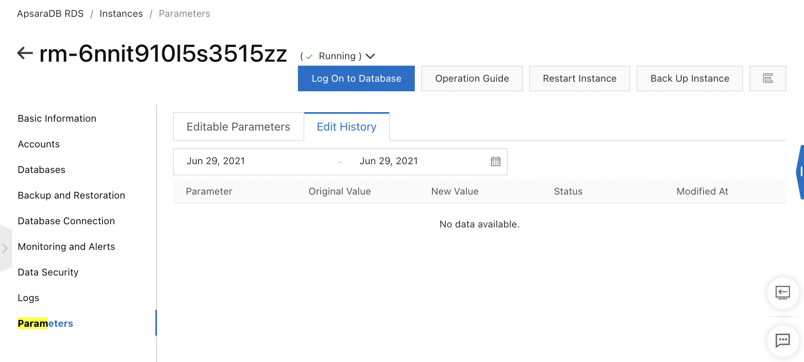{width="4.5in" height="2.0256944444444445in"}

To reconfigure a parameter:

-   Go to the \`ApsaraDB for RDS \`console,

-   Click on \`Instances\`,

-   Click on the instance ID,

-   Click on \`Parameters\`,

-   Click on the \`Editable Parameters \`tab,

-   Click on the pen icon next to the setting you want to change,

-   Enter the new value,

-   Click on \`OK\`.

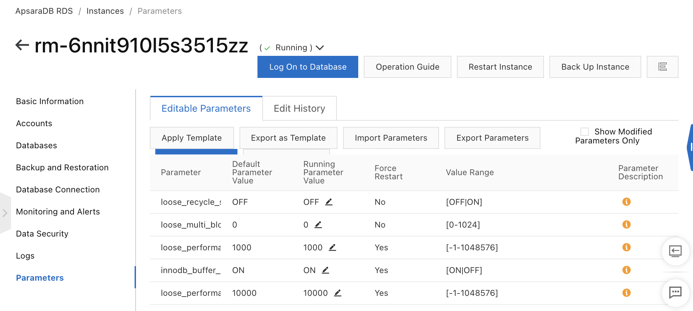{width="4.5in" height="2.0215277777777776in"}

Alibaba Cloud provides system templates for RDS instances. However, you
can create your own custom templates for the Enterprise edition.

To create a custom settings template:

-   Go to the \`ApsaraDB for RDS \`console,

-   Click on \`Parameter Templates\`,

-   Click on \`Create Parameter Template\`,

-   \`Template Name\`: this is the name of the template,

-   \`Database Engine\`: this is the database engine; select \`MySQL\`,

-   \`Engine Version\`: this is\` \`the version of the database engine,

-   \`Description\`: this is the description,

-   Click on \`Add Parameter \`to add a selected parameter to the list,

To import a previously exported template, click on \`Import\`.

-   Click on \`Confirm\`.

{width="4.5in"
height="2.5256944444444445in"}

To apply a parameter template to a RDS instance:

-   Go to the \`ApsaraDB for RDS \`console,

-   Click on \`Parameter Templates\`,

-   Click on the \`Custom Parameter Templates \`or \`System Parameter
    Templates \`tab,

-   Click on \`Apply to Instance \`on the line of the template,

-   Select RDS instances,

-   Click on \`OK\`.

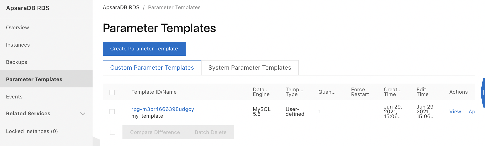{width="4.5in" height="1.3597222222222223in"}

To export a template:

-   Go to the \`ApsaraDB for RDS \`console,

-   Click on \`Instances\`,

-   Click on the instance ID,

-   Click on \`Parameters\`,

-   Click on the \`Editable Parameters \`tab,

-   Click on \`Export as Template\`,

-   \`Template Name\`: this is the name of the template,

-   \`Description\`: this is the description,

-   Click on \`OK\`.

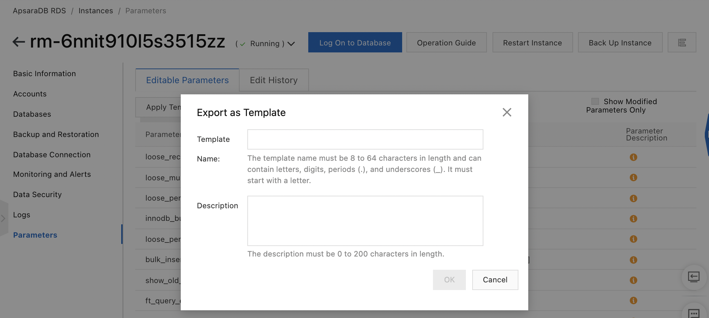{width="2.9716447944007in"
height="1.335865048118985in"}

## Securing 

In this section, we will study:

-   the whitelist that allows IP addresses to access the RDS instance,

-   the security group that allows to control the incoming and outgoing
    traffic of the ECS instances,

-   SSL encryption, which allows to reinforce the security and integrity
    of the data between the RDS instance and the client that connects to
    it,

-   encryption of the disks of the RDS instance,

-   TDE, which allows encryption and decryption of incoming and outgoing
    data files in real time.

### The whitelist 

The whitelist allows to allow IP addresses to access the RDS instance.
It is possible to specify:

-   A list of IP addresses,

-   A list of VPC security groups.

A list of IP addresses contains by default 127.0.0.1, which means that
no IP address can access the instance. You can enter a range of IP
addresses (example: 10.10.10.0/24) or an IP address. The items in the
list must be separated by a comma.

RDS offers two IP whitelisting modes:

-   standard whitelist mode: the specified IP addresses can access the
    RDS instance in both the classic network and the VPCs,

-   enhanced whitelist mode: the specified IP addresses are only
    relevant for the specified network type (classic network or VPC).

It is possible to switch from a standard whitelist to the enhanced
whitelist, but not vice versa. When you switch from the standard to the
enhanced whitelist, if the instance is in hybrid access mode, two new
whitelist groups are generated: one for classic networks and one for the
VPC.

To define a whitelist:

-   Go to the \`ApsaraDB for RDS \`console,

-   Click on \`Instances\`,

-   Click on the instance ID,

-   Click on \`Data Security\`.

-   Click on \`Create Whitelist\`,

-   \`Network Type Allowed for Instance Access\`: this is the network
    isolation mode (\`VPC \`or \`Classic Network/Public IP\`),

-   \`Whitelist Name\`: this is\` \`the name of the whitelist,

-   \`IP Addresses\`: enter the IP addresses or the CIDR block,

To find the IP addresses of the ECS instances, you can click on
\`Loading ECS Inner IP\`.

-   Click on \`OK\`.

{width="2.402366579177603in"
height="3.1219641294838145in"}

### The safety group 

A security group controls the incoming and outgoing traffic of ECS
instances. It acts as a virtual firewall. This security group can be
associated with a RDS instance. A RDS instance can have only one
security group.

To configure an ECS safety group:

-   Go to the \`ApsaraDB for RDS \`console,

-   Click on \`Instances\`,

-   Click on the instance ID,

-   Click on \`Data Security\`,

-   Click on the \`Security Group \`tab,

-   Click on \`Add Security Group\`,

-   Select the security group,

-   Click on \`OK\`.

### SSL encryption 

SSL encryption increases the security and integrity of data between the
RDS instance and the client that connects to it. The level of security
is thus increased but at the expense of access performance.

The disadvantage is that it increases the response time of connections
and consumes more CPU.

You must configure the CA SSL certificate at the client level for it to
connect to the RDS instance.

Only one connection can be encrypted (the public endpoint or the private
endpoint).

To enable SSL encryption:

-   Go to the \`Apsara for RDS \`console,

-   Click on \`Instances\`,

-   Click on the instance ID,

-   Click on \`Data Security\`,

-   Click on the \`SSL Encryption \`tab,

-   Enable \`SSL Encryption\`,

-   \`Select Protected Address\`: select the endpoint to encrypt,

-   Click on \`OK\`,

-   Click \`Download CA Certificate\`.

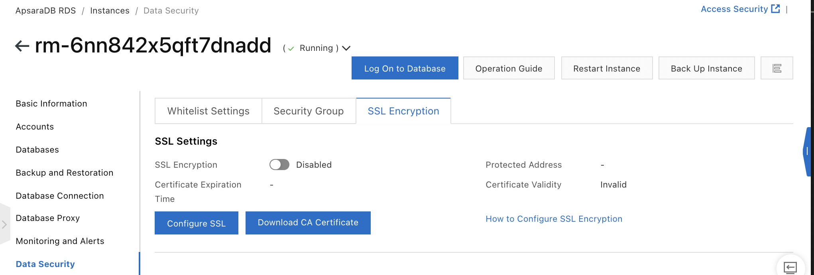{width="4.5in" height="1.525in"}

This feature is only available for Enterprise and High-availability
editions.

The SSL certificate file is then downloaded in compressed format. This
file contains:

-   a \`.p7b \`file: this is the SSL certificate file used under
    Windows,

-   a \`.pem \`file: this is the SSL certificate file under other
    operating systems,

-   a \`.jks \`file: this is the SSL certificate file used by Java.

All that remains is to configure the SSL certificate on the client.

Disabling SSL encryption or updating the validity period of an SSL
certificate requires a restart of the RDS instance.

To update the validity period of an SSL certificate:

-   Go to the \`Apsara for RDS \`console,

-   Click on \`Instances\`,

-   Click on the instance ID,

-   Click on \`Data Security \`on the line of the instance,

-   Click on the \`SSL Encryption \`tab,

-   Click on \`Update Validity.

\`The certificate file must be downloaded and then configured.

ApsaraDB RDS triggers a primary/secondary failover to minimize
disruption to the service. It is still recommended to disable SSL in
off-peak periods.

To disable SSL encryption:

-   Go to the \`Apsara for RDS \`console,

-   Click on \`Instances\`,

-   Click on the instance ID,

-   Click on \`Data Security\`,

-   Click on the \`SSL Encryption \`tab,

-   Disable \`SSL Encryption\`,

-   Click on \`OK\`.

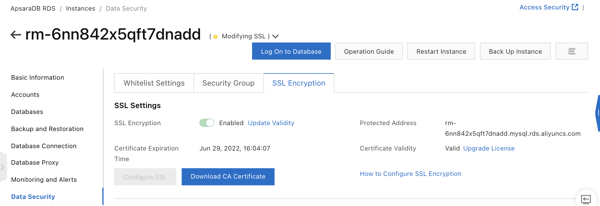{width="4.5in" height="1.5486111111111112in"}

### Enable disk encryption 

Disk encryption allows data to be encrypted on the disks of the RDS
instance, further increasing the level of security.

This feature is available for Standard or Enhanced SSD storage and for
the High Availability Edition.

Please note that disk encryption cannot be disabled after it is
activated. Moreover, snapshots are also encrypted.

To enable disk encryption, simply activate the \`Disk Encryption
\`option.

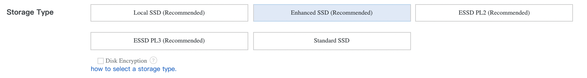{width="4.5in" height="0.6020833333333333in"}

### Encrypting with TDE 

TDE (Transparent Data Encryption) encrypts and decrypts incoming and
outgoing data files in real time. Data is encrypted before it is written
to disk and decrypted when it is read from disk into memory.

TDE does not increase the size of data files and its use is transparent
to developers.

Once activated, TDE cannot be deactivated and the key cannot be changed.

TDE uses a key managed by KMS. This key can either be generated by
Alibaba Cloud or customized.

To use the key generated by Alibaba Cloud:

-   Go to the \`Apsara for RDS \`console,

-   Click on \`Instances\`,

-   Click on the instance ID,

-   Click on \`Data Security\`,

-   Click on the \`TDE \`tab,

-   Activate \`TDE Status\`,

-   Check \`Use an Automatically Generated Key\`,

-   Click on \`OK\`.

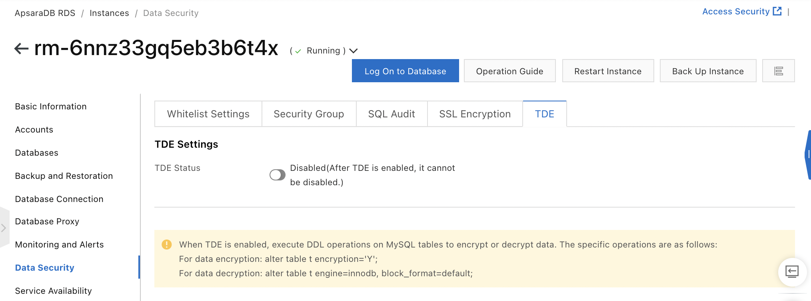{width="4.5in" height="1.6729166666666666in"}

This feature is available for the High-availability edition with local
SSDs.

To encrypt a table, execute the SQL command from the database (for MySQL
5.7 and higher):

\`alter table \< TABLENAME\> encryption=\'Y\';

\`To decrypt a table, execute the SQL command:

\`alter table \<tablename\> encryption=\'N\';

## \`Connection 

In order to connect to a RDS instance, an account and a whitelist must
be created.

To connect to a RDS for MySQL instance, you can use:

-   DMS (Data Management System): it is a graphical data management
    service provided by Alibaba Cloud supporting relational and NoSQL
    databases.

-   a database client: any MySQL database client can be used,

-   MySQL CLI: \`mysql -h\<HOSTNAME\> -P\<PORT\> -u\<USERNAME\>
    -p\<PASSWORD\> -D\<RDS_INSTANCE_NAME\>.\`

In this section, we will study how to connect with DMS and with private
and public endpoints.

### Connecting with DMS 

To connect to an instance with DMS:

-   Go to the \`Apsara for RDS \`console,

-   Click \`Log On to Database\`,

-   Click on \`+ New\`,

-   \`Data Source\`: select the source (here \`MySQL\`),

-   \`Instance Region\`: select the region where the instance to be
    accessed is located,

-   \`Instance ID\`: select the instance from the list,

-   \`Database Account\`: this is\` \`the name of the standard account
    that you created beforehand,

-   \`Database password\`: this is the associated password,

To test the connection, click on \`Test Connection\`. DMS will probably
display a list of IP addresses to add to the whitelist, unless they have
already been added.

-   Click on \`Submit\`.

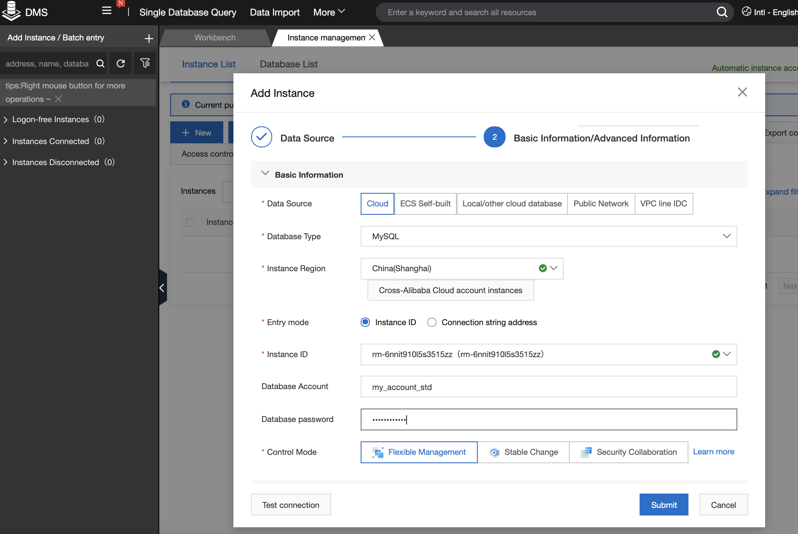{width="4.5in" height="3.0125in"}

### Connecting with endpoints 

ApsaraDB for RDS provides two types of endpoints:

-   interns,

-   audiences.

A private endpoint is provided by default. It allows for example an ECS
instance and a RDS instance in the same region and using the same type
of network to communicate. This is the option with the best security and
performance.

A public endpoint must be explicitly requested: it is not automatically
assigned. This is the least secure option. It should be avoided.

To request or release a public endpoint for an ApsaraDB RDS for MySQL
instance:

-   Go to the \`Apsara for RDS \`console,

-   Click on \`Instances\`,

-   Click on the instance ID,

-   Click on \`Database Connection\`,

-   Click \`Apply for Public Endpoint\`,

To release the public endpoint, click on \`Release Public Endpoint\`.

-   Click on \`OK\`.

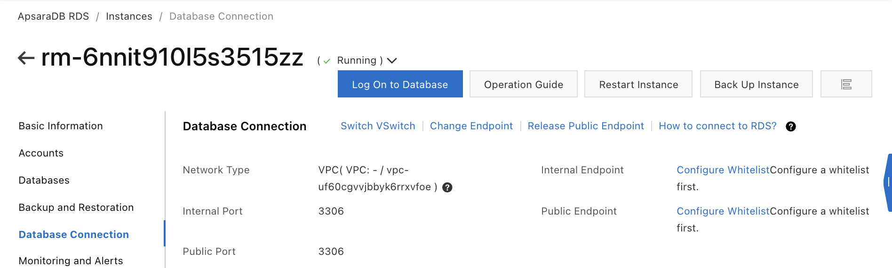{width="4.5in" height="1.3576388888888888in"}

To display the endpoint and the internal and public port of an instance:

-   Go to the \`Apsara for RDS \`console,

-   Click on \`Instances\`,

-   Click on the instance ID,

-   Click on \`See Detail \`next to \`Network Type\`.

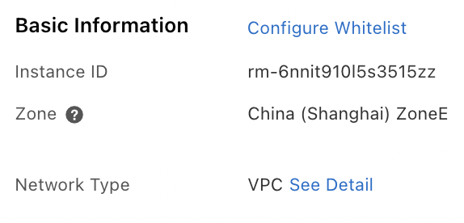{width="1.3322331583552056in"
height="0.640586176727909in"}

The information displayed is in this form:

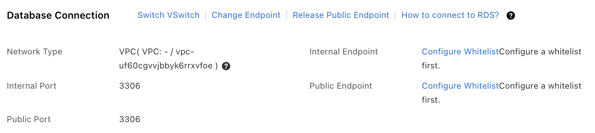{width="3.967422353455818in"
height="0.888996062992126in"}

To change the endpoint and the internal and public port of an instance:

-   Go to the \`Apsara for RDS \`console,

-   Click on \`Instances\`,

-   Click on the instance ID,

-   Click on \`Database Connection \`on the line of the instance,

-   Click on \`Change Endpoint\`,

{width="2.951898512685914in"
height="0.14531714785651795in"}

-   Select the connection type, the endpoint prefix and the port,

-   Click on \`OK\`.

{width="2.472843394575678in"
height="1.2520680227471566in"}

## The read-only instances 

If the RDS instance is overloaded by the number of requests, you can use
read-only instances to offload it. It can be created in any zone of the
same region. This will also increase the throughput.

A read-only instance is a read-only copy of the corresponding primary
instance. Changes made to the primary instance are automatically
replicated to all corresponding read-only instances. The life cycle of
the primary instance and the read-only instances are independent.

The read-only instance specifications and network type may be different
from those of the primary instance, but it is recommended that they be
greater than or equal to ensure that synchronization does not lag.

The number of read-only instances a primary instance can have depends on
its memory.

Although the whitelist is copied from the read-only instance creation,
its configuration is then independent.

Read-only instances do not support:

-   backup settings or manual backups,

-   data migration,

-   creation or deletion of databases,

-   creation or deletion of accounts,

-   account authorization,

-   change passwords.

### Create a read-only instance 

It is possible to create read-only instances for a primary RDS instance.
However, an existing instance cannot be switched to a read-only
instance.

A read-only instance does not inherit the parameters of the primary RDS
instance.

This feature is only available for the High-availability and Enterprise
editions.

To create a read-only instance:

-   Go to the \`ApsaraDB for RDS \`console,

-   Click on \`Instances\`,

-   Click on the RDS instance ID,

-   Click on \`Add \`next to \`Read-only Instance\`,

{width="3.0438812335958003in"
height="0.4105479002624672in"}

-   \`Billing Method\`: this is the payment method (\`Subscription \`or
    \`Pay-As-You-Go\`),

-   \`Zone\`: this is the zone where the instance is created,

-   \`Instance Type\`: this is the type of instance:

```{=html}
<!-- -->
```
-   \`General-purpose (Entry-level)\`: this is an instance with reserved
    memory and I/O resources but shared storage CPU,

-   \`Dedicated (Enterprise-level)\`: this is an instance with reserved
    memory, I/O resources, CPU and storage; it corresponds to a
    dedicated host instance or a dedicated instance,

```{=html}
<!-- -->
```
-   \`Capacity\`: this is the storage capacity,

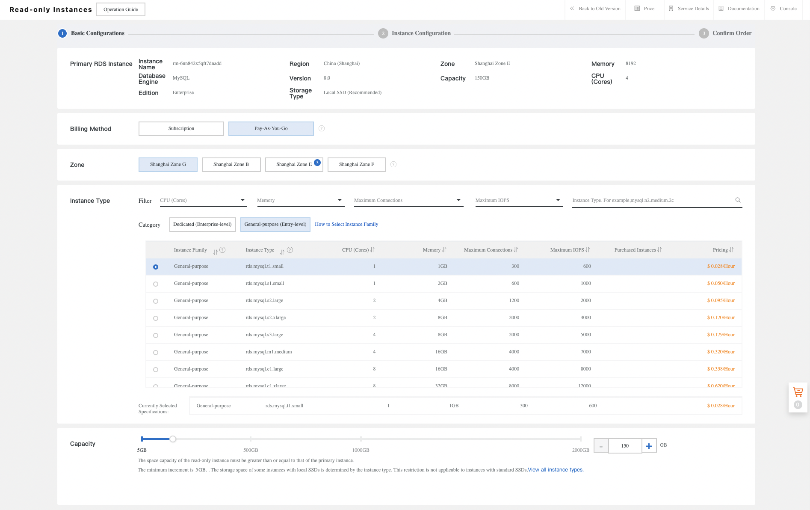{width="4.5in" height="2.8319444444444444in"}

-   Click on \`Next: Instance Configuration\`,

-   \`Network Type\`: this is the type of network:

```{=html}
<!-- -->
```
-   \`Classic Network\`: this is\` \`the traditional type of network,

-   \`VPC\`: this\` \`is the type of VPC network (recommended),

```{=html}
<!-- -->
```
-   \`VPC\`: this is the VPC where to create the instance,

-   \`VSwitch of Primary Node\`: this is the VSwitch where the instance
    is created,

-   \`Resource Group\`: this is the resource group to which the instance
    is associated,

-   Click \`Next: Confirm Order\`,

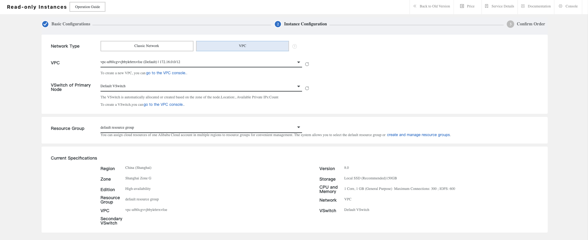{width="4.5in" height="1.8416666666666666in"}

-   Click on \`Pay Now\`.

To view information about a read-only instance:

-   Go to the \`ApsaraDB for RDS \`console,

-   Click on \`Instances\`,

-   Click on the ID of the primary instance.

The number of read-only instances is displayed next to \`Read-only
Instance\`.

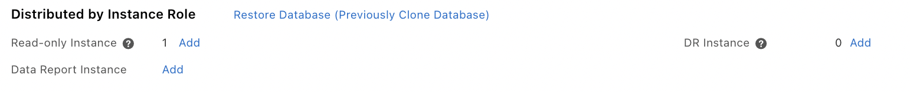{width="3.522975721784777in"
height="0.36099628171478565in"}

### Change the replication latency 

To change the replication latency in a read-only RDS instance:

-   Go to the \`Apsara for RDS \`console,

-   Click on \`Instances\`,

-   Click on the instance ID,

-   Click on \`Service Availability\`,

-   Click on \`Set Delayed Replication\`,

{width="4.878163823272091in"
height="0.2085269028871391in"}

-   \`Data Replication\`: this is the latency value (in seconds),

-   Click on \`OK\`.

## The database proxies 

ApsaraDB RDS for MySQL offers two types of proxies: the shared proxy and
the dedicated proxy. The shared proxy, or multi-tenant proxy, offers
fewer features than the dedicated proxy. The dedicated proxy forwards
application requests either to the primary RDS instances or to the
read-only instances. It is located between the application and the
database. It allows automatic read/write splitting, transaction
splitting and connection pooling.

The read/write split can be achieved by manually adding the endpoints of
the primary and read-only RDS instances to the application. To avoid
updating the endpoint configuration in the application, the dedicated
proxy provides a unified proxy endpoint that the application can use.

## The disaster Recovery 

In this section, we will look at how to create a disaster recovery
instance and how to switch, manually or automatically, from the primary
instance to the secondary instance in case of a failure.

### Create a disaster recovery instance 

To improve data reliability, ApsaraDB RDS for MySQL provides
geo-disaster recovery instances. Data from the primary instance is
synchronized in real time with its geo-disaster recovery instance using
DTS (Data Transmission Service). DTS allows to modify synchronization
objects, synchronization speed parameters and latency alerts.

The primary instance and the recovery instance must have the same
specifications and configurations. Only the region of the disaster
recovery instance can be chosen. In addition, the billing method must be
Pay-As-You-Go.

Disaster recovery instances have their own endpoints for databases. To
switch to the geo-disaster recovery instance, all you have to do is
update the application endpoints.

Disaster recovery instances do not support backup, data migration,
database management, public endpoints or endpoint modification.

The account must have the permissions \`SLAVE REPLICATION\`, \`CLIENT
REPLICATION \`and execution of SQL commands on objects.

If a database is deleted from the primary instance, it is not
automatically deleted from the disaster recovery instance: it must be
deleted manually.

To create a disaster recovery instance:

-   Go to the \`ApsaraDB for RDS \`console,

-   Click on \`Instances\`,

-   Click on the instance ID,

-   Click on \`Add \`to the right of \`DR Instance\`,

{width="3.1846194225721787in"
height="0.43886811023622047in"}

-   \`Database Account\`: this\` \`is the account of the database,

-   \`Database Password\`: this is\` \`the password,

-   Click on \`Buy Instance\`,

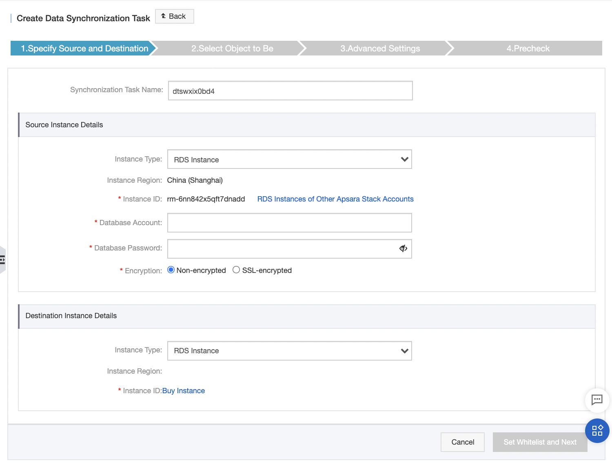{width="4.234543963254593in"
height="3.2183847331583553in"}

-   \`Region\`: this is the region,

-   Click on \`Purchase\`,

{width="2.1241502624671917in"
height="1.9153412073490814in"}

-   Click on \`Create account\`,

-   Click on \`OK\`,

-   \`Database Account\`: this is the account of the new instance,

-   \`Database Password\`: this is the password of the new instance,

{width="3.737390638670166in"
height="1.3507666229221347in"}

-   Click \`Set Whitelist and Next\`,

-   In the \`Available \`section, select the objects to synchronize,

-   Click on \`Next\`,

{width="4.5in"
height="3.1166666666666667in"}

-   Check \`Initial Schema Synchronization\`,

-   Click on \`Precheck\`,

{width="4.5in"
height="1.2548611111111112in"}

-   Click on \`Start Task and configure alerts in CloudMonitor\`,

-   Click on \`Close\`.

### Switch manually or automatically from the primary to the secondary instance 

The primary instance and the secondary instance must be in different
regions.

When the primary instance fails, you can perform an automatic switchover
to the secondary instance. The primary instance is then downgraded to
the secondary instance. The endpoint configuration of the application
must also be changed to use the endpoint of the secondary instance.

To manually switch from the primary instance to the secondary instance:

-   Go to the \`ApsaraDB for RDS \`console,

-   Click on \`Instances\`,

-   Click on the instance ID,

-   Click on \`Service Availability\`,

-   Click \`Switch to Primary/Secondary Instance\`,

-   \`Automatic Switchover\`: check \`Switching Now \`for an immediate
    switchover or \`Switch Within Maintenance Window Current Setting
    \`for a switchover in the maintenance window,

-   Click on \`OK\`.

## Modification of the instance 

The parameter templates allow you to manage RDS for MySQL instances in
batches.

In this section, we will study the modification of:

-   the configuration of a RDS instance,

-   the maintenance window, which is the period of time during which
    maintenance operations are performed,

-   the data replication mode between the RDS instance and its secondary
    RDS instances,

-   the billing method of an instance.

### Change the configuration 

You can change the configuration of a RDS instance. During this time,
the instance may be disconnected for about 30 seconds. In the case of
the \`Basic \`edition, this downtime can be up to 30 minutes.

To change the configuration:

-   Go to the \`ApsaraDB for RDS \`console,

-   Click on \`Instances\`,

-   Click on the instance ID,

-   Click on \`Change Specifications\`,

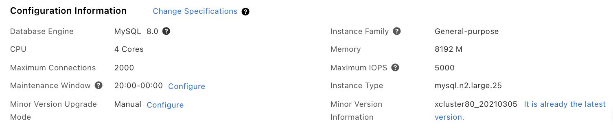{width="4.5in" height="0.9680555555555556in"}

-   Modify the specifications of the instance,

-   \`Switching Time: \`indicates the time of the switch:

```{=html}
<!-- -->
```
-   \`Switch Immediately After Data Migration\`: immediately after data
    migration,\`

-   Switch Within Maintenance Window\`: during the specified maintenance
    window,

```{=html}
<!-- -->
```
-   Click on \`Pay Now\`.

{width="4.5in"
height="3.2506944444444446in"}

### Modify the maintenance window 

The maintenance window is the period of time during which any
maintenance operations are performed. Before the maintenance starts,
emails are sent to the contacts listed in Alibaba Cloud accounts.

In order to guarantee the stability of the RDS instances, the
maintenance of the instances is performed at irregular intervals. The
default maintenance window is from 02:00 to 06:00. It is possible to
change this maintenance window.

The instance changes to the \`Maintaining Instance \`state before the
maintenance time. In this state, modification operations (upgrade,
reboot, etc.) are not available.

The instance is disconnected once or twice. Applications using this
instance should set up an automatic reconnection to avoid service
interruptions.

To change the maintenance window:

-   Go to the \`ApsaraDB for RDS \`console,

-   Click on \`Instances\`,

-   Click on the instance ID,

-   Click on \`Configure \`next to \`Maintenance Window\`,

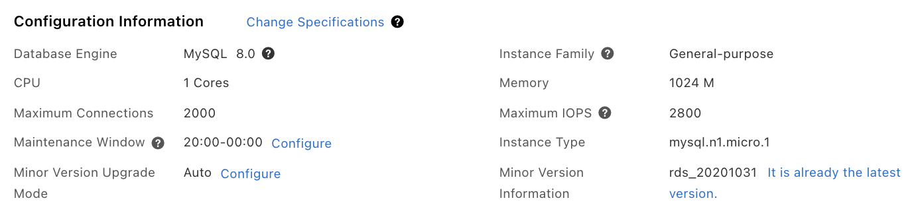{width="4.5in" height="1.0840277777777778in"}

-   Select the time window,

-   Click on \`OK\`.

{width="1.65836176727909in"
height="1.149306649168854in"}

### Change the data replication mode 

The data replication mode concerns the replication of data between the
RDS instance and its secondary RDS instances. This feature is available
for High-availability instances.

Two modes of data replication are available:

-   semi-synchronous,

-   asynchronous.

With the semi-synchronous mode, when the primary RDS instance receives
change requests from the application, it triggers a synchronization via
the logs on the secondary RDS instances. If the communication between
the primary and the secondaries encounters problems, the replication
mode becomes asynchronous.

With asynchronous mode, when the primary RDS instance receives change
requests, it processes the request, responds and then replicates the
data to the secondary RDS instances asynchronously afterwards.

To change the data replication mode:

-   Go to the \`ApsaraDB for RDS \`console,

-   Click on \`Instances\`,

-   Click on the instance ID,

-   Click on \`Service Availability\`,

-   Click \`Change Data Replication Mode\`,

{width="4.5in" height="0.15555555555555556in"}

-   \`Data Replication\`: this is the data replication mode
    (\`Semi-synchronous \`or \`Asynchronous\`),

-   Click on \`OK\`.

{width="1.8332272528433946in"
height="0.6540769903762029in"}

### Change the billing mode of an instance 

To change the billing mode of a RDS instance from \`Pay-As-You-Go \`to
\`Subscription\`:

-   Go to the \`ApsaraDB for RDS \`console,

-   Click on \`Instances\`,

-   Click on the instance ID,

-   Click on \`Subscription Billing\`,

{width="3.01378937007874in"
height="0.45392825896762906in"}

To switch from Subscription to \`Pay-As-You-Go \`billing, click on
\`Switch to Pay-you-go Billing\`.

-   \`Duration\`: this is the duration,

-   Click on \`Pay Now\`.

{width="4.5in"
height="1.6895833333333334in"}

## Upgrade of the RDS instance 

The automatic upgrade of minor versions is enabled by default. It is
performed during the maintenance window.

During this operation, the RDS instance must restart and is thus
unavailable for up to 30 seconds.

It is not possible to downgrade to the previous minor version.

To configure the update mode for the minor version of the engine:

-   Go to the \`ApsaraDB for RDS \`console,

-   Click on \`Instances\`,

-   Click on the instance ID,

-   Click on \`Configure\` to the\` \`right of \`Minor Version Upgrade
    Mode\`,

{width="3.059002624671916in"
height="0.828008530183727in"}

-   Select \`Auto \`or \`Manual \`mode,

-   Click on \`OK\`.

{width="1.9263845144356955in"
height="1.541107830271216in"}

To update the minor version of the engine:

-   Go to the \`ApsaraDB for RDS \`console,

-   Click on \`Instances\`,

-   Click on the instance ID,

-   Click on \`Upgrade Kernel Version\`,

-   \`Upgrade Time\`: this is the time of the upgrade (immediately,
    during the maintenance window or from a specific time),

-   Click on \`OK\`.

\`Upgrade Kernel Version \`is not visible if you use the latest minor
version of the engine:

{width="3.2116338582677164in"
height="1.0958202099737533in"}

It is possible to upgrade the database engine on major versions, but it
depends on the current version. See the official documentation for
details.

## Migration 

In this section, we will study:

-   data migration with DTS (Data Transmission Service) between
    heterogeneous databases,

-   synchronization of data from one ApsaraDB RDS for MySQL database
    instance with another instance.

### Migrating data with DTS 

DTS (Data Transmission Service) allows to migrate data between
heterogeneous databases thanks to its ETL (Extract, Transform, Load)
functions:

-   mapping of column, table and database names,

-   data filtering.

Migration is possible between an ApsaraDB RDS for MySQL instance and a
MySQL database installed on an ECS or on-premises instance, using a VPN
connection, a MySQL instance installed on another Cloud.

It is also possible between two MySQL databases installed by you and
between two Alibaba Cloud accounts.

To access Data Transmission Service (DTS):

-   Go to the \`Data Transmission Service \`console,

-   Click on \`Data Migration\`.

{width="3.8714326334208224in"
height="2.5337576552930883in"}

### Synchronize data 

It is possible to synchronize an ApsaraDB RDS for MySQL database
instance with another instance of the same or another MySQL engine.

Synchronization with an instance of the same engine can be done with
another ApsaraDB RDS for MySQL instance from your own Alibaba Cloud
account or another account, with a self-hosted MySQL instance on an ECS
instance, on an on-premises machine using a VPN.

Synchronization with another engine is possible using the MaxCompute
data warehouse solution.

## Monitoring and auditing 

In this section, we will study:

-   access to deployment metrics, on resources and on the engine,

-   modification of the monitoring frequency of the instance,

-   configuration of an alert rule for an instance,

-   the logs that allow to locate errors,

-   SQL Explorer to help with database troubleshooting,

-   access to the event history of a RDS instance.

### Display deployment, resource and engine metrics 

It is possible to display metrics on resources, engine and deployment of
an instance:

-   Go to the \`ApsaraDB for RDS \`console,

-   Click on \`Instances\`,

-   Click on the RDS instance ID,

-   Click on \`Monitoring and Alerts\`.

You can monitor the resources, the database engine or the deployment:

{width="4.5in"
height="1.4083333333333334in"}

For resource \`monitoring\`, the following metrics are available:

-   \`Disk Space (MB)\`: disk usage,

-   \`IOPS\`: number of input/output operations per second (IOPS),

-   \`Total Connections\`: number of active connections and total number
    of connections,

-   \`CPU Utilization and Memory Usage (%)\`: CPU and memory usage,

-   \`Network Traffic (KB)\`: incoming traffic volume per second and
    outgoing traffic volume per second.

For database engine \`monitoring\`, the following metrics are available:

-   \`TPS/QPS\`: average number of transactions per second (TPS) and
    average number of SQL statements executed per second,

-   \`InnoDB Buffer Pool Read Hit Ratio\`, \`Usage Ratio \`and \`Dirty
    Block Ratio (%)\`: ratio of read hit, usage and dirty block radio of
    the InnoDB buffer pool,

-   \`InnoDB Read/Write Volume (KB)\`: volume of data read from InnoDB
    per second and volume of data written to InnoDB per second,

-   \`InnoDB Buffer Pool Read/Write Frequency\`: number of reads from
    InnoDB per second and number of writes to InnoDB per second,

-   \`InnoDB Log Read/Write/fsync\`: frequency of reading/writing/fsync
    of InnoDB logs,

-   \`Temporary Tables Automatically Created on Hard Disk when MySQL
    Statements Are Executed\`: number of temporary tables created on
    hard disk when SQL statements are executed,

-   \`MySQL_COMDML\`: number of SQL statements executed per second,

-   \`MySQL_RowDML\`: number of operations performed by InnoDB per
    second,

-   \`MyISAM Read/Write Frequency\`: number of buffer pool reads/writes
    per MyISAM per second, number of hard disk reads/writes per MyISAM
    per second,

-   \`MyISAM Key Buffer Read/Write/Usage Ratio (%)\`: ratio of MyISAM
    key buffer reads, writes and uses per second,

-   \`Running Threads\`: number of active threads and number of
    connected threads.

For deployment \`monitoring\`, the following metrics are available:

-   \`Replication Thread Status of Secondary Instances\`: status of
    threads used to replicate data to the secondary RDS instance,

-   \`Replication Latency of Secondary Instances\`: latency of data
    replication to the secondary RDS instance (in seconds).

Please note that changing the frequency of some metrics may generate
fees.

### Change the monitoring frequency of the instance 

The monitoring frequency can be modified. The possible values depend on
the edition of the instance:

-   For the Basic edition, only the 300 second frequency is supported.

-   For the High Availability and Enterprise editions, the 60-second
    frequency is free. If the instance has a memory of more than 8 GB,
    the frequency can go up to every 5 seconds but with a fee.

It is possible to consult the monitoring data of the last 30 days.

To change the monitoring frequency of the instance:

-   Go to the \`ApsaraDB for RDS \`console,

-   Click on \`Instances\`,

-   Click on the RDS instance ID,

-   Click on \`Monitoring and Alerts\`,

-   Click \`Set Monitoring Frequency\`,

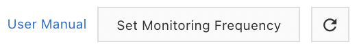{width="1.5024759405074366in"
height="0.22365048118985126in"}

-   Select a monitoring frequency,

-   Click on \`OK\`.

{width="2.3007720909886262in"
height="0.9043318022747157in"}

### Configure an alert rule for an instance 

Cloud Monitor is used to monitor RDS instances. This allows the
configuration of metrics and alert rules. Alerts can be sent via email
to contacts in an associated alert group.

To configure an alert rule for a RDS istance:

-   Go to the \`ApsaraDB for RDS \`console,

-   Click on \`Instances\`,

-   Click on the RDS instance ID,

-   Click on \`Monitoring and Alerts\`,

-   Click on the \`Alerts \`tab,

{width="4.5in"
height="1.3020833333333333in"}

-   Click \`Set Alert Rule\`.

Alibaba Cloud redirects you to CloudMonitor:

{width="4.5in"
height="1.9180555555555556in"}

### View logs 

To locate errors, you should query the error logs and the slow request
logs.

To view the logs:

-   Go to the \`ApsaraDB for RDS \`console,

-   Click on the RDS instance ID,

-   Click on \`Logs\`,

-   Click on:

```{=html}
<!-- -->
```
-   \`Binlog Subscription: \`allows to subscribe to the MySQL binlog in
    real time,

-   \`Error Logs\`: records the SQL orders that failed to execute in the
    last month,

-   \`Slow Log Query Details\`: records SQL commands that lasted longer
    than one second in the last month,

-   \`Slow Log Summary: \`provides statistics and analysis reports for
    SQL orders that lasted longer than one second in the last month,

-   \`Primary/Secondary Switching Logs\`: logs for the primary and the
    secondary instance (except for the \`Basic \`edition).

{width="4.5in"
height="1.0819444444444444in"}

### Troubleshooting with SQL Explorer 

SQL Explorer helps with database troubleshooting, action analysis and
security auditing. It is an enhancement of SQL Audit.

It allows to consult the data for a period of up to 24 hours. Beyond
that, it is recommended to export the data locally to be consulted.

SQL Explorer also allows to interactively and visually analyze the logs
over a period of time to identify abnormal SQL statements and
performance problems.

Incremental data can be displayed via:

-   SQL logs,

-   binary logs.

SQL logs are similar to MySQL audit logs. They record information about
DML and DDL operations. This information is obtained by analyzing
network protocols. Since the actual values of the parameters are not
analyzed, if the volume of executed SQL queries is large, a small amount
of data may be lost.

Binary logs record information about add, delete and modify operations.
They also record incremental data used for data recovery. This data is
stored temporarily in the RDS instance. Periodically these logs are
uploaded to an OSS bucket, where they are kept for seven days. Note that
since binary log files being written cannot be backed up, some files may
not have been uploaded to OSS.

To reduce storage costs, SQL explorer uses columnar storage and
compression technology.

### View the event history of a RDS instance 

It is possible to display the operation and maintenance (O&M) events
performed by both users and Alibaba Cloud on a RDS instance: instance
creation, settings configuration, \...

To view the event history of a RDS instance:

-   Go to the \`ApsaraDB for RDS \`console,

-   Click on \`Event\`,

-   Click on the \`Historical Events \`tab.

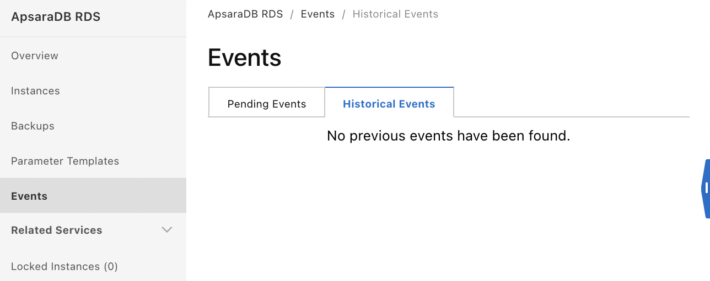{width="2.663280839895013in"
height="1.0587357830271216in"}

The event history of the instance is displayed, indicating the type of
resources, their name and the type of event.

## Backing up a database 

Backups allow you to restore a RDS instance from a backup file. Backups
can be automatic or manual. It is recommended to perform backups during
off-peak hours.

The backup files are kept for the specified retention time. They can be
kept after the release of the instance.

Read-only RDS instances do not support backup settings.

The backup can be of the data or the logs.

The log backup saves the binary logs generated by the RDS instance.
These backups are used for point-in-time restores. They occupy a storage
space of the instance. These files are not accessible.

It is possible to run queries directly on the data stored in the backup
files, without having to restore these files.

The backup can be:

-   logical: save objects (like tables) with \`mysqldump\`,

-   physical: backs up database files at the operating system level,

-   snapshots: save a copy of the data.

In this section, we will study:

-   data backup and recovery,

-   backup and restore data between regions,

-   Backup and restore a specific database and specific tables,

-   upload binary log files to an OSS bucket.

### Save data 

Data and logs can be saved:

-   automatically by defining a backup policy,

-   manually.

Each RDS instance has a quota of free backup space.

During the execution of DDL (Data Definition Language) commands, tables
are locked, preventing backups. Therefore, no DDL operations should be
performed during a backup.

To enable automatic backups of a RDS instance:

-   Go to the \`ApsaraDB for RDS \`console,

-   Click on the instance ID,

-   Click on \`Backup and Restoration\`,

-   Click on the \`Backup Settings \`tab,

-   Click on \`Edit \`next to \`Data Backup Settings\`,

{width="4.5in"
height="3.1152777777777776in"}

-   \`Data Backup Retention (Days)\`: this is the data retention period
    (from 7 to 730 days) (default 7 days); with the \`Basic \`edition,
    its value cannot be modified,

-   \`Backup Cycle\`: this\` \`is the duration of the backup cycle,

-   \`Backup Time\`: this\` \`is the scheduled time for the backup,

It is recommended to choose off-peak hours.

-   \`Log Backup: \`allows to save logs,

-   \`Log Retention Period (Days)\`: this is the log retention period
    (from 7 to 730 days) (by default 7 days); with the \`Basic
    \`edition, its value cannot be modified,

-   \`Long-term Retention \`(for High Availability Edition with local
    SSDs): retains backups after the RDS instance is released,

-   \`Backup Retention Policy After Release \`(for the High Availability
    Edition with local SSDs): this is the policy for retaining backup
    files after the release of a RDS instance (valid values are
    \`None\`, \`Latest \`and \`All\`),

To avoid data loss in case of involuntary interruption (late payment,
\...), it is recommended to select \`Latest \`or \`All\`.

-   \`Restore Individual Database/Table \`(for High Availability edition
    with local SSDs): allows to restore specific databases and tables
    (the format of the backup files is modified for this purpose),

-   \`Increase Snapshot Frequency Table \`(for the High Availability
    edition with enhanced SSDs): this is the frequency of backup
    (maximum of once every 15 minutes),

-   \`Single-digit Second Backup \`(for the High Availability Edition
    with enhanced SSDs): allows to perform a backup in less than one
    second,

\`Increase Snapshot Frequency Table \`and \`Single-digit Second Backup
\`cannot be activated at the same time.

-   Click on \`Save\`.

{width="3.119416010498688in"
height="1.84998687664042in"}

To perform a backup manually:

-   Go to the \`ApsaraDB for RDS \`console,

-   Click on the RDS instance ID,

-   Click on \`Back Up Instance\`,

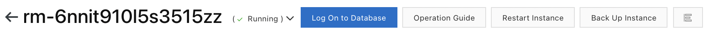{width="3.611324365704287in"
height="0.1761078302712161in"}

-   \`Select Backup Mode \`(for instances with local SSDs): this is the
    backup mode, which can be \`Physical Backup \`or \`Logical Backup
    \`(in this case you have to specify one or more databases),

-   \`Backup Policy \`(for instances with enhanced SSDs): this is the
    backup policy; select \`Snapshot Backup\`,

-   Click on \`OK\`.

{width="2.729948600174978in"
height="1.2651290463692038in"}

To view the status of the project, click on \`Task Progress\`.

### Restore data 

Data from a RDS for MySQL instance can be restored in two ways:

-   by restoring the data to a new RDS instance and then migrating the
    restored data to the original RDS instance,

-   by restoring data from a specific database or table to the original
    RDS instance or to a new RDS instance.

The original RDS instance must be in the \`Running \`state and not
locked.

To be able to restore data from a time point, the log backup must be
activated.

It is recommended not to perform DDL operations during data migration.

To restore data to a new instance:

-   Go to the \`ApsaraDB for RDS \`console,

-   Click on \`Instances\`,

-   Click on the instance ID,

-   Click on \`Backup and Restoration\`,

-   Click on \`Restore Database (Previously Clone Instance)\`,

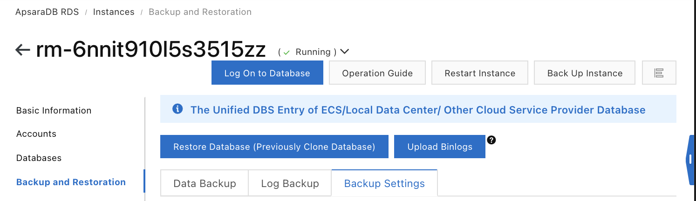{width="3.5021106736657917in"
height="1.0128018372703411in"}

-   \`Billing Method\`: this is the billing method (\`Pay-As-You-Go \`or
    \`Subscription\`); in the case of \`Subscription\`, you must also
    specify the duration and quantity,

-   \`Restore Mode\`: this\` \`is the restore mode (\`By Time \`to
    specify a point in time or \`By Backup Set\`),

-   \`Zone of Primary Node\`: this is\` \`the zone to which the primary
    RDS instance belongs,

-   \`Deployment Method\`: this is\` \`the deployment method:

```{=html}
<!-- -->
```
-   \`Single-zone Deployment\`: deployment is done in a single zone; in
    this case, \`Zone of Primary Node \`and \`Zone of Secondary Node
    \`have the same value,

-   \`Multi-zone Development\`: deployment is done on several zones in
    order to guarantee disaster recovery,

```{=html}
<!-- -->
```
-   \`Zone of Secondary Node\`: this is\` \`the zone to which the
    secondary RDS instance belongs,

-   \`Instance Type\`: this is the type of RDS instance:

```{=html}
<!-- -->
```
-   \`General-purpose (Entry-level)\`,

-   \`Dedicated (Enterprise-level)\`,

The \`General-purpose (Entry-level) \`instance type provides dedicated
memory and I/O resources but shares CPU and storage with other instances
on the same server.

The \`Dedicated (Enterprise-level) \`instance type provides dedicated
CPU, memory, storage and I/O resources.

-   \`Capacity\`: this is the storage capacity,

-   Click \`Next: Instance Configuration\`,

-   \`Network Type\`: this\` \`is the type of network (\`Classic Network
    \`or \`VPC\`),

-   Click \`Next: Confirm Order\`,

-   \`Duration\`: this\` \`is the duration (1 month or more),

-   \`Purchase Plan\`: this\` \`is the number of instances,

-   Click on \`Pay Now\`.

To migrate data between two RDS instances:

-   Go to the \`Data Transmission Service \`console,

-   Click on \`Data Migration\`,

-   Click on \`Create Migration Task\`,

-   Enter the parameters on the source database:

```{=html}
<!-- -->
```
-   \`Instance Type\`: this is the type of instance (user-created
    instance, RDS instance, etc.); select \`RDS Instance\`,

-   \`Instance Region\`: this is\` \`the region where the RDS instance
    is located,

-   \`RDS Instance ID\`: this is\` \`the ID of the new instance,

-   \`Database Account\`: this is\` \`the username of the RDS instance
    account,

-   \`Database Password\`: this is\` \`the password of the new RDS
    instance account,

-   \`Encryption\`: select \`Non-encrypted\`, (possible values are
    \`Non-encrypted \`and \`SSL-encrypted\`,

{width="4.5in"
height="2.561111111111111in"}

-   Enter the parameters on the destination database:

```{=html}
<!-- -->
```
-   \`Instance Type\`: this is the RDS instance,

-   \`Instance Region\`: this is\` \`the region where the original RDS
    instance is located,

-   \`RDS Instance ID\`: this is\` \`the ID of the original instance,

-   \`Database Account\`: this is\` \`the username of the RDS instance
    account,

-   \`Database Password\`: this is\` \`the password of the RDS instance
    account,

{width="4.5in"
height="1.7333333333333334in"}

-   Click \`Set Whitelist and Next\`,

-   Select the type of migration (\`Schema Migration\`) and the objects
    to migrate (\`Full Data Migration\`),

-   Select the objects to be migrated,

-   Click on \`Precheck\`,

-   Click on \`Next\`,

-   Click on \`Buy and Start\`.

### Save data between regions 

To perform data backup between regions, local backup files are
automatically replicated to an OSS bucket located in the destination
region. Then the RDS instance is restored in the other region from the
backup to the OSS bucket in that region.

This backup is independent of the RDS instance: it is not deleted even
after the RDS instance is released.

If no backup file was created less than 24 hours ago, a backup is made.
If a continuous binary log file has been generated, this data is dumped.
Otherwise, a backup is triggered.

The cross-region backup feature is not available in all regions. When it
is available, a \`Cross-region Backup \`item is added to the RDS Console
menu.

### Restore data from one RDS instance across multiple regions 

It is possible to restore data from a backup to an instance in another
region. To do this, the RDS instance must be backed up to several
regions.

To restore data from a RDS instance across multiple regions:

-   Go to the \`ApsaraDB for RDS \`console,

-   Click on \`Backups\`,

-   Click on the \`Cross-region Backup \`tab,

-   Click on the instance ID,

Cross-region backup must be enabled. If this is not the case, click on
\`Settings \`on the line of the instance and activate \`Enable\`.

-   Click on \`Restore\`,

-   Click on the \`Data Backup \`tab,

-   Click on \`Restore \`on the line of the backup,

-   Select \`Restore To New Instance\`: this is the restore destination,

-   Click on \`OK\`,

-   Click on the \`Subscription \`or \`Pay-As-You-Go \`tab,

-   \`Restore Mode\`: this is the restore mode; the possible values are:

```{=html}
<!-- -->
```
-   \`By Backup Set\`: the restoration of the whole backup is performed,

-   \`By Time\`: the restoration is done at a point in time of the
    backup; this option requires that the log backup is activated,

```{=html}
<!-- -->
```
-   \`Backup Set\`: this\` \`is the backup set to restore (only
    displayed if the restore mode is \`By Backup Set\`),

-   \`Restore Point\`: this is\` \`the time at which to start the
    restore (only displayed if the restore mode is \`By Time\`),

-   \`Region\`: this is the region to which the new instance belongs,

-   \`Zone\`: this is the zone where the new instance is located; it
    must be the same region as the original instance but the zone can be
    different,

-   \`CPU and Memory\`: this is\` \`the type of instance of the new
    instance,

-   \`Capacity\`: this is the storage capacity of the new instance,

-   \`Network Type\`: this\` \`is the type of network (\`Classic Network
    \`or \`VPC\`),

-   \`Duration\`: this\` \`is the duration (only in the case of
    subscription)

-   \`Quantity\`: this is\` \`the number of RDS instances,

-   Click on \`Buy Now\`,

-   Click on \`Pay Now\`.

{width="3.0299693788276465in"
height="1.3690966754155731in"}

### Backup a specific database and specific tables 

To set up an automatic individual database and table backup:

-   Go to the \`ApsaraDB for RDS \`console,

-   Select the region of the RDS instance,

-   Click on the RDS instance ID,

-   Click on \`Backup and Restoration\`,

-   Click on the \`Backup Settings \`tab,

-   Click on the \`Edit \`button next to \`Data Backup Settings\`,

-   Check \`Restore Individual\`,

-   Click on \`Save\`.

To back up a specific database and table:

-   Go to the \`ApsaraDB for RDS \`console,

-   Select the region of the RDS instance,

-   Click on the RDS instance ID,

-   Click on \`Back Up Instance\`,

-   \`Select Backup Mode\`: select \`Logical Backup\`,

-   \`Backup Policy\`: select \`Database/Table Backup\`,

-   Select the databases to be backed up,

-   Click on \`OK\`.

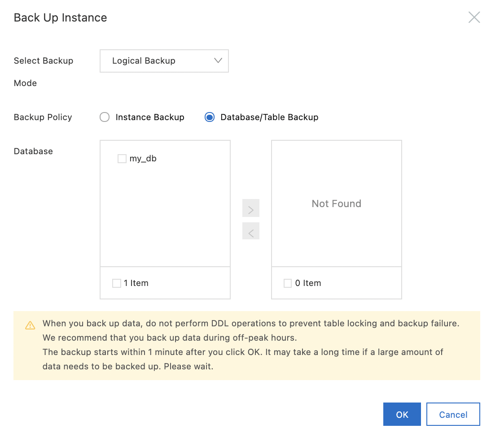{width="2.475702099737533in"
height="2.1861056430446193in"}

### Restore an individual database and table 

It is possible to restore a database or an individual table.

The destination RDS instance must be in the \`Running \`state and must
not be locked. No migration task must be running on this instance. In
addition, the log backup must be enabled.

In the case of recovery on the same instance, a primary/secondary
failover is triggered during the recovery. A service interruption of the
database may occur for about 30 seconds. The client must then reconnect
automatically. Databases and tables must have new names. By default, RDS
adds \`\_backup \`to the original names.

This restore causes the backup file format to change from \`tar \`to
\`xbstream\`, which results in a slight increase in backup storage
space.

To restore an individual database or table:

-   Go to the \`ApsaraDB for RDS \`console,

-   Click on \`Instances\`,

-   Click on the instance ID,

-   Click on \`Backup and Restoration\`,

-   Click on \`Restore Individual Database/Table\`,

{width="2.9171675415573053in"
height="0.1967290026246719in"}

-   \`Restore To\`: this is the destination of the restore; the values
    can be:

```{=html}
<!-- -->
```
-   \`Current Instance\`: the restoration is done on the same instance,

-   \`New Instance\`: the restoration is done in a new instance,

```{=html}
<!-- -->
```
-   \`Restore Method:\` this is the restore method; the possible values
    are:

```{=html}
<!-- -->
```
-   \`By Backup Set\`: the restoration of the whole backup is performed,

-   \`By Time\`: the restoration is done at a point in time of the
    backup,

This option requires the activation of the log backup.

-   \`Backup Set\`: this is the backup set to restore (only displayed if
    the restore method is \`By Backup Set\`).

{width="2.949925634295713in"
height="1.3880129046369203in"}

If the restore method is \`By Time\`, other options are available in
addition:

-   \`Restorable Time\`: this is\` \`the time at which to start the
    restoration (only displayed if the restoration method is \`By
    Time\`),

-   \`Restore Mode\`: this is the restore mode (displayed only if
    read-only RDS instances are attached to the RDS instance); the
    possible values are:

```{=html}
<!-- -->
```
-   \`Logical Restoration\`: the restoration is slow,

-   \`Physical Restoration\`: the restoration is fast but triggers a
    primary/secondary failover and all attached read-only RDS instances
    are restarted, ­

```{=html}
<!-- -->
```
-   \`Databases and Tables to Restore\`: these are the databases and
    tables to restore,

The occupied storage space is displayed.

-   \`Selected Databases and Tables\`: these are the selected databases
    and tables,

It is possible to specify new names.

The occupied storage space and the free space are displayed.

-   Click on \`OK\`.

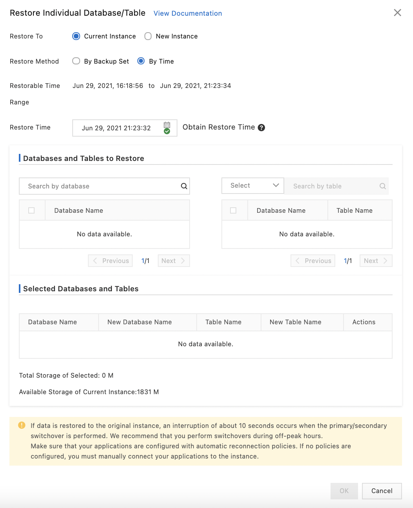{width="2.6086811023622047in"
height="3.2089195100612424in"}

If the value of the \`Restore To \`parameter is \`New Instance\`, the
following parameters must be filled in:

-   \`Zone\`: this is the zone where the new instance is located,

It must be the same region as the original instance but the area may be
different.

-   \`CPU and Memory\`: this is\` \`the type of instance of the new
    instance,

-   \`Capacity\`: this is the storage capacity of the new instance,

-   \`Network Type\`: this\` \`is the type of network (\`Classic Network
    \`or \`VPC\`).

### Upload binary log files to an OSS bucket 

It is possible to upload binary log files to an OSS bucket.

If the size of a backup file exceeds 500 MB, a new file is generated and
the previous one is stored in an OSS bucket.

By default, the system keeps the binary log files generated in the last
18 hours.

When the space is more than 80% used, local binary log files are deleted
once they have been uploaded to OSS.

To configure a rule to automatically upload binary log files:

-   Go to the \`ApsaraDB for RDS \`console,

-   Click on \`Instances\`,

-   Click on the instance ID,

-   Click on \`Backup and Restoration\`,

-   Click on \`Edit \`next to \`Local Log Backup Settings\`,

{width="1.3600820209973754in"
height="0.8113790463692039in"}

-   \`Retention Period: \`this is the retention period of the log files
    (from 0 to 168 hours, 18 hours by default),

-   \`Max Storage Usage\`: this is the maximum storage fill rate (from 0
    to 50%, 30% by default); beyond that, files are deleted,

-   \`Retained Binlogs\`: this is the maximum number of binary log files
    retained (from 6 to 100, 60 by default); beyond this limit, files
    are deleted, starting with the oldest,

-   \`Protect Available Storage\`: triggers the deletion of files
    starting with the oldest (80% full or free space less than 5 GB),

-   Click on \`OK\`.

{width="2.5576454505686788in"
height="2.2008388013998252in"}

To upload binary log files manually:

-   Go to the \`ApsaraDB for RDS \`console,

-   Click on \`Instances\`,

-   Click on the instance ID,

-   Click on \`Backup and Restoration\`,

-   Click on the \`Upload Binlogs \`tab,

-   Click on the \`OK \`tab.

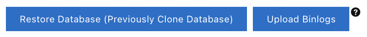{width="1.649313210848644in"
height="0.16798556430446193in"}

## Billing 

In this section, we will study:

-   Manual and automatic renewal of the proceedings,

-   The change from pay-as-you-go to subscription-based billing.

### Switch from pay-as-you-go to subscription billing 

Changing the billing mode does not interrupt the operation of a RDS
instance.

A RDS instance cannot switch from subscription billing to
fee-for-service.

### Renew manually 

You can manually renew a subscription-based instance before it expires
or within 15 days of its expiration.

It is possible to activate the automatic renewal.

### Renew automatically 

A \`Pay-As-You-Go \`instance has no expiration date and no renewal is
required.

If you have enabled auto-renewal for your subscription-based instance, a
payment will be deducted three days before the expiration date.

To enable or disable automatic renewal after purchasing a RDS instance:

-   Go to the \`ApsaraDB for RDS \`console,

-   Select \`Expenses \| Renewal Management \`from the navigation bar.

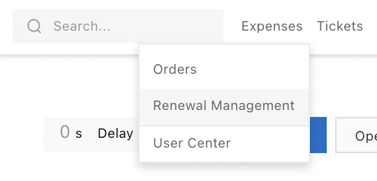{width="1.2244772528433945in"
height="0.5895636482939632in"}

Click \`Enable Auto Renewal \`on the instance to activate the renewal.

Click \`Enable Manual Renewal \`to disable renewal.

Click on \`Edit Auto Renewal \`to change the auto renewal cycle.

# DNS 

Domain names not registered by Alibaba Cloud can be managed by Alibaba
Cloud. They can be grouped into clusters. Subdomains are also supported.

Alibaba Cloud DNS supports DNS records of type \`A\`, \`CNAME\`, \`MX\`,
\`AAAA\`, \`TXT\`, \`NS\`, \`SRV\`, \`CAA\`, \`URL\`, \`PTR \`as well as
implicit URL forward, which uses an iFrame, and explicit, which uses
HTTP code. DNS records can be imported into the DNS console from a file.

Intelligent DNS resolution returns an IP address based on the origin of
the visitor. IP addresses can be weighted.

Alibaba Cloud DNS can be used as a secondary DNS.

DNS Cache is a DNS proxy that allows to use Alibaba Cloud DNS without
DNS migration.

SearchEngine allows the website to be indexed only from the specified IP
address.

DNSSEC secures the authenticity of the response provided by the DNS
server while domain names are protected against DDoS attacks. Two levels
of protection are available: basic or advanced.

The paid version of Alibaba Cloud DNS allows to see the volume of DNS
requests.

## Management of the Domain names

First of all, if the domain name you want to manage is not registered in
Alibaba Cloud, you must first add it in the DNS console.

To add a domain name that has been registered in Alibaba Cloud:

-   Go to the \`Domains \`console,

-   Click on \`Resolve \`on the line of the domain name,

{width="4.5in" height="1.3291666666666666in"}

-   Modify DNS records.

{width="4.5in"
height="1.5055555555555555in"}

To add a domain name that has not been registered in Alibaba Cloud:

-   Go to the \`Alibaba Cloud DNS \`console,

-   Click on \`Manage DNS\`,

-   Click on \`Add Domain Name\`,

-   Enter a primary domain or subdomain,

-   Click on \`OK\`.

{width="2.0209087926509186in"
height="1.0397703412073491in"}

To delete a domain name that is not registered in Alibaba Cloud:

-   Go to the \`Alibaba Cloud DNS \`console,

-   Click on \`Manage DNS\`,

-   Select the line of the domain name,

-   Click on \`Delete\`,

-   Click on \`OK\`.

A domain name registered in Alibaba Cloud cannot be deleted.

Alibaba Cloud DNS supports sub-domains. As a reminder:

-   \`mywebsite.com \`is a top level domain, also known as a main TLD,

-   \`www.mywebsite.com \`is a second level subdomain,

-   \`backup.www.mywebsite.com \`is a third level subdomain.

Alibaba provides a DNS inspection tool, which is useful to get detailed
information about DNS records: \`https://zijian.aliyun.com/\`.

To add a subdomain hosted by Alibaba Cloud DNS to a domain hosted by a
third-party DNS provider:

-   Go to the \`Alibaba Cloud DNS \`console,

-   Click on \`Manage DNS\`,

-   Click on \`Add Domain Name\`,

-   Enter the subdomain,

-   Click on \`Verify TXT Record\`,

{width="1.9001017060367453in"
height="0.9626596675415573in"}

-   Copy the host and \`TXT \`records,

{width="1.627477034120735in"
height="1.2723458005249344in"}

-   Go to your third party DNS provider,

-   Paste these values,

-   Validate the change,

-   Return to the \`Alibaba Cloud DNS \`console,

-   Click on \`Verify\`,

-   Click on \`Verified\`: the subdomain should appear in the list,

-   Click on the subdomain,

-   Click on \`Add Record\`,

-   Add NS records to the primary domain: these values are displayed in
    the \`Alibaba Cloud DNS \`console.

## Management of the groups

To facilitate the management of DNS records, domain names can be
grouped. The \`ALL \`group is the default group. It is created
automatically. The number displayed next to it indicates the number of
domain names managed by Alibaba Cloud DNS.

To create a group:

-   Go to the \`Alibaba Cloud DNS \`console,

-   Click on \`Manage DNS\`,

-   Click on the \`ALL \`list and then click on \`+\`,

-   Enter a group name,

-   Click on the validation icon.

To change a group name and delete a group:

-   Go to the \`Alibaba Cloud DNS \`console,

-   Click on \`Manage DNS\`,

-   Click on \`ALL \`and then on the edit icon.

{width="0.8135531496062992in"
height="0.6754024496937883in"}

To create a group, click on the \"plus\" icon, enter the name of the
group and validate the entry.

To delete a group, click on the trash can icon on the line of the group.

To change the group to which a domain name belongs:

-   Go to the \`Alibaba Cloud DNS \`console,

-   Click on \`Manage DNS\`,

-   Click on the domain name,

-   Click on \`Change Group\`,

-   Select the destination group,

-   Click on \`OK\`.

{width="1.7310542432195974in"
height="0.9475393700787401in"}

The ALL group is the default group created automatically. The number
displayed next to it indicates the number of domain names managed by
Alibaba Cloud DNS.

A domain name cannot be added to multiple groups.

Deleting a group will delete the domain names in that group.

A domain name cannot be added to multiple groups.

## Management of the DNS records

In this section, we will explore how to handle DNS records of type
\`A\`, \`CNAME\`, \`MX\`, \`AAAA\`, \`TXT\`, \`NS\`, \`SRV\`, \`CAA\`,
\`URL\`, \`PTR \`as well as implicit and explicit forward with Alibaba
Cloud DNS.

{width="3.000075459317585in"
height="2.411172353455818in"}

### Add a DNS record 

#### The A

An \`A \`record indicates an IP address.

To add a record \`A:\`

-   Go to the \`Alibaba Cloud DNS \`console,

-   Click on \`Manage DNS\`,

-   Click on a domain name,

-   Click on \`Add Record\`,

-   \`Type\`: select \`A\`,

-   \`Host:\` enter \`XXX \`(if the subdomain is \`XXX.mywebsite.com\`)
    or \`@ \`(if the subdomain is \`mywebsite.com\`),

-   \`ISP Line\`: this is the ISP line; select \`Default\`,

-   \`Value:\` this is the IPv4 address,

-   \`TTL\`: this is the duration of the cache (10 minutes by default),

-   Click on \`Confirm\`.

#### The CNAME record

A \`CNAME \`record provides an alias to a domain. It allows a domain
name to point to another domain name that is associated with an IP
address.

These records are used with CDN, emails and Global Traffic Manager.

To add a \`CNAME \`record:

-   Go to the \`Alibaba Cloud DNS \`console,

-   Click on \`Manage DNS\`,

-   Click on the domain name,

-   Click on \`Add Record\`,

-   \`Type\`: select \`CNAME\`,

-   \`Host:\` enter \`XXX \`(if the subdomain is \`XXX.mywebsite.com\`)
    or \`@ \`(if the subdomain is \`mywebsite.com\`),

-   \`ISP Line\`: this is the ISP line; select \`Default\`,

-   \`Value:\` this is the IPv4 address,

-   \`TTL\`: this\` \`is the duration of the cache (10 minutes by
    default),

-   Click on \`Confirm\`.

#### MX recording

The \`MX \`(Mail eXchanger) record allows to receive emails. It
indicates the mail server that receives emails according to the suffix
of the recipient\'s email.

To add a \`MX \`record:

-   Go to the \`Alibaba Cloud DNS \`console,

-   Click on \`Manage DNS\`,

-   Click on the domain name,

-   Click on \`Add Record\`,

-   \`Type\`: select \`MX\`,

-   \`Host\`: enter \`YYY \`(if the subdomain is XXX@YYY.mywebsite.com)
    or \`@ \`(if the subdomain is XXX@mywebsite.com),

-   \`ISP Line\`: this is the ISP line; select \`Default\`,

-   \`Value\`: this value can be obtained from the email registrar,

This can be a domain name or an IP address.

Use \`mx1.qiye.aliyun.com \`or \`mx2.qiye.aliyun.com \`for Alibaba Mail.

-   \`MX Priority\`: this value can be obtained from the email
    registrar,

The smaller the value, the higher the priority.

-   \`TTL\`: this\` \`is the duration of the cache (10 minutes by
    default),

-   Click on \`Confirm\`.

To create a mailbox, you need to add a \`MX\`, \`CNAME \`and \`TXT
\`record.

#### AAAA registration

The AAAA record allows website visitors to use an IPv6 address.

To add a \`AAAA \`record:

-   Go to the \`Alibaba Cloud DNS \`console,

-   Click on \`Manage DNS\`,

-   Click on the domain name,

-   Click on \`Add Record\`,

-   \`Type\`: select \`AAAA\`,

-   \`Host\`: enter \`XXX \`(for subdomains like \`XXX.mywebsite.com\`)
    or \`@ \`(for subdomains like \`mywebsite.com\`),

-   \`ISP Line\`: this is the ISP line; select \`Default\`,

-   \`Value:\` this is the IPv6 address,

-   \`TTL\`: this is the duration of the cache (10 minutes by default),

-   Click on \`Confirm\`.

#### The TXT record

The \`TXT \`record is used to identify and describe the domain. In
general, the \`TXT \`record is used as an \`SPF \`(Sender Policy
Framework) record to prevent spam. Only IP addresses listed in the \`A
\`and \`MX \`records of the domain name are allowed to use this domain
name to send emails,

To add a \`TXT \`record:

-   Go to the \`Alibaba Cloud DNS \`console,

-   Click on \`Manage DNS\`,

-   Click on the domain name,

-   Click on \`Add Record\`,

-   \`Type\`: select \`TXT\`,

-   \`Host\`: enter \`XXX\` (for domain names like
    \`XXX.mywebsite.com\`) or \`@ \`(for domain names like
    \`mywebsite.com\`),

-   \`ISP Line\`: this is the ISP line; select \`Default\`,

-   \`Value\`: this is the valuecof the SPF,

-   \`TTL\`: this\` \`is the duration of the cache (10 minutes by
    default),

-   Click on \`Confirm\`.

#### NS registration

The \`NS \`record allows to delegate a subdomain to another DNS
provider.

To add a \`NS \`record:

-   Go to the \`Alibaba Cloud DNS \`console,

-   Click on \`Manage DNS\`,

-   Click on the domain name,

-   Click on \`Add Record\`,

-   \`Type\`: select \`NS\`,

-   \`Host\`: enter \`XXX \`(for domains like \`XXX.mywebsite.com\`) to
    ensure that the DNS resolution of this domain is delegated to
    another DNS provider,

-   \`ISP Line\`: this is the ISP line; select \`Default\`,

-   \`Value\`: enter the domain name to delegate,

-   \`TTL\`: this\` \`is the duration of the cache (10 minutes by
    default),

-   Click on \`Confirm\`.

#### SRV registration

The \`SRV \`record identifies a server that uses a specific server. It
is used for directory management by Microsoft.

To add an \`SRV \`record:

-   Go to the \`Alibaba Cloud DNS \`console,

-   Click on \`Manage DNS\`,

-   Click on the domain name,

-   Click on \`Add Record\`,

-   \`Type\`: select \`SRV\`,

-   \`Host\`: enter a host name in the format
    \`\_\<SERVICE_NAME\>.\_\<PROTOCOL\>,\`

-   \`ISP Line\`: this is the ISP line; select \`Default\`,

-   \`Value\`: this is the value of the record with spaces between each
    element,

-   \`TTL\`: this is the duration of the cache (10 minutes by default),

-   Click on \`Confirm\`.

#### CAA Registration

The \`CAA \`(Certification Authority Authorization) record can only be
added with the paid edition of Alibaba Cloud DNS.

It allows to specify certification authorities (CAs) that are authorized
to issue certificates for the domain. Requests to obtain an SSL or TLS
certificate for the domain are rejected for unauthorized CAs.

#### PTR registration

The \`PTR \`record is used to associate IP addresses with domain names
to enable reverse DNS lookup. If you are using Alibaba Cloud servers, a
ticket must be submitted to help configure reverse DNS lookup.

### Enable URL forwarding 

To point a domain name to a website (for example: from
\`http://mywebsite.com \`to \`http://www.aliyun.com:80\`), an URL
forward record must be added.

The URLs before the forward only support HTTP while the destination URLs
support both HTTP and HTTPS.

The URL forward does not benefit from the attack protection service. To
benefit from it, you must use an \`A \`or \`CNAME \`record.

Before adding an URL forward record, you must have completed the ICP
deposit for the domain name prior to the URL forwarding.

There are two types of URL forwarding:

-   the implicit one, which uses the iFrame,

-   the explicit one, which uses the HTTP code 301 or 302.

The implicit URL forward uses an iFrame. The URL displayed in the
browser is therefore the original URL but the content of the iFrame
corresponds to the content of the destination website.

To enable implicit URL forwarding:

-   Go to the \`Alibaba Cloud DNS \`console,

-   Click on \`Manage DNS\`,

-   Click on the domain name,

-   Click on \`Add Record\`,

-   \`Type\`: select \`Implicit URL\`,

-   \`Host\`: enter \`XXX \`(for domain names like
    \`XXX.mywebsite.com\`) or \`@ \`(for domain names like
    \`mywebsite.com\`),

-   \`ISP Line\`: this is the ISP line; select \`Default\`,

-   \`Value\`: this is the URL to which the forward is made; it is not
    possible to use an IP address,

-   \`TTL\`: this\` \`is the duration of the cache (10 minutes by
    default),

-   Click on \`Confirm\`.

Explicit URL forwarding uses permanent (HTTP code 301) or temporary
(HTTP code 302) redirection. The URL entered in the browser is the
original URL but is replaced by the target URL.

To enable implicit URL forwarding:

-   Go to the \`Alibaba Cloud DNS \`console,

-   Click on \`Manage DNS\`,

-   Click on the domain name,

-   Click on \`Add Record\`,

-   \`Type\`: select \`Implicit URL\`,

-   \`Host\`: enter \`XXX \`(for domain names like
    \`XXX.mywebsite.com\`) or \`@ \`(for domain names like
    \`mywebsite.com\`),

-   \`ISP Line\`: this is the ISP line; select \`Default\`,

-   \`Value:\` this is the HTTP redirection code used (\`301 \`or
    \`302\`),

-   \`TTL\`: this\` \`is the duration of the cache (10 minutes by
    default),

-   Click on \`Confirm\`.

### Edit and delete a record 

To edit a record:

-   Go to the \`Alibaba Cloud DNS \`console,

-   Click on \`Manage DNS\`,

-   Click on the domain name,

-   Click on \`Edit \`on the record line.

It is possible to change the DNS server IP address, record type, host
name, ISP line and TTL.

To delete a record:

-   Go to the \`Alibaba Cloud DNS \`console,

-   Click on \`Manage DNS\`,

-   Click on the domain name,

-   Click on \`Delete \`on the record line,

-   Click on \`OK\`.

It is recommended to export the DNS record before deleting it.

A disabled DNS record cannot be queried by a DNS query after the TTL
timeout on the local DNS server has expired.

To enable or disable a DNS record:

-   Go to the \`Alibaba Cloud DNS \`console,

-   Click on \`Manage DNS\`,

-   Click on a domain name,

-   To activate the recording, click on \`Enable \`on the recording
    line,

-   To disable the recording, click on \`Disable \`on the recording
    line.

## Import and export of DNS records 

It is possible to import DNS records into the DNS console from a file in
XLS, XLSX and ZONE format. For XLS and XLSX files, you need to use the
download template.

Two import modes are available:

-   \`incremental update\`: adds new DNS records while keeping two
    existing ones,

-   \`full update\`: deletes all existing DNS records and then adds the
    DNS records that are in the file.

To import DNS records:

-   Go to the \`Alibaba Cloud DNS \`console,

-   Click on \`Manage DNS\`,

-   Click on the domain name,

-   Click on \`Import & Export,\`

-   Select an import mode,

-   Click on \`Upload\`,

-   Click on \`Complete\`.

{width="3.2159733158355204in"
height="1.6228751093613298in"}

In the template, it is possible to specify descriptions and statuses
(\`Normal \`or \`Disabled\`).

To export \`DNS \`records:

-   Go to the \`Alibaba Cloud DNS \`console,

-   Click on \`Manage DNS\`,

-   Click on the domain name,

-   Click on \`Import & Export,\`

-   Click on the \`Export Records \`tab,

-   Select the type of export file,

-   Click on \`Export\`.

{width="1.6411012685914261in"
height="0.7187423447069117in"}

## DNS optimization 

In this section, we will study:

-   Intelligent DNS resolution, which returns an IP address based on the
    visitor\'s origin to reduce latency and improve website access
    speed,

-   taking into account the search engines that consume bandwidth,

-   weighting of IP addresses in DNS records,

-   DNS cache that allows to use Alibaba Cloud DNS without DNS
    migration,

-   the secondary DNS which is a backup DNS service.

### Enable intelligent DNS resolution 

With traditional DNS resolution, the DNS server returns one of the IP
addresses randomly. Intelligent DNS resolution returns an IP address
based on the visitor\'s origin to reduce latency and improve website
access speed.

To enable intelligent DNS resolution:

-   Go to the \`Alibaba Cloud DNS \`console,

-   Click on \`Manage DNS\`,

-   Click on a domain name,

-   Click on \`Add Record\`,

-   For China Telecom:

```{=html}
<!-- -->
```
-   \`ISP line\`: enter \`Default\`,

-   \`Value\`: enter \`\<IP_ADDRESS1\>,\`

```{=html}
<!-- -->
```
-   For China Unicom:

```{=html}
<!-- -->
```
-   \`ISP line\`: enter \`China Unicom\`,

-   \`Value\`: enter \`\<IP_ADDRESS2\>,\`

```{=html}
<!-- -->
```
-   For China Mobile:

```{=html}
<!-- -->
```
-   \`ISP Line\`: enter \`China Mobile\`,

-   \`Value\`: enter \`\<IP_ADDRESS3\>,\`

```{=html}
<!-- -->
```
-   Click on \`Confirm\`.

These resolution lines depend on the version of Alibaba Cloud DNS (Free
Edition, Personal Edition, Enterprise Standard Edition, Enterprise
Ultimate Edition).

### Take into account the search engines 

Search engines use scripts that automatically collect content from the
Internet. These operators consume bandwidth.

It is possible to add a registration for a specific domain name and a
specific referencing robot.

Rather than disabling SEO (Search Engine Optimization) altogether,
\`SearchEngine \`allows the website to be indexed only from the
specified IP address.

To do this, specify \`Search Engine Robot \`as the ISP line:

-   Go to the \`Alibaba Cloud DNS \`console,

-   Click on \`Manage DNS\`,

-   Click on a domain name,

-   Click on \`Add Record\`,

-   \`ISP Line\`: select the search robot (supported values are \`Baidu
    Robots\`, \`Bing Robots \`and \`Google Robots\`),

-   Specify a search engine robot,

-   Click on \`Confirm\`.

### Enable weighting at the DNS level 

When you use multiple IP addresses for a host record on Alibaba Cloud
DNS, you can set a weight for each IP address. Alibaba Cloud DNS then
responds to DNS queries according to these weights, performing load
balancing. Records corresponding to these IP addresses must have the
same type (\`A\`, \`CNAME\`, or \`AAAA\`), the same host, and the same
row.

There are two load balancing policies:

-   \`Return all addresses\`: the traffic of the domain name is
    distributed equally among the IP addresses,

-   \`Return addresses by weight\`: the traffic of the domain name is
    distributed according to the weight.

To activate the weighting:

-   Go to the \`Alibaba Cloud DNS \`console,

-   Click on \`Manage DNS\`,

-   Click on a domain name,

-   Click on \`Weighted Round Robin\`,

{width="4.5in" height="1.6479166666666667in"}

-   Click on \`Set Weight \`on the line of the domain name,

-   Click on \`OK\`,

-   Click on \`Set Weight\`,

-   \`Weight\`: this is the weight associated with the input,

-   Click on \`Confirm\`.

{width="2.5419094488188976in"
height="2.19788823272091in"}

On-premise DNS sends queries to Alibaba Cloud DNS only once during the
TTL period.

### Enable DNS cache 

DNS Cache is a DNS proxy that allows to use Alibaba Cloud DNS without
DNS migration. Its advantages are as follows:

-   protection against DDoS attacks by reducing the load on DNS servers,

-   accelerated access thanks to nodes close to the users,

-   backup of DNS servers thanks to the cache,

-   if you use on-premise DNS, reduced bandwidth consumption.

To configure the DNS cache:

-   Go to the \`Alibaba Cloud DNS \`console,

-   Click on \`Manage DNS\`,

-   Click on the \`Cached Public Zone \`tab,

-   Click on \`Create Cached Public Zone\`,

-   \`Cached Public Zone\`: this is the domain name for which to enable
    cache acceleration,

-   \`Bound Instances\`: this is the instance to be bound,

To purchase an instance, click on \`Buy Instance\`.

-   \`TTL for Source Cached Data (Min. Value) \`and \`TTL for Source
    Cached Data (Max. Value)\`: this is the minimum and maximum TTL
    during which the DNS records of the domain name with cache
    acceleration are effective (from 30 to 86400 seconds),

-   \`Source DNS Query Protocol\`: this is\` \`the protocol used for
    resolution requests sent to servers,

Only UDP is supported.

-   \`Source DNS Server Supports edns-client-subnet:\` indicates that
    the authoritative server supports the EDNS (Extension for DNS)
    protocol,

During recursive resolution requests for on-premise DNS, DNS Cache sends
the client\'s IP address to the originating DNS server.

-   \`Source DNS Servers\`: these are the original DNS servers,

-   Click on \`Confirm\`.

+-----------------------------------------------------------------------+
| {width="2.9364654418197724in"   |
| height="1.997580927384077in"}                                         |
|                                                                       |
| {width="2.930139982502187in"    |
| height="1.366946631671041in"}                                         |
+=======================================================================+
+-----------------------------------------------------------------------+

### Set up a secondary DNS 

Secondary DNS is a convenient backup DNS service when you use an
on-premise DNS service or a third-party managed DNS. Alibaba Cloud DNS
plays the role of secondary DNS while the other DNS service plays the
role of primary DNS. When the secondary DNS is activated, the records of
the secondary DNS are no longer editable.

If the primary DNS fails, Alibaba Cloud DNS switches to the secondary
DNS. The primary DNS service sends notifications about record changes to
the secondary DNS using the NOTIFY protocol.

## Securing 

DNS is a basic service that is crucial for the functioning of services.
It is therefore very important that it is properly secured.

In this section, we will study:

-   DNS protection, which protects domain names against DDoS attacks,

-   DNSSEC protection that secures the authenticity of the response
    provided by the DNS server to assure users that they are viewing the
    real website.

### Enable DNS protection 

Alibaba Cloud DNS protects domain names from distributed denial of
service (DDoS) attacks. These attacks involve sending a massive number
of DNS requests to saturate the service\'s bandwidth.

Alibaba Cloud DNS provides the following levels of protection against
these attacks:

-   the basic level,

-   the advanced level.

The basic level protects domain names against up to 10 million attack
requests per second. This level is suitable for standard DDoS attacks.

The advanced level protects domain names against over 100 million DDoS
attack requests per second. It is suitable for large DDoS attacks.

DNS protection is automatically activated on domain names.

To view the status of DNS protection on a domain name:

-   Go to the \`Alibaba Cloud DNS \`console,

-   Click on a domain name,

-   Click on \`DNS Protection\`.

{width="3.1469575678040247in"
height="0.8649278215223097in"}

The protection states are:

-   \`Start scrubbing \`and \`Stop scrubbing \`indicate the start and
    end of the \`scrubbing \`mode,

-   \`Black hole enabled \`and \`black hole disabled \`indicate the
    beginning and end of the \`black hole \`mode.

With \`Scrubbing \`mode, if an abnormally high number of queries is made
on domain names, the DNS servers no longer respond to abnormal queries.

With \`black hole \`mode, if the number of queries eventually exceeds
the defense capabilities, the DNS servers do not respond to these
queries at all.

### DNSSEC protection 

DNSSEC secures the authenticity of the response provided by the DNS
server to assure users that they are viewing the real website. It is a
protection against the attack of changing the IP address of a domain
name on a DNS server.

## Monitoring 

The paid version of Alibaba Cloud DNS allows to see the volume of DNS
queries, which is an interesting indicator for understanding website
visits.

To retrieve the DNS \`Query\` Volume:

-   Go to the \`Alibaba Cloud DNS \`console,

-   Click on \`Manage DNS\`,

-   Click on the \`Query Volume \`tab; DNS queries on primary domains
    are displayed,

```{=html}
<!-- -->
```
-   Click on \`No Queries \`to retrieve the primary domains that have
    not received any DNS queries in the last 7 days,

-   The \`Query Volume \`tab displays the previous day\'s query volume;
    it is also possible to display the query volume for today or for the
    last 7 or 15 days,

```{=html}
<!-- -->
```
-   Click \`Details \`on the line of the primary domain name to view the
    volume of DNS queries for its subdomains,

```{=html}
<!-- -->
```
-   To search for the volume of queries by subdomain, enter the full
    name of the subdomain.

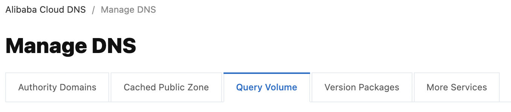{width="2.81919072615923in"
height="0.6230063429571303in"}

# Cloud Monitor 

Cloud Monitor allows to monitor hosts by placing probe points.

Application groups allow to manage resources by group across regions.

Alarm rules are used to monitor abnormal metrics and trigger an alarm.
These alarm rules can trigger the sending of alarm notifications.

The alarm template allows to set alert policies on Alibaba Cloud product
metrics.

Host monitoring monitors the processes (CPU and memory usage, number of
files opened by active processes) and GPUs. It is performed either
natively by the ECS instances or by installed agents.

Event monitoring allows to track operation and maintenance events by
service, level, name and application group. System events track the
usage of Alibaba Cloud services.

Custom monitoring allows to customize metrics and alert rules.

Alibaba Cloud Services Monitoring tracks each type of Alibaba Cloud
instance.

Site monitoring simulates real site usage from Alibaba Cloud data
centers.

A dashboard provides a centralized view of metrics for many Alibaba
Cloud products and instances.

## The application groups 

Application groups allow resources to be managed by group across
regions. Alarm rules can then be managed by group.

The limit is 100 groups per Alibaba Cloud account and 1000 resource
instances per group.

In case of maintenance intervention on resources, you can disable all
alerts related to the concerned group to avoid receiving unwanted alarm
notifications. Once the intervention is over, you can reactivate them.

To create an application group:

-   Go to the \`Cloud Monitor \`console,

-   Click on \`Application Groups\`,

-   Click on \`Create Group\`,

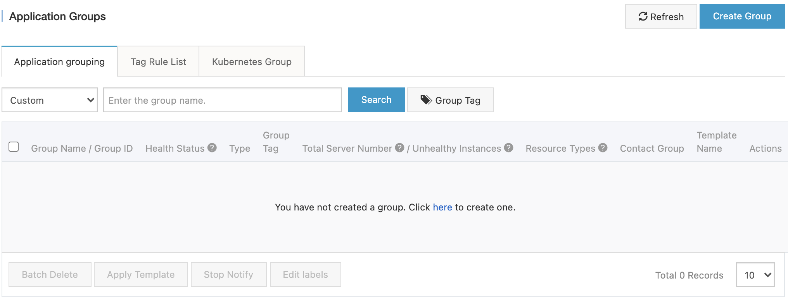{width="4.5in" height="1.7229166666666667in"}

-   \`Creation method\`: select \`Smart tag synchronization creation\`,

-   \`Product Group Name\`: this is the name of the group (it cannot be
    changed),

-   \`Contact Group\`: this\` \`is the alert group that will receive the
    alert notifications (default values are \`All \`and \`Default
    Contact Group\`),

-   \`Select Template:\` this is the alert template used to initialize
    the rules (default values are \`All \`and \`Basic Templates\`),

-   \`Region\`: this is the region,

-   \`Match Rule\`: this is a rule that looks for matches on resource
    tags,

-   \`Initialize Agent Installation\`: indicates whether Alibaba Cloud
    automatically installs the CloudMonitor agent on the instances in
    the application group,

-   Click on \`Add\`.

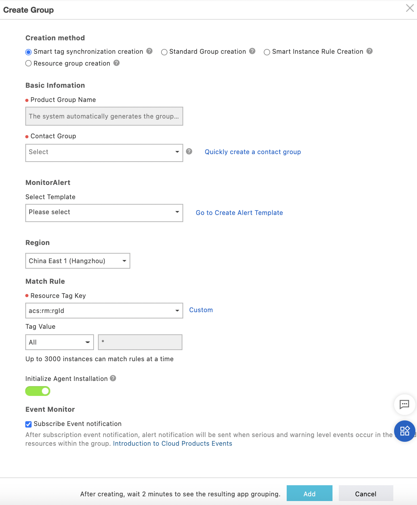{width="2.9690179352580928in"
height="3.593061023622047in"}

## The alarm templates 

The alarm template allows to define alert policies on Alibaba Cloud
product metrics. These templates can then be used directly when creating
alert policies. A change on a template does not produce a change on the
alert policies generated using this template.

If you use many Cloud resources, it is recommended to create application
groups to group them together and then create and apply alert templates
to these groups.

The maximum number of alert templates is 100 per Alibaba Cloud account
and the maximum number of metrics per alert template is 30.

To create or modify a template:

-   Go to the \`Cloud Monitor \`console,

-   Click on \`Alerts \| Alert Templates\`,

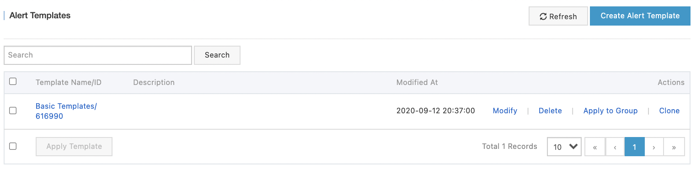{width="4.5in" height="1.09375in"}

-   Click on \`Create Alert Template\`,

-   \`Template Name\`: this\` \`is the name,

-   \`Description\`: this is the description,

-   Click on \`OK\`,

{width="3.659748468941382in"
height="3.6094827209098863in"}

You can then apply the template to the group.

-   Click on \`OK\`,

-   Click on \`OK\`.

{width="2.759121828521435in"
height="1.6627110673665793in"}

When creating an application group, you can select an alarm template to
apply. Cloud Monitor then generates the corresponding alarm rules.

If you have created an application group without an associated alert
policy, you can create an alert template and then apply it to the group.

To apply a template to a group of applications:

-   Go to the \`Cloud Monitor \`console,

-   Click on \`Alerts \| Alert Templates\`,

-   Click on \`Apply to Group \`on the line of the template,

-   \`Group\`: this is the group of applications,

-   Click on \`OK\`,

-   Click on \`OK\`.

{width="2.7135564304461943in"
height="1.635252624671916in"}

## The contacts 

Before you can receive alarm notifications, you need to manage alarm
contacts and alarm contact groups.

To create a contact for the alarm:

-   Go to the \`Cloud Monitor \`console,

-   Click on \`Alerts \| Alert Contacts\`,

{width="4.5in" height="1.167361111111111in"}

-   Click on \`Create Alert Contact\`,

-   \`Name\`: this is the name,

-   \`Email ID\`: this\` \`is the email,

-   \`Webhook or DingTalk Robot\`: this is the DingTalk account (or a
    URL of a webhook),

-   Click on \`OK\`.

{width="2.4986253280839894in"
height="2.4307622484689415in"}

To edit or delete an alarm contact:

-   Go to the \`Cloud Monitor \`console,

-   Click on \`Alerts \| Alert Contacts\`,

-   Click on \`Edit \`or \`Delete \`on the contact line.

The email is verified when it is added.

Contact groups are used to group contacts. A contact group can contain
several contacts. An alert contact can be added to several contact
groups.

To create an alert contact group:

-   Go to the \`Cloud Monitor \`console,

-   Click on \`Alerts \| Alert Contacts\`,

-   Click on the \`Alert Contact Group \`tab,

{width="4.5in" height="0.83125in"}

-   Click on \`Create Alert Contact Group\`,

-   \`Group Name\`: this is the name of the group,

-   \`Select contacts\`: these are the contacts to the group,

-   Click on \`Confirm\`.

{width="2.172334864391951in"
height="2.349676290463692in"}

To edit or delete an alert contact group:

-   Go to the \`Cloud Monitor \`console,

-   Click on \`Alerts \| Alert Contacts\`,

-   Click on \`Alert Contact Group\`,

-   Click on \`Edit \`or \`Delete \`on the line of the group.

## Alarm rules 

Alarm rules allow to monitor abnormal metrics and trigger an alarm.

Before setting up alarm rules, it is recommended to create groups to
group resources by service to facilitate the use of alerts.

Cloud Monitor provides three portals for managing alarm rules:

-   the application groups page,

-   the metric elements list page,

-   the alarm rules list page.

A callback function allows to send alarm notifications to an URL via
HTTP \`POST \`request, which allows to trigger actions in another system
for example. If the request fails to be sent, Cloud Monitor retries
three times. The timeout duration is five seconds.

Alarm rules can be defined either for a single host or for a group.

To display the alarm rules:

-   Go to the \`Cloud Monitor \`console,

-   Click on \`Alerts \| Alert Rules\`.

To create an alarm rule:

-   Go to the \`Cloud Monitor \`console,

-   Click on \`Alerts \| Alert Rules\`,

{width="4.5in"
height="1.9618055555555556in"}

-   Click on \`Create Alert Rule\`,

-   \`Product\`: this is the Alibaba Cloud product under surveillance,

-   \`Resource Range\`: this is the range of alarm rules, which can be:

```{=html}
<!-- -->
```
-   \`All Resources\`: the alarm rule applies to all instances of the
    specified product,

-   \`Instances\`: the rule applies only to a specific instance.

```{=html}
<!-- -->
```
-   \`Alert Rule\`: this is the\` \`name of the alarm rule,

-   \`Rule Description\`: defines the trigger conditions on the metric
    data,

-   \`Mute for\`: this is the time delay before the alert is cleared.

-   \`Effective Period\`: this is\` \`the period of time during which
    the rule takes effect,

-   \`Contact Notification\`: these are the contacts that receive the
    alarm notifications,

-   \`Notification Methods\`: this\` \`is the notification method (email
    and DingTalk mandatory),

-   \`Auto Scaling\`: triggers the scaling rule if the alert is
    triggered,

-   \`Log Service\`: adds the alert to the Log Service,

-   \`Email Remark: \`this is additional custom information,

-   \`HTTP Webhook\`: this is\` \`the URL called with the alert message
    in parameter; only HTTP requests are supported.

-   Click on \`Confirm\`.

+-----------------------------------------------------------------------+
| {width="4.053482064741908in"    |
| height="2.314488188976378in"}                                         |
|                                                                       |
| {width="3.8755129046369206in"                |
| height="2.7553226159230095in"}                                        |
+=======================================================================+
+-----------------------------------------------------------------------+

To edit or delete an alarm rule:

-   Go to the \`Cloud Monitor \`console,

-   Click on \`Alerts \| Alert Rules\`,

-   Click \`Delete \`or \`Modify \`on the line of the rule.

## Host monitoring 

The host monitoring service allows to monitor the servers. It is
necessary to install a Cloud Monitor agent on the servers. This
monitoring can also be used on physical machines of other providers or
on-premises.

The supported operating systems are Linux and Windows, but not Unix.

Cloud Monitor offers more than 30 metrics on CPU, memory, disk and
network.

The Cloud Monitor agent requires certain ports to be open. In addition,
since the IP address used by the agent may change, it is recommended to
allow outgoing traffic from the \`100.100 \`network segment.

### Monitor processes 

Process monitoring allows to collect information about CPU and memory
usage and the number of files opened by active processes during a given
period.

The agent filters the five most CPU-intensive processes every minute,
indicating the rate of CPU usage, memory usage and the number of files
they have opened. Since the metrics are collected only for the top five
processes, the other processes have incomplete data: the data will
appear more scattered.

The metrics on CPU and memory usage come from the Linux \`top \`command,
while the metric on the number of files opened by an active process
comes from the \`lsof \`command.

If a process uses several CPUs, the CPU utilization rate can exceed 100%
since the total utilization of CPU cores is calculated.

### Monitor GPUs 

GPU (Graphics Processing Units) monitoring allows to query GPU
monitoring data using the Cloud Monitor console or the API.

GPU-related metrics are classified into three dimensions:

-   GPU: they measure the monitoring data by GPU,

-   Instance: they measure the minimum, maximum and average value of
    several GPUs per instance,

-   Group: they measure the minimum, maximum and average value of
    several instances per group.

A GPU driver must be installed in addition to the Cloud Monitor agent.

To display the metrics graphs:

-   Go to the \`Cloud Monitor \`console,

-   Click on \`Host Monitoring\`,\`

-   Click on the instance name.

{width="4.5in"
height="1.2694444444444444in"}

\`Monitoring information is available in the \`OS Monitoring\`, \`Basic
Monitoring \`and \`Process Monitoring \`tabs.

Here is some of that information:

{width="4.5in" height="1.1583333333333334in"}

To configure metrics graphs:

-   Go to the \`Cloud Monitor \`console,

-   Click on \`Dashboard \| Custom Dashboard\`,

{width="4.5in" height="1.5833333333333333in"}

-   Click on \`Create Dashboard\`,

-   Enter the name,

-   Click on \`Create \| Add View\`,

-   Select the type of graph,

-   Select the metrics,

-   Click on \`Save\`.

### View metrics 

Host monitoring metrics include:

-   metrics collected by the agents: they are collected every 15
    seconds,

-   native metrics of the ECS instances: they are collected every
    minute.

The base metrics of the ECS instances may be inconsistent for several
reasons: the metrics collected by the agents and those native to the ECS
instances use different frequencies. In addition, some metrics may not
include the same data. For example, billing metrics do not include
network traffic between ECS instances and SLB instances, while network
traffic metrics at the operating system level do.

Metrics collected by agents include:

+-----------+-----------------------------+---------------------------+
| Type      | Metric                      | Description               |
+===========+=============================+===========================+
| CPU       | \`host.cpu.idle\`           | This is the percentage of |
|           |                             | CPUs currently idle.      |
+-----------+-----------------------------+---------------------------+
|           | \`host.cpu.iowaiit\`        | This is the percentage of |
|           |                             | the CPU that waits for    |
|           |                             | I/O operations to finish. |
+-----------+-----------------------------+---------------------------+
|           | \`host.cpu.other\`          | This is the percentage of |
|           |                             | CPU usage.                |
+-----------+-----------------------------+---------------------------+
|           | \`host.cpu.system\`         | This is the percentage of |
|           |                             | the current kernel space  |
|           |                             | used as CPU.              |
+-----------+-----------------------------+---------------------------+
|           | \`host.cpu.totalused        | This is the percentage of |
|           |                             | total CPU currently       |
|           | \`                          | consumed.                 |
+-----------+-----------------------------+---------------------------+
|           | \`host.cpu.user\`           | This is the CPU           |
|           |                             | consumption of user       |
|           |                             | processes.                |
+-----------+-----------------------------+---------------------------+
| Memory    | \`host.mem.actualused       | This is the memory        |
|           |                             | actually used by the      |
|           | \`                          | user.                     |
+-----------+-----------------------------+---------------------------+
|           | \`host.mem.free             | This is the amount of     |
|           |                             | memory left.              |
|           | > \`                        |                           |
+-----------+-----------------------------+---------------------------+
|           | \`host.mem.freeutilization  | This is the percentage of |
|           |                             | memory left.              |
|           | > \`                        |                           |
+-----------+-----------------------------+---------------------------+
|           | \`host.mem.total            | It is the total memory.   |
|           |                             |                           |
|           | > \`                        |                           |
+-----------+-----------------------------+---------------------------+
|           | \`host.mem.used             | This is the amount of     |
|           |                             | memory used.              |
|           | > \`                        |                           |
+-----------+-----------------------------+---------------------------+
|           | \                           | This is an indicator of   |
|           | `host.mem.usedutilization\` | memory usage.             |
+-----------+-----------------------------+---------------------------+
| Average   | \`host.load1                | This is the average       |
| system    |                             | system load in the last   |
| load      | > \`                        | minute.                   |
| (Linux    |                             |                           |
| only)     |                             |                           |
+-----------+-----------------------------+---------------------------+
|           | \`host.load5                | This is the average       |
|           |                             | system load over the last |
|           | > \`                        | 5 minutes.                |
+-----------+-----------------------------+---------------------------+
|           | \`host.load15\`             | This is the average       |
|           |                             | system load over the last |
|           |                             | 15 minutes.               |
+-----------+-----------------------------+---------------------------+
| Disk      | \`host.disk.readbytes       | This is the number of     |
|           |                             | bytes read per second by  |
|           | > \`                        | the disk.                 |
+-----------+-----------------------------+---------------------------+
|           | \`host.disk.readiops        | This is the number of     |
|           |                             | read requests per second  |
|           | > \`                        | on the disk.              |
+-----------+-----------------------------+---------------------------+
|           | \`host.disk.utilization     | This is the disk usage    |
|           |                             | rate.                     |
|           | > \`                        |                           |
+-----------+-----------------------------+---------------------------+
|           | \`host.disk.writebytes      | This is the number of     |
|           |                             | bytes written per second  |
|           | > \`                        | to the disk.              |
+-----------+-----------------------------+---------------------------+
|           | \`host.disk.writeiops       | This is the number of     |
|           |                             | write requests per second |
|           | > \`                        | to the disk.              |
+-----------+-----------------------------+---------------------------+
|           | \`host.diskusage.free       | This is the remaining     |
|           |                             | storage space on the      |
|           | > \`                        | disk.                     |
+-----------+-----------------------------+---------------------------+
|           | \`host.diskussage.total     | This is the total storage |
|           |                             | space on the disk.        |
|           | > \`                        |                           |
+-----------+-----------------------------+---------------------------+
|           | \`host.diskusage.used\`     | This is the storage space |
|           |                             | used on the disk.         |
+-----------+-----------------------------+---------------------------+
| File      | \`host.fs.inode\`           | This is an indicator of   |
| system    |                             | the use of the inode, the |
|           |                             | Unix system.              |
+-----------+-----------------------------+---------------------------+
| Network   | \`host.netin.errorpackage   | This is the number of     |
|           |                             | outgoing error packets    |
|           | > \`                        | detected by the disk.     |
+-----------+-----------------------------+---------------------------+
|           | \`host.netin.packages       | This is the number of     |
|           |                             | packets received by the   |
|           | > \`                        | network adapter per       |
|           |                             | second.                   |
+-----------+-----------------------------+---------------------------+
|           | \`host.netin.rate           | This is the uplink        |
|           |                             | bandwidth of the network  |
|           | > \`                        | adapter.                  |
+-----------+-----------------------------+---------------------------+
|           | \`host.netout.errorpackages | This is the number of     |
|           |                             | outgoing error packets    |
|           | > \`                        | detected by the disk.     |
+-----------+-----------------------------+---------------------------+
|           | \`host.netout.packages      | This is the number of     |
|           |                             | incoming error packets    |
|           | > \`                        | detected by the reader.   |
+-----------+-----------------------------+---------------------------+
|           | \`host.netout.rate          | This is the downlink      |
|           |                             | bandwidth of the network  |
|           | > \`                        | adapter.                  |
+-----------+-----------------------------+---------------------------+
|           | \`host.tcpconnection\`      | This is the number of TCP |
|           |                             | connections in various    |
|           |                             | states.                   |
+-----------+-----------------------------+---------------------------+
| on        | \`host.process.cpu          | This is an indicator of   |
| processes |                             | the CPU usage of a        |
|           | > \`                        | process.                  |
+-----------+-----------------------------+---------------------------+
|           | \`host.process.memory       | This is an indicator of   |
|           |                             | the memory usage of a     |
|           | \`                          | process.                  |
+-----------+-----------------------------+---------------------------+
|           | \`host.process.number       | This is the number of     |
|           |                             | processes that match the  |
|           | \`                          | specified keyword.        |
+-----------+-----------------------------+---------------------------+
|           | \`host.process.openfile\`   | This is the number of     |
|           |                             | files opened by a         |
|           |                             | process.                  |
+-----------+-----------------------------+---------------------------+

The following ECS instance metrics are provided without the need to
install the Cloud Monitor agent:

-   \`ECS.CPUUtilization\`: this is\` \`an indicator of the CPU usage,

-   \`ECS.InternetIn\`: this is the incoming Internet traffic,

-   \`ECS.InternetInRate\`: this is the average rate of the incoming
    Internet traffic,

-   \`ECS.InternetOut\`: this is the outgoing Internet traffic,

-   \`ECS.InternetOutRate\`: this is\` \`the average rate of the
    outgoing Internet traffic,

-   \`ECS.IntranetIn\`: this is the internal incoming traffic,

-   \`ECS.IntranetInRate\`: this is\` \`the average rate of the incoming
    internal traffic,

-   \`ECS.IntranetOut\`: this\` \`is the internal outgoing traffic,

-   \`ECS.IntranetOutRate\`: this is the average rate of the internal
    outgoing traffic,

-   \`ECS.SystemDiskReadbps:\` this is the number of bytes read from the
    system disk per second,

-   \`ECS.SystemDiskReadOps\`: this is the number of times data is read
    from the system disk per second,

-   \`ECS.SystemDiskWritebps\`: this is\` \`the number of bytes written
    to the system disk per second,

-   \`ECS.SystemDiskWriteOps\`: this is the number of times data is
    written to the system disk per second.

## Event monitoring 

Event monitoring provides event statistics by service, level, name and
application group for service failures, operations and maintenance (O&M)
events and business exceptions.

System events are used to track the usage of Alibaba Cloud services. It
is possible to set up event alerts.

To display the event monitoring:

-   Go to the \`Cloud Monitor \`console,

-   Click on \`Event Monitoring\`,

You can filter the list of events by service, event type, event and time
interval.

-   Click on \`View the Detail \`on the event line.

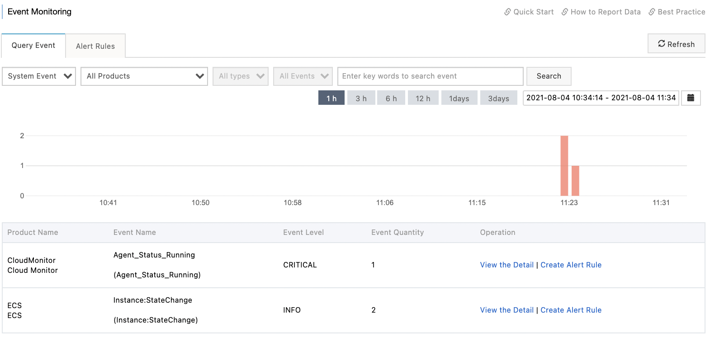{width="4.5in" height="2.1381944444444443in"}

To create an event alert rule:

-   Go to the \`Cloud Monitor \`console,

-   Click on \`Event Monitoring\`,

-   Click on the \`Alert Rules \`tab,

-   Click on the \`System Event \`tab,

{width="4.5in"
height="1.8270833333333334in"}

-   Click on \`Create Event Alert\`,

-   \`Alert Rule Name\`: this is\` \`the name of the alert rule,

-   \`Event Type\`: this is\` \`the type of event, which corresponds to
    the previously selected tab (\`System Event \`or \`Custom Event\`),

-   \`Product Type\`: this is the Alibaba Cloud server that the alert is
    about,

-   \`Event Type\`: this is the type of event that triggers the alerts,

-   \`Event Level\`: this is the level of the event that triggers the
    alerts,

-   \`Event Name\`: this is the name of the event that triggers the
    alerts,

-   \`Resource Range:\` these are the resources to which the alert is
    applied,

```{=html}
<!-- -->
```
-   \`All Resources:\` sends a notification when the event occurs on a
    resource,

-   \`Application Groups\`: sends a notification when the event occurs
    on a resource of the application group,

```{=html}
<!-- -->
```
-   \`Contact Group\`: this is the alert group that receives the
    notifications,

-   \`Notification Method\`: this is the level and method of alert
    (\`Info (Email ID+DingTalk Robot)\`),

-   \`MNS queue\`: this\` \`is the \`MNS \`(Message Service) queue to
    which the alert is sent,

-   \`Function service\`: this\` \`is the Function Compute function to
    which the alert is sent,

-   \`URL callback\`: this is the URL callback and the request method
    (\`GET \`or \`POST\`),

The URL must be accessible from the Internet. Only the \`HTTP \`protocol
is supported.

-   \`Log Service\`: this is the Logstore of \`Log\` \`Service \`to
    which the alert is sent,

-   Click on \`OK\`.

+-----------------------------------------------------------------------+
| 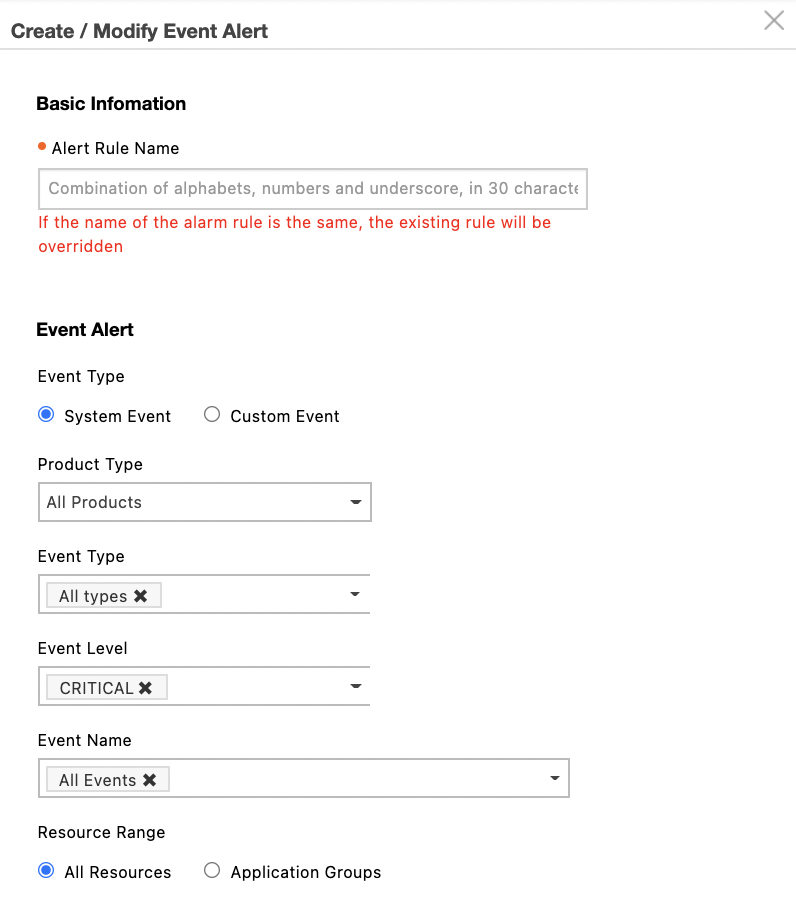{width="2.3843372703412076in"                |
| height="2.7316852580927384in"}                                        |
|                                                                       |
| {width="2.383908573928259in"    |
| height="2.4916994750656167in"}                                        |
+=======================================================================+
+-----------------------------------------------------------------------+

To test an event alert rule on an Alibaba Cloud service:

-   Go to the \`Cloud Monitor \`console,

-   Click on \`Event Monitoring\`,

-   Click on the \`Alert Rules \`tab,

-   Click on the \`System Event \`tab,

-   Click on \`test \`on the line of the rule,

-   Select the event to test,

-   Modify the content of the event,

-   Click on \`OK\`.

An event with the specified content is then generated. The alert can be
received by email or by DingTalk.

If a callback fails, three new attempts are made, each expiring after 5
seconds.

To call a callback:

-   Go to the \`Cloud Monitor \`console,

-   Click on \`Event Monitoring\`,

-   Click on the \`Alert Rules \`tab,

-   Click \`Modify \`on the line of the rule,

-   Check \`URL callback\`,

-   \`Request Method\`: select \`POST\`,

-   \`Callback URL\`: this is the callback URL,

-   Click on \`OK\`.

{width="1.7150984251968504in"
height="0.9792290026246719in"}

## Customized monitoring 

In this section, we will study:

-   customized monitoring that allows to customize metrics and alert
    rules on time series data,

-   monitoring of custom events,

-   monitoring of cloud services.

### Custom monitoring 

Custom monitoring allows to customize metrics and alert rules on
periodically collected time series data.

To pass business metrics to Cloud Monitor, you can call the API\'s
\`PutCustomMetric \`operation. The \`AliyunCloudMonitorFullAccess
\`policy must be attached to the RAM user used to use the API.

It is also possible to create alerts and graphics.

To view the data:

-   Go to the \`Cloud Monitor \`console,

-   Click on \`Custom Monitoring\`,

-   Click on the \`Time Series \`tab,

-   Select the application group and time series from the drop-down
    lists,

-   Click on \`Dimensions\`,

-   Select the dimension to be used,

-   Click on \`OK\`.

{width="3.0400284339457566in"
height="0.6103510498687664in"}

It is also possible to view this data from the \`Application Groups
\`page.

To set up an alert:

-   Go to the \`Cloud Monitor \`console,

-   Click on \`Custom Monitoring\`,

-   Click on the \`Alert Rules \`tab,

-   Click on \`Create Alert Rule\`,

{width="3.6209109798775154in"
height="0.9393132108486439in"}

-   Configure the alert rule,

-   Click on \`Confirm\`.

+-----------------------------------------------------------------------+
| {width="2.666327646544182in"                 |
| height="3.2390944881889765in"}                                        |
|                                                                       |
| 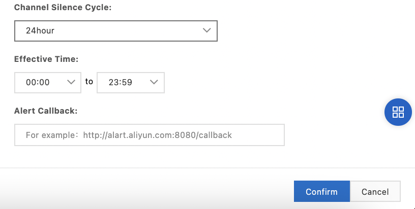{width="2.6995942694663166in"                |
| height="1.363127734033246in"}                                         |
+=======================================================================+
+-----------------------------------------------------------------------+

It is also possible to set up an alert from the \`Application Groups
\`page.

To send monitoring data with the \`aliyun \`CLI:

\`aliyun cms PutCustomMetric \--MetricList.1.MetricName cpu_total
\--MetricList.1.Dimensions \'{\"myDim\":\"my_value\"}\'
\--MetricList.1.Time 1555382881320 \--MetricList.1.Type 0
\--MetricList.1.Period 60 \--MetricList.1.Values \'{\"value\":5}\'
\--MetricList.1.GroupId \"0\"

\`Cloud Monitor should return the status code 200 and the message:

\`{

\"Message\": \"success\",

\"RequestId\": \"C24E2C16-B037-3BF0-1332-2579AB5E26C3\",

\"Code\": \"200\"

}

### \`Monitor custom events 

The data used by custom event monitoring is not necessarily continuous.

To view custom event monitoring data and receive alert notifications:

-   Go to the \`Cloud Monitor \`console,

-   Click on \`Event Monitoring\`,

-   Click on the \`Query Event \`tab,

-   In the first drop-down list, select \`Custom Event\`,

-   Fill in the parameters of the custom event in the other drop-down
    lists.

{width="4.063861548556431in"
height="2.1749179790026245in"}

To create an alert rule:

-   Go to the \`Cloud Monitor \`console,

-   Click on \`Event Monitoring\`,

-   Click on the \`Alert Rules \`tab,

-   Click on the \`Custom Event \`tab,

-   Click on \`Create Event Alert\`,

{width="4.5in" height="1.83125in"}

-   Click on\` Advanced Configuration,

-   Alert Rule Name\`: this is\` \`the name of the alert rule,

-   \`Event Type\`: this is\` \`the type of event, corresponding to the
    tab you clicked on previously (the possible values are \`System
    Event \`and \`Custom Event\`),

-   \`Application Groups\`: sends an alert notification only when the
    custom event occurs on an application group resource,

-   \`Event Name\`: this is\` \`the name of the custom event,

-   \`Rule Description: \`this is the description of the alert rule,

-   \`Notification Method\`: this\` \`is the notification method
    (\`Email + DingTalk\`),

-   \`Effective From\`: this is the time period during which the alert
    rule is active (from \`00:00 \`to \`23:59\`),

-   \`Alert Callback\`: this is the callback URL and the request method
    (\`GET \`or \`POST\`); the URL must be accessible from the Internet;
    only the \`HTTP \`protocol is supported,

-   Click on \`OK\`.

{width="2.2238604549431322in"
height="3.2235673665791778in"}

Event monitoring allows to report custom events.

This can be done using the \`PutCustomEvent \`operation of the API. The
\`AliyunCloudMonitorFullAccess \`policy must be attached to the RAM user
used to use the API.

To send a custom event the CLI \`aliyun:\`

\`aliyun cms PutCustomEvent \--EventInfo.1.EventName ErrorEvent
\--EventInfo.1.Content helloworld \--EventInfo.1.Time
\"20171013T170923.456+0800\" \--EventInfo.1.GroupId 0

\`CloudMonitor returns a message of the following type with a status
code 200:

\`{

\"Message\": \"success\",

\"RequestId\": \"C24E2C16-B037-3BF0-1332-2579AB5E26C3\",

\"Code\": \"200\"

}

### \`Monitor cloud services 

Cloud Monitor provides specific metrics for each Alibaba Cloud instance
type. Rules are created by default.

To display the monitoring data:

-   Go to the \`Cloud Monitor \`console,

-   Click on \`Cloud products\`,

-   Select an Alibaba Cloud service,

At this point, you are redirected to the \`Host Monitoring \`section.

{width="3.164928915135608in"
height="2.481147200349956in"}

-   Click on \`Monitoring Charts \`on the service line.

{width="4.5in"
height="1.4097222222222223in"}

To set up alert rules:

-   Go to the \`Cloud Monitor \`console,

-   Click on \`Cloud products\`,

-   Select an Alibaba Cloud service,

At this point, you are redirected to the \`Host Monitoring \`section.

-   Click on \`Alert Rules \`on theline of the service,

-   Click on \`Create Alert Rule\`,

-   Configure the alert rule,

-   Click on \`Confirm\`.

Cloud Monitor provides metrics on CDN such as:

-   number of visits per second,

-   network bandwidth BPS

-   cache hit rate,

-   percentage of return codes \`4xx\`,

-   percentage of return codes \`5xx\`.

Here are some examples of metrics provided based on the service:

-   \`ApsaraDB for Memcache\`: the cache used and the read success rate,

-   \`CDN\`: Global Acceleration\'s inbound and outbound network
    bandwidth,

-   \`Elasticsearch\`: the state of the Elasticsearch cluster, the
    cluster\'s query QPS and the cluster\'s write QPS,

-   \`Express Connect\`: incoming and outgoing network traffic,

-   \`NAT Gateway\`: SNAT connections,

-   \`VPN Gateway\`: the network bandwidth in and out of the VPN
    gateway.

## Site monitoring 

Site monitoring sends detection queries that simulate real user usage
from Alibaba Cloud data centers to a site to be monitored.

The main interests are the implementation of probes and performance
analysis.

To create a task:

-   Go to the \`Cloud Monitor \`console,

-   Click on \`New Site Monitor \| Site Manage\`,

-   Click on \`New Monitoring Task\`,

{width="2.648413167104112in"
height="0.8525601487314086in"}

-   \`Monitor Type\`: this is the monitoring protocol (supported values
    are \`HTTP(s)\`, \`PING\`, \`TCP\`, \`UDP\`, \`DNS\`, \`SMTP\`,
    \`POP3 \`and \`FTP\`),

-   \`IP Probe Type\`: this is\` \`the type of IP address (the supported
    values are \`IPv4 \`and \`IPv6\`),

-   \`Task Name\`: this\` \`is the name of the site monitoring task,

-   \`Monitor Address\`: this is\` \`the address of the site to be
    monitored,

To access the advanced settings, click on \`Advanced Settings\`. This
part is not covered here.

-   \`Monitoring frequency\`: this is the interval at which requests are
    sent (supported values are 1, 5, 15, 30 and 60 minutes),

-   \`ECS Probe points\`: allows to customize the probe points by
    specifying the supplier and the region,

To customize the probe points, click \`Custom Probe Point\`. This part
is not covered here.

-   \`Availability\`: this\` \`is the availability of the probe points;
    the possible values are:

```{=html}
<!-- -->
```
-   \`Available probe point ratio\`: this is\` \`the ratio of available
    probe points,

-   \`Number of probe points available\`: this is the number of probe
    points available,

-   \`Any Status Code\`,

-   \`All Status Code\`,

```{=html}
<!-- -->
```
-   \`Average response time\`: this is\` \`the average response time of
    all detection points during a monitoring period,

-   \`Triggered when threshold is exceeded for\`: this is the number of
    consecutive times the threshold is exceeded before an alert is
    triggered,

-   \`Contact Group: \`this is the contact to which to send
    notifications,

-   \`Notification Methods:\` these are the methods used to send
    notifications,

-   Click on \`Advanced Settings\`,

-   \`Channel Silence Time\`: this is\` \`the interval at which the
    notification is sent back before the alert is cleared,

-   \`Effective Time\`: this is the period during which the alert rule
    is active,

Alerts are only generated outside these periods.

-   \`Alert Callback\`: this is the callback URL,

It must be accessible on the Internet. A POST method is used and only
the HTTP protocol is supported.

-   Click on \`Create\`.

+-----------------------------------------------------------------------+
| {width="3.2795570866141732in"   |
| height="2.6990551181102362in"}                                        |
|                                                                       |
| 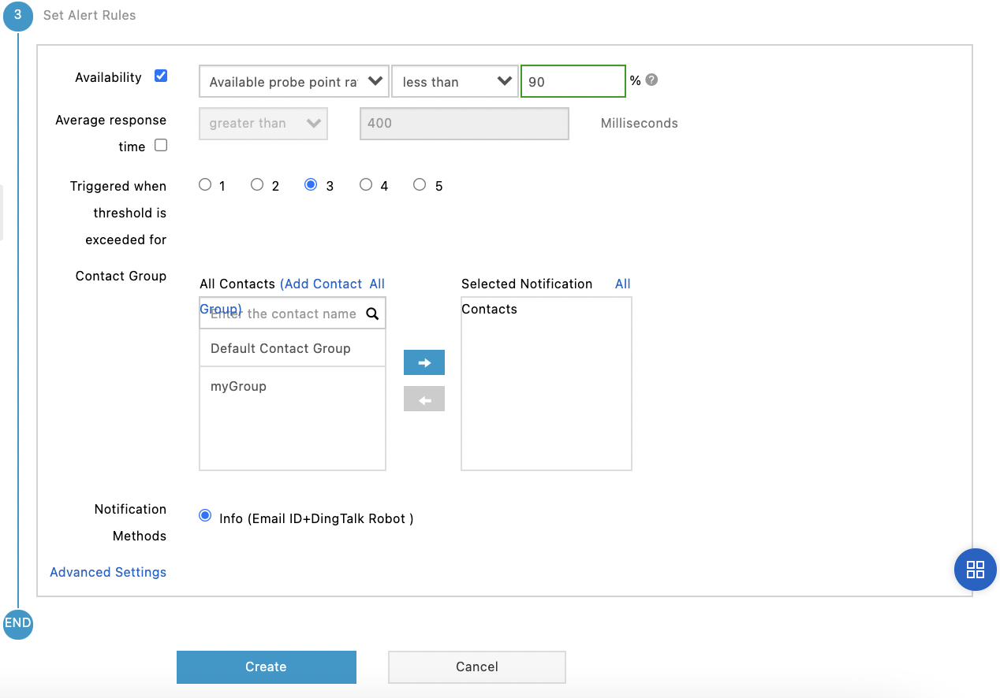{width="3.338582677165354in"                 |
| height="2.332886045494313in"}                                         |
+=======================================================================+
+-----------------------------------------------------------------------+

It is possible to specify several site addresses to be monitored
(\`Monitor Address\`). In this case, you must specify one per line.
Cloud Monitor will then generate one monitoring task per site address.

To edit or delete a task:

-   Go to the \`Cloud Monitor \`console,

-   Click on \`New Site Monitor \| Site Manage\`,

-   Click on \`Modify \`or \`Delete \`on the line of the site.

To activate or deactivate a task:

-   Go to the \`Cloud Monitor \`console,

-   Click on \`New Site Monitor \| Site Manage\`,

-   Click on \`Enable \`or \`Disable \`on the line of the site.

## The dashboard 

The dashboard provides a centralized view of metrics for multiple
Alibaba Cloud products and instances.

Cloud Monitor displays monitoring metrics for ECS instances by default.
The refresh is done automatically over one hour, three hours or six
hours. Beyond that, it is not automatic.

To view the network bandwidth dashboard for the last 30 days:

-   Go to the \`Cloud Monitor \`console,

-   Click on \`Dashboard \| Flow chart\`,

-   Select a duration (1 hour, 3 hours, \...),

-   Select the public IP address of the ECS instance.

{width="4.5in" height="2.7354166666666666in"}

To view the Alibaba Cloud services monitoring dashboard:

-   Go to the \`Cloud Monitor \`console,

-   Click on \`Dashboard \| Cloud product charts\`,

-   Select the service, {width="0.3225973315835521in"
    height="0.15202865266841645in"}

-   Select the resource and the duration (1 hour, 3 hours, \...).

{width="4.5in" height="1.9777777777777779in"}

To view a custom dashboard:

-   Go to the \`Cloud Monitor \`console,

-   Click on \`Dashboard \| Custom Dashboard\`,

-   Select a dashboard from the list,

-   Select a duration (1 hour, 3 hours, \...).

{width="4.5in" height="1.375in"}

To display the dashboard in full screen, click on \`Full Screen\`.

To refresh the dashboard in real time, click on \`Refresh\`.

You can create a new monitoring dashboard and customize the graphs
displayed. You can create up to 20 charts per monitoring tray.

To create a dashboard:

-   Go to the \`Cloud Monitor \`console,

-   Click on \`Dashboard \| Custom Dashboard\`,

-   Click on \`Create Dashboard\`,

-   Enter the name,

-   Click on \`Create\`.

{width="3.009550524934383in"
height="0.8081200787401575in"}

To add a graph to a dashboard:

-   Go to the \`Cloud Monitor \`console,

-   Click on \`Dashboard \| Custom Dashboard\`,

-   Select a dashboard from the list,

-   Click on \`Add View\`,

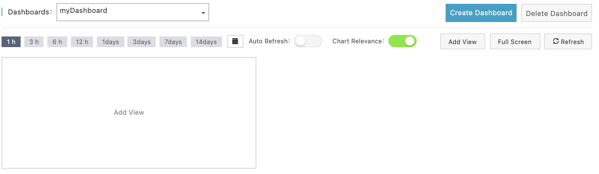{width="4.5in" height="1.3125in"}

-   \`Graph type:\`

```{=html}
<!-- -->
```
-   \`Line: \`displays the data as a time series,

-   \`Area\`: displays metric data by time sequence,

-   \`Table\`: displays in real time data sorted from the largest to the
    smallest,

-   \`Heat Map\`: displays the distribution and comparison of a metric
    of several instances in real time,

-   \`Pie Chart\`: displays real-time metrics in a convenient way to
    compare data,

```{=html}
<!-- -->
```
-   Select the metrics,

-   Click on \`Save\`.

{width="3.362736220472441in"
height="2.9657469378827646in"}

To edit or delete a dashboard:

-   Go to the \`Cloud Monitor \`console,

-   Click on \`Dashboard \| Custom Dashboard\`,

-   Select the dashboard from the list,

-   To edit the dashboard, move the mouse over the name of the dashboard
    and click on \`Edit\`,

{width="1.764730971128609in"
height="0.21199584426946633in"}

-   To delete the dashboard, click \`Delete Dashboard\`.

{width="1.1151498250218723in"
height="0.1903915135608049in"}

When you delete a dashboard, all associated charts are deleted.

# Anti-DDoS 

Anti-DDoS Basic provides protection for public IP addresses of ECS, SLB,
WAF and EIP against attacks up to 5 Gbps. This service is automatically
activated.

Notifications are sent in case of DDoS attacks.

There are several offers:

-   Anti-DDoS Origin Enterprise,

-   Anti-DDoS Pro,

-   Anti-DDoS Premium.

Anti-DDoS Origin Enterprise provides protection for ECS, SLB, WAF and
EIP instances.

The protection bandwidth and IP addresses of an Anti-DDoS Origin
Enterprise instance can be changed.

The Traffic Security Manager allows to manage the different aspects of
traffic security.

Anti-DDoS Origin on-demand allows to manually activate the rerouting of
traffic to the Anti-DDoS Origin instance in case of a DDoS attack and
then deactivate it once the attack is over. The automatic mode (NetFlow)
performs the rerouting automatically if the threshold is exceeded.

If the throughput exceeds the normal throughput, Anti-DDoS Origin scrubs
the traffic from the attack. This scrubbing threshold can be configured.
This scrubbing can also be cancelled.

The blackhole consists in blocking Internet access to a server if the
volume of DDoS attacks is too high. It is still possible to connect
indirectly to an ECS instance blocked by the backhole.

You can view the global traffic of an instance, the traffic of each IP
address, the list of event logs of DDoS attacks or the logs of
configuration changes of an instance.

## The different solutions offered 

Anti-DDoS Basic provides protection for public IP addresses of ECS, SLB,
WAF and EIP against attacks up to 5 Gbps. This service is automatically
activated:

-   Go to the \`Traffic Security\` \`(Anti-DDoS Basic) \`console,

-   Click on \`Network Security \| Anti-DDoS Origin \| Manage
    Instances\`.

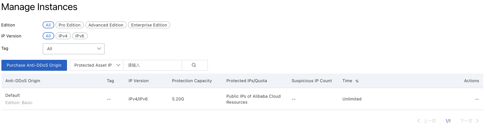{width="4.5in" height="1.1729166666666666in"}

The Basic editing instance is displayed.

For a higher level of security, you can subscribe to other services:

-   Anti-DDoS Origin Enterprise,

-   Anti-DDoS Pro,

-   Anti-DDoS Premium.

Anti-DDoS Origin Enterprise is suitable if the system is frequently
attacked and for latency sensitive services.

Anti-DDoS Pro and Anti-DDoS Premium are suitable if the attacks are
important and if the services are ecommerce or financial sites.

Anti-DDoS Pro is suitable for services deployed in mainland China while
Anti-DDoS Premium is suitable for services deployed outside mainland
China.

GameShield protects against DDoS and HTTP Flood attacks. It is suitable
for the gaming industry and services with even higher levels of attacks.

## The Traffic Security Manager 

The Traffic Security Manager allows to manage the different aspects of
traffic security.

To view the protection status and attacks of your resources,

-   Go to the \`Traffic Security\` \`(Anti-DDoS Basic)\`,\` \`console

-   Click on \`Overview\`.

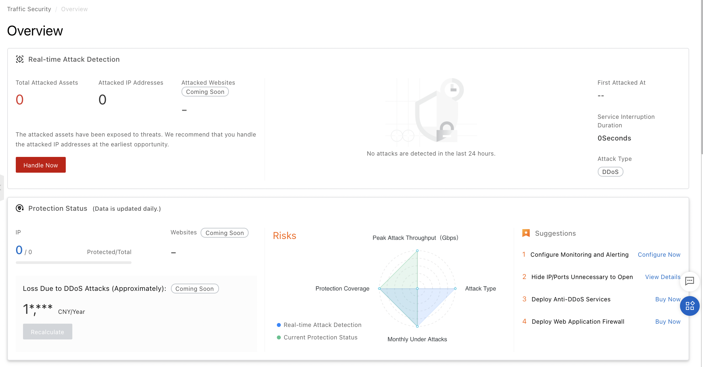{width="4.5in" height="2.3534722222222224in"}

Traffic Security Manager allows to view the architecture and status of
asset protection:

-   Go to the \`Traffic Security\` \`(Anti-DDoS Basic) \`console,

-   Click on \`Traffic Security Manager\`.

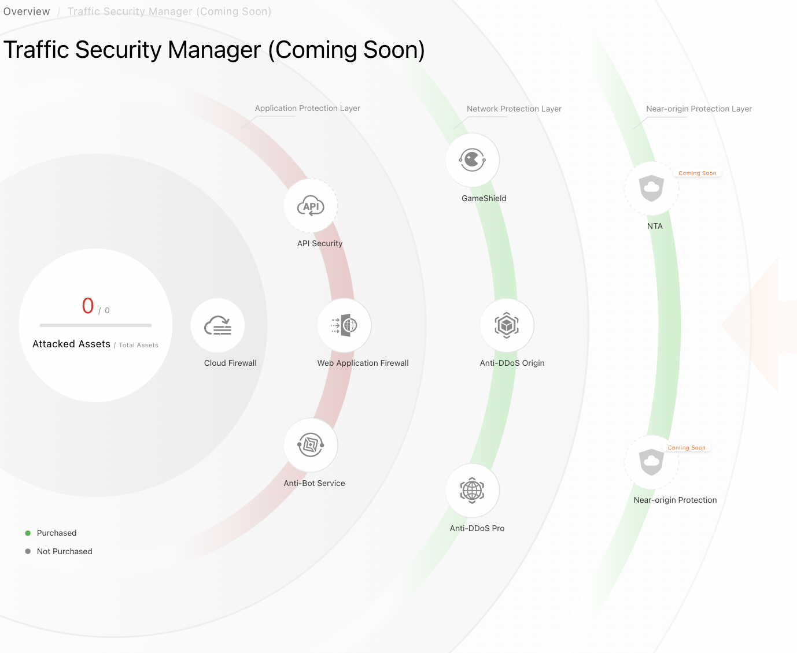{width="3.1136504811898513in"
height="2.5533858267716534in"}

Protection against DDoS attacks for ECS, SLB and EIP instances is free
of charge. To view the protection status of these instances:

-   Go to the \`Traffic Security\` \`(Anti-DDoS Basic) \`console,

-   Select a region,

-   Click on \`Assets\`.

{width="3.1169761592300964in"
height="1.983705161854768in"}

This page displays links to provide additional useful information:

-   To view the default blackhole thresholds for assets, click on the
    \`Default Basic Protection Threshold \`link,

-   To view the Blackhole filtering policy, click on the \`Blackholing
    \`link.

To protect a service, click on the corresponding tab (\`ECS\`, \`SLB\`,
\`EIP (including NAT) \`or \`Others\`).

Information about the protection is displayed on the line of each asset:

-   \`Status\`: this is the state of the instance; the supported values
    are \`Normal\`, \`Cleaning \`and \`Black Hole Activated\`,

-   \`Protection Capacity\`: this is\` \`the ability of an instance to
    reduce DDoS attacks,

-   \`Cleaning Trigger Value\`: this is\` \`the minimum bandwidth beyond
    which the scrubbing of the traffic begins:

```{=html}
<!-- -->
```
-   BPS (Packet Per Second): when incoming traffic exceeds this value,
    traffic scrubbing is triggered,

-   PPS (Packet Per Second): when the transfer rate of incoming packets
    exceeds this value, traffic scrubbing is triggered.

The capacity indicates the maximum bandwidth of DDoS attacks that the
instance can mitigate. If DDoS attacks consume more than the Protection
\`Capacity\`, Blackhole filtering is enabled.

Anti-DDoS Origin Enterprise provides protection against DDoS attacks for
all assets and services in the account. It allows to enable Anti-DDoS
Origin on a specific instance, for example ECS:

-   Select the ECS instance,

-   Click on \`Add Anti-DDoS Origin\`,

-   Click on \`Add \`on the line of the instance,

-   Click on \`OK\`.

To use Anti-DDoS Pro or Anti-DDoS Premium:

-   Click on \`Anti-DDoS Services\`,

-   Click on \`Anti-DDoS Pro \`or \`Anti-DDoS Premium\`.

## Anti-DDoS Origin on demand 

In this section, we will study:

-   Rerouting traffic to an on-demand instance in case of a DDoS attack,

-   Automatic mode (NetFlow) that allows to automatically reroute
    traffic to the Anti-DDoS Origin instance if a threshold is exceeded
    consecutively for the specified number of times.

### Enable traffic rerouting to an on-demand instance 

An on-demand Anti-DDoS Origin instance allows, in case of a DDoS attack,
to manually activate the rerouting of traffic to the Anti-DDoS Origin
instance and then to deactivate it once the attack is over:

-   Go to the \`Traffic Security\` \`(Anti-DDoS Basic) \`console,

-   Select a region,

-   Click on the \`Others \`tab: the list of IP addresses of the
    Anti-DDoS Origin on Demand instances purchased in the region is
    displayed,

-   Click on \`Start Redirection \`on the line of the instance,

-   Click on \`OK\`.

The \`Others \`tab provides the list of IP addresses of the Anti-DDoS
Origin instances purchased in the region is displayed. The tab is not
displayed if there are no instances.

The instance changes to the \`Redirecting \`state.

To stop the rerouting, click on \`Pause Redirection \`on the line of the
instance.

### Enable NetFlow automatic mode 

The automatic mode (NetFlow) allows to automatically reroute traffic to
the Anti-DDoS Origin instance if a threshold is exceeded consecutively
for the specified number of times.

To activate the automatic mode:

-   Go to the \`Traffic Security\` \`(Anti-DDoS Basic) \`console,

-   Select a region,

-   Click on the \`Others \`tab,

-   Click on \`Configure Start Mode \`on the line of the instance,

-   \`Start Mode\`: this is the mode used for traffic rerouting; valid
    values are:

```{=html}
<!-- -->
```
-   \`Manual\`: rerouting must be activated manually,

-   \`Automatic (NetFlow)\`: the rerouting must be activated
    automatically in case of an attack,

```{=html}
<!-- -->
```
-   \`Traffic Rate\`: this is the threshold of the incoming bandwidth
    (minimum 100 Mbit/s),

-   \`Packet Rate (pps)\`: this is\` \`the threshold for incoming
    packets (minimum 10 Kpps),

-   \`Threshold\`: this is the number of times an overrun is detected
    that triggers a reroute,

-   \`Stop Mode\`: this is\` \`the mode used to stop traffic forwarding;
    supported values are:

```{=html}
<!-- -->
```
-   \`Manual\`: rerouting must be manually disabled after the attack is
    over,

-   \`Automatic\`: the rerouting should be disabled automatically once
    the attack is over; the time zone of the server should be specified
    and the time at which the rerouting is stopped,

```{=html}
<!-- -->
```
-   Click on \`OK\`.

It is recommended to choose an off-peak period for the stop of the
rerouting.

## Cleaning configuration 

In this section, we will study:

-   Configuration of a traffic scrubbing threshold to guarantee the
    availability of an asset in case of an attack,

-   the preparation of a Stress Test on an ECS instance.

### Configure a traffic clearing threshold 

To ensure asset availability, if an asset\'s throughput exceeds the
normal throughput, Anti-DDoS Origin will scrub the traffic from the
attack. You can configure a traffic scrubbing threshold based on the
normal throughput. Anti-DDoS Origin then uses Artificial Intelligence to
identify DDoS attacks.

To configure the scrubbing threshold:

-   Go to the \`Traffic Security\` \`(Anti-DDoS Basic) \`console,

-   Click on \`Assets\`,

-   Select the asset region,

-   Click on the tab corresponding to the type of instance (\`ECS\`,
    \`SLB\`, \`EIP (including NAT) \`or \`Others\`,

-   Click on the IP address of the instance,

-   Click on \`Cleaning Settings\`,

-   \`Cleaning threshold\`: this is the threshold; valid values are:

```{=html}
<!-- -->
```
-   \`Default\`: Anti-DDoS Origin adjusts the threshold according to the
    instance rate,

-   \`Manual setting\`: this is the threshold,

```{=html}
<!-- -->
```
-   Click on \`OK\`.

{width="1.9095363079615049in"
height="0.8251082677165354in"}

If normal traffic is affected, it is recommended to increase the
threshold.

During exceptional promotional activities, it is recommended to increase
the threshold.

The maximum supported cleanup threshold of an Alibaba Cloud service
depends on the instance specifications.

The Blackhole threshold is calculated based on the maximum cleaning
threshold and the security credibility score.

### Cancel traffic cleaning 

To cancel the traffic cleaning:

-   Go to the \`Traffic Security\` \`(Anti-DDoS Basic) \`console,

-   Select the region,

-   Click on the tab corresponding to the type of instance (\`ECS\`,
    \`SLB\`, \`EIP (including NAT) \`or \`Others\`,

-   Click on the IP address of the instance,

The status of the instance must be \`Cleaning\`.

-   Search for a \`Traffic Scrubbing \`event with an empty \`End Time
    \`value,

-   Click on \`Cancel cleaning \`on the line.

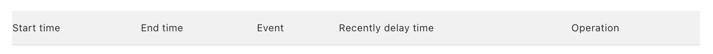{width="2.989367891513561in"
height="0.231583552055993in"}

It is possible to cancel the cleaning up to three times a day.

### Perform a stress test on an ECS instance 

Anti-DDoS Origin Basic automatically blocks traffic to an ECS instance
in any of the following cases:

-   the network bandwidth exceeds 180 Mbit/s,

-   the number of packets exceeds 30,000 per second,

-   the number of HTTP requests exceeds 480 per second.

Before performing a Stress Test, it is important to change the
protection threshold of the ECS instance. During the test, it is
recommended not to increase the request volume more than 100 times per
minute.

## The bodies 

In this section, we will study:

-   Protecting a cloud service with Origin Enterprise Anti-DDoS,

-   View security reports on traffic and event logs of DDoS attacks,

-   Display of logs of operations on configuration changes of an
    instance,

-   Upgrade an instance type to allow for increased protection bandwidth
    and IP addresses for an Origin Enterprise Anti-DDoS instance.

### Protecting a Cloud Service with Anti-DDoS Origin Enterprise 

Anti-DDoS Origin Enterprise can protect ECS, SLB, WAF and EIP instances.
However, all these instances must be in the same region.

To protect a Cloud service with Anti-DDoS Origin Enterprise:

-   Go to the \`Traffic Security\` \`(Anti-DDoS Basic) \`console,

-   Select a region,

-   Click on \`Network Security \| Anti-DDoS Origin \| Manage
    Instances\`,

-   Click \`Add Protected \`Asset on the \`Anti-DDoS Origin Enterprise
    \`instance line,

-   Enter the IP address of the Cloud service to protect,

-   Click on \`OK\`.

### View security reports 

To view the total traffic of an instance, the traffic of each IP address
and the list of event logs of DDoS attacks:

-   Go to the \`Traffic Security\` \`(Anti-DDoS Basic) \`console,

-   Select a region,

-   Click on \`Network Security \| Anti-DDoS Origin \| Manage
    Instances\`,

-   Click on \`View Report \`in the instance row,

-   Select a protection target and a time slot.

Alibaba Cloud then displays network traffic trends and event logs of
DDoS attacks for up to the last 30 days.

### View operation logs 

To view the logs of configuration changes of an instance:

-   Go to the \`Traffic Security\` \`(Anti-DDoS Basic) \`console,

-   Select a region,

-   Click on \`Network Security \| Anti-DDoS Origin \| Manage
    Instances\`,

-   Click on \`Manage \`on the line of the instance,

-   Click on the \`Operations Log \`tab,

-   Specify a time slot.

### Upgrade the type of an instance 

It is possible to increase the protection bandwidth and IP addresses of
an Origin Enterprise Anti-DDoS instance.

In the case of Anti-DDoS Origin Basic, the solution is to purchase an
Anti-DDoS Origin Enterprise instance.

To upgrade the bandwidth:

-   Go to the \`Traffic Security\` \`(Anti-DDoS Basic) \`console,

-   Select a region,

-   Click on \`Network Security \| Anti-DDoS Origin \| Manage
    Instances\`,

-   Click on \`Upgrade \`on the line of the instance,

-   Upgrade the instance,

-   Click on \`Buy Now\`.

## The blackhole policies 

The blackhole consists in blocking the Internet access to a server if
the volume of DDoS attacks is too high.

In this section, we will study:

-   display of the duration of the Blackhole filter, which consists of
    blocking access to the public IP address of the attacked server for
    a specified period of time in the event of an attack,

-   connecting to an ECS instance with blackhole filtering enabled,

-   disabling blackhole filtering,

-   configuration of DDoS protection notifications,

-   The display of the time and the reason for the activation of the
    blackhole.

### Display the duration of the Blackhole filter 

Blackhole filtering consists of blocking access to the public IP address
of the attacked server for a specified period of time, 2.5 hours by
default. The filtering is performed by ISPs (Internet Service Providers)
working with Alibaba Cloud.

The actual duration depends on the following factors:

-   the duration of the attacks,

-   the frequency of attacks,

-   the account\'s security credit score.

The actual duration ranges from 30 minutes to 24 hours.

To display the duration of the Blackhole filtering:

-   Go to the \`Traffic Security\` \`(Anti-DDoS Basic) \`console,

-   Select a region.

The duration (\`Blackholing Disabled At\`) is displayed in the \`DDoS
Attack Protection Information \`section of the page.

If Blackhole filtering is triggered too frequently by an Asset, Alibaba
Cloud may increase the filtering duration and lower the filtering
trigger threshold.

### Connect to an ECS instance with blackhole filtering enabled 

When Blackhole filtering is active on an ECS instance, it is still
possible to connect to this instance from the command line, but through
another ECS instance in the same region.

### Disable blackhole filtering 

Anti-DDoS Origin Enterprise allows to disable Blackhole filtering for
free 100 times a month.

Before disabling Blackhole filtering, it is recommended to check if
automatic deactivation is not planned in the short term, in which case
it is recommended to wait for automatic deactivation.

To disable Blackhole filtering manually:

-   Go to the \`Traffic Security\` \`(Anti-DDoS Basic) \`console,

-   Select a region,

-   Click on \`Anti-DDoS Origin \| Manage Instances\`,

-   Click on \`Deactivate Black Hole \`on the line of the instance.

### Configure DDoS protection notification settings 

In case of an attack, Alibaba Cloud sends a notification.

To configure these notifications and recipients:

-   Go to the \`Message Center \`console,

To access the messages, click on the bell.

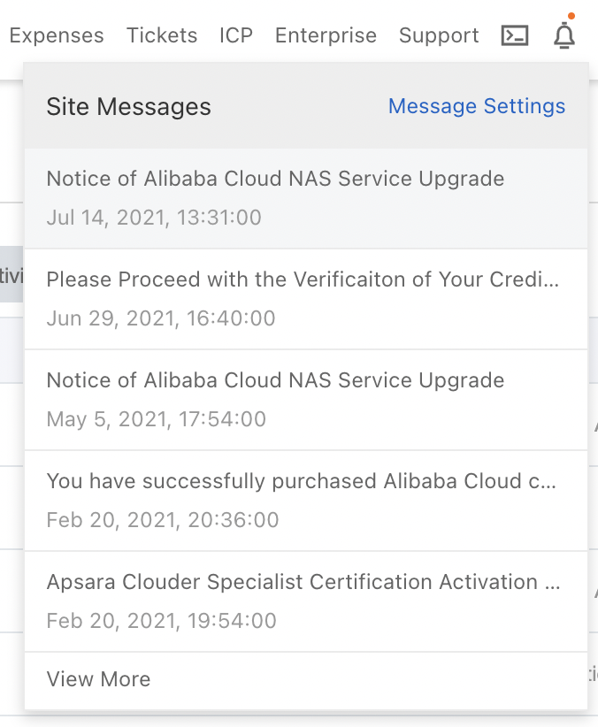{width="1.3866010498687664in"
height="1.6861745406824147in"}

-   Click on \`Message Settings\`,

-   Click \`Modify \`next to \`Security Notice\`,

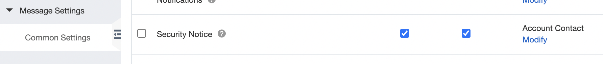{width="3.557555774278215in"
height="0.3788145231846019in"}

-   Select the recipient.

To add another recipient, click on \`Add Receiver\`.

### Show time and reason for blackhole activation 

Anti-DDoS Pro displays a list of asset blackhole events, including the
IP address that caused the attack.

To view this list:

-   Go to the \`Traffic Security\` \`(Anti-DDoS Basic) \`console,

-   Select a region,

-   Click on the tab corresponding to the type of instance (\`ECS\`,
    \`SLB\`, \`EIP (including NAT) \`or \`Others\`),

-   Click on the IP address of the instance.

The list of Blackhole events is displayed with the start and end time.
The peak traffic of each attack is displayed.

# Container Registry 

Container Registry allows to create images based on Dockerfile. There
are two editions: the personal version and the enterprise version.

On the Container Registry console, select the personal instance:

-   Go to the \`Container Registry \`console,

-   Click on the corresponding edition.

{width="2.746781496062992in"
height="1.2881889763779528in"}

The namespace is a collection of repositories. The repository is a
collection of images.

Build rules allow to create an image automatically.

RAM is used to manage access to resources.

It is possible to run a scan of an image to detect possible
vulnerabilities.

## The namespaces 

A namespace is a collection of repositories. A good practice is to group
the repositories of an organization (company, team, \...) in a
namespace.

The limit is 3 namespaces per Alibaba Cloud account.

To create a:

-   Go to the \`Container Registry \`console,

-   Click on \`Instance of Personal Edition\`,

-   Click on \`Repository \| Namespace\`,

{width="3.8439873140857395in"
height="0.6353258967629046in"}

-   Click on \`Create Namespace\`,

-   \`Namespace:\` this is the name of the namespace,

-   Click on \`Confirm\`.

{width="1.8777723097112862in"
height="1.211859142607174in"}

By default, repositories are created automatically when a push is made.
It is possible to modify this behavior (\`Automatically Create
Repository \`radio button).

By default, the repositories are private. It is possible to change this
behavior (\`Default Repository Type \`radio button).

## The repositories 

A repository is a collection of images. A good practice is to group all
the images of an application in a repository.

A repository can be public or private.

It is possible to trigger a notification when an image is uploaded
(webhook). These notifications can be triggered either from a regular
expression or from a specified list of tags.

You can change the permissions (read-only, write, admin) for a specific
repository.

To create a repository:

-   Go to the \`Container Registry \`console,

-   Click on \`Instance of Personal Edition\`,

-   Select a region,

-   Click on \`Repository \| Repositories\`,

-   Click on \`Create Repositories\`,

-   \`Namespace\`: this is the namespace,

-   \`Repository Name\`: this is the name of the repository,

-   \`Repository Type:\` this is the type of repository,

-   \`Summary\`: this is the summary,

-   Click on \`Next\`,

{width="2.5943810148731408in"
height="2.347354549431321in"}

-   \`Source Code\`: select \`Local Repository\`,

-   Click on \`Create Repositories\`.

{width="2.6349573490813647in"
height="1.9794706911636046in"}

A page displaying the details appears:

{width="4.5in"
height="2.3958333333333335in"}

To have the image generated automatically when the code changes,
activate \`Automatically Build Images When Code Changes\`.

If the source code is located outside of Mainland China, it is
recommended to enable \`Build With Servers Deployed Outside Mainland
China \`as some sites outside of China are not accessible from Mainland
China.

To create the image without using the cache, check \`Build Without
Cache\`.

## The builds 

To create an image when the code changes:

-   Go to the \`Container Registry \`console,

-   Click on \`Instance of Personal Edition\`,

-   Select a region,

-   Click on \`Repository \| Repositories\`,

-   Click on \`Manage \`on the line of the repository,

-   Click on \`Build\`.

{width="3.15496062992126in"
height="2.3170461504811897in"}

To have the image generated automatically when the code changes,
activate \`Automatically Build Images When Code Changes\`.

If the source code is located outside of Mainland China, it is
recommended to enable \`Build With Servers Deployed Outside Mainland
China \`as some sites outside of China are not accessible from Mainland
China.

To create the image without using the cache, check \`Build Without
Cache\`.

To create a build rule:

-   Go to the \`Container Registry \`console,

-   Click on \`Instance of Personal Edition\`,

-   Select a region,

-   Click on \`Repository \| Repositories\`,

-   Click on \`Manage \`on the image line,

-   Click on \`Build\`,

-   Click on \`Add Build Rule\`,

To modify a build rule, click \`Modify \`on the line of the rule.

-   \`Type:\` this is the type of trigger of the deposit:

```{=html}
<!-- -->
```
-   \`Branch\`: this is a branch that triggers the build; select the
    branch name,

-   \`Tag\`: this is a tag that triggers the build; select the name of
    the tag,

```{=html}
<!-- -->
```
-   \`Dockerfile Directory:\` this is the directory where the
    \`Dockerfile\` is located,

-   \`Dockerfile Filename\`: this is the name of the \`Dockerfile \`(by
    default \`Dockerfile\`),

-   \`Tags\`: this is the tag of the image that will be created,

-   Click on \`Confirm\`.

{width="2.8843635170603674in"
height="1.8966469816272966in"}

To run a build rule, click on \`Build \`on the line of the rule in the
\`Build Rules \`section.

{width="3.4197069116360455in"
height="0.8871183289588801in"}

To display the logs, click on \`Log \`on the line of the build.

{width="3.6085958005249346in"
height="0.7874311023622047in"}

To display the list of created images:

-   Go to the \`Container Registry \`console,

-   Click on \`Instance of Personal Edition\`,

-   Select a region,

-   Click on \`Repository \| Repositories\`,

-   Click on \`Manage \`on the line of the image,

-   Click on \`Tags\`.

{width="4.5in"
height="0.6236111111111111in"}

## Access control to repositories 

By default, the Alibaba Cloud account has access to all resources. It is
also possible to provide access to sub-accounts using RAM (Resource
Access Management) and STS (Security Token Service).

To give permissions to a RAM user, you must use the appropriate policy:

-   \`AliyunContainerRegistryFullAccess \`to give full access:

{

\"Statement\": \[

{

\"Action\": \"cr:\*\",

\"Effect\": \"Allow\",

\"Resource\": \"\*\"

}

\],

\"Version\": \"1\"

}

-   \`AliyunContainerRegistryReadOnlyAccess \`to give read-only access:

{

\"Statement\": \[

{

\"Action\": \[

\"cr:Get\*\",

\"cr:List\*\",

\"cr:PullRepository\"

\],

\"Effect\": \"Allow\",

\"Resource\": \"\*\"

}

\],

\"Version\": \"1\"

}

\`Resources \`are identified with the following format:

acs:cr:\$regionid:\$accountid:repository/\$namespacename/\$repositoryname

It is possible to use \`\* \`at the region and account level.

Permissions (\`Action\`) are values in the form \`cr:CreateRepository\`.

## Image security scan 

You can run a scan of an image to detect possible vulnerabilities. A
vulnerability report is then produced. Each vulnerability is displayed
with its level (\`High\`, \`Medium\`, \`Low \`or \`Unknown\`) as well as
the versions correcting these vulnerabilities.

To start a scan:

-   Go to the \`Container Registry \`console,

-   Click on \`Instance of Personal Edition\`,

-   Select a region,

-   Click on \`Tags\`,

-   Click on \`Security Scan \`on the line of the image,

{width="0.7791207349081365in"
height="0.5430238407699037in"}

-   Click on \`Trigger Scan\`.

{width="2.834987970253718in"
height="1.702742782152231in"}

# Case study 

In this chapter, we will put three Alibaba Cloud use cases into
practice.

The first one consists in launching an ECS instance in order to run a
nginx web server that displays a web page.

The second is to create a MySQL 8.0 database and verify that it is
accessible from the Alibaba Cloud console.

The third is to host a static website in an OSS bucket via a CDN.

## Launching a web server on an ECS instance 

To launch a Web server on an ECS instance, we will proceed in several
steps:

-   Create a SSH key pair,

-   Create a VPC and a public VSwitch,

-   Create a EIP,

-   Create an ECS instance,

-   Associate the EIP with the ECS instance,

-   Check that everything is working properly,

-   Free up resources.

First of all, you have to select the region \`Germany (Frankfurt)\`.

### Create a SSH key pair 

Let\'s create a SSH key pair:

-   Go to the \`ECS \`console,

-   Go to the selected region,

-   Click on \`Network & Security \| SSH Key Pairs,\`

-   Click on \`Create SSH Key Pair\`,

{width="4.5in" height="0.6805555555555556in"}

-   Enter \`demoECS \`as the key pair name in the \`SSH Key Pair Name
    \`field,

-   Click on the \`OK \`button.

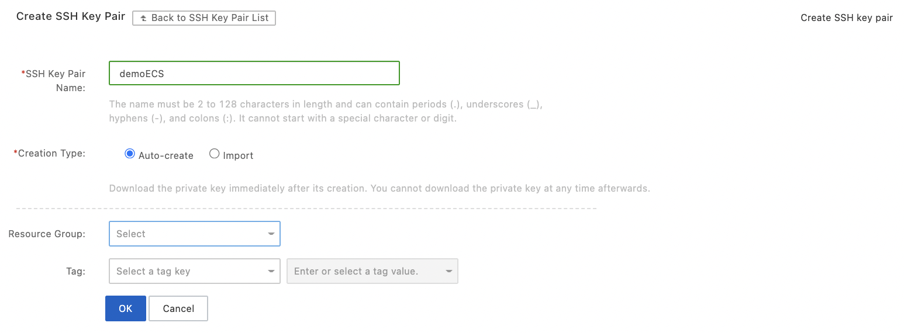{width="4.5in" height="1.6590277777777778in"}

The \`demoECS.pem \`file is automatically downloaded.

### Create a public VSwitch 

Let\'s create a public VSwitch:

-   Go to the \`VPC \`console,

-   Go to the selected region,

-   Click on \`VPCs\`,

-   Click on \`Create VPC\`,

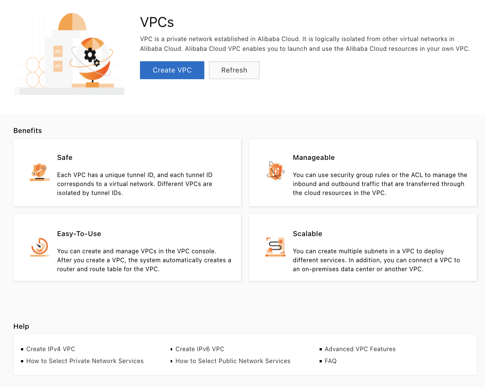{width="2.576353893263342in"
height="2.0594936570428697in"}

-   Enter the name of the VPC (\`demoVPC\`) and its CIDR
    (\`10.0.0.0/16\`).

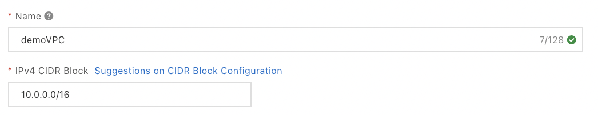{width="2.4900043744531932in"
height="0.4807097550306212in"}

-   Enter the name of the VSwitch (\`demoVSwitch\`), in the availability
    field (\`Frankfurt A\`) and with a subset of the CIDR of the VPC as
    CIDR (\`10.0.0.0/24\`),

-   Click on \`OK\`,

{width="4.5in" height="3.69375in"}

Let\'s check that both the VPC and the VSwitch have been created:

-   Go to the \`VPC\` console,

-   Go to the selected region,

-   Click on \`VPCs\`,

{width="4.5in"
height="0.9763888888888889in"}

-   The new VPC is well listed,

-   Click on \`vSwitch\`,

{width="4.5in" height="0.9826388888888888in"}

The new VSwitch is well listed.

### Create an EIP 

Let\'s create a EIP with traffic billing:

-   Go to the \`VPC \`console,

-   Click on \`Access to Internet \| Elastic IP Addresses\`,

-   Click on \`Create EIP\`,

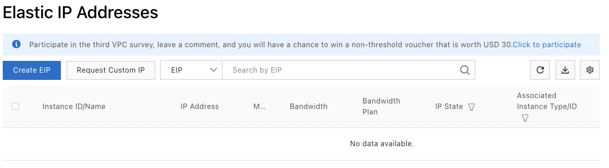{width="3.8741240157480314in"
height="1.069569116360455in"}

-   Check that the billing type is \`Pay-As-You-Go\`,

{width="1.6371314523184601in"
height="0.18897856517935258in"}

-   Select the region \`Germany (Frankfurt)\`,

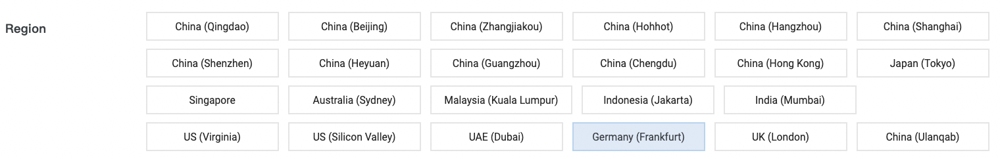{width="3.649232283464567in"
height="0.5811745406824147in"}

-   Enter the name of the EIP,

{width="1.4053346456692914in"
height="0.29842957130358705in"}

-   Click on \`Buy Now\`,

{width="0.5519739720034995in"
height="0.24414260717410324in"}

-   Check \`I have read and agree to Elastic IP Agreement of Service\`,

-   Click on \`Activate Now\`.

{width="0.6341699475065616in"
height="0.27825787401574803in"}

Let\'s check that the EIP has been created:

-   Go to the \`VPC \`console,

-   Click on \`Access to Internet \| Elastic IP Addresses\`.

{width="4.5in" height="0.9111111111111111in"}

The new EIP should appear in the list.

### Create an ECS instance 

Let\'s create an ECS instance running a Nginx web server:

-   Go to the \`ECS\` console,

-   Click on \`Instances & Images \| Instances,\`

-   As there is no instance, Alibaba Cloud directly proposes to create a
    new instance: click on \`Create ECS Instance\`,

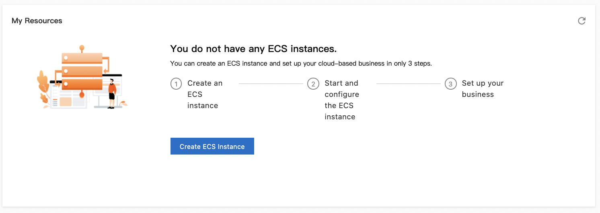{width="3.1788681102362206in"
height="1.133698600174978in"}

-   Select the \`Pay-As-You-Go \`billing method,

{width="2.5341338582677166in"
height="0.18771325459317587in"}

-   Make sure that the region \`Germany (Frankfurt) is \`selected,

{width="2.378624234470691in"
height="0.21253390201224848in"}

-   Before selecting the instance, filter the \`1 vCPU\`,

{width="0.6085608048993876in"
height="0.35694444444444445in"}

-   Select the instance type \`ecs-t5-lc2m1.nano\`,

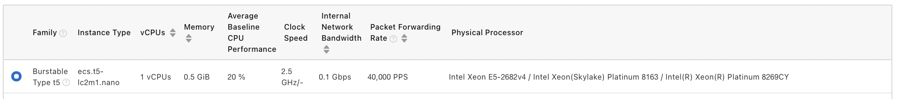{width="4.5in" height="0.5027777777777778in"}

-   Select the \`Alibaba Cloud Linux \`image type, version \`3.2104
    64-bit\`,

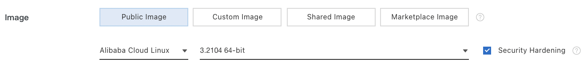{width="3.0625503062117234in"
height="0.34737314085739285in"}

-   Click on \`Next\`,

{width="0.3674311023622047in"
height="0.2565080927384077in"}

-   Select the VPC \`demoVPC \`that we have just created and the VSwitch
    \`demoVSwitch \`that we have just created,

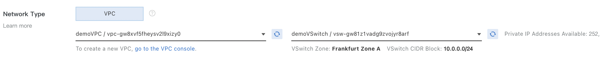{width="4.5in" height="0.43680555555555556in"}

-   Select the ports to allow in the security group (port 22 for SSH
    under Linux, port 3389 for RDP under Windows and port 80 for HTTP),

{width="4.5in" height="0.85in"}

-   Click on \`Next\`,

-   Select the key pair we just created (\`demoECS\`),

{width="2.4721784776902886in"
height="0.16671916010498689in"}

-   Name this instance \`demoECS\`,

{width="2.6857731846019246in"
height="0.2619466316710411in"}

-   Show advanced options by clicking on \`show \`next to \`Advanced
    (based on instance RAM roles or cloud-init)\`,

{width="2.7891360454943133in"
height="0.22072287839020122in"}

-   Enter the user data for the initialization of the instance,

{width="4.5in" height="0.63125in"}

-   Click on \`Next\`,

-   Click on \`Next\`,

-   Check \`ECS Terms of Service\`,

-   Click on \`Create Instance\`.

Now let\'s check that the instance has been initialized:

-   Go to the \`ECS \`console,

-   Click on \`Instances & Images \| Instances.\`

The new instance we have just created is displayed.

{width="4.5in" height="1.0305555555555554in"}

### Involve the EIP in the ECS process 

To be able to connect to this instance from the Internet, we must
associate the EIP we have created with it:

-   On the line for the new ECS instance, in the \`Actions \`column,
    click on \`Network and Security Group \| Bind EIP\`,

{width="2.141117672790901in"
height="1.4981211723534558in"}

-   Select the EIP to associate with the ECS instance,

{width="2.236586832895888in"
height="1.2456539807524059in"}

-   Click on \`OK\`,

-   The EIP is now displayed in the \`IP Address \`column next to the
    private IP address,

{width="0.579242125984252in"
height="0.5154724409448819in"}

### Check that everything is working well 

Let\'s connect to the ECS instance:

-   Change the permissions of the SSH key file,

\`chmod 400 demoECS.pem

\`The \`demoECS.pem\` file must have the restricted permissions 400.

-   Connect via SSH to the ECS instance,

\`ssh -i demoECS.pem \`root@47.254.147.166\`

-   SSH asks to confirm the connection at the first connection (enter
    yes),

The authenticity of host \'47.254.147.166 (47.254.147.166)\' can\'t be
established.

ECDSA key fingerprint is
SHA256:mJJ2XwQaijw0ET0st5zXKgRnGKa9CyVgD4EVHYkANuk.

Are you sure you want to continue connecting (yes/no/\[fingerprint\])?
yes

Warning: Permanently added \'47.254.147.166\' (ECDSA) to the list of
known hosts.

Welcome to Alibaba Cloud Elastic Compute Service!

Last login: Mon Aug 9 21:21:19 2021 from 78.203.244.69

\[root@iZgw8d3snbfmcmxtkd66htZ \~\]#

-   \`Check that nginx is installed,

\`curl 0.0.0.0

-   The result of the command is:

\<h1\>Helloworld\</h1\>

-   \`Display the version of the nginx web server installed with the
    command \`nginx -v\`,\`

nginx version: nginx/1.18.0

-   \`In a web browser, go to the EIP address (\`47.254.147.166\`):

{width="1.5360050306211723in"
height="0.5198228346456693in"}

The Nginx web server, if properly installed, should display Helloworld.

### Freeing up resources 

Let\'s delete the created resources:

-   Go to the \`ECS \`console,

-   Click on \`Instances & Images \| Instances,\`

-   On the line of the instance, select \`More \| Instance Status \|
    Release\`,

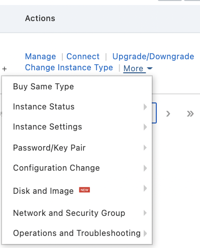{width="1.339283683289589in"
height="1.6623272090988626in"}

-   Check \`Release Now\`,

-   Click on \`Next\`,

{width="2.1555971128608924in"
height="1.4111165791776028in"}

-   Click on \`OK\`.

The instance disappears from the list of instances.

Let\'s remove the SSH key pair:

-   Go to the \`ECS \`console,

-   Click on \`Network & Security \| SSH Key Pairs,\`

-   Select the line of the key pair,

-   Click on \`Delete\`,

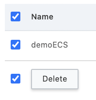{width="0.6886975065616798in"
height="0.716522309711286in"}

-   Click on \`OK\`.

{width="2.706404199475066in"
height="1.1468810148731408in"}

Let\'s delete the security group:

-   Go to the \`ECS \`console,

-   Click on \`Network & Security \| Security Groups,\`

-   Select the line of the security group,

-   Click on \`Delete\`,

{width="1.005255905511811in"
height="0.9985990813648294in"}

-   Click on \`OK\`.

{width="2.285249343832021in"
height="0.9560662729658793in"}

The security group will then disappear from the list.

Let\'s remove the EIP:

-   Go to the \`VPC \`console,

-   Click on \`Access to Internet \| Elastic IP Addresses\`,

-   On the line of the EIP, in the \`Actions \`column, select \`\... \|
    Release\`,

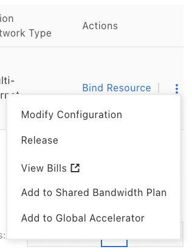{width="0.9208038057742782in"
height="1.2063702974628172in"}

-   Click on \`OK\`.

{width="1.827746062992126in"
height="1.0883661417322834in"}

The EIP disappears from the list of EIPs.

Let\'s remove the VSwitch:

-   Go to the \`VPC \`console,

-   Click on \`vSwitch\`,

-   On the VSwitch line, click on \`Delete \`in the \`Actions \`column,

{width="0.4846369203849519in"
height="0.8738156167979002in"}

-   Click on \`OK\`,

{width="2.416486220472441in"
height="0.607477034120735in"}

Let\'s remove the VPC:

-   Go to the \`VPC \`console,

-   Click on \`VPCs\`,

-   On the VPC line, click on \`Delete \`in the \`Actions \`column,

{width="0.6129166666666667in"
height="0.4815780839895013in"}

-   Click on \`OK\`,

{width="2.6392727471566055in"
height="0.6402679352580928in"}

## Creating a mySQL RDS database 

In this case study, we will set up a RDS instance in a new VPC.

The steps are as follows:

-   Create a VPC and a VSwitch,

-   Create a RDS MySQL 8.0 instance,

-   Create an account,

-   Create a database,

-   Access to the database,

-   Free up resources.

### Create a VPC and a VSwitch 

Let\'s create a VPC with CIDR \`172.16.0.0/16\`:

-   Go to the \`VPC \`console,

-   Click on \`VPCs\`,

-   Click on \`Create VPC\`,

{width="2.7627755905511813in"
height="1.3796817585301837in"}

-   Enter the name of the VPC (\`dbVPC\`) and the CIDR block,

{width="2.412298775153106in"
height="0.5755271216097988in"}

Let\'s create a VSwitch in this VPC with CIDR \`172.16.1.0/24 \`in the
availability zone \`Frankfurt Zone A:\`

-   Enter the name of the VSwitch (\`dbVSwitch\`),

-   Select the availability zone \`Frankfurt Zone A\`,

-   Enter the CIDR block of the VSwitch (\`172.16.1.0/24\`),

-   Click on \`OK\`,

{width="3.1302351268591426in"
height="2.484382108486439in"}

The VPC and VSwitch are then created:

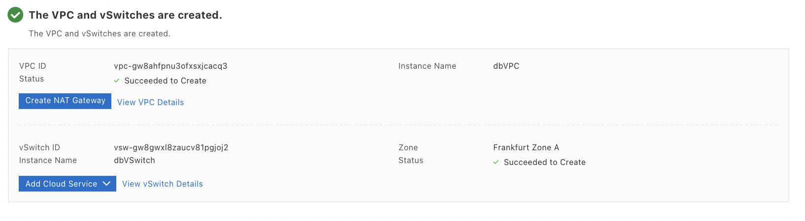{width="4.5in" height="1.2395833333333333in"}

### Create a database instance 

Let\'s create a RDS \`mydb\` database instance based on MySQL version
8.0 engine:

-   Go to the \`ApsaraDB for RDS \`console,

-   Click on \`Instances\`,

-   Click on \`Create Instance\`,

{width="4.5in"
height="1.0118055555555556in"}

-   Select the \`Pay-As-You-Go \`billing method,

{width="2.1891240157480314in"
height="0.19391294838145232in"}

-   Make sure that the region \`Germany (Frankfurt)\` is selected,

{width="1.4841447944007in"
height="0.19676181102362206in"}

-   Select \`MySQL \`engine version \`8.0\`,

{width="4.5in"
height="0.6972222222222222in"}

-   Select the \`Basic \`edition,

{width="4.5in" height="0.25833333333333336in"}

-   Select the instance type \`mysql.n1.micro.1\`,

{width="4.5in" height="0.4027777777777778in"}

-   Click on \`Next: Instance Configuration\`,

-   Select the VPC \`dbVPC \`and the VSwitch \`dbVSwitch\`,

{width="3.439983595800525in"
height="0.6258858267716535in"}

-   Click on \`Next: Confirm Order\`,

-   Check \`Terms of Service\`,

{width="1.3884634733158354in"
height="0.22394575678040246in"}

-   Click on \`Pay Now\`.

{width="0.4449595363079615in"
height="0.2338888888888889in"}

-   Click on \`Instances\`,

-   The new RDS instance should appear in the list,

{width="4.5in"
height="0.8472222222222222in"}

After a few minutes, the instance turns:

{width="0.3637904636920385in"
height="0.5601202974628171in"}

### Create an account 

Let\'s create a privileged account with login \`root \`and password
\`\$Mypassword:\`

-   Click on the instance ID,

{width="0.7403674540682414in"
height="0.5378138670166229in"}

-   Click on \`Accounts\`,

-   Click on \`Create Account\`,

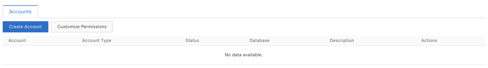{width="4.5in" height="0.6340277777777777in"}

-   Enter \`root \`as the database account,

-   Select the preferred account type,

-   Enter \`\$Mypassword \`as the password and as the password
    confirmation,

-   Click on \`Determine\`.

{width="2.506281714785652in"
height="2.341517935258093in"}

The account will then appear in the list of accounts:

{width="3.8279451006124234in"
height="0.7183300524934383in"}

### Create a database 

Let\'s create a \`demodb database\`:

-   Click on \`Databases\`,

-   Click on \`Create Database\`,

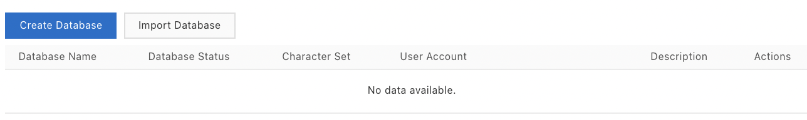{width="4.121103455818023in"
height="0.6143503937007874in"}

-   Enter \`demodb \`as database name,

-   Click on \`Create\`,

{width="3.859816272965879in"
height="1.8387740594925635in"}

The database appears in the list of databases:

{width="4.5in" height="0.5861111111111111in"}

### Access to the database 

On the RDS instance page, click on \`Log On to Database:\`

{width="1.3118449256342957in"
height="0.16901027996500437in"}

The following page is displayed:

{width="2.8909470691163603in"
height="2.4180457130358706in"}

Enter the login and password:

{width="3.7000120297462815in"
height="2.159481627296588in"}

Let\'s check that we can access the \`demodb \`database we have created
by clicking on \`Instances Connected:\`

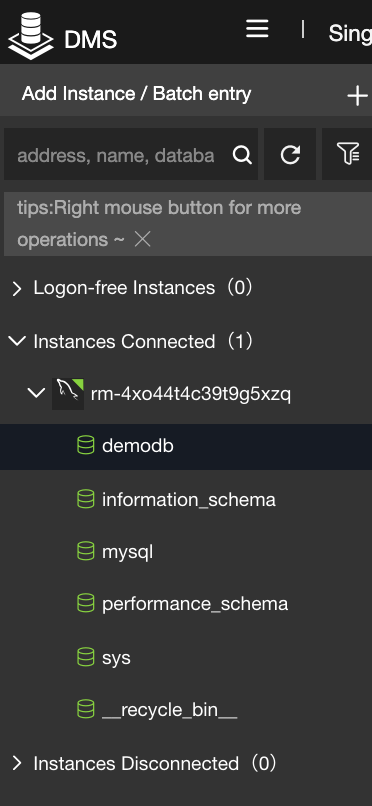{width="0.7998228346456693in"
height="1.732950568678915in"}

### Freeing up resources 

Let\'s free up resources:

-   Go to the \`ApsaraDB RDS \`console,

-   Click on \`Instances\`,

-   In the instance row, in the \`Actions \`column, select the option
    \`More \| Release Instance\`,

{width="1.7714676290463691in"
height="1.0534645669291338in"}

-   Click on \`OK\`,

{width="1.8550503062117236in"
height="0.6329494750656168in"}

## Hosting of a static website on OSS and distribution via CDN 

In this third case study, we will host a website of static pages in an
OSS bucket and broadcast it via the CDN.

To do this, we need to follow the following steps:

-   Create a bucket configured for hosting static web pages,

-   Create a CDN instance,

-   Create a CNAME record to point to the CDN,

-   Free up resources.

First of all, create a local \`index.html \`file with the following
content:

\`\<html\>

\<body\>

Hello world!

\</body\>

\</html\>

### \`Create a bucket for hosting static web pages 

Creation of an \`awebsite \`bucket:

-   Go to the \`OSS \`console,

-   Click on \`Buckets\`,

-   Click on \`Create Bucket\`,

{width="4.5in"
height="0.5986111111111111in"}

-   Enter \`awebsite \`as bucket name,

-   Select \`Germany (Frankfurt) \`as region,

-   Click on \`OK\`,

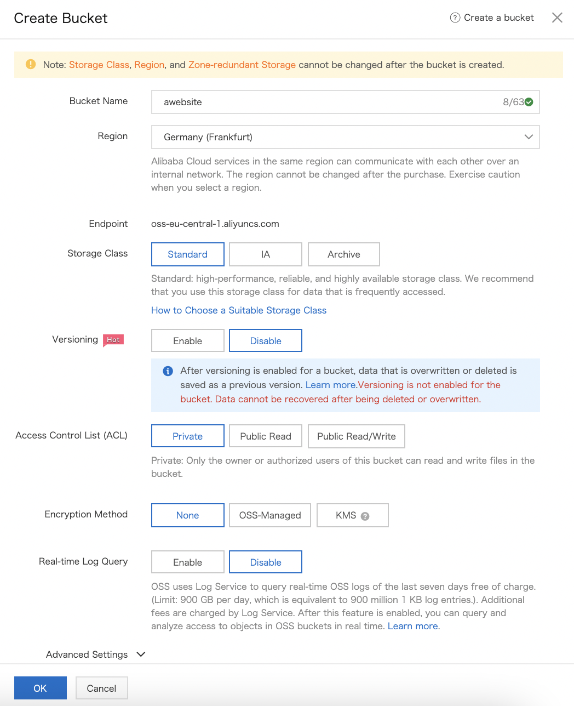{width="2.4812281277340333in"
height="3.0494597550306213in"}

-   Click on \`Files\`,

-   Click on \`Upload\`,

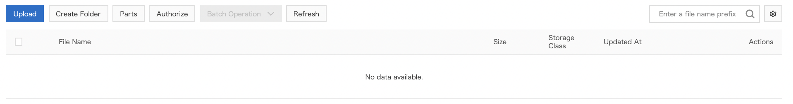{width="4.5in" height="0.5958333333333333in"}

-   Click on \`Select Files\`,

-   Select the \`index.html\` file you created earlier,

-   Click on \`Upload\`,

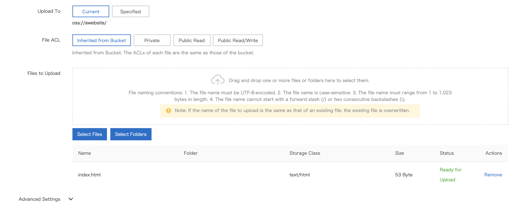{width="4.5in" height="1.836111111111111in"}

-   The status of the upload tasks is displayed,

{width="2.921668853893263in"
height="1.1217771216097987in"}

-   Close the window by clicking on the cross,

-   Click on \`Files\`,

{width="0.721405293088364in"
height="1.1070614610673666in"}

-   Check that the \`index.html \`file appears in the list of objects in
    the bucket,

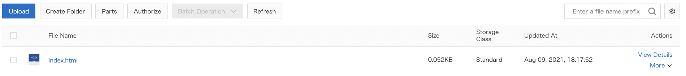{width="4.5in" height="0.5069444444444444in"}

-   Click on \`Basic Settings \| Static Pages\`,

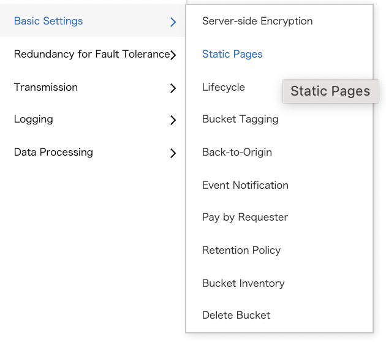{width="1.5239063867016622in"
height="1.3497451881014872in"}

-   Click on \`Configure \`in the \`Static Pages \`section,

{width="2.8556452318460193in"
height="0.809099956255468in"}

-   Enter \`index.html \`as the default home page,

-   Click on \`Save\`,

{width="3.5800207786526683in"
height="1.5159842519685038in"}

-   Return to the bucket page by clicking on \`awebsite\`,

{width="1.513008530183727in"
height="0.10981408573928259in"}

-   Click on \`Access Control \| Access Control List (ACL)\`,

{width="1.7976498250218722in"
height="0.7542913385826772in"}

-   In the \`Access Control List (ACL) \`section, click on
    \`Configure\`,

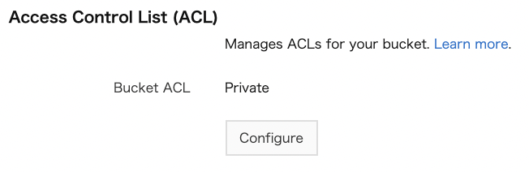{width="1.59333552055993in"
height="0.518079615048119in"}

-   Click on \`Public Read\`,

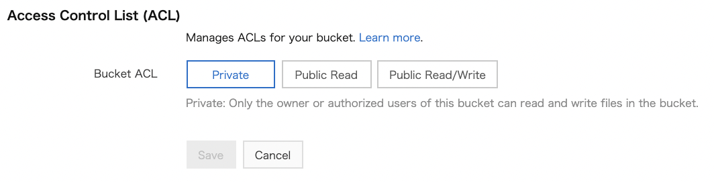{width="3.2248753280839897in"
height="0.8246325459317585in"}

-   Confirm the change by clicking on \`Continue\`,

{width="2.130398075240595in"
height="0.8606244531933508in"}

-   Click on \`Save\`,

-   The bucket is now in public reading: everyone can access it,

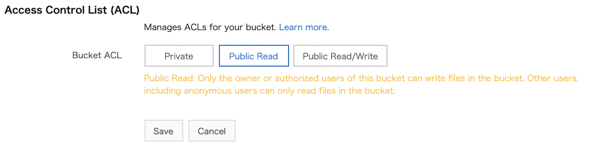{width="2.871851487314086in"
height="0.7294860017497813in"}

-   In a web browser, go to
    \`https://awebsite.oss-eu-central-1.aliyuncs.com/,\`

-   The browser offers to download the resource,

{width="1.37376312335958in"
height="1.226634951881015in"}

-   Click on \`Access Control\`,

-   In the \`Bucket Policy \`section, click on \`Configure\`.

{width="2.6080008748906387in"
height="0.5851902887139108in"}

### Create a CDN instance 

To access static files hosted in OSS from a web browser, let\'s create a
CDN domain:

-   Go to the \`Alibaba Cloud CDN \`console,

-   Click on \`Domain Names\`,

-   Click on \`Add Domain Name\`,

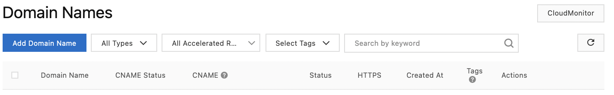{width="3.685235126859143in"
height="0.57667104111986in"}

-   Enter the domain name to be accelerated (\`demo.XXX.cn\`),

{width="2.700622265966754in"
height="0.4846948818897638in"}

-   Specify the type of business (\`Image and Small File\`),

-   Select \`Global (Excluding Mainland China) \`as region,

{width="2.813454724409449in"
height="1.1609842519685039in"}

-   In the \`Origin Servers \`section, click on \`Add Origin Server\`,

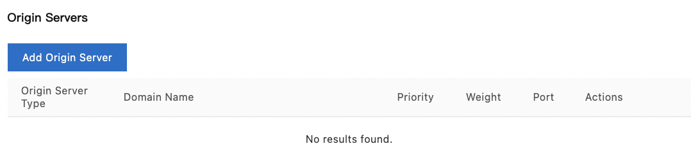{width="3.1545570866141732in"
height="0.6932239720034996in"}

-   Select \`OSS Domain \`as origin,

-   Select \`awebsite.oss-eu-central-1.aliyuncs.com \`as the domain
    name,

-   Click on \`OK\`,

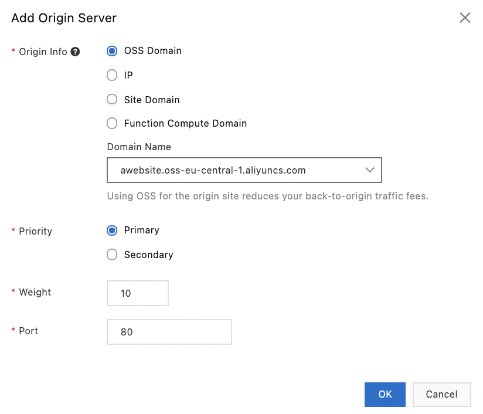{width="2.1779997812773404in"
height="1.8660892388451444in"}

-   Click on \`Next\`,

-   Click on \`Next \`again,

-   Click on the \`Domain Names \`menu on the left to return to the list
    of domains in \`Alibaba Cloud CDN\`,

-   The list of domain names is displayed:

{width="4.5in" height="0.5534722222222223in"}

-   Copy the value of the domain name to be associated with the
    \`CNAME:\`

{width="1.0397998687664043in"
height="0.4031867891513561in"}

### Create a CNAME record to point to the CDN 

Let\'s configure Alibaba Cloud DNS to point \`demo.XXX.cn \`to the CDN
domain name we just created:

-   Go to the \`Alibaba Cloud DNS \`console,

-   Click on \`Manage DNS\`,

-   If you have not yet registered the domain name, click on \`Add
    Domain Name \`and follow the procedure,

-   If the domain name is already registered, click on the domain name,

{width="0.6032786526684164in"
height="0.4264555993000875in"}

-   Click on \`Add Record\`,

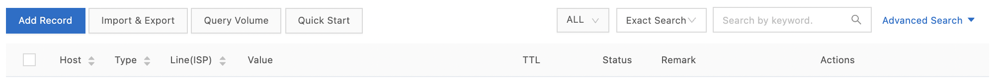{width="4.5in" height="0.37569444444444444in"}

-   Select the \`CNAME \`record type,

-   Specify the domain name \`demo.XXX.cn\`,

-   Enter the previously copied DNS domain name (\`demo.XXX.cn.
    w.kunlunsl.com\`) as the value,

-   Click on \`Confirm\`,

In a web browser, go to \`http://demo.XXX.cn/\`. The message \`Hello
world! \`is displayed:

{width="0.4905041557305337in"
height="0.13713035870516185in"}

### Freeing up resources 

Let\'s delete the created resources:

-   Go to the \`Alibaba Cloud DNS \`console,

-   Click on \`Manage \`DNS,

-   Click on the domain name ID,

-   On the line of the \`CNAME \`record to be deleted, click on
    \`Delete\`,

{width="4.5in" height="0.4888888888888889in"}

-   Click on \`OK\`,

{width="1.4852744969378828in"
height="0.6084831583552056in"}

-   Go to the \`Alibaba Cloud CDN \`console,

-   Click on \`Domain Names\`,

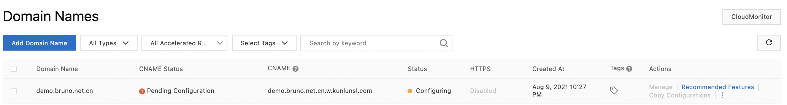{width="4.5in" height="0.6041666666666666in"}

-   On the line of the domain name, click on \`\... \| Delete\`,

{width="1.0296937882764654in"
height="0.590903324584427in"}

-   Click on \`OK\`.

{width="1.6839654418197725in"
height="0.48818569553805774in"}

ABOUT THE AUTHOR

Bruno Delb is a DevOps with soft skills, thanks to his experience as an
Agile coach and his skills in Management 3.0. His certifications in
Clouds and testing give him a broad vision of the subject.

A former web and mobile developer who has adapted Craftmanship
practices, he also believes that ITIL should be integrated and adapted
to the Agile and DevOps context.

+-----------------------------------------------------------------------+
| Her LinkedIn profile: https://www.linkedin.com/in/brunodelb           |
|                                                                       |
| His blog DevOpsTestLab: http://www.devopstestlab.com                  |
|                                                                       |
| His blog on crypto-currencies: https://www.coinlab.blog               |
|                                                                       |
| His publications on Medium: https://medium.com/@brunodelb             |
|                                                                       |
| His Youtube channel: http://www.youtube.com/c/brunodelb               |
|                                                                       |
| Its Docker Hub space: https://hub.docker.com/u/devopstestlab          |
|                                                                       |
| His projects on GitHub: https://github.com/brunodelb                  |
+=======================================================================+
+-----------------------------------------------------------------------+
