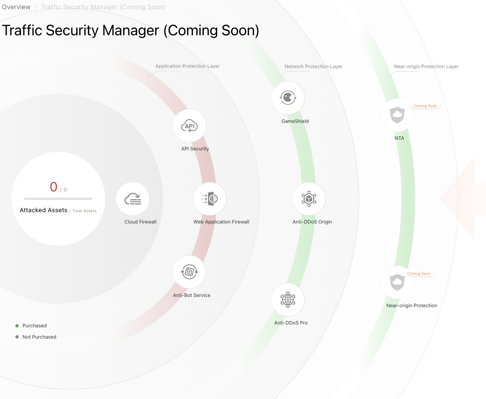
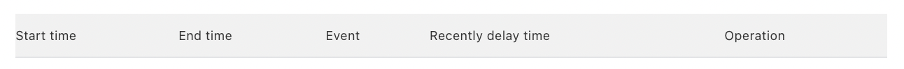

# Anti-DDoS 

Anti-DDoS Basic provides protection for public IP addresses of ECS, SLB,
WAF and EIP against attacks up to 5 Gbps. This service is automatically
activated.

Notifications are sent in case of DDoS attacks.

There are several offers:
-   Anti-DDoS Origin Enterprise,
-   Anti-DDoS Pro,
-   Anti-DDoS Premium.

Anti-DDoS Origin Enterprise provides protection for ECS, SLB, WAF and
EIP instances.

The protection bandwidth and IP addresses of an Anti-DDoS Origin
Enterprise instance can be changed.

The Traffic Security Manager allows to manage the different aspects of
traffic security.

Anti-DDoS Origin on-demand allows to manually activate the rerouting of
traffic to the Anti-DDoS Origin instance in case of a DDoS attack and
then deactivate it once the attack is over. The automatic mode (NetFlow)
performs the rerouting automatically if the threshold is exceeded.

If the throughput exceeds the normal throughput, Anti-DDoS Origin scrubs
the traffic from the attack. This scrubbing threshold can be configured.
This scrubbing can also be cancelled.

The blackhole consists in blocking Internet access to a server if the
volume of DDoS attacks is too high. It is still possible to connect
indirectly to an ECS instance blocked by the backhole.

You can view the global traffic of an instance, the traffic of each IP
address, the list of event logs of DDoS attacks or the logs of
configuration changes of an instance.

## The different solutions offered 

Anti-DDoS Basic provides protection for public IP addresses of ECS, SLB,
WAF and EIP against attacks up to 5 Gbps. This service is automatically
activated:
-   Go to the `Traffic Security` `(Anti-DDoS Basic)` console,
-   Click on `Network Security | Anti-DDoS Origin | Manage
    Instances`.

{width="4.5in" height="1.1729166666666666in"}

The Basic editing instance is displayed.

For a higher level of security, you can subscribe to other services:
-   Anti-DDoS Origin Enterprise,
-   Anti-DDoS Pro,
-   Anti-DDoS Premium.

Anti-DDoS Origin Enterprise is suitable if the system is frequently
attacked and for latency sensitive services.

Anti-DDoS Pro and Anti-DDoS Premium are suitable if the attacks are
important and if the services are ecommerce or financial sites.

Anti-DDoS Pro is suitable for services deployed in mainland China while
Anti-DDoS Premium is suitable for services deployed outside mainland
China.

GameShield protects against DDoS and HTTP Flood attacks. It is suitable
for the gaming industry and services with even higher levels of attacks.

## The Traffic Security Manager 

The Traffic Security Manager allows to manage the different aspects of
traffic security.

To view the protection status and attacks of your resources,
-   Go to the `Traffic Security` `(Anti-DDoS Basic)`,`` console
-   Click on `Overview`.

{width="4.5in" height="2.3534722222222224in"}

Traffic Security Manager allows to view the architecture and status of
asset protection:
-   Go to the `Traffic Security` `(Anti-DDoS Basic)` console,
-   Click on `Traffic Security Manager`.

{width="3.1136504811898513in"
height="2.5533858267716534in"}

Protection against DDoS attacks for ECS, SLB and EIP instances is free
of charge. To view the protection status of these instances:
-   Go to the `Traffic Security` `(Anti-DDoS Basic)` console,
-   Select a region,
-   Click on `Assets`.

{width="3.1169761592300964in"
height="1.983705161854768in"}

This page displays links to provide additional useful information:
-   To view the default blackhole thresholds for assets, click on the
    `Default Basic Protection Threshold` link,
-   To view the Blackhole filtering policy, click on the `Blackholing`
    link.

To protect a service, click on the corresponding tab (`ECS`, `SLB`,
`EIP (including NAT)` or `Others`).

Information about the protection is displayed on the line of each asset:
-   `Status`: this is the state of the instance; the supported values
    are `Normal`, `Cleaning` and `Black Hole Activated`,
-   `Protection Capacity`: this is`` the ability of an instance to
    reduce DDoS attacks,
-   `Cleaning Trigger Value`: this is`` the minimum bandwidth beyond
    which the scrubbing of the traffic begins:

```{=html}
<!-- -->
```
-   BPS (Packet Per Second): when incoming traffic exceeds this value,
    traffic scrubbing is triggered,
-   PPS (Packet Per Second): when the transfer rate of incoming packets
    exceeds this value, traffic scrubbing is triggered.

The capacity indicates the maximum bandwidth of DDoS attacks that the
instance can mitigate. If DDoS attacks consume more than the Protection
`Capacity`, Blackhole filtering is enabled.

Anti-DDoS Origin Enterprise provides protection against DDoS attacks for
all assets and services in the account. It allows to enable Anti-DDoS
Origin on a specific instance, for example ECS:
-   Select the ECS instance,
-   Click on `Add Anti-DDoS Origin`,
-   Click on `Add` on the line of the instance,
-   Click on `OK`.

To use Anti-DDoS Pro or Anti-DDoS Premium:
-   Click on `Anti-DDoS Services`,
-   Click on `Anti-DDoS Pro` or `Anti-DDoS Premium`.

## Anti-DDoS Origin on demand 

In this section, we will study:
-   Rerouting traffic to an on-demand instance in case of a DDoS attack,
-   Automatic mode (NetFlow) that allows to automatically reroute
    traffic to the Anti-DDoS Origin instance if a threshold is exceeded
    consecutively for the specified number of times.

### Enable traffic rerouting to an on-demand instance 

An on-demand Anti-DDoS Origin instance allows, in case of a DDoS attack,
to manually activate the rerouting of traffic to the Anti-DDoS Origin
instance and then to deactivate it once the attack is over:
-   Go to the `Traffic Security` `(Anti-DDoS Basic)` console,
-   Select a region,
-   Click on the `Others` tab: the list of IP addresses of the
    Anti-DDoS Origin on Demand instances purchased in the region is
    displayed,
-   Click on `Start Redirection` on the line of the instance,
-   Click on `OK`.

The `Others` tab provides the list of IP addresses of the Anti-DDoS
Origin instances purchased in the region is displayed. The tab is not
displayed if there are no instances.

The instance changes to the `Redirecting` state.

To stop the rerouting, click on `Pause Redirection` on the line of the
instance.

### Enable NetFlow automatic mode 

The automatic mode (NetFlow) allows to automatically reroute traffic to
the Anti-DDoS Origin instance if a threshold is exceeded consecutively
for the specified number of times.

To activate the automatic mode:
-   Go to the `Traffic Security` `(Anti-DDoS Basic)` console,
-   Select a region,
-   Click on the `Others` tab,
-   Click on `Configure Start Mode` on the line of the instance,
-   `Start Mode`: this is the mode used for traffic rerouting; valid
    values are:

```{=html}
<!-- -->
```
-   `Manual`: rerouting must be activated manually,
-   `Automatic (NetFlow)`: the rerouting must be activated
    automatically in case of an attack,

```{=html}
<!-- -->
```
-   `Traffic Rate`: this is the threshold of the incoming bandwidth
    (minimum 100 Mbit/s),
-   `Packet Rate (pps)`: this is`` the threshold for incoming
    packets (minimum 10 Kpps),
-   `Threshold`: this is the number of times an overrun is detected
    that triggers a reroute,
-   `Stop Mode`: this is`` the mode used to stop traffic forwarding;
    supported values are:

```{=html}
<!-- -->
```
-   `Manual`: rerouting must be manually disabled after the attack is
    over,
-   `Automatic`: the rerouting should be disabled automatically once
    the attack is over; the time zone of the server should be specified
    and the time at which the rerouting is stopped,

```{=html}
<!-- -->
```
-   Click on `OK`.

It is recommended to choose an off-peak period for the stop of the
rerouting.

## Cleaning configuration 

In this section, we will study:
-   Configuration of a traffic scrubbing threshold to guarantee the
    availability of an asset in case of an attack,
-   the preparation of a Stress Test on an ECS instance.

### Configure a traffic clearing threshold 

To ensure asset availability, if an asset's throughput exceeds the
normal throughput, Anti-DDoS Origin will scrub the traffic from the
attack. You can configure a traffic scrubbing threshold based on the
normal throughput. Anti-DDoS Origin then uses Artificial Intelligence to
identify DDoS attacks.

To configure the scrubbing threshold:
-   Go to the `Traffic Security` `(Anti-DDoS Basic)` console,
-   Click on `Assets`,
-   Select the asset region,
-   Click on the tab corresponding to the type of instance (`ECS`,
    `SLB`, `EIP (including NAT)` or `Others`,
-   Click on the IP address of the instance,
-   Click on `Cleaning Settings`,
-   `Cleaning threshold`: this is the threshold; valid values are:

```{=html}
<!-- -->
```
-   `Default`: Anti-DDoS Origin adjusts the threshold according to the
    instance rate,
-   `Manual setting`: this is the threshold,

```{=html}
<!-- -->
```
-   Click on `OK`.

{width="1.9095363079615049in"
height="0.8251082677165354in"}

If normal traffic is affected, it is recommended to increase the
threshold.

During exceptional promotional activities, it is recommended to increase
the threshold.

The maximum supported cleanup threshold of an Alibaba Cloud service
depends on the instance specifications.

The Blackhole threshold is calculated based on the maximum cleaning
threshold and the security credibility score.

### Cancel traffic cleaning 

To cancel the traffic cleaning:
-   Go to the `Traffic Security` `(Anti-DDoS Basic)` console,
-   Select the region,
-   Click on the tab corresponding to the type of instance (`ECS`,
    `SLB`, `EIP (including NAT)` or `Others`,
-   Click on the IP address of the instance,

The status of the instance must be `Cleaning`.
-   Search for a `Traffic Scrubbing` event with an empty `End Time`
    value,
-   Click on `Cancel cleaning` on the line.

{width="2.989367891513561in"
height="0.231583552055993in"}

It is possible to cancel the cleaning up to three times a day.

### Perform a stress test on an ECS instance 

Anti-DDoS Origin Basic automatically blocks traffic to an ECS instance
in any of the following cases:
-   the network bandwidth exceeds 180 Mbit/s,
-   the number of packets exceeds 30,000 per second,
-   the number of HTTP requests exceeds 480 per second.

Before performing a Stress Test, it is important to change the
protection threshold of the ECS instance. During the test, it is
recommended not to increase the request volume more than 100 times per
minute.

## The bodies 

In this section, we will study:
-   Protecting a cloud service with Origin Enterprise Anti-DDoS,
-   View security reports on traffic and event logs of DDoS attacks,
-   Display of logs of operations on configuration changes of an
    instance,
-   Upgrade an instance type to allow for increased protection bandwidth
    and IP addresses for an Origin Enterprise Anti-DDoS instance.

### Protecting a Cloud Service with Anti-DDoS Origin Enterprise 

Anti-DDoS Origin Enterprise can protect ECS, SLB, WAF and EIP instances.
However, all these instances must be in the same region.

To protect a Cloud service with Anti-DDoS Origin Enterprise:
-   Go to the `Traffic Security` `(Anti-DDoS Basic)` console,
-   Select a region,
-   Click on `Network Security | Anti-DDoS Origin | Manage
    Instances`,
-   Click `Add Protected` Asset on the `Anti-DDoS Origin Enterprise`
    instance line,
-   Enter the IP address of the Cloud service to protect,
-   Click on `OK`.

### View security reports 

To view the total traffic of an instance, the traffic of each IP address
and the list of event logs of DDoS attacks:
-   Go to the `Traffic Security` `(Anti-DDoS Basic)` console,
-   Select a region,
-   Click on `Network Security | Anti-DDoS Origin | Manage
    Instances`,
-   Click on `View Report` in the instance row,
-   Select a protection target and a time slot.

Alibaba Cloud then displays network traffic trends and event logs of
DDoS attacks for up to the last 30 days.

### View operation logs 

To view the logs of configuration changes of an instance:
-   Go to the `Traffic Security` `(Anti-DDoS Basic)` console,
-   Select a region,
-   Click on `Network Security | Anti-DDoS Origin | Manage
    Instances`,
-   Click on `Manage` on the line of the instance,
-   Click on the `Operations Log` tab,
-   Specify a time slot.

### Upgrade the type of an instance 

It is possible to increase the protection bandwidth and IP addresses of
an Origin Enterprise Anti-DDoS instance.

In the case of Anti-DDoS Origin Basic, the solution is to purchase an
Anti-DDoS Origin Enterprise instance.

To upgrade the bandwidth:
-   Go to the `Traffic Security` `(Anti-DDoS Basic)` console,
-   Select a region,
-   Click on `Network Security | Anti-DDoS Origin | Manage
    Instances`,
-   Click on `Upgrade` on the line of the instance,
-   Upgrade the instance,
-   Click on `Buy Now`.

## The blackhole policies 

The blackhole consists in blocking the Internet access to a server if
the volume of DDoS attacks is too high.

In this section, we will study:
-   display of the duration of the Blackhole filter, which consists of
    blocking access to the public IP address of the attacked server for
    a specified period of time in the event of an attack,
-   connecting to an ECS instance with blackhole filtering enabled,
-   disabling blackhole filtering,
-   configuration of DDoS protection notifications,
-   The display of the time and the reason for the activation of the
    blackhole.

### Display the duration of the Blackhole filter 

Blackhole filtering consists of blocking access to the public IP address
of the attacked server for a specified period of time, 2.5 hours by
default. The filtering is performed by ISPs (Internet Service Providers)
working with Alibaba Cloud.

The actual duration depends on the following factors:
-   the duration of the attacks,
-   the frequency of attacks,
-   the account's security credit score.

The actual duration ranges from 30 minutes to 24 hours.

To display the duration of the Blackhole filtering:
-   Go to the `Traffic Security` `(Anti-DDoS Basic)` console,
-   Select a region.

The duration (`Blackholing Disabled At`) is displayed in the `DDoS
Attack Protection Information` section of the page.

If Blackhole filtering is triggered too frequently by an Asset, Alibaba
Cloud may increase the filtering duration and lower the filtering
trigger threshold.

### Connect to an ECS instance with blackhole filtering enabled 

When Blackhole filtering is active on an ECS instance, it is still
possible to connect to this instance from the command line, but through
another ECS instance in the same region.

### Disable blackhole filtering 

Anti-DDoS Origin Enterprise allows to disable Blackhole filtering for
free 100 times a month.

Before disabling Blackhole filtering, it is recommended to check if
automatic deactivation is not planned in the short term, in which case
it is recommended to wait for automatic deactivation.

To disable Blackhole filtering manually:
-   Go to the `Traffic Security` `(Anti-DDoS Basic)` console,
-   Select a region,
-   Click on `Anti-DDoS Origin | Manage Instances`,
-   Click on `Deactivate Black Hole` on the line of the instance.

### Configure DDoS protection notification settings 

In case of an attack, Alibaba Cloud sends a notification.

To configure these notifications and recipients:
-   Go to the `Message Center` console,

To access the messages, click on the bell.

{width="1.3866010498687664in"
height="1.6861745406824147in"}
-   Click on `Message Settings`,
-   Click `Modify` next to `Security Notice`,

{width="3.557555774278215in"
height="0.3788145231846019in"}
-   Select the recipient.

To add another recipient, click on `Add Receiver`.

### Show time and reason for blackhole activation 

Anti-DDoS Pro displays a list of asset blackhole events, including the
IP address that caused the attack.

To view this list:
-   Go to the `Traffic Security` `(Anti-DDoS Basic)` console,
-   Select a region,
-   Click on the tab corresponding to the type of instance (`ECS`,
    `SLB`, `EIP (including NAT)` or `Others`),
-   Click on the IP address of the instance.

The list of Blackhole events is displayed with the start and end time.
The peak traffic of each attack is displayed.

