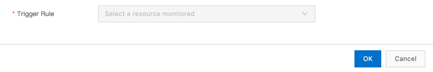
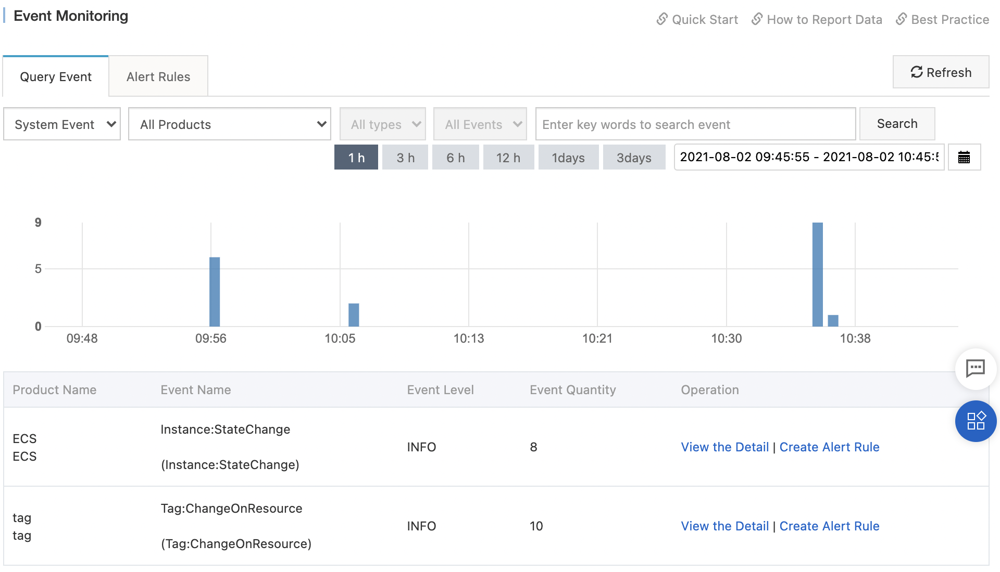

# Auto Scaling 

Auto Scaling is a service that allows to automatically adjust the number
of ECS instances according to the needs and rules. These ECS instances
are grouped in Scaling Groups.

A Scaling Group is therefore a group of ECS instances that are
dynamically scaled according to scaling rules and the minimum or maximum
number of ECS instances. These instances can be configured either by a
Scaling Configuration, defined in the Auto Scaling console, or by a
Launch Template, defined in the ECS console.

Scaling rules can be executed in three ways: manually, by a scheduled
task or by an event-triggered task.

A scheduled task allows to execute a specified scaling rule at a
specified time. An event-triggered task allows to adjust the number of
instances in a Scaling Group when a particular event occurs.

The Scaling Group uses a Health Check to ensure that there are the
correct number of healthy ECS instances in the group.

Scaling activities are then triggered when a scaling rule is triggered
or when an ECS instance is added or deleted manually.

ECS instances can however be added or removed manually from a Scaling
Group. The rules applied are different from those used for instances
added or removed automatically. ECS instances can be put in a standby
state (StandBy) or in a state that prevents their automatic removal from
the Scaling Group (Protected).

The cooldown period ensures that Auto Scaling will not perform new
scaling activities following a scaling activity for a certain period of
time.

It is possible to perform scaling in parallel using the Expected Number
of Instances feature.

Lifecycle hooks are used to trigger actions based on events related to
the lifecycle of Scaling Groups. This typically allows to install
software or to configure the ECS instance.

Due to resource shortages, it can happen that the ECS instances are not
evenly distributed in the zones. It is then possible to rebalance the
distribution of the ECS instances.

A SLB instance can be associated with a Scaling Group to distribute
traffic to the ECS instances of the Scaling Group. RDS instances can
also be associated to automate the update of the white list when adding
or removing ECS instances.

Auto Scaling performs monitoring of scaling events and you can view the
logs. Event notifications can be sent to CloudMonitor or MNS (Message
Service) when monitoring scaling activities.

## The Scaling Group 

### The cooldown period 

The cooldown period is the period during which Auto Scaling cannot
execute new scaling activities following a scaling activity. Thus,
scaling activities triggered by event-driven tasks are rejected.
However, manual operations and scheduled tasks are applied. The cooldown
period starts after the last ECS instance is added or removed from the
group.

The cooldown period can be changed in the Scaling Group or from a
scaling rule. The value defined in the rule has priority.

### Expected number of instances 

The Expected Number of Instances feature of the Scaling Group allows to
perform scaling in parallel. This removes some limitations. This feature
can only be activated when creating the Scaling Group.

### Create a Scaling Group 

To create a Scaling Group:

-   Go to the Auto Scaling console,

-   Click on Scaling Groups,

-   Select a region,

-   Click on Create,

-   Scaling Group Name: this is the name of the group,

-   Instance Configuration Source: this is the configuration source of
    the group; supported values are:

```{=html}
<!-- -->
```
-   Launch Templates: uses a Launch Template to create the ECS
    instances; you have to select a Launch Template,

-   Select Existing Instance: uses the configurations of an existing ECS
    instance as a template to create ECS instances; you must then select
    an ECS instance (Add Existing Instance),

-   Create from Scratch: does not use any template; the created Scaling
    Group will be in a disabled state,

```{=html}
<!-- -->
```
-   Tag: these are the tags associated with Scaling Group,

These tags are associated to the Scaling Groups. Other tags can be
associated to instances.

-   Instance Removing Policy: this is the policy used to filter and
    remove ECS instances; the value of the Filter First and Then Remove
    from Results fields must be different:

```{=html}
<!-- -->
```
-   Earliest Instance Created Using Scaling Configuration (only for
    Filter First): filters the instances created based on the earliest
    Scaling Configuration and Launch Template,

-   Earliest Created Instance: filters the instances created as soon as
    possible,

-   Most Recent Created Instance: filters the most recently created
    instances,

-   \- No Policy - (only for Then Remove from Results): Auto Scaling
    does not filter instances based on Then Remove from Results,

If more than one ECS instance meets the conditions, one is randomly
removed.

-   Suspended Processes: suspends certain processes depending on the
    operation:

```{=html}
<!-- -->
```
-   Scale-out: rejects all scale-out requests,

-   Scale-in: rejects all scale-in requests,

-   Health Check: suspends the Health Check and does not remove
    unhealthy ECS instances,

-   Scheduled Task: at the end of the task execution time, does not
    trigger the scaling rules associated with the task,

-   Event-triggered Task: when an alert associated with a task is
    triggered by an event, does not trigger the scaling rules associated
    with the task,

```{=html}
<!-- -->
```
-   Enable Deletion Protection for Scaling Group: prevents the Scaling
    Group from being deleted in the console or with the API,

-   Health Check for Instances: regularly checks the status of ECS
    instances,

If an ECS instance is not in the Running state, it is removed from the
Scaling Group.

-   Minimum Number of Instances: automatically adds ECS instances to the
    Scaling Group if the number of instances is lower than the minimum
    number,

-   Maximum Number of Instances: automatically removes ECS instances
    from the Scaling Group if the number of instances exceeds the
    maximum number,

-   Expected Number of Instances: this is the expected number of
    instances,

-   Default Cooldown Time (Seconds): this is the cooldown time,

-   Network Type: this is the type of network,

The instances must have the same network type as the Scaling Group.

-   Scaling Policy (if Network Type is VPC only): this is the scaling
    policy for multi-zone; supported values are:

```{=html}
<!-- -->
```
-   Priority Policy: creates instances with priority in the region where
    the vSwitch with the highest priority is located,

-   Balanced Distribution Policy: distributes ECS instances evenly
    across the zones where vSwitches reside,

Balanced Distribution Policy is for cases where the Scaling Group is
associated with multiple vSwitches spread across more than two zones. If
the ECS instances are not evenly distributed between zones, use the
Rebalance Distribution feature to evenly distribute them.

-   Cost Optimization Policy: creates ECS instances according to the
    unit prices of the vCPUs in ascending order,

Only applies in cases where several instance types are specified in the
Scaling Configuration.

-   Instance Reclaim Mode (for VPC network type only): this is the
    recovery mode:

```{=html}
<!-- -->
```
-   Release Mode: during a scale-in event, automatically releases the
    specified number of ECS instances; during a scale-out event,
    automatically creates the specified number of ECS instances,

-   Shutdown and Reclaim Mode: improves scaling efficiency,

During a scale-in, the status of the deleted ECS instances becomes No
Fees for Stopped Instances (VPC-Connected). You are no longer charged
for vCPU, memory and public IP addresses but you are charged for disks
and EIPs. During a scale-out, the instances that were previously stopped
are used first.

-   VPC (if Network Type is VPC only): this is the VPC used,

-   Select VSwitch (if Network Type is VPC only): this is the vSwitch
    used,

To deploy ECS instances across multiple zones, you must specify multiple
vSwitches located in different zones.

-   Add Existing Instance: ECS instances can be added manually to a
    Scaling Group, except if Instance Configuration Source is set to
    Create from Scratch,

If Expected Number of Instances is specified and there are instances,
its value increases automatically.

Normally instances are not released when they are removed from the
Scaling Group. But if Enable the scaling group to manage the instance
lifecycle is selected, the instances are released when they are manually
removed from the Scaling Group or automatically when they are unhealthy.

-   Associate CLB Instance: select a CLB instance and edit the server
    groups that allow to process the received requests,

-   Associate ALB Server Group: this is the group of servers that allow
    to distribute the requests to the backend servers,

-   Associate RDS Instance: associate ApsaraDB RDS instances to the
    Scaling Group,

The internal IP addresses of the ECS instances added to the Scaling
Group are automatically added to the white lists of the RDS instances.

-   Click on OK.

{width="4.3140365266841645in"
height="2.768173665791776in"}

{width="4.316070647419073in"
height="2.352703412073491in"}

{width="4.31420384951881in"
height="2.286055336832896in"}

{width="4.312268153980752in"
height="1.9720570866141733in"}

### View information about a Scaling Group 

To view information about a Scaling Group:

-   Go to the Auto Scaling console,

-   Click on Scaling Groups,

-   Select a region,

-   Click on Details on the line of the group.

### Modify a Scaling Group 

To modify a Scaling Group:

-   Go to the Auto Scaling console,

-   Click on Scaling Groups,

-   Select a region,

-   Click on Edit on the line of the group,

-   Change the parameters,

-   Click on OK.

If the minimum or maximum number of instances is changed and the number
of instances falls outside this range, Auto Scaling automatically adds
or removes ECS instances to adjust.

### Activate or deactivate a Scaling Group 

To enable or disable a Scaling Group:

-   Go to the Auto Scaling console,

-   Click on Scaling Groups,

-   Select a region,

-   Click on \... \| Enable or on \... \| Disable on the line of the
    group.

### Delete a Scaling Group 

In order to delete a Scaling Group, the Scaling Group deletion
protection must be disabled. Deleting a Scaling Group will delete its
configurations and scaling rules.

If any ECS instances are in the Running state, they are stopped. The
manually added instances are then deleted and the automatically added
instances are released.

To delete a Scaling Group:

-   Go to the Auto Scaling console,

-   Click on Scaling Groups,

-   Select a region,

-   Click on Delete on the line of the group,

-   Click on OK.

### Change the deletion protection status of a Scaling Group 

The Scaling Group Deletion Protection prevents the Scaling Group from
being deleted from the Auto Scaling console or with the API.

To change the deletion protection status of a Scaling Group:

-   Go to the Auto Scaling console,

-   Click on Scaling Groups,

-   Select a region,

-   Click on \... \| Set Deletion Protection on the line of the group,

-   To activate the protection, activate Deletion Protection,

-   To disable it, turn off Deletion Protection,

-   Click on OK.

### Suspend and resume a scaling process 

It is possible to suspend a number of processes (scaling-in,
scaling-out, Health Check, scheduled task and event-driven task). After
resumption, the process takes into account the changes that took place
during the suspension. This allows for better control of a Scaling
Group.

To suspend or resume a scaling process:

-   Go to the Auto Scaling console,

-   Click on Scaling Groups,

-   Select a region,

-   Click on Edit on the line of the group,

-   To suspend a process, select the process to suspend in the Suspended
    Processes section,

-   To resume a process, remove it,

-   Click on OK.

## The Scaling rules 

A scaling rule is used to trigger a scaling activity or to set the
minimum and maximum number of ECS instances in a scaling group.

### Create a scaling rule 

Alibaba Cloud offers several types of scaling rules:

-   simple scaling rule,

-   scaling rule for target tracking,

-   predictive scaling rule,

-   step-by-step scaling rule.

A simple scaling rule allows to increase or decrease the number of ECS
instances in a Scaling Group according to a specified number.

A target tracking scaling rule automatically calculates the number of
ECS instances needed to keep a Cloud Monitor metric close to the target
value. It then triggers the necessary ECS instance scaling activities.

A predictive scaling rule defines the minimum and maximum number of ECS
instances by using Machine Learning to analyze the monitoring data
history of the Scaling Group to predict the values of the specified
metrics.

A step scaling rule allows to define for each step a scaling rule
triggered by event. Each rule defines a scaling policy.

We will only see here how to create a simple scaling rule:

-   Go to the Auto Scaling console,

-   Click on the group ID,

-   Click on the Scaling Rules and Activities tab,

-   Click on Create Scaling Rule,

-   Rule Name: this is the name of the rule,

-   Rule Type: this is the type of rule; select Simple Scaling Rule,

-   Start Time: these are the conditions for the execution of the task,

-   Operation: this is the operation to be performed:

```{=html}
<!-- -->
```
-   goes to *n* instances,

-   adds *n* instances,

-   adds *n%* of the instances,

-   deletes *n* instances,

-   deletes *n%* of the instances,

```{=html}
<!-- -->
```
-   Instance Warmup Time (optional): this is the cooling period (in
    seconds),

-   Click on OK.

{width="4.5in"
height="2.540277777777778in"}

### Modify a scaling rule 

To modify a scaling rule:

-   Go to the Auto Scaling console,

-   Click on Scaling Groups,

-   Select a region,

-   Click on Details on the line of the group,

-   Click on the Scaling Rules and Activities tab,

-   Click on Edit on the line of the rule,

-   Click on OK.

### Delete a scaling rule 

To delete a scaling rule:

-   Go to the Auto Scaling console,

-   Click on Scaling Groups,

-   Select a region,

-   Click on Details on the line of the group,

-   Click on the Scaling Rules and Activities tab,

-   Click on Delete on the rule line,

-   Click on OK.

### Run a scaling rule 

If no scaling activity is in progress, it is possible to scale the ECS
instances temporarily.

To perform a scaling manually:

-   Go to the Auto Scaling console,

-   Click on Scaling Groups,

-   Select a region,

-   Click on Details on the line of the group,

-   Click on the Scaling Rules and Activities tab,

-   Click on the link in the Start Time column on the rule line.

It is also possible to run a scaling rule automatically at a specified
time or when an event occurs.

## The hooks

The hooks on the life cycle of the Scaling Groups allow to trigger an
action when an event related to the life cycle occurs. For example, they
allow ECS instances to be put in Pending state when a scaling activity
is triggered in order to perform operations. This typically allows
installing software or configuring the ECS instance.

When a hook is triggered, it is possible to send a notification to MNS.

### Create a life cycle hook on a Scaling Group 

To create a life cycle hook on a Scaling Group:

-   Go to the Auto Scaling console,

-   Click on Scaling Groups,

-   Select a region,

-   Click on Details on the line of the group,

-   Click on the Lifecycle Hook tab,

-   Click on Create Lifecycle Hook,

-   Name: this is the name of the hook,

-   Applicable Scaling Activity Type: this is the type of scaling
    activity that triggers the hook; supported values are:

```{=html}
<!-- -->
```
-   Scale-in Event,

-   Scale-out Event,

```{=html}
<!-- -->
```
-   Timeout Period: this is the timeout period (from 30 to 21600
    seconds),

The ECS instance remains in Pending state during this time.

-   Execution Policy: this is the action performed once the timeout has
    completed the hook; supported values are:

```{=html}
<!-- -->
```
-   Continue: executes the event,

-   Reject: releases the created ECS instance (in case of a scale-out
    event) or removes the ECS instance (in case of a scale-in event),

```{=html}
<!-- -->
```
-   Notification Method: sends a notification when the hook is
    triggered; supported values are:

```{=html}
<!-- -->
```
-   No Notification (default): no notification,

-   MNS Topic: sends a notification to an MNS topic,

-   MNS Queue: sends a notification to the MNS queue,

-   OOS Template: sends a notification to the OOS (Operation
    Orchestration Service),

```{=html}
<!-- -->
```
-   Click on OK.

{width="4.5in"
height="2.7979166666666666in"}

### Modify a hook 

To modify a hook:

-   Go to the Auto Scaling console,

-   Click on Scaling Groups,

-   Select a region,

-   Click on Details on the line of the group,

-   Click on the Lifecycle Hook tab,

-   Click on Modify on the hook line,

-   Change the parameters,

-   Click on OK.

The name of the hook cannot be changed.

### Delete a hook 

To delete a hook:

-   Go to the Auto Scaling console,

-   Click on Scaling Groups,

-   Select a region,

-   Click on Details on the line of the group,

-   Click on the Lifecycle Hook tab,

-   Click on Delete on the line of the hook,

-   Click on OK.

## The configuration of the instances 

The possible configuration sources for the ECS instances of the Scaling
Groups are the Scaling Configurations and the Launch templates.

The Launch Template is a feature of ECS and must be created from the ECS
console.

### Create a Scaling Configuration 

With the Scaling Configuration, you define the configuration of the ECS
instance as when it was created except that it is not created. It will
be used as a template when Auto Scaling creates an ECS instance.

To create a Scaling Configuration:

-   Go to the Auto Scaling console,

-   Select a region,

-   Click on Details on the line of the group,

-   Click on the Instance Configuration Source tab,

-   Click on the Scaling Configurations tab,

-   Click on Create Scaling Configuration,

-   Billing Method: this is the billing method; the supported values
    are:

```{=html}
<!-- -->
```
-   Pay-As-You-Go,

-   Preemptible Instance,

The price of the Preemptible Instance fluctuates according to the
evolution of supply and demand. The advantage is their price but the
disadvantage is that they can be claimed.

-   Instance Type: this is the type of instance,

Several instance types can be selected. Thus, if one instance type is
not available, another is used.

Moreover, it is possible to define weights for each type of instance
according to its performance.

-   Image: this is the image used to create the instance,

-   Storage: this is the storage; it can be a system disk or data disks,

-   Public IP Address: this is the assigned IPv4 address,

-   Security Group: this is the security group.

-   Click on Next: System Configurations,

-   Tags: these are the tags,

-   Logon Credentials: these are the login credentials,

For Linux, you can either specify a SSH key pair or specify this
information after creation. For Windows, this information can only be
specified after creation.

-   Instance Name: this is the name of the instance,

-   Host: this is the host name,

-   Click on Show next to Advanced (based on instance RAM roles or
    cloud-init),

-   RAM Role: these are the RAM roles attached to the instances,

Temporary Security Token Service (STS) tokens can be used for API calls.
The use of STS tokens increases the security of the AccessKey pair and
provides a finer granularity of authorization management.

-   User Data: this is the code that allows to customize the ECS
    instance at boot time,

-   Click on Next: Preview,

-   Scaling Configuration Name: this is the name of the Scaling
    Configuration,

-   Click on Create,

-   Click on Enable Configuration.

### Modify a Scaling Configuration 

After modifying a Scaling Configuration, the ECS instances already
created are not modified.

To modify a Scaling Configuration:

-   Go to the Auto Scaling console,

-   Click on Scaling Groups,

-   Select a region,

-   Click on Details on the line of the group,

-   Click on the Instance Configuration Source tab,

-   Click on the Scaling Configurations tab,

-   Click on Edit on the configuration line,

-   Configure the Billing Method, Instance Type, Image, Storage, Public
    IP Address and Security Group settings,

-   Click on Next: System Configurations,

-   Configure the Tags, Logon Credentials, Instance Name and RAM Role
    parameters,

-   Click on Next: Preview,

-   Enter the name of the Scaling Configuration,

-   Click on Modify.

### Delete a Scaling Configuration 

To delete a Scaling Configuration:

-   Go to the Auto Scaling console,

-   Select a region,

-   Click on Details on the line of the group,

-   Click on the Instance Configuration Source tab,

-   Click on the Scaling Configurations tab,

-   Click on Delete on the configuration line,

-   Click on OK.

### Apply a Scaling Configuration 

Only one Scaling Configuration can be in active state in a Scaling
Group. If you apply a Scaling Configuration, the previous one goes to
the inactive state.

To apply a Scaling Configuration:

-   Go to the Auto Scaling console,

-   Select a region,

-   Click on Details on the line of the group,

-   Click on the Instance Configuration Source tab,

-   Click on the Scaling Configurations tab,

-   Click on Apply on the configuration line,

-   Click on OK.

## The tasks 

There are several types of tasks:

-   scheduled tasks,

-   tasks triggered by an event.

Here we will study how to manage each of these types of tasks.

### Scheduled tasks 

A scheduled task allows to execute a specified scaling rule at a
specified time. They are very useful to create instances before peaks of
activity and release them afterwards.

To create a scheduled task:

-   Go to the Auto Scaling console,

-   Click on Scaling Tasks \| Scheduled Tasks,

-   Select a region,

-   Click on Create Scheduled Task,

-   Task Name: this is the name of the task,

-   Description: this is the description,

-   Executed At: this is the time of execution of the scheduled task,

-   Scaling Group: this is the associated Scaling Group,

-   Scaling Method: this is the scaling method used:

```{=html}
<!-- -->
```
-   Select Existing Scaling Rule: this is the scaling rule that will be
    executed,

-   Configure Number of Instances in Scaling Group: this is the minimum,
    maximum and expected number of instances in the Scaling Group,

```{=html}
<!-- -->
```
-   Retry Interval (Seconds): this is the time at which retries expire
    (from 0 to 21600 seconds),

If a scaling activity fails, it is executed again within this time
frame.

-   Recurrence: this is the recurrence period: the task can be performed
    repeatedly every day, every week or every month,

-   Click on OK.

{width="3.731395450568679in"
height="2.8284897200349954in"}

The periods are expressed in cron format with the time zone UTC+0. For
China, you have to add 8 hours. Sunday corresponds to the day of the
week 7.

To edit a scheduled task:

-   Go to the Auto Scaling console,

-   Click on Scaling Tasks \| Scheduled Tasks,

-   Select a region,

-   Click on Edit on the line of the task,

-   Change the parameters,

-   Click on OK.

To delete a scheduled task:

-   Go to the Auto Scaling console,

-   Click on Scaling Tasks \| Scheduled Tasks,

-   Select a region,

-   Click on Delete on the line of the task,

-   Click on OK.

To activate or deactivate a task:

-   Go to the Auto Scaling console,

-   Click on Scaling Tasks \| Scheduled Tasks,

-   Select a region,

-   Click Enable or Disable on the line of the task,

-   Click on OK.

### Tasks triggered by an event 

Event-triggered tasks allow to adjust the number of instances in a
Scaling Group when a particular event occurs. They are very useful when
traffic is not predictable.

The event is triggered by CloudMonitor when a specified alarm is
triggered. It can be an event triggered by the system monitoring or a
custom event.

For system monitoring events, Auto Scaling installs the CloudMonitor
agent on the Scaling Group instances. However, it is necessary to
activate New purchase ECS automatically installs cloud monitoring in the
CloudMonitor console.

Custom monitoring events are based on custom metrics. They must
therefore be defined in CloudMonitor. These metrics can be sent via API
or SDK. It is recommended to create a group of applications in
CloudMonitor and to send these metrics to this group.

To create a monitoring task:

-   Go to the Auto Scaling console,

-   Click on Scaling Tasks \| Event-triggered Tasks,

-   Select a region,

-   Click on Create Event-triggered Task,

-   Name: this is the name of the task,

-   Description: this is the description,

-   Resource Monitored: this is the Scaling Group to watch,

-   Monitoring Type: this is the type of monitoring:

```{=html}
<!-- -->
```
-   System Monitoring: this is monitoring based on the predefined
    metrics of CloudMonitoring,

-   Custom Monitoring: this is the custom monitoring; you must select
    the application group, the metric and the dimension, defined in
    CloudMonitor,

```{=html}
<!-- -->
```
-   Reference Period: this is the reference period (1, 5 or 15 minutes),

The shorter the period, the more frequently alerts are triggered.

-   Condition: this is the trigger condition: select a function
    (Average, Max or Min), an operator and a threshold (example: the
    average CPU usage of the ECS instances in the Scaling Group exceeds
    80%),

-   Triggered After: this is the number of times the condition is met
    before the alert is triggered (1, 2, 3 or 5 times),

-   Effective Period: this is the effective period of the task,

-   Trigger Rule: this is the triggered rule,

-   Click on OK.

{width="3.962623578302712in"
height="2.829484908136483in"}

{width="4.5in" height="0.7534722222222222in"}

To display a monitoring task:

-   Go to the Auto Scaling console,

-   Click on Scaling Tasks \| Event-triggered Tasks,

-   Select a region,

-   For a system monitoring task, click on the System Monitoring tab,

-   For a custom monitoring task, click on the Custom Monitoring tab,

-   Click on the task ID.

To edit or delete a monitoring system task:

-   Go to the Auto Scaling console,

-   Click on Scaling Tasks \| Event-triggered Tasks,

-   Select a region,

-   Click on the System Monitoring tab,

For a custom monitoring task, click on the Custom Monitoring tab.

-   Click on Edit Event-triggered Task on the task line,

-   Change the parameters.

-   Click on OK.

Only the monitored resource and the type of monitoring cannot be
changed.

When creating a task, you can specify only one triggered rule and it
must belong to the same Scaling Group. However, you can later add
several others and from any Scaling Group in the same region.

To activate or deactivate a task:

-   Go to the Auto Scaling console,

-   Click on Scaling Tasks \| Event-Triggered Tasks,

-   Select a region,

-   For a system monitoring task, click on the System Monitoring tab,

-   For a custom monitoring task, click on the Custom Monitoring tab,

-   Click Enable or Disable on the task line,

-   Click on OK.

To change the triggered rules:

-   Go to the Auto Scaling console,

-   Click on Scaling Tasks \| Event-Triggered tasks,

-   Select a region,

-   For a system monitoring task, click on the System Monitoring tab,

-   For a custom monitoring task, click on the Custom Monitoring tab,

-   Click on Edit Trigger Rule on the task line,

-   To add a rule, click on Add Rules,

-   To delete a rule, click Delete on the rule line,

-   Add or delete rules,

-   Click on OK.

## The management of the instances 

There are a number of ways to manage instances:

-   Scaling Groups,

-   the Health Check,

-   manual addition, removal and deletion of an instance in a Scaling
    Group,

-   StandBy, Protected and Stopped states,

-   rebalancing the distribution of ECS instances,

-   the association of an SLB instance with a Scaling Group.

### The life cycle of ECS instances in a Scaling Group 

Auto Scaling constantly checks if the ECS instances are healthy. It
removes or releases unhealthy ones.

For automatically created ECS instances:

-   During a scale-out, Auto Scaling automatically creates ECS
    instances.

-   During a scale-in, it stops them and releases them.

For ECS instances created manually and then added to a Scaling Group:

-   If the Scaling Group is configured to manage the lifecycle of ECS
    instances, the instances are stopped and released during a scaling
    event.

-   Otherwise, they are removed from the Scaling Group but not released.

When an ECS instance is removed from a Scaling Group, its internal IP
address is not automatically removed from the whitelist of the RDS
instance attached to the Scaling Group.

In addition, during scaling operations, some operations may be
interrupted.

A subscription instance can be added manually to a Scaling Group. But
the latter cannot manage its life cycle.

When adding or removing an instance from a Scaling Group, the instances
can go through the following service states:

-   Pending: the ECS instance is being added to a Scaling Group,

-   Adding:Wait: the ECS instance is in a waiting state while a
    lifecycle hook is running,

-   InService: the ECS instance is working normally,

-   Standby: the ECS instance is out of service; its life cycle must be
    managed manually,

-   Protected: the ECS instance works normally but Auto Scaling does not
    manage its life cycle; it must be managed manually,

-   Stopped: the ECS instance is stopped,

Once stopped, the ECS instance is no longer charged but you are charged
for disks and EIPs. To stop an ECS instance in a Scaling Group, Instance
reclaim mode must be set to Shutdown and Reclaim Mode.

-   Removing: the ECS instance is being removed from the Scaling Group,

-   Removing:Wait: the instance is waiting for the scale-in event of the
    hook to finish.

### The Health Check instance 

When the Health Check is activated, Auto Scaling manages the life cycle
of the ECS instances in the Scaling Group. If it detects an instance in
a state other than Running, it is considered unhealthy.

-   If the Scaling Group manages the lifecycle of ECS instances, Auto
    Scaling deletes and releases instances created automatically by Auto
    Scaling or added manually.

-   If the Scaling Group does not manage the life cycle of ECS
    instances, Auto Scaling removes the instances manually added to the
    Scaling Group without releasing them.

### Display ECS instances 

To display ECS instances:

-   Go to the Auto Scaling console,

-   Click on Scaling Groups,

-   Select a region,

-   Click on Details on the line of the group,

-   Click on the Instances tab.

The Auto Created tab displays the ECS instances that are automatically
created by Auto Scaling and the Manually Added tab displays the
instances that are manually added to the Scaling Group.

### Manually add an ECS instance to a Scaling Group 

In order to manually add an ECS instance to a Scaling Group, the
instance must be in Running state, be in the same region as the Scaling
Group and have the same network type as the Scaling Group. Moreover, the
Scaling Group must be in Enabled state and not have any scaling activity
in progress.

To manually add an ECS instance to a Scaling Group:

-   Go to the Auto Scaling console,

-   Click on Scaling Groups,

-   Select a region,

-   Click on Details on the line of the group,

-   Click on the Instances tab,

{width="4.5in"
height="1.7534722222222223in"}

-   Click on the Manually Added tab,

-   Click on Add Existing Instance,

-   Select the ECS instances by clicking on Add.

{width="4.5in" height="0.7458333333333333in"}

If Enable the scaling group to manage the instance lifecycle has been
activated, ECS instances that have been manually added to the Scaling
Group will be removed and released during a scale-in event.

### Manually remove and delete an ECS instance 

To be able to manually remove and delete an instance, the Scaling Group
must be in Enabled state and no scaling activity must be in progress.

It is possible to manually delete an ECS instance in a Scaling Group
without having to wait for the cooldown period. However, it is not
possible to delete an instance manually if the number of ECS instances
falls below the minimum number after deletion.

To manually remove and delete an ECS instance:

-   Go to the Auto Scaling console,

-   Click on Scaling Groups,

-   Select a region,

-   Click on Details on the lie of the group,

-   Click on the Instances tab,

-   To select an automatically created ECS instance, click on the Auto
    Created tab,

-   To select a manually added ECS instance, click on the Manually Added
    tab,

-   Click on Remove from Scaling Group on the line of the instance,

-   Click on Delete Instance on the line of the instance,

-   Configure the automatic dissociation of the ECS instance from the
    SLB and RDS instances,

-   Click on OK.

### Place or remove an ECS instance from the Standby state 

An ECS instance that is not needed can be put in a Standby state. It is
then no longer used by the Auto Scaling: its Health Check will be
ignored. If the Scaling Group is deleted, this ECS instance is
automatically removed from the Standby state and released.

To place an ECS instance in the Standby state:

-   Go to the Auto Scaling console,

-   Click on Scaling Groups,

-   Select a region,

-   Click Manage on the line of the group,

-   Click on ECS Instances,

-   To select an automatically created ECS instance, click on the Auto
    Created tab,

-   To select a manually added ECS instance, click on the Manually Added
    tab,

-   To put the instance in Standby state, click on Switch to Standby on
    the ilne of the instance,

-   To remove the instance from the Standby state, click on Remove from
    Standby on the line of the instance,

-   Click on OK.

### Place or remove an instance from the Protected state 

An ECS instance in Protected state prevents it from being automatically
removed from a Scaling Group. However, it is no longer used by the Auto
Scaling: its Health Check is ignored.

To release the ECS instance, you must remove it from the Protected state
and then remove it from the Scaling Group.

To place or remove an instance from the Protected state:

-   Go to the Auto Scaling console,

-   Click on Scaling Groups,

-   Select a region,

-   Click Manage on the line of the group,

-   Click on ECS Instances,

-   To select an automatically created ECS instance, click on the Auto
    Created tab,

-   To select a manually added ECS instance, click on the Manually Added
    tab,

-   To put the instance in Protected state, click on Switch to Protected
    on the line of the instance,

-   To remove the instance from the Protected state, click on Remove
    from Protected on the line of the instance,

-   Click on OK.

### Putting an ECS instance in the Stopped state 

If the Instance Reclaim Mode of the instances of a Scaling Group is set
to Shutdown and Reclaim Mode, the ECS instance can be manually placed in
the Stopped state. Auto Scaling will preferably start those instances
that are in the Stopped state.

However, there are two conditions to this:

-   The ECS instance must have been created automatically.

-   The network type of the Scaling Group must be VPC.

The ECS instance is no longer charged: activating No Fees for Stopped
Instances (VPC-Connected) is therefore not necessary. However, disks and
EIPs are still charged.

To place an ECS instance in the Stopped state:

-   Go to the Auto Scaling console,

-   Click on Scaling Groups,

-   Select a region,

-   Click on Details on the line of the group,

-   Click on the Instances tab,

-   Click on the Auto Created tab,

-   Click on Switch to Stopped on the ECS instance line,

-   Click on OK.

### Rebalance the distribution of ECS instances 

Due to resource shortages, it may happen that ECS instances are not
evenly distributed in the zones. In this case you can rebalance their
distribution:

-   Go to the Auto Scaling console,

-   Select a region,

-   Click on Details on the Scaling Group line,

-   Click on the Instances tab,

-   Click on the Auto Created tab,

-   Click on Rebalance Distribution,

-   Click on Confirm Execution.

The message The rebalancing task has been assigned is then displayed at
the top right of the page.

Prerequisites are:

-   The Scaling Group must be associated with several vSwitches spread
    over at least two zones.

-   The Scaling Group\'s multi-zone scaling policy must be Balanced
    Distribution Policy.

-   The network type of the Scaling Group must be VPC.

### Associate an SLB instance with a Scaling Group 

A SLB instance can be associated with a Scaling Group to distribute
traffic to the ECS instances in the Scaling Group. If the network type
is VPC, the SLB instance and the Scaling Group must be in the same VPC;
if the network type is classic, they must be in the same region.

It is also necessary that at least one listener is configured on the SLB
instance and that the Health Check is activated on the SLB instance.

To associate an SLB instance with a Scaling Group:

-   Go to the Auto Scaling console,

-   Click on Scaling Groups,

-   Select a region,

-   Click on Edit on the line of the group,

-   Network Type: this is the type of network,

The network cannot be modified once the Scaling Group is created.

-   Associate CLB Instance: these are the SLB instances to associate
    with the Scaling Group as well as the backend server groups for the
    SLB instance,

-   Configure the other parameters.

{width="4.5in"
height="3.0493055555555557in"}

## Monitoring 

In order to monitor Scaling Group operations, you can set up
notifications.

### Scaling events 

When a scaling rule is executed or when an instance is manually added or
removed from a Scaling Group, a scaling activity is triggered.

When ECS instances are automatically added or deleted, the process is as
follows:

-   Health Check,

-   Execution of the scaling activity,

-   Creation of ECS instances.

-   Assigning IP addresses to ECS instances,

-   Adding ECS instances to the RDS instance whitelist,

-   Starting the ECS instances,

-   Addition of the ECS instances to the backend server group of the SLB
    instance.

When ECS instances are automatically removed from the Scaling Group
after a scaling rule is executed, the process is as follows:

-   Health Check,

-   Execution of the scaling activity,

-   Removal of the ECS instances from the SLB instance backend server
    group,

-   Stopping the ECS instances,

-   Removal of ECS instances from the RDS instance white list,

-   Releasing of ECS instances,

-   Changing the number of instances in the Scaling Group.

When instances are manually added to a Scaling Group, the process is as
follows:

-   Health Check,

-   Checking the status of the ECS instances,

-   Execution of the scaling activity,

-   Addition of ECS instances to the Scaling Group,

-   Changing the number of instances in the Scaling Group,

-   Adding ECS instances to the RDS instance whitelist,

-   Addition of the ECS instances to the backend server group of the SLB
    instance.

When instances are manually removed from a Scaling Group, the process is
as follows:

-   Health Check,

-   Execution of the scaling activity,

-   Stoping the transfer of traffic by the SLB instance to the ECS
    instances,

-   Waiting 60 seconds,

-   Removal of ECS instances from the SLB instance backend server group,

-   Removal of ECS instances from the RDS instance white list,

-   Modification of the number of instances of the Scaling Group,

-   Withdrawal of the ECS instances from the Scaling Group.

When a scaling activity fails to add ECS instances to a Scaling Group,
Auto Scaling does a rollback of these ECS instances but keeps the
scaling activity. However, these ECS instances are still billed until
they are released, either automatically or manually.

When a scaling activity fails to add all the expected instances, the
Scaling Group does not reach its expected capacity. In this case, you
can manually add existing ECS instances to the Scaling Group, manually
trigger a scaling rule, or use scheduled or event-driven tasks to add
instances.

To view the details of a scaling activity:

-   Go to the Auto Scaling console,

-   Click on Scaling Groups,

-   Select a region,

-   Click on Details on the line of the group,

-   Click on the Scaling Rules and Activities tab,

-   Click on the Scaling Activities tab,

-   Click on the ID of the scaling activity.

{width="4.5in" height="0.6722222222222223in"}

The status of a scaling activity can be Rejected, Executing, Successful,
Warning or Failed.

### Notifications 

Event notifications can be sent to CloudMonitor or MNS (Message Service)
when monitoring scaling activities.

CloudMonitor allows to display statistics on events. MNS allows
notification messages to be transferred between distributed components.
The queue model of MNS allows messages to be sent and received in a
point-to-point mode. Each message can only be consumed by one consumer.
The MNS topic model allows messages to be published and subscribed to
and notifications to one or more recipients.

### Create an event notification 

To create an event notification:

-   Go to the Auto Scaling console,

-   Click on Scaling Groups,

-   Select a region,

-   Click on Details on the line of the group,

-   Click on the Notifications tab,

-   Click on Create Event Notification,

{width="2.846398731408574in"
height="1.3955260279965005in"}

-   Notification Method: this is the notification method; the supported
    values are:

```{=html}
<!-- -->
```
-   CloudMonitor,

-   MNS Topic,

-   MNS Tail,

```{=html}
<!-- -->
```
-   Event Notification Type: this is the type of event notification;
    supported values are:

```{=html}
<!-- -->
```
-   Successful Scale-out Event: add all ECS instances,

-   Successful Scale-in Event: removal of all ECS instances,

-   Failed Scale-out Event: scale-out triggered without adding the ECS
    instances,

-   Failed Scale-in Event: scale-in triggered without removing the ECS
    instances,

-   Rejected Scaling Activity: scaling activity request received
    rejected,

-   Start of Scale-out Event: scale-out triggered and ECS instances
    added,

-   Start of Scale-in Event: triggered scale-in and removal of ECS
    instances,

-   Expiration of Scheduled Task: notifications sent daily for 7 days,

-   Partly Successful Scale-out Event: scale-out triggered with the
    addition of some ECS instances only,

-   Partly Successful Scale-in Event: triggered scale-in and removal of
    some ECS instances only,

```{=html}
<!-- -->
```
-   Click on OK.

### Display an event notification 

To view an event notification:

-   Go to the Auto Scaling console,

-   Click on Scaling Groups,

-   Select a region,

-   Click on Details on the line of the group,

-   Click on Notifications,

-   Click on the link in the Notification Method column of the event.

{width="4.5in" height="2.578472222222222in"}

To view an event notification from CloudMonitor:

-   Go to the CloudMonitor console,

-   Go to the Event Monitoring page,

-   Select System Event,

-   Select Auto Scaling.

{width="1.234332895888014in"
height="0.5464971566054243in"}

The system messages related to Auto Scaling are then displayed.

You can also select the MNS Topic notification method as below:

{width="3.1982010061242345in"
height="1.4762062554680664in"}

In this case, you can view the notifications in the MNS topics screen:

-   Go to the MNS console,

-   Go to the Topics page.

{width="4.5in" height="1.0569444444444445in"}

The Number of messages column of the topics shows the number of events.
To see the details of the messages, you have to subscribe with a client.

You can also select the type of notification for MNS queues:

{width="3.2407666229221346in"
height="1.4338396762904637in"}

In this case, you can view the notifications in the MNS Queues screen:

-   Go to the MNS console,

-   Go to the Tails page.

{width="4.5in"
height="1.0305555555555554in"}

The number in the Available Messages column shows the number of events.
To see the details of the messages, click More \| Send Messages \|
Receive Message on the row. The list of messages is then displayed in
the Receive Message section.

### Editing an event notification 

To edit an event notification:

-   Go to the Auto Scaling console,

-   Click on Scaling Groups,

-   Select a region,

-   Click on Details on the line of the group,

-   Click on the Notifications tab,

-   Click on Edit on the event line,

-   Change the parameters,

-   Click on OK.

It is not possible to change the notification method of an event
notification.

### Delete an event notification 

To delete an event notification:

-   Go to the Auto Scaling console,

-   Click on Scaling Groups,

-   Select a region,

-   Click on Details on the line of the group,

-   Click on the Notifications tab,

-   Click on Delete on the event line,

-   Click on OK.
