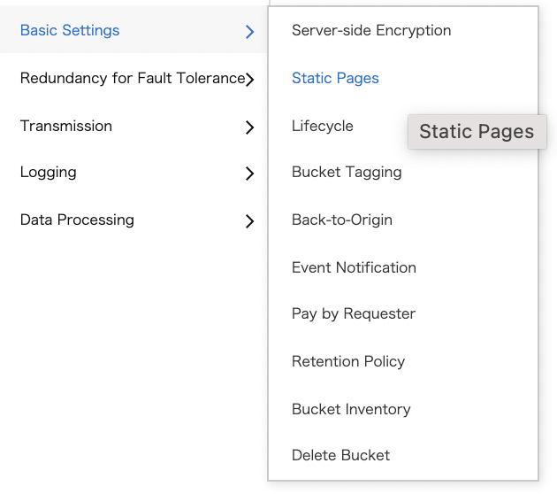

## Hosting of a static website on OSS and distribution via CDN 

In this third case study, we will host a website of static pages in an
OSS bucket and broadcast it via the CDN.

To do this, we need to follow the following steps:

-   Create a bucket configured for hosting static web pages,

-   Create a CDN instance,

-   Create a CNAME record to point to the CDN,

-   Free up resources.

First of all, create a local `index.html `file with the following
content:

`\<html\>

\<body\>

Hello world!

\</body\>

\</html\>

### `Create a bucket for hosting static web pages 

Creation of an `awebsite `bucket:

-   Go to the `OSS `console,

-   Click on `Buckets`,

-   Click on `Create Bucket`,

{width="4.5in"
height="0.5986111111111111in"}

-   Enter `awebsite `as bucket name,

-   Select `Germany (Frankfurt) `as region,

-   Click on `OK`,

{width="2.4812281277340333in"
height="3.0494597550306213in"}

-   Click on `Files`,

-   Click on `Upload`,

{width="4.5in" height="0.5958333333333333in"}

-   Click on `Select Files`,

-   Select the `index.html` file you created earlier,

-   Click on `Upload`,

{width="4.5in" height="1.836111111111111in"}

-   The status of the upload tasks is displayed,

{width="2.921668853893263in"
height="1.1217771216097987in"}

-   Close the window by clicking on the cross,

-   Click on `Files`,

{width="0.721405293088364in"
height="1.1070614610673666in"}

-   Check that the `index.html `file appears in the list of objects in
    the bucket,

{width="4.5in" height="0.5069444444444444in"}

-   Click on `Basic Settings \| Static Pages`,

{width="1.5239063867016622in"
height="1.3497451881014872in"}

-   Click on `Configure `in the `Static Pages `section,

{width="2.8556452318460193in"
height="0.809099956255468in"}

-   Enter `index.html `as the default home page,

-   Click on `Save`,

{width="3.5800207786526683in"
height="1.5159842519685038in"}

-   Return to the bucket page by clicking on `awebsite`,

{width="1.513008530183727in"
height="0.10981408573928259in"}

-   Click on `Access Control \| Access Control List (ACL)`,

{width="1.7976498250218722in"
height="0.7542913385826772in"}

-   In the `Access Control List (ACL) `section, click on
    `Configure`,

{width="1.59333552055993in"
height="0.518079615048119in"}

-   Click on `Public Read`,

{width="3.2248753280839897in"
height="0.8246325459317585in"}

-   Confirm the change by clicking on `Continue`,

{width="2.130398075240595in"
height="0.8606244531933508in"}

-   Click on `Save`,

-   The bucket is now in public reading: everyone can access it,

{width="2.871851487314086in"
height="0.7294860017497813in"}

-   In a web browser, go to
    `https://awebsite.oss-eu-central-1.aliyuncs.com/,`

-   The browser offers to download the resource,

{width="1.37376312335958in"
height="1.226634951881015in"}

-   Click on `Access Control`,

-   In the `Bucket Policy `section, click on `Configure`.

{width="2.6080008748906387in"
height="0.5851902887139108in"}

### Create a CDN instance 

To access static files hosted in OSS from a web browser, let\'s create a
CDN domain:

-   Go to the `Alibaba Cloud CDN `console,

-   Click on `Domain Names`,

-   Click on `Add Domain Name`,

{width="3.685235126859143in"
height="0.57667104111986in"}

-   Enter the domain name to be accelerated (`demo.XXX.cn`),

{width="2.700622265966754in"
height="0.4846948818897638in"}

-   Specify the type of business (`Image and Small File`),

-   Select `Global (Excluding Mainland China) `as region,

{width="2.813454724409449in"
height="1.1609842519685039in"}

-   In the `Origin Servers `section, click on `Add Origin Server`,

{width="3.1545570866141732in"
height="0.6932239720034996in"}

-   Select `OSS Domain `as origin,

-   Select `awebsite.oss-eu-central-1.aliyuncs.com `as the domain
    name,

-   Click on `OK`,

{width="2.1779997812773404in"
height="1.8660892388451444in"}

-   Click on `Next`,

-   Click on `Next `again,

-   Click on the `Domain Names `menu on the left to return to the list
    of domains in `Alibaba Cloud CDN`,

-   The list of domain names is displayed:

{width="4.5in" height="0.5534722222222223in"}

-   Copy the value of the domain name to be associated with the
    `CNAME:`

{width="1.0397998687664043in"
height="0.4031867891513561in"}

### Create a CNAME record to point to the CDN 

Let\'s configure Alibaba Cloud DNS to point `demo.XXX.cn `to the CDN
domain name we just created:

-   Go to the `Alibaba Cloud DNS `console,

-   Click on `Manage DNS`,

-   If you have not yet registered the domain name, click on `Add
    Domain Name `and follow the procedure,

-   If the domain name is already registered, click on the domain name,

{width="0.6032786526684164in"
height="0.4264555993000875in"}

-   Click on `Add Record`,

{width="4.5in" height="0.37569444444444444in"}

-   Select the `CNAME `record type,

-   Specify the domain name `demo.XXX.cn`,

-   Enter the previously copied DNS domain name (`demo.XXX.cn.
    w.kunlunsl.com`) as the value,

-   Click on `Confirm`,

In a web browser, go to `http://demo.XXX.cn/`. The message `Hello
world! `is displayed:

{width="0.4905041557305337in"
height="0.13713035870516185in"}

### Freeing up resources 

Let\'s delete the created resources:

-   Go to the `Alibaba Cloud DNS `console,

-   Click on `Manage `DNS,

-   Click on the domain name ID,

-   On the line of the `CNAME `record to be deleted, click on
    `Delete`,

{width="4.5in" height="0.4888888888888889in"}

-   Click on `OK`,

{width="1.4852744969378828in"
height="0.6084831583552056in"}

-   Go to the `Alibaba Cloud CDN `console,

-   Click on `Domain Names`,

{width="4.5in" height="0.6041666666666666in"}

-   On the line of the domain name, click on `\... \| Delete`,

{width="1.0296937882764654in"
height="0.590903324584427in"}

-   Click on `OK`.

{width="1.6839654418197725in"
height="0.48818569553805774in"}
