## Launching a web server on an ECS instance 

To launch a Web server on an ECS instance, we will proceed in several
steps:
-   Create a SSH key pair,
-   Create a VPC and a public VSwitch,
-   Create a EIP,
-   Create an ECS instance,
-   Associate the EIP with the ECS instance,
-   Check that everything is working properly,
-   Free up resources.

First of all, you have to select the region `Germany (Frankfurt)`.

### Create a SSH key pair 

Let's create a SSH key pair:
-   Go to the `ECS` console,
-   Go to the selected region,
-   Click on `Network & Security | SSH Key Pairs,`
-   Click on `Create SSH Key Pair`,

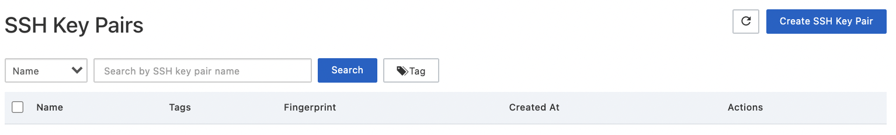{width="4.5in" height="0.6805555555555556in"}
-   Enter `demoECS` as the key pair name in the `SSH Key Pair Name`
    field,
-   Click on the `OK` button.

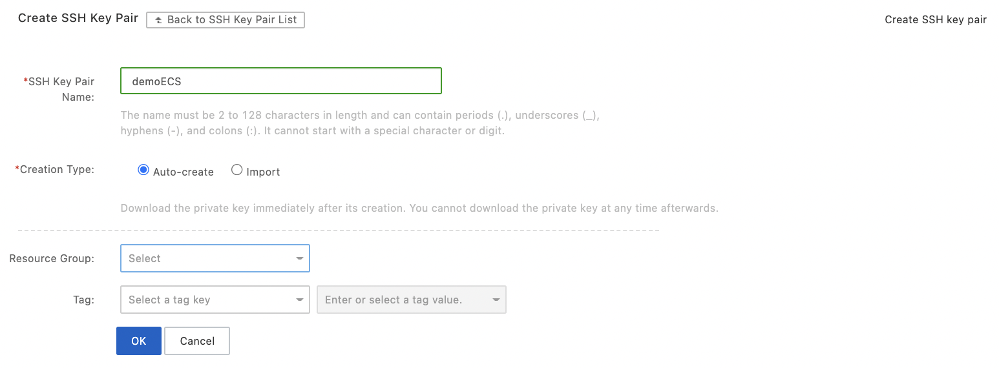{width="4.5in" height="1.6590277777777778in"}

The `demoECS.pem` file is automatically downloaded.

### Create a public VSwitch 

Let's create a public VSwitch:
-   Go to the `VPC` console,
-   Go to the selected region,
-   Click on `VPCs`,
-   Click on `Create VPC`,

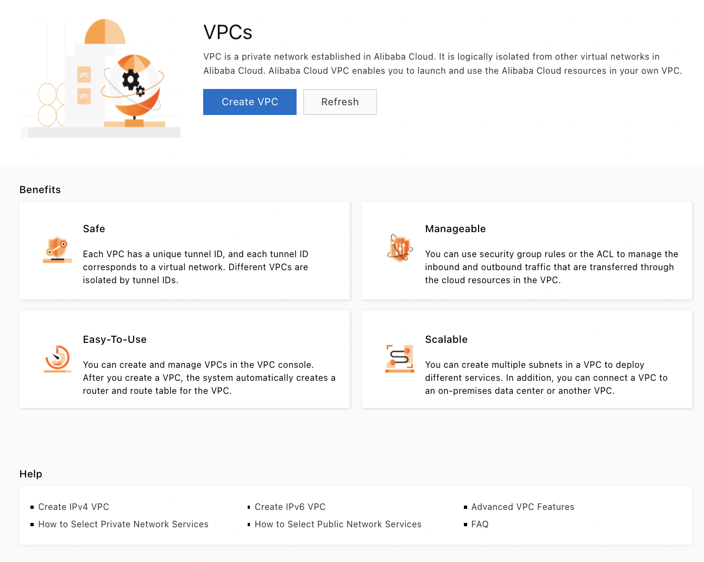{width="2.576353893263342in"
height="2.0594936570428697in"}
-   Enter the name of the VPC (`demoVPC`) and its CIDR
    (`10.0.0.0/16`).

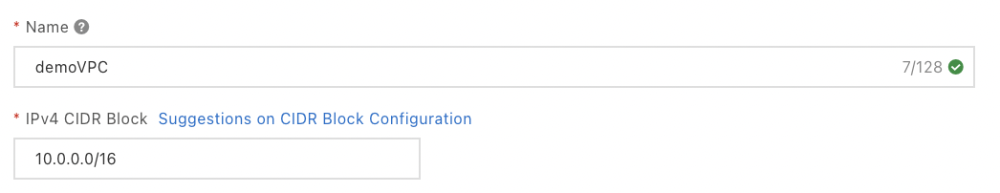{width="2.4900043744531932in"
height="0.4807097550306212in"}
-   Enter the name of the VSwitch (`demoVSwitch`), in the availability
    field (`Frankfurt A`) and with a subset of the CIDR of the VPC as
    CIDR (`10.0.0.0/24`),
-   Click on `OK`,

{width="4.5in" height="3.69375in"}

Let's check that both the VPC and the VSwitch have been created:
-   Go to the `VPC` console,
-   Go to the selected region,
-   Click on `VPCs`,

{width="4.5in"
height="0.9763888888888889in"}
-   The new VPC is well listed,
-   Click on `vSwitch`,

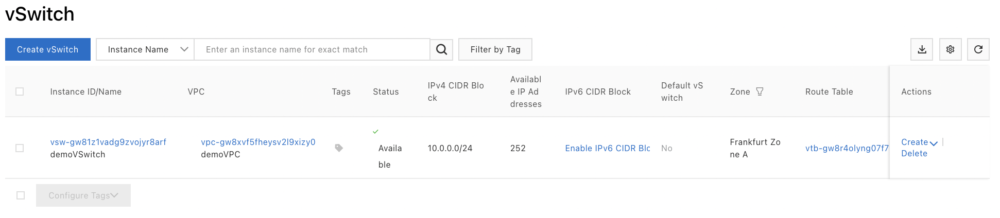{width="4.5in" height="0.9826388888888888in"}

The new VSwitch is well listed.

### Create an EIP 

Let's create a EIP with traffic billing:
-   Go to the `VPC` console,
-   Click on `Access to Internet | Elastic IP Addresses`,
-   Click on `Create EIP`,

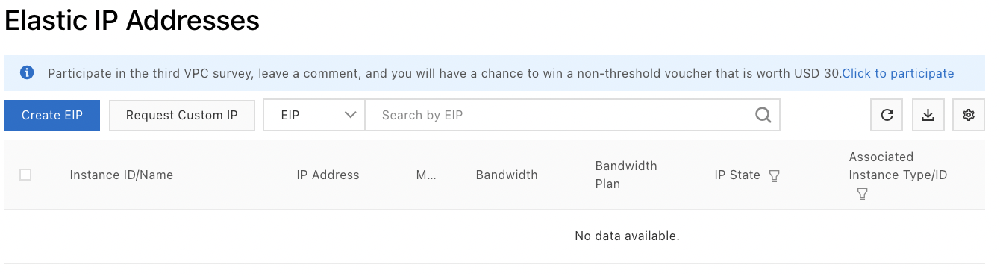{width="3.8741240157480314in"
height="1.069569116360455in"}
-   Check that the billing type is `Pay-As-You-Go`,

{width="1.6371314523184601in"
height="0.18897856517935258in"}
-   Select the region `Germany (Frankfurt)`,

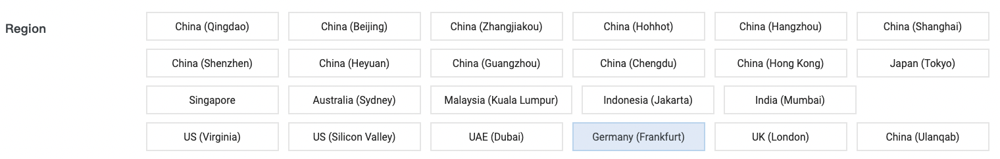{width="3.649232283464567in"
height="0.5811745406824147in"}
-   Enter the name of the EIP,

{width="1.4053346456692914in"
height="0.29842957130358705in"}
-   Click on `Buy Now`,

{width="0.5519739720034995in"
height="0.24414260717410324in"}
-   Check `I have read and agree to Elastic IP Agreement of Service`,
-   Click on `Activate Now`.

{width="0.6341699475065616in"
height="0.27825787401574803in"}

Let's check that the EIP has been created:
-   Go to the `VPC` console,
-   Click on `Access to Internet | Elastic IP Addresses`.

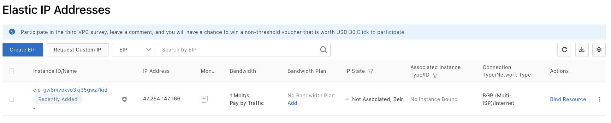{width="4.5in" height="0.9111111111111111in"}

The new EIP should appear in the list.

### Create an ECS instance 

Let's create an ECS instance running a Nginx web server:
-   Go to the `ECS` console,
-   Click on `Instances & Images | Instances,`
-   As there is no instance, Alibaba Cloud directly proposes to create a
    new instance: click on `Create ECS Instance`,

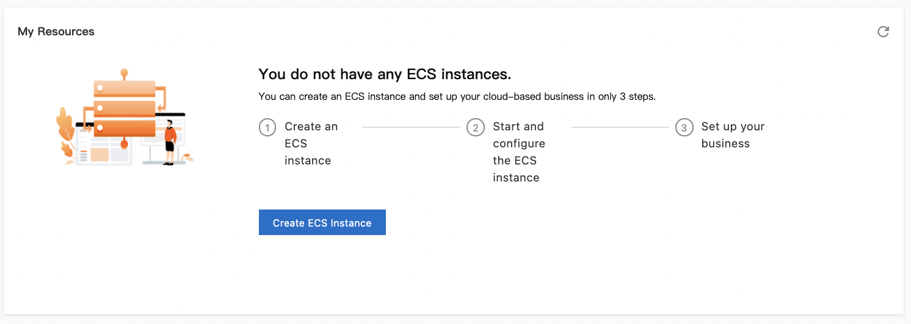{width="3.1788681102362206in"
height="1.133698600174978in"}
-   Select the `Pay-As-You-Go` billing method,

{width="2.5341338582677166in"
height="0.18771325459317587in"}
-   Make sure that the region `Germany (Frankfurt) is` selected,

{width="2.378624234470691in"
height="0.21253390201224848in"}
-   Before selecting the instance, filter the `1 vCPU`,

{width="0.6085608048993876in"
height="0.35694444444444445in"}
-   Select the instance type `ecs-t5-lc2m1.nano`,

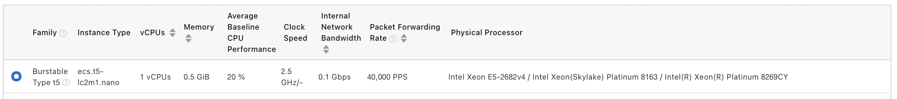{width="4.5in" height="0.5027777777777778in"}
-   Select the `Alibaba Cloud Linux` image type, version `3.2104
    64-bit`,

{width="3.0625503062117234in"
height="0.34737314085739285in"}
-   Click on `Next`,

{width="0.3674311023622047in"
height="0.2565080927384077in"}
-   Select the VPC `demoVPC` that we have just created and the VSwitch
    `demoVSwitch` that we have just created,

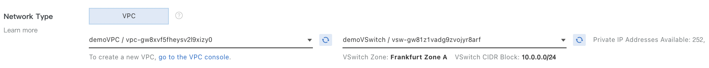{width="4.5in" height="0.43680555555555556in"}
-   Select the ports to allow in the security group (port 22 for SSH
    under Linux, port 3389 for RDP under Windows and port 80 for HTTP),

{width="4.5in" height="0.85in"}
-   Click on `Next`,
-   Select the key pair we just created (`demoECS`),

{width="2.4721784776902886in"
height="0.16671916010498689in"}
-   Name this instance `demoECS`,

{width="2.6857731846019246in"
height="0.2619466316710411in"}
-   Show advanced options by clicking on `show` next to `Advanced
    (based on instance RAM roles or cloud-init)`,

{width="2.7891360454943133in"
height="0.22072287839020122in"}
-   Enter the user data for the initialization of the instance,

{width="4.5in" height="0.63125in"}
-   Click on `Next`,
-   Click on `Next`,
-   Check `ECS Terms of Service`,
-   Click on `Create Instance`.

Now let's check that the instance has been initialized:
-   Go to the `ECS` console,
-   Click on `Instances & Images | Instances.`

The new instance we have just created is displayed.

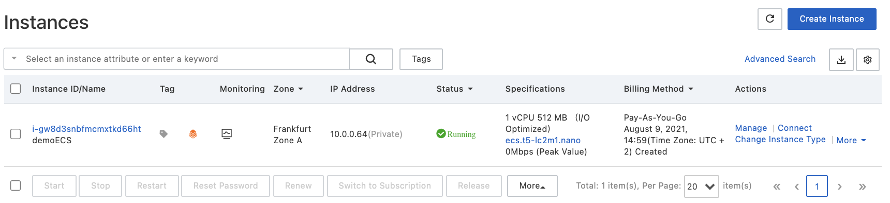{width="4.5in" height="1.0305555555555554in"}

### Involve the EIP in the ECS process 

To be able to connect to this instance from the Internet, we must
associate the EIP we have created with it:
-   On the line for the new ECS instance, in the `Actions` column,
    click on `Network and Security Group | Bind EIP`,

{width="2.141117672790901in"
height="1.4981211723534558in"}
-   Select the EIP to associate with the ECS instance,

{width="2.236586832895888in"
height="1.2456539807524059in"}
-   Click on `OK`,
-   The EIP is now displayed in the `IP Address` column next to the
    private IP address,

{width="0.579242125984252in"
height="0.5154724409448819in"}

### Check that everything is working well 

Let's connect to the ECS instance:
-   Change the permissions of the SSH key file,

`chmod 400 demoECS.pem

`The `demoECS.pem` file must have the restricted permissions 400.
-   Connect via SSH to the ECS instance,

`ssh -i demoECS.pem` root@47.254.147.166`
-   SSH asks to confirm the connection at the first connection (enter
    yes),

The authenticity of host '47.254.147.166 (47.254.147.166)' can't be
established.

ECDSA key fingerprint is
SHA256:mJJ2XwQaijw0ET0st5zXKgRnGKa9CyVgD4EVHYkANuk.

Are you sure you want to continue connecting (yes/no/[fingerprint])?
yes

Warning: Permanently added '47.254.147.166' (ECDSA) to the list of
known hosts.

Welcome to Alibaba Cloud Elastic Compute Service!

Last login: Mon Aug 9 21:21:19 2021 from 78.203.244.69

[root@iZgw8d3snbfmcmxtkd66htZ ~]#
-   `Check that nginx is installed,

`curl 0.0.0.0
-   The result of the command is:

<h1>Helloworld</h1>
-   `Display the version of the nginx web server installed with the
    command `nginx -v`,`

nginx version: nginx/1.18.0
-   `In a web browser, go to the EIP address (`47.254.147.166`):

{width="1.5360050306211723in"
height="0.5198228346456693in"}

The Nginx web server, if properly installed, should display Helloworld.

### Freeing up resources 

Let's delete the created resources:
-   Go to the `ECS` console,
-   Click on `Instances & Images | Instances,`
-   On the line of the instance, select `More | Instance Status |
    Release`,

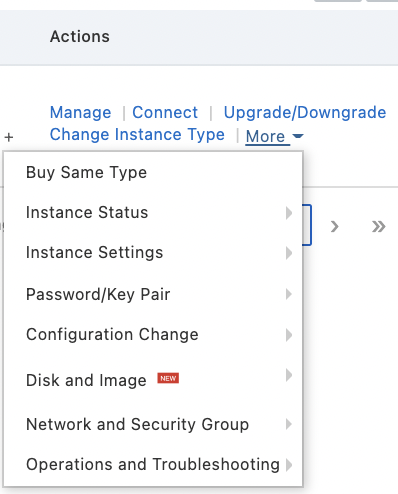{width="1.339283683289589in"
height="1.6623272090988626in"}
-   Check `Release Now`,
-   Click on `Next`,

{width="2.1555971128608924in"
height="1.4111165791776028in"}
-   Click on `OK`.

The instance disappears from the list of instances.

Let's remove the SSH key pair:
-   Go to the `ECS` console,
-   Click on `Network & Security | SSH Key Pairs,`
-   Select the line of the key pair,
-   Click on `Delete`,

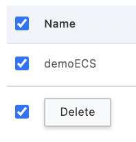{width="0.6886975065616798in"
height="0.716522309711286in"}
-   Click on `OK`.

{width="2.706404199475066in"
height="1.1468810148731408in"}

Let's delete the security group:
-   Go to the `ECS` console,
-   Click on `Network & Security | Security Groups,`
-   Select the line of the security group,
-   Click on `Delete`,

{width="1.005255905511811in"
height="0.9985990813648294in"}
-   Click on `OK`.

{width="2.285249343832021in"
height="0.9560662729658793in"}

The security group will then disappear from the list.

Let's remove the EIP:
-   Go to the `VPC` console,
-   Click on `Access to Internet | Elastic IP Addresses`,
-   On the line of the EIP, in the `Actions` column, select `... |
    Release`,

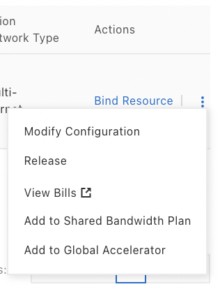{width="0.9208038057742782in"
height="1.2063702974628172in"}
-   Click on `OK`.

{width="1.827746062992126in"
height="1.0883661417322834in"}

The EIP disappears from the list of EIPs.

Let's remove the VSwitch:
-   Go to the `VPC` console,
-   Click on `vSwitch`,
-   On the VSwitch line, click on `Delete` in the `Actions` column,

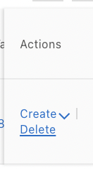{width="0.4846369203849519in"
height="0.8738156167979002in"}
-   Click on `OK`,

{width="2.416486220472441in"
height="0.607477034120735in"}

Let's remove the VPC:
-   Go to the `VPC` console,
-   Click on `VPCs`,
-   On the VPC line, click on `Delete` in the `Actions` column,

{width="0.6129166666666667in"
height="0.4815780839895013in"}
-   Click on `OK`,

{width="2.6392727471566055in"
height="0.6402679352580928in"}

