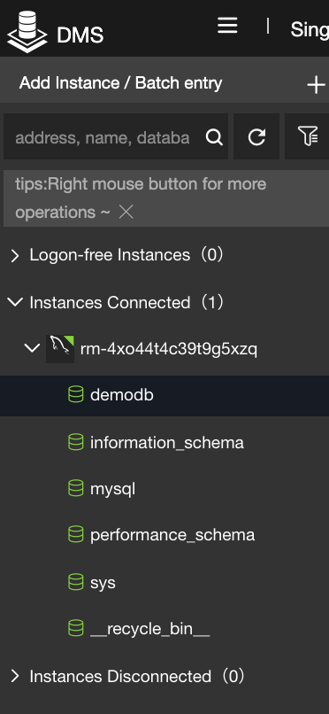

## Creating a mySQL RDS database 

In this case study, we will set up a RDS instance in a new VPC.

The steps are as follows:
-   Create a VPC and a VSwitch,
-   Create a RDS MySQL 8.0 instance,
-   Create an account,
-   Create a database,
-   Access to the database,
-   Free up resources.

### Create a VPC and a VSwitch 

Let's create a VPC with CIDR `172.16.0.0/16`:
-   Go to the `VPC` console,
-   Click on `VPCs`,
-   Click on `Create VPC`,

{width="2.7627755905511813in"
height="1.3796817585301837in"}
-   Enter the name of the VPC (`dbVPC`) and the CIDR block,

{width="2.412298775153106in"
height="0.5755271216097988in"}

Let's create a VSwitch in this VPC with CIDR `172.16.1.0/24` in the
availability zone `Frankfurt Zone A:`
-   Enter the name of the VSwitch (`dbVSwitch`),
-   Select the availability zone `Frankfurt Zone A`,
-   Enter the CIDR block of the VSwitch (`172.16.1.0/24`),
-   Click on `OK`,

{width="3.1302351268591426in"
height="2.484382108486439in"}

The VPC and VSwitch are then created:

{width="4.5in" height="1.2395833333333333in"}

### Create a database instance 

Let's create a RDS `mydb` database instance based on MySQL version
8.0 engine:
-   Go to the `ApsaraDB for RDS` console,
-   Click on `Instances`,
-   Click on `Create Instance`,

{width="4.5in"
height="1.0118055555555556in"}
-   Select the `Pay-As-You-Go` billing method,

{width="2.1891240157480314in"
height="0.19391294838145232in"}
-   Make sure that the region `Germany (Frankfurt)` is selected,

{width="1.4841447944007in"
height="0.19676181102362206in"}
-   Select `MySQL` engine version `8.0`,

{width="4.5in"
height="0.6972222222222222in"}
-   Select the `Basic` edition,

{width="4.5in" height="0.25833333333333336in"}
-   Select the instance type `mysql.n1.micro.1`,

{width="4.5in" height="0.4027777777777778in"}
-   Click on `Next: Instance Configuration`,
-   Select the VPC `dbVPC` and the VSwitch `dbVSwitch`,

{width="3.439983595800525in"
height="0.6258858267716535in"}
-   Click on `Next: Confirm Order`,
-   Check `Terms of Service`,

{width="1.3884634733158354in"
height="0.22394575678040246in"}
-   Click on `Pay Now`.

{width="0.4449595363079615in"
height="0.2338888888888889in"}
-   Click on `Instances`,
-   The new RDS instance should appear in the list,

{width="4.5in"
height="0.8472222222222222in"}

After a few minutes, the instance turns:

{width="0.3637904636920385in"
height="0.5601202974628171in"}

### Create an account 

Let's create a privileged account with login `root` and password
`$Mypassword:`
-   Click on the instance ID,

{width="0.7403674540682414in"
height="0.5378138670166229in"}
-   Click on `Accounts`,
-   Click on `Create Account`,

{width="4.5in" height="0.6340277777777777in"}
-   Enter `root` as the database account,
-   Select the preferred account type,
-   Enter `$Mypassword` as the password and as the password
    confirmation,
-   Click on `Determine`.

{width="2.506281714785652in"
height="2.341517935258093in"}

The account will then appear in the list of accounts:

{width="3.8279451006124234in"
height="0.7183300524934383in"}

### Create a database 

Let's create a `demodb database`:
-   Click on `Databases`,
-   Click on `Create Database`,

{width="4.121103455818023in"
height="0.6143503937007874in"}
-   Enter `demodb` as database name,
-   Click on `Create`,

{width="3.859816272965879in"
height="1.8387740594925635in"}

The database appears in the list of databases:

{width="4.5in" height="0.5861111111111111in"}

### Access to the database 

On the RDS instance page, click on `Log On to Database:`

{width="1.3118449256342957in"
height="0.16901027996500437in"}

The following page is displayed:

{width="2.8909470691163603in"
height="2.4180457130358706in"}

Enter the login and password:

{width="3.7000120297462815in"
height="2.159481627296588in"}

Let's check that we can access the `demodb` database we have created
by clicking on `Instances Connected:`

{width="0.7998228346456693in"
height="1.732950568678915in"}

### Freeing up resources 

Let's free up resources:
-   Go to the `ApsaraDB RDS` console,
-   Click on `Instances`,
-   In the instance row, in the `Actions` column, select the option
    `More | Release Instance`,

{width="1.7714676290463691in"
height="1.0534645669291338in"}
-   Click on `OK`,

{width="1.8550503062117236in"
height="0.6329494750656168in"}

