# CDN 

CDN (Content Delivery Network) is a distributed network composed of
clusters of edge node servers distributed in different regions.
EdgeScript allows to customize the operation of CDN by running a script.
EdgeRoutine is a serverless environment for running JavaScript code on
CDN nodes.

CDN is an optimized alternative to web servers. Static resources are
cached on the edge node while dynamic resources use dynamic acceleration
to be faster.

The origin server is the server from which the CDN obtains resources.
The origin host is the domain name of the origin server to which Alibaba
Cloud CDN initiates back-to-source requests. When a request with a URL
containing `? `followed by parameters is sent to a CDN node, CDN uses
a filter to determine if it should send it to the origin server. When a
requested resource is not cached on a CDN node, that node retrieves that
resource from the origin server according to the origin protocol policy
and then caches that resource on the node. Cached resources can be
refreshed and prefetched.

HTTPS acceleration is used to encrypt data between clients and CDNs. You
can specify the version of TLS used. It is possible to force a
redirection of client requests to HTTP or HTTPS.

CDN supports HTTP/2 and OCSP stapling. It allows to validate
certificates by retrieving information from the certification authority.
It also supports HSTS. It allows to force clients to connect with HTTPS.
CDN supports SNI. SNI allows the client to determine the hostname to
connect to during a connection. It is an extension of TLS (Transport
Layer Security).

Back-to-origin request headers and responses can be customized. The
timeout of the requests can also be specified. Rewrite rules allow to
rewrite URIs of back-to-origin requests. Cache expiration rules allow
you to set a TTL value for static resources cached on CDNs. The HTML
page displayed corresponding to the HTTP 404 code can be customized.

Access to resources can be controlled by several techniques:

-   by a hotlink protection,

-   by signing the URL,

-   by remote authentication,

-   by a white or black list of IP addresses,

-   by whitelisting or blacklisting HTTP `User-Agent `headers.

There are several optimization techniques:

-   Intelligent compression compresses text files.

-   Page optimization removes redundant content from web pages.

-   The new Brotli compression compresses text files more efficiently
    than intelligent compression.

CDN supports video delivery. Object chunking allows the origin server to
send back only pieces of the requested files in order to reduce network
traffic at the back-to-origin level and response time. It also allows to
position yourself directly at a specified position in the video.

Resource monitoring allows for the collection of data on resource usage
based on client IP addresses, geographic locations and ISPs (Internet
Service Providers). It is also possible to obtain statistics on CDN
usage and billing elements. CDN provides logs to help you solve
problems.

## Basic and origin server configuration 

To change the basic information of the CDN service:

-   Go to the `Alibaba Cloud CDN `console,

-   Click on `Domain Names`,

-   Click on `Manage `on the line of the domain name,

{width="4.5in" height="1.101388888888889in"}

-   Click on `Modify `next to `Region`,

{width="1.7736034558180227in"
height="0.4787095363079615in"}

-   Select the accelerated region:

```{=html}
<!-- -->
```
-   `Mainland China Only`: you need to apply for an ICP (Internet
    Content Provider) number from MIIT (Ministry of Industry and
    Information Technology) for the domain name,

-   `Global`: you must follow the same procedure as for the Mainland
    China Only choice,

-   `Global (Excluding Mainland China)`: PKI number is not required,

```{=html}
<!-- -->
```
-   Click on `OK`.

{width="2.365634295713036in"
height="1.8859350393700787in"}

Alibaba Cloud CDN supports the following types of origin servers:

-   OSS endpoints,

-   IP addresses,

-   domain names,

-   Function Compute domain names.

It is possible to specify several IP addresses or domain names, each of
which has a priority (`Primary `or `Secondary`). If several entries
have the same priority, the round robin algorithm is used.

Layer 4 Health Checks are performed on the origin servers on the
specified port (80 or 443 by default) at a frequency of 2.5 seconds. In
case of three consecutive failures, the origin server is considered
unavailable.

Alibaba Cloud CDN can then switch between the primary and secondary
origin servers.

Once the primary origin server is available again, the switchover is
cancelled.

To configure an origin server:

-   Go to the `Alibaba Cloud CDN `console,

-   Click on `Domain Names`,

-   Click on `Manage `on the line of the domain name,

{width="4.5in" height="1.101388888888889in"}

-   Click on `Modify `on the line of the origin,

{width="2.7657141294838143in"
height="0.6752088801399825in"}

-   `Origin Info`:

```{=html}
<!-- -->
```
-   `OSS Domain`: this is the public endpoint of an OSS bucket,

-   `IP`: these are the public IP addresses of the servers,

-   `Site Domain`: these are the domain names of the origin servers,

The domain name of the origin server must be different from the domain
name to be accelerated.

-   `Function Compute Domain`: this is the domain name of Function
    Compute; you must specify the region,

```{=html}
<!-- -->
```
-   `Priority`: this is the priority (`Primary` or` Secondary`),`

-   Weight`: this is the weight,`

-   Port`: this is the port:

```{=html}
<!-- -->
```
-   `Port 80`: uses port 80 on HTTP or HTTPS,

-   `Port 443`: uses port 443 on HTTP or HTTPS,

If the origin server\'s IP address is associated with multiple domain
names, you must configure SNI (Server Name Indication).

-   Custom port: redirects HTTP requests to origin servers on custom
    ports,

To redirect HTTPS requests, you must open a ticket. It is necessary to
disable the origin protocol policy.

-   Click on `OK`.

{width="2.039819553805774in"
height="1.7521052055993in"}

## HTTPS acceleration 

HTTPS allows for secure data transmission between clients and servers
using the SSL (Secure Sockets Layer) protocol.

In this section, we will study:

-   HTTPS acceleration, which enables data encryption between clients
    and CDNs,

-   the certificate configuration,

-   enabling HTTP/2,

-   the configuration of the OCSP stapling which allows to validate the
    certificates by retrieving information from the CA,

-   forcing redirection of client requests,

-   the configuration of the CDN\'s TLS version control in order to
    secure the data exchange between two applications,

-   HSTS to force clients to connect with HTTPS.

### Enable HTTPS secure acceleration 

HTTPS (Hyper Text Transfer Protocol over Secure Socket Layer) is a
secure HTTP channel. It encapsulates HTTP with the SSL/TLS protocol. Its
interest is the protection against attacks.

HTTPS acceleration enables data encryption between clients and CDNs. The
request is encrypted at the CDNs. These CDNs then access the resources
of the origin server based on the configuration of the origin server.

The encryption of a HTTPS request follows the following process:

-   The server sends its public certificate to the client.

-   The client checks the certificate (validity period, reliability of
    the certificate\'s CA, correspondence of the domain name in the
    server\'s certificate with the real domain name, etc.).

-   If the certificate is validated, the client encrypts a randomly
    generated number with the public key and transfers it to the server.

-   The server uses the secret key to decrypt and recover the random
    number that was encrypted.

-   The server encrypts the transmitted data using the retrieved random
    number.

-   The client decrypts the received data using this same random number.

The certificate update takes effect in less than a minute.

To use the acceleration feature, you must upload a certificate and its
secret key in PEM format. The secret key with a password is not
available.

### Configure the certificate 

HTTPS acceleration requires the use of an SSL (Secure Sockets Layer)
certificate. Several formats are supported:

-   Certificates issued by a root CA (Apache, Nginx, \...): their
    extension is `.crt `and `.key`,

-   Intermediate CA certificates: it contains several certificates,

-   RSA (Rivest, Shamir, Adleman) private keys: their extension is
    `.pem `or `.key`.

Alibaba Cloud CDN uses certificates issued by the root CA Nginx.

For RSA, you must first generate a `.pem `private key:

`openssl genrsa -out key.pem 2048

`Then you must add at the beginning of the file `\-\-\-\--BEGIN
PRIVATE KEY\-\-\-\-- `and at the end of the file `\-\-\-\--END RSA
PRIVATE KEY\-\-\-\--:`

`openssl rsa -in key.pem -out new_key.pem

`Alibaba Cloud CDN only supports SSL certificates in PEM
(Privacy-Enhanced Mail) format.

There are different levels of certificate validation:

-   a Domain Validated (DV) certificate,

```{=html}
<!-- -->
```
-   It allows to verify the ownership of a domain name.

```{=html}
<!-- -->
```
-   a validated organization (OV),

```{=html}
<!-- -->
```
-   This is a standard SSL certificate.

-   It allows to verify the identity of an organization.

-   It provides a higher level of confidence than a DV certificate.

-   It is suitable for e-commerce websites,

```{=html}
<!-- -->
```
-   Extended Validation (EV).

```{=html}
<!-- -->
```
-   It follows the guidelines issued by CA/Browser Forum.

-   It is suitable for financial areas.

To specify a certificate:

-   Go to the `Alibaab Cloud CDN `console,

-   Click on `Domain Names`,

-   Click on `Manage `on the line of the domain name,

{width="4.5in" height="1.101388888888889in"}

-   Click on the `HTTPS `tab,

-   Click on `Modify `next to `HTTPS Certificate`,

{width="3.3833497375328085in"
height="0.9194564741907262in"}

-   Enable `HTTPS Secure`,

-   `Certificate Source`: this is the source of the certificate;
    supported values are `SSL Certificates Service`, `Custom
    Certificate (Certificate+Private Key`, `Upload Custom Certificate
    (Certificate)`, `Free Certificate`,

-   `Certificate Name `(depending on the certificate source): this is
    the name of the certificate (for `SSL Certificates Service `and
    `Custom Certificate (Certificate+Private Key)`),

-   `Certificate (Public Key) `(depending on the source of the
    certificate): this is the public key (for `Custom Certificate
    (Certificate+Private Key) `or `Upload Custom Certificate
    (Certificate)`),

-   `Private Key `(depending on the certificate source): this is the
    private key (for `Custom Certificate (Certificate+Private Key)`),

-   Click on `OK`.

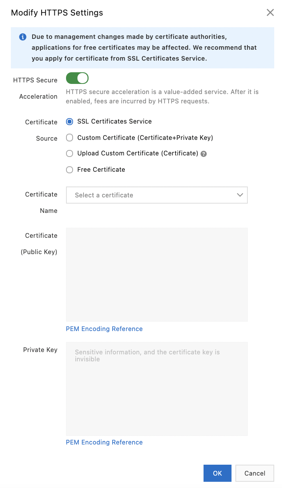{width="2.0719969378827647in"
height="3.5848972003499564in"}

Certificate sources can be:

-   `SSL Certificates Service`:

```{=html}
<!-- -->
```
-   This service allows to request certificates from different
    suppliers.

```{=html}
<!-- -->
```
-   `Custom Certificate (Certificate+Private Key):

```{=html}
<!-- -->
```
-   `It allows to upload a custom certificate with its private key to
    the `SSL Certificates Services`.

```{=html}
<!-- -->
```
-   `Upload Custom Certificate (Certificate):`

```{=html}
<!-- -->
```
-   It allows to upload a certifcat without its private key for security
    reasons.

-   You then need to create a CSR (Certificate Signing Request) in the
    Alibaba Cloud CDN console and request a certificate from a
    Certificate Authority (CA).

```{=html}
<!-- -->
```
-   `Free Certificate:`

```{=html}
<!-- -->
```
-   These are free SSL certificates valid for one year and are used only
    for HTTPS acceleration.

-   The overall delay can be up to a few days.

### Enable HTTP/2 

HTTP/2, released in 2015, is available on many browsers. Its main
advantages of HTTP/2 are:

-   Multiplexing allows the browser to download all the resources needed
    to display the page with a single request.

-   The volume of data exchanged is reduced by using HTTP header
    compression.

-   The transmission of data in binary is less prone to errors than the
    transmission in text.

-   HTTP/2 Server Push allows resources to be attached to requests. This
    allows certain unsolicited files to be preloaded by the browser,
    improving the responsiveness of these Web sites.

To enable HTTP/2:

-   Go to the `Alibaba Cloud CDN `console,

-   Click on `Domain Names`,

-   Click on a domain name,

-   Click on `Manage `on the line of the domain name,

{width="4.5in" height="1.101388888888889in"}

-   Click on the `HTTPS `tab,

-   Enable `HTTP/2`.

{width="3.1488768591426073in"
height="0.5141218285214348in"}

HTTPS certificates must be configured.

### Configure OCSP stapling 

OCSP stapling allows certificates to be validated by retrieving
information from the CA. This information is then cached to reduce
latency for certificate validation requests.

To configure OCSP stapling:

-   Go to the `Alibaba Cloud CDN `console,

-   Click on `Domain Names`,

-   Click on `Manage `on the line of the domain name,

-   Click on the `HTTPS `tab,

-   Enable `OCSP stapling`.

{width="1.103701881014873in"
height="0.3804024496937883in"}

### Configure forced redirection 

It is possible to force a redirection of a client\'s requests. Several
types are supported:

-   `Default `(not default),

-   `HTTP -\> HTTPS: `requests are redirected to HTTPS,

-   `HTTPS -\> HTTP: `requests are redirected to HTTP.

To manage the forced redirection:

-   Go to the `Alibaba Cloud CDN `console,

-   Click on `Domain Names`,

-   Click on `Manage `on the line of the domain name,

-   Click on the `HTTPS `tab,

-   Click `Modify `next to `Force Redirect`,

{width="2.5059722222222223in"
height="0.4629090113735783in"}

-   `Redirect Type`: this is the type of redirection,

-   Click on `OK`.

{width="2.155071084864392in"
height="0.9355271216097988in"}

### Configure TLS 

TLS (Transport Layer Security) version control of Alibaba Cloud CDN
enables secure data exchange between two applications. HTTPS (HTTP over
TLS) is an application of TLS. The version of TLS can be configured
based on the domain name.

To enable TLS:

-   Go to the `Alibaba Cloud CDN `console,

-   Click on `Domain Names`,

-   Click on `Manage `on the line of the domain name,

-   Click on the `HTTPS `tab,

-   Enable or disable TLS versions (`TLSv1.0`, `TLSv1.1`, `TLSv1.2
    `or `TLSv1.3`).

{width="2.6479811898512686in"
height="0.8025667104111986in"}

### Configure HSTS 

HSTS (HTTP Strict Transport Security) allows to force clients to connect
with HTTPS. However, it does not protect against cookie hijacking.

HTTP requests are then redirected to HTTPS URLs with HTTP status codes
301 and 302.

Usually, requests cannot be sent to the origin server because they can
be hijacked during redirection. HSTS solves this problem. When the
browser receives a HTTP request, if the HSTS header for the domain name
does not expire, the browser redirects the request to HTTPS with the
HTTP status code 307 (\"Temporary Redirect\").

The format of the HSTS header is
`Strict-Transport-Security:max-age=expireTime \[;includeSubDomains\]
\[;preload\]`.

`max-age `defines the maximum duration (in seconds) of caching of the
resource.

`includeSubDomains `(optional) specifies that the setting applies to
subdomains.

`preload `(optional) adds the domain name to the browser\'s preloaded
HSTS list.

To activate HSTS:

-   Go to the `Alibaba Cloud CDN `console,

-   Click on `Domain Names`,

-   Click on `Manage `on the line of the domain name,

-   Click on the `HTTPS `tab,

-   Click on `Modify `next to `HSTS`,

{width="2.772764654418198in"
height="0.5442825896762905in"}

-   Activate `HSTS`,

-   `Expire In`: this is the length of time the HSTS response is
    cached in the browser (from 0 to 730 seconds),

-   `Include Subdomains`: include subdomains; HTTPS must be enabled
    for all subdomains,

-   Click on `OK`.

{width="2.380007655293088in"
height="1.9065769903762029in"}

However, before HSTS is enabled, the first HTTP request is redirected to
HTTPS with HTTP status code 301 or 302.

## Back-to-origin configuration 

The origin host is the domain name of the origin server to which Alibaba
Cloud CDN initiates back-to-source requests.

In this section, we will study:

-   configuration of an origin host,

-   configuration of the associated protocol policy,

-   configuration of a back-to-origin authorization for private buckets
    and disabling it,

-   SNI configuration, which allows the client to determine the host
    name to connect to when making a connection,

-   configuration of the timeout of back-to-origin requests,

-   customization of HTTP headers sent by the CDN to origin servers and
    HTTP headers of back-to-origin requests,

-   configuration of the rewriting of URIs and parameters.

### Configure an originating host 

The origin host is the domain name of the origin server to which Alibaba
Cloud CDN initiates back-to-source requests. This server can be
customized. The following domain name types are supported:

-   accelerated domain names,

-   origin domain names,

-   customized domain names.

If more than one domain name is used, requests may include a different
originating host.

The origin host defines a site that is hosted on a specific IP address
while the origin server defines the IP address to which back-to-origin
requests are redirected.

To configure an originating host:

-   Go to the `Alibaba Cloud CDN `console,

-   Click on `Domain Names`,

-   Click on `Manage `on the line of the domain name,

-   Click on the `Back-to-origin `tab,

-   Click on `Modify `next to `Origin Host`,

{width="3.371597769028871in"
height="0.5317541557305336in"}

-   Enable `Origin Host`,

-   `Domain Type`: this` `is the type of domain:

```{=html}
<!-- -->
```
-   `CDN Domain`: specifies the accelerated domain name used as the
    origin host,

-   `Origin Domain`: specifies the domain name of the origin server
    used as the origin host; Alibaba Cloud CDN uses this domain name to
    retrieve content from the origin server,

-   `Custom Domain`: specifies the custom domain name used as the
    originating host.

{width="2.1459317585301836in"
height="1.4306211723534559in"}

### Configure the origin protocol policy 

When a request asks for a resource that is not cached on a CDN node,
that node retrieves that resource from the origin server according to
the origin protocol policy and then caches that resource on the node.

To configure the origin protocol policy:

-   Go to the `Alibaba Cloud CDN `console,

-   Click on `Domain Names`,

-   Click on `Manage `on the line of the domain name,

-   Click on the `Back-to-origin `tab,

-   Enable `Origin Protocol Policy`,

-   Click on `Modify`,

{width="2.966251093613298in"
height="0.4499726596675416in"}

-   `Redirect `Type: this is the type of redirection:

```{=html}
<!-- -->
```
-   `Follow`: CDN nodes communicate with the origin server using the
    protocol used by the client,

-   `HTTP`: HTTP CDNs communicate with origin servers only via HTTP,

-   `HTTPS`: CDN nodes communicate with origin servers only via HTTPS,

```{=html}
<!-- -->
```
-   Click on `OK`.

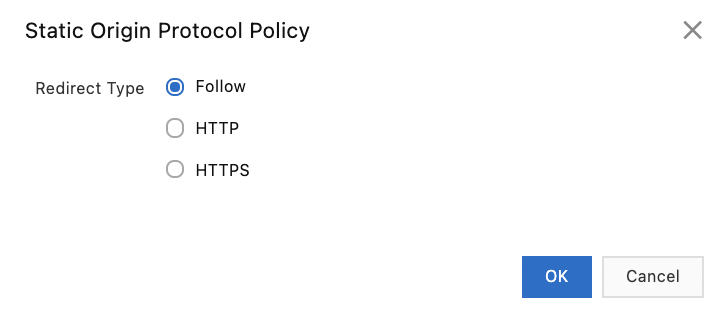{width="2.017419072615923in"
height="0.8885356517935258in"}

### Configure back-to-origin authorization for private buckets 

`Back-to-origin `authorization for private buckets allows traffic to
be forwarded from a CDN domain to a private bucket. To secure resources,
you can use hotlink protection and URL signing.

If the website is at risk of attack, it is recommended to purchase the
Anti-DDoS service and not to activate the private bucket authorization.

To enable back-to-origin authentication for a private bucket:

-   Go to the `Alibaba Cloud CDN `console,

-   Go to the `Domain Names `console,

-   Select the domain name,

-   Click on `Manage `on the line of the domain name,

-   Click on the `Back-to-origin `tab,

-   In the `Alibaba Cloud OSS Private Bucket Access `section, click on
    `Authorize`,

-   Confirm authorization.

-   Reload the page.

-   Activate `Alibaba Cloud OSS Private Bucket Access`.

The `AliyunCDNAccessingPrivateOSSRole `authorization policy is
authorized.

### Disable access to private buckets 

An accelerated domain name that uses a private bucket needs to have
access authorization to that bucket.

To revoke this authorization:

-   Go to the `RAM `console,

-   Click on `Identities \| Roles`,

-   Search for the `AliyunCDNAccessingPrivateOSSRole`,

-   Click on this role,

{width="3.7236187664041993in"
height="1.7043602362204724in"}

-   Click on `Remove Permission `on the line of the role,

-   Click on `OK`,

{width="3.25492125984252in"
height="1.5315212160979879in"}

-   Click on `Identities \| Roles`,

-   Search for the `AliyunCDNAccessingPrivateOSSRole`,

-   Click on `Delete `on the line of the role,

-   Click on `OK`.

{width="3.4877230971128608in"
height="1.6028455818022747in"}

### Configure SNI 

SNI (Server Name Indication) allows the client to determine the host
name to connect to during a connection. It is an extension of TLS
(Transport Layer Security).

With SNI, it is possible to host multiple HTTPS sites using different
certificates on the same IP address and port.

SNI integrates the destination domain name during requests from CDN
nodes to the origin server via HTTPS.

SNI is useless if the origin server is a bucket.

To configure SNI:

-   Go to the `Alibaba cloud CDN `console,

-   Click on `Domain Names`,

-   Click on `Manage `on the line of the domain name,

-   Click on the `Back-to-origin `tab,

-   Click on `Modify `next to `Origin SNI`,

{width="3.807574365704287in"
height="0.4448053368328959in"}

-   Activate `Origin SNI`,

-   `SNI:` this is the domain name served by the origin server,

-   Click on `OK`.

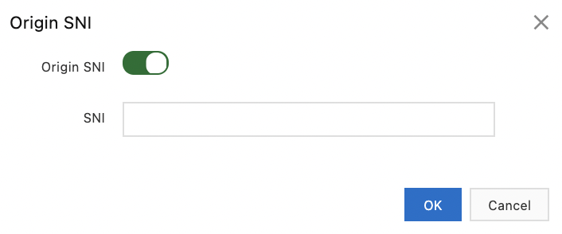{width="1.7035575240594925in"
height="0.7092902449693789in"}

### Specify the timeout for back-to-origin requests 

The timeout of back-to-origin requests corresponds to the maximum time a
node must wait to obtain the results of its requests to the origin
servers. It happens when the requested resource is not in the cache.

This timeout is 30 seconds by default and is a maximum of 900 seconds.
After this time, if the CDN has not received a response, it disconnects
from the origin server.

To specify the timeout for back-to-origin requests:

-   Go to the `Alibaba Cloud CDN `console,

-   Click on `Domain Names`,

-   Click on `Manage `on the line of the domain name,

-   Click on the `Back-to-origin `tab,

-   Click on `Modify `next to `Back-to-origin Request Timeout`,

{width="3.0821773840769904in"
height="0.43331255468066493in"}

-   `Timeout Value`: this is the timeout value,

-   Click on `OK`.

{width="2.0651509186351706in"
height="0.8107633420822398in"}

### Customize the HTTP headers sent by the CDN to the origin servers 

It is possible to add or remove HTTP headers in requests sent by Alibaba
Cloud CDN to origin servers.

To customize these HTTP headers:

-   Go to the `Alibaba Cloud CDN `console,

-   Click on `Domain Names`,

-   Click on `Manage `on the line of the domain name,

-   Click on the `Back-to-origin `tab,

-   Click on the `Custom Request Header `tab,

-   Click on `Customize`,

{width="3.7743405511811026in"
height="0.7571981627296588in"}

-   `Parameter`: select `Custom Origin Header `from the list,

-   `Value:` this is the value of the parameter,

-   Click on `OK`.

{width="1.6247014435695537in"
height="0.6942596237970253in"}

### Customize HTTP headers for back-to-origin requests 

It is possible to customize the HTTP headers of back-to-origin requests:

-   Go to the `Alibaba Cloud CDN `console,

-   Click on `Domain Names`,

-   Click on `Manage `on the line of the domain name,

-   Click on the `Back-to-origin `tab,

-   Click on the `Custom Request Headers (New) `tab,

-   Click on `Customize`,

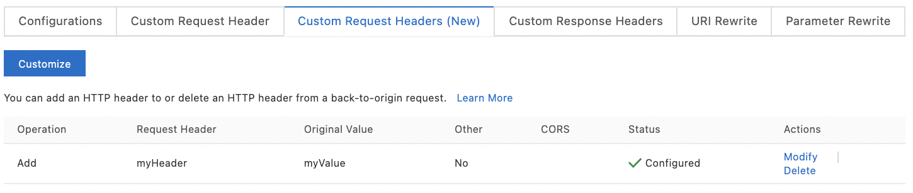{width="4.5in" height="0.9555555555555556in"}

-   `Operation`: select the operation (possible values are `Add`,
    `Delete`, `Change`, `Replace`),

-   Click on `OK`.

{width="2.1586373578302713in"
height="1.2572058180227472in"}

If several operations are performed on the same header, they are
performed in the following order of priority: `Replace`, `Add`,
`Change `and `Delete`.

It is also possible to customize the headers of HTTP responses:

-   Go to the `Alibaba Cloud CDN `console,

-   Click on `Domain Names`,

-   Click on `Manage `on the line of the domain name,

-   Click on the `Back-to-origin `tab,

-   Click on the `Custom Response Headers `tab,

-   Click on `Customize`,

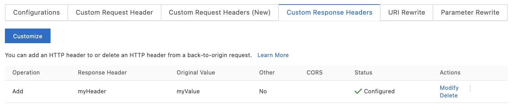{width="4.5in" height="0.9715277777777778in"}

-   `Operation`: this is the operation (possible values are `Add`,
    `Delete`, `Change`, `Replace`),

-   Click on `OK`.

{width="2.133264435695538in"
height="1.234199475065617in"}

Domain names with a wildcard are not supported.

### Configure the rewrite of URIs and parameters 

It is possible to rewrite the URI of back-to-origin requests by creating
rules. This is useful when the URIs are different on the origin server.

To create a URI rewrite rule:

-   Go to the `Alibaba Cloud CDN `console,

-   Click on `Domain Names`,

-   Click on `Manage `on the line of the domain name,

-   Click on the `Back-to-origin `tab,

-   Click on the `URI Rewrite `tab,

-   Click on `Add`,

{width="4.5in"
height="1.2027777777777777in"}

-   `Original URI:` this is the source URI (example: `\^/hello\$`),

-   `Final URI:` this is the target one (example: `/hello/world`),

-   `Flag`: specifies the behavior when a rule is satisfied and
    several rules have been configured:

```{=html}
<!-- -->
```
-   `None`: continues the evaluation of the rules,

-   `break:` stops the evaluation of the rules and rewrites the URI
    without its parameters,

-   `enhance break:` stops the evaluation of the rules and rewrites
    the URI and its parameters,

```{=html}
<!-- -->
```
-   Click on `OK`.

{width="2.2096008311461066in"
height="1.7724540682414698in"}

The URI must start with `/ `but must not include `http:// `or the
domain name.

The maximum is 50 URI rewriting rules.

To change the parameters in the URLs of back-to-origin requests, you can
create rules to rewrite the parameters:

-   Go to the `Alibaba Cloud CDN `console,

-   Click on `Domain Names`,

-   Click on `Manage `on the line of the domain name,

-   Click on the `Back-to-origin `tab,

-   Click on the `Parameter Rewrite `tab,

{width="4.5in"
height="0.6402777777777777in"}

-   Activate `Rewrite Parameters`,

-   Specify the parameters,

-   Click on `OK`.

{width="2.136632764654418in"
height="2.4670199037620297in"}

The rewriting of URIs and parameters can have conflicts between them.

## The cache 

In this section, we will study:

-   creating an expiration rule for the cache,

-   creation of a cache expiration rule for HTTP status codes,

-   creation of a URI rewriting rule,

-   customization of the 404 \"not found\" page,

-   definition of the HTTP response header,

-   refresh and prefetch configuration.

### Create an expiration rule for the cache 

You can set a TTL (Time-To-Live) value for static resources cached on
CDNs. Nodes automatically delete resources that have expired.

The default TTL value is 10 seconds. The maximum value is 3600 seconds.

The priority of cache expiration rules configured on an origin server is
lower than the priority of cache expiration rules defined on CDNs.

Before applying the cache expiration rules, the CDNs compare the
`If-Match `value with the `ETag `value:

-   If they are identical, the CDN closest to the client returns the
    cached content.

-   If they are different, the CDN retrieves the latest content from the
    origin server and sends it back to the client.

When updating resources on the origin server, it is recommended to use
different names for each version of the resources.

-   Go to the `Alibaba Cloud CDN `console,

-   Click on `Domain Names`,

-   Click on `Manage `on the line of the domain name,

-   Click on `Cache`,

-   Click on `Create Rule`,

{width="4.5in"
height="1.2395833333333333in"}

-   `Type`: this is the type:

```{=html}
<!-- -->
```
-   `Directory:` specifies the resources cached in the specified
    directory,

-   `File Extension`: specifies the file types of the cached
    resources,

```{=html}
<!-- -->
```
-   `Object:` these are file extensions (example: JPG,PNG) or
    directories (example: `/images/back`),

-   `Expire In`: this is` `the TTL value for cached resources,

The maximum value is three years. It is recommended to specify 1 month
or more for static files that are rarely changed. For other files, it
depends on how often they are updated. To disable the cache (for dynamic
files), specify 0 seconds.

-   `Weight`: this is the weight of the rule, which indicates the
    priority; the value can go from 1 to 99; the higher the value, the
    higher the priority,

-   Click on `OK`.

{width="2.230767716535433in"
height="1.884792213473316in"}

If a resource has more than one rule that applies to it, only the first
one applies.

### Create a cache expiration rule for HTTP status codes 

It is possible to set a TTL value for the returned HTTP status codes:

-   Go to the `Alibaba Cloud CDN `console,

-   Click on `Domain Names`,

-   Click on `Manage `on the line of the domain name,

-   Click on `Cache`,

-   Click on the `Status Code Expiration `tab,

{width="3.571486220472441in"
height="0.9402701224846894in"}

-   Click on `Create Rule`,

-   `Type`: this is the type:

```{=html}
<!-- -->
```
-   `Directory:` specifies the resources cached in the specified
    directory,

-   `File Extension`: specifies the file types of the cached
    resources,

```{=html}
<!-- -->
```
-   `Object:` these are file extensions (example: JPG,PNG) or
    directories (example: `/images/back`),

-   `Expire In`: this is` `the TTL value (in seconds),

-   Click on `OK`.

{width="2.089432414698163in"
height="2.3460968941382325in"}

This allows nodes to change the HTTP status code returned, outside of
the `2xx `codes.

### Create a URI rewrite rule 

To rewrite a URI, you must create a rewrite rule. Alibaba Cloud CDN
checks if incoming requests have a URI rewrite rule that applies. If so,
it performs a 302 redirect to the destination URI.

To create a URI rewrite rule:

-   Go to the `Alibaba Cloud CDN `console,

-   Click on `Domain Names`,

-   Click on `Manage `on the line of the domain name,

-   Click on `Cache`,

-   Click on the `Rewrite `tab,

{width="3.4679604111986in"
height="0.9140857392825896in"}

-   Click on `Create`,

-   `Original URI:` this is the original URI,

-   `Final URI`: this is` `the destination URI,

-   `Flag`: indicates the behavior if the rule is satisfied:

```{=html}
<!-- -->
```
-   `Redirect:` performs a 302 redirect to the destination URI,

-   `Break`: does not rewrite the URI and ignores the other rules,

```{=html}
<!-- -->
```
-   Click on `OK`.

{width="2.3681003937007876in"
height="1.8984984689413824in"}

The URI starts with `/ `and cannot contain either `http:// `or a
domain name.

### Customize the 404 page 

You can customize the HTML page displayed when a HTTP 404 error code is
returned:

-   the default 404 page,

-   a custom 404 page.

To customize the 404 page:

-   Go to the `Alibaba Cloud CDN `console,

-   Click on `Domain Names`,

-   Click on `Manage `on the line of the domain name,

-   Click on `Cache`,

-   Select the `Custom Pages `tab,

-   Click on `Customize`,

{width="3.903137576552931in"
height="1.0793864829396325in"}

-   `Error Code`: this is` `the error code (400, 403, 404, 405, 414,
    416, 500, 501, 502, 503, 504),

-   `Description`: this is the description,

-   `Link:` this is the link,

-   Click on `OK`.

{width="2.0474617235345582in"
height="1.0265737095363079in"}

The custom 404 page must be stored under the domain of the origin
server.

### Define the HTTP response header 

You can define a HTTP response header.

In addition, the following HTTP response headers can be customized:

-   `Access-Control-Allow-Credentials`: specifies if browsers can
    expose responses to Javascript code,

-   `Access-Control-Allow-Headers:` specify the header fields that can
    be used in CORS queries,

-   `Access-Control-Allow-Methods`: specifies the allowed method for
    CORS requests,

-   `Access-Control-Allow-Origin`: specifies the allowed origin domain
    of CORS requests,

-   `Access-Control-Expose-Headers:` allows the server to specify the
    response headers accessible by the Javascript code,

-   `Access-Control-Max-Age`: specifies the length of time the
    response result is cached during a client-initiated prefetch
    request,

-   `Cache-control:` specifies the caching policy at the client level,

-   `Content-Disposition`: specifies the default file name provided by
    the client when saving content as a file,

-   `Content-Type: `specifies the content type of the response,

-   `Custom:` specifies a custom response header.

This customization concerns the responses under the CDN domain name and
not the cache server.

It is not possible to customize HTTP headers for a domain name with a
wildcard.

To customize HTTP response headers:

-   Go to the `Alibaba Cloud CDN `console,

-   Go to the `Domain Names `page,

-   Click on `Manage `on the line of the domain name,

-   Click on `Cache`,

-   Click on the `Custom HTTP Response Hader `tab,`

-   `Click on `Customize`,

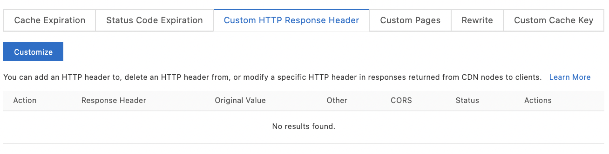{width="4.09798009623797in"
height="1.0403051181102363in"}

-   `Operation:` this is the operation (`Add`, `Delete`,
    `Modify`, `Replace`) on the response header,

-   `Response Header: `this is the response header (select
    `Custom`),

-   `Header Name`: this is the name of the header (for the `Custom`
    choice),

-   `Header Value`: this is` `the value of the header,

-   `Allow Duplicates`: allows (or not) duplicate headers,

-   Click on `OK`.

{width="2.587904636920385in"
height="1.5004254155730534in"}

### Configure refresh and prefetch 

Cached resources can be refreshed and prefetched.

To have the CDN nodes retrieve the versions of the resources on the
origin servers, use \"refresh\". The cached data is cleared and the next
time the CDN requests the resources, it will retrieve the resources from
the origin server.

To retrieve frequently requested resources during off-peak hours, use
\"prefetch\". This will increase the cache hit rate and thus speed up
the delivery of content.

To refresh or prefetch resources:

-   Go to the `Alibaba Cloud CDN `console,

-   Click on `Refresh & Prefetch,`

-   Click on the `Refresh Cache `tab,

-   `Operation`: this is` `the operation to be performed (`refresh
    `or `prefetch`),

-   `Object`: this is` `the type of object concerned (`Directory
    `or `URL`),

-   `URLs`: these are the URLs concerned (one per line),

-   Click on `Submit`.

{width="2.7632556867891513in"
height="2.833190069991251in"}

To check the resource status:

-   Go to the `Alibaba Cloud CDN `console,

-   Click on `Refresh & Prefetch,`

-   Click on the `Records `tab,

-   Specify a time interval, an operation type and a domain name or URL,

-   Click on `Search`.

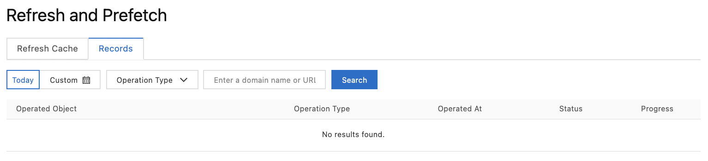{width="3.694996719160105in"
height="0.8427788713910761in"}

## The access control 

In this section, we will study access control to resources by the
following methods:

-   black and white lists of IP addresses or `User-Agent`,

-   remote authentication, which allows requests to be redirected to an
    authentication server,

-   URL signing to protect origin servers and CDNs from unauthorized
    access,

-   hotlink protection which allows to filter requests using a white
    list or a black list of `referer`.

### Configure a blacklist and a whitelist of IP addresses 

The black and white lists are used to filter users. A blacklisted IP
address cannot access the target domain. The IP address can still access
the CDN node, but it will be denied with a HTTP 403 code. These requests
will therefore appear in the request logs.

Conversely, only whitelisted IP addresses can access the target domain.

To create a whitelist or a blacklist:

-   Go to the `CDN `console,

-   Go to the `Domain Names `page,

-   Click on `Manage `on the line of the domain name,

-   Click on `Access Control`,`

-   `Click on the `IP Blacklist/Whitelist `tab,

-   Click on `Modify`,

{width="4.199596456692913in"
height="0.9442607174103237in"}

-   `Type`: select `Blacklist `or `Whitelist`,

-   `Rules`: these are IP addresses or CIDR blocks,

-   Click on `OK`.

{width="2.558057742782152in"
height="2.393837489063867in"}

### Configure a black list and a white list of User-Agent 

To identify, filter and secure requests from the `User-Agent`, you can
create a whitelist or a blacklist.

Requests with a whitelisted `User-Agent `can access the resources,
others cannot.

Requests with a blacklisted `User-Agent` cannot access resources and
receive a HTTP 403 error and are logged in the CDN logs.

These two lists are mutually exclusive: the one configured last has
effect.

To set up a whitelist or blacklist:

-   Go to the `Alibaba Cloud CDN `console,

-   Click on `Domain Names`,

-   Click on `Manage `on the line of the domain name,

-   Click on `Access Control`,

-   Click on the `UserAgent Blacklist/Whitelist `tab,

-   Click on `Modify`,

{width="3.6033956692913387in"
height="0.6350437445319335in"}

-   `Type`: this` `is the type of list (`Whitelist `or
    `Blacklist`),

-   `Rules`: these are the values of the `User Agent`, separated by
    `\|`; the wildcard `\* `is supported,

-   Click on `OK`.

{width="2.5644094488188975in"
height="2.4100699912510937in"}

### Configure remote authentication 

Remote authentication allows client requests to be redirected to a
specified authentication server. This protects CDN resources from
unauthorized access.

To configure remote authentication:

-   Go to the `Alibaba Cloud CDN `console,

-   Click on `Domain Names`,

-   Click on `Manage `on the line of the domain name,

-   Click on `Access Control`,

-   Click on the `Remote Authentication `tab,

-   Enable `Remote Authentication`,

{width="3.723248031496063in"
height="0.5665321522309711in"}

-   Configure the parameters,

-   Click on `OK`.

+-----------------------------------------------------------------------+
| {width="3.363199912510936in"    |
| height="2.413927165354331in"}                                         |
|                                                                       |
| {width="3.3535312773403323in"   |
| height="2.3360859580052495in"}                                        |
|                                                                       |
| {width="3.3847779965004374in"   |
| height="0.9318580489938758in"}                                        |
+=======================================================================+
+-----------------------------------------------------------------------+

### Enable URL signing 

URL signing helps protect origin servers and CDNs from unauthorized
access.

Here\'s how the process works:

-   The origin server provides a signed URL containing authentication
    information.

-   The client sends its request to the CDN using this signed URL.

-   The CDN checks whether the request is valid using the authentication
    information in the URL.

-   If the request is valid, the resource is returned; otherwise, the
    request is rejected with a 403 error.

To enable URL signing:

-   Go to the `Alibaba Cloud CDN `console,

-   Click on `Domain Names`,

-   Click on `Manage `on the line of the domain name,

-   Click on `Access Control`,

-   Click on the `URL Signing `tab,

-   Click on `Modify `next to `URL Signing`,

{width="3.3319805336832897in"
height="2.5185247156605426in"}

-   Enable `URL Signing`,

-   `Type`: this is` `the type of signature; there are three (A, B
    and C),

-   `Primary Key:` this is the primary key used for the selected
    signature type,

-   `Secondary Key:` this is the secondary key for the selected
    signature type,

-   Click on `OK`.

{width="3.2676990376202975in"
height="0.6177362204724409in"}

To generate a signed URL, on the same screen:

-   `Original URL`: this is` `the URL to be signed,

-   `Type:` the type of signature (A, B, or C),

-   `Cryptographic Key`: this is the cryptographic key (primary or
    secondary) specified in the URL signature parameters,

-   `Validity Period`: this is the period of validity of the signed
    URL (in seconds) (30 minutes by default),

For less than 30 minutes, specify a negative value.

-   Click on `Generate`.

{width="1.5486570428696413in"
height="1.9373632983377078in"},

A signed URL and a timestamp are then generated.

### Configure hotlink protection 

Hotlink protection allows to filter requests using a whitelist or a
blacklist of `referrers`.

Requests received by CDNs are validated against their HTTP `referer
`header. In case of failure, a HTTP 403 error is returned.

The blacklist and the whitelist are mutually exclusive: the one
configured last takes effect.

A wildcard character `\* `is automatically added to the entries of
these lists (example: `\*.mywebsite.com `for the entry
`mywebsite.com`).

It is possible to specify whether requests with an empty `referer
`header are validated. This happens if an user enters the URL directly
into the browser address bar.

To configure hotlink protection:

-   Go to the `Alibaba Cloud CDN `console,

-   Click on `Domain Names`,

-   Click on `Manage `on the line of the domain name,

-   Click on `Access Control`,

-   Click `Modify `next to `Hotlink Protection`,

{width="3.642156605424322in"
height="0.6874015748031496in"}

-   `Type`: this` `is the type of list (`Whitelist `or
    `Blacklist`),

-   `Rules`: these are the authorized domain names, separated by a
    line break,

-   Click on `OK`.

{width="2.319009186351706in"
height="2.1883869203849518in"}

## Performance optimization 

In this section, we will study several performance optimization
techniques:

-   intelligent compression, which allows text files to be compressed,

-   page optimization, which removes redundant content from web pages to
    reduce file size,

-   Brotli compression, which allows text files to be compressed more
    efficiently,

-   filtering (retain), which allows to filter the requests to be sent
    to the originating site server.

### Enable smart compression 

Intelligent compression allows text files to be compressed. This
compression changes the MD5 value of the file. MD5 should therefore not
be activated if it is checked.

To enable smart compression:

-   Go to the `CDN `console,

-   Go to the `Domain Names `page,

-   Click on `Manage `on the line of the domain name,

-   Click on `Optimization`,

-   Enable `Inteligent Compression`.

{width="3.3325656167979in"
height="0.43817038495188104in"}

### Enable page optimization 

Page optimization removes redundant content from web pages (comments and
spaces in HTML, CSS or Javascript files) in order to reduce file size.
This compression changes the MD5 value of the file. MD5 should therefore
not be activated if it is checked.

To enable page optimization:

-   Go to the `CDN `console,

-   Go to the `Domain Names `page,

-   Click on `Manage `on the line of the domain name,

-   Click on `Optimization`,

-   Activate `HTML Optimization`, `CSS Optimization `or `Javascript
    Optimization`.

{width="2.9261920384951883in"
height="0.5649179790026246in"}

### Configuring Brotli compression 

Brotli compression is used to compress text files. It is a new
compression algorithm that is 15 to 25% more efficient than intelligent
compression.

Brotli compression is used for requests with a HTTP `Accept-Encoding:
br `header. If the header specifies both zip (`gzip`) and Brotli
(`br`), Brotli compression is used.

To activate Brotli compression:

-   Go to the `Alibaba Cloud CDN `console,

-   Click on `Domain Names`,

-   Click on `Manage `on the line of the domain name,

-   Click on `Optimization`,

-   Activate `Brotli Compression`.

{width="3.2328937007874017in"
height="0.42656167979002624in"}

### Enable filtering 

When a request with a URL containing `? `followed by parameters is
sent to a CDN node, CDN uses a filter to determine whether it should
send it to the originating server.

It is recommended to enable filtering (retain) for URLs with unimportant
parameters and not to enable it for URLs with important parameters. In
the latter case, the CDN will keep different versions for each URL.

To retain parameters in URLs:

-   Go to the `CDN `console,

-   Go to the `Domain Names `page,

-   Click on `Manage `on the line of the domain name,

-   Click on `Optimization`,

-   Click `Modify `in the `Retain Parameters `section,

{width="3.786913823272091in"
height="0.5884919072615923in"}

-   Activate `Parameter Filtering`,

-   `Parameter Filtering`: with parameter filtering, parameters that
    follow the `? `in the URL of a request are ignored by CDN nodes,

This increases the cache hit rate. If no parameter is specified, all
parameters following `? `are ignored.

-   `Retain Specified Parameters`: these are the parameters to be
    retained (10 maximum, separated by `,`),

-   `Retain Origin Parameters`: retains all parameters of the request
    URL during the back-to-origin process,

-   Click on `OK`,

{width="2.277163167104112in"
height="2.2834886264216974in"}

To remove parameters in URLs:

-   Go to the `CDN `console,

-   Go to the `Domain Names `page,

-   Click on `Manage `on the line of the domain name,

-   Click on `Optimization`,

-   Click on `Modify `next to `Parameter Filtering (Delete Specified
    Parameters)`,

{width="3.8412150043744533in"
height="0.5791458880139982in"}

-   Activate `Parameter Filtering`,

-   `Delete Parameters`: this is the list of parameters to be deleted
    (maximum 10 parameters, separated by a space),

-   `Retain Origin Parameters`: all parameters of the URL of a request
    are retained during the back-to-origin process,

-   Click on `OK`.

{width="2.392159886264217in"
height="2.3186964129483814in"}

## The Video service 

In this section, we will study:

-   object chunking, which allows the origin server to send back only
    parts of the requested files,

-   video seeking, which allows to access the specified position in the
    video.

### Configure object chunking 

Object chunking allows the origin server to send back only parts of the
requested files. The interest is to reduce the network traffic at the
back-to-origin level as well as the response time.

In order to use chunking, the origin server must support the HTTP
`Range `header and handle the HTTP 206 (`partal content message`)
status code. Both the request and the response contain the HTTP `Range
`header.

If chunking is disabled, the HTTP connection between the client and the
CDN closes after receiving the response. The retrieved resource is not
cached on the CDN.

To configure object chunking:

-   Go to the `Alibaba Cloud CDN `console,

-   Click on `Domain Names`,

-   Click on `Manage `on the line of the domain name,

-   Click on `Video`,

-   Click `Modify `next to `Object Chunking`,

{width="3.3432633420822397in"
height="0.5922944006999125in"}

-   `Object Chunking`: this is the status of object chunking:

```{=html}
<!-- -->
```
-   `On`: enables Chunking,

With chunking, the origin server returns only pieces of the specified
files.

-   `Off`: disables Chunking,

-   `Force:` redirects all requests containing the `Range` header to
    the origin server,

```{=html}
<!-- -->
```
-   Click on `OK`.

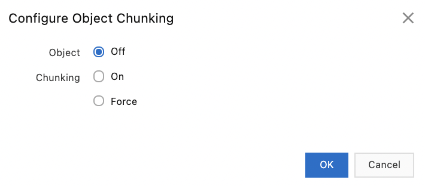{width="2.001065179352581in"
height="0.8794805336832896in"}

### Setting up video search 

Video seeking allows to access a specified position in the video.

The format of the query is
`http://www.mywebsite.com/myvideo.flv?start=10`. The `start
`parameter specifies the position to access.

The server then searches for the keyframe at that position and returns
the content from there. This way the quality of the video is not
degraded. If no keyframe is found, the server looks for the last
keyframe before the specified position.

The origin server must support HTTP `Range `headers. It must also
handle correctly the HTTP 206 status code (partial content).

The supported file formats are MP4 and FLV.

To set up video search:

-   Go to the `Alibaba Cloud CDN `console,

-   Click on `Domain Names`,

-   Click on `Manage `on the line of the domain name,

-   Click on `Video`,

-   Click on `Video Seeking`,

{width="2.9216087051618547in"
height="0.629407261592301in"}

-   To enable time-based searching of FLV files, enable `Time-based FLV
    Seeking`,

-   Click on `Modify `next to `Custom Parameters`,

-   `Start Parameter`: this is` `the name of the start parameter
    (start by default),

-   `End Parameter`: this is` `the name of the end parameter (end by
    default),

-   Click on `OK`.

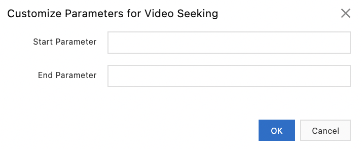{width="1.8211165791776027in"
height="0.7498053368328959in"}

## EdgeScript and EdgeRoutine 

In this section, we will simply define what EdgeScript and EdgeRoutine
are.

### EdgeScript 

EdgeScript allows to run a script in the CDN configuration items to
customize the operation of CDN:

-   A/B testing,

-   authentication,

-   control of request and response headers,

-   cache control,

-   rewriting and redirection,

-   throttling, \...

### EdgeRoutine 

EdgeRoutine (ER) is a serverless environment for executing JavaScript
code on CDNs. This JavaScript code can be deployed with CLI.

EdgeRoutine allows Alibaba Cloud CDN to be customized in serverless
mode, reducing the number of back-to-origin requests and speeding up
content delivery.

## Monitoring 

Resource monitoring collects data on resource usage based on client IP
addresses, geographic locations and ISPs (Internet Service Providers).

Several tools are available for monitoring and analyzing Alibaba Cloud
CDN usage.

To monitor resources:

-   Go to the `Alibaba Cloud CDN `console,

-   Click on `Monitoring & Usage Analytics,`

-   To get metrics on resources (traffic, visits, HTTP codes, \...),
    click on `Resource Monitoring`,

{width="3.2870155293088366in"
height="3.010054680664917in"}

-   To get real time metrics (bandwidth, traffic, requests, \...), click
    on `Real-time Monitoring`.

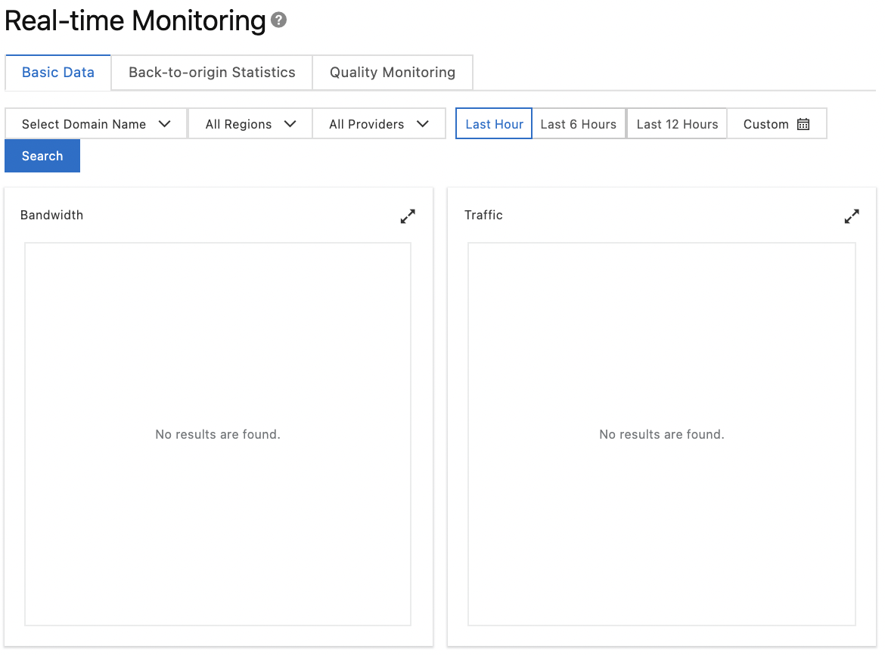{width="3.3648206474190725in"
height="2.4903816710411197in"}

Usage statistics allow the collection of metrics such as:

-   the number of page views (PV),

-   the number of unique visitors (UV),

-   the most used IP addresses (of clients, regions, ISPs)

-   the most used HTTP referer headers,

-   the frequently requested URLs,

-   the most used back-to-origin URLs,

-   the frequently visited domain names.

To display these usage statistics (PV, UV, main IP addresses of clients,
popular URLs, \...):

-   Go to the `Alibaba Cloud CDN `console,

-   Click on `Monitoring & Usage Analytics \| Statistics,`

-   Select the item to monitor and the metric,

-   Click on `Search`.

{width="4.5in"
height="1.9069444444444446in"}

To run queries on network traffic usage, bandwidth usage and number of
requests in a given time slot, for a given domain name or in a given
region:

-   Go to the `Alibaba Cloud CDN `console,

-   Click on `Monitoring & Usage Analytics \| Usage,`

-   Click on `Search`.

{width="4.176829615048119in"
height="2.9766360454943133in"}

To query Alibaba Cloud CDN billing statements:

-   Go to the `Alibaba Cloud CDN `console,

-   Click on `Monitoring & Usage Analytics \| Usage,`

-   Click on the `Bill Query `tab,

-   Select the date or month,

-   Specify a time slot,

-   Click on `Search`.

{width="4.5in"
height="3.5347222222222223in"}

To export a bill:

-   Go to the `Alibaba Cloud CDN `console,

-   Click on `Monitoring & Usage Analytics \| Usage,`

-   Click on the `Bill Export `tab,

-   Select a date or a month,

-   Click on `Create Export Task`,

-   Click on `Download `or `Delete `on the line of the bill.

{width="4.5in" height="0.98125in"}

To export billing details:

-   Go to the `Alibaba Cloud CDN `console,

-   Click on `Monitoring & Usage Analytics \| Usage,`

-   Click on the `Details Export `tab,

-   Click on `Create Task`,

{width="4.5in" height="1.00625in"}

-   Configure the parameters of the export task,

-   Click on `OK`,

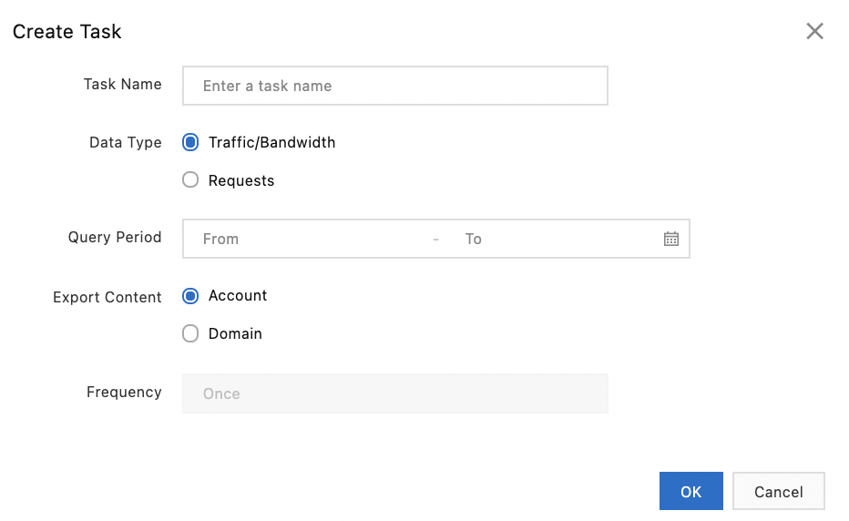{width="2.766119860017498in"
height="1.6976629483814523in"}

-   Click on `Download `or `Delete `on the line of the bill.

To request details on resource plans:

-   Go to the `Alibaba Cloud CDN `console,

-   Click on `Monitoring & Usage Analytics \| Usage,`

-   Click on the `Resource Plans `tab.

{width="3.61630249343832in"
height="0.819248687664042in"}

## The logs 

Alibaba Cloud CDN provides logs to help you resolve issues.

The format of each log file name is
`\<NAME\>\_\<YEAR\>\_\<MONTH\>\_\<DAY\>\_\<START_TIME\>\_\<END_TIME\>\_\<EXTENSION_FIELDS\>.gz.
EXTENSION_FIELD `is optional.

Each line corresponds to an event. The format of each line is:

-   the start time of the event (between `\[ `and `\]`),

-   the IP address of the client,

-   the IP address of the client\'s proxy,

-   the response time (in milliseconds),

-   the header field `referrer`,

-   the query method,

-   the URI of the request,

-   the HTTP status code,

-   the message size of the request (in bytes),

-   the size of the response (in bytes),

-   the state of the cache hit,

-   information about the client\'s proxy,

-   the type of resource requested,

-   the protocol used.

To download the logs:

-   Go to the `Alibaba Cloud CDN `console,

-   Click on `Logs \| Offline Logs`,

-   Select a domain name and a date,

-   Click on `Search`,

-   Click on `Download `on the log file line.

In general, logs are generated within 24 hours and remain available for
30 days. To keep them longer, it is possible to store them in a bucket.
This storage operation is performed automatically by Function Compute.
The Function Compute service must therefore be activated beforehand. It
is then possible to filter and process the events with Function Compute.

To store logs for a long time in a bucket:

-   Go to the `Alibaba Cloud CDN `console,

-   Click on `Logs \| Offline Logs`,

-   Click on the `Log Storage (Function Storage) `tab,

-   Click on `Activate Log Storage`,

{width="3.124192913385827in"
height="1.0582720909886265in"}

-   `Service Name`: this is the name of the service,

-   `OSS Bucket`: this is the bucket where the logs are stored,

-   Click on `Next`,

{width="2.7898873578302714in"
height="1.8797298775153106in"}

-   Click on `Authorize `next to `Service Authorization`,

This operation allows `Function Compute `to write data to the bucket
and execute functions.

-   Click on `Authorize `next to `Trigger Role`,

This transaction authorizes `Alibaba Cloud CDN `to access `Function
Compute`.

-   Select the domain name,

-   Click on `Create`,

{width="2.83378937007874in"
height="2.595452755905512in"}

-   Click on `Done`.
