# CLB 

A CLB (Classical Load Balancer) instance provides a load balancing
service. You have control over their life cycle. The incoming and
outgoing flows pass through this instance. This instance can have an
EIP.

Listeners can be created for different protocols (TCP and UDP for layer
4, HTTP and HTTPS for layer 7) to distribute requests after they have
been checked. ACLs allow to control access to these listeners by using a
whitelist or a blacklist of IP addresses.

Health Checks can be created to verify the availability of the services
of the ECS instances. It is possible to consult the logs on these
operations. Moreover, to avoid that ECS instances are declared healthy
or not healthy too quickly, CLB proposes the concept of time window.

CLB supports the SSL/TSL SNI protocol extension, which allows HTTPS
requests on different domain names to be forwarded to different backend
servers.

You can use different types of certificates: a SSL Certificate, a
third-party certificate or a self-signed CA certificate.

Backend ECS instances are grouped into the Default Server Group or a
VServer Group. These servers can then receive weights and a server group
can be put on hold.

It is possible to perform searches and analysis on access logs. It is
also possible to store them in an OSS bucket and share them with another
RAM user.

To increase availability, you can implement multi-zone deployment.

To increase fault tolerance, you can implement cross-region load
balancing using a Global Traffic Manager instance.

CLB uses the Anti-DDoS Basic service to secure CLB instances, including
the concepts of thresholds and security credit scores.

## The CLB instance 

A CLB (Classic Load Balancer) instance provides a load balancing
service. To create one, you must:

-   create a CLB instance,

-   add listeners,

-   add backend servers.

The CLB instance can work:

-   on the Internet: it has a public IP address,

-   on the intranet: it has a private IP address.

An intranet CLB instance can use a classic or VPC network.

With a conventional network, the IP address is assigned automatically by
Alibaba Cloud. Only conventional ECS instances can be used.

With a VPC network, the IP address is allocated from the CIDR of the
vSwitch to which the ECS instance belongs. Only ECS VPC instances can be
used.

The incoming and outgoing flow goes through the CLB instance.

## The incoming and outgoing flows 

### The incoming flow 

For TCP/UDP and HTTP/HTTPS protocols, incoming traffic must first be
transmitted through the LVS cluster.

For listeners:

-   Layer 4 (UDP or TCP front-end protocol): LVS cluster node servers
    distribute requests directly to ECS instances on the backend,

-   layer 7 (HTTP front-end protocol):

```{=html}
<!-- -->
```
-   the node servers of the LVS cluster distribute requests to the
    Tengine cluster,

-   then the node servers of the Tengine cluster distribute the requests
    to the backend ECS instances,

```{=html}
<!-- -->
```
-   Layer 7 (HTTPS front-end protocol): this is the same as with the
    HTTP protocol except that before the requests are distributed to the
    ECS instances, the certificates are validated by the Key Server and
    the data packets are decrypted.

### The outgoing flow 

If the ECS instances only handle CLB distributed traffic, there is no
need for public bandwidth. An EIP, a NAT gateway or a public IP address
are not required.

If the ECS instances provide external services or if they need to access
the Internet, it is necessary to use a public IP address, an EIP or a
NAT gateway.

Traffic that passes through the Internet is charged, while Intranet
traffic is not.

The outbound traffic of the CLB instances is charged. However, the
traffic between the CLB instances and the ECS backend instances is not.

Outbound traffic from an EIP or NAT gateway is charged. If the ECS
instance has a public IP address, its outbound traffic is charged.

If an ECS backend instance needs to access the Internet, it must have a
public IP address using an EIP or NAT gateway.

## The life cycle of a CLB instance 

To create an IPv4 CLB instance:

-   Go to the Server Load Balancer console,

-   Click on CLB \| Instances,

-   Click on Create CLB,

-   Region: this is the region in which the CLB instance is located,

-   Zone Type:

```{=html}
<!-- -->
```
-   Single zone: the CLB instance is deployed in a single zone only,

-   Multi-zone: the CLB instance is deployed in two zones,

The instance in the primary zone distributes the traffic. If it fails,
the instance in the backup zone automatically takes over the traffic
distribution.

-   Primary Zone: this is the primary zone,

-   Backup Zone: this is the backup zone,

-   Instance Name: this is the name of the instance,

-   Instance Type: this is the type of instance: Internet (it has a
    public IP address) or Intranet (it has a private IP address),

-   Instance Spec: these are the performance specifications of the
    instance,

-   IP version: this is the IP version of the instance (IPv4 or IPv6),

To create an IPv6 instance, select IPv6.

-   Quantity: this is the number of instances to create,

-   Click on Buy Now.

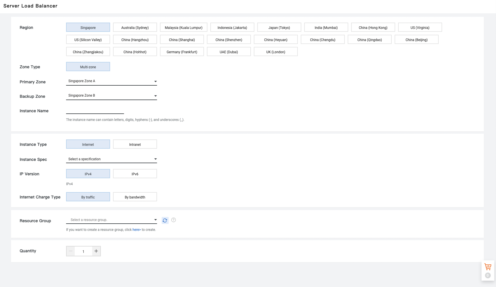{width="4.5in" height="2.607638888888889in"}

IPv6 extends IP addresses from 32 bits to 128 bits.

Only a few zones can create IPv6 instances. Moreover, they must be
performance guaranteed.

Because of the larger size of the IPv6 head, if you are using an UDP
listener on an IPv6 CLB instance, the MTU of the NIC communicating with
the CLB instance on the ECS instance must not be greater than 1480 so
that packets are not discarded due to their size.

To start or stop a CLB instance:

-   Go to the Server Load Balancer console,

-   Click on CLB \| Instances,

-   Select the region,

-   Click on Start or Stop on the line of the instance.

{width="4.5in"
height="1.7222222222222223in"}

To associate a EIP with the ECS instance:

-   Go to the Server Load Balancer console,

-   Click on CLB \| Instances,

-   Select the region,

-   Selection \... \| Bind EIP on the line of the instance (it must be
    of type VPC),

-   IP address: this is the EIP,

-   Click on OK.

{width="2.2299518810148733in"
height="2.039648950131234in"}

To release a CLB instance:

-   Go to the Server Load Balancer console,

-   Click on CLB \| Instances,

-   Click on Release on the line of the instance,

-   Select Release Now or Release on Schedule,

-   Click on Next,

-   Click on OK.

{width="2.4610454943132107in"
height="2.3976202974628174in"}

Billing stops immediately although release operations are performed in
30 minute to 1 hour cycles.

If a CLB instance is overdue, it is added to a list of expired
instances.

It works normally for 24 hours.

After this period, if the payment is not settled, it is stopped and
locked.

After 7 days, it is released.

## Tag association 

Tags are used to classify CLB instances. A tag includes a key and a
value.

A CLB instance can have a maximum of 10 tags.

To add a tag:

-   Go to the Server Load Balancer console,

-   Select CLB \| Instances,

-   Select the region,

-   Click on the instance ID,

-   Select Edit Tags,

-   To create a new tag :

```{=html}
<!-- -->
```
-   Click on New Tag,

-   Enter the key and the value,

-   Click on OK,

```{=html}
<!-- -->
```
-   Click on OK.

To add the tag, click on Saved Tags then select the tag.

{width="2.2822681539807523in"
height="2.2132360017497814in"}

To search for instances using a tag:

-   Go to the Server Load Balancer console,

-   Click on CLB \| Instances,

-   Select the region.

You can select a tag from the Select a tag list.

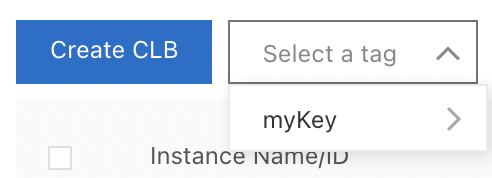{width="1.113043525809274in"
height="0.40268700787401573in"}

To delete a tag:

-   Go to the Server Load Balancer console,

-   Click on CLB \| Instances,

-   Select the region,

-   Click on the instance ID,

-   Select Edit Tags,

-   Click on the cross icon next to the tag,

-   Click on OK.

If the tag is not associated with another instance, it is deleted.

## The Listeners 

The listener checks the connection requests.

CLB supports the:

-   TCP and UDP (layer 4),

-   HTTP and HTTPS (layer 7).

TCP is suitable for cases where reliability requirements are important
and speed can be low (e.g. email, file transmission, classic websites,
\...). UDP is suitable for cases where real time is more important than
reliability (e.g. video conferences, financial quotations, \...).

HTTP is suitable for small websites and mobile games. HTTPS is suitable
for cases where the transmission must be encrypted.

### Add a TCP listener 

To add a TCP listener:

-   Go to the Server Load Balancer console,

-   Select CLB \| Instances,

-   Select the region of the instance,

-   Click on Add Listener on the line of the instance,

-   Configure Listener: this is the type of protocol,

-   Click on Modify to the right of Advanced,

-   Listening Port: this is the listening port that receives requests
    (between 1 and 65535),

-   Listener Name: this is the name of the listener,

-   Scheduling Algorithm: this is the algorithm used:

```{=html}
<!-- -->
```
-   Weighted Round-Robin (WRR): backend servers with a higher weight
    receive more requests than those with a lower weight,

-   Round-Robin (RR): requests are distributed equally and sequentially
    to the backend servers,

-   Consistent Hash (CH), based on the source IP address: the same
    source IP addresses are programmed on the same backend server,

-   Consistent Hash (CH), based on the tuple source IP address /
    destination IP address / source port / destination port: the same
    flows are scheduled on the same backend server,

```{=html}
<!-- -->
```
-   Enable Session Persistence: allows to enable session persistence,

In this case, all session requests from the same client are sent to the
same backend server.

In the case of TCP listeners, requests from the same IP address are sent
to the same backend server.

-   Enable Access Control: enables the access control function,

-   Access Control Method (if Enable Access Control is enabled): this is
    the access control method used:

```{=html}
<!-- -->
```
-   Whitelist: only requests from IP addresses or CIDR blocks on the
    list are forwarded,

This method is suitable for cases where access is limited to certain IP
addresses.

-   Blacklist: requests from IP addresses or CIDR blocks included in the
    list are not forwarded,

This method is suitable for cases where certain IP addresses are denied
access. If the list is empty, all requests are forwarded.

-   Access Control List (if Enable Access Control is activated): this is
    the list used by the white list or the black list,

-   Enable Connection Draining: connections to backend servers continue
    to work normally for a specified period of time after they are
    removed or after a failed Health Check,

-   Enable Peak Bandwidth Limit: enables the peak bandwidth limit (for
    bandwidth-based CLB instances),

By default, all listeners share the bandwidth of the CLB instance.
However, it is possible to limit the traffic passing through the
listeners by defining bandwidth peaks for each listener. The sum of all
these peaks cannot exceed the bandwidth of this instance,

-   Idle Timeout: this is the time of inactivity of the connection (from
    10 to 900 seconds),

-   Obtain Client Source IP Address: allows the backend server to obtain
    the real IP address of the client,

-   Automatically Enable Listener after Creation: allows to
    automatically activate the listener after its creation,

-   Click on Next,

{width="3.3137915573053367in"
height="5.12665791776028in"}

-   Forward Requests To: it is possible to use the default server group
    configured for the instance (Default Server Group), to configure a
    server group (VServer Group) or a group of active/standby servers
    (Primary/Secondary Server Group),

For the following, let\'s suppose that we choose Default Server Group.

-   Click on Add More,

-   Select the ECS instances,

-   Click on Next,

-   Configure weight and port:

```{=html}
<!-- -->
```
-   Port: this is the open port on the backend server (from 1 to 65535),

-   Weight: this is the weight of the backend server,

The higher the weight, the more requests it receives. If the weight is
0, no requests are received.

-   Click on Add,

-   Click on Next,

{width="4.5in"
height="2.752083333333333in"}

-   Click on Modify next to Advanced to modify the Health Check
    configuration,

Health Check improves service availability by detecting backend server
failures.

-   Click on Next,

-   Click on Submit,

-   Click on OK.

### Add a UDP listener 

Because of the larger size of the IPv6 head, if you are using a UDP
listener on an IPv6 CLB instance, the MTU of the NIC communicating with
the CLB instance on the ECS instance must not be greater than 1480 so
that packets are not discarded due to their size.

To add a UDP listener, proceed in the same way as for adding a TCP
listener, except for the following points.

First of all, the CH (Consistency Hash) algorithm includes in addition
to Source IP and Tuple the QUIC ID choice. This is a consistent hash
based on the QUIC Connection ID. The same QUIC Connection IDs are
programmed on the same backend server.

In addition, the Enable Session Persistence, Idle Timeout and Listener
Name parameters are not available.

### Add a HTTP listener 

To add a HTTP listener:

-   Go to the Server Load Balancer console,

-   Select CLB \| Instances,

-   Select the region of the instance,

-   Click on Configure Listener on the line of the instance,

-   Select Listener Protocol: this is the type of protocol (HTTP here),

-   Listening Port: this is the listening port that receives requests
    (between 1 and 65535),

-   Listener Name: this is the name of the listener,

-   Click on Modify next to Advanced,

-   Scheduling Algorithm: this is the algorithm used:

```{=html}
<!-- -->
```
-   Weighted Round-Robin (WRR): backend servers with a higher weight
    receive more requests than those with a lower weight,

-   Round-Robin (RR): requests are distributed equally and sequentially
    to the backend servers,

```{=html}
<!-- -->
```
-   Redirection: allows to transfer or not the traffic from the HTTP
    listener to a HTTPS listener,

-   Enable Session Persistence: allows to activate the session
    persistence. Both methods are possible:

In this case, all requests of the same client session are sent to the
same server backend. Persistence is based on cookies.

-   Insert cookie: CLB adds a cookie (SERVERID) at the first response of
    the backend server. For the following requests, CLB retrieves this
    cookie and distributes the requests to the same backend server. The
    value of the timeout period must be specified,

-   Rewrite cookie: vou set the cookie yourself in the HTTP response.
    You only have to define the timeout period and manage the life cycle
    of the cookie yourself on the backend server,

```{=html}
<!-- -->
```
-   Enable Access Control: enables the access control function,

-   Access Control Method (if Enable Access Control is enabled): this is
    the access control method used:

```{=html}
<!-- -->
```
-   Whitelist: only requests from IP addresses or CIDR blocks on the
    list are forwarded,

This method is suitable for cases where access is limited to certain IP
addresses.

-   Blacklist: requests from IP addresses or CIDR blocks included in the
    list are not forwarded,

This method is suitable for cases where certain IP addresses are denied
access. If the list is empty, all requests are forwarded.

-   Access Control List (if Enable Access Control is activated): this is
    the list used by the whitelist or the blacklist,

-   Enable Peak Bandwidth Limit: enables the Peak Bandwidth Limit (for
    bandwidth-based CLB instances),

By default, all listeners share the bandwidth of the CLB instance.
However, it is possible to limit the traffic passing through the
listeners by defining bandwidth peaks for each listener. The sum of all
these peaks cannot exceed the bandwidth of this instance.

-   Idle Timeout: this is the time of inactivity of the connection (from
    10 to 900 seconds),

-   Request Timeout: this is the time the request is waiting for (1 to
    180 seconds),

After this time without a response from the backend server, the CLB
instance stops waiting and sends a HTTP 504 error code to the client.

-   Enable Gzip Compression: allows to activate or not the Gzip
    compression. Gzip supports text/xml, text/plain, text/css,
    application/javascript, application/x-javascript,
    application/rss+xml, application/atom+xml and application/xml file
    types,

-   Add HTTP Header Fields: these are the custom HTTP headers added:

```{=html}
<!-- -->
```
-   X-Forwarded-For to get the source IP address of the client,

-   SLB-ID to retrieve the ID of the CLB instance,

-   SLB-IP to get the public IP address of the CLB instance,

-   X-Forwarded-Proto to retrieve the listening protocol used by the CLB
    instance,

```{=html}
<!-- -->
```
-   Obtain Client Source IP Address: allows the backend server to obtain
    the real IP address of the client,

-   Automatically Enable Listener after Creation: allows to
    automatically activate the listener after its creation,

-   Click on Next,

+-----------------------------------------------------------------------+
| {width="2.9753543307086616in"   |
| height="2.5901202974628172in"}                                        |
|                                                                       |
| {width="3.002288932633421in"    |
| height="3.6296216097987752in"}                                        |
+=======================================================================+
+-----------------------------------------------------------------------+

-   Forward Requests To: it is possible to use the default server group
    configured for the instance (Default Server Group) or to configure a
    group of servers (VServer Group),

For the following, let\'s suppose that we choose Default Server Group.

-   Click on Add more,

-   Select the ECS instances,

-   Click on Add,

-   Configure weight and port:

```{=html}
<!-- -->
```
-   Port: this is the open port on the backend server (from 1 to 65535),

-   Weight: this is the weight of the backend server,

The higher the weight, the more requests it receives. If the weight is
0, no requests are received.

-   Click on Next,

{width="4.5in"
height="2.752083333333333in"}

-   Click on Modify to modify the Health Check configuration,

The Health Check improves the availability of services by detecting
backend server failures.

-   Click on Next,

-   Click on Submit,

-   Click on OK.

### Add a HTTPS listener 

HTTPS uses a server certificate or a CA certificate that you must
upload. The possibilities are:

-   Server certificate: identifies the server,

Upload it to CLB\'s Certificate Management system. The client uses it to
check if the certificat sent by the server is issued by a trusted center.
It enables one-way and mutual authentication.

-   Client certificate (client certificate): identifies the client,

Install the certificate on the client. This proves the client user\'s
identity. It is possible to sign a client certificate with a self-signed
CA certificate. It allows mutual authentication.

-   CA certificate (CA certificate): authenticates the signature on the
    client certificat.

This starts a secure connection. Upload it to the CLB instance. It
enables mutual authentication.

The uploaded certificat must be in PEM format. It takes up to 3 minutes
to process.

HTTPS listeners do not support SNI (Server Name Indication). In order to
use it, you must use TCP listeners and then configure SNI on the ECS
backend instances.

The retention time for HTTPS listener session tickets is 300 seconds.

To add a HTTPS listener:

-   Go to the Server Load Balancer console,

-   Select CLB \| Instances,

-   Select the region of the instance,

-   Click on Configure Listener on the line of the instance,

-   Select Listener Protocol: this is the type of protocol (HTTPS here),

-   Listening Port: this is the listening port that receives requests
    (between 1 and 65535),

-   Listener Name: this is the name of the listener,

-   Scheduling Algorithm: this is the algorithm used:

```{=html}
<!-- -->
```
-   Weighted Round-Robin (WRR): backend servers with a higher weight
    receive more requests than those with a lower weight,

-   Round-Robin (RR): requests are distributed equally and sequentially
    to the backend servers,

```{=html}
<!-- -->
```
-   Enable Session Persistence: allows to activate the session
    persistence ; both methods are possible:

In this case, all requests of the same client session are sent to the
same server backend. Persistence is based on cookies.

-   Insert cookie: CLB adds a cookie (SERVERID) at the first response of
    the backend server,

For the following requests, CLB retrieves this cookie and distributes
the requests to the same backend server. The value of the timeout period
must be specified.

-   Rewrite cookie: you set the cookie yourself in the HTTP response,

You only have to define the timeout period and manage the life cycle of
the cookie yourself on the backend server.

-   Enable HTTP/2: allows to activate HTTP 2.0,

-   Enable Access Control: enables the access control function,

-   Access Control Method (if Enable Access Control is enabled): this is
    the access control method used:

```{=html}
<!-- -->
```
-   Whitelist: only requests from IP addresses or CIDR blocks on the
    list are forwarded,

This method is suitable for cases where access is limited to certain IP
addresses.

-   Blacklist: requests from IP addresses or CIDR blocks included in the
    list are not forwarded,

This method is suitable for cases where certain IP addresses are denied
access. If the list is empty, all requests are forwarded.

-   Access Control List (if Enable Access Control is activated): this is
    the list used by the white list or the black list,

-   Enable Peak Bandwidth Limit: enables the peak bandwidth limit (for
    bandwidth-based CLB instances).

By default, all listeners share the bandwidth of the CLB instance.
However, it is possible to limit the traffic passing through the
listeners by defining bandwidth peaks for each listener. The sum of all
these peaks cannot exceed the bandwidth of this instance.

-   Idle Timeout: this is the time of inactivity of the connection (from
    10 to 900 seconds),

-   Request Timeout: this is the time the request is waiting for (1 to
    180 seconds),

After this time without a response from the backend server, the CLB
instance stops waiting and sends a HTTP 504 error code to the client.

-   Enable Gzip Compression: allows to activate or not the Gzip
    compression. Gzip supports text/xml, text/plain, text/css,
    application/javascript, application/x-javascript,
    application/rss+xml, application/atom+xml and application/xml file
    types,

-   Add HTTP Header Fields: these are the custom HTTP headers added:

```{=html}
<!-- -->
```
-   X-Forwarded-For to get the source IP address of the client,

-   SLB-ID to retrieve the ID of the CLB instance,

-   SLB-IP to get the public IP address of the CLB instance,

-   X-Forwarded-Proto to retrieve the listening protocol used by the CLB
    instance,

```{=html}
<!-- -->
```
-   Obtain Client Source IP Address: allows the backend server to obtain
    the real IP address of the client,

-   Automatically Enable Listener after Creation: allows to
    automatically activate the listener after its creation,

-   Click on Next,

-   Select Server Certificate: select the server certificate or click on
    Create Server Certificate to purchase or upload one,

{width="3.3031364829396326in"
height="3.868441601049869in"}

You must first have purchased or uploaded a certificate in the SSL
Certificates console. This is what the certificate purchase page looks
like:\
\
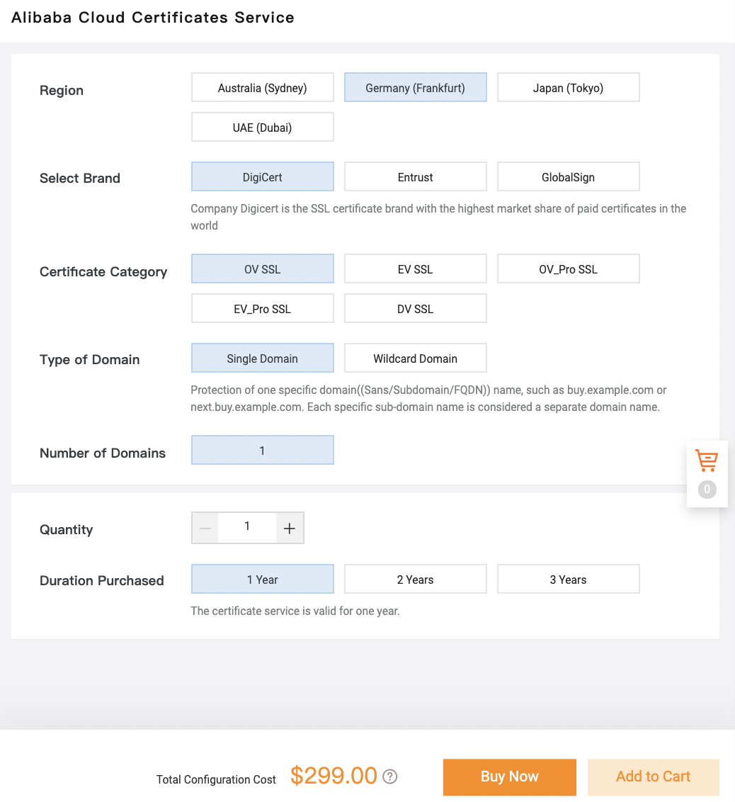{width="2.5106594488188976in"
height="2.7380905511811022in"}

-   Click on Modify next to Advanced,

-   Activate Enable Mutual Authentication,

-   Select CA Certificate: select the CA certificate or click on Create
    CA Certificate to purchase or upload one,

-   TLS Security Policy: this is the TLS security policy. The supported
    values are:

It contains the available versions of the TLS protocol and the suites of
supported encryption algorithms. Only the guaranteed-performance
instances allow to choose the TLS security policy to use.

-   tls_cipher_policy_1\_0: ensures the best compatibility and but the
    security is weaker (1.0),

-   tls_cipher_policy_1\_1: ensures good compatibility and security
    (1.1),

-   tls_cipher_policy_1\_2: ensures good compatibility and high security
    level (1.2),

-   tls_cipher_policy_1\_2_strict: supports only direct security cipher
    suites and very high security level (1.2),

-   tls_cipher_policy_1\_2_strict_with_1\_3: supports only direct
    security cipher suites with very high security level (1.2 and 1.3),

```{=html}
<!-- -->
```
-   Click on Next,

{width="3.4017311898512688in"
height="3.028485345581802in"}

-   Forward Requests To: it is possible to use the default server group
    configured for the instance, to configure a server group (VServer
    Group) or a group of active/pending servers,

For the following, let\'s suppose that we choose Default Server Group.

-   Click on Add more,

-   Select the ECS instances,

-   Click on Next,

-   Configure weight and port:

```{=html}
<!-- -->
```
-   Port: this is the open port on the backend server (from 1 to 65535),

-   Weight: this is the weight of the backend server,

The higher the weight, the more requests it receives. If the weight is
0, no requests are received.

-   Click on Add,

-   Click on Next,

-   Click on Modify to modify the Health Check configuration,

The Health Check improves the availability of services by detecting
backend server failures.

-   Click on Submit,

-   Click on OK.

### Install multiple SSL certificates on a single IP address 

Guaranteed-performance HTTPS listeners support multiple certificats
configuration. It allows requests on different domain names to be
forwarded to different backend servers.

SNI (Server Name Indication) is an extension of the SSL/TLS protocol
that allows a server to install multiple SSL certificates on a single IP
address. The certificate configured for each domain name is used. If
none is specified, the HTTPS listener\'s certificate is used.

Only CLB instances with guaranteed performance support the SNI. To do
this, use the domain name extension.

To add a certificate to a domain name:

-   Go to the Server Load Balancer console,

-   Select CLB \| Instances,

-   Click on the ID of the CLB instance,

-   Click on the Listener tab,

-   Select Manage Additional Certificate on the line of the listener,

We assume that a listener has already been set up on this CLB instance.

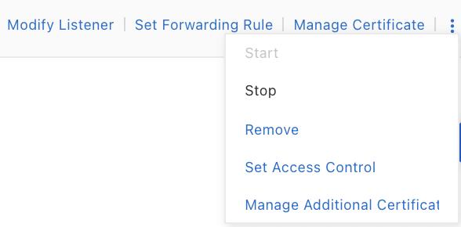{width="1.832001312335958in"
height="0.9035378390201225in"}

-   Click on Add Additional Certificate,

-   Additional Certificate: this is the domain name (example:
    www.mywebsite.com) or with a wildcard (example: \*.mywebsite.com),

The domain name in the certificate must be the same as the one added in
the domain name extension.

-   Select Server Certificate: this is the certificate associated with
    the domain name,

-   Click on OK,

{width="3.4627504374453193in"
height="2.1123851706036745in"}

-   Click Configure Rule,

{width="2.705333552055993in"
height="1.0337051618547681in"}

-   Click on Add Forwarding Rules,

-   Configure the rules,

-   Click on Add Forwarding Rules,

-   Click on the cross to close the popup.

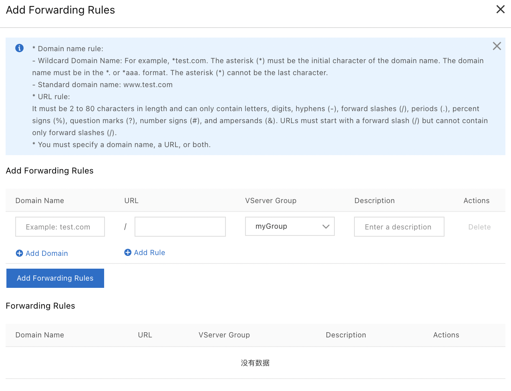{width="3.430854111986002in"
height="2.6297911198600175in"}

To change the forward rules:

-   Go to the Server Load Balancer console,

-   Select CLB \| Instances,

-   Click on the ID of the CLB instance,

-   Click on the Listener tab,

-   Click on Set Forwarding Rule on the line of the listener.

To change the certificate for a domain name:

-   Go to the Server Load Balancer console,

-   Select CLB \| Instances,

-   Click on the ID of the CLB instance,

-   Click on the Listener tab,

-   Select Manage Additional Certificate on the line of the listener,

-   Click on Edit on the domain name extension line,

-   Select Server Certificate: this is the new certificate,

-   Click on OK.

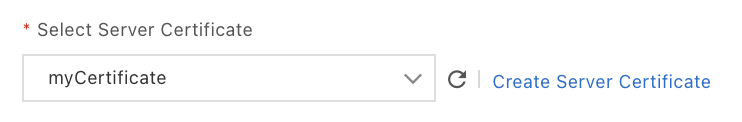{width="2.5304811898512685in"
height="0.4158902012248469in"}

To remove a certificate from a domain name:

-   Go to the Server Load Balancer console,

-   Select CLB \| Instances,

-   Click on the ID of the CLB instance,

-   Click on the Listener tab,

-   Select Manage Additional Certificate on the line of the listener,

-   Click on \... \| Remove on the line of the domain name extension,

-   Click on OK.

## The Health Check 

The CLB instance checks the availability of the services of the ECS
instances by performing Health Checks.

If an ECS instance is unhealthy, CLB stops distributing requests to that
instance until it becomes healthy again.

If the service has a lot of traffic, these Health Check operations can
have an impact on the service. To reduce this impact, it may be
appropriate to increase the interval between checks.

Data transmission and Health Checks are processed simultaneously by the
node servers of the LVS cluster and the Tengine cluster. If an unhealthy
state is detected on an instance, all servers in the cluster are
informed.

The Health Checks are performed on the IP address range 100.64.0.0/10.
This range is therefore blocked on the backend servers at the Security
Groups level. However, if you use iptables or an equivalent, you must
allow the CIDR block 100.64. 0.0/10.

For HTTP and HTTPS listeners (layer 7), the Health Check is performed by
sending HTTP requests of type HEAD by CLB.

For HTTPS listeners, the data transmitted is not in HTTPS in order to
improve performance.

The HTTP and HTTPS (Layer 7) Health Check process is as follows:

-   The Tengine node server sends a HTTP HEAD request to
    \<IP_ADDRESS\>:\<PORT\>\<HEALTH_PATH\>.

-   The backend server returns a HTTP status code.

-   If the Tengine node server does not receive a response within the
    timeout, the ECS instance is declared unhealthy.

-   If it receives it in time, it compares the returned HTTP status code
    with the one specified in the lister configuration.

-   If the code is the same, the ECS instance is declared healthy;
    otherwise, it is declared unhealthy.

The TCP Health Check process is as follows:

-   The LVS node server sends a TCP SYN packet to
    \<IP_ADDRESS\>:\<HEALTH_PORT\> of the ECS instance.

-   If this port is listening normally, the server returns a TCP SYN and
    ACK packet.

-   If the server of the LVS node does not receive data within the
    timeout period, the ECS instance is declared unhealthy.

-   If the data is received on time, the ECS instance is declared
    healthy.

-   The LVS node server then sends an RST data packet to the ECS
    instance to terminate the TCP connection.

UDP listeners are based on the detection of a UDP packet. Here is the
process:

-   The LVS node server sends a UDP packet to
    \<IP_ADDRESS\>:\<HEALTH_PORT\>.

-   If the corresponding port of the ECS instance is not listening
    normally, the server returns an ICMP error message port XXX
    unreachable.

-   If the LVS node server receives the ICMP error message within the
    timeout period, the ECS instance is declared unhelathy; otherwise,
    it is declared healthy.

On Linux, setting up anti-ICMP protection can slow down the sending of
ICMP messages. In this case, the ICMP error message may arrive too late,
after the CLB instance has declared the ECS instance healthy. The
solution is to use custom requests and responses.

### The time window 

To avoid that Health Checks declare ECS instances healthy or unhleathy
too quickly, this state is declared only after a certain number of
Health Check failures or successes.

This time window is based on:

-   Health Check interval: this is the frequency of the Health Check,

-   Response timeout: this is the waiting time for the response,

-   Health Check threshold: this is the number of consecutive successful
    or failed Health Checks.

The calculation method for the time window for:

-   a failed Health Check: Response Timeout x Unhealthy Threshold +
    Health Check Interval x (Unhealthy Threshold) -1),

-   a successful Health Check: (Response Time x Healthy Threshold) +
    Health Check Interval x (Healthy Threshold-1).

The response time is the time between when the Health Check request is
sent and when the response is received.

If an ECS instance is in healthy state, it receives the requests. If it
is in unhealthy state, it does not receive them. But if the ECS instance
is in the unhealthy time window, it still receives the requests. They
will then fail.

### Add a Health Check 

To set up a Health Check:

-   Go to the Server Load Balancer console,

-   Select CLB \| Instances,

-   Select the region,

-   Click on the ID of the CLB instance,

-   Click on the Listener tab,

-   Click on Modify Listener on the line of the listener,

-   Click twice on Next,

-   Click on Modify next to Advanced,

For TCP listeners, TCP and HTTP Health Checks are supported. The TCP
Health Check is based on the detection of the network layer. The HTTP
Health Check is based on sending HEAD requests.

-   Health Check Method: this is the method for the Health Check (by
    default HEAD),

If the backend server does not support the HEAD method, it is necessary
to specify the GET method. In this case, if the response exceeds 8 Kb,
it is truncated.

-   Health Check Port: this is the detection port used by the Health
    Check,

By default, this port is configured in the listener.

-   Health Check Path and Health Check Domain Name (Optional): this is
    the address to which the Health Check is sent,

By default, CLB sends a HTTP HEAD request to the home page of the web
server. To use another one, you just have to specify the URL.

Some Web servers check the host field of the request. It is therefore
necessary to add it. If a domain name is configured in the Health Check,
CLB automatically adds it to the host field during requests. It is
therefore necessary to configure a domain name.

-   Normal Status Code: this is the HTTP status code indicating that the
    Health Check is normal (by default http_2xx and http_2xx) (only for
    the HTTP Health Check),

-   Response Timeout: this is the time it takes to get a response from a
    Health Check (from 1 to 300 seconds).

After this time, the Health Check fails. The default value is 10 seconds
for UDP listeners and 5 seconds for HTTP/HTTPS/TCP listeners.

-   Health Check Interval: this is the time interval between two
    consecutive Health Checks (from 1 to 50 seconds),

The Health Check time of each server in the node is not synchronized.
The default value is 5 seconds for UDP listeners and 2 seconds for
HTTP/HTTPS/TCP listeners.

-   Unhealthy Threshold: this is the number of successful Health Checks
    that must occur consecutively for an ECS instance to be declared
    healthy,

-   Unhealthy Threshold: this is the number of consecutive Health Check
    failures performed by the same LVS node server on the same ECS
    instance (from 2 to 10). The default value is 3,

-   Click on Next,

-   Click on Submit.

{width="2.5973195538057743in"
height="2.7528379265091862in"}

### Remove a Health Check

Only HTTP and HTTPS Health Checks can be closed.

It is not recommended to close a Health Check because the requests could
be distributed to unhelathy ECS instances.

To close a Health Check:

-   Go to the Server Load Balancer console,

-   Select CLB \| Instances,

-   Select the region,

-   Click on the ID of the CLB instance,

-   Click on the Listener tab,

-   Click on Modify Listener on the line of the listener,

-   Click twice on Next,

-   Disable Enable Health Check,

-   Click on Next,

-   Click on Submit.

{width="2.5400535870516188in"
height="2.6721522309711285in"}

## The backend servers 

Before creating a CLB instance, you must create ECS instances in the
same region to use them as backend servers. You can group these backend
servers into a virtual server group (VServer group).

Different listeners can be used within a VServer Group.

When a VServer Group is used, requests are forwarded to the ECS
instances belonging to it rather than to the ECS instances of the
default server group.

The ECS and CLB instances must be in the same region.

ECS instances may have a different operating system although it is a
good practice to use the same one to simplify their management.

A CLB instance can use up to 50 listeners.

The listening ports of a CLB instance correspond to the open ports on
the ECS instance.

Each ECS instance can have a weight. ECS instances with a higher weight
will receive more requests.

If the distribution of requests is not uniform:

-   The session persistence feature can unbalance the distribution of
    requests on ECS instances. In this case, the solution is to disable
    it.

-   Collect website access logs over a period of time.

-   Check that the number of logs of the ECS instances matches the CLB
    configuration.

-   If session persistence is enabled, logs for the same IP address must
    be deleted.

-   If weights are configured, check that the log percentage is
    consistent with the weight.

A default server group contains the ECS instances that receive the
requests. If a listener is not associated with a VServer Group or an
active/standby server group, the requests are forwarded to the ECS
instances of the default server group.

An active/standby server group contains only two ECS instances:

-   the active server,

-   the backup server: no Health Check is performed on this instance.

When the active server is declared unhealthy, the traffic is forwarded
to the standby server. When it becomes healthy again, it receives the
traffic again.

Only TCP and UDP (Layer 4) listeners support active/standby server
groups.

VServer Groups allow you to:

-   distribute different requests to different backend servers,

-   configuring transfer rules based on domain names or URLs.

### The default server group 

To add ECS instances to the default server group:

-   Go to the Server Load Balancer console,

-   Select CLB \| Instances,

-   Select the region,

-   Click on the instance ID,

-   Click on Default Server Group,

-   Click on Add,

-   Select the ECS instances to add,

-   Click on Next,

-   Specify the weight of each ECS instance,

-   Click on Add,

-   Click on OK.

{width="4.5in"
height="1.4597222222222221in"}

The higher the weight, the more requests the instance receives. If the
weight is 0, the instance does not receive any requests.

To change the weight of several servers in batch, change the weight of
the current server and then click on one of the icons:

-   on the first one so that the weight of the servers below is
    modified,

-   on the second one so that the weight of the servers above is
    modified,

-   on the third one so that the weight of all servers is changed,

-   on the fourth one so that the weight is erased.

To change the weight of a backend server:

-   Go to the Server Load Balancer console,

-   Select CLB \| Instances,

-   Select the region,

-   Click on the ID of the CLB instance,

-   Click on the Default Server Group tab,

-   Click on the pencil icon of the server,

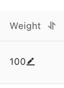{width="0.36253171478565177in"
height="0.49985454943132107in"}

-   Change the weight,

-   Click on OK.

To remove a backend server:

-   Go to the Server Load Balancer console,

-   Select CLB \| Instances,

-   Select the region,

-   Click on the ID of the CLB instance,

-   Click on the Default Server Group tab,

-   Click on Remove on the line of the instance.

### The VServer Group 

A VServer Group is a group of ECS instances. If a VServer Group is
associated with a listener, the listener distributes the requests to the
ECS instances of this group.

The transfer of requests follows the following logic:

-   If the requests match a forwarding rule, they are distributed to the
    VServer Group associated with the rule.

-   If no forwarding rule matches and a VServer Group is configured on
    the listener, requests are distributed to the VServer Group
    associated with the listener.

-   If no VServer Group is configured on the listener, requests are
    forwarded to the ECS instances in the default server group.

To create a VServer Group:

-   Go to the Server Load Balancer console,

-   Select CLB \| Instances,

-   Select the region,

-   Click on the instance ID,

-   Click on the VServer Groups tab,

-   Click on Create VServer Group,

-   VServer Group Name: this is the name of the group,

-   Click on Add,

-   Select the instances to add,

-   Click on Next,

-   Port: this is the port of the ECS instance that receives the
    requests,

-   Weight: this is the weight of the ECS instance,

The higher the weight, the more requests the instance receives. If the
weight is 0, the ECS instance receives no requests.

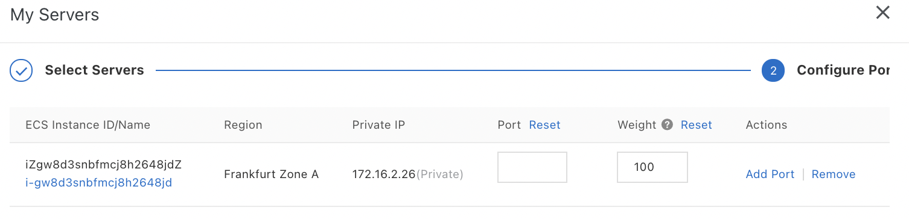{width="4.5in" height="1.0875in"}

-   Click on Add,

-   Click on Create.

To change the weight of several servers in batch, change the weight of
the current server and then click on one of the icons:

-   on the first one so that the weight of the servers below is
    modified,

-   on the second one so that the weight of the servers above is
    modified,

-   on the third one so that the weight of all servers is changed,

-   on the fourth one so that the weight is erased.

The ECS instances must be in the same region as the CLB instance and the
VServer Group.

An ECS instance can be added to multiple VServer Groups.

A VServer Group can be associated with several listeners.

To modify a VServer Group:

-   Go to the Server Load Balancer console,

-   Select CLB \| Instances,

-   Select the region,

-   Click on the instance ID,

-   Click on the VServer Groups tab,

-   Click on Edit on the line of the group,

-   Change the port and weight of the ECS instance,

-   Click on Save.

To delete a VServer Group:

-   Go to the Server Load Balancer console,

-   Select CLB \| Instances,

-   Select the region,

-   Click on the instance ID,

-   Click on the VServer Groups tab,

-   Click on Delete on the line of the group,

-   Click on OK.

### Putting it on standby

The active/standby server group consists of one backend server acting as
an active server and another as a standby server.

When the active server is healthy, it receives requests. When it is
unhealthy, the requests are distributed to the second server, waiting.

No healthy check is performed on the standby server.

Only TCP and UDP listeners (Layer 4) support the configuration of
active/standby server groups.

To create an active/standby server group:

-   Go to the Server Load Balancer console,

-   Select CLB \| Instances,

-   Select the region,

-   Click on the ID of the CLB instance,

-   Click on the Primary/Secondary Server Groups tab,

-   Click on Create Primary/Secondary Server Group,

-   Primary/Secondary Server Group Name: this is the name of the group,

-   Click on Add,

-   Select the instances to add (up to two ECS instances can be added to
    the group),

-   Click on Next,

-   Port: this is the port of the ECS instance that receives the
    requests,

To add another port, click on Add Port.

-   Click on Add,

-   In the column Type, check the line of the ECS instance that plays
    the role of server,

-   Click on Create.

To delete an active/pending server group:

-   Go to the Server Load Balancer console,

-   Select the region,

-   Click on the instance ID,

-   Click on the Primary/Secondary Server Groups tab,

-   Click on Delete on the line of the group to be deleted,

-   Click on OK.

## Management of the Certificates

You can use three types of certificates with CLB instances:

-   SSL Certificate certificates,

-   third-party certificates,

-   self-signed CA certificates.

However, only certificates in PEM format are supported.

In the case of using a certificat issued by a root CA, this is the only
certificat to upload to the CLB instance. The format of this certificate
must start with \-\-\-\-- BEGIN CERTIFICATE \-\-\-\-- and end with
\-\-\-\-- END CERTIFICATE \-\-\-\--.

If you use a certificate issued by an intermediate CA, you get two
certificates.

Place the server certificat first, then the immediate certificat. The
result looks like this:

\-\-\-\-- BEGIN CERTIFICATE \-\-\-\--

\-\-\-\-- END CERTIFICATE \-\-\-\--

\-\-\-\-- BEGIN CERTIFICATE \-\-\-\--

\-\-\-\-- END CERTIFICATE \-\-\-\--

\-\-\-\-- BEGIN CERTIFICATE \-\-\-\--

\-\-\-\-- END CERTIFICATE \-\-\-\--

Upload the certificate chain to the CLB instance.

In addition to uploading the server certificate, the private RSA key of
the certificat must be uploaded. This usually has the following format:

\-\-\-\-- BEGIN RSA PRIVATE KEY \-\-\-\--

\...

\-\-\-\-- END RSA PRIVATE KEY \-\-\-\--

Or:

\-\-\-\-- BEGIN ENCRYPTED PRIVATE KEY \-\-\-\--

\...

\-\-\-\-- END ENCRYPTED PRIVATE KEY \-\-\-\--

Convert the private key key.pem to new_key.pem:

openssl rsa -in key.pem -out new_key.pem

To configure a HTTPS listener, you can:

-   directly use a certificat found in the SSL Certificate service: alerts
    are sent just before the certificat expires; client CA certificates
    are not supported,

-   upload the third-party certificat and CA certificate to the CLB
    instance: both the public and private key files for the certificate
    are required; both server HTTPS and client CA certificates are
    supported,

-   use a self-signed CA certificate.

It is then no longer necessary to use certificates on the backend
servers.

A certificate cannot be used in multiple regions. For a certificate to
work in multiple regions, those regions must be selected when the
certificat is created.

It is very strongly recommended that the certificat be replaced before it
expires.

### Use a SSL Certificate 

The first way we have seen to configure a HTTPS listener is to use the
SSL Certificate service. This issues certificats from different providers.
It provides a uniform way to manage the lifecycle of certificats. SSL
Certificate allows to purchase a certificat or upload a third-party
certificat.

To select a certificat from the SSL Certificate service:

-   Go to the Server Load Balancer console,

-   Select CLB \| Certificates,

-   Click on Create Certificate,

-   Select Alibaba Cloud Certificates,

-   Select the region in which to deploy the certificate,

-   Select the SSL certificate to use,

-   Click on Create.

### Use a third-party certificate 

The second way we have seen to configure a HTTPS listener is to upload a
third-party certificat and the CA certificate to the SLB instance. It is
necessary to have the public and private key files for the certificate.
HTTPS server and client CA certificates are supported.

To upload a third party certificate:

-   Go to the Server Load Balancer console,

-   Select CLB \| Certificates,

-   Click on Create Certificate,

-   Click on Upload Third-party Certificate,

-   Click on Next,

-   Certificate Name: this is the name of the certificat,

-   Certificate Type: this is the type of certificate:

```{=html}
<!-- -->
```
-   Server Certificate: this is used for one-way HTTPS authentication,

Only the server certificate and the private key are required.

-   CA Certificate: this is used for HTTPS mutual authentication,

The server certificate and the CA certificate are required.

-   Public Key Certificate: this is the content of the certificat,

-   Private Key: this is the content of the private key of the server
    certificate,

-   Region: this is the region in which the certificat is uploaded,

-   Click on Create.

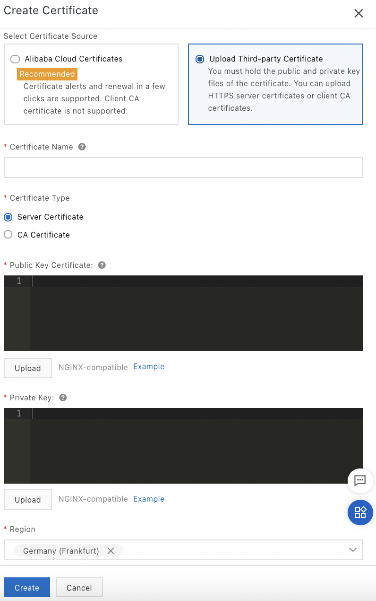{width="2.5504133858267717in"
height="4.069248687664042in"}

### Use a self-signed CA certificate 

The third way we have seen to configure a HTTPS listener is to use a
self-signed CA certificate. To generate such a CA certificate, we can
use Open SSL.

Create a directory data containing the following directories:

-   certificate: contains the certificate signed by a CA certificate,

-   private_key: contains the private key of the CA certificate.

#### Preparation of the environment

Start by creating the following directories:

mkdir -p data/certificate data/private_key data/users

Then create an openssl.conf configuration file with the following
content:

cat \<\<EOF\> data/openssl.conf

\[ca\]

default_ca = foo

\[foo\]

dir = /data

database = /data/index.txt

new_certs_dir = /data/certificate

certificate = /data/private_key/ca.crt

serial = /data/serial

private_key = /data/private_key/ca.key

RANDFILE = /data/private_key/.rand

default_days = 365

default_crl_days = 30

default_md = md5

unique_subject = no

policy = policy_any

\[policy_any\]

countryName = match

stateOrProvinceName = match

organizationName = match

organizationalUnitName = match

localityName = optional

commonName = supplied

emailAddress = optional

EOF

Check that the file has been created:

ls -l data/openssl.conf

For convenience, rather than installing openssl locally, we will use a
Docker nginx container, which already has openssl built in:

alias openssl=\"docker run \--rm -it -v \$PWD/data:/data
\--workdir=/data nginx openssl\"

So when you type openssl, it will be equivalent to running the openssl
command but in a Docker container.

#### Generation of a private key

Generate a private key:

openssl genrsa -out /data/private_key/ca.key

Check that the file has been created:

ls -l data/private_key/ca.key

#### Generation of a certificate

Generate a certificate (.csr):

openssl req -new -key /data/private_key/ca.key -out
/data/private_key/ca.csr

You have to answer several questions. The output of the command is:

You are about to be asked to enter information that will be incorporated

into your certificate request.

What you are about to enter is what is called a Distinguished Name or a
DN.

There are quite a few fields but you can leave some blank

For some fields there will be a default value,

If you enter \'.\', the field will be left blank.

\-\-\-\--

Country Name (2 letter code) \[AU\]:FR

State or Province Name (full name) \[Some-State\]:

Locality Name (eg, city) \[\]:Paris

Organization Name (eg, company) \[Internet Widgits Pty
Ltd\]:MyOrganization

Organizational Unit Name (eg, section) \[\]:MyUnit

Common Name (e.g. server FQDN or YOUR name) \[\]:MyName

Email Address \[\]:

Please enter the following \'extra\' attributes

to be sent with your certificate request

A challenge password \[\]:mypassword

An optional company name \[\]:

Check that the file has been created:

ls -l data/private_key/ca.csr

You must specify the domain name of the CLB instance for the Common
Name. Now generate a .crt file:

openssl x509 -req -days 365 -in /data/private_key/ca.csr -signkey
private_key/ca.key -out /data/private_key/ca.crt

The output of the command is:

Signature ok

subject=C = FR, ST = Some-State, L = Paris, O = MyOrganization, OU =
MyUnit, CN = MyName

Getting Private key

Check that the file has been created:

ls -l data/private_key/ca.crt

#### Generation of a certificate revocation list

Create a certificate revocation list for client certificate revocation:

touch data/index.txt

openssl ca -gencrl -out /data/private_key/ca.crl -crldays 7 -config
/data/openssl.conf

The data/index.txt file is the CA key library. The output of the command
is:

Using configuration from /data/openssl.conf

Check that the file has been created:

ls -l data/private_key/ca.crl

#### Client certificate signature

Then generate an RSA private key for the client certificate:

openssl genrsa -des3 -out /data/users/client.key 1024

You must enter a passphrase to protect the private key. The output of
the command is:

Generating RSA private key, 1024 bit long modulus (2 primes)

Enter pass phrase for /data/users/client.key:

Verifying - Enter pass phrase for /data/users/client.key:

Check that the file has been created:

ls -l data/users/client.key

Create a certificate signing request file (.csr):

openssl req -new -key /data/users/client.key -out /data/users/client.csr

You must enter the passphrase you entered earlier.

The output of the command looks like this:

Enter pass phrase for /data/users/client.key:

You are about to be asked to enter information that will be incorporated

into your certificate request.

What you are about to enter is what is called a Distinguished Name or a
DN.

There are quite a few fields but you can leave some blank

For some fields there will be a default value,

If you enter \'.\', the field will be left blank.

\-\-\-\--

Country Name (2 letter code) \[AU\]:FR

State or Province Name (full name) \[Some-State\]:

Locality Name (eg, city) \[\]:Paris

Organization Name (eg, company) \[Internet Widgits Pty
Ltd\]:MyOrganization

Organizational Unit Name (eg, section) \[\]:MyUnit

Common Name (e.g. server FQDN or YOUR name) \[\]:MyName

Email Address \[\]:

Please enter the following \'extra\' attributes

to be sent with your certificate request

A challenge password \[\]:mypassword

An optional company name \[\]:

The challenge password is the client certificate password. It is not the
password of the client key.

#### Signature of the client key

Before starting, you need to start the starting sequence number for the
private key (4 characters):

echo 0000 \> data/serial

Then sign the client key:

openssl ca -in /data/users/client.csr -cert /data/private_key/ca.crt
-keyfile /data/private_key/ca.key -out /data/users/client.crt -config
/data /openssl.conf

You need to type twice on y. The output of the command is:

Using configuration from /data/openssl.conf

Check that the request matches the signature

Signature ok

The Subject\'s Distinguished Name is as follows

countryName:PRINTABLE: \'FR\'

stateOrProvinceName:ASN.1 12:\'Some-State

localityName:ASN.1 12:\'Paris\'

organizationName:ASN.1 12:\'MyOrganization\'

organizationalUnitName:ASN.1 12:\'MyUnit\'

commonName:ASN.1 12:\'MyName\'

Certificate is to be certified until Aug 11 19:58:02 2022 GMT (365 days)

Sign the certificate? \[y/n\]:y

1 out of 1 certificate requests certified, commit? \[y/n\]y

Write out database with 1 new entries

Data Base Updated

You can check that the content of the data/serial file has changed:

cat data/serial

This command should display:

01

#### Conversion of the certificate to PKCS12 format

The PKCS12 format is a format that contains encrypted key pairs.

To convert the certificate to a PKCS12 file:

openssl pkcs12 -export -clcerts -in /data/users/client.crt -inkey
/data/users/client.key -out /data/users/client.p12

You need to enter the password of the client key and then the password
used to export the client certificate. The output of the command is:

Enter pass phrase for /data/users/client.key:

Enter Export Password:

Verifying - Enter Export Password:

Check that the file has been created:

ls -l data/users

#### Conversion between formats

CLB supports only PEM certificate format, so you need to convert the
certificate into this format. Here we present how to convert the
certificate from DER, P7B or PFX format to PEM format.

First, let\'s see how to do a DER to PEM conversion. The DER format is
generally used on Java platforms. The files have the extension .der,
.cer or .crt.

To convert the DER format to PEM, run:

openssl x509 -inform der -in mycertificate.cer -out mycertificate.pem

To convert the private key, run:

openssl rsa -inform der -outform pem -in myprivatekey.der -out
myprivatekey.pem

Next, let\'s see how to do a conversion from P7B to PEM. The P7B format
is generally used by Windows and Tomcat servers.

To convert from P7B to PEM, run:

openssl pkcs7 -print_certs -in incertificate.p7b -out outcertificate.cer

Finally, let\'s see how to convert from PFX to PEM. The PFX format is
generally used by Windows servers.

To convert the certificate from PFX to PEM format, run:

openssl pkcs12 -in certname.pfx -nokeys -out cert.pem

To convert the private key from PFX to PEM format, run:

openssl pkcs12 -in certname.pfx -nocerts -out key.pem -nodes

## The logs 

The logs of the operations performed during the last month on the CLB
instances, the HTTP listeners and the Certificates Server are recorded in
ActionTrail. It is possible to query these logs and store them in OSS.

### View operation logs 

To view the logs:

-   Go to the Server Load Balancer console,

-   Select CLB \| Logs \| Operation Logs,

-   Click on + on the line of a log,

{width="4.286455599300088in"
height="3.1943350831146105in"}

-   Select the Resource Type filter,

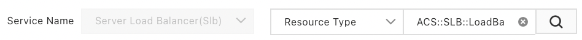{width="4.5in" height="0.31319444444444444in"}

-   Select the CLB instance,

-   Select the type of event,

-   Select a time interval,

-   Click on the search icon.

To view more information about a log entry, expand the display.

It is possible to consult the Health Check logs of the last 3 days. To
go further, you must first store them in OSS and then download them.

### View Health Check logs 

To view the Health Check logs generated in the last three days:

-   Go to the Server Load Balancer console,

-   Select CLB \| Logs \| Health Check Logs,

-   Click on the Logs tab.

{width="2.9788746719160106in"
height="1.6094192913385827in"}

The message \<IP_ADDRESS_CLB_INSTANCE\>: \<CLB_PORT\> to
\<IP_ADDRESS_ECS_INSTANCE\>: \<ECS_PORT\> abnormal; cause: \<MESSAGE\>
indicates that the backend server is experiencing a problem.

The message \<IP_ADDRESS_CLB_INSTANCE\>: \<CLB_PORT\> to
\<IP_ADDRESS_ECS_INSTANCE\>: \<ECS_PORT\> normal means that the backend
server has returned to normal status.

### Store Health Check logs 

It is possible to enable and disable log storage.

CLB creates an AliyunSLBHealthCheckLogs folder in the selected OSS
bucket. CLB creates a folder for each day (for example: 20210304).

The logs are generated every hour. They are stored in the corresponding
folder in an object whose name corresponds to the number of the end time
of the logs (example: 09.txt for the time slot 08:00 to 09:00).

Health Check logs are only generated when the backend server encounters
a problem.

To store the Health Check logs in an OSS bucket, first create an OSS
bucket:

-   Go to the OSS console,

-   Click on Buckets,

-   Click on Create Bucket,

-   Configure the bucket,

The bucket must be in the same region as the CLB instance.

-   Click on OK.

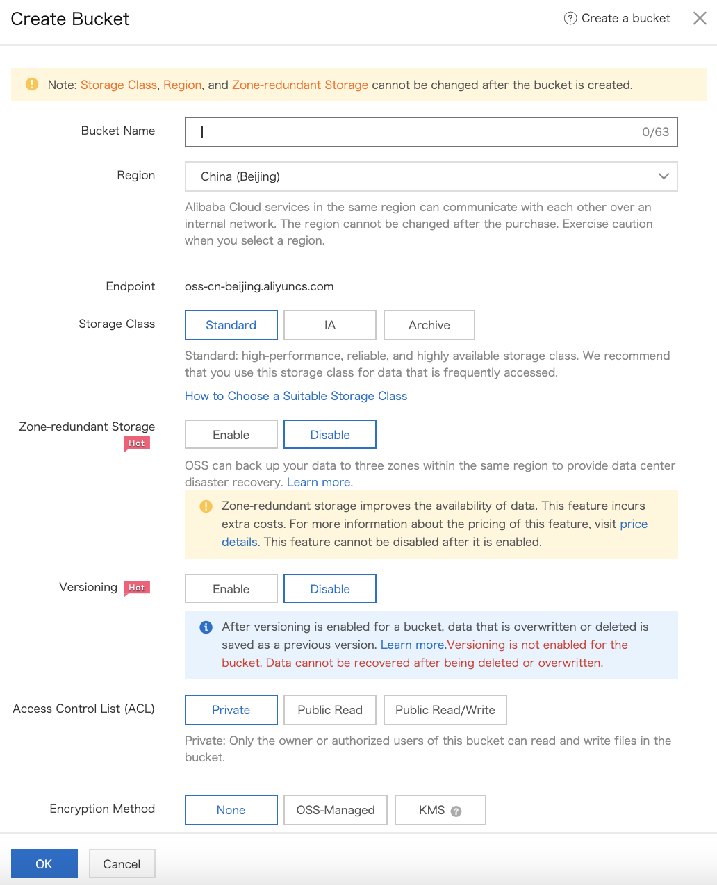{width="3.2270450568678917in"
height="3.984005905511811in"}

Then allow access to OSS from CLB (this is only necessary for the first
time):

-   Go to the Server Load Balancer console,

-   Select CLB \| Logs \| Health Check Logs \| Log Storage,

-   Activate OSS,

-   Click on Activate Now to authorize the necessary RAM role,

-   Click on Confirm Authorization Policy.

Configure RAM:

-   Go to the RAM console,

-   Click on RAM Roles,

-   Click on Add Permissions on the line of SLBLogDefaultRole,

{width="3.125075459317585in"
height="2.510188101487314in"}

-   Enter a policy name: enter the name of the AliyunOSSFullAccess
    permission,

-   Click on the permission,

{width="3.8803608923884516in"
height="3.4665758967629046in"}

-   Click on OK,

-   Click on Complete.

Finally, configure Log Storage:

-   Go to the Server Load Balancer console,

-   Select CLB \| Logs \| Health Check Logs,

-   Click on the Log Storage tab,

-   Click on Configure Log Storage on the line of the region,

-   Select the bucket where to store the logs,

-   Click on OK,

{width="4.5in" height="2.79375in"}

-   Activate Status.

{width="0.19965551181102362in"
height="0.246003937007874in"}

### Download Health Check logs 

To download the Health Check logs in OSS:

-   Go to the OSS console,

-   Click on Buckets,

-   Click on the log bucket,

-   Click on Files,

-   Click on the AliyunSLBHealthCheckLogs/ folder,

-   Click on the log file to download,

-   Click View Details on the line of the log file,

-   Click on Copy.

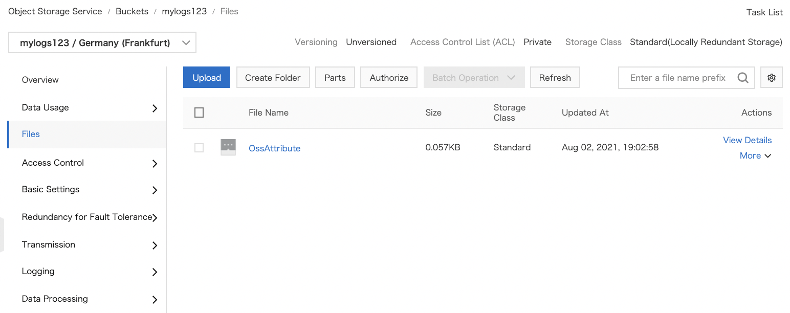{width="4.5in" height="1.7833333333333334in"}

In a web browser, paste the copied URL to download the log file.

### Allow access to access logs to a RAM user 

First of all, the RAM user must be authorized by the Alibaba Cloud
account.

A prerequisite is to have the AliyunLogArchiveRole. Check that it
exists:

-   Go to the RAM console,

-   Click on RAM Roles.

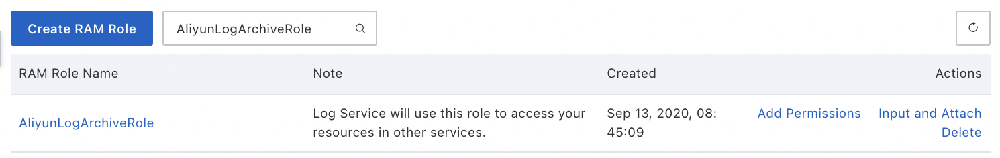{width="3.6484416010498686in"
height="0.5776695100612423in"}

If the AliyunLogArchiveRole does not appear, you must create it:

-   Go to the Server Load Balancer console,

-   Select CLB \| Logs \| Access Logs,

-   Click on Authorize,

-   Click on Confirm Authorization Policy.

To create an access log permission policy for a RAM user:

-   Go to the RAM console,

-   Click on Permissions \| Policies,

-   Click on Create Policy,

-   Policy Name: this is the name of the policy,

-   Configuration Mode: select Script,

-   Policy Document: enter the content of the policy:

{

\"Statement\": \[

{

\"Action\": \[

\"slb:Create\*\",

\"slb:List\*\"

\],

\"Effect\": \"Allow\",

\"Resource\": \"acs:log:\*:\*:project/\*\"

}, {

\"Action\": \[

\"log:Create\*\",

\"log:List\*\"

\],

\"Effect\": \"Allow\",

\"Resource\": \"acs:log:\*:\*:project/\*\"

}, {

\"Action\": \[

\"log:Create\*\",

\"log:List\*\",

\"log:Get\*\",

\"log:Update\*\"

\],

\"Effect\": \"Allow\",

\"Resource\": \"acs:log:\*:\*:project/\*/logstore/\*\"

}, {

\"Action\": \[

\"log:Create\*\",

\"log:List\*\",

\"log:Get\*\",

\"log:Update\*\"

\],

\"Effect\": \"Allow\",

\"Resource\": \"acs:log:\*:\*:project/\*/dashboard/\*\"

}, {

\"Action\": \"cms:QueryMetric\*\",

\"Resource\": \"\*\",

\"Effect\": \"Allow\"

}, {

\"Action\": \[

\"slb:Describe\*\",

\"slb:DeleteAccessLogsDownloadAttribute\",

\"slb:SetAccessLogsDownloadAttribute\",

\"slb:DescribeAccessLogsDownloadAttribute\"

\],

\"Resource\": \"\*\",

\"Effect\": \"Allow\"

}, {

\"Action\": \[

\"ram:Get\*\",

\"ram:ListRoles\"

\],

\"Effect\": \"Allow\",

\"Resource\": \"\*\"

}

\],

\"Version\": \"1\"

}

-   Click on OK,

-   Select Permissions \| Grants,

-   Click on Grant Permission,

-   Authorize Scope: this is the relevant resource group or the entire
    Alibaba Cloud account,

-   Principal: this is the name of the RAM user, the user group or the
    RAM role,

-   Select Policy: select the permission that has just been created,

-   Click on OK.

{width="3.0638976377952756in"
height="3.54996062992126in"}

### Configure access logs 

Access logs collect information about the requests sent to a CLB
instance (time of the request, client IP address, latency, request URL,
server response, \...). These logs are useful in case of problems and to
analyze the traffic (user behavior, geographical distribution, \...).

Only Layer 7 CLB supports access log configuration.

A prerequisite is that the Log Service must be enabled.

Configure access logs on a Layer 7 listener:

-   Go to the Server Load Balancer console,

-   Select CLB \| Logs \| Access Logs,

-   Select the region,

-   If necessary, allow the use of access logs:

```{=html}
<!-- -->
```
-   Click on Authorize,

-   Click on Confirm Authorization Policy,

The Alibaba Cloud account must allow the use of access logs.

-   Click on Configure Logging on the line of the CLB instance,

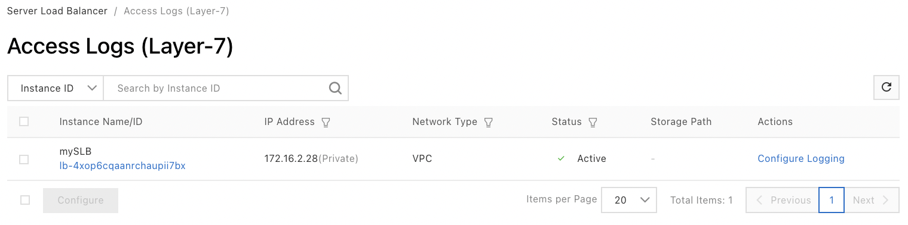{width="4.5in" height="1.11875in"}

-   Project: this is the project, which allows to group and isolate
    resources,

-   LogStore: this is a unit of the Log Service,

-   Click on OK.

{width="3.003954505686789in"
height="2.6952154418197725in"}

If there is no LogStore available, you have to create a log project in
the Log Service console.

The LogProject project must be in the same region as the CLB instance.

### Search and analyze access logs 

It is possible to search the logs on the following fields:

-   body_bytes_sent: this is the size of the HTTP body sent back to the
    client (in bytes),

-   client_ip: this is the IP address of the client,

-   host: this is the host header in the request

-   http_user_agent: this is the http_user_agent header received in the
    request,

-   request_length: this is the length of the request including the
    headers,

-   request_method: this is the method of the request,

-   request_time: this is the interval between the time the CLB instance
    receives the first request and the time it returns a response,

-   request_uri: this is the URI of the received request,

-   slbid: this is the ID of the CLB instance,

-   status: this is the status of the response of the CLB instance,

-   upstream_addr: this is the IP address and port number of the backend
    server,

-   upstream_response_time: this is the interval between the time the
    CLB instance sends a request to the backend server and the time it
    sends a response to the client,

-   upstream_status: this is the status code of the backend server
    response received by the CLB instance.

To search the access logs:

-   Go to the Server Load Balancer console,

-   Select CLB \| Logs,

-   Select the type of log (Operation Logs, Access Logs, Health Check
    Logs).

For example, for access logs, click on View Logs on the line of the
instance.

{width="4.5in"
height="1.1805555555555556in"}

You can also go to the Log Service console:

-   Go to the Log Service console,

-   Click on the project name,

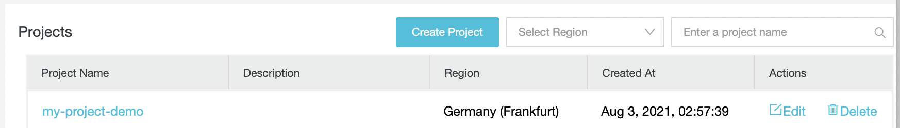{width="4.087933070866142in"
height="0.5854319772528433in"}

-   Click on the Logstores tab,

-   Search Logstores: enter the name of the Logstore,

-   Click on the search icon,

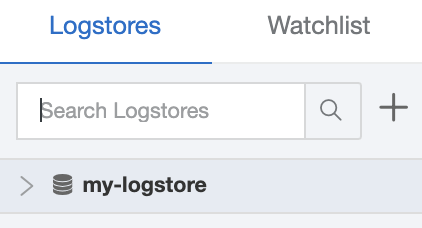{width="0.9793482064741907in"
height="0.5291262029746282in"}

-   Click on the field name or enter a query,

-   Click on Search & Analyze.

{width="4.5in"
height="2.1680555555555556in"}

### Disable access logs 

To disable access logs:

-   Go to the Server Load Balancer console,

-   Select CLB \| Logs \| Access Logs,

-   Select the region,

-   Click on Delete on the line of the instance,

-   Click on OK.

## Access control with ACLs 

CLB allows to manage an access control (ACL - Access Control List). To
do this, after configuring an ACL, you can configure rules in the form of
a white list or black list for each listener. Each list includes IP
addresses or CIDR blocks.

It is possible to create several ACLs.

To create an ACL:

-   Go to the Server Load Balancer console,

-   Select the region,

-   Select CLB \| Access Control,

-   Click on Create Access Control List,

-   Access Control List Name: this is the name of the ACL,

-   Add Multiple Addresses and Descriptions: these are the IP addresses,

-   Click on Create.

{width="2.104265091863517in"
height="2.0026246719160103in"}

To add entries to the ACL:

-   Go to the Server Load Balancer console,

-   Select the region,

-   Select CLB \| Access Control,

-   Click on Manage on the line of the ACL,

{width="2.1192311898512686in"
height="1.0690999562554682in"}

-   Click on Add Entry,

-   IP Address/CIDR Block: this is the IP address or the CIDR block,

-   Description: this is the description,

-   Click on Add.

{width="2.2610892388451442in"
height="1.4229505686789152in"}

To delete entries:

-   Go to the Server Load Balancer console,

-   Select the region,

-   Select CLB \| Access Control,

-   Click on Manage on the line of the ACL,

-   Click on Delete on the line of the entry,

-   Click on OK.

To enable or disable access control:

-   Go to the Server Load Balancer console,

-   Select the region,

-   Select CLB \| Instances,

-   Click on the ID of the CLB instance,

-   Click on the Listener tab,

-   Click on \... \| Set Access Control on the line of the listener,

-   Enable Access Control: enables or disables access control,

-   Access Control Method: enable access control and select the access
    control method:

```{=html}
<!-- -->
```
-   Whitelist: only requests from the specified IP addresses or CIDR
    blocks are forwarded,

-   Blacklist: only requests from specified IP addresses or CIDR blocks
    are not forwarded,

```{=html}
<!-- -->
```
-   Access Control List: this is the associated ACL,

-   Click on OK.

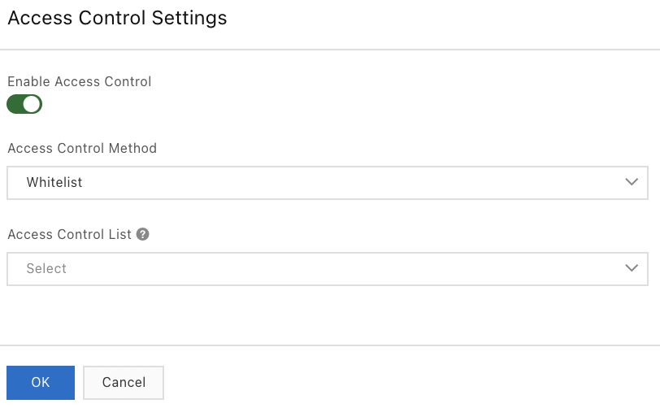{width="2.384896106736658in"
height="1.4743657042869642in"}

When migrating from one ACL to another, it is possible to transfer IP
addresses and CIDR blocks from the old ACL to the new one.

## Traffic monitoring 

Cloud Monitor allows to display traffic information on CLB listeners
such as the number of connections.

To display the monitoring data:

-   Go to the Server Load Balancer console,

-   Select CLB \| Instances,

-   Select the region where the CLB instance is located,

-   Click on the monitoring icon on the line of the CLB instance,

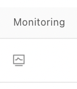{width="0.2926038932633421in"
height="0.33904965004374454in"}

-   Select the metrics to be displayed from the list:

{width="4.405884733158355in"
height="1.7018405511811023in"}

+----------------------+-----------------------------------------------+
| Metric               | Description                                   |
+======================+===============================================+
| Traffic              | Inbound Traffic: this is the traffic consumed |
|                      | by external access                            |
|                      |                                               |
|                      | Outbound Traffic: this is the traffic         |
|                      | consumed by the CLB instance                  |
+----------------------+-----------------------------------------------+
| Packets              | RX Packets Count: this is the number of       |
|                      | packets received per second                   |
|                      |                                               |
|                      | TX Packets Count: this is the number of       |
|                      | response packets sent per second              |
+----------------------+-----------------------------------------------+
| Concurrent           | Active Connections Count: this is the number  |
| Connections          | of TCP connections established; if persistent |
|                      | connections are used, a connection can        |
|                      | forward several requests at once              |
|                      |                                               |
|                      | Inactive Connections Count: this is the       |
|                      | number of TCP connections that do not have    |
|                      | the established status (netstat -an allows to |
|                      | display active connections)                   |
|                      |                                               |
|                      | Max Concurrent Connections Count: this is the |
|                      | total number of TCP connections.              |
+----------------------+-----------------------------------------------+
| New Connections      | This is the average number of new TCP         |
|                      | connections established between clients and   |
|                      | the CLB instance                              |
+----------------------+-----------------------------------------------+
| Dropped Traffic      | Dropped Inbound Traffic: this is the amount   |
|                      | of inbound traffic dropped per second         |
|                      |                                               |
|                      | Dropped Outbound Traffic: this is the amount  |
|                      | of outbound traffic dropped per second        |
+----------------------+-----------------------------------------------+
| Dropped Packets      | Dropped RX Packets: the number of incoming    |
|                      | packets dropped per second                    |
|                      |                                               |
|                      | Dropped TX Packets: the number of outgoing    |
|                      | packets dropped per second                    |
+----------------------+-----------------------------------------------+
| Dropped Connections  | This is the number of dropped TCP connections |
|                      | per second                                    |
+----------------------+-----------------------------------------------+

There are also metrics specific to Layer 7 listeners:

  -----------------------------------------------------------------------
  Metric                       Description
  ---------------------------- ------------------------------------------
  Layer-7 QPS                  This is the number of HTTP/HTTPS requests
                               that can be handled per second

  Response Time(Listener)      This is the average response time of the
                               CLB instance

  HTTP Status Code             This is the average number of HTTP
  2XX/3XX/4XX/5XX/Other HTTP   response codes generated by the listener
  Status Code (Listener)       

  HTTP Status Code 4xx/5xx     This is the average number of HTTP
  (Server)                     response codes generated by the backend
                               server

  Response Time (Server)       This is the average response time of the
                               backend server
  -----------------------------------------------------------------------

Deleting a listener will delete the corresponding alarm rules.

To set up alarm rules:

-   Go to the Server Load Balancer console,

-   Select the region where the CLB instance is located,

-   Click on the monitoring icon on the line of the instance,

-   Click on Threshold Alerting Settings,

-   Click on Create Alarm Rule,

-   Configuring the alarm rule.

## The API Inspector 

API Inspector converts and displays each operation on the console into
API calls in different languages.

Cloud Shell and API Explorer allow to debug the generated code.

To activate API Inspector:

-   Go to the Server Load Balancer console,

-   Click on Overview,

-   Click on API Overview.

{width="4.5in"
height="1.9395833333333334in"}

To debug online or with the API Explorer, click on Online Debug.

To debug with Cloud Shell, click on Online Linux Shell.

## Optimization 

In this section, we will study three optimization techniques:

-   Multi-zone deployment to improve availability,

-   Cross-region load balancing to improve fault tolerance,

-   Anti-DDoS Basic to improve security.

### Improve availability with multi-zone deployment 

To improve availability, CLB instances can be created in multiple zones
within a region. When the data center of a zone fails, CLB automatically
switches to the backup data center in less than 30 seconds. This
requires an instance in each of these zones.

ECS instances associated with a CLB instance must be in the same region
but may be in different areas.

Furthermore, ECS instances and CLB instances are deployed in different
clusters, so that a failure of ECS instances does not induce a failure
of CLB instances.

There is a list of available primary zone/backup zone associations. This
is available on the Alibaba Cloud website but can also be obtained with
the DescribeZones API.

### Improve fault tolerance with cross-region load balancing 

While SLB provides load balancing of server groups in the same region,
Global Traffic Management provides load balancing of server groups that
are in different regions using DNS resolution. This allows for
inter-regional disaster tolerance and faster access from different
regions.

To create a Global Traffic Manager instance:

-   Go to the Alibaba Cloud DNS console,

-   Click on Global Traffic Manager,

-   Click on Create Instance,

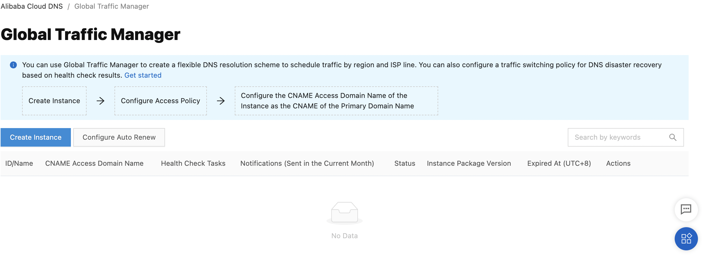{width="4.5in" height="1.6388888888888888in"}

-   Select the version, quantity and duration of service,

-   Click on Buy Now.

{width="4.5in"
height="3.2263888888888888in"}

An access domain name of type CNAME is then automatically allocated.

To test the proper functioning of Global Traffic Manager, simply remove
all ECS instances from a region. The SLB service will then become
unavailable and the switchover should take place within 3 minutes.

The configuration of the Global Traffic Manager instance is not covered
in this book.

### Improve security with Anti-DDoS Basic 

The SLB console displays the thresholds used for safety.

SLB benefits from Anti-DDoS Basic, which provides protection up to 5
Gbps.

Traffic from the Internet passes through Alibaba Cloud Security before
reaching the SLB instances.

Anti-DDoS Basic filters out common DDoS attacks and protects SLB
instances from attacks such as SYN flood, UDP flood, ACK flood, ICMP flood
and DNS Query flood. To do this, it uses two thresholds:

-   Scrubbing threshold: When the attack exceeds the scrubbing threshold
    or matches a certain attack pattern, Alibaba Cloud Security filters
    packets, limits the traffic flow and limits the packet speed. This
    threshold is defined based on the bandwidth of the SLB instance.

-   Blackholing threshold: When the attack exceeds the blackholing
    threshold, all incoming packets are dropped. This threshold is
    defined from the user\'s security credit score. This score is
    calculated from your attack history, your purchases, your account
    activity, your security level, etc \... This score is specific to
    each region.

To display the thresholds of an SLB instance:

-   Go to the Server Load Balancer console,

-   Select the region,

-   Move the mouse over the green DDoS icon on the line of the instance
    to the right of the instance ID,

{width="3.490812554680665in"
height="1.6473622047244094in"}

When the incoming traffic exceeds the Traffic Scrubbing Threshold
(bits/s), scrubbing is triggered.

When incoming packets exceed the Traffic Scrubbing Threshold
(packets/s), scrubbing is triggered.

When the incoming traffic exceeds the Blackholing Threshold, blackholing
is triggered.
