# Cloud Monitor 

Cloud Monitor allows to monitor hosts by placing probe points.

Application groups allow to manage resources by group across regions.

Alarm rules are used to monitor abnormal metrics and trigger an alarm.
These alarm rules can trigger the sending of alarm notifications.

The alarm template allows to set alert policies on Alibaba Cloud product
metrics.

Host monitoring monitors the processes (CPU and memory usage, number of
files opened by active processes) and GPUs. It is performed either
natively by the ECS instances or by installed agents.

Event monitoring allows to track operation and maintenance events by
service, level, name and application group. System events track the
usage of Alibaba Cloud services.

Custom monitoring allows to customize metrics and alert rules.

Alibaba Cloud Services Monitoring tracks each type of Alibaba Cloud
instance.

Site monitoring simulates real site usage from Alibaba Cloud data
centers.

A dashboard provides a centralized view of metrics for many Alibaba
Cloud products and instances.

## The application groups 

Application groups allow resources to be managed by group across
regions. Alarm rules can then be managed by group.

The limit is 100 groups per Alibaba Cloud account and 1000 resource
instances per group.

In case of maintenance intervention on resources, you can disable all
alerts related to the concerned group to avoid receiving unwanted alarm
notifications. Once the intervention is over, you can reactivate them.

To create an application group:

-   Go to the `Cloud Monitor `console,

-   Click on `Application Groups`,

-   Click on `Create Group`,

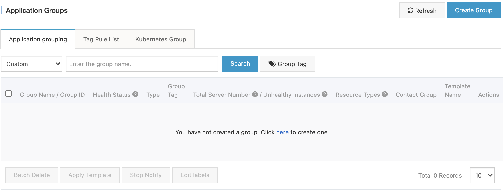{width="4.5in" height="1.7229166666666667in"}

-   `Creation method`: select `Smart tag synchronization creation`,

-   `Product Group Name`: this is the name of the group (it cannot be
    changed),

-   `Contact Group`: this` `is the alert group that will receive the
    alert notifications (default values are `All `and `Default
    Contact Group`),

-   `Select Template:` this is the alert template used to initialize
    the rules (default values are `All `and `Basic Templates`),

-   `Region`: this is the region,

-   `Match Rule`: this is a rule that looks for matches on resource
    tags,

-   `Initialize Agent Installation`: indicates whether Alibaba Cloud
    automatically installs the CloudMonitor agent on the instances in
    the application group,

-   Click on `Add`.

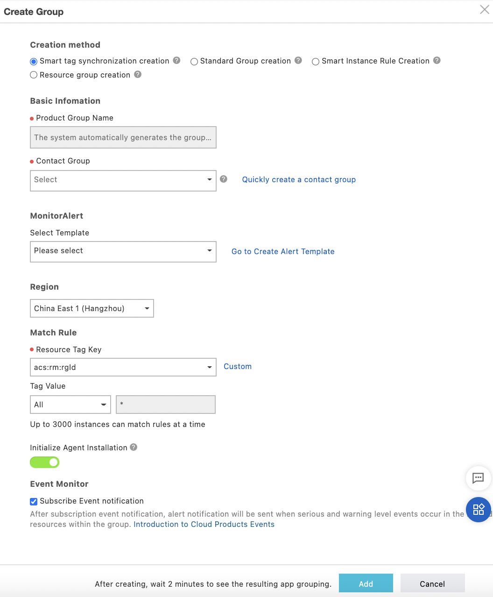{width="2.9690179352580928in"
height="3.593061023622047in"}

## The alarm templates 

The alarm template allows to define alert policies on Alibaba Cloud
product metrics. These templates can then be used directly when creating
alert policies. A change on a template does not produce a change on the
alert policies generated using this template.

If you use many Cloud resources, it is recommended to create application
groups to group them together and then create and apply alert templates
to these groups.

The maximum number of alert templates is 100 per Alibaba Cloud account
and the maximum number of metrics per alert template is 30.

To create or modify a template:

-   Go to the `Cloud Monitor `console,

-   Click on `Alerts \| Alert Templates`,

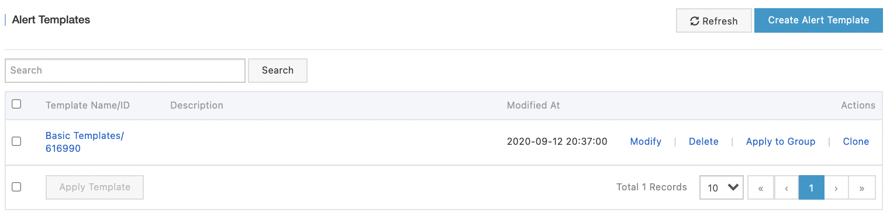{width="4.5in" height="1.09375in"}

-   Click on `Create Alert Template`,

-   `Template Name`: this` `is the name,

-   `Description`: this is the description,

-   Click on `OK`,

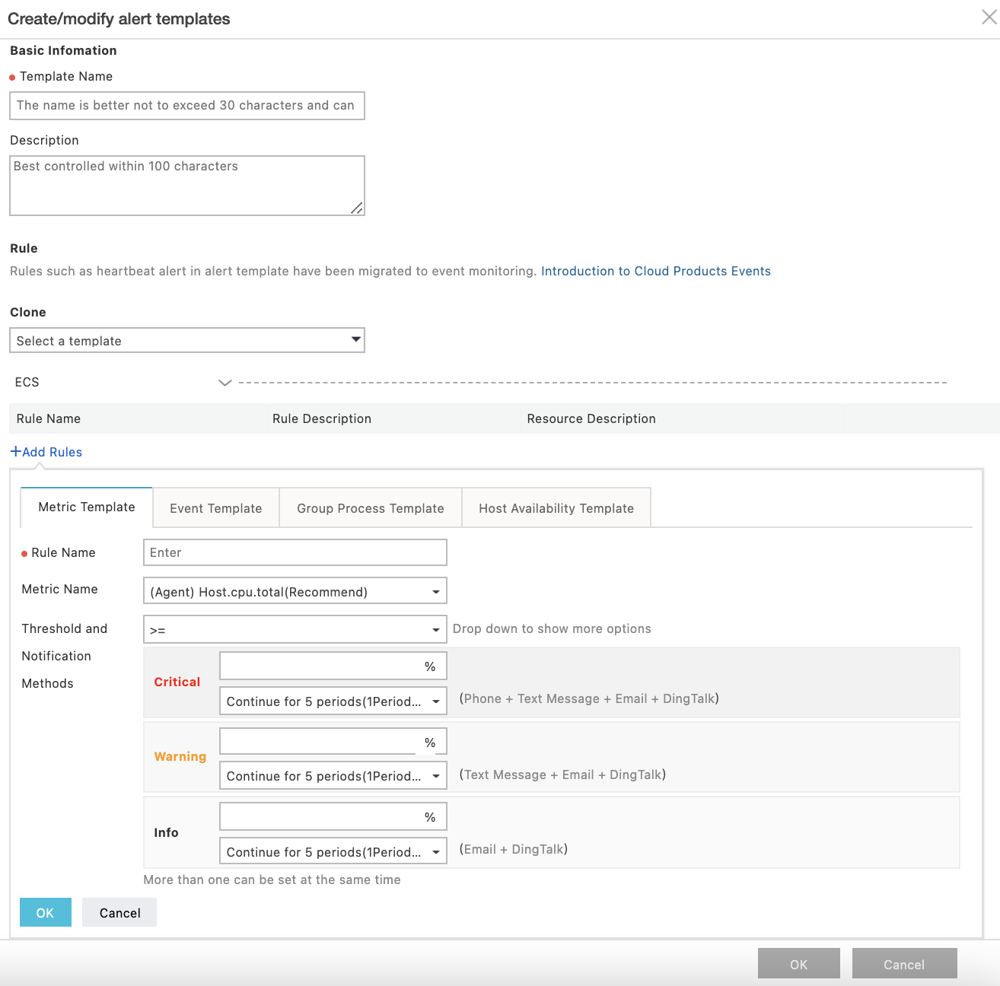{width="3.659748468941382in"
height="3.6094827209098863in"}

You can then apply the template to the group.

-   Click on `OK`,

-   Click on `OK`.

{width="2.759121828521435in"
height="1.6627110673665793in"}

When creating an application group, you can select an alarm template to
apply. Cloud Monitor then generates the corresponding alarm rules.

If you have created an application group without an associated alert
policy, you can create an alert template and then apply it to the group.

To apply a template to a group of applications:

-   Go to the `Cloud Monitor `console,

-   Click on `Alerts \| Alert Templates`,

-   Click on `Apply to Group `on the line of the template,

-   `Group`: this is the group of applications,

-   Click on `OK`,

-   Click on `OK`.

{width="2.7135564304461943in"
height="1.635252624671916in"}

## The contacts 

Before you can receive alarm notifications, you need to manage alarm
contacts and alarm contact groups.

To create a contact for the alarm:

-   Go to the `Cloud Monitor `console,

-   Click on `Alerts \| Alert Contacts`,

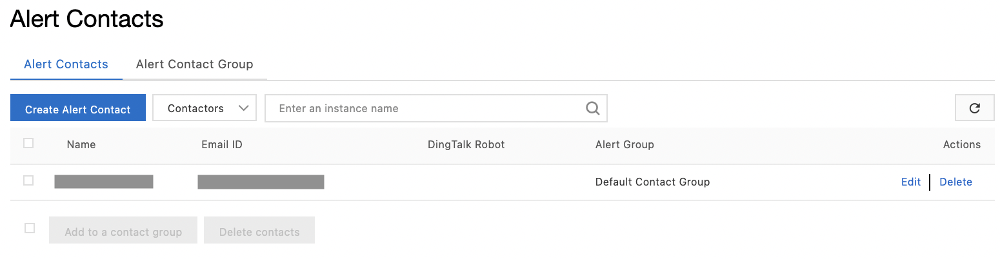{width="4.5in" height="1.167361111111111in"}

-   Click on `Create Alert Contact`,

-   `Name`: this is the name,

-   `Email ID`: this` `is the email,

-   `Webhook or DingTalk Robot`: this is the DingTalk account (or a
    URL of a webhook),

-   Click on `OK`.

{width="2.4986253280839894in"
height="2.4307622484689415in"}

To edit or delete an alarm contact:

-   Go to the `Cloud Monitor `console,

-   Click on `Alerts \| Alert Contacts`,

-   Click on `Edit `or `Delete `on the contact line.

The email is verified when it is added.

Contact groups are used to group contacts. A contact group can contain
several contacts. An alert contact can be added to several contact
groups.

To create an alert contact group:

-   Go to the `Cloud Monitor `console,

-   Click on `Alerts \| Alert Contacts`,

-   Click on the `Alert Contact Group `tab,

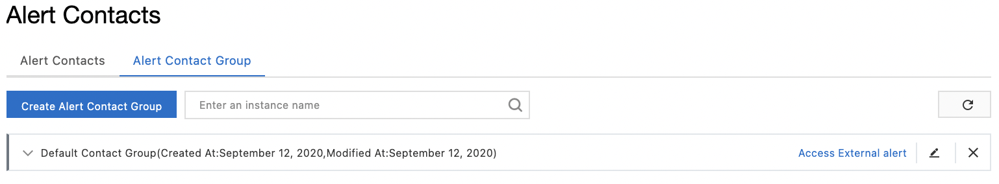{width="4.5in" height="0.83125in"}

-   Click on `Create Alert Contact Group`,

-   `Group Name`: this is the name of the group,

-   `Select contacts`: these are the contacts to the group,

-   Click on `Confirm`.

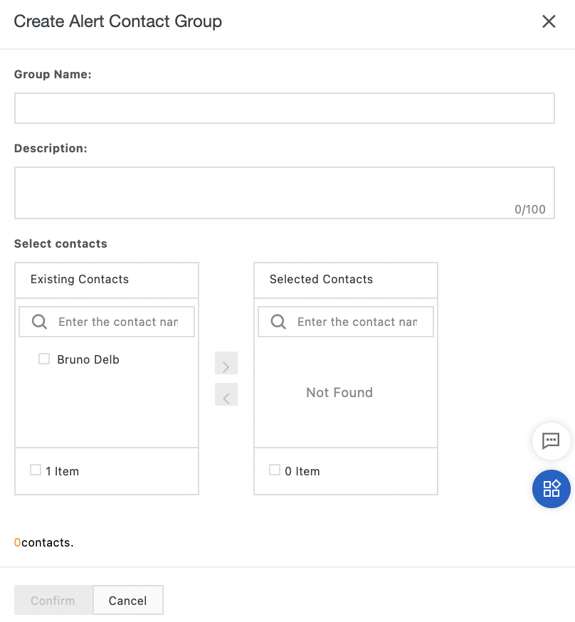{width="2.172334864391951in"
height="2.349676290463692in"}

To edit or delete an alert contact group:

-   Go to the `Cloud Monitor `console,

-   Click on `Alerts \| Alert Contacts`,

-   Click on `Alert Contact Group`,

-   Click on `Edit `or `Delete `on the line of the group.

## Alarm rules 

Alarm rules allow to monitor abnormal metrics and trigger an alarm.

Before setting up alarm rules, it is recommended to create groups to
group resources by service to facilitate the use of alerts.

Cloud Monitor provides three portals for managing alarm rules:

-   the application groups page,

-   the metric elements list page,

-   the alarm rules list page.

A callback function allows to send alarm notifications to an URL via
HTTP `POST `request, which allows to trigger actions in another system
for example. If the request fails to be sent, Cloud Monitor retries
three times. The timeout duration is five seconds.

Alarm rules can be defined either for a single host or for a group.

To display the alarm rules:

-   Go to the `Cloud Monitor `console,

-   Click on `Alerts \| Alert Rules`.

To create an alarm rule:

-   Go to the `Cloud Monitor `console,

-   Click on `Alerts \| Alert Rules`,

{width="4.5in"
height="1.9618055555555556in"}

-   Click on `Create Alert Rule`,

-   `Product`: this is the Alibaba Cloud product under surveillance,

-   `Resource Range`: this is the range of alarm rules, which can be:

```{=html}
<!-- -->
```
-   `All Resources`: the alarm rule applies to all instances of the
    specified product,

-   `Instances`: the rule applies only to a specific instance.

```{=html}
<!-- -->
```
-   `Alert Rule`: this is the` `name of the alarm rule,

-   `Rule Description`: defines the trigger conditions on the metric
    data,

-   `Mute for`: this is the time delay before the alert is cleared.

-   `Effective Period`: this is` `the period of time during which
    the rule takes effect,

-   `Contact Notification`: these are the contacts that receive the
    alarm notifications,

-   `Notification Methods`: this` `is the notification method (email
    and DingTalk mandatory),

-   `Auto Scaling`: triggers the scaling rule if the alert is
    triggered,

-   `Log Service`: adds the alert to the Log Service,

-   `Email Remark: `this is additional custom information,

-   `HTTP Webhook`: this is` `the URL called with the alert message
    in parameter; only HTTP requests are supported.

-   Click on `Confirm`.

+-----------------------------------------------------------------------+
| {width="4.053482064741908in"    |
| height="2.314488188976378in"}                                         |
|                                                                       |
| 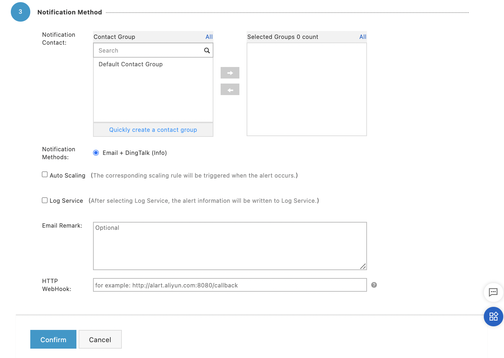{width="3.8755129046369206in"                |
| height="2.7553226159230095in"}                                        |
+=======================================================================+
+-----------------------------------------------------------------------+

To edit or delete an alarm rule:

-   Go to the `Cloud Monitor `console,

-   Click on `Alerts \| Alert Rules`,

-   Click `Delete `or `Modify `on the line of the rule.

## Host monitoring 

The host monitoring service allows to monitor the servers. It is
necessary to install a Cloud Monitor agent on the servers. This
monitoring can also be used on physical machines of other providers or
on-premises.

The supported operating systems are Linux and Windows, but not Unix.

Cloud Monitor offers more than 30 metrics on CPU, memory, disk and
network.

The Cloud Monitor agent requires certain ports to be open. In addition,
since the IP address used by the agent may change, it is recommended to
allow outgoing traffic from the `100.100 `network segment.

### Monitor processes 

Process monitoring allows to collect information about CPU and memory
usage and the number of files opened by active processes during a given
period.

The agent filters the five most CPU-intensive processes every minute,
indicating the rate of CPU usage, memory usage and the number of files
they have opened. Since the metrics are collected only for the top five
processes, the other processes have incomplete data: the data will
appear more scattered.

The metrics on CPU and memory usage come from the Linux `top `command,
while the metric on the number of files opened by an active process
comes from the `lsof `command.

If a process uses several CPUs, the CPU utilization rate can exceed 100%
since the total utilization of CPU cores is calculated.

### Monitor GPUs 

GPU (Graphics Processing Units) monitoring allows to query GPU
monitoring data using the Cloud Monitor console or the API.

GPU-related metrics are classified into three dimensions:

-   GPU: they measure the monitoring data by GPU,

-   Instance: they measure the minimum, maximum and average value of
    several GPUs per instance,

-   Group: they measure the minimum, maximum and average value of
    several instances per group.

A GPU driver must be installed in addition to the Cloud Monitor agent.

To display the metrics graphs:

-   Go to the `Cloud Monitor `console,

-   Click on `Host Monitoring`,`

-   Click on the instance name.

{width="4.5in"
height="1.2694444444444444in"}

`Monitoring information is available in the `OS Monitoring`, `Basic
Monitoring `and `Process Monitoring `tabs.

Here is some of that information:

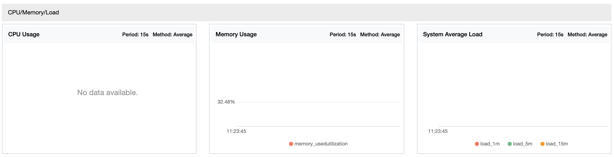{width="4.5in" height="1.1583333333333334in"}

To configure metrics graphs:

-   Go to the `Cloud Monitor `console,

-   Click on `Dashboard \| Custom Dashboard`,

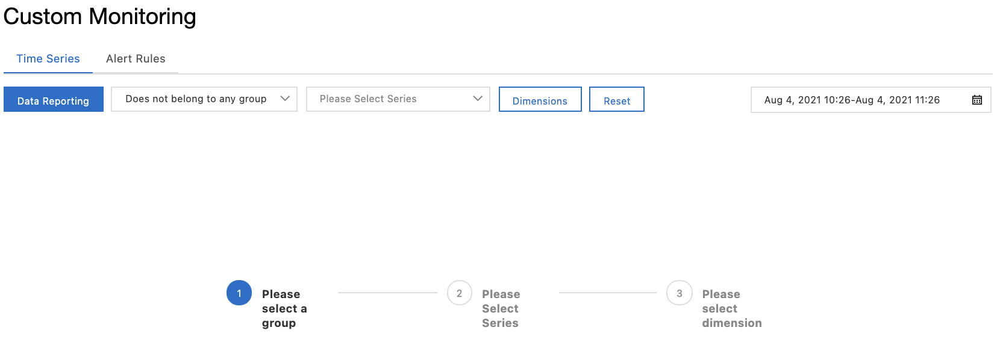{width="4.5in" height="1.5833333333333333in"}

-   Click on `Create Dashboard`,

-   Enter the name,

-   Click on `Create \| Add View`,

-   Select the type of graph,

-   Select the metrics,

-   Click on `Save`.

### View metrics 

Host monitoring metrics include:

-   metrics collected by the agents: they are collected every 15
    seconds,

-   native metrics of the ECS instances: they are collected every
    minute.

The base metrics of the ECS instances may be inconsistent for several
reasons: the metrics collected by the agents and those native to the ECS
instances use different frequencies. In addition, some metrics may not
include the same data. For example, billing metrics do not include
network traffic between ECS instances and SLB instances, while network
traffic metrics at the operating system level do.

Metrics collected by agents include:

+-----------+-----------------------------+---------------------------+
| Type      | Metric                      | Description               |
+===========+=============================+===========================+
| CPU       | `host.cpu.idle`           | This is the percentage of |
|           |                             | CPUs currently idle.      |
+-----------+-----------------------------+---------------------------+
|           | `host.cpu.iowaiit`        | This is the percentage of |
|           |                             | the CPU that waits for    |
|           |                             | I/O operations to finish. |
+-----------+-----------------------------+---------------------------+
|           | `host.cpu.other`          | This is the percentage of |
|           |                             | CPU usage.                |
+-----------+-----------------------------+---------------------------+
|           | `host.cpu.system`         | This is the percentage of |
|           |                             | the current kernel space  |
|           |                             | used as CPU.              |
+-----------+-----------------------------+---------------------------+
|           | `host.cpu.totalused        | This is the percentage of |
|           |                             | total CPU currently       |
|           | `                          | consumed.                 |
+-----------+-----------------------------+---------------------------+
|           | `host.cpu.user`           | This is the CPU           |
|           |                             | consumption of user       |
|           |                             | processes.                |
+-----------+-----------------------------+---------------------------+
| Memory    | `host.mem.actualused       | This is the memory        |
|           |                             | actually used by the      |
|           | `                          | user.                     |
+-----------+-----------------------------+---------------------------+
|           | `host.mem.free             | This is the amount of     |
|           |                             | memory left.              |
|           | > `                        |                           |
+-----------+-----------------------------+---------------------------+
|           | `host.mem.freeutilization  | This is the percentage of |
|           |                             | memory left.              |
|           | > `                        |                           |
+-----------+-----------------------------+---------------------------+
|           | `host.mem.total            | It is the total memory.   |
|           |                             |                           |
|           | > `                        |                           |
+-----------+-----------------------------+---------------------------+
|           | `host.mem.used             | This is the amount of     |
|           |                             | memory used.              |
|           | > `                        |                           |
+-----------+-----------------------------+---------------------------+
|           | \                           | This is an indicator of   |
|           | `host.mem.usedutilization` | memory usage.             |
+-----------+-----------------------------+---------------------------+
| Average   | `host.load1                | This is the average       |
| system    |                             | system load in the last   |
| load      | > `                        | minute.                   |
| (Linux    |                             |                           |
| only)     |                             |                           |
+-----------+-----------------------------+---------------------------+
|           | `host.load5                | This is the average       |
|           |                             | system load over the last |
|           | > `                        | 5 minutes.                |
+-----------+-----------------------------+---------------------------+
|           | `host.load15`             | This is the average       |
|           |                             | system load over the last |
|           |                             | 15 minutes.               |
+-----------+-----------------------------+---------------------------+
| Disk      | `host.disk.readbytes       | This is the number of     |
|           |                             | bytes read per second by  |
|           | > `                        | the disk.                 |
+-----------+-----------------------------+---------------------------+
|           | `host.disk.readiops        | This is the number of     |
|           |                             | read requests per second  |
|           | > `                        | on the disk.              |
+-----------+-----------------------------+---------------------------+
|           | `host.disk.utilization     | This is the disk usage    |
|           |                             | rate.                     |
|           | > `                        |                           |
+-----------+-----------------------------+---------------------------+
|           | `host.disk.writebytes      | This is the number of     |
|           |                             | bytes written per second  |
|           | > `                        | to the disk.              |
+-----------+-----------------------------+---------------------------+
|           | `host.disk.writeiops       | This is the number of     |
|           |                             | write requests per second |
|           | > `                        | to the disk.              |
+-----------+-----------------------------+---------------------------+
|           | `host.diskusage.free       | This is the remaining     |
|           |                             | storage space on the      |
|           | > `                        | disk.                     |
+-----------+-----------------------------+---------------------------+
|           | `host.diskussage.total     | This is the total storage |
|           |                             | space on the disk.        |
|           | > `                        |                           |
+-----------+-----------------------------+---------------------------+
|           | `host.diskusage.used`     | This is the storage space |
|           |                             | used on the disk.         |
+-----------+-----------------------------+---------------------------+
| File      | `host.fs.inode`           | This is an indicator of   |
| system    |                             | the use of the inode, the |
|           |                             | Unix system.              |
+-----------+-----------------------------+---------------------------+
| Network   | `host.netin.errorpackage   | This is the number of     |
|           |                             | outgoing error packets    |
|           | > `                        | detected by the disk.     |
+-----------+-----------------------------+---------------------------+
|           | `host.netin.packages       | This is the number of     |
|           |                             | packets received by the   |
|           | > `                        | network adapter per       |
|           |                             | second.                   |
+-----------+-----------------------------+---------------------------+
|           | `host.netin.rate           | This is the uplink        |
|           |                             | bandwidth of the network  |
|           | > `                        | adapter.                  |
+-----------+-----------------------------+---------------------------+
|           | `host.netout.errorpackages | This is the number of     |
|           |                             | outgoing error packets    |
|           | > `                        | detected by the disk.     |
+-----------+-----------------------------+---------------------------+
|           | `host.netout.packages      | This is the number of     |
|           |                             | incoming error packets    |
|           | > `                        | detected by the reader.   |
+-----------+-----------------------------+---------------------------+
|           | `host.netout.rate          | This is the downlink      |
|           |                             | bandwidth of the network  |
|           | > `                        | adapter.                  |
+-----------+-----------------------------+---------------------------+
|           | `host.tcpconnection`      | This is the number of TCP |
|           |                             | connections in various    |
|           |                             | states.                   |
+-----------+-----------------------------+---------------------------+
| on        | `host.process.cpu          | This is an indicator of   |
| processes |                             | the CPU usage of a        |
|           | > `                        | process.                  |
+-----------+-----------------------------+---------------------------+
|           | `host.process.memory       | This is an indicator of   |
|           |                             | the memory usage of a     |
|           | `                          | process.                  |
+-----------+-----------------------------+---------------------------+
|           | `host.process.number       | This is the number of     |
|           |                             | processes that match the  |
|           | `                          | specified keyword.        |
+-----------+-----------------------------+---------------------------+
|           | `host.process.openfile`   | This is the number of     |
|           |                             | files opened by a         |
|           |                             | process.                  |
+-----------+-----------------------------+---------------------------+

The following ECS instance metrics are provided without the need to
install the Cloud Monitor agent:

-   `ECS.CPUUtilization`: this is` `an indicator of the CPU usage,

-   `ECS.InternetIn`: this is the incoming Internet traffic,

-   `ECS.InternetInRate`: this is the average rate of the incoming
    Internet traffic,

-   `ECS.InternetOut`: this is the outgoing Internet traffic,

-   `ECS.InternetOutRate`: this is` `the average rate of the
    outgoing Internet traffic,

-   `ECS.IntranetIn`: this is the internal incoming traffic,

-   `ECS.IntranetInRate`: this is` `the average rate of the incoming
    internal traffic,

-   `ECS.IntranetOut`: this` `is the internal outgoing traffic,

-   `ECS.IntranetOutRate`: this is the average rate of the internal
    outgoing traffic,

-   `ECS.SystemDiskReadbps:` this is the number of bytes read from the
    system disk per second,

-   `ECS.SystemDiskReadOps`: this is the number of times data is read
    from the system disk per second,

-   `ECS.SystemDiskWritebps`: this is` `the number of bytes written
    to the system disk per second,

-   `ECS.SystemDiskWriteOps`: this is the number of times data is
    written to the system disk per second.

## Event monitoring 

Event monitoring provides event statistics by service, level, name and
application group for service failures, operations and maintenance (O&M)
events and business exceptions.

System events are used to track the usage of Alibaba Cloud services. It
is possible to set up event alerts.

To display the event monitoring:

-   Go to the `Cloud Monitor `console,

-   Click on `Event Monitoring`,

You can filter the list of events by service, event type, event and time
interval.

-   Click on `View the Detail `on the event line.

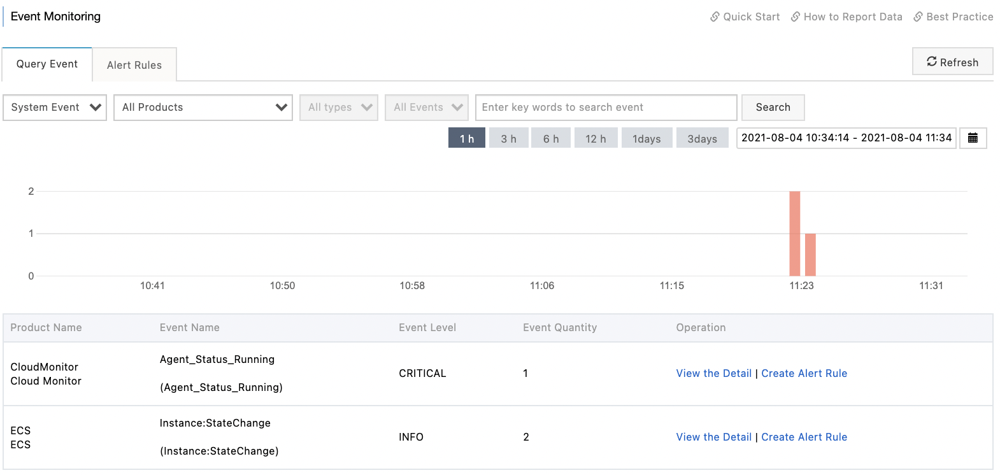{width="4.5in" height="2.1381944444444443in"}

To create an event alert rule:

-   Go to the `Cloud Monitor `console,

-   Click on `Event Monitoring`,

-   Click on the `Alert Rules `tab,

-   Click on the `System Event `tab,

{width="4.5in"
height="1.8270833333333334in"}

-   Click on `Create Event Alert`,

-   `Alert Rule Name`: this is` `the name of the alert rule,

-   `Event Type`: this is` `the type of event, which corresponds to
    the previously selected tab (`System Event `or `Custom Event`),

-   `Product Type`: this is the Alibaba Cloud server that the alert is
    about,

-   `Event Type`: this is the type of event that triggers the alerts,

-   `Event Level`: this is the level of the event that triggers the
    alerts,

-   `Event Name`: this is the name of the event that triggers the
    alerts,

-   `Resource Range:` these are the resources to which the alert is
    applied,

```{=html}
<!-- -->
```
-   `All Resources:` sends a notification when the event occurs on a
    resource,

-   `Application Groups`: sends a notification when the event occurs
    on a resource of the application group,

```{=html}
<!-- -->
```
-   `Contact Group`: this is the alert group that receives the
    notifications,

-   `Notification Method`: this is the level and method of alert
    (`Info (Email ID+DingTalk Robot)`),

-   `MNS queue`: this` `is the `MNS `(Message Service) queue to
    which the alert is sent,

-   `Function service`: this` `is the Function Compute function to
    which the alert is sent,

-   `URL callback`: this is the URL callback and the request method
    (`GET `or `POST`),

The URL must be accessible from the Internet. Only the `HTTP `protocol
is supported.

-   `Log Service`: this is the Logstore of `Log` `Service `to
    which the alert is sent,

-   Click on `OK`.

+-----------------------------------------------------------------------+
| 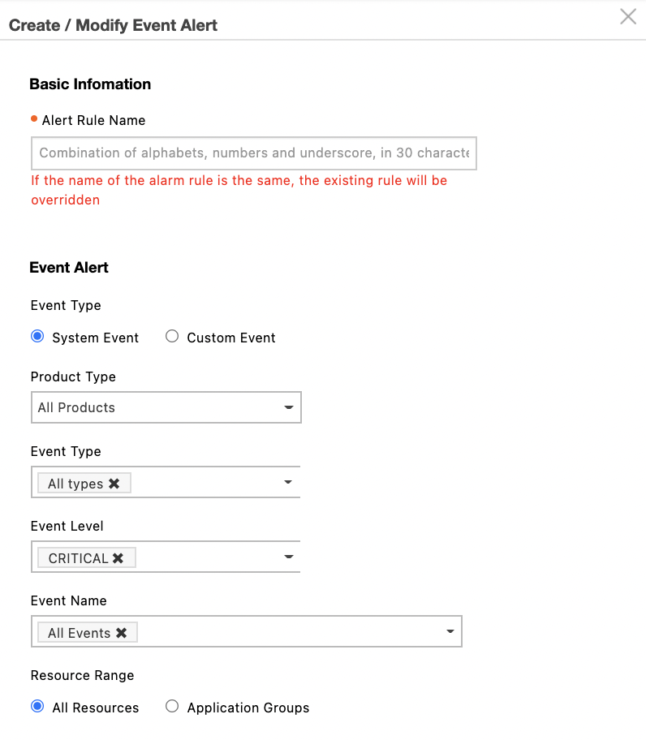{width="2.3843372703412076in"                |
| height="2.7316852580927384in"}                                        |
|                                                                       |
| {width="2.383908573928259in"    |
| height="2.4916994750656167in"}                                        |
+=======================================================================+
+-----------------------------------------------------------------------+

To test an event alert rule on an Alibaba Cloud service:

-   Go to the `Cloud Monitor `console,

-   Click on `Event Monitoring`,

-   Click on the `Alert Rules `tab,

-   Click on the `System Event `tab,

-   Click on `test `on the line of the rule,

-   Select the event to test,

-   Modify the content of the event,

-   Click on `OK`.

An event with the specified content is then generated. The alert can be
received by email or by DingTalk.

If a callback fails, three new attempts are made, each expiring after 5
seconds.

To call a callback:

-   Go to the `Cloud Monitor `console,

-   Click on `Event Monitoring`,

-   Click on the `Alert Rules `tab,

-   Click `Modify `on the line of the rule,

-   Check `URL callback`,

-   `Request Method`: select `POST`,

-   `Callback URL`: this is the callback URL,

-   Click on `OK`.

{width="1.7150984251968504in"
height="0.9792290026246719in"}

## Customized monitoring 

In this section, we will study:

-   customized monitoring that allows to customize metrics and alert
    rules on time series data,

-   monitoring of custom events,

-   monitoring of cloud services.

### Custom monitoring 

Custom monitoring allows to customize metrics and alert rules on
periodically collected time series data.

To pass business metrics to Cloud Monitor, you can call the API\'s
`PutCustomMetric `operation. The `AliyunCloudMonitorFullAccess
`policy must be attached to the RAM user used to use the API.

It is also possible to create alerts and graphics.

To view the data:

-   Go to the `Cloud Monitor `console,

-   Click on `Custom Monitoring`,

-   Click on the `Time Series `tab,

-   Select the application group and time series from the drop-down
    lists,

-   Click on `Dimensions`,

-   Select the dimension to be used,

-   Click on `OK`.

{width="3.0400284339457566in"
height="0.6103510498687664in"}

It is also possible to view this data from the `Application Groups
`page.

To set up an alert:

-   Go to the `Cloud Monitor `console,

-   Click on `Custom Monitoring`,

-   Click on the `Alert Rules `tab,

-   Click on `Create Alert Rule`,

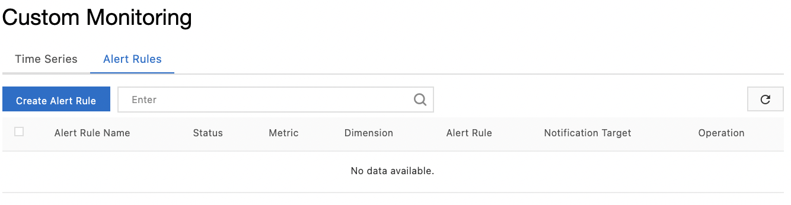{width="3.6209109798775154in"
height="0.9393132108486439in"}

-   Configure the alert rule,

-   Click on `Confirm`.

+-----------------------------------------------------------------------+
| 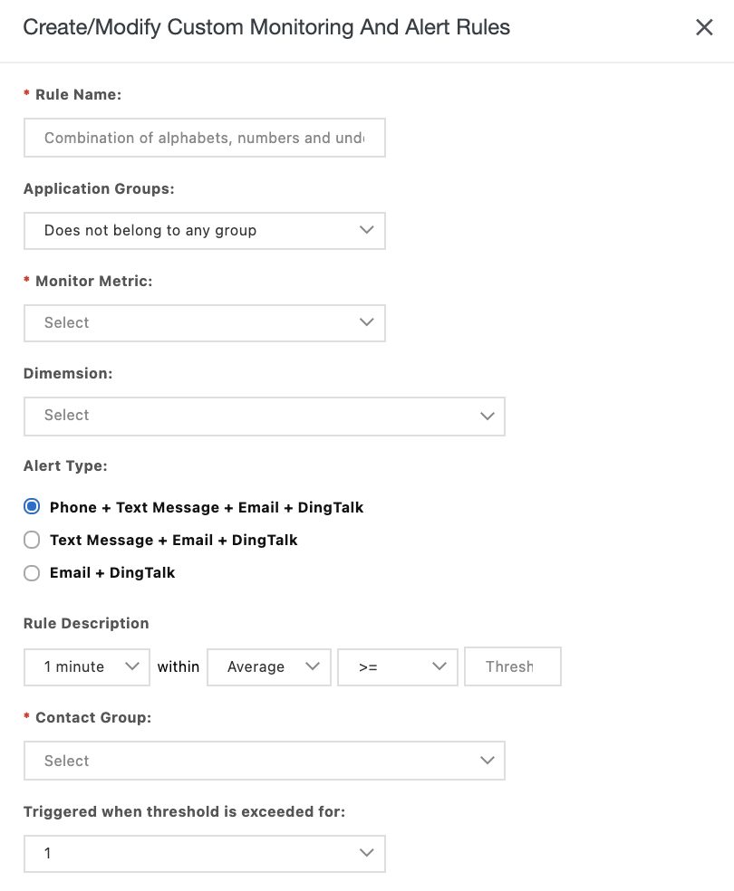{width="2.666327646544182in"                 |
| height="3.2390944881889765in"}                                        |
|                                                                       |
| 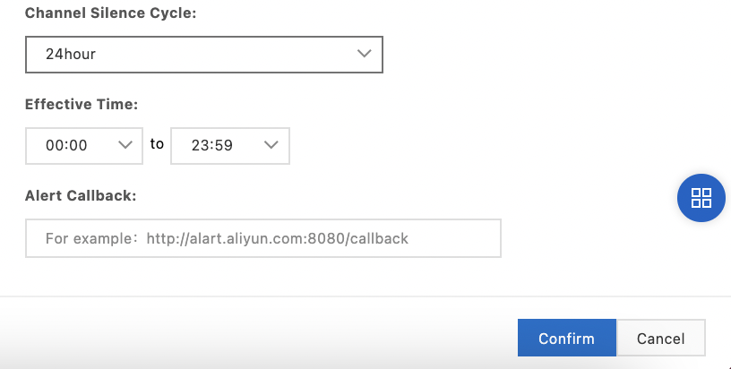{width="2.6995942694663166in"                |
| height="1.363127734033246in"}                                         |
+=======================================================================+
+-----------------------------------------------------------------------+

It is also possible to set up an alert from the `Application Groups
`page.

To send monitoring data with the `aliyun `CLI:

`aliyun cms PutCustomMetric \--MetricList.1.MetricName cpu_total
\--MetricList.1.Dimensions \'{\"myDim\":\"my_value\"}\'
\--MetricList.1.Time 1555382881320 \--MetricList.1.Type 0
\--MetricList.1.Period 60 \--MetricList.1.Values \'{\"value\":5}\'
\--MetricList.1.GroupId \"0\"

`Cloud Monitor should return the status code 200 and the message:

`{

\"Message\": \"success\",

\"RequestId\": \"C24E2C16-B037-3BF0-1332-2579AB5E26C3\",

\"Code\": \"200\"

}

### `Monitor custom events 

The data used by custom event monitoring is not necessarily continuous.

To view custom event monitoring data and receive alert notifications:

-   Go to the `Cloud Monitor `console,

-   Click on `Event Monitoring`,

-   Click on the `Query Event `tab,

-   In the first drop-down list, select `Custom Event`,

-   Fill in the parameters of the custom event in the other drop-down
    lists.

{width="4.063861548556431in"
height="2.1749179790026245in"}

To create an alert rule:

-   Go to the `Cloud Monitor `console,

-   Click on `Event Monitoring`,

-   Click on the `Alert Rules `tab,

-   Click on the `Custom Event `tab,

-   Click on `Create Event Alert`,

{width="4.5in" height="1.83125in"}

-   Click on` Advanced Configuration,

-   Alert Rule Name`: this is` `the name of the alert rule,

-   `Event Type`: this is` `the type of event, corresponding to the
    tab you clicked on previously (the possible values are `System
    Event `and `Custom Event`),

-   `Application Groups`: sends an alert notification only when the
    custom event occurs on an application group resource,

-   `Event Name`: this is` `the name of the custom event,

-   `Rule Description: `this is the description of the alert rule,

-   `Notification Method`: this` `is the notification method
    (`Email + DingTalk`),

-   `Effective From`: this is the time period during which the alert
    rule is active (from `00:00 `to `23:59`),

-   `Alert Callback`: this is the callback URL and the request method
    (`GET `or `POST`); the URL must be accessible from the Internet;
    only the `HTTP `protocol is supported,

-   Click on `OK`.

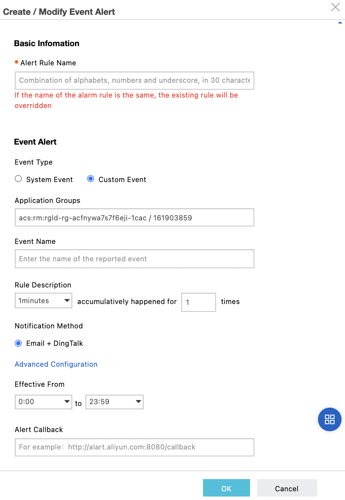{width="2.2238604549431322in"
height="3.2235673665791778in"}

Event monitoring allows to report custom events.

This can be done using the `PutCustomEvent `operation of the API. The
`AliyunCloudMonitorFullAccess `policy must be attached to the RAM user
used to use the API.

To send a custom event the CLI `aliyun:`

`aliyun cms PutCustomEvent \--EventInfo.1.EventName ErrorEvent
\--EventInfo.1.Content helloworld \--EventInfo.1.Time
\"20171013T170923.456+0800\" \--EventInfo.1.GroupId 0

`CloudMonitor returns a message of the following type with a status
code 200:

`{

\"Message\": \"success\",

\"RequestId\": \"C24E2C16-B037-3BF0-1332-2579AB5E26C3\",

\"Code\": \"200\"

}

### `Monitor cloud services 

Cloud Monitor provides specific metrics for each Alibaba Cloud instance
type. Rules are created by default.

To display the monitoring data:

-   Go to the `Cloud Monitor `console,

-   Click on `Cloud products`,

-   Select an Alibaba Cloud service,

At this point, you are redirected to the `Host Monitoring `section.

{width="3.164928915135608in"
height="2.481147200349956in"}

-   Click on `Monitoring Charts `on the service line.

{width="4.5in"
height="1.4097222222222223in"}

To set up alert rules:

-   Go to the `Cloud Monitor `console,

-   Click on `Cloud products`,

-   Select an Alibaba Cloud service,

At this point, you are redirected to the `Host Monitoring `section.

-   Click on `Alert Rules `on theline of the service,

-   Click on `Create Alert Rule`,

-   Configure the alert rule,

-   Click on `Confirm`.

Cloud Monitor provides metrics on CDN such as:

-   number of visits per second,

-   network bandwidth BPS

-   cache hit rate,

-   percentage of return codes `4xx`,

-   percentage of return codes `5xx`.

Here are some examples of metrics provided based on the service:

-   `ApsaraDB for Memcache`: the cache used and the read success rate,

-   `CDN`: Global Acceleration\'s inbound and outbound network
    bandwidth,

-   `Elasticsearch`: the state of the Elasticsearch cluster, the
    cluster\'s query QPS and the cluster\'s write QPS,

-   `Express Connect`: incoming and outgoing network traffic,

-   `NAT Gateway`: SNAT connections,

-   `VPN Gateway`: the network bandwidth in and out of the VPN
    gateway.

## Site monitoring 

Site monitoring sends detection queries that simulate real user usage
from Alibaba Cloud data centers to a site to be monitored.

The main interests are the implementation of probes and performance
analysis.

To create a task:

-   Go to the `Cloud Monitor `console,

-   Click on `New Site Monitor \| Site Manage`,

-   Click on `New Monitoring Task`,

{width="2.648413167104112in"
height="0.8525601487314086in"}

-   `Monitor Type`: this is the monitoring protocol (supported values
    are `HTTP(s)`, `PING`, `TCP`, `UDP`, `DNS`, `SMTP`,
    `POP3 `and `FTP`),

-   `IP Probe Type`: this is` `the type of IP address (the supported
    values are `IPv4 `and `IPv6`),

-   `Task Name`: this` `is the name of the site monitoring task,

-   `Monitor Address`: this is` `the address of the site to be
    monitored,

To access the advanced settings, click on `Advanced Settings`. This
part is not covered here.

-   `Monitoring frequency`: this is the interval at which requests are
    sent (supported values are 1, 5, 15, 30 and 60 minutes),

-   `ECS Probe points`: allows to customize the probe points by
    specifying the supplier and the region,

To customize the probe points, click `Custom Probe Point`. This part
is not covered here.

-   `Availability`: this` `is the availability of the probe points;
    the possible values are:

```{=html}
<!-- -->
```
-   `Available probe point ratio`: this is` `the ratio of available
    probe points,

-   `Number of probe points available`: this is the number of probe
    points available,

-   `Any Status Code`,

-   `All Status Code`,

```{=html}
<!-- -->
```
-   `Average response time`: this is` `the average response time of
    all detection points during a monitoring period,

-   `Triggered when threshold is exceeded for`: this is the number of
    consecutive times the threshold is exceeded before an alert is
    triggered,

-   `Contact Group: `this is the contact to which to send
    notifications,

-   `Notification Methods:` these are the methods used to send
    notifications,

-   Click on `Advanced Settings`,

-   `Channel Silence Time`: this is` `the interval at which the
    notification is sent back before the alert is cleared,

-   `Effective Time`: this is the period during which the alert rule
    is active,

Alerts are only generated outside these periods.

-   `Alert Callback`: this is the callback URL,

It must be accessible on the Internet. A POST method is used and only
the HTTP protocol is supported.

-   Click on `Create`.

+-----------------------------------------------------------------------+
| {width="3.2795570866141732in"   |
| height="2.6990551181102362in"}                                        |
|                                                                       |
| 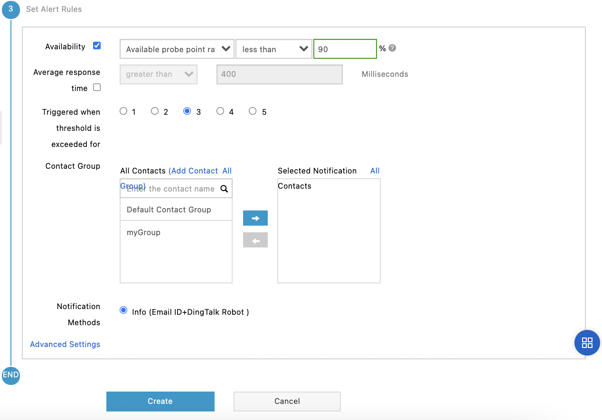{width="3.338582677165354in"                 |
| height="2.332886045494313in"}                                         |
+=======================================================================+
+-----------------------------------------------------------------------+

It is possible to specify several site addresses to be monitored
(`Monitor Address`). In this case, you must specify one per line.
Cloud Monitor will then generate one monitoring task per site address.

To edit or delete a task:

-   Go to the `Cloud Monitor `console,

-   Click on `New Site Monitor \| Site Manage`,

-   Click on `Modify `or `Delete `on the line of the site.

To activate or deactivate a task:

-   Go to the `Cloud Monitor `console,

-   Click on `New Site Monitor \| Site Manage`,

-   Click on `Enable `or `Disable `on the line of the site.

## The dashboard 

The dashboard provides a centralized view of metrics for multiple
Alibaba Cloud products and instances.

Cloud Monitor displays monitoring metrics for ECS instances by default.
The refresh is done automatically over one hour, three hours or six
hours. Beyond that, it is not automatic.

To view the network bandwidth dashboard for the last 30 days:

-   Go to the `Cloud Monitor `console,

-   Click on `Dashboard \| Flow chart`,

-   Select a duration (1 hour, 3 hours, \...),

-   Select the public IP address of the ECS instance.

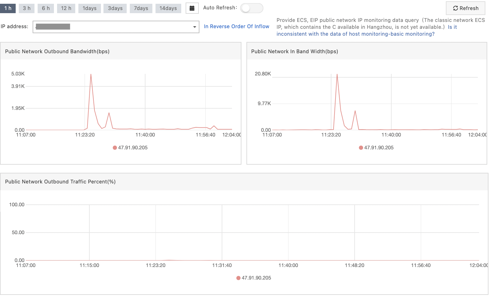{width="4.5in" height="2.7354166666666666in"}

To view the Alibaba Cloud services monitoring dashboard:

-   Go to the `Cloud Monitor `console,

-   Click on `Dashboard \| Cloud product charts`,

-   Select the service, {width="0.3225973315835521in"
    height="0.15202865266841645in"}

-   Select the resource and the duration (1 hour, 3 hours, \...).

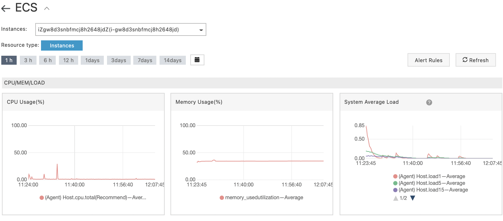{width="4.5in" height="1.9777777777777779in"}

To view a custom dashboard:

-   Go to the `Cloud Monitor `console,

-   Click on `Dashboard \| Custom Dashboard`,

-   Select a dashboard from the list,

-   Select a duration (1 hour, 3 hours, \...).

{width="4.5in" height="1.375in"}

To display the dashboard in full screen, click on `Full Screen`.

To refresh the dashboard in real time, click on `Refresh`.

You can create a new monitoring dashboard and customize the graphs
displayed. You can create up to 20 charts per monitoring tray.

To create a dashboard:

-   Go to the `Cloud Monitor `console,

-   Click on `Dashboard \| Custom Dashboard`,

-   Click on `Create Dashboard`,

-   Enter the name,

-   Click on `Create`.

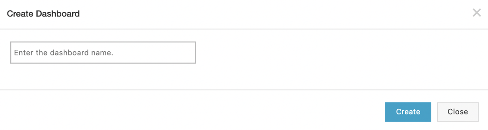{width="3.009550524934383in"
height="0.8081200787401575in"}

To add a graph to a dashboard:

-   Go to the `Cloud Monitor `console,

-   Click on `Dashboard \| Custom Dashboard`,

-   Select a dashboard from the list,

-   Click on `Add View`,

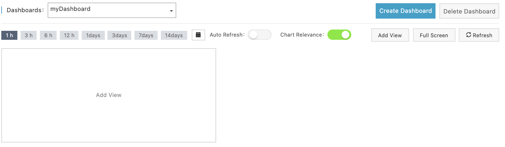{width="4.5in" height="1.3125in"}

-   `Graph type:`

```{=html}
<!-- -->
```
-   `Line: `displays the data as a time series,

-   `Area`: displays metric data by time sequence,

-   `Table`: displays in real time data sorted from the largest to the
    smallest,

-   `Heat Map`: displays the distribution and comparison of a metric
    of several instances in real time,

-   `Pie Chart`: displays real-time metrics in a convenient way to
    compare data,

```{=html}
<!-- -->
```
-   Select the metrics,

-   Click on `Save`.

{width="3.362736220472441in"
height="2.9657469378827646in"}

To edit or delete a dashboard:

-   Go to the `Cloud Monitor `console,

-   Click on `Dashboard \| Custom Dashboard`,

-   Select the dashboard from the list,

-   To edit the dashboard, move the mouse over the name of the dashboard
    and click on `Edit`,

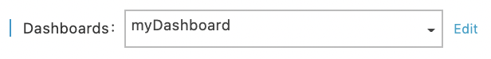{width="1.764730971128609in"
height="0.21199584426946633in"}

-   To delete the dashboard, click `Delete Dashboard`.

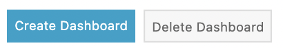{width="1.1151498250218723in"
height="0.1903915135608049in"}

When you delete a dashboard, all associated charts are deleted.
