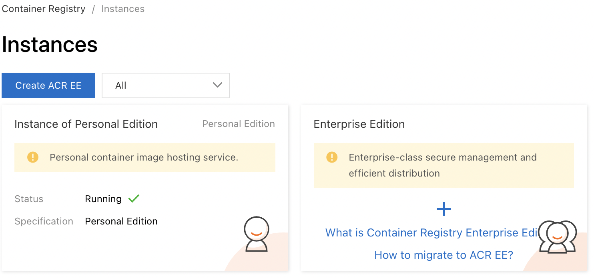
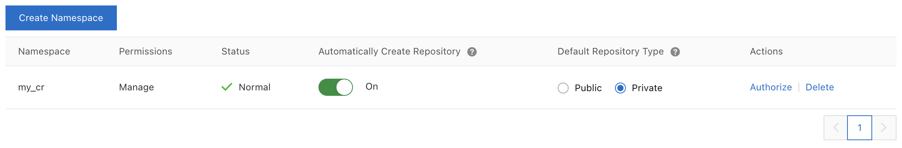
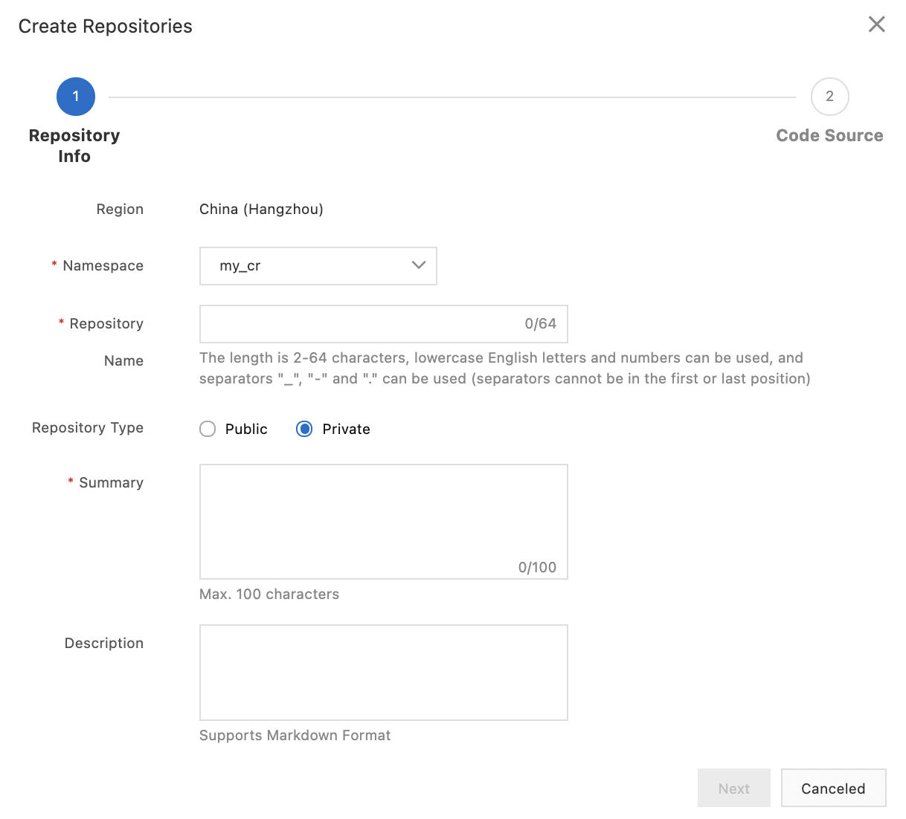
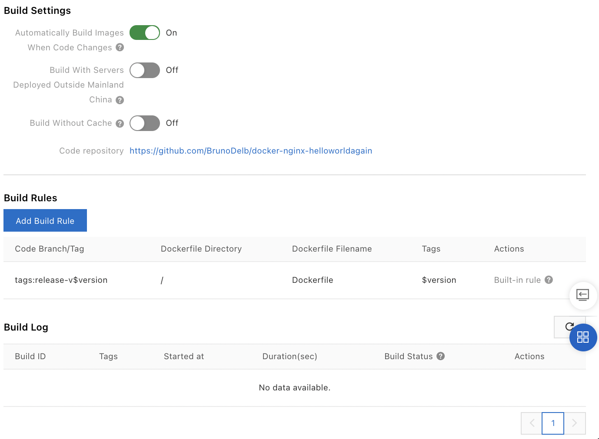
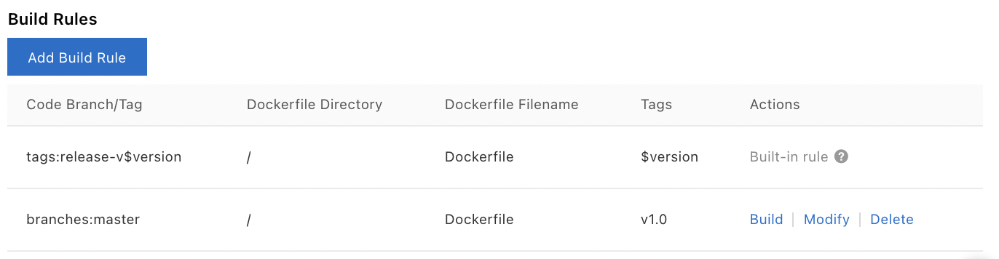
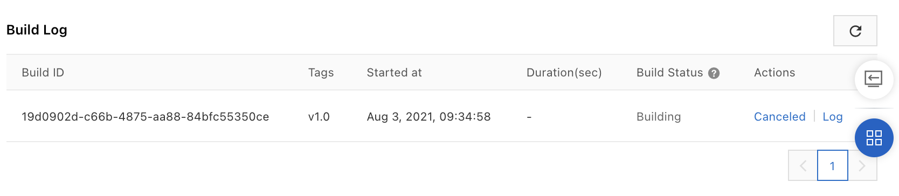
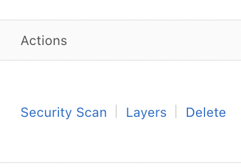
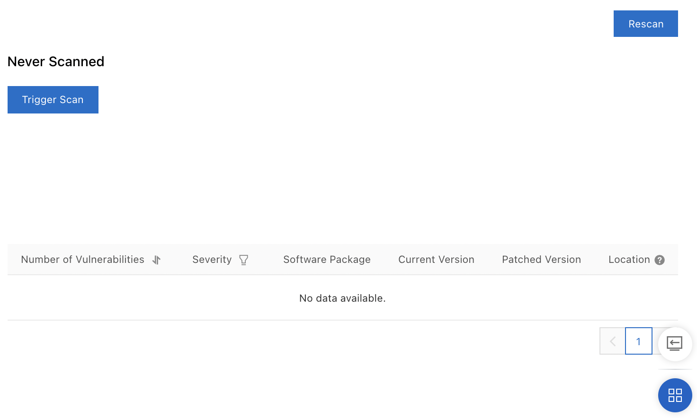

# Container Registry 

Container Registry allows to create images based on Dockerfile. There
are two editions: the personal version and the enterprise version.

On the Container Registry console, select the personal instance:

-   Go to the `Container Registry `console,

-   Click on the corresponding edition.

{width="2.746781496062992in"
height="1.2881889763779528in"}

The namespace is a collection of repositories. The repository is a
collection of images.

Build rules allow to create an image automatically.

RAM is used to manage access to resources.

It is possible to run a scan of an image to detect possible
vulnerabilities.

## The namespaces 

A namespace is a collection of repositories. A good practice is to group
the repositories of an organization (company, team, \...) in a
namespace.

The limit is 3 namespaces per Alibaba Cloud account.

To create a:

-   Go to the `Container Registry `console,

-   Click on `Instance of Personal Edition`,

-   Click on `Repository \| Namespace`,

{width="3.8439873140857395in"
height="0.6353258967629046in"}

-   Click on `Create Namespace`,

-   `Namespace:` this is the name of the namespace,

-   Click on `Confirm`.

{width="1.8777723097112862in"
height="1.211859142607174in"}

By default, repositories are created automatically when a push is made.
It is possible to modify this behavior (`Automatically Create
Repository `radio button).

By default, the repositories are private. It is possible to change this
behavior (`Default Repository Type `radio button).

## The repositories 

A repository is a collection of images. A good practice is to group all
the images of an application in a repository.

A repository can be public or private.

It is possible to trigger a notification when an image is uploaded
(webhook). These notifications can be triggered either from a regular
expression or from a specified list of tags.

You can change the permissions (read-only, write, admin) for a specific
repository.

To create a repository:

-   Go to the `Container Registry `console,

-   Click on `Instance of Personal Edition`,

-   Select a region,

-   Click on `Repository \| Repositories`,

-   Click on `Create Repositories`,

-   `Namespace`: this is the namespace,

-   `Repository Name`: this is the name of the repository,

-   `Repository Type:` this is the type of repository,

-   `Summary`: this is the summary,

-   Click on `Next`,

{width="2.5943810148731408in"
height="2.347354549431321in"}

-   `Source Code`: select `Local Repository`,

-   Click on `Create Repositories`.

{width="2.6349573490813647in"
height="1.9794706911636046in"}

A page displaying the details appears:

{width="4.5in"
height="2.3958333333333335in"}

To have the image generated automatically when the code changes,
activate `Automatically Build Images When Code Changes`.

If the source code is located outside of Mainland China, it is
recommended to enable `Build With Servers Deployed Outside Mainland
China `as some sites outside of China are not accessible from Mainland
China.

To create the image without using the cache, check `Build Without
Cache`.

## The builds 

To create an image when the code changes:

-   Go to the `Container Registry `console,

-   Click on `Instance of Personal Edition`,

-   Select a region,

-   Click on `Repository \| Repositories`,

-   Click on `Manage `on the line of the repository,

-   Click on `Build`.

{width="3.15496062992126in"
height="2.3170461504811897in"}

To have the image generated automatically when the code changes,
activate `Automatically Build Images When Code Changes`.

If the source code is located outside of Mainland China, it is
recommended to enable `Build With Servers Deployed Outside Mainland
China `as some sites outside of China are not accessible from Mainland
China.

To create the image without using the cache, check `Build Without
Cache`.

To create a build rule:

-   Go to the `Container Registry `console,

-   Click on `Instance of Personal Edition`,

-   Select a region,

-   Click on `Repository \| Repositories`,

-   Click on `Manage `on the image line,

-   Click on `Build`,

-   Click on `Add Build Rule`,

To modify a build rule, click `Modify `on the line of the rule.

-   `Type:` this is the type of trigger of the deposit:

```{=html}
<!-- -->
```
-   `Branch`: this is a branch that triggers the build; select the
    branch name,

-   `Tag`: this is a tag that triggers the build; select the name of
    the tag,

```{=html}
<!-- -->
```
-   `Dockerfile Directory:` this is the directory where the
    `Dockerfile` is located,

-   `Dockerfile Filename`: this is the name of the `Dockerfile `(by
    default `Dockerfile`),

-   `Tags`: this is the tag of the image that will be created,

-   Click on `Confirm`.

{width="2.8843635170603674in"
height="1.8966469816272966in"}

To run a build rule, click on `Build `on the line of the rule in the
`Build Rules `section.

{width="3.4197069116360455in"
height="0.8871183289588801in"}

To display the logs, click on `Log `on the line of the build.

{width="3.6085958005249346in"
height="0.7874311023622047in"}

To display the list of created images:

-   Go to the `Container Registry `console,

-   Click on `Instance of Personal Edition`,

-   Select a region,

-   Click on `Repository \| Repositories`,

-   Click on `Manage `on the line of the image,

-   Click on `Tags`.

{width="4.5in"
height="0.6236111111111111in"}

## Access control to repositories 

By default, the Alibaba Cloud account has access to all resources. It is
also possible to provide access to sub-accounts using RAM (Resource
Access Management) and STS (Security Token Service).

To give permissions to a RAM user, you must use the appropriate policy:

-   `AliyunContainerRegistryFullAccess `to give full access:

{

\"Statement\": \[

{

\"Action\": \"cr:\*\",

\"Effect\": \"Allow\",

\"Resource\": \"\*\"

}

\],

\"Version\": \"1\"

}

-   `AliyunContainerRegistryReadOnlyAccess `to give read-only access:

{

\"Statement\": \[

{

\"Action\": \[

\"cr:Get\*\",

\"cr:List\*\",

\"cr:PullRepository\"

\],

\"Effect\": \"Allow\",

\"Resource\": \"\*\"

}

\],

\"Version\": \"1\"

}

`Resources `are identified with the following format:

acs:cr:\$regionid:\$accountid:repository/\$namespacename/\$repositoryname

It is possible to use `\* `at the region and account level.

Permissions (`Action`) are values in the form `cr:CreateRepository`.

## Image security scan 

You can run a scan of an image to detect possible vulnerabilities. A
vulnerability report is then produced. Each vulnerability is displayed
with its level (`High`, `Medium`, `Low `or `Unknown`) as well as
the versions correcting these vulnerabilities.

To start a scan:

-   Go to the `Container Registry `console,

-   Click on `Instance of Personal Edition`,

-   Select a region,

-   Click on `Tags`,

-   Click on `Security Scan `on the line of the image,

{width="0.7791207349081365in"
height="0.5430238407699037in"}

-   Click on `Trigger Scan`.

{width="2.834987970253718in"
height="1.702742782152231in"}
