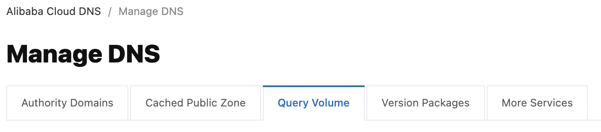

# DNS 

Domain names not registered by Alibaba Cloud can be managed by Alibaba
Cloud. They can be grouped into clusters. Subdomains are also supported.

Alibaba Cloud DNS supports DNS records of type `A`, `CNAME`, `MX`,
`AAAA`, `TXT`, `NS`, `SRV`, `CAA`, `URL`, `PTR` as well as
implicit URL forward, which uses an iFrame, and explicit, which uses
HTTP code. DNS records can be imported into the DNS console from a file.

Intelligent DNS resolution returns an IP address based on the origin of
the visitor. IP addresses can be weighted.

Alibaba Cloud DNS can be used as a secondary DNS.

DNS Cache is a DNS proxy that allows to use Alibaba Cloud DNS without
DNS migration.

SearchEngine allows the website to be indexed only from the specified IP
address.

DNSSEC secures the authenticity of the response provided by the DNS
server while domain names are protected against DDoS attacks. Two levels
of protection are available: basic or advanced.

The paid version of Alibaba Cloud DNS allows to see the volume of DNS
requests.

## Management of the Domain names

First of all, if the domain name you want to manage is not registered in
Alibaba Cloud, you must first add it in the DNS console.

To add a domain name that has been registered in Alibaba Cloud:
-   Go to the `Domains` console,
-   Click on `Resolve` on the line of the domain name,

{width="4.5in" height="1.3291666666666666in"}
-   Modify DNS records.

{width="4.5in"
height="1.5055555555555555in"}

To add a domain name that has not been registered in Alibaba Cloud:
-   Go to the `Alibaba Cloud DNS` console,
-   Click on `Manage DNS`,
-   Click on `Add Domain Name`,
-   Enter a primary domain or subdomain,
-   Click on `OK`.

{width="2.0209087926509186in"
height="1.0397703412073491in"}

To delete a domain name that is not registered in Alibaba Cloud:
-   Go to the `Alibaba Cloud DNS` console,
-   Click on `Manage DNS`,
-   Select the line of the domain name,
-   Click on `Delete`,
-   Click on `OK`.

A domain name registered in Alibaba Cloud cannot be deleted.

Alibaba Cloud DNS supports sub-domains. As a reminder:
-   `mywebsite.com` is a top level domain, also known as a main TLD,
-   `www.mywebsite.com` is a second level subdomain,
-   `backup.www.mywebsite.com` is a third level subdomain.

Alibaba provides a DNS inspection tool, which is useful to get detailed
information about DNS records: `https://zijian.aliyun.com/`.

To add a subdomain hosted by Alibaba Cloud DNS to a domain hosted by a
third-party DNS provider:
-   Go to the `Alibaba Cloud DNS` console,
-   Click on `Manage DNS`,
-   Click on `Add Domain Name`,
-   Enter the subdomain,
-   Click on `Verify TXT Record`,

{width="1.9001017060367453in"
height="0.9626596675415573in"}
-   Copy the host and `TXT` records,

{width="1.627477034120735in"
height="1.2723458005249344in"}
-   Go to your third party DNS provider,
-   Paste these values,
-   Validate the change,
-   Return to the `Alibaba Cloud DNS` console,
-   Click on `Verify`,
-   Click on `Verified`: the subdomain should appear in the list,
-   Click on the subdomain,
-   Click on `Add Record`,
-   Add NS records to the primary domain: these values are displayed in
    the `Alibaba Cloud DNS` console.

## Management of the groups

To facilitate the management of DNS records, domain names can be
grouped. The `ALL` group is the default group. It is created
automatically. The number displayed next to it indicates the number of
domain names managed by Alibaba Cloud DNS.

To create a group:
-   Go to the `Alibaba Cloud DNS` console,
-   Click on `Manage DNS`,
-   Click on the `ALL` list and then click on `+`,
-   Enter a group name,
-   Click on the validation icon.

To change a group name and delete a group:
-   Go to the `Alibaba Cloud DNS` console,
-   Click on `Manage DNS`,
-   Click on `ALL` and then on the edit icon.

{width="0.8135531496062992in"
height="0.6754024496937883in"}

To create a group, click on the "plus" icon, enter the name of the
group and validate the entry.

To delete a group, click on the trash can icon on the line of the group.

To change the group to which a domain name belongs:
-   Go to the `Alibaba Cloud DNS` console,
-   Click on `Manage DNS`,
-   Click on the domain name,
-   Click on `Change Group`,
-   Select the destination group,
-   Click on `OK`.

{width="1.7310542432195974in"
height="0.9475393700787401in"}

The ALL group is the default group created automatically. The number
displayed next to it indicates the number of domain names managed by
Alibaba Cloud DNS.

A domain name cannot be added to multiple groups.

Deleting a group will delete the domain names in that group.

A domain name cannot be added to multiple groups.

## Management of the DNS records

In this section, we will explore how to handle DNS records of type
`A`, `CNAME`, `MX`, `AAAA`, `TXT`, `NS`, `SRV`, `CAA`,
`URL`, `PTR` as well as implicit and explicit forward with Alibaba
Cloud DNS.

{width="3.000075459317585in"
height="2.411172353455818in"}

### Add a DNS record 

#### The A

An `A` record indicates an IP address.

To add a record `A:`
-   Go to the `Alibaba Cloud DNS` console,
-   Click on `Manage DNS`,
-   Click on a domain name,
-   Click on `Add Record`,
-   `Type`: select `A`,
-   `Host:` enter `XXX` (if the subdomain is `XXX.mywebsite.com`)
    or `@` (if the subdomain is `mywebsite.com`),
-   `ISP Line`: this is the ISP line; select `Default`,
-   `Value:` this is the IPv4 address,
-   `TTL`: this is the duration of the cache (10 minutes by default),
-   Click on `Confirm`.

#### The CNAME record

A `CNAME` record provides an alias to a domain. It allows a domain
name to point to another domain name that is associated with an IP
address.

These records are used with CDN, emails and Global Traffic Manager.

To add a `CNAME` record:
-   Go to the `Alibaba Cloud DNS` console,
-   Click on `Manage DNS`,
-   Click on the domain name,
-   Click on `Add Record`,
-   `Type`: select `CNAME`,
-   `Host:` enter `XXX` (if the subdomain is `XXX.mywebsite.com`)
    or `@` (if the subdomain is `mywebsite.com`),
-   `ISP Line`: this is the ISP line; select `Default`,
-   `Value:` this is the IPv4 address,
-   `TTL`: this`` is the duration of the cache (10 minutes by
    default),
-   Click on `Confirm`.

#### MX recording

The `MX` (Mail eXchanger) record allows to receive emails. It
indicates the mail server that receives emails according to the suffix
of the recipient's email.

To add a `MX` record:
-   Go to the `Alibaba Cloud DNS` console,
-   Click on `Manage DNS`,
-   Click on the domain name,
-   Click on `Add Record`,
-   `Type`: select `MX`,
-   `Host`: enter `YYY` (if the subdomain is XXX@YYY.mywebsite.com)
    or `@` (if the subdomain is XXX@mywebsite.com),
-   `ISP Line`: this is the ISP line; select `Default`,
-   `Value`: this value can be obtained from the email registrar,

This can be a domain name or an IP address.

Use `mx1.qiye.aliyun.com` or `mx2.qiye.aliyun.com` for Alibaba Mail.
-   `MX Priority`: this value can be obtained from the email
    registrar,

The smaller the value, the higher the priority.
-   `TTL`: this`` is the duration of the cache (10 minutes by
    default),
-   Click on `Confirm`.

To create a mailbox, you need to add a `MX`, `CNAME` and `TXT`
record.

#### AAAA registration

The AAAA record allows website visitors to use an IPv6 address.

To add a `AAAA` record:
-   Go to the `Alibaba Cloud DNS` console,
-   Click on `Manage DNS`,
-   Click on the domain name,
-   Click on `Add Record`,
-   `Type`: select `AAAA`,
-   `Host`: enter `XXX` (for subdomains like `XXX.mywebsite.com`)
    or `@` (for subdomains like `mywebsite.com`),
-   `ISP Line`: this is the ISP line; select `Default`,
-   `Value:` this is the IPv6 address,
-   `TTL`: this is the duration of the cache (10 minutes by default),
-   Click on `Confirm`.

#### The TXT record

The `TXT` record is used to identify and describe the domain. In
general, the `TXT` record is used as an `SPF` (Sender Policy
Framework) record to prevent spam. Only IP addresses listed in the `A`
and `MX` records of the domain name are allowed to use this domain
name to send emails,

To add a `TXT` record:
-   Go to the `Alibaba Cloud DNS` console,
-   Click on `Manage DNS`,
-   Click on the domain name,
-   Click on `Add Record`,
-   `Type`: select `TXT`,
-   `Host`: enter `XXX` (for domain names like
    `XXX.mywebsite.com`) or `@` (for domain names like
    `mywebsite.com`),
-   `ISP Line`: this is the ISP line; select `Default`,
-   `Value`: this is the valuecof the SPF,
-   `TTL`: this`` is the duration of the cache (10 minutes by
    default),
-   Click on `Confirm`.

#### NS registration

The `NS` record allows to delegate a subdomain to another DNS
provider.

To add a `NS` record:
-   Go to the `Alibaba Cloud DNS` console,
-   Click on `Manage DNS`,
-   Click on the domain name,
-   Click on `Add Record`,
-   `Type`: select `NS`,
-   `Host`: enter `XXX` (for domains like `XXX.mywebsite.com`) to
    ensure that the DNS resolution of this domain is delegated to
    another DNS provider,
-   `ISP Line`: this is the ISP line; select `Default`,
-   `Value`: enter the domain name to delegate,
-   `TTL`: this`` is the duration of the cache (10 minutes by
    default),
-   Click on `Confirm`.

#### SRV registration

The `SRV` record identifies a server that uses a specific server. It
is used for directory management by Microsoft.

To add an `SRV` record:
-   Go to the `Alibaba Cloud DNS` console,
-   Click on `Manage DNS`,
-   Click on the domain name,
-   Click on `Add Record`,
-   `Type`: select `SRV`,
-   `Host`: enter a host name in the format
    `_<SERVICE_NAME>._<PROTOCOL>,`
-   `ISP Line`: this is the ISP line; select `Default`,
-   `Value`: this is the value of the record with spaces between each
    element,
-   `TTL`: this is the duration of the cache (10 minutes by default),
-   Click on `Confirm`.

#### CAA Registration

The `CAA` (Certification Authority Authorization) record can only be
added with the paid edition of Alibaba Cloud DNS.

It allows to specify certification authorities (CAs) that are authorized
to issue certificates for the domain. Requests to obtain an SSL or TLS
certificate for the domain are rejected for unauthorized CAs.

#### PTR registration

The `PTR` record is used to associate IP addresses with domain names
to enable reverse DNS lookup. If you are using Alibaba Cloud servers, a
ticket must be submitted to help configure reverse DNS lookup.

### Enable URL forwarding 

To point a domain name to a website (for example: from
`http://mywebsite.com` to `http://www.aliyun.com:80`), an URL
forward record must be added.

The URLs before the forward only support HTTP while the destination URLs
support both HTTP and HTTPS.

The URL forward does not benefit from the attack protection service. To
benefit from it, you must use an `A` or `CNAME` record.

Before adding an URL forward record, you must have completed the ICP
deposit for the domain name prior to the URL forwarding.

There are two types of URL forwarding:
-   the implicit one, which uses the iFrame,
-   the explicit one, which uses the HTTP code 301 or 302.

The implicit URL forward uses an iFrame. The URL displayed in the
browser is therefore the original URL but the content of the iFrame
corresponds to the content of the destination website.

To enable implicit URL forwarding:
-   Go to the `Alibaba Cloud DNS` console,
-   Click on `Manage DNS`,
-   Click on the domain name,
-   Click on `Add Record`,
-   `Type`: select `Implicit URL`,
-   `Host`: enter `XXX` (for domain names like
    `XXX.mywebsite.com`) or `@` (for domain names like
    `mywebsite.com`),
-   `ISP Line`: this is the ISP line; select `Default`,
-   `Value`: this is the URL to which the forward is made; it is not
    possible to use an IP address,
-   `TTL`: this`` is the duration of the cache (10 minutes by
    default),
-   Click on `Confirm`.

Explicit URL forwarding uses permanent (HTTP code 301) or temporary
(HTTP code 302) redirection. The URL entered in the browser is the
original URL but is replaced by the target URL.

To enable implicit URL forwarding:
-   Go to the `Alibaba Cloud DNS` console,
-   Click on `Manage DNS`,
-   Click on the domain name,
-   Click on `Add Record`,
-   `Type`: select `Implicit URL`,
-   `Host`: enter `XXX` (for domain names like
    `XXX.mywebsite.com`) or `@` (for domain names like
    `mywebsite.com`),
-   `ISP Line`: this is the ISP line; select `Default`,
-   `Value:` this is the HTTP redirection code used (`301` or
    `302`),
-   `TTL`: this`` is the duration of the cache (10 minutes by
    default),
-   Click on `Confirm`.

### Edit and delete a record 

To edit a record:
-   Go to the `Alibaba Cloud DNS` console,
-   Click on `Manage DNS`,
-   Click on the domain name,
-   Click on `Edit` on the record line.

It is possible to change the DNS server IP address, record type, host
name, ISP line and TTL.

To delete a record:
-   Go to the `Alibaba Cloud DNS` console,
-   Click on `Manage DNS`,
-   Click on the domain name,
-   Click on `Delete` on the record line,
-   Click on `OK`.

It is recommended to export the DNS record before deleting it.

A disabled DNS record cannot be queried by a DNS query after the TTL
timeout on the local DNS server has expired.

To enable or disable a DNS record:
-   Go to the `Alibaba Cloud DNS` console,
-   Click on `Manage DNS`,
-   Click on a domain name,
-   To activate the recording, click on `Enable` on the recording
    line,
-   To disable the recording, click on `Disable` on the recording
    line.

## Import and export of DNS records 

It is possible to import DNS records into the DNS console from a file in
XLS, XLSX and ZONE format. For XLS and XLSX files, you need to use the
download template.

Two import modes are available:
-   `incremental update`: adds new DNS records while keeping two
    existing ones,
-   `full update`: deletes all existing DNS records and then adds the
    DNS records that are in the file.

To import DNS records:
-   Go to the `Alibaba Cloud DNS` console,
-   Click on `Manage DNS`,
-   Click on the domain name,
-   Click on `Import & Export,`
-   Select an import mode,
-   Click on `Upload`,
-   Click on `Complete`.

{width="3.2159733158355204in"
height="1.6228751093613298in"}

In the template, it is possible to specify descriptions and statuses
(`Normal` or `Disabled`).

To export `DNS` records:
-   Go to the `Alibaba Cloud DNS` console,
-   Click on `Manage DNS`,
-   Click on the domain name,
-   Click on `Import & Export,`
-   Click on the `Export Records` tab,
-   Select the type of export file,
-   Click on `Export`.

{width="1.6411012685914261in"
height="0.7187423447069117in"}

## DNS optimization 

In this section, we will study:
-   Intelligent DNS resolution, which returns an IP address based on the
    visitor's origin to reduce latency and improve website access
    speed,
-   taking into account the search engines that consume bandwidth,
-   weighting of IP addresses in DNS records,
-   DNS cache that allows to use Alibaba Cloud DNS without DNS
    migration,
-   the secondary DNS which is a backup DNS service.

### Enable intelligent DNS resolution 

With traditional DNS resolution, the DNS server returns one of the IP
addresses randomly. Intelligent DNS resolution returns an IP address
based on the visitor's origin to reduce latency and improve website
access speed.

To enable intelligent DNS resolution:
-   Go to the `Alibaba Cloud DNS` console,
-   Click on `Manage DNS`,
-   Click on a domain name,
-   Click on `Add Record`,
-   For China Telecom:

```{=html}
<!-- -->
```
-   `ISP line`: enter `Default`,
-   `Value`: enter `<IP_ADDRESS1>,`

```{=html}
<!-- -->
```
-   For China Unicom:

```{=html}
<!-- -->
```
-   `ISP line`: enter `China Unicom`,
-   `Value`: enter `<IP_ADDRESS2>,`

```{=html}
<!-- -->
```
-   For China Mobile:

```{=html}
<!-- -->
```
-   `ISP Line`: enter `China Mobile`,
-   `Value`: enter `<IP_ADDRESS3>,`

```{=html}
<!-- -->
```
-   Click on `Confirm`.

These resolution lines depend on the version of Alibaba Cloud DNS (Free
Edition, Personal Edition, Enterprise Standard Edition, Enterprise
Ultimate Edition).

### Take into account the search engines 

Search engines use scripts that automatically collect content from the
Internet. These operators consume bandwidth.

It is possible to add a registration for a specific domain name and a
specific referencing robot.

Rather than disabling SEO (Search Engine Optimization) altogether,
`SearchEngine` allows the website to be indexed only from the
specified IP address.

To do this, specify `Search Engine Robot` as the ISP line:
-   Go to the `Alibaba Cloud DNS` console,
-   Click on `Manage DNS`,
-   Click on a domain name,
-   Click on `Add Record`,
-   `ISP Line`: select the search robot (supported values are `Baidu
    Robots`, `Bing Robots` and `Google Robots`),
-   Specify a search engine robot,
-   Click on `Confirm`.

### Enable weighting at the DNS level 

When you use multiple IP addresses for a host record on Alibaba Cloud
DNS, you can set a weight for each IP address. Alibaba Cloud DNS then
responds to DNS queries according to these weights, performing load
balancing. Records corresponding to these IP addresses must have the
same type (`A`, `CNAME`, or `AAAA`), the same host, and the same
row.

There are two load balancing policies:
-   `Return all addresses`: the traffic of the domain name is
    distributed equally among the IP addresses,
-   `Return addresses by weight`: the traffic of the domain name is
    distributed according to the weight.

To activate the weighting:
-   Go to the `Alibaba Cloud DNS` console,
-   Click on `Manage DNS`,
-   Click on a domain name,
-   Click on `Weighted Round Robin`,

{width="4.5in" height="1.6479166666666667in"}
-   Click on `Set Weight` on the line of the domain name,
-   Click on `OK`,
-   Click on `Set Weight`,
-   `Weight`: this is the weight associated with the input,
-   Click on `Confirm`.

{width="2.5419094488188976in"
height="2.19788823272091in"}

On-premise DNS sends queries to Alibaba Cloud DNS only once during the
TTL period.

### Enable DNS cache 

DNS Cache is a DNS proxy that allows to use Alibaba Cloud DNS without
DNS migration. Its advantages are as follows:
-   protection against DDoS attacks by reducing the load on DNS servers,
-   accelerated access thanks to nodes close to the users,
-   backup of DNS servers thanks to the cache,
-   if you use on-premise DNS, reduced bandwidth consumption.

To configure the DNS cache:
-   Go to the `Alibaba Cloud DNS` console,
-   Click on `Manage DNS`,
-   Click on the `Cached Public Zone` tab,
-   Click on `Create Cached Public Zone`,
-   `Cached Public Zone`: this is the domain name for which to enable
    cache acceleration,
-   `Bound Instances`: this is the instance to be bound,

To purchase an instance, click on `Buy Instance`.
-   `TTL for Source Cached Data (Min. Value)` and `TTL for Source
    Cached Data (Max. Value)`: this is the minimum and maximum TTL
    during which the DNS records of the domain name with cache
    acceleration are effective (from 30 to 86400 seconds),
-   `Source DNS Query Protocol`: this is`` the protocol used for
    resolution requests sent to servers,

Only UDP is supported.
-   `Source DNS Server Supports edns-client-subnet:` indicates that
    the authoritative server supports the EDNS (Extension for DNS)
    protocol,

During recursive resolution requests for on-premise DNS, DNS Cache sends
the client's IP address to the originating DNS server.
-   `Source DNS Servers`: these are the original DNS servers,
-   Click on `Confirm`.

+-----------------------------------------------------------------------+
| {width="2.9364654418197724in"   |
| height="1.997580927384077in"}                                         |
|                                                                       |
| {width="2.930139982502187in"    |
| height="1.366946631671041in"}                                         |
+=======================================================================+
+-----------------------------------------------------------------------+

### Set up a secondary DNS 

Secondary DNS is a convenient backup DNS service when you use an
on-premise DNS service or a third-party managed DNS. Alibaba Cloud DNS
plays the role of secondary DNS while the other DNS service plays the
role of primary DNS. When the secondary DNS is activated, the records of
the secondary DNS are no longer editable.

If the primary DNS fails, Alibaba Cloud DNS switches to the secondary
DNS. The primary DNS service sends notifications about record changes to
the secondary DNS using the NOTIFY protocol.

## Securing 

DNS is a basic service that is crucial for the functioning of services.
It is therefore very important that it is properly secured.

In this section, we will study:
-   DNS protection, which protects domain names against DDoS attacks,
-   DNSSEC protection that secures the authenticity of the response
    provided by the DNS server to assure users that they are viewing the
    real website.

### Enable DNS protection 

Alibaba Cloud DNS protects domain names from distributed denial of
service (DDoS) attacks. These attacks involve sending a massive number
of DNS requests to saturate the service's bandwidth.

Alibaba Cloud DNS provides the following levels of protection against
these attacks:
-   the basic level,
-   the advanced level.

The basic level protects domain names against up to 10 million attack
requests per second. This level is suitable for standard DDoS attacks.

The advanced level protects domain names against over 100 million DDoS
attack requests per second. It is suitable for large DDoS attacks.

DNS protection is automatically activated on domain names.

To view the status of DNS protection on a domain name:
-   Go to the `Alibaba Cloud DNS` console,
-   Click on a domain name,
-   Click on `DNS Protection`.

{width="3.1469575678040247in"
height="0.8649278215223097in"}

The protection states are:
-   `Start scrubbing` and `Stop scrubbing` indicate the start and
    end of the `scrubbing` mode,
-   `Black hole enabled` and `black hole disabled` indicate the
    beginning and end of the `black hole` mode.

With `Scrubbing` mode, if an abnormally high number of queries is made
on domain names, the DNS servers no longer respond to abnormal queries.

With `black hole` mode, if the number of queries eventually exceeds
the defense capabilities, the DNS servers do not respond to these
queries at all.

### DNSSEC protection 

DNSSEC secures the authenticity of the response provided by the DNS
server to assure users that they are viewing the real website. It is a
protection against the attack of changing the IP address of a domain
name on a DNS server.

## Monitoring 

The paid version of Alibaba Cloud DNS allows to see the volume of DNS
queries, which is an interesting indicator for understanding website
visits.

To retrieve the DNS `Query` Volume:
-   Go to the `Alibaba Cloud DNS` console,
-   Click on `Manage DNS`,
-   Click on the `Query Volume` tab; DNS queries on primary domains
    are displayed,

```{=html}
<!-- -->
```
-   Click on `No Queries` to retrieve the primary domains that have
    not received any DNS queries in the last 7 days,
-   The `Query Volume` tab displays the previous day's query volume;
    it is also possible to display the query volume for today or for the
    last 7 or 15 days,

```{=html}
<!-- -->
```
-   Click `Details` on the line of the primary domain name to view the
    volume of DNS queries for its subdomains,

```{=html}
<!-- -->
```
-   To search for the volume of queries by subdomain, enter the full
    name of the subdomain.

{width="2.81919072615923in"
height="0.6230063429571303in"}

