# ECS 

ECS (Elastic Compute Service) is a compute service whose CPU and memory
characteristics depend on the ECS instance family. It is possible to
connect to the ECS instance, install software and run processes.

You can manage the life cycle of an ECS instance. An ECS instance can be
created manually, from a custom image or by using a Launch Template.

You can change some parameters of an ECS instance (its type, the
bandwidth used by its EIP, the method of charging for network usage, the
instance's bandwidth and its private or public IP address). Its public
IP address can also be converted to an EIP.

The instance identity, accessible via REST API, provides a description
of the instance, which allows it to be validated. The metadata provides
basic information about the instance. The User Data allows to customize
the behavior of the boot.

The connection to the instance depends on the operating system (Linux or
Windows).

ECS instances are created from a selected image in the Marketplace.

The tags assigned to the instances simplify the handling of the ECS
instances.

The instances have a system disk and one or more data disks. There are
several categories of disks, with different characteristics (latency,
performance and durability, ...).

Security groups are used to filter packets in order to isolate
instances. There are basic security groups, which are simplified, and
advanced ones.

An ENI (Elastic Network Interface) is a virtual NIC (Network Interface
Controller) which allows to manage the network in a fine way and to set
up high availability or to carry out failovers.

It is possible to make backups (snapshots) manually or automatically by
creating a snapshot policy.

The monitoring of the ECS instances can be done by the ECS console or by
an API.

Finally, Deployments Sets allow you to control the distribution of
instances on the physical servers.

## The ECS instance 

The billing method can be `Subscription` or `Pay-As-You-Go`.
Subscription allows to obtain significant discounts. Pay-per-use allows
to pay only for what you use.

The region and area in which the instance is deployed cannot be changed
after creation.

The ECS instance is based on an image. The image can be public, custom,
shared or from a Marketplace.

To connect to a Linux instance, you can use a SSH key pair or a
password, while for Windows you can only use a password.

An instance can have a maximum of 16 disks. There are two types of
disks:
-   system disks (`System Disk`),
-   data disks (`Data Disk`).

The system disk is needed to install the operating system.

The data disk is optional and contains the data. It can be empty. It can
be encrypted. It can be created from a snapshot.

The billing method for the disk is the same as for the instance. A
`subscription` disk must be released together with the corresponding
instance, while a `Pay-As-You-Go` disk can be released separately or
together with the instance.

The network type used by the instance can be VPC or classic network.
With the VPC network type, Alibaba Cloud creates a VPC and a vSwitch by
default. The classic network is only for ECS instances that were first
used before June 16, 2016.

Only certain instance types support ENIs. ENIs are released with the
instance.

A public IP address can be assigned to the instance at creation. In this
case, it cannot be detached from the instance. If the instance does not
need to access the Internet or if the VPC instances use an EIP to access
the Internet, it is not necessary to assign a public IP address.

User Data allows to provide code that customizes the instance at
startup.

To view information about the ECS instances in an account on the
Instance List page:
-   Go to the `ECS` console,
-   Click on `Instances`,

{width="4.5in"
height="1.2229166666666667in"}
-   Select the region,
-   Click on the wheel icon {width="0.20959536307961504in"
    height="0.20343066491688538in"},
-   Change the filter,
-   Click on `OK`.

{width="2.8132283464566927in"
height="1.8233891076115485in"}

## Creation of an instance 

To create an instance using a system disk snapshot, you can use the
wizard.

To create an instance using the wizard:
-   Go to the `ECS` console,
-   Click on `Instances`,
-   Click on `Create Instance`,
-   `Billing Method`: this is the billing method (`Subscription` or
    `Pay-As-You-Go`),

{width="3.4513090551181103in"
height="0.24500109361329833in"}

If the billing method is `Subscription`, specify the duration and
whether automatic renewal should be activated (`Auto renewal`).
-   `Region`: this is the region,

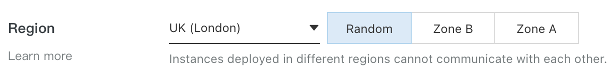{width="2.9383125546806648in"
height="0.35459208223972005in"}

The region cannot be changed after creation.
-   `Zone`: this is the zone,

The area cannot be modified after creation. An area is randomly
assigned.
-   `Instance Type`: this is the type of instance,

Not all instance types are available in all regions.

{width="4.5in"
height="2.026388888888889in"}
-   `Quantity`: this is`` the number of instances,

{width="3.722108486439195in"
height="0.5853138670166229in"}
-   `Image`: this is the image,

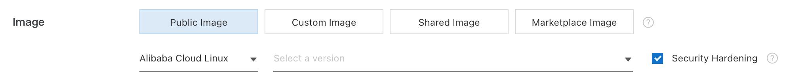{width="4.5in" height="0.44930555555555557in"}

The image serves as the basis for the instance.`
-   System Disk` (required): this is the system disk; specify the Cloud
    Disk category and its size,

The system disk is needed to install the operating system.

The list of Cloud Disk categories depends on the selected region.

The default size is 40 GiB and the maximum is 500 GiB. If the size of
the selected image file is greater than 40 GiB, the disk size will
correspond to the size of the image.
-   `Data Disk` (optional): this is the data disk,

It is possible to create an empty data disk, possibly encrypted or from
a snapshot.

There can be a maximum of 16 disks.

If the selected instance type has local disks, these disks are
displayed.

The category and quantity of disks depends on the type of instance.

{width="4.5in"
height="0.9034722222222222in"}
-   `Backup Period`: this is the automatic snapshot policy,

The automatic snapshot policy triggers the backup by default every day
at 6:00 am and has a retention period of 7 days.
-   `Data Source:` this is the source,
-   Click on `Next: Networking`,
-   `Network Type`: select `VPC` and a vSwitch,

{width="4.5in" height="0.4423611111111111in"}
-   To assign a public IP address to the instance, select `Assign
    Public IPv4 Address`, `Pay-By-Traffic` and then the bandwidth,

{width="4.5in" height="0.81875in"}
-   `Select Security Group`: this`` is the security group,

{width="4.5in"
height="1.4951388888888888in"}
-   If the instance type supports ENIs, you can add one and specify a
    vSwitch,

{width="4.5in" height="0.37777777777777777in"}
-   Click on `Next: System Configurations`,
-   `Logon Credentials`: these are the connection identifiers (a pair
    of SSH keys or a password for Linux, a password for Windows),

{width="3.4056277340332457in"
height="0.5050634295713036in"}
-   Specify the name of the instance,
-   `Instance RAM role`: this is the RAM role assigned to the
    instance,
-   `User Data`: this is the code that customizes the instance at
    startup,
-   Click `Next: Grouping`,
-   Click `Save as launch template` (optional) to save the
    configuration as a Launch Template,

{width="1.1754680664916886in"
height="0.26430774278215224in"}
-   To be guided to use the APIs, click on `View Open API`,

{width="0.986917104111986in"
height="0.30429899387576553in"}
-   Click on `Create Instance`.

To create an instance with the same configuration as an ECS instance,
duplicate this ECS instance with the same configuration:
-   Go to the `ECS` console,
-   Select the region,
-   Click on `Instances`,
-   Click on `More | Buy Same Type` on the line of the instance,

{width="4.5in"
height="2.6729166666666666in"}
-   To modify a configuration, click on the pencil icon
    {width="0.18409120734908135in"
    height="0.13636373578302713in"}.

To create a preemptible instance:
-   Go to the `ECS` console,
-   Select `Instances`,
-   Click on `Create Instance`,
-   `Billing Method`: select `Preemptible Instance`,
-   `Maximum Price for Instance Type`: this is`` the maximum price
    you are willing to pay,

{width="2.378891076115486in"
height="0.4350284339457568in"}

If your bid is higher than the current market price, the instance
starts.
-   Select the number of instances to purchase,
-   Click on `Next` until the last page,
-   Click on `Create Instance`.

A preemptible instance is marked `Pay-As-You-Go-Preemptible` in the
instance list.

To view details about ECS instances:
-   Go to the `ECS` console,
-   Click on `Instances`,
-   Select a region,
-   Click on the instance ID.

The following information is displayed:
-   `Basic Information`: this is the basic information (image ID,
    instance name, region, zone, instance type, instance type familiy,
    key pair name for Linux, instance RAM role, tags, CPU, memory, I/O
    optimization, operating system, ...),

{width="4.5in"
height="3.3493055555555555in"}
-   `Network Information:` this is the configuration information (type
    of networks, IP addresses, information on the VPC, ...),

{width="4.1442825896762905in"
height="1.273982939632546in"}
-   `Billing Information`: this is the payment information (billing
    method, network usage),

{width="4.006522309711286in"
height="0.523073053368329in"}
-   `Other Information`: this is other information (instance type, SSH
    key pair, RAM role, ...).

## Creation of an instance from a custom image 

To create an ECS instance with the same operating system, applications
and data, you can create a custom image and use it to create the new
instance.

The image and the instance must be in the same region. If this is not
the case, you have to copy the custom image to the region of the future
instance.

If the owner of the image is another account, the image must be shared
with you.

If the selected image contains more than one snapshot of more than one
data disk, the corresponding number of Cloud Disks will automatically be
created as data disks.

By default, the size of each disk is equal to that of the source
snapshot. This size can be increased but not decreased.

To create an instance from a custom image:
-   Go to the `ECS` console,
-   Click on `Instances & Images | Images,`
-   Select the region where the image is located,
-   Click on the `Custom Image` or `Shared Image` tab,
-   Select the image,
-   Click on `Create Instance` on the image line.

{width="4.5in"
height="4.575694444444444in"}

## Using the Launch Template 

A Launch Template is an ECS instance template that you can use to
quickly create ECS instances.

Each account can create a maximum of 30 Launch Templates per region.

A template cannot be modified once created.

A Launch Template can be created in the ECS console or in the purchase
page of an ECS instance.

Creating a Launch Template from the ECS console allows to create an
instance with a single click just after creating the Launch Template.
All parameters are optional. If some parameters of the Launch Template
are not mandatory, then the value of these parameters must be filled in.
However, it is recommended to configure the mandatory parameters to
simplify the creation of instances.

To create a Launch template in the ECS console:
-   Go to the `ECS` console,
-   Select `Deployment & Elasticity | Launch Templates`,
-   Select a region,
-   Click on `Create Template`,

{width="4.5in" height="0.9673611111111111in"}
-   Configure the parameters as for creating an ECS instance,

If a Launch Template has already been created, `Clone Template` is
displayed to allow you to select an existing Launch Template.
-   Click `Next Advanced Configuration`,
-   Click `Next Confirm Configuration`,
-   `Template Name`: this is the name of the template,
-   `Version Description`: this is the description,
-   Click on `Create Launch Template`.

{width="4.5in"
height="3.7152777777777777in"}

To view the created template, click on `View Template`.

Creating a Launch Template from the ECS purchase page allows to create
an instance and save its configuration as a Launch Template.

To create a Launch Template on the ECS purchase page:
-   Go to the `ECS` console,
-   Select `Instances & Images | Instances`,
-   Select a region,
-   Click on `Create Instance`,
-   Configure the ECS instance,
-   Click `Save as Launch Template`,

{width="2.9528346456692915in"
height="0.2729549431321085in"}
-   `Template Name`: this is the name,
-   `Version Description`: this is the description,
-   Click on `Save`,

{width="3.605371828521435in"
height="1.8026859142607174in"}
-   Click on `View Template`.

To use a Launch Template:
-   Go to the `ECS` console,
-   Click on `Deployment & Elasticity | Launch Templates,`
-   Click on `Create Instance` on the template version line,

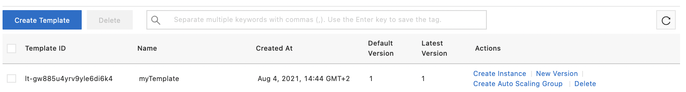{width="4.5in" height="0.6083333333333333in"}
-   Select the template and the version,
-   To modify the configuration, click on the edit icon
    {width="0.14772747156605423in"
    height="0.1313134295713036in"}.

To create a `Subscription` instance, select a subscription duration
and click on `Create Order`. To create a `Pay-As-You-Go` instance,
click directly on `Create Instance`.

To delete a Launch Template:
-   Go to the `ECS` console,
-   Click on `Deployment & Elasticity | Launch Templates`,
-   Click on `Delete` on the line of the template to be deleted,
-   Click on `OK`.

A Launch Template can have several versions. Each Launch Template can
have a maximum of 30 versions.

When creating a new version of Launch Template, all parameters are
optional.

When deleting a Launch Template, all associated versions are deleted.

It is not possible to delete the default version of the Launch Template.

To create a new version of Launch Template using the ECS console:
-   Go to the `ECS` console,
-   Select `Deployment & Elasticity | Launch Templates`,
-   Click on `New Version` on the template line,
-   Configure the parameters,
-   On the last page, click on `New Template Version`,

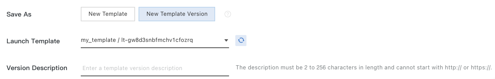{width="4.5in" height="0.7277777777777777in"}
-   Select the template,
-   Click on `Create Launch Template`.

To change the default version of a Launch Template:
-   Go to the `ECS` console,
-   Click on `Deployment & Elasticity | Launch Templates`,
-   Click on the template ID,
-   Click on `Set as Default` on the version line.

{width="4.5in"
height="2.982638888888889in"}

To delete a version of Launch Template:
-   Go to the `ECS` console,
-   Click on `Deployment & Elasticity | Launch Templates`,
-   Click on the template ID,
-   Click on `Delete` on the line of the version to be deleted,
-   Click on `OK`.

## Modification of an ECS instance 

You can configure the Internet bandwidth of an ECS instance.

It is possible to change the billing method for network usage
(`Pay-By-Bandwidth` or `Pay-By-Traffic`).

With `Pay-by-bandwidth`, billing is done on the basis of the specified
bandwidth. The outgoing bandwidth is limited to this value.

With `Pay-by-traffic`, billing is based on the actual traffic used. In
order to avoid excessive costs caused by an explosion of outgoing
traffic, you can configure a peak bandwidth value for outgoing traffic.

It is possible to change the operating system of a running ECS instance.
If the instance is hosted in a region outside mainland China, it is
possible to switch between Linux and Windows. In regions outside
mainland China, it is only possible to switch between Linux and Windows
versions.

After resetting the password, it is necessary to reboot, which may cause
disruptions to services.

To reset the password of an instance:
-   Go to the `ECS` console,
-   Click on `Instances & Images | Instances`,
-   Select the region,
-   Select `More | Password/Key Pair | Reset Password` on the line
    of the instance,
-   Enter a new password,
-   Click on `Submit`.

{width="4.5in"
height="1.9201388888888888in"}

### Change the type of the instance 

The type of a `Subscription` instance can be changed but for an
upgrade. However, both the vCPU and the memory size must be changed, not
just one of them. Also, the period between upgrades of an instance must
be at least five minutes.

To upgrade `Subscription` instances:
-   Go to the `ECS` console,
-   Click on `Instances & Images | Images`,
-   Select a region,
-   Click on `Upgrade/Downgrade` on the `Subscription` instance
    line,

{width="4.5in"
height="1.520138888888889in"}
-   Select `Upgrade`,
-   Click on `Continue`,
-   Enter the instance type, public bandwidth and disk billing method,
-   Click on `Create Order`.

The billing method for disks and network usage can also be converted
from `Pay-As-You-Go` to `Subscription`.

The configuration of a `Pay-As-You-Go` instance can also be changed.
To do this, the instance must be in the `Stopped` state.

To change the configuration of a `Pay-As-You-Go` instance:
-   Go to the `ECS` console,
-   Click on `Instances & Images | Instances,`
-   Select the region,
-   Click on `Change Instance Type` on the line of the instance,
-   Select the new instance type,
-   Click on `Change`.

{width="4.5in"
height="2.7881944444444446in"}

The change takes effect after restarting the instance.

### Modify the bandwidth of an EIP 

It is possible to change the bandwidth of an ECS instance connected to a
VPC that has an EIP.

To change the EIP Internet bandwidth:
-   Go to the `ECS` console,
-   Click on `Instances & Images | Instances,`
-   Select the region,
-   Click on `Upgrade/Downgrade` on the line of the instance,
-   Select `Bandwidth Adjustment`,
-   Click on `Continue`,

{width="2.781007217847769in"
height="1.3269860017497812in"}
-   Specify the new peak bandwidth,
-   Click on `Buy Now`.

{width="3.9677187226596677in"
height="2.564935476815398in"}

### Change the network usage billing method for a Subscription instance 

The instance must have a public IP address.

To switch from `Pay-By-Bandwidth` to `Pay-By-Traffic`, your account
must have the `downgrade` privilege. To find out if it has this
privilege:
-   Go to the `ECS` console,
-   Click on `Privileges & Quotas.`

To change the billing method from `Pay-By-Bandwidth` to
`Pay-By-Traffic`:
-   Go to the `ECS` console,
-   Click on `Instances & Images | Instances,`
-   Select a region,
-   Click on `Upgrade/Downgrade` on the line of the instance,
-   Click on `Downgrade` and `Bandwidth Configuration`,
-   Click on `Continue`,
-   Select `Pay-By-Traffic`,
-   Enter the peak bandwidth value,
-   Click on `Confirm`.

The change takes effect immediately.

To change the billing method from `Pay-By-Traffic` to
`Pay-By-Bandwidth`:
-   Go to the `ECS` console,
-   Click on `Instances & Images | Instances,`
-   Select a region,
-   Click on `Upgrade/Downgrade` on the line of the instance,
-   Select `Upgrade`,
-   Click on `Continue`,
-   Select `Pay-By-Bandwidth`,
-   Enter the value of the bandwidth,
-   Click on `Confirm`.

The change takes effect immediately.

### Modify the bandwidth of a Subscription instance with an EIP 

You can modify the bandwidth configuration. If the modification is a
downgrade, you must have the `downgrade` privilege. To know if you
have this privilege:
-   Go to the `ECS` console,
-   Click on `Privileges & Quotas.`

You can change the public bandwidth or the maximum bandwidth:
-   For instances using `pay-by-bandwidth` network usage billing, you
    can upgrade or downgrade the public bandwidth.
-   For instances using `Pay-by-traffic` network usage billing, you
    can change the maximum bandwidth.

There must be a minimum delay of 5 minutes between two successive
modifications.

To upgrade the public bandwidth of an instance using
`pay-by-bandwidth` billing:
-   Go to the `ECS` console,
-   Click on `Instances & Images | Instances,`
-   Select a region,
-   Click on `Upgrade/Downgrade` on the line of the instance,
-   Select `Upgrade`,
-   Click on `Continue`,
-   Change the bandwidth,
-   Click on `Upgrade` or `Create Order`.

If the instance does not have a public IP address, it has no public
bandwidth.

To downgrade the public bandwidth of instances with `pay-by-bandwidth`
billing:
-   Go to the `ECS` console,
-   Click on `Instances & Images | Instances,`
-   Select a region,
-   Click on `Upgrade/Downgrade` on the line of the instance,
-   Select `Downgrade` and `Bandwidth Configuration`,
-   Click on `Continue`,
-   Change the bandwidth,
-   Click on `Downgrade Now`.

The change is immediate.

After downgrading the bandwidth of a classic network instance to 0
Mbit/s, the public IP address of the instance is retained. On the other
hand, for a VPC instance, the public IP address of the instance is
released.

To change the maximum bandwidth:
-   Go to the `ECS` console,
-   Click on `Instances & Images | Instances,`
-   Select a region,
-   Click on `Upgrade/Downgrade` on the line of the instance,
-   Select the method,
-   Click on `Continue`,
-   To change the maximum bandwidth or select the `Pay-by-bandwidth`
    billing method, select `Upgrade`,
-   To change only the maximum bandwidth, click on `Downgrade` and
    `Bandwidth Configuration`
-   Change the maximum bandwidth.

The `Pay-by-traffic` billing method charges according to the actual
traffic volume. Changing only the maximum bandwidth does not change the
costs.

Maximum bandwidth helps avoid high outbound bandwidth costs due to
excessive outbound traffic.

A change from `Pay-by-traffic` to `Pay-by-bandwidth` may require
paying for bandwidth in advance.

### Modify the bandwidth of a Pay-As-You-Go instance 

You can change the bandwidth of a `Pay-As-You-Go` instance.

You must wait at least five minutes between bandwidth changes.

You can change the billing method for network usage
(`Pay-By-Bandwidth` or `Pay-By-Traffic`) or the public bandwidth or
peak traffic bandwidth.

After changing the public bandwidth of a classic network instance to 0
Mbit/s, the public IP address of the instance is kept. For a VPC
instance, however, it is released.

To change the bandwidth:
-   Go to the `ECS` console,
-   Click on `Instances & Images | Instances,`
-   Select a region,
-   Click on `Configuration Change | Change Pay-as-you-go Instance
    Bandwidth` on the line of the instance,
-   Change the peak bandwidth,
-   Select the `Pay-By-Bandwidth` or `Pay-By-Traffic` network usage
    billing method,
-   Specify the public bandwidth or the peak bandwidth of the traffic,
-   Click on `Confirm`.

{width="4.5in"
height="2.3368055555555554in"}

The change is effective immediately.

## Changing the IP address 

You can change the private and public IP address of an ECS instance. It
is also possible to change the public IP address to EIP.

### Change private IP address 

You can change the private IP address of an ECS instance.

To change the private IP address and vSwitch of an ECS instance:
-   Go to the `ECS` console,
-   Click on `Instances & Images | Instances,`
-   Select the region,
-   Click on `Instance Status | Stop` on the line of the instance,
-   Once the instance is stopped, click on the instance ID,
-   In the `Network Information` section, click on `... | Modify
    Private IP Address`,

{width="4.5in"
height="1.5458333333333334in"}
-   `VSwitch`: this is the VSwitch,
-   Click on `Modify`,

{width="2.7954101049868765in"
height="2.3079385389326332in"}
-   Click on `Instance Status | Restart` on the line of the instance.

The change takes effect once the instance is restarted.

Ensure that the current vSwitch and the selected vSwitch are in the same
zone.

If you do not want to change the vSwitch, enter a new IP address.

### Change the public IP address 

If the instance has a public IP address, you can change it within six
hours after the instance is created.

For this, the instance must be in the `Stopped` state.

If no public IP address was assigned when the instance was created, then
you can only:
-   use an EIP,
-   modify the public bandwidth of the ECS instance to allocate a fixed
    public IP address.

To change the public IP address of an ECS instance:
-   Go to the `ECS` console,
-   Click on `Instances & Images | Instances,`
-   Select the region,
-   Select `Network and Security Group | Change Public IP Address` on
    the line of the instance,
-   Click on `Start Now`.

{width="2.6346686351706037in"
height="1.5035498687664042in"}

### Convert a public IP address of a VPC instance to EIP 

On a VPC-based ECS instance, it is possible to convert a public IP
address to an EIP. The public IP address can then be kept and associated
with another ECS instance.

To convert a public IP address to EIP:
-   Go to the `ECS` console,
-   Click on `Instances & Images | Instances,`
-   Select the region,
-   Select `Network and Security Group | Convert to EIP` on the line
    of the instance,
-   Click on `OK`.

{width="2.6873818897637793in"
height="1.3125863954505688in"}

The ECS instance must be in `Stopped` or `Running` state.

The Internet access of the instance is not disrupted.

The EIP address can be dissociated from the instance. You can then bind
it to another instance or release it.

### Convert a public IP address of a classic network instance to EIP 

When manually releasing an ECS instance of the classic network type and
Pay-As-You-Go type, you can convert its public IP address into an EIP.
This EIP can then be used with a VPC ECS instance.

If the instance is of type Pay-As-You-Go, it must be in `Stopped`
status.

If it is of the `Subscription` type, it must be in `Expired` or `To
Be Released` status. The instance must also use `Pay-By-Traffic`
Internet bandwidth billing.

It is recommended to perform a snapshot before the operation.

If the bandwidth before the conversion is 0 Mbps, it increases to 1 Mbps
after the migration.

The NIC (Network Interface Controller) and the MAC address of the
classic network ECS instances are not kept after the migration.

Please note that an EIP address that is not linked to an ECS instance is
still charged.

To convert the public IP address of a classic network type and
`Subscription` type instance to EIP:
-   Go to the `ECS` console,
-   Click on `Instances & Images | Instances,`
-   Select a region,
-   Click on `Release` on the line of the instance,
-   Select `Release Now`,
-   Select `Convert the public IP address of the ECS instance in a
    classic network to an EIP address`,
-   Click on `Next`,
-   Click on `OK`.

For `Pay-As-You-Go` instances:
-   Go to the `ECS` console,
-   Click on `Instances & Images | Instances,`
-   Select a region,
-   Click on `Instance Status | Release` on the line of the instance,
-   Select `Release Now`,
-   Select `Convert the public IP address of the ECS instance in a
    classic network to an EIP address`,
-   Click on `Next`,
-   Click on `OK`.

## Management of the instance life cycle 

In this section, we will study the life cycle of an ECS instance, in
particular the following phases:
-   start-up,
-   stop,
-   hibernation,
-   restart,
-   release,
-   reactivation.

### Start an instance 

To start a stopped instance:
-   Go to the `ECS` console,
-   Click on `Instances & Images | Instances,`
-   Select the region,
-   Select `Instance Status | Start` on the line of the instance,
-   Click on `OK`.

{width="0.4417804024496938in"
height="0.5177110673665791in"}

Once started, the status of the instance changes to `Running`.

### Stop a Subscription instance 

If you stop a `Subscription` instance before the end of its billing
cycle, the bill for that cycle does not change. If `auto-renewal` has
been enabled, you are still billed for the stopped instance at the
beginning of each new billing period.

To stop a running instance:
-   Go to the `ECS` console,
-   Click on `Instances & Images | Instances,`
-   Select the region,
-   Select `Instance Status | Stop` on the line of the instance,
-   `Stopped By`: select `Stop` (clean stop) or `Force Stop`,
-   Click on `OK`.`

`Once stopped, the status of the instance changes to `Stopped`.

### Stop a Pay-As-You-Go instance 

By default, billing continues until the instance is released.

To stop an instance:
-   Go to the `ECS` console,
-   Click on `Instances & Images | Instances,`
-   Select the region,
-   Select `Instance Status | Stop` on the line of the instance,
-   `Stopped By`: this is the way to stop the instance:

```{=html}
<!-- -->
```
-   `Stop`: clean stop,
-   `Force Stop`: forced stop,

```{=html}
<!-- -->
```
-   `Stop Mode`: this is the stop mode:

The stop mode is only available for VPC instances with the option `No
Fees for Stopped Instances (VPC-Connected)` activated.
-   `Retain Instance and Continue Charging After Instance Is Stopped`,
-   `No Charges After Instance Is Stopped`: no longer charges the
    instance, except for disks, EIP and bandwidth,

```{=html}
<!-- -->
```
-   Click on `OK`.

`{width="2.564225721784777in"
height="1.7075054680664916in"}

### `Hibernate an instance 

Hibernating an instance allows to keep an instance in a state for a
certain period of time without being able to perform any maintenance
operation. However, the execution environment of the applications is
preserved, which means that when the instance is restored, the
applications pick up where they left off, unlike a reboot where the
system restarts and everything starts again from scratch. Both disk and
memory are therefore saved.

For `Subscription` instances, neither the instance expiration time nor
the bill is affected.

For `Pay-As-You-Go` instances, if you have selected the `No Fees for
Hibernated Instances` option during hibernation, hibernation is not
charged.

For an instance to hibernate, there are several conditions:
-   The `instance hibernation` feature must be enabled when the
    instance is created.
-   The hibernation agent must be installed on the instance.
-   The custom image used to create the instance must be encrypted.

The instance hibernation function cannot be deactivated after it has
been activated.

### Restart an instance 

To restart an instance:
-   Go to the `ECS` console,
-   Click on `Instances & Images | Instances,`
-   Select the region,
-   Select the instance: it must be in `Running` state,
-   Click on `Instance Status | Restart` on the line of the instance,
-   Select a restart mode,
-   Click on `OK`.

In order to be restarted, the instance must be in `Running` status.
Restarting causes an interruption of service.

### Release an instance automatically 

`Subscription` instances are automatically released when the billing
cycle expires. Once released, the instance data cannot be recovered. It
is therefore recommended to make a backup before.

To activate the `Automatic Release` of a `Pay-As-You-Go` instance:
-   Go to the `ECS` console,
-   Click on `Instances & Images | Instances,`
-   Select the region,
-   Select `Instance Status | Release` on the line of the instance,
-   Select `Scheduled Release`,

The instance can be released in two ways. With `Release immediately`,
the instance is released at once. With `Scheduled Release`, the
instance is released at the specified time. This time must be at least
30 minutes after the current time.
-   Activate `Automatic Release`,

If the `Automatic Release` parameter is not set, the instance
continues to be billed until it is released.
-   Specify the date and time of release,
-   Click on `Next`,
-   Click on `OK`.

To disable automatic release:
-   Go to the `ECS` console,
-   Click on `Instances & Images | Instances,`
-   Select the region,
-   Select `Instance Status | Release` on the line of the instance,
-   Select `Scheduled Release`,
-   Disable `Automatic Release`,
-   Click on `Next`,
-   Click on `OK`.

{width="2.6428926071741032in"
height="2.4944346019247594in"}

### Release an instance manually

To reduce costs, it is recommended to release instances when you no
longer need them.

To release an instance manually and immediately:
-   Go to the `ECS` console,
-   Click on `Instances & Images | Instances,`
-   Select the region,
-   Select `Instance Status | Release` on the line of the instance,
-   Select `Release Now`,
-   Click on `Next`,
-   Click on `OK`.

{width="2.4396008311461066in"
height="2.2622779965004374in"}

### Reactivate an instance 

For a `Pay-As-You-Go` instance, if the due date of an overdue payment
is not paid within 15 days, the instance is stopped and its status is
changed to `Expired`. You then have an additional 15 days to pay and
reactivate it. To do this, you have to submit a ticket. After this time,
the instance is released and the data is lost.

To reactivate an instance:
-   Go to the `ECS` console,
-   Click on `Instances & Images | Instances,`
-   Select the region,
-   Select `Reactivate` on the line of the instance,
-   Specify whether the instance should be reactivated immediately or at
    a specific time.

The reactivation time is about 10 minutes.

## The identity of the instance, the metadata and the User Data 

### Instance identity 

The instance identity describes and validates an instance. It allows to
quickly locate an instance and provide authentication to perform actions
like software updates, access control, ... It allows for example to
make sure that the instance you are using is your instance, or you can
confirm the source of a server.

The instance identity consists of two items:
-   a document that describes the attributes of an instance (example:
    `account-id`, `instance-id`, `region-id`, `image-id`, ...),
-   an associated signature: it verifies the identity of the instance
    using the PKCS#7 encryption method.

To verify the identity of the instance, use OpenSSL:
-   Connect to the Linux instance,
-   Retrieve the instance identity document:

`DOCUMENT=(curl
http://100.100.100.200/latest/dynamic/instance-identity/document)`,
-   Retrieve the associated signature:

`SIGNATURE=(curl
http://100.100.100.200/latest/dynamic/instance-identity/pkcs7)`
-   Verify instance identity:

openssl smime -verify -in $SIGNATURE -inform PEM -content $DOCUMENT
-certfile AliyunPubkey -noverify > /dev/null

To improve the security of the signature, you can use the audience
parameter with a random string. This parameter must be used in the
document, the document signature and must be added in the OpenSSL
command in the format `"audience":"<VALUE>".` The parameters
must be separated by a comma.

### Metadata 

The metadata of an ECS instance are basic information about the instance
(instance ID, IP address, operating system, ...). It is used to manage
the instances.

Manual changes made to the instance are not reflected in the metadata.

The metadata also includes dynamic elements generated after the first
start of the instance (system events, instance identifiers, user data,
...).

The most important URLs are:
-   To retrieve the metadata of an instance:
    `http://100.100.100.200/latest/meta-data/,`
-   To retrieve the ECS instance ID:
    `http://100.100.100.200/latest/meta-data/instance-id,`
-   To retrieve the image ID:
    `http://100.100.100.200/latest/meta-data/image-id,`
-   To retrieve the list of upcoming system events:
    `http://100.100.100.200/latest/maintenance/active-system-events,`
-   To retrieve the identity document of the instance:
    `http://100.100.100.200/latest/dynamic/instance-identity/
    document`,
-   To retrieve the User Data of the instance, used at startup:
    `http://100.100.100.200/latest/user-data`.

Here is a list of other available metadata:
-   `/hostname`: this is the name of the instance at the operating
    system level,
-   `/mac`: this is the MAC address of the instance,
-   `/private-ipv4`: this`` is the private IP address,
-   `/eipv4`: it is the public IP address and the EIP associated with
    the main NIC,
-   `/vpc-id`: this is the ID of the VPC,
-   `/vSwitch-id`: this is the ID of the vSwitch.

Under linux, use the `curl` command (example: `curl
http://100.100.100.200/latest/meta-data/`); under Windows use
`Invoke-RestMethod` (example: `Invoke-RestMethod
http://100.100.100.200/latest/meta-data/`).

There are two modes of access to ECS instance metadata: normal mode and
enhanced mode. The enhanced mode uses token-based authentication access.
This protects against Server-Side Request Forgery (SSRF) attacks. In an
SSRF attack, the attacker takes advantage of a server's vulnerabilities
to send requests to the server to access resources on the internal
network. The enhanced security mode is therefore recommended.

The principle of the enhanced security mode is as follows:
-   Send a request for creation of a token by specifying the duration of
    validity (TTL),
-   When requesting metadata, specify the generated token using the HTTP
    header `x-aliyun-ecs-metadata-token`.

Here is an example:

TOKEN=`curl -X PUT "http://100.100.100.200/latest/api/token" -H
"X-aliyun-ecs-metadata-token-ttl-seconds: 21600"`

curl http://100.100.100.200/latest/meta-data/instance-id -H
"X-aliyun-ecs-metadata-token: $TOKEN"

### User Data

The User Data allow to customize the behavior of the boot and to pass
data to the instance (example: automatically update packages, activate
services, display logs, install dependencies, ...).

This User Data must be encoded in base 64 before being transmitted and
its size cannot exceed 16 KB. Moreover, User Data can only be used with
VPC type instances.

Specifically, at boot time, as soon as the instance goes into the
`Running` state, the system executes the User Data with `root`
permissions and then runs the initialization scripts in the
`/etc/init` directory.

To create User Data:
-   Create a text file whose first line can be:

```{=html}
<!-- -->
```
-   for Linux: user-data `(#! /bin/sh`), cloud-config
    (`#cloud-config`), include file or compressed script with gzip
    `(#include` followed by a line with the URL), upstart job
    (`#upstart-job`),
-   for Windows: `[bat]` or `[powershell]`,

```{=html}
<!-- -->
```
-   Upload the file to OSS (this is the recommended method),
-   Retrieve the link.
-   Define a validity period for the link.
-   Go to the `ECS` console,
-   Create an instance,
-   Advance to the `System Configurations (Optional)` page,
-   Click on `Advanced (based on instance RAM roles or cloud-init)`,
-   `User Data`: this is the User Data script,
-   If the User Data is Base64 encrypted, check `Enter Based64 Encoded
    Information`,

{width="4.5in"
height="1.7972222222222223in"}
-   Connect to the instance,
-   Display the results of the User Data,

cat /etc/part-001.conf

To display the User Data:
-   Connect to the instance,
-   Run the command: `curl http://100.100.100.200/latest/user-data`.

To edit the User Data:
-   Go to the `ECS` console,
-   Click on `Instances & Images | Instances,`
-   Select the region,
-   Click on `Instance Settings | Sets User Data` on the line of the
    instance,
-   Modify User Data,
-   Click on `OK`.

{width="2.8935269028871393in"
height="2.6872287839020124in"}

Before changing the User Data, the instance must be stopped.

If you need to restart a VPC-based `Pay-As-You-Go` instance
immediately after changing the User Data, it is recommended to disable
the setting.

## Connection to an ECS instance 

If no Internet access is required, you can connect via the Management
Terminal from the console.

+---------------------+----------------------+------------------------+
| Source host         | Guest destination    | Connection method      |
+=====================+======================+========================+
| Windows, Linux, Mac | Linux                | VNC                    |
|                     |                      |                        |
|                     |                      | SSH key pair or        |
|                     |                      | password (SSH/PuTTY)   |
+---------------------+----------------------+------------------------+
| Windows             | Windows              | VNC                    |
|                     |                      |                        |
|                     |                      | Remote Desktop         |
|                     |                      | Connection             |
+---------------------+----------------------+------------------------+
| Linux               | Windows              | VNC                    |
|                     |                      |                        |
|                     |                      | rdesktop               |
+---------------------+----------------------+------------------------+
| Mac                 | Windows              | VNC                    |
|                     |                      |                        |
|                     |                      | Microsoft Remote       |
|                     |                      | Desktop Connection for |
|                     |                      | Mac                    |
+---------------------+----------------------+------------------------+

### Connecting with VNC 

You can connect to an ECS instance via VNC from the console. This method
works even if the instance does not have a public IP address.

To connect via VNC to a Linux instance:
-   Go to the `ECS` console,
-   Click on `Instances & Images | Instances,`
-   Select the region,
-   Click on `Connect` on the line of the instance,

When you`` first connect, click on `Modify VNC Password` to change
the password.

{width="2.7638287401574804in"
height="1.8331692913385826in"}
-   Enter the VNC password,
-   Click on `OK`,

{width="2.800356517935258in"
height="1.4364785651793526in"}
-   Enter the password.

{width="4.5in"
height="0.6680555555555555in"}

To connect via VNC to a Windows instance, follow the same procedure but
once the password has been entered:
-   Select `Send Remote Command | CTRL+ALT+DELETE`,
-   Enter the user name (`Administrator`),
-   Enter the password.

To change the VNC password:
-   Go to the `ECS` console,
-   Click on `Instances & Images | Instances,`
-   Select the region,
-   Click on `Connect` on the line of the instance,
-   Click on `Modify VNC Password`,

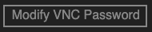{width="0.7919958442694663in"
height="0.16673556430446193in"}
-   Enter the new password,
-   Click on OK.

### Connect to a Linux instance with a password 

To be able to connect to an instance, it must be in `Running` state.

In addition, a security group must allow the SSH protocol:

  ------------------------------------------------------------------------------
  Rule        Authorization   Protocol   Port    Authorization   Authorization
  direction   policy          type       range   type            object
  ----------- --------------- ---------- ------- --------------- ---------------
  Inbound     Allow           SSH (22)   22/22   IP addresses    0.0.0.0/0

  ------------------------------------------------------------------------------

From Linux or MacOS, type the command:

ssh root@<IP_ADDRESS>

To connect to a Linux instance from Windows, use a remote connection
tool such as PuTTY:
-   Run `putty.exe`,
-   Click on `Session`,
-   `Host Name`: this is`` the public IP address or EIP of the
    instance,
-   `Port`: enter port `22`,
-   `Connection Type`: select `SSH`,
-   `Saved Session`: to avoid re-entering all these settings next
    time, you can enter a name for the saved settings and click
    `Save`,
-   Click on `Open`,
-   Click on `Yes`,
-   Enter the user name and password of the instance.

When you first connect, PuTTY displays an alert saying that PuTTY cannot
guarantee that the instance you specified is the one you think it is. To
help you verify that it is the right one, the instance fingerprint is
displayed. Once you confirm that it's the one you think it is, PuTTY
copies the public key to the PuTTY cache so you won't get this alert
the next time you connect.

### Managing SSH key pairs 

The SSH key pair only applies to Linux instances. Only 2048 bit RSA key
pairs are supported.

Alibaba Cloud holds the public key. You need to keep the private key
safe.

The private key is in PEM format.

To create a SSH key pair:
-   Go to the `ECS` console,
-   Select `Networks & Security | SSH Key Pairs,`
-   Select the region,
-   Click on `Create SSH Key Pair`,
-   `SSH Key Pair Name`: this is`` the name of the key pair,
-   `Creation Type`:

```{=html}
<!-- -->
```
-   `Auto-create`: Alibaba Cloud creates a pair of keys for you,

The private key is automatically downloaded. Remember to save it
securely.
-   `Import`: imports a public key encoded in base 64,

If you are using a third-party tool to generate an RSA key pair, you
need to import the base 64 encoded public key into Alibaba Cloud by
selecting `Import.`
-   Click on `OK`.

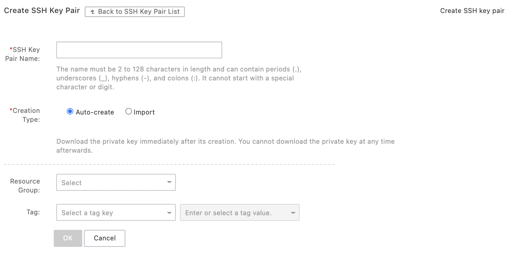{width="4.5in" height="2.2430555555555554in"}

Then you have to download the private key. It is needed to connect to
the ECS instance.

An ECS instance can only be attached to one SSH key pair.

If you change the SSH key pair while the ECS instance is in the
`Running` state, you must restart the instance.

If the ECS instance is configured for password-based authentication,
this feature is disabled automatically once a SSH key pair is associated
with this instance.

After removing a SSH key pair, you must reset the instance password.

To bind a SSH key pair to an ECS instance:
-   Go to the `ECS` console,
-   Click on `Networks & Security | SSH Key Pairs,`
-   Select the region,
-   Click on `Bind` on the key pair line,

{width="3.4366732283464567in"
height="0.9774365704286964in"}
-   Select one or more instances,
-   Click on `OK`.

{width="3.780217629046369in"
height="2.597150043744532in"}

To detach a SSH key pair:
-   Go to the `ECS` console,
-   Click on `Networks & Security | SSH Key Pairs,`
-   Select the region,
-   Click `Unbind` on the key pair line,

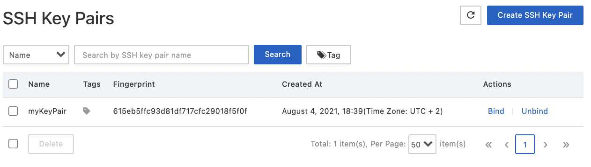{width="3.816231408573928in"
height="1.0824431321084864in"}
-   Select one or more instances,
-   Click on `OK`.

{width="3.753477690288714in"
height="2.4322309711286088in"}

Once you no longer need the SSH key pair, you can delete it. After
deletion, this key pair remains associated with the associated ECS
instances. The name of the key pair cannot be reused for a new key pair.

To delete a key pair:
-   Go to the `ECS` console,
-   Click on `Networks & Security | SSH Key Pairs,`
-   Select a region,
-   Select one or more key pairs,
-   Click on `Delete`.

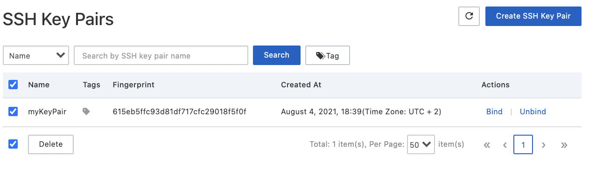{width="4.5in" height="1.304861111111111in"}

### Connect to a Linux instance with a SSH key pair 

To be able to connect to a Linux instance with a SSH key pair, you must
have authorized the SSH protocol in a security group:

  -------------------------------------------------------------------------------
  Rule        Authorization   Protocol   Port     Authorization   Authorization
  direction   policy          type       range    type            object
  ----------- --------------- ---------- -------- --------------- ---------------
  Inbound     Allow           SSH (22)   22/22    IP addresses    0.0.0.0/0

  -------------------------------------------------------------------------------

From Linux, there are two ways to connect:
-   Without configuration file:

```{=html}
<!-- -->
```
-   Modify file attributes:

chmod 400 <PEM_PRIVATE_FILE>
-   Connect to the instance:

ssh -i <PEM_PRIVATE_FILE> root@<IP_ADDRESS>
-   With configuration file:

```{=html}
<!-- -->
```
-   Add to the file `/root/.ssh/config`:

Host <INSTANCE_NAME>

HostName <IP_ADDRESS>

Port 22

User root

IdentityFile <PEM_PRIVATE_FILE>
-   Restart the SSH service,

service sshd restart
-   Connect to the ECS instance with SSH:

ssh <INSTANCE_NAME>

To connect from Windows, you can use a tool like PuTTY.

If you are using a `.pem` private key file, as generated by Alibaba
Cloud, you must convert it to `.ppk` format:
-   Launch PuTTYgen,
-   `Type of key to generate:` select `RSA`,
-   Click on `Load`,
-   Select the `.pem` private key file,
-   Click on `OK`,
-   Click on `Save private key`,
-   Click on `Yes`,
-   Enter the name of the private key,
-   Click on `Save`.

Now, start PuTTY then:
-   Select `Connection | SSH | Auth`,
-   Click on `Browse...` ,
-   Select the `.ppk` file,
-   Click on `Session`,
-   `Host Name (or IP address)`: this is`` the username and IP
    address of the instance in the format
    `<USERNAME>@<IP_ADDRESS>`,
-   `Port`: enter port `22`,
-   `Connection type`: select `SSH` as connection type,
-   Click on `Open`.

### Connect to a Windows instance 

To be able to connect to a Windows instance, you must have authorized
the SSH protocol in a security group:

  ----------------------------------------------------------------------------------
  Rule        Authorization   Protocol   Port range  Authorization   Authorization
  direction   policy          type                   type            object
  ----------- --------------- ---------- ----------- --------------- ---------------
  Inbound     Allow           RDP (3389) 3389/3389   IP addresses    0.0.0.0/0

  ----------------------------------------------------------------------------------

From Linux, to create a remote connection, you can use `rdesktop`.
-   Run `rdesktop`,
-   Run the command:

rdesktop -u <USERNAME> -p <PASSWORD> -f -g 1024*720 <IP_ADDRESS>
-r clipboard:PRIMARYCLIPBOARD -r disk:sunray=/home/paul

The options used are the following:
-   `-f:` activates the full screen display,
-   `-g:` specifies the graphic resolution,
-   `-r:` specifies a multimedia configuration:
-   `-r clipboard:PRIMARYCLIPBOARD`: performs a direct copy/paste
    between the instances and the local host,
-   `-r disk:mydirectory=/home/paul`: associates a local directory
    with a directory of the instance.

To be able to connect to a Windows instance from Windows, you can use
Microsoft Terminal Services Client:
-   Select `Start | icon | Remote Desktop Connection`,
-   Click on `Show Options`,
-   Enter the IP address of the instance,
-   Enter the user name (`Administrator`),
-   Click on `Connect`.

To copy a local file to the instance, click on `Local Resources`.

To copy a text, select `Clipboard`.

## The Images 

An Alibaba Cloud Marketplace image contains all the elements needed to
create an ECS instance. It can store data from the system disk or the
system disk and data disks.

The images are classified in the following categories:
-   public images: provided by Alibaba Cloud,
-   custom images: created from instances, snapshots or from a local
    device,
-   shared images: these are provided and shared by other Alibaba Cloud
    accounts,
-   Alibaba Cloud Marketplace images: these are provided by Alibaba
    Cloud or third-party ISVs (Independent Software Vendors).

Some images may result in a charge.

Alibaba Cloud Linux is a secure, stable and high performance operating
system.

If you change the image, the data on the system disk will be lost.
Therefore, it is recommended to back up your data before.

### Custom images 

Custom images allow to create ECS instances with identical operating
system and environment. They are based on ECS disk snapshots.

A custom image can only be used in the region where it was created.

It is possible to change the operating system of an instance.

An instance created from a custom image can be upgraded in terms of CPU,
memory, bandwidth and disks.

It is recommended to unmount all data disks before creating a custom
image: the `/etc/fstab` file should not contain any information about
data disks.

Do not modify:
-   The `/etc/fstab` file,
-   the kernel version,
-   system disk partitions,
-   critical system files (`/sbin`, `/bin`, `/lib`, ...),
-   the default login name (`root`).

If the custom image contains data disks, the ECS instance is created
with these new data disks.

### Find an image 

You can search for an image by type, name, ID or snapshot ID.

To find an image with the console:
-   Go to the `ECS` console,
-   Click on `Instances & Images | Images`,
-   Select a region,
-   Select an image type (`Custom Image`, `Public Image`, `Shared
    Image`, `Marketplace Images`),

{width="2.773708442694663in"
height="0.29106846019247595in"}
-   Select a search criterion and its value then click on the search
    icon.

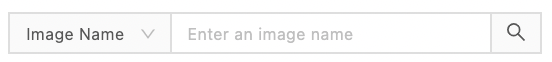{width="2.6242180664916885in"
height="0.29474956255468066in"}

To find an image with the API:
-   Go to the `OpenApi Explorer (https://api.aliyun.com`),

{width="4.5in"
height="2.5861111111111112in"}
-   Click on `Elastic Compute Service`,
-   Enter the API endpoint, the region and the corresponding parameters,
-   Click on `Submit Request`.

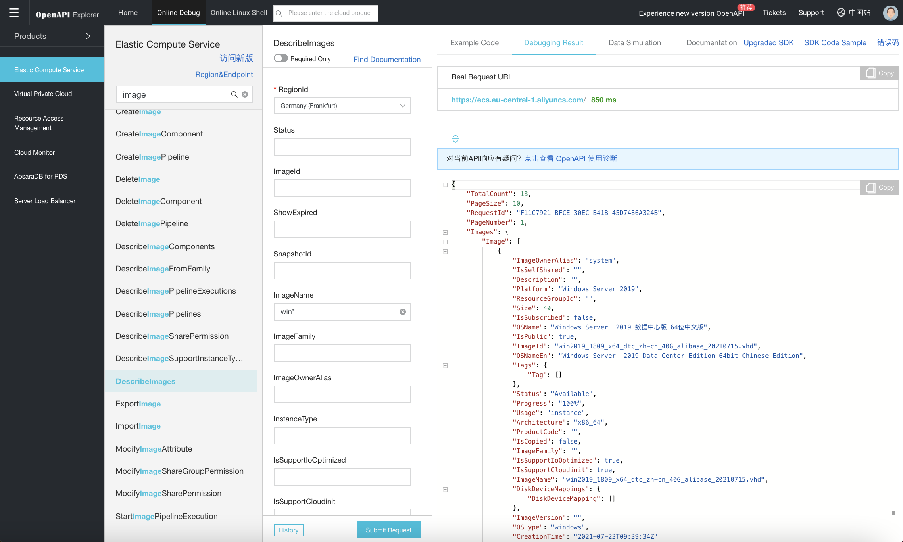{width="4.5in" height="2.7006944444444443in"}

IDs for custom images and images in the Alibaba Cloud Marketplace start
with `m`.

### Create a custom image using a snapshot 

A custom image is created from a system disk snapshot only, not from
data.

It is recommended to remove sensitive data before creating the image for
security reasons.

If a snapshot is selected, the disk size is the same as the snapshot
size. By default, the disk capacity of the snapshot is 5 GiB.

To create a custom image:
-   Go to the `ECS` console,
-   Click on `Instances & Images | Instances,`
-   Select a region,
-   Click on `Manage` on the line of the instance,
-   Click on the `Snapshot` tab,

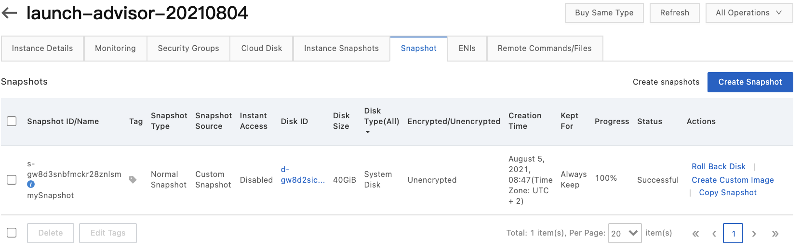{width="4.5in" height="1.4076388888888889in"}
-   Click on `Create Custom Image` of the snapshot whose disk type is
    `System Disk`,
-   `System Snapshot ID`: this is the snapshot ID,
-   `Custom Image Name`: this is the name of the custom image,
-   `Custom Image Description`: this`` is its description,
-   Check `Add Data Disk Snapshot`,
-   Select the data disk snapshots by clicking on `Add`,
-   Click on `Create`.

{width="3.935343394575678in"
height="4.0155063429571305in"}

### Create a custom image using an instance 

It is possible to create a custom image based on an ECS instance. For
this, a snapshot is automatically created for all disks.

During creation, the status of the instance should not change.

It is not possible to export custom images that contain data disks.

To create a custom image using an instance:
-   Go to the `ECS` console,
-   Click on `Instances & Images | Instances,`
-   Select the region,
-   Click on `Disk and Image | Create Custom Image` on the line of
    the instance,
-   `Custom Image Name`: this is the name of the new image,
-   `Custom Image Description`: this is its description,
-   Click on `Create`.

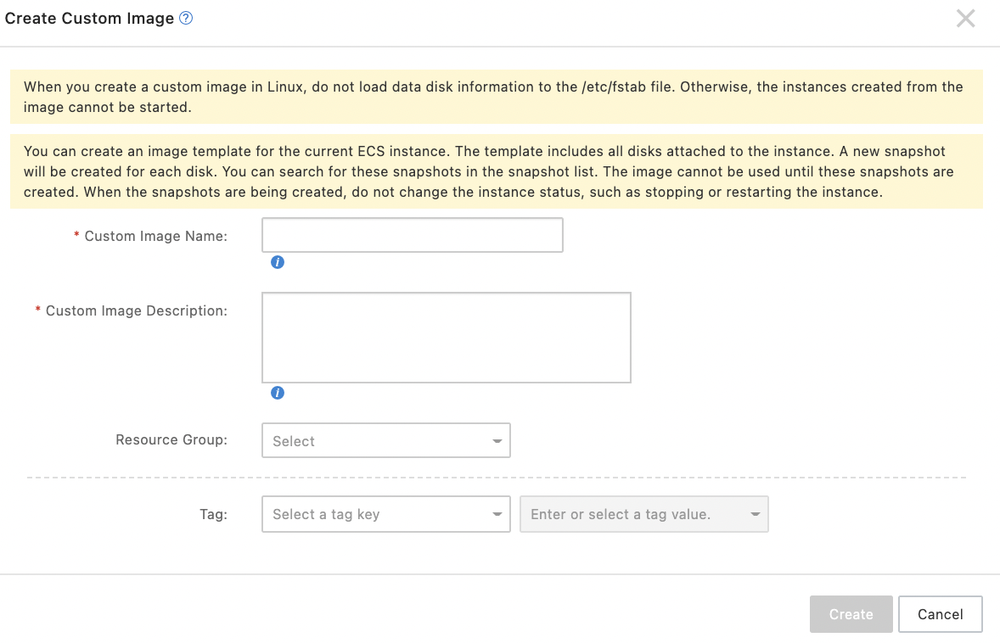{width="4.089393044619422in"
height="2.631599956255468in"}

### Edit an image 

To change the name and the description of a custom image:
-   Go to the `ECS` console,
-   Select `Snapshots & Images | Images,`
-   Select the region,
-   Click on the pen icon next to the image name,
-   Enter the new name,

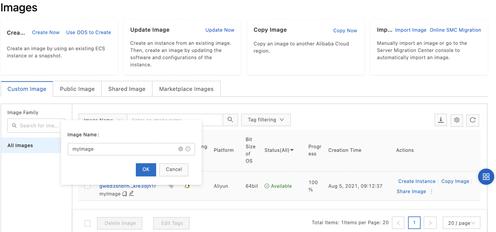{width="4.5in" height="2.10625in"}
-   Click on `... | Modify Description` the line of the instance,
-   Enter the new description,
-   Click on `OK`.

{width="2.9507534995625546in"
height="1.3765627734033246in"}

### Delete an image 

To delete a custom image:
-   Go to the `ECS` console,
-   Select `Snapshots & Images | Images,`
-   Select the region,
-   Click on the `Custom Image` tab,
-   Click on `... | Delete Image` on the image,
-   `Delete Snapshots Contained Within Images`: indicates whether
    snapshots contained within images should also be deleted
-   Click on `OK`.

{width="2.3776957567804025in"
height="0.937503280839895in"}

### Copy an image 

A custom image can be copied from one region to another. Copy an image
allows to deploy an application in another region.

When copying a custom image, a snapshot is created in the target region.
The image is then created from this new snapshot. However, user data,
roles and permissions are lost.

To copy an image:
-   Go to the `ECS` console,
-   Select `Snapshots & Images | Images,`
-   Select the region,
-   Click on `Copy Image` on the line of the image to copy,
-   `Destination Region`: this is the target region,
-   `Custom Image Name`: this is the name of the image displayed in
    the other region,
-   `Description`: this is the description of the image displayed in
    the other region,
-   Click on `OK`,

{width="2.678510498687664in"
height="2.6851246719160105in"}
-   Switch to the target region,
-   Check the status of the project.

{width="4.5in" height="0.8520833333333333in"}

### Share an image 

Sharing an image allows to quickly create ECS instances tailored to your
needs.

Shared images do not consume the image quota of the account.

It is only possible to share images that you have created yourself. A
custom image can be shared with up to 50 users in the same region. It
cannot be shared in another region.

The integrity and security of shared images is not guaranteed.

If the custom image has been shared with other accounts, before it can
be deleted, the sharing relationships for the image must be removed.
These other users will not be able to reinitialize their system drives
since the image will no longer be available.

To share an image:
-   Go to the `ECS` console,
-   Select `Snapshots & Images | Images,`
-   Select the region,
-   Click on `Share Image` on the line of the image to share,
-   `Account`: this is the account ID for sharing,
-   Click on `Share Image`.

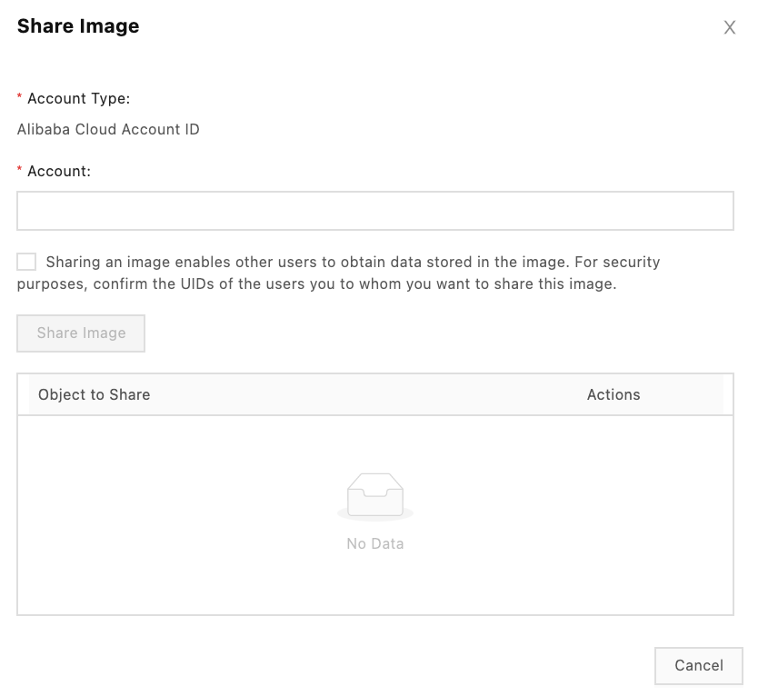{width="2.849045275590551in"
height="2.6169017935258094in"}

To cancel sharing:
-   Go to the `ECS` console,
-   Select `Snapshots & Images | Images,`
-   Select the region,
-   Click on `Share Image` on the image line,
-   Click on `Cancel Sharing` on the line of the account that
    currently has sharing.

Accounts with whom the image is shared can see this image in `Snapshots
& Images | Images | Shared Images` in the correct region.

If you need to obtain your account ID:
-   Place the cursor on the user's avatar at the top right of the
    screen,
-   Click on the `Security Settings` tab.

{width="1.4879407261592301in"
height="1.5146292650918636in"}

The account number is then displayed.

### Import an image 

You can use the imported custom image to create an ECS instance or to
replace the system disk.

Imported custom images can come from servers or VMs.

It is possible to import on-premise image files into ECS.

Under Linux, follow these steps:
-   install a compliance tool to verify that the configuration meets the
    requirements,
-   install cloud-init to allow the initialization of the instances,
-   install the VirtIO drivers to allow the ECS instances to start,
-   convert the image file format,
-   import the image.

It is recommended to use the compliance tool to create standards
compliant images. The compliance tool can detect configuration
non-conformity and generate reports in text or JSON format. This tool
only supports Linux.

In Windows, follow these steps:
-   install the VirtIO driver,
-   convert the image file format,
-   import the image.

If the operating system you are using is not supported by Alibaba Cloud
and cloud-init could not be installed, you need to select `Customized
Linux` during import. You should then add a scan script to the image to
facilitate automatic configuration.

## The Tags 

A tag contains a key-value pair. Tags allow resources to be grouped into
categories and to manage these resources in a unified way.

Each key in a resource must be unique. Tag information is not shared
between regions.

The limit is 20 tags per resource. If a tag is detached and no longer
attached to any other resource, it is automatically deleted.

### Add a tag to a resource 

To attach a tag to a resource:
-   Go to the `ECS` console,
-   Click on `Tags`,
-   Select a region,
-   Click on `Create/Bind Tags`,

{width="3.1909711286089237in"
height="0.9705872703412074in"}

To create a tag, enter its name. To modify one, click on the tag and
then click on `+ Add`. It is the same for the value.
-   `Tag Key:` this is the key of the tag,
-   `Tag Value`: this is its value,
-   Click on `Next`,

{width="3.1892705599300086in"
height="2.1197812773403326in"}
-   Click on `Next`,
-   Select resources of the same type,
-   Click on `OK`,
-   Click on `Close`.

{width="3.1994542869641296in"
height="2.1137139107611547in"}

Once created, the tag is displayed in the list:

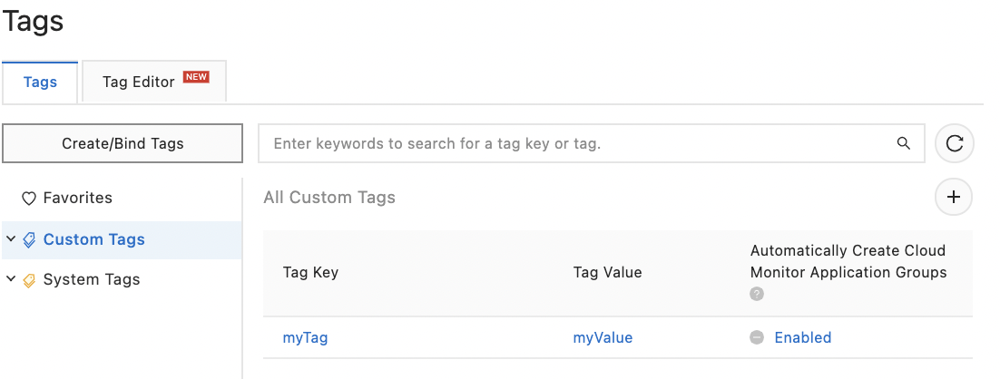{width="3.551284995625547in"
height="1.3470767716535432in"}

### Delete a tag 

You cannot directly delete a tag. However, if a tag is not attached to
any other resource, it is automatically deleted.

To unlink a tag from an instance:
-   Go to the `ECS` console,
-   Click on `Tags`,
-   Click on the key of a tag,

{width="3.033523622047244in"
height="1.1506791338582678in"}
-   Select one of the values displayed for the tag key,

{width="4.5in" height="1.4680555555555554in"}
-   Click on the `Resources` tab,
-   Select resources,
-   Move the cursor to `Batch Operation`,
-   Click on `Unbind Tags`.

{width="3.7158628608923885in"
height="2.0259470691163606in"}

### Search for resources using tags 

There are two ways to search for resources using tags.

The first one is done from the resources page:
-   Go to the `ECS` console,
-   Click on `Instances & Images | Instances,`
-   Select a region,
-   Click on `Tags`,
-   Select a key.

{width="3.4469444444444446in"
height="0.5766185476815399in"}

The second is from the tags page:
-   Go to the `ECS` console,
-   Click on `Tags`,
-   Select a region,
-   Click on the `Tags` tab,
-   Select a key,
-   Click on one of the values of the tag key,

{width="4.1881791338582675in"
height="1.6306747594050743in"}
-   Click on `Resources`.

{width="4.201563867016623in"
height="1.9153423009623798in"}

## The disks 

Block Storage is a high-performance, low-latency block storage service
for ECS instances. It is similar to a physical disk:
-   It supports random read and write operations.
-   It can be formatted.
-   It can contain a file system.

The disks use triplicate storage technology. This distributed file
system provides stable, efficient and reliable access to data in ECS
instances. Data reliability reaches 99.9999999%.

Local disks are a first type of block storage service. These are
physical disks attached to the physical machines that host the ECS
instances. They have low latency, high random IOPS and high throughput.
However, since they are attached to a single physical machine, they
present a risk of SPOF (Single Point Of Failure). They are therefore
suitable for high performance needs in storage I/O and mass storage. On
the other hand, the cost is high.

There are two categories of local disks:
-   local NVMe SSDs: they are suitable for online games, ecommerce,
    real-time streaming, NoSQL databases, distributed file systems, ...
-   local SATA HDDs: they are suitable for Big Data, mass storage and
    offline processing.

Cloud Disks are a second type of block storage service. They use the
"tripilicate storage" technology. This technology provides low
latency, high performance, durability and reliability. Thanks to the
triplicate storage mechanism, the data durability is 99.9999999% (nine
9).

A data Cloud Disk can be created with the console or with the API. It
must be in the same region and zone as the ECS instance. An ECS instance
can have up to 16 Cloud Disks.

It is not recommended to create a large data disk from the snapshot of a
small data disk.

After restoring a system disk, the login password or SSH key pair of the
ECS instance is retained.

Cloud Disks can be used as a system disk or a data disk. The system
disks contain the operating systems. Their life cycle is the same as the
ECS instances to which they are attached. The data disks store the
application data and can be created together with the instances or
separately.

Cloud Disks are classified into the following categories:
-   Enhanced SSDs (ESSDs),
-   Standard SSDs,
-   Ultra disks,
-   Basic disks.

ESSDs have low latency and can provide up to one million IOPS
(Input/Output operations Per Second). They are suitable for OLTP
(transactional) databases, NoSQL databases and ELK (Elasticsearch,
Logstash and Kibana) log analysis.

Standard SSDs offer consistently high random IOPS and high data
reliability. They are suitable for I/O-intensive applications, small and
medium relational databases, and NoSQL databases.

Ultra disks are cost-effective and offer average random IOPS and high
data reliability. They are suitable for system disks, development and
testing.

The Basic disks are from the previous generation and are no longer
available for purchase.

ESSDs have different PL (Performance Level):

  -------------------------------------------------------------------------
                PL3            PL2            PL1            PL0
  ------------- -------------- -------------- -------------- --------------
  I/O           Very high      High           Moderate       Moderate
  performance                                                

  Latency       Very low       Low            Low            Low

  Capacity      1.261 à 32.768 461 à 32.768   20 à 32.768    40 à 32.768
  (GiB)                                                      

  Data          99.9999999%    99.9999999%    99.9999999%    99.9999999%
  durability                                                 

  IOPS per disk min (1,800 +   min (1,800 +   min (1,800 +   min (1,800 +
                50 × capacity, 50 × capacity, 50 × capacity, 12 × capacity,
                1,000,000)     100,000)       50,000)        10,000)

  Throughput    min (120 + 0.5 min (120 + 0.5 Min (120 + 0.5 min (100 +
  per disk      × capacity,    × capacity,    × capacity,    0.25 ×
  (MB/s)        4,000)         750)           350)           capacity, 180)

  Usage         Large critical Average        Small and      
                databases,     databases,     medium MySQL   
                high usage     average ELK    and SQL Server 
                commercial     log clusters,  databases,     
                software       average        small and      
                               commercial     medium ELK log 
                               software       clusters,      
                                              commercial     
                                              software,      
                                              contained      
                                              applications   
  -------------------------------------------------------------------------

The file system used is shown in the following table:

  -----------------------------------------------------------------------
  Operating system        File system             Partition tool
  ----------------------- ----------------------- -----------------------
  Linux                   ext4 or xfs             parted

  Windows                 NTFS                    Disk management
  -----------------------------------------------------------------------

If you have created a data disk larger than 2 TiB from snapshots of a
data disk smaller than 2 TiB, you must first convert the partition
format from MNR to GPT and then format the data disk.

To partition and format a data disk larger than 2 TiB attached to a
Linux instance, you must use the GPT file system format instead of xfs
or ext4.

### Create a Cloud Disk 

To create a Cloud Disk:
-   Go to the `ECS` console,
-   Select `Storage & Snapshots | Disks,`
-   Click on `Create Disk`,

{width="4.5in" height="1.2180555555555554in"}
-   Select region and area,
-   `Storage`: this is the disk category,
-   `Quantity`: this is the number of disks,
-   Click on `Preview`,
-   Click on `Create`.

{width="4.5in" height="5.5625in"}

It is not recommended to use Logical Volume Manager (LVM) volumes.

It is possible to create a Cloud Disk from the snapshot of an existing
system or data disk. As the data is retrieved from OSS, the initial
performance of the disk is reduced. In order to achieve normal
performance, it is therefore recommended to read each data block at
least once before going into production.

To create a Cloud Disk from a snapshot of an existing system or data
disk:
-   Go to the `ECS` console,
-   Select `Storage & Snapshots | Disks,`
-   Click on `Create Disk`,
-   Click on `Create from Snapshot`,

{width="4.5in" height="0.3284722222222222in"}
-   Select a snapshot,

{width="3.2999332895888016in"
height="1.5267279090113737in"}
-   `Attach`: indicates to attach the disk to the instance (`Attach
    to ECS Instance`) or not (`Not Attach`),
-   `Billing Method`: this is`` the billing method of the disk
    (`Pay-As-You-Go` or `Subscription`),
-   `Storage`: this is the category of the disk and its capacity,
-   `Quantity`: this is the quantity of records,
-   `Release`: indicates whether the disks should be released at the
    same time as the release of the snapshots or the release of the ECS
    instance (only if `Attach to ECS Instance` has been selected for
    `Attach`),
-   Click on `Preview`,
-   Click on `Create`.

### Attaching a Cloud Disk 

The CloudDisk created at the same time as the ECS instances are attached
automatically.

A created Cloud Disk can be attached to an ECS instance at any time but
only as a data disk. However, the ECS instance must be in `Running` or
`Stopped` state and the Cloud Disk in `Available` state.

A Cloud Disk can only be attached to one ECS instance at a time.

To attach a Cloud Disk to an ECS instance:
-   Go to the `ECS` console,
-   Click on `Instances & Images | Instances,`
-   Select a region,
-   Click on the ECS instance ID,
-   Click on the `Cloud Disk` tab,
-   Click on `Attach Disk`,

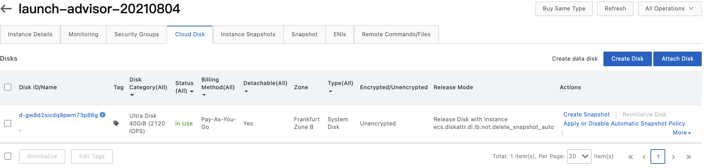{width="4.5in" height="1.0791666666666666in"}
-   `Target Disk`: select a disk with status `Unmounted` in the same
    region and area,
-   `Release Disk with Instance`: allows to release the disk together
    with the ECS instance,
-   `Delete Automatic Snapshots While Releasing Disk`: allows to
    delete automatic snapshots from the disk while releasing the ECS
    instance,
-   Click on `OK`,
-   Click on `Attach`.

{width="2.8360640857392827in"
height="2.087221128608924in"}

To attach a Cloud Disk from the disks page:
-   Go to the `ECS` console,
-   Select `Storage & Snapshots | Disks,`
-   Select a region,
-   Select `More | Attach` on the disk line (this disk must be in
    `Unattached` state`)`,

{width="4.5in" height="1.3729166666666666in"}
-   `Target Instance`: this is the target ECS instance; it must be in
    the same zone,
-   `Release Disk with Instance`: allows to release the disk with the
    ECS instance,
-   `Delete Automatic Snapshots While Releasing Disk`: allows to
    delete automatic snapshots from the disk while releasing the ECS
    instance,
-   Click on `Attach`.

{width="2.722107392825897in"
height="1.873128827646544in"}

Manual snapshots are not deleted.

A Pay-As-You-Go Cloud Disk attached to an ECS instance can be detached
and then released if it is a data disk. If it is a system disk, it
cannot.

The Cloud Disk must be in `In Use` status.

Under Linux, it is recommended to unmount the partition with the
`umount` command and disable automatic mounting in the `/etc/fstab`
file. Under Windows, it is recommended to set the Cloud Disk to
`Offline` status with `Disk Management` to preserve data integrity.

To detach a disk from the ECS instances page:
-   Go to the `ECS` console,
-   Click on `Instances & Images | Instances,`
-   Select a region,
-   Click on the ECS instance ID,
-   Click on the `Cloud Disk` tab,

{width="4.5in"
height="1.3583333333333334in"}
-   Select `More | Detach` on the disk line,
-   Click on `OK`.

{width="3.097419072615923in"
height="2.2766983814523183in"}

The status of the disk changes to `Unattached`.

To detach a data disk from the disks page:
-   Go to the `ECS` console,
-   Select `Storage & Snapshots | Disks,`
-   Select a region,
-   Select `More | Detach` on the disk line,
-   Click on `OK`.

{width="2.7228838582677164in"
height="1.8808070866141733in"}

### Release a disk 

When you no longer need a system disk, it is recommended to release it
to avoid costs. The disk must be in `Available` state.

Disks billed as `Subscription` can only be released with the ECS
instance.

On release, automatic snapshots are released, unlike manual snapshots
which are kept. But this behavior can be modified.

To release a disk manually:
-   Go to the `ECS` console,
-   Select `Storage & Snapshots | Disks,`
-   Select a region,
-   Select `More | Release` on the disk line,
-   Click on `Confirm Release`.

{width="2.954446631671041in"
height="1.6860411198600176in"}

To have the disk automatically released together with the ECS instance,
you must activate `Release with Instance` when creating the instance
or do the following for an existing instance:
-   Go to the `ECS` console,
-   Select `Storage & Snapshots | Disks,`
-   Select a region,
-   Select `More | Modify Disk Property` on the disk line,
-   Check `Release Disk with Instance`,
-   Click on `OK`.

{width="2.798860454943132in"
height="1.4175710848643919in"}

### Resize a disk 

It is possible to resize a Cloud Disk. However, there are constraints
related to the image and the size of the disk.

Under Linux, the system disk capacity cannot be reduced, but you can
increase it. The maximum capacity of a system disk is 500 GiB.

Before changing a disk, it is recommended to make a backup during
off-peak hours.

It is important to make sure that the system disk has enough storage
space for the snapshot creation.

After changing the system disk under Linux, if a data disk is mounted
automatically, this configuration is lost. It is therefore recommended
to:
-   save the `/etc/fstab` file,
-   write the new partition and mount information to the /etc/fstab
    file,
-   mount file systems,
-   check disk space usage: `df -h`.

After a disk change, the snapshot policy is inoperative since the disk
ID has changed. You must then recreate a policy.

Under Windows, you can resize a data disk. The data disk can be resized,
but not the file system.

Before, it is recommended to create a manual snapshot. To do so, this
disk must be in `Available` or `In Use` status and the associated
ECS instance must be in `Running` or `Stopped` status. It is then
necessary to reboot.

### Reset a disk 

Reset this disk allows to restore a system or data disk to the state in
which it was created.

The snapshot policies are kept and the snapshots already made are
preserved.

The instance that uses the disk must be in `Stopped` status.

To reset a data disk:
-   Go to the `ECS` console,
-   Click on `Instances & Images | Instances,`
-   Select a region,
-   Click on the ECS instance ID,
-   Click on `Disks`,
-   Click on `Reinitialize Disk` on the disk line,

{width="4.5in" height="1.3229166666666667in"}
-   Click on `Confirm`.

{width="2.427080052493438in"
height="1.4952012248468942in"}

### Replace the system disk with a public image 

If you want to change the operating system, you can replace the system
disk. In this case, the disk ID changes. However, the type of Cloud Disk
cannot be changed.

The disk image can be replaced with any image available on Alibaba
Cloud.

In order to avoid encountering a quota problem, it is recommended to
delete the snapshots of the old system disk.

When replacing the system disk between Linux and Windows, the file
format of the data disk may be unidentifiable. It is recommended to
reset the disk and format it according to the default file system of the
new operating system.

If you still want to keep important data on this disk:
-   when switching from Windows to Linux, install software such as
    NTFS-3G to make NTFS recognized under Linux; you must also use a
    password or SSH key pair for authentication,
-   to switch from Linux to Windows, install software such as
    `Ext2Read` or `Ext2Fsd` to make Windows recognize `ext3`,
    `ext4` and `XFS.`

To replace the system disk with a public image:
-   Go to the `ECS` console,
-   Click on `Instances & Images | Instances,`
-   Select a region,
-   Click on the ECS instance ID,
-   Select `More | Disk and Image | Replace System Disk` on the disk
    line,
-   Click on `OK`,

{width="2.7678226159230097in"
height="1.787979002624672in"}
-   `Image`: this is the image,
-   `System Disk`: this is the category of system disk,
-   `Security Settings`: this is the authentication method during the
    connection,
-   Click on `Create Order`.

{width="4.5in"
height="3.6555555555555554in"}

## The Security groups 

A security group is a kind of virtual firewall that filters packets to
isolate instances.

An ECS instance must have at least one security group. If necessary, use
the default security group. A security group can be attached to several
ECS instances.

Instances in different security groups cannot communicate with each
other unless you create a rule to allow it.

The security groups are stateful: if an outgoing packet is allowed, the
incoming packets corresponding to this connection are implicitly
allowed. The timeout period is 910 seconds.

There are two types of security groups:
-   Basic Security Groups,
-   Advanced Security Groups.

The Basic Security Group supports `allow` and `forbid` rules. If no
rule is specified, all incoming flows are forbidden and all outgoing
flows are allowed. It is possible to allow flows between security
groups.

The Advanced Security Group only concerns VPC type instances. Only
`allow` rules are allowed. If no rule is specified, all incoming and
outgoing flows are forbidden. Access to an instance of another security
group is forbidden, while access to an instance of the same security
group must be explicitly allowed by a rule. Advanced Security Groups
simplify the policy configuration of security group rules.

Managed Security Groups are managed by some cloud services. It is not
possible to perform any operations on groups. They are used to ensure
the availability of cloud services.

Some security groups are created by the system, others are created
manually. A default security group is created by Alibaba Cloud. This
includes default rules for ICMP, SSH (port 22), RDP (port 3389), HTTP
(port 80) and HTTPS (port 443) protocols.

The priority of manually created rules range from 1 to 100, with 100
being the lowest priority. The priority of the default rules is 1 and
was 110 before May 27, 2020.

In a Basic Security Group, by default, all incoming traffic is denied
and all outgoing traffic is allowed.

In an Advanced Security Group, all outgoing and incoming traffic is
denied.

In an Advanced Security Group, you cannot:
-   specify the `Priority` parameter,
-   specify the `Security Group` choice for `Authorization Type`,
-   specify the `Forbid` choice for `Action`.

The following is a list of typical ECS instance ports:
-   21: FTP,
-   22: SSH,
-   23: Telnet,
-   25: SMTP,
-   80: HTTP,
-   110: POP3,
-   143: IMAP,
-   443: HTTPS,
-   1433/1434: SQL Server,
-   1521: Oracle,
-   3306: MySQL,
-   3389: Windows Server Remote Desktop Services,
-   8080: Proxy port,
-   137, 138, 139: NetBIOS protocol.

Some operators may block certain ports, which they consider unsafe. In
this case, the solution is to change the port.

A CIDR block or `0.0.0.0/0` indicates all IP addresses.

### Create a security group 

To create a security group:
-   Go to the `ECS` console,
-   Select `Networks & Security | Security Groups,`
-   Select the region,
-   Click on `Create Security Group`,

{width="4.5in" height="0.9986111111111111in"}
-   `Template`: this is the template,

You can select the template for Linux or Windows web servers, or you can
completely customize the security group.
-   `Security Group Name`: this is`` the name of the security group,
-   `Description`: this is the description,
-   `Network Type`: this`` is the type of network:

```{=html}
<!-- -->
```
-   For a VPC-based security group, select a VPC.
-   For a security group based on a classic network, select `Classic
    Network`.

To create a VPC, click on `Create VPC`.
-   `Resource Group`: this is the group of resources to which the user
    belongs,
-   `Security Group Type`: this is the type of security group (`Basic
    Security Group` or `Advanced Security Group`),`
-   Tags`: these are the attached tags,

{width="4.5in" height="0.6305555555555555in"}
-   Click on `Outbound` to create an outbound rule, i.e. where ECS
    instances access other ECS instances via Intranet or Internet,
-   Click `Inbound` to create an inbound rule, i.e. where other ECS
    instances access this ECS instance or Internet resources access this
    ECS instance,
-   Click on `Add Rule` on the security group line: a line is added,

For a traditional network-based security group, you can select
`Internet Ingress`, `Internet Egress`, `Inbound` or `Outbound`.
-   `Action`: select `Allow` or `Forbid`,
-   `Priority`: this is the priority (from 1 to 100); the smallest
    values have the highest priority,

The priority cannot be changed for Advanced Security Groups.
-   `Protocol Type` and `Port Range`: the port range depends on the
    selected protoco ; the proposed values are:

```{=html}
<!-- -->
```
-   `All` (`-1/-1`): i.e. all ports,
-   `All ICMP (-1/-1`): i.e. all ports (used for `ping` commands and
    network status detection),
-   `All GRE (-1/-1`): i.e. all ports (used for VPN),
-   `Custom TCP` and `Custom UDP`: allows to customize the port
    ranges, each port can be from 1 to 65535,
-   `SSH` (`22/22`): used to connect remotely to a Linux instance
    with `ssh`,
-   `TELNET` (`23/23`): used to connect remotely to a Linux instance
    with `telnet`,
-   `HTTP` (`80/80`),
-   `HTTPS` (`443/443`),
-   `MS SQL` (`1433/1433`),
-   `Oracle` (`1521/1521`),
-   `MySQL` (`3306/3306`),
-   `RDP` (`3389/3389`): used to remotely connect to a Windows
    instance,
-   `PostgreSQL` (`5432/5432`),
-   `Redis` (`6379/6379`),

Port 25 is restricted and cannot be opened by the security group rules.
To open it, you have to open a ticket.
-   `Authorization Object`: it is an IPv4 CIDR block (or `0.0.0.0/0`
    to indicate all IP addresses) or a security group,

The choice of a Security Group allows the instances of a security group
of the same VPC or of another account to access the instances of this
security group. This only affects the internal network and the Basic
Security Groups.
-   `Description`: this is the description,
-   Click on `OK`.

{width="4.5in" height="1.9708333333333334in"}

The effect of the safety groups is usually immediate.

ECS instances can belong to different security groups. They can
therefore have several conflicting security group rules. Which rule
takes effect depends on the `Priority` settings and the authorization
policy:
-   If the rules have the same priority, the `Forbid` rule takes
    precedence over the `Allow rule`,
-   If the rules have different priorities, the rule with the highest
    priority takes effect first.

### Display the contents of the security groups 

To display the list of security groups:
-   Go to the `ECS` console,
-   Click on `Networks & Security | Security Groups,`
-   Select the region,
-   Select `VPC ID` as search criteria,
-   Select the name or ID of the VPC.

{width="3.2508573928258966in"
height="1.1704090113735783in"}

To display the security group rules:
-   Go to the `ECS` console,
-   Click on `Networks & Security | Security Groups,`
-   Select the region,
-   Click on `Add Rules` on the security group line,
-   Select the tab corresponding to the direction (`Inbound` or
    `Outbound`).

{width="4.5in"
height="2.2333333333333334in"}

### Associate a security group with an instance 

To add an instance to a security group:
-   Go to the `ECS` console,
-   Click on `Instances & Images | Instances,`
-   Select the region,
-   Click on `Manage Instances` on the line of the instance,
-   Click on the `Security Groups` tab,
-   Click on `Add to Security Group`,

{width="4.5in"
height="1.2409722222222221in"}
-   Select the security group,
-   To select multiple security groups, click on `Join Multiple
    Security Groups`,
-   Click on `OK`.

{width="2.6615365266841646in"
height="1.6240310586176727in"}

### Modify a security group 

To change the attributes of a security group:
-   Go to the `ECS` console,
-   Click on `Networks & Security | Security Groups,`
-   Select the region,
-   Click `Modify` on the security group line,
-   `Security Group Name`: this`` is the name,
-   `Description`: this is the description,
-   Click on `OK`.

{width="3.2308016185476816in"
height="1.8532239720034995in"}

To change the rules of a security group:
-   Go to the `ECS` console,
-   Click on `Networks & Security | Security Groups,`
-   Select the region,
-   Click on `Add Rules` on the security group line,
-   Select the tab corresponding to the direction (`Inbound` or
    `Outbound`),

{width="4.5in"
height="2.1791666666666667in"}
-   Click on `Modify` on the line of the rule to be modified,
-   Change the rule,
-   Click on `Save`.

{width="4.5in" height="0.5993055555555555in"}

### Delete a security group 

Deleting a security group removes all associated rules. Before
proceeding, check that no ECS instance uses this security group and that
no security group refers to this security group.

To delete a security group:
-   Go to the `ECS` console,
-   Click on `Networks & Security | Security Groups,`
-   Select the region,
-   Select one or more security groups,
-   Click on `Delete`,
-   Click on `OK`.

To delete a rule from a security group:
-   Go to the `ECS` console,
-   Click on `Networks & Security | Security Groups,`
-   Select the region,
-   Click on `Add Rules` on the security group line,
-   Select the tab corresponding to the direction (`Inbound` or
    `Outbound`),
-   Click on `Delete` on the line of the rule to be deleted,
-   Click on `OK`.

### Import and export rules 

It is possible to export the security group rules to a JSON file.

To export the security group rules:
-   Go to the `ECS` console,
-   Click on `Network & Security | Security Groups,`
-   Select the region,
-   Click on `Add Rules` on the security group line,
-   Click on `Export` and select the JSON or CSV export format.

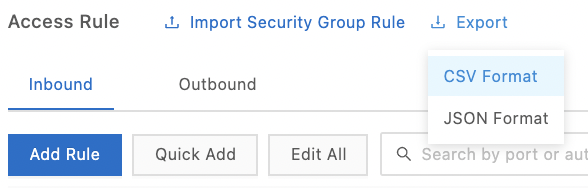{width="2.01173009623797in"
height="0.6432064741907262in"}

It is possible to import the rules of a security group from different
regions.

Up to 100 security group rules can be imported. New imported rules do
not overwrite existing rules.

To import rules from an export:
-   Go to the `ECS` console,
-   Click on `Network & Security | Security Groups,`
-   Select the region,
-   Click on `Add Rules` on the security group line,
-   Click on `Import Security Group Rules`,

{width="2.331071741032371in"
height="0.2241415135608049in"}
-   Click on `Select a file`,
-   Select the file,
-   Click on `Start`.

{width="4.127989938757655in"
height="1.8646030183727034in"}

### Cloning a security group 

It is possible to clone a security group across different regions and
network types.

To clone a security group:
-   Go to the `ECS` console,
-   Select `Networks & Security | Security Groups`,
-   Select the region,
-   Click on `Clone` on the security group line,`
-   Destination Region`: this is the region suitable for the new
    security group,
-   `Security Group Name`: this is the name of the new security group,
-   `Description`: this is the description,
-   `Network Type`: this is the type of network,
-   `VPC`: this is the VPC (if the network type is VPC),
-   Click on `OK.

{width="2.902571084864392in"
height="2.584990157480315in"}

### `Restore the rules of a security group 

It is possible to restore the original security group rules. This
restoration can be done in a complete and partial way.

With `Completely Restore`, the original rules overwrite the current
rules.

With `Partially` `Restore`, rules that only exist in the current
security group are added to the original security group. Rules that only
exist in the original group are ignored.

Both security groups must be in the same region and of the same network
type.

To restore a security group's rules:
-   Go to the `ECS` console,
-   Select `Networks & Security | Security Groups,`
-   Select the region,
-   Click on `Restore Rules` on the security group line,
-   `Destination Security Group`: select a security group,
-   `Restoration Type`: select the `Completely Restore` or
    `Partially Restore` method,
-   Check the expected result,

The rules in green only exist in the current security group and the
rules in red do not exist in the current security group.
-   Click on `OK`.

{width="3.600227471566054in"
height="2.130690069991251in"}

## THE ENI 

An ENI (Elastic Network Interface) is a virtual NIC (Network Interface
Controller). It can be associated with an ECS VPC instance and can be
used to deploy high-availability clusters, perform low-cost failover and
manage the network in a fine-grained way.

Only I/O-optimized instance types and VPC-type instances support ENI.

The ENI can be migrated between instances. When an ENI is unlinked and
then linked to another ECS instance, its attributes remain unchanged.

When creating an ECS instance, if you create an ENI, it is automatically
associated with the ECS instance. An ECS instance can have multiple
secondary ENIs as long as they are in the same area of the same VPC, but
the vSwitch can be different.

An ENI can have several secondary private IP addresses.

The attributes of an ENI are:
-   the type of ENI: this is the type of the ENI,

Primary ENIs are created with the instance and have the same life cycle
as the associated ECS instances.

Secondary ENIs can be created separately and are freely associated or
dissociated.
-   the VPC: this is the VPC in which the ENI must be located,

The ENI and the ECS instance to which it is linked must be in the same
VPC.
-   the area: this is the area in which the ENI is located,

The vSwitch to which the ENI belongs must be in the same zone as the
instance to which the ENI is associated.
-   the safety group,

When an ECS instance is moved to another security group, the primary ENI
is also moved, unlike the secondary ENIs.
-   the EIP,

An ENI can be associated with one or more EIPs.
-   the primary private IP address,
-   the secondary private IP address,

The secondary private IP address can be assigned or revoked.

The primary or secondary private IP addresses must be within the range
of the VSwitch's inactive CIDR block.
-   The MAC address (Media Access Control): this is the identifier of
    the ENI.

### Create an ENI 

When creating an instance in the console, you can attach two ENIs: a
primary and a secondary one. Once the instance is started, it is
possible to add a secondary ENI.

To create an ENI:
-   Go to the `ECS` console,
-   Select `Networks & Security | ENIs,`
-   Select the region,
-   Click on `Create ENI`,

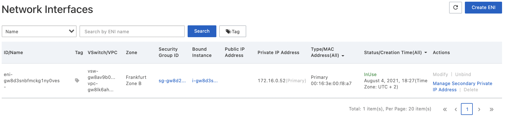{width="4.5in" height="1.0673611111111112in"}
-   `ENI Name`: this is`` the name of the ENI,
-   `VPC`: this is the VPC,
-   `VSwitch`: this is the vSwitch,
-   `Primary Private IP`: this is`` the private IP address of the
    ENI,

The IP address must be available in the CIDR block of the specified
vSwitch. If none is specified, an IP address is automatically assigned.
-   `Security Group`: this is the security group of the VPC,
-   `Description`: this is`` the description of the ENI,
-   Click on `OK`.

{width="2.920530402449694in"
height="4.132010061242345in"}

### Attaching an ENI to an instance 

The ENI must be in `Available` status and the instance must be in
`Stopped` or `Running` status.

If the ECS instance is of type VPC, the ENI must be in the same VPC.

An ENI can only be linked to one ECS instance at a time but an ECS
instance can have several ENIs. Only one secondary ENI can be attached
to an ECS instance.

For the following image types, the ENIs are identified automatically and
do not require any configuration:
-   Centos 7.3 64-bit,
-   Centos 6.8 64-bit,
-   Windows Server 2008 R2 and later.

For other types of images, you have to configure the ENI manually.

To attach an ENI to an instance:
-   Go to the `ECS` console,
-   Select `Networks & Security | ENIs,`
-   Select the region,
-   Click on `Bind to Instance` on the ENI line,

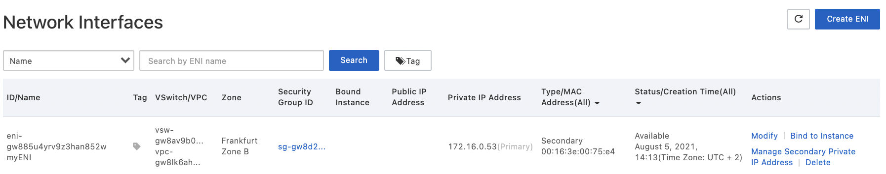{width="4.5in" height="0.8881944444444444in"}
-   `Select Instance`: this is the instance,
-   Click on `OK`.

{width="2.392594050743657in"
height="1.1903893263342082in"}

### Detach an ENI from an instance 

Only the secondary ENI can be detached from the instance. The ENI must
be in `Bound` state and the ECS instance must be in `Stopped` or
`Running` state.

To detach a secondary ENI from an instance:
-   Go to the `ECS` console,
-   Select `Networks & Security | ENIs,`
-   Select the region,
-   Click on `Unbind` on the ENI line,

{width="4.5in" height="0.9270833333333334in"}
-   Click on `OK`.

{width="2.766920384951881in"
height="1.1554461942257217in"}

### Associate a secondary private IP address with an ENI 

You can associate multiple secondary private IP addresses with a primary
or secondary ENI. This allows an ECS instance to host multiple
applications or assists in failover by disassociating and then
associating the ENI with another instance.

The number of private IP addresses that an ENI can have depends on the
type of instance.

The ECS instance must be in `Running` or `Stopped` status.

To associate a secondary private IP address:
-   Go to the `ECS` console,
-   Click on `Network & Security | ENIs`,
-   Select a region,
-   Click on `Manage Secondary Private IP Address` on the ENI line,

{width="4.5in" height="0.8881944444444444in"}
-   Click on `Assign New IP`,

{width="2.7969313210848643in"
height="0.7087281277340333in"}
-   Click on `OK`.

{width="2.8506528871391077in"
height="3.2052252843394577in"}

### Modify an ENI 

To edit a primary ENI:
-   Go to the `ECS` console,
-   Select `Networks & Security | Security Groups,`
-   Select the region,
-   Click `Manage Instances` on the security group line,

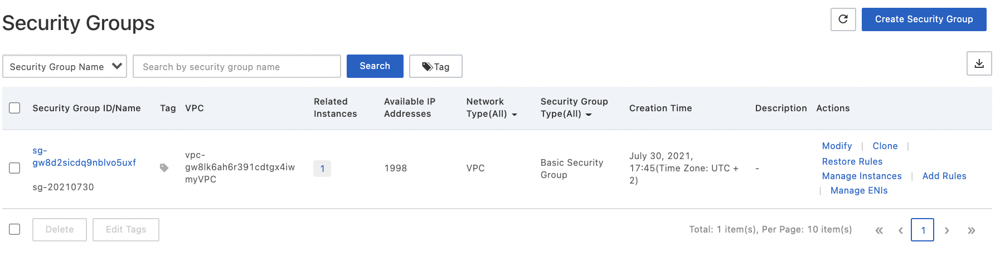{width="4.5in" height="1.1590277777777778in"}
-   To add a primary ENI to the security group:

```{=html}
<!-- -->
```
-   Click on `Add Instance`,
-   Click on the instance ID,
-   Click on `OK`,

{width="0.841599956255468in"
height="0.24433508311461066in"}
-   To remove a primary ENI:

```{=html}
<!-- -->
```
-   Select the instance,
-   Click `Remove from Security Group`,

{width="1.3768339895013124in"
height="0.8484273840769904in"}
-   Click on `OK`.

{width="2.667606080489939in"
height="1.4153127734033246in"}

To change the attributes of a secondary ENI:
-   Go to the `ECS` console,
-   Select `Networks & Security | ENIs`,
-   Select the region,
-   Click on `Modify` on the ENI line,
-   `ENI Name`: this is`` the name of the ENI,
-   `Security Group`: these are the security groups, the ENI must be
    maintained in at least one security group.
-   `Description`: this is the description.
-   Click on `OK`.

{width="3.066891951006124in"
height="2.372108486439195in"}

The ENI must be in `Available` or `Bound` state.

### Delete an ENI 

Only a secondary ENI can be deleted. The ENI must be in `Available`
state. The primary IP address is then released. Deleted ENIs are
automatically removed from all associated security groups.

When releasing an ECS instance, all attached ENIs are deleted.

To delete an ENI:
-   Go to the `ECS` console,
-   Select `Networks & Security | ENIs,`
-   Select the region,
-   Click on `Delete` on the ENI line,
-   Click on `OK`.

## The Snapshots 

A snapshot records the state of the data on a disk at a precise moment.
It allows to save data and to customize images.

The incremental mode implies that the first snapshot of the disk saves
the data of the whole disk, which takes more time. Subsequent snapshots,
on the other hand, are created more quickly.

The duration of the creation of a snapshot also depends on the volume of
data created since the creation of the first snapshot.

Snapshots can be performed automatically, using a policy, or manually. A
manual snapshot cannot be performed while an automatic snapshot is being
performed.

### Create a snapshot 

It is recommended to start these operations during off-peak hours to
avoid service interruptions.

It is also recommended not to change the state of the ECS instance while
creating the snpashot.

A snapshot can be done automatically or manually.

To create an automatic snapshot, you must define an automatic snapshot
policy. An automatic snapshot policy is a set of parameters. A maximum
of 100 automatic snapshot policies can be created per region.

To create an automatic snapshot policy:
-   Go to the `ECS` console,
-   Select `Storage & Snapshots | Snapshots,`
-   Select a region,
-   Click on the `Automatic Snapshot Policies` tab,

{width="4.5in"
height="1.117361111111111in"}
-   Click `Create Policy` to create a policy or click `Modify
    Policy` in the `Actions` column to modify a policy,
-   `Name`: this is the name of the policy,
-   `Executed At:` this is time,
-   `Execution Frequency`: this is the execution frequency,
-   `Keep Snapshots`: this is the number of days that a snapshot
    should be kept (from 1 to 65535 days or permanently) (by default 30
    days), `Always Keep` to not set a limit on the number of days,
-   `Tag`: add tags to snapshots,
-   `Cross-Region Replication for Snapshots`: if enabled, automatic
    snapshots are copied to the destination region,
-   `Destination Region` (if `Cross-Region Replication for
    Snapshots` is enabled): this is the region to which to copy
    snapshots,
-   `Retention Time of Snapshot Copies` (if `Cross-Region Replication
    for Snapshots` is enabled): this is the retention time of snapshot
    copies in the destination region,

```{=html}
<!-- -->
```
-   `Keep For`: this is the snapshot retention period (from 1 to 65536
    days),
-   `Always Keep Snapshots Regardless of the Limit of Snapshots`: if
    enabled, copies of snapshots in the destination region are kept
    indefinitely,

```{=html}
<!-- -->
```
-   Click on `OK`.

{width="3.068562992125984in"
height="5.528444881889763in"}

When the number of snapshots exceeds the limit, the oldest automatically
created snapshots are deleted.

To create a snapshot manually, the ECS instance state must be
`Running` or `Stopped` and the disk state must be `Running`.
Manually created snapshots must be deleted manually.

If the snapshot is created on an extended volume using a multi-partition
disk, you can use it to rollback a Cloud Disk.

To create a snapshot:
-   Go to the `ECS` console,
-   Select the region,
-   Click on `Instances & Images | Instances,`
-   Click on `Manage` on the line of the instance,
-   Click on the `Cloud Disk` tab,

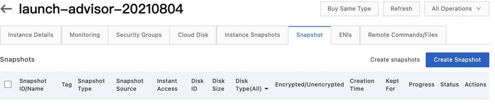{width="4.5in" height="0.9805555555555555in"}
-   Click on `Create Snapshot` on the disk line,
-   Enter the name of the snapshot,
-   Click on `Create`.

{width="3.2876443569553806in"
height="2.614388670166229in"}

### Apply an automatic snapshot policy to disks 

To apply an automatic snapshot policy to disks from the disks menu:
-   Go to the `ECS` console,
-   Select `Storage & Snapshots | Disks,`
-   Select the region,
-   Click `Apply or Disable Automatic Snapshot Policy` on the disk
    line,
-   Enable `Automatic Snapshot Policy`,
-   `Name`: this is the snapshot policy,
-   Click on `OK`.

{width="2.871312335958005in"
height="2.0688517060367455in"}

To apply an automatic snapshot policy to disks from the snapshot menu:
-   Go to the `ECS` console,
-   Select `Storage & Snapshots | Snapshots,`
-   Select the region,
-   Click on the `Automatic Snapshot Policies` tab,
-   Click `Apply or Disable Policy` on the policy line,

{width="4.5in"
height="1.551388888888889in"}
-   Click on the `Disks Without Policy Applied` tab,
-   Select the automatic snapshot policy,
-   Click `Apply Policy`.

If the policy is already enabled, you can disable it by clicking
`Disable Policy`.

{width="3.2318985126859143in"
height="2.0329035433070866in"}

It is possible to obtain the list of Cloud Disks without an associated
automatic snapshot policy by selecting `Disks without Policy Applied`.

Automatic snapshots are named with the format `auto_yyyymmdd_1`.

### Delete a snapshot 

In order to avoid paying unnecessary storage fees, it is recommended to
delete unnecessary automatic snapshots when the quota has been reached.
By default, automatic snapshots are not deleted when disks are released.

If the snapshot was used to create a custom image, the associated image
must be deleted before the snapshot can be deleted.

To delete a manual snapshot:
-   Go to the `ECS` console,
-   Select `Storage & Snapshots | Snapshots,`
-   Select a region,
-   Click on the `Snapshots` tab,
-   Select a snapshot,
-   Click on `Delete`,
-   Click on `OK`.

{width="2.6937357830271216in"
height="1.1198950131233596in"}

To delete an automatic snapshot policy:
-   Go to the `ECS` console,
-   Select `Storage & Snapshots | Snapshots,`
-   Select a region,
-   Click on the `Automatic Snapshot Policies` tab,`
-   `Click `Delete Policy` on the policy line,
-   Click on `OK`.

{width="2.631622922134733in"
height="1.1257491251093614in"}

To delete a snapshot automatically along with the disks:
-   Go to the `ECS` console,
-   Click on `Storage & Snapshots | Disks,`
-   Select the region,
-   Click on `More | Modify Disk Property` on the disk line,`
-   `Select or deselect `Delete Automatic Snapshots While Releasing
    Disk`,
-   Click on `OK`.

{width="2.649306649168854in"
height="1.5842683727034121in"}

### Display the chain of snapshots 

A snapshot chain includes all the snapshots of a Cloud Disk. It has an
identifier identical to that of the disk. It includes the following
information:
-   the list of snapshot nodes: each node represents a snapshot,
-   the size of the snapshot,
-   the quota: it concerns both automatic and manual snapshots.

To display the size of a snapshot of a disk:
-   Go to the `ECS` console,
-   Select the region,
-   Select `Storage & Snapshots | Snapshots,`
-   Click on the `Snapshot Chains` tab,

{width="4.5in" height="1.073611111111111in"}
-   Click on `View Details`.

{width="4.5in"
height="2.1083333333333334in"}

## Monitoring 

Monitoring the status of the ECS instances ensures that they are
functioning normally.

This can be done by the ECS monitoring service or by Cloud Monitor.

ECS allows to monitor CPU usage, network traffic and disk I/O for a
specific instance.

Cloud Monitor allows to monitor instances with a wider range of metrics
and with finer granularity.

ECS thus allows to monitor:
-   CPU usage: this is the percentage of ECS computing units allocated
    and used on the instance,

This data is accessible from ECS, Cloud Monitor, ECS API or once
connected, with the `top` command under Linux and `Task Manager`
under Windows.
-   network traffic: this is the bandwidth usage for traffic entering
    and leaving the ECS instance in kbps.

Cloud Monitor allows to measure Internet and Intranet traffic.

### Monitor through the console 

To access the ECS monitoring service:
-   Go to the `ECS` console,
-   Click on `Instances & Images | Instances,`
-   Select the region,
-   Click on the instance ID,
-   Click on the `Monitoring` tab,
-   Specify the time period for the query.

{width="2.6032786526684166in"
height="0.28764654418197727in"}

The time period selected has an impact on the granularity of the data
displayed.

{width="4.5in" height="1.6548611111111111in"}

To view monitoring data in Cloud Monitor:
-   Go to the `Cloud Monitor` console,
-   Click on `Host Monitoring`.

{width="4.5in"
height="1.1166666666666667in"}

To install the `Cloud Monitor` agent on the ECS instance (it must be
installed), click on `Aliyun ECS install` or `Not Aliyun ecs
install` if the instance is not an ECS instance.

{width="2.74336176727909in"
height="2.459288057742782in"}

To view the data, click on `Monitoring Charts` in the instance row.

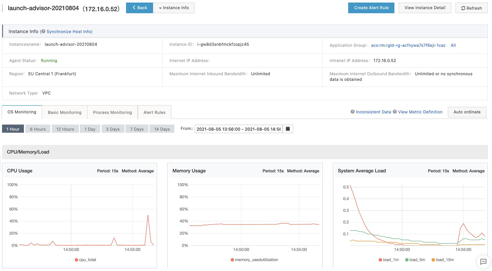{width="4.5in" height="2.477777777777778in"}

To add alarm rules, click on `Alert Rules` in the instance row.

{width="4.5in"
height="1.4513888888888888in"}

### Monitoring by the ECS API 

The ECS API provides access to metrics with the
`DescribeInstanceMonitorData`, `DescribeDiskMonitorData` and
`DescribeEniMonitorData` operations.

The following metrics are available:

  -----------------------------------------------------------------------
  Metric                        Description
  ----------------------------- -----------------------------------------
  `Instance`                  Instance ID

  `CPU Usage`                 Percentage of ECS calculation units
                                allocated and used

  `Intranet inbound traffic`  Incoming internal network traffic (in
                                kbits)

  `Intranet outbound traffic` Outgoing internal network traffic (in
                                kbits)

  `Intranet bandwidth`        Internal network traffic per time unit
                                (in kbits/s)

  `Public network inbound      Incoming Internet traffic (in kbits)
  traffic`                     

  `Public network outbound     Outgoing Internet traffic (in kbits)
  traffic`                     

  `Public network bandwidth`  Internet traffic per time unit (in
                                kbits/s)

  `Disk read IOPS`            Number of disk read operations (per
                                second)

  `Disk write IOPS`           Number of disk write operations (per
                                second)

  `Disk read BPS`             Number of bytes read from the disk per
                                second (in bytes/s)

  `Disk write BPS`            Number of bytes written to the disk per
                                second (in bytes/s)
  -----------------------------------------------------------------------

The difference between Kb and KB: 1 Kb is equal to 1000 bits and 1 KB is
equal to 1024 bytes. So, for example, 1 Mbps = 125 KB/s.

Network traffic is measured in kbps.

### System events 

System events are scheduled and recorded maintenance events of ECS
resources. They occur, for example, during security updates or
unexpected failures.

Alibaba Cloud performs routine maintenance on the physical servers. In
case of hardware or software failure or other such problems, ECS
instances are migrated to healthy servers. You do not receive any
notification for these operations. ECS instances are not affected by
this routine maintenance.

On the other hand, you are notified about system events on the ECS
instances. If it is a planned system event, you are notified in advance
with the impact of the event on the instance and the expected execution
point (expected execution date). It is recommended that you back up the
data and distribute the incoming traffic before the operation.

Here are some examples of system events:
-   Scheduled restart,
-   Unscheduled restart,
-   Stoped instance,
-   Released instance, ...

The event can have the following status:
-   `scheduled` (intermediate state): planned but not executed,
-   `avoided`: recommended actions performed in advance,
-   `executing` (intermediate state): in progress,
-   `executed`: executed,
-   `canceled`: the ECS instance cancelled the event,
-   `failed`: not corrected.

The processing of planned system events goes through two phases:
-   `User operation period`: after receiving the notification (e.g. 3
    days before the shutdown of an instance with subscription, 24 to 48
    hours before the correction of a system failure, etc ...), you can
    manage the event in advance by yourself or wait for the event to be
    triggered.
-   `System action period`: after this waiting period (less than 6
    hours), you receive a report on system events.

With unscheduled system events, you receive a notification but wait
period. You do not have the opportunity to perform an action.

To view the system event history:
-   Go to the `ECS` console,
-   Select `Events`,
-   Click on the tab of the type of event you want to monitor.

{width="4.5in"
height="1.0972222222222223in"}

### Capture the screen of an instance 

To help analyze and troubleshoot instance failures, it is possible to
get a screenshot of an ECS instance in `Running` state in real time.

To display the console output of an instance:
-   Go to the `ECS` console,
-   Click on `Instances & Images | Instances,`
-   Select the region,
-   Click on `More | Operations and Troubleshooting | Get Instance
    Screenshot` on the line of the instance to generate the screenshot
    of the instance,

{width="2.8657972440944883in"
height="2.64290135608049in"}
-   Click on `More | Operations and Troubleshooting | Get Instance
    Console Output` on the line of the instance to display the console
    output.

{width="2.911036745406824in"
height="2.351291557305337in"}

## The Deployment Sets 

A Deployment Set allows to control the distribution of instances on
different physical servers. This allows to implement disaster tolerance
and business continuity.

A Deployment Set can contain a maximum of 7 instances in a zone.

To create a Deployment Set:
-   Go to the `ECS` console,
-   Select `Deployment & Elasticity | Deployment Sets,`
-   Select the region,
-   Click on `Create Deployment Set`,

{width="4.5in" height="0.9986111111111111in"}
-   `Name`: this is`` the name,
-   `Description`: this is the description,
-   `Strategy`: this is the strategy,

The only option currently available is `High availability`.
-   Click on `OK`.

{width="2.3765168416447944in"
height="1.336790244969379in"}

To create an instance in a Deployment Set:
-   Go to the `ECS` console,
-   Select `Deployment & Elasticity | Deployment Sets,`
-   Select a region,
-   Click on `Create Instance` on the Deployment Set line,

{width="4.5in" height="1.0541666666666667in"}
-   Click on the `Custom Launch` onget.

You will find the classic instance creation screen. However, there are
two important new parameters:
-   `Sequential Suffix` (optional): this is the suffix added to the
    name of instants and host names (from 001 to 999),

{width="2.54621719160105in"
height="0.23772528433945755in"}
-   `Deployment Set`: this is the Deployment Set.

{width="4.5in"
height="0.6097222222222223in"}

Note that the number of instances must take into account the number of
instances already existing in this area.

To move an instance to another Deployment Set:
-   Go to the `ECS` console,
-   Select `Instances & Images | Instances,`
-   Select the region,
-   Select `More | Instance Settings | Change Deployment Set` on the
    line of the instance,
-   `Destination Deployment Set`: this`` is the Deployment Set,
-   `Force Change`: indicates whether the system moves the instance to
    a new host and restarts the instance (`Yes`) or only attaches the
    Deploy Set to the new host,
-   Click on `OK`.

{width="2.6564359142607175in"
height="2.0193832020997373in"}

The instance must be in `Stopped` or `Running` state.

To change the Deployment Set information:
-   Go to the `ECS` console,
-   Select `Deployment & Elasticity | Deployment Sets,`
-   Select the region,
-   Click `Modify Information` on the Deployment Set line,
-   `Name`: this is the name of the Deployment Set,
-   `Description`: this is its description,
-   Click `OK`.

To delete a Deployment Set:
-   Go to the `ECS` console,
-   Select `Deployment & Elasticity | Deployment Sets,`
-   Select the region,
-   Click `Delete` on the Deployment Set line,`
-   `Click on `OK`.

A Deployment Set cannot be deleted if it contains an instance.

