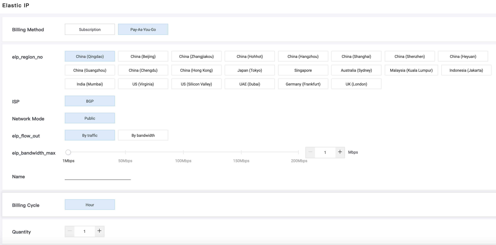
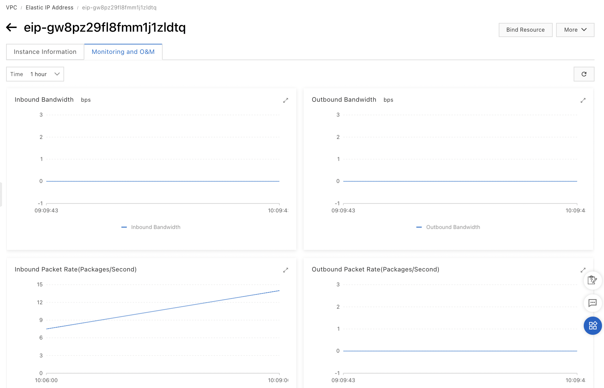

# EIP 

A VPC provides three types of IP addresses: private IP addresses, public
IP addresses for ECS and EIP (Elastic IP) addresses.

An ENI allows an ECS instance to use multiple EIP addresses.

The \"Cut-Through\" mode allows to replace the private IP address of the
ENI by an EIP.

The bandwidth of the EIP can be adjusted.

## The different types of IP addresses 

IP addresses allow access to Cloud product instances. They also allow
the cloud product instances to provide external services.

A VPC provides three types of IP addresses:

-   private IP addresses,

-   public IP addresses for ECS,

-   EIP (Elastic IP) addresses.

Private IP addresses are assigned to VPC product instances when they are
created. They are assigned from the CIDR block of the vSwitch to which
the instance belongs. They are used to provide internal access between
ECS instances, between an ECS instance and another Cloud service or an
internal SLB instance.

The public IP addresses for ECS are assigned at the time of the creation
of the ECS instance. They cannot be dissociated.

EIP (Elastic IP) addresses can be associated and dissociated at any
time.

It is possible to migrate from a public IP address to an EIP. However,
there are some conditions to respect. They are detailed in the official
Alibaba Cloud documentation.

In the remainder of this chapter, we will focus on EIPs.

## EIP Association 

There is a limit of 20 EIPs per account.

EIPs are public IP address resources that can be dynamically linked to
ECS instances. By binding an EIP to an ECS instance, this instance is
connected to the Internet. The EIP must however be created in the same
region as the ECS instance.

The ECS instance can be used as a SNAT or DNAT gateway. The SNAT gateway
allows other instances of the same VPC to provide access to the
Internet. The DNAT gateway allows other instances of the same VPC to
provide services via the Internet.

The EIP is a public IP address that you purchase. This EIP can be linked
to an ECS instance, an ENI, an SLB instance or a NAT gateway:

-   associated with an SLB instance in the same region, the instance can
    transmit requests from the Internet,

-   associated with an ENI, the corresponding ECS instance can access
    the Internet and provide external services,

-   associated with an ECS instance, the EIP allows the instance to
    communicate with the Internet,

-   in combination with a NAT gateway from the same region, the EIP
    allows to configure DNAT and SNAT entries.

Located in the Alibaba Cloud public network gateway, it is associated
with the NIC (Network Interface Card) of an ECS instance using the NAT
method. The public IP address is therefore not visible to the operating
system.

A released EIP can be reused if it has not been used by another user.

To request an EIP:

-   Go to the EIP console,

-   Click on Create EIP,

-   Specify region, network traffic, maximum bandwidth, billing cycle
    and quantity purchased,

-   Click on Buy Now,

-   Click on Activate Now.

{width="4.5in" height="2.2243055555555555in"}

To associate an EIP with an ECS instance:

-   Go to the EIP console,

-   Select the region,

-   Select a EIP,

-   Click on Bind Resource,

-   Instance Type: select the instance type (supported values are ECS
    Instance, SLB Instance, NAT Gateway and Secondary ENI),

-   Select an instance to bind: this is the ECS instance to bind the EIP
    to,

-   Click on OK.

{width="4.31911198600175in"
height="3.691240157480315in"}

Dissociate a EIP from an ECS instance:

-   Go to the EIP console,

-   Select the region,

-   Select a EIP,

-   Click on Unbind on the EIP line.

To release a EIP:

-   Go to the EIP console,

-   Select the region,

-   Select a EIP,

Ensure that the status of the moment is Available.

-   Click on \... \| Release on the EIP line,

-   Click on OK.

To change the IP address of an ECS instance of type VPC:

-   Go to the ECS console,

-   Click on Instances,

-   Select the region,

-   Click on the ECS instance ID,

Make sure that the ECS instance status is Stopped. If necessary, click
on More \| Instance Status \| Stop \| OK on the line of the instance.

-   Click on More \| Network and Security Group \| Modify Private IP
    Address on the line of the instance,

-   VSwitch: this is the vSwitch of the instance,

-   Private IP Address: this is the private IP address,

If none is specified, an IP address will be randomly selected from the
vSwitch CIDR block.

{width="2.982697944006999in"
height="2.469472878390201in"}

When you associate an EIP with a secondary ENI, the \"Cut-Through\" mode
allows to replace the private IP address of the ENI with the EIP. The
ENI then becomes an Internet network interface: the IP address is then
visible to the operating system.

This mode requires DHCP to be enabled and security group rules to allow
remote access.

## The bandwidth 

Depending on your needs, you can adjust the EIP bandwidth (Max
Bandwidth). By default, it is 5 Mbps. The EIP is charged according to
the traffic.

It is possible to share the bandwidth of ECS instances, SLB instances
and NAT gateways associated with EIPs. To do this, use the Internet
Shared Bandwidth feature available in the VPC console.

In case of a DDoS attack, it is possible to disassociate the EIP from
the ECS instance and associate a new one. It is also possible to use the
Anti-DDoS Pro service. But if you use an SLB instance, you can also
simply disassociate the EIP from the ECS instance and then associate it
with the SLB instance.

To check the traffic on the EIP:

-   Go to the EIP console,

-   Select the region,

-   Click on the ID of a EIP,

-   Click on the Monitoring and O&M tab.

{width="4.5in" height="2.8958333333333335in"}

Traffic and bandwidth monitoring information is displayed.

To change the bandwidth of a EIP:

-   Go to the ECS console,

-   Click on Instances,

-   Select a region,

-   Click on \... \| Modify Configuration on the EIP line,

-   Max Bandwidth: this is the new peak bandwidth,

-   Click on Buy Now.

{width="4.5in"
height="3.098611111111111in"}

# ECS 

ECS (Elastic Compute Service) is a compute service whose CPU and memory
characteristics depend on the ECS instance family. It is possible to
connect to the ECS instance, install software and run processes.

You can manage the life cycle of an ECS instance. An ECS instance can be
created manually, from a custom image or by using a Launch Template.

You can change some parameters of an ECS instance (its type, the
bandwidth used by its EIP, the method of charging for network usage, the
instance\'s bandwidth and its private or public IP address). Its public
IP address can also be converted to an EIP.

The instance identity, accessible via REST API, provides a description
of the instance, which allows it to be validated. The metadata provides
basic information about the instance. The User Data allows to customize
the behavior of the boot.

The connection to the instance depends on the operating system (Linux or
Windows).

ECS instances are created from a selected image in the Marketplace.

The tags assigned to the instances simplify the handling of the ECS
instances.

The instances have a system disk and one or more data disks. There are
several categories of disks, with different characteristics (latency,
performance and durability, \...).

Security groups are used to filter packets in order to isolate
instances. There are basic security groups, which are simplified, and
advanced ones.

An ENI (Elastic Network Interface) is a virtual NIC (Network Interface
Controller) which allows to manage the network in a fine way and to set
up high availability or to carry out failovers.

It is possible to make backups (snapshots) manually or automatically by
creating a snapshot policy.

The monitoring of the ECS instances can be done by the ECS console or by
an API.

Finally, Deployments Sets allow you to control the distribution of
instances on the physical servers.
