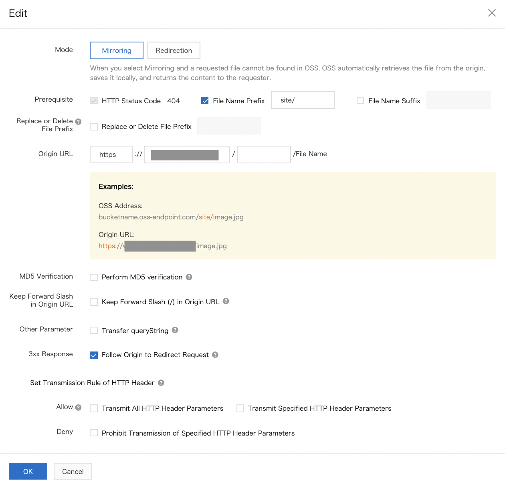

# OSS 

OSS is a cheap, scalable and very reliable storage service.

Objects are stored in buckets. These objects can be grouped in folders.
It is also possible to create a symbolic link on an object. There are
four storage classes: Standard, IA, Archive and Cold Archive. These
classes have different access times, durability and costs. The storage
class of a bucket can be changed.

When you upload an object in multipart mode, the object is broken down
into several parts called fragments.

OSS can automatically decompress ZIP objects uploaded to buckets.

The download of objects stored in buckets can be done from the OSS
console or via a CLI using the credentials of a RAM user. Before the
Archive or Cold Archive objects can be accessed, they must be restored.

These endpoints can be accelerated for both upload and download.

`Back-to-origin `rules allow to identify where to find an object if it
is not found in the bucket. These rules can be of two types:
mirror-based or redirection-based.

A bucket can host a static website. It is then possible to use the
custom domain name associated with the bucket. The HTTP headers allow to
customize the HTTP request policies (cache, forced object download),
\... The limit is 100 objects at a time. OSS automatically generates a
public endpoint for the bucket. It is however possible to use a custom
domain name. OSS can be used with CDN to speed up the download of static
objects.

OSS Select allows to search for objects. It is possible to run queries
on the logs in real time. They can also be analyzed. It is possible to
send event notifications when certain operations are performed on OSS
resources.

Lifecycle rules allow you to convert the storage class of objects in a
bucket or to delete objects and specific objects in a bucket. The WORM
(Write Once Read Many) retention policy allows to specify the period of
protection for objects in a bucket.

Objects in buckets can be versioned. Scheduled backup allows to backup
objects in a bucket to HBR (Hybrid Backup Recovery) on a regular basis.

There are three ACL modes for accessing objects. Data can be encrypted
on the server side with a key provided by OSS or with a key provided by
you. OSS supports CORS to allow cross-access and hotlink protection
allows to allow downloads only for a limited number of IP addresses or
domain names. OSS allows the use of signed URLs to protect images from
being used by unauthorized anonymous persons.

The buckets inventory allows to export information (number, dimensions,
storage classes and encryption status of objects) about specific objects
in a bucket.

It is possible to have the requesters pay the cost of the requests and
the traffic.

CRR (Cross-Region Replication) allows automatic and asynchronous
replication of buckets located in different regions.

Before you can use OSS, this service must be activated:

-   Go to the `OSS `console,

-   Click on `Buy Now`.

When versioning is enabled for a bucket, any overwritten or deleted
object is saved as a previous version of the object. It is therefore
possible to recover objects from a previous version in a bucket.

## The storage classes 

Redundant storage of zones consists of storing buckets redundantly in
three zones in the same region. This option is only available in certain
regions. This option cannot be disabled once it has been enabled.

OSS provides four storage classes:

-   Standard,

-   IA (Instant Access),

-   Archive,

-   Cold Archive.

The Standard class offers high reliability, high availability and high
performance. It is adapted to data sharing applications (photos, videos,
\...).

The IA (Instant Access) class provides highly durable storage at low
cost and a minimum storage duration of 30 days. The minimum billable
size is 64 KB. Objects are accessed in real time. Data retrieval is
charged. This class is suitable for cases where data access is
infrequent (once or twice a month).

The Archive class provides highly durable storage at low prices. The
minimum storage period is 60 days. The minimum billable size is 64 KB.
It is necessary to restore the object before it can be accessed. The
delay is about one minute. Data recovery is charged. This class is
suitable when the data is kept for a long time (archives, medical
images, \...).

The Cold Archive class provides highly durable storage at the lowest
cost. Minimum retention time is 180 days. The minimum billable size is
64 KB. It is necessary to restore the object before it can be accessed.
Restoration time depends on the size of the object and the restoration
mode. Data recovery is charged. This class is suitable if storage is for
an extremely long period of time (for compliance requirements for
example).

The maximum size of an object is 48.8 TB. The number of objects stored
in a bucket is not limited.

Buckets are created in a region but can be accessed from anywhere.

In order to upload objects, you must have write permissions.

Uploaded objects are displayed as files or folders in the OSS console.

## Connection to the OSS console 

To connect to the OSS console, it is possible to use the credentials of
a RAM user.

To create and authorize a RAM user:

-   Go to the `RAM `console,

-   Select `Identities \| Users`,

-   Click on `Create User`,

-   `Logon Name`: this is` `the name of the connection,

-   `Display Name`: this is the display name,

-   `Access Mode`: this is the access mode, which can be by connection
    password (`Console Access`) or by programming (`Programmatic
    Access`),

-   Click on `OK`,

{width="3.400952537182852in"
height="1.8169903762029747in"}

-   Select the line of the user,

-   Click on `Add Permissions`,

{width="4.5in" height="1.8097222222222222in"}

-   Add the desired permissions,

-   Click on `OK`.

{width="2.8952919947506564in"
height="2.484679571303587in"}

To use a RAM user\'s credentials to log into the OSS console:

-   Go to the `RAM `console,

-   Click on the link next to `RAM user logon`.

{width="1.3256200787401575in"
height="0.9109984689413824in"}

To connect to OSS with the user\'s credentials, go to
`https://oss.console.aliyun.com/`.

## Management of the bucket

In this section, we will study:

-   creation of a bucket and a folder,

-   adding a tag to a bucket,

-   renaming an object,

-   creation of a symbolic link,

-   deleting an object, a folder and a bucket,

-   modification of the storage class of a bucket,

-   searching objectifs with the classic search or with OSS Select to
    use SQL statements to launch searches,

-   downloading of objects,

-   management of fragments generated during uploads of an object in
    multipart mode.

### Create a bucket 

A bucket contains objects stored in OSS.

Once a bucket is created, you cannot change its name or region.

To create a bucket:

-   Go to the `OSS `console,

-   Click on `Buckets`,

-   Click on `Create Bucket`,

-   `Bucket Name`: this is` `the name of the bucket; it must be
    unique in any Alibaba Cloud OSS,

-   `Region`: this is the region of the bucket,

If the bucket is in mainland China, it is necessary to register with its
real name.

-   `Storage Class`: this is` `the storage class of the bucket:

```{=html}
<!-- -->
```
-   `Standard`,

-   `IA`,

-   `Archive`,

-   `Cold Archive`,

```{=html}
<!-- -->
```
-   `Zone-redundant Storage`: enables redundant storage in three zones
    in the same region,

-   `Versioning:` allows to activate the versioning,

-   `Access Control List (ACL)`: specifies the ACL on the bucket:

```{=html}
<!-- -->
```
-   `Private`: only the bucket owner can perform read and write
    operations on objects in the bucket.

-   `Public Read`: only the bucket owner can perform write operations
    on objects in the bucket;

-   `Public Read/Write`: all users can perform read and write
    operations on objects in the bucket,

```{=html}
<!-- -->
```
-   `Encryption Method:` enables or disables server-side encryption
    for the bucket:

```{=html}
<!-- -->
```
-   `None:` disables server side encryption,

-   `OSS-Managed`: OSS uses keys to encrypt objects and manages these
    keys,

-   `KMS`: uses a CMK key stored in KMS to encrypt and decrypt data,

```{=html}
<!-- -->
```
-   `Real-time Log Query:` enables or disables the real time log
    query,

OSS uses Log Service. Queries for the last seven days are free.

-   `Scheduled Backup`: enables scheduled backup once a day,

HBR (Hybrid Backup Recovery) keeps the backup for one week.

-   Hierarchical Namespace: allows to rename directories or objects,

-   Click on `OK`.

+-----------------------------------------------------------------------+
| {width="2.9028532370953632in"   |
| height="3.050683508311461in"}                                         |
|                                                                       |
| {width="2.9870964566929135in"                |
| height="1.9346981627296589in"}                                        |
+=======================================================================+
+-----------------------------------------------------------------------+

### Modify the object storage class 

OSS provides the following storage classes:

-   Standard,

-   IA (Infrequent Access),

-   Archive,

-   Cold Archive.

When the storage class of an object is changed in the OSS console, the
size of the object cannot exceed 1 GB. If the size is larger than 1 GB,
it is recommended to use `ossutil`.

To change the storage class of an Archive or Cold Archive object, the
object must first be restored.

If you change the storage class of an object whose storage class is IA,
Archive or Cold Archive and the minimum storage time is not yet reached,
the minimum storage time is charged.

To change the storage class of an object:

-   Go to the `OSS `console,

-   Click on `Buckets`,

-   Click on the bucket name,

-   Click on `Files`,

-   Click on `Modify Storage Class `on the line of the object,

{width="4.5in" height="2.025in"}

-   `Storage Class`: select the storage class,

-   Click on `OK`.

{width="2.3832206911636047in"
height="1.977557961504812in"}

### Download objects 

To download an object:

-   Go to the `OSS `console,

-   Click on `Buckets`,

-   Click on the bucket name,

-   Click on `Files`.

-   Click on `Download `on the line of the file.

{width="4.5in"
height="2.0541666666666667in"}

To preview an object, click on `View Details `on the line of the file.

{width="2.401065179352581in"
height="3.552687007874016in"}

If the browser supports previews of the file format this object will be
displayed.

To share an object:

-   Click on `View Details `on the line of the file,

-   Click on `Copy File URL`,

-   Share the URL.

{width="2.3312839020122484in"
height="0.6202373140857392in"}

To share a private object, you must define a validity period in seconds
(`Validity Period (Seconds)`) during which the object can be shared
(3600 seconds by default, i.e. one hour). The maximum is 32400 seconds,
or 9 hours.

{width="2.389799868766404in"
height="0.25188867016622923in"}

To get a longer period, it is recommended to use `ossutil`,
`ossbrowser `or OSS SDK.

If the bucket is linked to a custom domain name:

-   Click on `View Details `on the file line,

-   Select the linked custom domain name; to generate different URLs for
    the object, select `None`.

When accessing web page objects (HTM, HTML, JSP, PLG, HTX or STM) from a
browser:

-   the page is downloaded if you use an URL generated from an OSS
    domain name (before 09/23/2019, in regions in China, the resource is
    previewed)

-   the page is previewed if you use an URL generated from a custom
    domain name.

For buckets located in regions outside China, the image resource
associated with an URL generated with an OSS domain name or a custom
domain name is previewed.

### Create a folder 

In OSS, data is stored using a flat rather than hierarchical structure.

The OSS console displays objects with names ending in `/ `as folders.

To create a folder:

-   Go to the `OSS `console,

-   Click on `Buckets`,

-   Click on the bucket name,

-   Click on `Files \| Create Folder`,

{width="2.379717847769029in"
height="0.20088035870516185in"}

-   `Folder Name`: this is the name of the folder,

-   Click on `OK`.

{width="2.5371358267716535in"
height="1.6413068678915135in"}

### Search for objects 

It is possible to launch a search for objects by specifying a prefix.
This prefix cannot contain the `/ `character and is case sensitive.

To search for objects:

-   Go to the `OSS `console,

-   Click on `Buckets`,

-   Click on the bucket name,

-   Click on `Files`,

-   Enter the prefix in the search box.

{width="2.906420603674541in"
height="0.7095614610673666in"}

### Search for objects with OSS Select 

OSS Select allows to use simple SQL statements to select the contents of
an object. This reduces the amount of data transmitted from OSS. CSV
objects encoded in UTF-8 and compliant with RFC 4180 as well as JSON
objects are supported.

The limit is 40 MB of recovered data. The limit of an object is 128 MB
(beyond that, you have to use the `SelectObject `operation).

To use OSS Select:

-   Go to the `OSS `console,

-   Click on `Buckets`,

-   Click on the bucket name,

-   Click on `Files`,

-   Click on `Select Content `on the line of the file,

{width="4.5in" height="2.1in"}

-   `File Type`: this` `is the format of the object (CSV or JSON),

-   `Delimiter `(for CSV files): this is the delimiter (`, `or
    custom),

-   `Title Line `(for CSV files): indicates that the first line
    corresponds to the header,

-   `JSON Display Mode `(for JSON files): this is the display mode,

-   `Compression Format`: indicates if the file is compressed in gzip
    format,

Click on `Preview `to see a preview.

-   Click on `Next Step`,

{width="1.9271227034120735in"
height="2.327120516185477in"}

-   `SQL Editor`: this is the SQL query to be executed on the file
    data,

-   `Result`: this is` `the result of the query.

To download the result of the query, click on `Download`.

A SQL command can then be executed (example: `select \* from
my_oss_object where \_2 like \'John\'`).

{width="1.9527821522309712in"
height="1.1234536307961505in"}

### Rename an object 

From the OSS console you can rename objects up to 1 GB in size. To
rename larger objects, it is recommended to use `ossutil`.

After renaming an object, a delete marker is created for the original
object.

Folders cannot be renamed.

To rename an object:

-   Go to the `OSS `console,

-   Click on `Buckets`,

-   Click on the bucket name,

-   Click on `Files`,

-   Click on the pen icon next to the object name,

-   Enter the new name,

-   Click on OK.

{width="2.776463254593176in"
height="0.5694313210848644in"}

### Create a symbolic link 

It is possible to create a symbolic link to point to a frequently used
object in another bucket so that it can be used easily and quickly.

To configure symbolic links:

-   Go to the `OSS `console,

-   Click on `Buckets`,

-   Click on the bucket name,

-   Click on `Set Soft Link `on the line of the file,

{width="4.5in" height="1.8465277777777778in"}

-   `Source File (full path)`: this` `is the full path of the
    current object,

-   `Symbolic Link File or Folder`: this is` `the name of the
    symbolic link.

To create a symbolic link in a specific directory, use `/ `to specify
the directory.

{width="2.1601662292213475in"
height="2.1158311461067365in"}

### Delete an object 

To delete an object:

-   Go to the `OSS `console,

-   Click on `Buckets`,

-   Click on the bucket name,

-   Click on `Files`,

-   Click on `Completely Delete `on the line of the file,

-   Click on `OK`.

{width="3.293221784776903in"
height="1.5337871828521434in"}

### Delete a folder 

Deleting a folder means deleting the objects in it.

If the folder contains a large number of files, the duration of the
operation may be long. In this case it is recommended to use life cycle
rules.

To delete a folder:

-   Go to the `OSS `console,

-   Click on `Buckets`,

-   Click on the bucket name,

-   Click on `Files`,

-   If the file is without versioning:

```{=html}
<!-- -->
```
-   Click on `Completely Delete `on the line of the folder,

```{=html}
<!-- -->
```
-   If the file is with versioning:

```{=html}
<!-- -->
```
-   `Display Previous Versions`: select `Show,

-   `Click on `Completely Delete `on the line.

{width="3.32251968503937in"
height="0.7701279527559055in"}

To convert a folder to a previous version:

-   `Display Previous Versions`: select `Hide,

-   `Click on `Completely Delete `on the line.

### Delete buckets 

To delete a large number of objects, it is recommended to use lifecycle
rules. In order to be deleted, the bucket must be empty.

Deleted buckets cannot be recovered.

To delete a bucket:

-   Go to the `OSS `console,

-   Click on `Buckets`,

-   Click on the bucket name,

-   Click on `Basic Settings \| Delete Bucket \| OK`.

{width="1.716017060367454in"
height="2.3433716097987753in"}

### Manage fragments 

When you upload an object in multipart mode, the object is broken down
into several parts called fragments.

Once all these fragments have been uploaded, the
`CompleteMultipartUpload `operation can then be called to group these
fragments into a single object.

The multipart mode is especially used when uploading an object in
resumable mode.

It is recommended to set up lifecycle rules to handle unnecessary
fragments that were generated when multipart upload tasks failed.

Fragments cannot be read.

To manage fragments:

-   Go to the `OSS `console,

-   Click on `Buckets`,

-   Click on the bucket name,

-   Click on `Files`,

-   Click on `Parts`.

{width="2.0261745406824145in"
height="0.1926126421697288in"}

To delete all the fragments in the bucket, click `Delete All`.

To delete only certain fragments, click `Delete `on the line of the
fragment.

### Add a tag to a bucket 

It is possible to associate tags with buckets. This helps to classify
and manage them.

A tag consists of a key-value pair.

There is a maximum of 20 labels per bucket.

To configure buckets tags:

-   Go to the `OSS `console,

-   Click on `Buckets`,

-   Click on the bucket name,

-   Click on `Basic Settings \| Bucket Tagging`,

-   Click on `Configure`,

{width="2.75832895888014in"
height="0.6355227471566054in"}

-   Add tags,

-   Click on `Save`.

{width="2.7358300524934385in"
height="0.6708694225721785in"}

## The bucket management rules 

In this section, we will study:

-   bucket lifecycle rules that allow you to change the storage class of
    objects or to delete specific objects,

-   versioning of objects,

-   content retention policy which allows to specify the period of
    protection of the objects in a bucket,

-   configuration of automatic ZIP decompression rules,

-   implementation of a scheduled backup to HBR,

-   access to Archive or Cold Archive objects,

-   generation of an inventory of buckets,

-   setting up of the payment method by the applicant.

### The rules of the life cycle 

Lifecycle rules allow you to convert the storage class of objects in a
bucket or to remove specific objects from a bucket.

A new life cycle rule takes effect within 24 hours.

Objects that are deleted based on life cycle rules cannot be recovered.

The maximum is 100 lifecycle rules in the OSS console.

To configure the lifecycle rules:

-   Go to the `OSS `console,

-   Click on `Buckets`,

-   Click on the bucket name,

-   Click on `Basic Settings \| Lifecycle`,

{width="3.8817924321959754in"
height="0.5888593613298337in"}

-   Click on `Configure \| Create Rule`,

{width="2.8649781277340334in"
height="0.8360608048993876in"}

-   `Status`: this is` `the status (enabled or disabled),

-   `Applied to`: these are the policies used to identify the objects
    to be used; possible values are:

```{=html}
<!-- -->
```
-   `Files with Specified Prefix:` this rule applies to files with the
    specified prefix,

-   `Whole Bucket`: this rule applies to all objects,

```{=html}
<!-- -->
```
-   `Prefix:` specifies the prefix (used when `Files with Specified
    Prefix `has been selected for `Applied to`),

-   `Tagging:` specifies the tags that the selected objects must have,

-   `File Lifecycle`: configure the lifecycle to be applied when the
    objects expire:

```{=html}
<!-- -->
```
-   `Validity Period (Days)`: this is the duration (in days) of
    validity since their last modification,

-   `Expiration Date`: this is the expiration date,

-   `Disabled`,

```{=html}
<!-- -->
```
-   `Transit to IA Storage Class`: transit to IA storage (only for
    Standard objects),

-   `Transit to Archive Storage Class`: transit to Archive Storage
    class,

-   `Delete:` deletes expired objects,

-   In the `Delete Parts `section:

```{=html}
<!-- -->
```
-   `Part Lifecycle`: these are the operations performed on the
    deleted parts: `Validity Period (Days)`, `Expiration Data `or
    `Disabled`; this choice is not compatible with `Tagging`,

-   `Delete:` deletes the games after their expiration.

```{=html}
<!-- -->
```
-   Click on `OK`.

{width="3.1050437445319337in"
height="3.5257589676290464in"}

If the buckets are versioned, there are additional parameters:

-   `Current Version`:

```{=html}
<!-- -->
```
-   `Clean Up Delete Marker`: if the object has only one version and
    this version is marked as to be deleted, OSS deletes this delete
    marker,

```{=html}
<!-- -->
```
-   `Previous Versions:`

```{=html}
<!-- -->
```
-   `File Lifecycle`: specifies when previous versions expire:
    `Validity Period (Days) `or `Disabled`,

-   `Transit to IA Storage Class`: once become previous version,
    specifies the number of days after which the object passes to IA
    class,

-   `Transit to Archive Storage Class`: once it has become a previous
    version, specifies the number of days after which the object goes to
    Archive class,

-   `Transit to Cold Storage Class`: once it has become a previous
    version, specifies the number of days after which the object goes to
    Cold class,

-   `Delete`: once it has become a previous version, specifies the
    number of days after which the object is deleted.

### Enable versioning 

Objects in buckets can be versioned. Deleted or overwritten objects are
then recorded as a previous version. It is thus possible to recover a
previous version.

It is recommended to delete objects from older versions when they are no
longer in use in order to limit storage costs.

To enable versioning:

-   Go to the `OSS `console,

-   Click on `Buckets`,

-   Click on the bucket name,

-   Click on `Redundancy for Fault Tolerance \| Versioning`,

-   Click on `Configure`,

-   `Versioning`: select `Enabled`,

To stop using object versions, select `Suspended`.

-   Click on `Save`.

{width="2.8611734470691164in"
height="0.8821948818897638in"}

To retrieve previous versions:

-   Go to the `OSS `console,

-   Click on `Buckets`,

-   Click on the bucket name,

-   Click on `Files`,

-   `Display Previous Versions`: select `Show`,

-   Click on `Restore `on the line of the version.

{width="4.5in" height="1.00625in"}

To download a previous version:

-   Go to the `OSS `console,

-   Click on `Buckets`,

-   Click on the bucket name,

-   Click on `Files`,

-   `Display Previous Versions`: select `Show`,

-   Click on the object version or on `View Details `on the line of
    the file,

-   Click on `Download`.

{width="2.214086832895888in"
height="2.3517836832895886in"}

To delete a previous version:

-   Go to the `OSS `console,

-   Click on `Buckets`,

-   Click on the bucket name,

-   Click on `Files`,

-   `Display Previous Versions`: select `Show`,

-   Click on `More \| Completely Delete `on the line of the version.

If the current version is deleted, the last previous version becomes the
current version.

### Set up retention policy 

The WORM (Write Once Read Many) retention policy allows to specify the
period of time (from 1 day to 70 years) that objects in a bucket are
protected. During this period, these objects cannot be modified or
deleted. The status of the policy becomes `LOCKED`. This feature is
incompatible with versioning.

To benefit from this feature, you must open a ticket.

To configure retention policies:

-   Go to the `OSS `console,

-   Click on `Buckets`,

-   Click on the bucket name,

-   Click on `Basic Settings \| Retention Policy \| Configure`,`

{width="2.8176826334208225in"
height="0.5417946194225722in"}

-   `Click on `Create Policy`,

-   `Retention Period: `this is the retention period (from 1 to 70
    days),

-   Click on `OK`,

{width="2.505576334208224in"
height="1.3556408573928258in"}

-   Click on `Lock`,

-   Click on `OK`.

{width="2.862296587926509in"
height="0.46203083989501315in"}

### Restore Archive or Cold Archive objects 

Before Archive or Cold Archive objects can be accessed, they must be
restored.

To restore Archive or Cold Archive objects:

-   Go to the `OSS `console,

-   Click on `Buckets`,

-   Click on the bucket name,

-   Click on `Files`,

-   Click on `Restore `on the line of the file.

Restoring archive objects takes about one minute. By default, this
object remains in restored state for one day. To extend this time to a
maximum of 7 days, you can use OSSutil or an SDK.

To restore Cold Archive objects, you need to configure the following
settings:

-   `Copy Valid Period`: this is the period during which the object is
    in the restored state,

-   `Restoration Mode`: this` `is the restoration mode:

```{=html}
<!-- -->
```
-   `Expedited`: the object is restored within one hour,

-   `Standard`: the object is restored within two to five hours,

-   `Bulk`: the object is restored within five to ten hours.

### Configure ZIP decompression rules 

OSS can automatically decompress ZIP objects uploaded to buckets. The
decompressed files are stored in the bucket.

Function Compute must be activated to decompress the ZIP files. If it
hasn\'t been done yet, the console tells you:

{width="2.512208005249344in"
height="0.2015977690288714in"}

This feature is not available in all regions.

It is recommended to use UTF-8 or GB 2312 encoding.

If a ZIP file is in an Archive or Cold Archive storage class bucket, it
is necessary to restore the object before it can be unpacked.

If a ZIP file takes longer than 10 minutes to decompress, the
decompression is aborted.

To configure decompression rules for Zip packages:

-   Go to the `OSS `console,

-   Click on `Buckets`,

-   Click on the bucket name,

-   Click on `Data Processing \| Decompress ZIP Package`,

{width="4.5in"
height="1.2895833333333333in"}`

-   `Click on `Decompress ZIP Package`,

-   `Service Authorization`: authorizes Function Compute to read and
    write data in OSS and execute functions,

-   Click on the `Authorize `button on the right,

-   `Trigger authorized`: allows OSS to access Function Compute,

-   Click on the `Authorize `button on the right,

-   `Prefix:` this is the prefix that ZIP packages must have to be
    decompressed,

-   `Destination Directory`: this is` `the folder where the objects
    are decompressed,

If nothing is specified, they are decompressed in the root folder of the
bucket.

-   Click on `OK`.

{width="2.260216535433071in"
height="2.7827143482064742in"}

To change the configuration of the functions:

-   Click on `Decompress ZIP Package`,

-   Click on `Edit `on the line of the file: the Function Compute
    console is displayed,

-   Click on `Cancel`,

{width="2.8238057742782154in"
height="1.993221784776903in"}

-   Click on the `Overview `tab,

-   Click on `Modify Configurations`,

{width="3.0301388888888887in"
height="1.3500010936132982in"}

-   `Memory`: depends on the size of the object to be processed,

The smaller the size of the ZIP package, the smaller this value should
be to reduce the execution costs of the function.

-   `Timeout`: this` `is the time after which an error message is
    displayed if the function could not be executed,

{width="2.167256124234471in"
height="2.111402012248469in"}

-   `Environment Variables:` these are the environment variables,

{width="1.8714457567804024in"
height="0.713921697287839in"}

-   Click on `Submit`.

To remove decompression rules for ZIP packages:

-   Click on `Decompress ZIP Package`,

-   Click on `Edit `on the line of the file: the Function Compute
    console is displayed,

-   Click on `Cancel`,

{width="2.8910739282589675in"
height="2.040705380577428in"}

-   Click on the `Triggers `tab,

-   Click on `Delete `on the line of the trigger.

{width="4.5in"
height="0.7979166666666667in"}

### Enable scheduled backup 

The scheduled backup of OSS allows to backup objects in a bucket to HBR
(Hybrid Backup Recovery) on a regular basis. If an object is lost, you
can recover the object using HBR.

HBR must have been activated. HBR is not available in all regions.

Scheduled backup cannot be configured for Archive or Cold Archive
storage class buckets. Symbolic links and ACLs are not backed up.

To set up a scheduled backup for an existing bucket:

-   Go to the `OSS `console,

-   Click on `Buckets`,

-   Click on the bucket name,

-   Click on `Files \| Scheduled Backup`: you must have subscribed to
    the OSS Backup server,

-   Click on `Source Bucket`.

{width="4.5in"
height="1.8958333333333333in"}

Set up a backup to get a free two-month trial:

-   `Source OSS Bucket`: this is the name of the current bucket

-   `Plan Name`: this is the name of the backup plan,

If this field is empty, HBR generates a name automatically.

-   `Start Time`: this is the start time,

-   `Pay After Trial Ends`: indicates if you want to activate the paid
    offer after the two free months.

{width="2.649283683289589in"
height="2.0364326334208225in"}

Set up a backup to benefit directly from the paid offer:

-   `Source OSS Bucket`: this is the name of the current bucket,

-   `Plan Name`: this is the name of the backup plan,

If this field is empty, HBR generates a name automatically.

-   `Start Time`: this` `is the start time,

-   `Source Path`: this is the prefix of the objects to be saved,

-   `Backup Interval`: this` `is the frequency of the backup (in
    days or weeks),

-   `Retention Policy`:

```{=html}
<!-- -->
```
-   `Limited`: backups are kept for the specified period of time
    before they are deleted,

-   `Permanent`: backups are kept permanently,

```{=html}
<!-- -->
```
-   `Retention Period: `this is the retention period for backups (in
    days, weeks, months or years); this field is only accessible if
    `Retention Policy `is set to `Limited`,

-   `Backup Vault`: this is` `the vault where backups are stored:

```{=html}
<!-- -->
```
-   `Create Vault`: creates a new vault,

-   `Select Vault`: selects an existing vault.

### Generate buckets inventory 

The buckets inventory allows to export information (number, dimensions,
storage classes and encryption status of objects) about specific objects
in a bucket.

The RAM user must have the following permissions:

-   `PutBucketInventory`,

-   `GetBucketInventory`,

-   `ListBucketInventory`,

-   `DeleteBucketInventory`,

-   `CreateRole`,

-   `GetRole`.

Up to 10 inventories can be configured in the console.

To configure the buckets inventory:

-   Go to the `OSS `console,

-   Click on `Buckets`,

-   Click on the bucket name,

-   Click on `Basic Settings \| Bucket Inventory`,

{width="3.0988418635170603in"
height="0.5188648293963255in"}

-   Click on `Configure \| Create Inventory`,

{width="2.9146905074365703in"
height="0.4880314960629921in"}

-   `Status`: this is` `the inventory status (activated or
    deactivated),

-   `Rule Name`: this is` `the name of the rule,

-   `Destination Bucket`: this is the bucket that will store the
    result,

-   `Inventory List Path`: this` `is the directory of the bucket
    that will store the result,

-   `Frequency`: this` `is the frequency with which inventory lists
    are generated (`Weekly `or `Daily`),

-   `Encryption Method`: this is` `the encryption method:

```{=html}
<!-- -->
```
-   `None`: no encryption,

-   `AES-256`: uses AES-256,

-   `KMS`: encrypted with the client master key (CMK) managed by KMS,

```{=html}
<!-- -->
```
-   `Object Versions:` indicates if only the last version is concerned
    (`Current Version`) or if all versions are concerned (`All
    Versions`),

-   `Object Prefix:` specifis the prefix of the concerned objects,

-   `Optional Fields`: lists of optional information to export
    (`Object Size`, `Storage Class`, `Last Update Time`, `ETag`,
    `Multipart Upload `and `Encryption Status`).

{width="2.3897134733158354in"
height="3.3684634733158356in"}

### Activate the payment method by the applicant 

It is possible to have the requesters pay the cost of the requests and
traffic. The bucket owner only pays for storage fees, tag fees and
transfer acceleration.

To set up the on-demand payment method:

-   Go to the `OSS `console,

-   Click on `Buckets`,

-   Enter the name of the bucket,

-   Click on `Basic Settings \| Pay by Requester`,

-   Click on `Configure`,

-   `Pay by Requester`: this is the method of payment by the requester
    (enabled or disabled),

-   Click on `Save`.

{width="3.317267060367454in"
height="0.7105500874890639in"}

## The access control 

In this section, we will study:

-   Setting up bucket policies to allow users to access objects,

-   ACLs to manage access control lists.

### Add a bucket policy 

Bucket policies allow users to access objects.

The bucket owner can grant other users access permissions to objects.

To share private objects with specific users or groups, you can use
bucket policies.

To add bucket policies:

-   Go to the `OSS `console,

-   Click on `Buckets`,

-   Click on the bucket name,

-   Click on `Files \| Authorize`,

{width="2.3452154418197724in"
height="0.1813199912510936in"}

-   Click on `Authorize`,

{width="3.485492125984252in"
height="1.202709973753281in"}

-   `Applied To:` the possible values are:

```{=html}
<!-- -->
```
-   `Whole Bucket`: the policy applies to the entire bucket,

-   `Specified Resource:` it applies to specified resources
    (directory, with possibly `\* `at the end like `myfolder/\*`),

```{=html}
<!-- -->
```
-   `Accounts:` the possible values are:

```{=html}
<!-- -->
```
-   `Anonymous Accounts`: allows all users,

-   `RAM Users`: this is a RAM user of the current account,

-   `Other Accounts`: this can be another account (in this case,
    specify the account ID) or a permission to an user or a temporary
    user generated by STS (in this case, specify the ARN in the form
    `arn:sts::{RoleOwnerUid}:assumed-role/{RoleName}/{RoleSessionName})`;
    the `\* `are allowed (e.g.: `arn:sts::\*:\*/\*/\*`)

```{=html}
<!-- -->
```
-   `Authorized Operation:` the authorized values are:

```{=html}
<!-- -->
```
-   `Read Only`: authorized users can view, list and upload resources,

-   `Read/Write`: authorized users can read and write data to the
    resources,

-   `Any Operation`: authorized users can perform any operation on the
    resources,

-   `None:` authorized users cannot perform any operation on the
    resources,

```{=html}
<!-- -->
```
-   `Conditions`: only users who meet these conditions can access the
    resources:

```{=html}
<!-- -->
```
-   `Access Method`: specifies the access method (HTTP or HTTPS)
    allowed for accesses (default is both),`

-   IP =:` specifies the IP addresses or CIDR blocks that can access
    the resources; separate multiple IP addresses with commas (`,`),

-   `IP \<\>: `specifies IP addresses or CIDR blocks that cannot
    access resources,

```{=html}
<!-- -->
```
-   Click on `OK`.

{width="2.8085094050743655in"
height="3.2089818460192476in"}

Resources are available:

-   through the console (for Alibaba Cloud accounts and authorized RAM
    users),

-   by a URL (for permissions for anonymous users),

-   by `ossutil `(for authorized Alibaba Cloud accounts),

-   by `ossbrowser `(for authorized Alibaba Cloud accounts),

-   by the SDK OSS.

### Using ACLs 

There are three modes for the ACL (Access Control List):

-   `Private`: only the bucket owner can perform read and write
    operations on objects in the bucket.

-   `Public Read`: only the bucket owner can perform write operations
    on objects in the bucket; others, including anonymous users, can
    only perform read operations;

-   `Public Read/Write`: all users, including anonymous users, can
    perform read and write operations on objects in the bucket.

If you change the ACL of a bucket, the ACLs of all objects that inherit
the ACL of the bucket change accordingly.

It is possible to set up ACLs on objects to control access.

If no ACL has been specified, the ACL of the bucket is used.

The possible ACLs are:

-   `Inherited from Bucket:` the ACL of the bucket to which the object
    belongs is used,

-   `Private`: only the bucket owner or authorized users can read and
    write to objects in the bucket,

-   `Public Read`: only the bucket owner or authorized users can read
    and write to the objects,

-   `Public Read/Write`: all users, including anonymous users, can
    perform read and write operations on objects in the bucket.

To change the ACL of a bucket:

-   Go to the `OSS `console,

-   Click on `Buckets`,

-   Click on the bucket name,

-   Click on `Files`,

-   Select `More \| Set ACL `on the line of the file,

-   `Access Control List (ACL)`: this is the ACL (`Inherited from
    Bucket`, `Private`, `Public Read `or `Public Read/Write`),

-   Click on `OK`.

{width="2.7623501749781276in"
height="1.4945680227471565in"}

## The bucket encryption 

OSS provides three server-side encryption methods for the bucket:

-   `None:` disables server side encryption,

-   `OSS-Managed`: OSS uses keys to encrypt objects and manages these
    keys; OSS uses master keys that are regularly rotated,

-   `KMS`: uses a CMK key stored in KMS to encrypt and decrypt data;
    before using this encryption, you must enable KMS,

Only the AES-256 algorithm is supported.

It is possible to encrypt data on the server side. In this case, OSS
encrypts the objects before storing them. When downloading the object
from OSS, OSS decrypts the object and returns it decrypted. A HTTP
header indicates that the object is encrypted on OSS.

The following encryption methods are supported:

-   SSE-KMS (Server-Side Encryption using KMS): for encryption, OSS uses
    the default CMK (Customer Master Key) managed by KMS or a specified
    CMK ; the CMK is managed by KMS,

-   SSE-OSS (Server-Side Encryption using OSS-managed keys): OSS manages
    data keys and uses master keys that are regularly rotated.

It is possible to enable server-side encryption when creating a bucket
or on an existing bucket.

To configure server-side encryption on an existing bucket, select the
bucket and enable encryption:

-   Go to the `OSS `console,

-   Click on `Buckets`,

-   Click on the bucket name,

-   Click on `Basic Settings \| Server-side Encryption`,

-   Click on `Configure`,

-   `Encryption Method: `this is the encryption method (`None`,
    `OSS-Managed `or `KMS`),

-   `Encryption algorithm `(if `OSS-Managed `is selected for
    `Encryption Method`): this is the encryption algorithm (only
    AES-256 is currently supported),

-   `CMK `(if `KMS `is selected for `Encryption Method`): this is
    the key to use,

-   Click on `Save`.

{width="3.0936176727909013in"
height="0.6979735345581802in"}

## Creation of a website 

In this section, we will study:

-   hosting of static websites,

-   implementation of CORS to allow cross-access,

-   protection of links to content with hotlink,

-   configuration of the HTTP headers of the objects.

### Hosting static websites 

A bucket can host a static website. It is then possible to use the
custom domain name associated with the bucket.

For security reasons, for uploaded files with HTM, HTML, JSP, PLG, HTX
or STM extension with a MIME text or HTML type, the HTTP
`Content-Disposition: \'attachment=filename;\' `header is
automatically added if the default custom domain name is used.

To set up static web hosting:

-   Go to the `OSS `console,

-   Click on `Buckets`,

-   Click on the bucket name,

-   Click on `Basic Settings \| Static Pages`,

-   Click on `Configure`,

-   `Default Homepage`: this is the home page (similar to
    `index.html`),

-   `Default 404 Page`: this is` `the page returned in case of a 404
    error,

-   Click on `Save`.

{width="3.272688101487314in"
height="1.2555402449693789in"}

### Implement CORS rules 

OSS supports CORS (Cross-Origin Resource Sharing) to allow cross access.
To configure it, you have to create rules (10 maximum).

If you are using CDN with OSS, you need to configure the CORS rules in
CDN.

To configure CORS rules:

-   Go to the `OSS `console,

-   Click on `Buckets`,

-   Click on the bucket name,

-   Click on `Access Control \| Cross-Origin Resource Sharing (CORS)`,

-   Click on `Configure`,

{width="2.1293471128608923in"
height="0.4764741907261592in"}

-   Click on `Create Rule`,

{width="3.2442957130358705in"
height="0.7174507874015748in"}

-   `Sources`: these are the sources that are allowed to make
    cross-origin queries,

It is possible to specify several rules, one per line. Wildcards are
allowed. The domain names must include the protocols and the port
number.

-   `Allowed Methods`: these are the allowed cross-origin request
    methods (possible values are `GET`, `POST`, `PUT`,
    `DELETE`,` `and `HEAD`),

-   `Allowed Headers:` these are the response headers for cross-origin
    requests ; the format is `key:value `(example: `content-type:
    text/plain`) ; there can be several rules. Each one must appear on
    a line.

-   `Exposed Headers`: these are the response headers for access
    requests ; wildcards are not allowed,

-   `Cache Timeout (Seconds)`: this is the time at which the browser
    caches the response to a prefetch request (`OPTIONS`),

-   `Vary: Origin:` indicates to return the `Vary: Origin `header or
    not,

It is recommended to return the `Vary `header if both CORS and
non-CORS queries are sent or if the `Origin `header has multiple
values.

-   Click on `OK`.

{width="2.577567804024497in"
height="3.4653958880139983in"}

### Protecting links with hotlink 

Hotlink protection configures a referrer whitelist for a bucket. Only
requests from IP addresses or domain names that are included in the
referer whitelist can access the bucket data. These referers are
retrieved in the HTTP referer header field.

Requests that include a HTTP `Authorization `header are not checked.

To configure hotlink protection:

-   Go to the `OSS `console,

-   Click on `Buckets`,

-   Click on the bucket name,

-   Click on `Access Control \| Hotlink Protection`,

-   Click on `Configure`,

-   `Referer Whitelist`: these are IP addresses or domain names (one
    item per line),

-   `Allow Empty Referer:` allows requests in which the HTTP referer
    header is empty,

-   Click on `Save`.

{width="3.371457786526684in"
height="1.1482720909886264in"}

When previewing a video in MP4 format, the browser sends both a request
with the referer field filled in and another with this field empty. It
is therefore necessary in this case to also allow empty HTTP referer
headers.

### Configure HTTP headers for objects 

HTTP headers allow to customize HTTP request policies (cache, forced
object download), \... The limit is 100 objects at a time.

To configure HTTP headers for:

-   Go to the `OSS `console,

-   Click on `Buckets`,

-   Click on the bucket name,

-   Click on `Files`,

-   Click on `More \| Set HTTP Header `on the line of the object,

-   `Content-Type:` this is the type and the encoding method,

-   `Content-Encoding`: this is the type of compression:

```{=html}
<!-- -->
```
-   `gzip`: uses the Lempel-Ziv (LZ77) algorithm with 32-bit CRC
    checking,

-   `compress`: uses the Lempel-Ziv-Welch (LZW) algorithm,

-   `deflate`: uses the zlib library and the deflate algorithm,

-   `identity`: does not compress (default value),

-   `br`: uses the Brotli algorithm,

```{=html}
<!-- -->
```
-   `Content-Language: `this is the language of the content,

-   `Content-Disposition`: this is the access method:

```{=html}
<!-- -->
```
-   `inline:` the object is open in the applications (example:
    browser),

-   `attachment:` the object is downloaded as a local file; the
    filename parameter allows to specify the name of the local file,

```{=html}
<!-- -->
```
-   `Cache-Control:` this is the cache configuration:

```{=html}
<!-- -->
```
-   `no-cache:` the cache cannot be used before being checked by the
    server,

-   `noo-store:` no cache used,

-   `public`: the object can be cached in each node of the route
    through which the response is returned,

-   `private:` the object can only be cached on the `browser`,

-   `max-age=\<SECONDS\> `allows to specify the duration (in seconds)
    of the caching (example: `public, max-age=30),`

```{=html}
<!-- -->
```
-   `Expires:` this is the time until which the cache is valid;
    `max-age `of `Cache-Control `overrides this parameter,

-   `User metadata`: these are the user metadata of the objects (they
    are prefixed with `x-oss-meta-`),

The limit is 8 KB.

-   Click on `OK`.

{width="2.4625306211723537in"
height="2.8813134295713034in"}

## Acceleration of a domain name 

In this section, we will study:

-   using a custom domain name,

-   using an accelerated domain name to speed up the download of static
    objects and speed up transfers,

-   using acceleration endpoints to speed up the transfer for uploading
    and downloading OSS objects on the Internet,

-   using a SSL certificate on the host of a domain.

### Use a custom domain name 

After uploading objects to a bucket, OSS automatically generates URLs
that include the bucket\'s public endpoint.

To access objects using a custom domain name (CNAME), it is necessary to
link the custom domain name to the bucket.

To link a custom domain name:

-   Go to the `OSS `console,

-   Click on `Buckets`,

-   Click on the bucket name,

-   Select `Transmission \| Domain Names`,

-   Click on `Bind Custom Domain name`,

{width="4.5in" height="1.4854166666666666in"}

-   `Custom Domain Name`: this is` `the domain name to link to
    (wildcard is not allowed),

-   If Alibaba Cloud manages the domain name, click on `Add CNAME
    Record Automatically `and then on `Submit`.

{width="3.0421194225721786in"
height="1.4567432195975503in"}

Otherwise, add the CNAME record manually:

-   Go to the `Alibaba Cloud DNS `console,

-   Click on `Configure `on the line of the DNS entry,

{width="3.5836646981627296in"
height="1.1608202099737532in"}

-   Click on `Add Record`,

{width="4.5in"
height="1.1270833333333334in"}

-   `Type`: select the type of `CNAME `record,

-   `Host`: this is` `the host record based on the prefix of the:

```{=html}
<!-- -->
```
-   To add a top-level domain, enter `@ `(example: `mywebsite.com`),

-   To add a second level domain, enter the prefix (example: `www`),

-   To associate all second level domains with the public endpoint,
    enter `\*`,

```{=html}
<!-- -->
```
-   `ISP Line`: selects the ISP line used to resolve the domain name,

It is recommended to select `Default `so that the optimal line is
automatically selected.

-   `Value`: this is the public endpoint of the bucket,

-   `TTL`: this is` `the update interval of the record,

-   Click on `Confirm`.

{width="3.2060258092738407in"
height="2.6504133858267718in"}

A new CNAME record takes effect immediately. Changing a CNAME record
takes up to 72 hours to take effect.

To check the status of the CNAME, run the `ping `command on the domain
name. If the request is redirected to `\*.oss-cn-\*.aliyuncs.com`,
then the CNAME is active.

To detach a custom domain name from a bucket:

-   Go to the `OSS `console,

-   Click on `Buckets`,

-   Click on the bucket name,

-   Select `Transmission \| Domain Names`,

-   Click on `Manage Mapping Configuration `on the line of the domain
    name,

{width="4.5in" height="1.042361111111111in"}

-   Click on `Unbind`,

-   Click on `Close`.

{width="3.054838145231846in"
height="1.5128051181102362in"}

### Activate transfer acceleration 

Transfer Acceleration is based on OSS\' use of globally distributed data
centers. When a data transfer request is sent, the request is resolved
and optimally routed to the data center where the bucket is located.
This allows customers to access OSS more quickly.

A prerequisite is that the real name must be registered.

The activation and deactivation of this feature requires a delay of 30
minutes.

Once enabled, to use the transfer acceleration, simply use the
acceleration endpoint.

The other endpoints work normally.

If OSS is accessed via HTTP, the transfer acceleration URL can be
accessed via HTTP or HTTPS.

To enable transfer acceleration:

-   Go to the `OSS `console,

-   Click on `Buckets`,

-   Click on the bucket name,

-   Click on `Transmission \| Transfer Acceleration`,

-   Click on `Configure`,

-   `Transfer Acceleration`: enables or disables transfer
    acceleration,

-   Click on `Save`.

{width="2.726078302712161in"
height="1.3945909886264216in"}

Two public endpoints are generated:

-   One for global acceleration
    `(\<BUCKET_NAME\>.oss-accelerate.aliyuncs.com)`: this is` `the
    recommended choice,

-   Another one for access outside mainland China
    `(\<BUCKET_NAME\>.oss-accelerate-overseas.aliyuncs.com)`: this is
    the recommended choice if you have linked this custom domain name to
    a bucket outside mainland China and have not requested an ICP
    filing.

### Use acceleration endpoints 

The acceleration endpoints allow for faster transfer for uploading and
downloading OSS objects over the Internet.

If the custom domain name is linked to a bucket located in mainland
China, you must apply for an ICP filing with the MIIT (Ministry of
Industry and Information Technology).

To implement transfer acceleration based on a custom domain name, you
must bind the domain name to a bucket and configure the CNAME record to
map the custom domain name to an acceleration endpoint.

Users in mainland China cannot access this global access point.

Using the mainland China acceleration endpoint from outside China to
access OSS in mainland China is slower than using the global
acceleration endpoint. It is recommended to use the global acceleration
endpoint in this case.

It is also recommended that you use the global acceleration endpoint
without binding the custom domain name.

The first step is to link a custom domain name to the bucket:

-   Go to the `OSS `console,

-   Click on `Buckets`,

-   Click on the bucket name,

-   Click on `Transmission \| Domain Names`,

-   Click on `Bind Custom Domain Name`,

-   `Custom Domain Name`: this is the custom domain name,

-   Disable `Add CNAME Record Automatically`,

-   Click on `Submit`.

{width="3.127652012248469in"
height="1.4528138670166229in"}

Make sure that `Add CNAME Record Automatically `is disabled. If a
domain name conflict message is displayed, it means that the domain name
is already linked to another bucket.

The second step is to configure the CNAME record, you must add a CNAME
record to the DNS of your DNS service provider:

-   Go to the `Alibaba Cloud DNS `console,

-   Click on `Configure `on the line of the domain name,

-   Click on `Add Record`,

{width="4.5in" height="1.0791666666666666in"}

-   `Type`: this is the CNAME,

-   `Host`: this is` `the host record based on the prefix of the:

```{=html}
<!-- -->
```
-   To add a top-level domain (example: `mywebsite.com`), enter `@`.

-   To add a second level domain (example: `www.mywebsite.com`), enter
    the prefix (example: `www`) of the second level domain.

-   To map all second-level domains to the acceleration endpoint, enter
    `\*`.

```{=html}
<!-- -->
```
-   `ISP Line`: this is` `the ISP line used to resolve the domain
    name,

It is recommended to specify `Default`.

-   `Value`: this is the acceleration endpoint globally or outside
    mainland China,

-   `TTL`: this is` `the update interval of the record,

-   Click on `Confirm`.

{width="2.860246062992126in"
height="2.3358672353455816in"}

To verify that the custom domain name is resolved:

-   Under Windows, use `nslookup`,

-   Under Linux, use `dig`.`

### `Use an accelerated domain name 

The accelerated domain name allows for faster downloading of static
objects. This feature uses CDN.

OSS is used as the origin and CDN is used to publish the bucket data to
the edge nodes.

For downloading frequently accessed objects, we recommend using Transfer
Acceleration.

To link an accelerated domain name:

-   Go to the `OSS `console,

-   Click on `Buckets`,

-   Click on the bucket name,

-   Click on `Transmission \| Domain Names`,

-   Click on `Bind Custom Domain Name`,

-   `Custom Domain Name`: this is` `the name of the domain to link
    to the bucket,

-   Click on `Submit`,

{width="2.977489063867017in"
height="1.3426268591426072in"}

-   Click on `Transmission \| Domain Names`,

-   Click on `Not Configured `on the line of the domain name,

{width="1.3576170166229222in"
height="0.9468252405949257in"}

-   `Domain Name to Accelerate`: automatically contains the custom
    domain name that is linked to the bucket,

Do not change this value.

-   `Business Type`: this is` `the type of activity concerning the
    stored content,

-   `Region`: this is the region (possible values are `Mainland China
    Only`, `Global `or `Global (Excluding Mainland China)`),

-   `Origin Servers`: click on `Add Origin Server `and select an OSS
    domain name,

{width="2.598128827646544in"
height="2.957777777777778in"}

-   `Port`: this is the access port,

-   Click on `OK`,

{width="1.9946062992125984in"
height="1.6954155730533684in"}

-   Click on `Next`,

-   You can change the configuration of the CDN,

{width="3.1267924321959755in"
height="2.6317169728783902in"}

-   Click on `Next`,

{width="2.909782370953631in"
height="2.2483464566929134in"}

-   Click on `Return to Domain Names`.

If your domain name is managed by Alibaba Cloud, a CNAME has been
generated. Otherwise, you need to add a CNAME record to your DNS
provider\'s DNS:

-   Copy the CNAME corresponding to the domain name in CDN,

{width="4.5in"
height="1.0618055555555554in"}

-   Go to the `Alibaba Cloud DNS `console,

-   Click on `Manage DNS`,

-   Click on `Configure `on the line of the domain name,

-   Click on `Add Record`,

-   `Type`: select `CNAME`,

-   `Host`: enter the name of the subdomain,

-   `ISP Line`: leave the default value,

-   `Value:` enter the CNAME value of the CDN,

-   `TTL:` leave the default value,

-   Click on `Confirm`.

{width="2.8068689851268593in"
height="2.356817585301837in"}

The status of the `CNAME` in CDN changes from `Pending `to
`Configured`:

{width="4.5in"
height="1.0465277777777777in"}

If the domain name is not managed by Alibaba Cloud, you need to do a
verification. The instructions in this case are:

{width="2.8437674978127734in"
height="1.8655643044619423in"}

This check consists in creating a DNS record of type `TXT` at your
host on the verification host and containing the specified value:

{width="2.900372922134733in"
height="2.4107108486439195in"}

Automatic cache update (`Auto` `CDN Cache Update`) for this domain
can be triggered by specific operations.

To enable automatic updating of the CDN cache:

-   Go to the `OSS `console,

-   Click on `Buckets`,

-   Click on the bucket name,

-   Click on `Transmission \| Domain Names`,

{width="4.5in" height="0.9902777777777778in"}

-   Open a ticket,

-   Once the validation is received, click on `Supported Operations
    `in the `Auto CDN Cache Update `column,

-   Select operations (like `PutObject`, `PostObject`,
    `CopyObject`, `AppendObject`, `PutObjectACL`, \...),

-   Click on `OK`.

{width="1.2284886264216972in"
height="1.0798818897637796in"}

After releasing a custom domain name from a bucket, `Auto CDN Cache
Update `cannot be updated in the OSS console but in CDN.

To access the data updated in the CDN cache, you can use the URL in
CNAME/object format but no parameters can be used.

### Use an SSL certificate on a domain host 

To use a custom domain name to access OSS resources via HTTPS, you must
use an SSL certificate. This certificate can be purchased from any
provider.

If you have linked a custom domain name to the bucket, you can host the
certificate in the OSS console:

-   Go to the `OSS `console,

-   Click on `Buckets`,

-   Click on the bucket name,

-   Select `Transmission \| Domain Names`,

-   Click on `Upload Certificate `on the line of the domain name,

{width="1.8661297025371828in"
height="0.6952252843394575in"}

-   Enter the private (`.key `file) and public (`.pem `or `.rt
    `file) keys,

-   Click on `Upload`.

If you have linked an accelerated domain name to a bucket, you can host
your certificate in CDN:

-   Go to the `CDN `console,

-   Click on `Domain Names`,

-   Click on `Manage `on the line of the domain name,

-   Click on `HTTPS`,

-   Click on `Modify `next to `HTTPS Certificate`,

-   Enable `HTTPS Secure`,

-   `Certificate Source`: this is the type of certificate to use
    (`SSL Certificates Service, Custom Certificate (Certificate+Private
    Key)`, `Upload Custom Certificate (Certificate)`, or `Free
    Certificate`),

-   Click on `OK`.

{width="2.0647922134733157in"
height="2.635158573928259in"}

## The back-to-origin rules 

If an object is not found in a bucket, OSS uses the `back-to-origin
`rules if they are defined to request the object from the origin. These
rules can be defined in two ways:

-   mirror-based back-to-origin: objects retrieved from the origin are
    stored in the bucket. This mode is used to migrate to OSS a service
    that is already running on an origin. Back-to-origin rules are used
    to obtain data that is not migrated to OSS.

-   redirection- based back-to-origin: If an object is not found in a
    bucket, OSS redirects the request to the origin. This mode is used
    to redirect requests to different services.

The limit is 20 back-to-origin rules.

### The mirror-based configuration 

The mirroring-based back-to-origin allows to migrate a service that is
already running to OSS without service interruption. They allow to get
the data that is not yet migrated.

To configure a mirror-based back-to-origin rule:

-   Go to the `OSS `console,

-   Click on `Buckets`,

-   Click on the bucket name,

-   Click on `Basic Settings \| Back-to-Origin`,

{width="2.5287937445319337in"
height="0.44800196850393703in"}

-   Click on `Configure \| Create Rule`,

{width="2.734847987751531in"
height="0.5845319335083115in"}

-   `Mode`: select `Mirroring`,

-   `Prerequisite`: select `File Name Prefix`,

-   `File Name Prefix`: this is` `the file name prefix (example:
    `myfolder/`),

-   `Origin URL`: this is the protocol (`https`), the domain name
    (`www.mywebsite.com`) and the folder,

-   Click on OK.

{width="3.027574365704287in"
height="2.9168449256342956in"}

Once the rule is created, it is displayed in the list:

{width="2.8996587926509187in"
height="0.4761165791776028in"}

When the requester calls
`https://\<BUCKET_NAME\>.oss-\<REGION\>.aliyuncs.com/\<FOLDER_NAME\>/\<FILENAME\>`,
if the `\<FOLDER_NAME\>/\<FILENAME\> `resource does not exist` `in
the `\<BUCKET_NAME\>` bucket, OSS sends a request to
`https://\<DOMAIN_NAME\>/\<FOLDER_NAME\>/\<FILENAME\>.`

OSS then writes the `\<FILENAME\> `object to the `\<FOLDER_NAME\>`
folder and returns the object to the requester. If the resource is still
not found, a 404 error is returned.

### The configuration based on redirection 

When developing a new service, you can use the redirection-based
configuration to redirect requests on objects that do not yet exist to
the origin.

To configure a back-to-origin rule based on redirection:

-   Go to the `OSS `console,

-   Click on `Buckets`,

-   Click on the bucket name,

-   Click on `Basic Settings \| Back-to-Origin`,

-   Click on `Configure \| Create Rule`,

-   `Mode`: select `Redirection`,

-   `Prerequisite`: two choices are possible:

```{=html}
<!-- -->
```
-   `HTTP Status Code`: this is the HTTP status code (from 400 to 599)
    that triggers the redirection,

In general, specify 404.

-   `File Name Prefix`: this is the prefix of the file name (example:
    `myfolder/`),

```{=html}
<!-- -->
```
-   `Origin URL`: select `Add Prefix or Suffix `and specify `https
    `and `www.mywebsite.com,`

-   Click on `OK`.

{width="3.421554024496938in"
height="3.28004593175853in"}

The rule now appears in the list of rules:

{width="3.0362674978127733in"
height="0.5355632108486439in"}

If the resource requested by a request
`https://\<BUCKET_NAME\>.oss-\<REGION\>.aliyuncs.com/\<FOLDER_NAME\>/\<FILENAME\>`
does not exist, OSS` `returns the HTTP code 301 and the redirection
URL `https://\<DOMAIN_NAME\>/\<FOLDER_NAME\>/\<FILENAME\>.` The client
that sent the request then accesses this redirection URL.

## Monitoring 

In this section, we will study:

-   OSS logs and notifications, essential for monitoring,

-   execution of log requests in real time,

-   obtaining resource utilization statistics.

### Configure OSS logs 

OSS logs allow to generate logs which are themselves stored in an OSS
bucket.

To configure the logs:

-   Go to the `OSS `console,

-   Click on `Buckets`,

-   Click on the bucket name,

-   Click on `Logging \| Logging`,

-   Click on `Configure`,

-   `Destination Bucket`: this is the name of the bucket,

-   `Log Prefix:` this is the prefix and directory for storing logs,

-   Click on `Save`.

{width="2.284134951881015in"
height="1.5541283902012248in"}

### Run log requests in real time 

It is possible to run queries in the console to collect real-time
statistics. The Log service must be enabled and logs must be allowed to
access OSS.

The real-time log query allows to consult the logs of the last seven
days for free. Beyond this period, fees are charged.

To enable or disable real-time log viewing when creating a bucket:

-   Go to the `OSS `console,

-   Click on `Create Bucket`,

-   `Real-time Log Query`: select `Enable `to activate the feature,
    `Disable `to deactivate it,

{width="2.40624343832021in"
height="0.43594597550306213in"}

-   Click on `OK`.

To allow the consultation of logs in real time on a bucket already
created:

-   Go to the `OSS `console,

-   Click on `Buckets`,

-   Click on the bucket name,

-   Click on `Logging \| Real-time Log Query`,

-   Click on `Activate Now`.

{width="2.2470199037620295in"
height="1.042020997375328in"}

To query the logs in real time:

-   Go to the `OSS `console,

-   Click on `Buckets`,

-   Click on the bucket name,

-   Click on `Logging \| Real-time Log Query,

-   `To access the log data, click on the `Original Log `tab,

-   To access the dashboard, click on the `Dashboard `tab.

{width="3.640670384951881in"
height="2.4327318460192475in"}

In the case of setting up on the `Dashboard `page, the displayed
dashboard offers four reports:

-   `Access Center`: displays the general status (PV, UV, traffic,
    Internet access distribution),

-   `Audit Center`: displays statistics on operations on objects,

-   `Operation Center`: displays statistics on access logs, including
    the number of requests and the distribution of failed operations,

-   `Performance Center: `displays performance statistics (downloads,
    uploads, \...).

### View resource usage statistics 

Basic Statistics are not available in all regions.

To view resource usage:

-   Go to the `OSS `console,

-   Click on `Buckets`,

-   Click on the bucket name,

-   Click on `Data Usage \| Basic Statistics`,

-   The graph on the buckets displays:

```{=html}
<!-- -->
```
-   `Standard-Actual Storage Usage`: this is the total storage of the
    Standard bucket,

-   `Storage Usage`: this is the total storage of the bucket,

-   `Billed Storage Usage: `this is the billed storage of the bucket,

{width="4.5in"
height="1.3388888888888888in"}

-   The Traffic `Usage `graph displays:

```{=html}
<!-- -->
```
-   `CDN Inbound`: this is the traffic generated when you use the CDN
    to upload files to OSS,

-   `CDN Outbound`: this is the traffic generated when you use the CDN
    to download or browse objects in OSS,

-   `Internet Inbound`: this is the traffic generated when you upload
    files to OSS via the Internet,

-   `Internet Outbound`: this is the traffic generated when accessing
    OSS or downloaded data via the Internet,

-   `Intranet Inbound`: this is the traffic generated when you upload
    data to OSS via the internal network,

-   `Intranet Outbound`: this is the traffic generated when accessing
    OSS or downloaded data via the internal network,

-   `Cross-region Replication`: this is the traffic generated when you
    use CRR to copy data from the source bucket to the destination
    bucket.

{width="4.5in"
height="1.288888888888889in"}

-   The requests per hour graph shows the number of bucket access
    requests per hour (`5XX` errors, `PUT `requests and `GET
    `requests).

```{=html}
<!-- -->
```
-   `5XX Error: `corresponds to HTTP status codes 501, 502 and 503,

-   `PUT Request`: `PUT `requests (`PutBucket`, `GetService`,
    \...),

-   `GET Request`: `GET `requests (`GetBucketInfo`,
    `GetBucketAcl`, \...).

{width="4.5in" height="1.4722222222222223in"}

### Send event notification 

Event notifications are broadcast in real time when operations are
performed on OSS resources:

-   upload new data to OSS,

-   update content,

-   deletion objects,

-   synchronization completed.

Notification is not available in all regions.

To set up an event notification:

-   Go to the `OSS `console,

-   Click on `Buckets`,

-   Click on the bucket name,

-   Click on `Basic Settings \| Event Notification \| Configure \|
    Create Rule`,

-   `Rule Name: `this is` `the name of the rule,

-   `Events`: these are the events that trigger a notification,

-   `Resource Description`: this is` `the transmitted text:

```{=html}
<!-- -->
```
-   `Full Name`: this is the complete path of an object,

-   `Prefix:` this is the prefix of the object,

-   `Suffix`: this is the suffix of the object,

```{=html}
<!-- -->
```
-   `Endpoint`: these are the endpoints where to send notifications,

-   Click on `OK`.

These notifications generate a message published in an MNS topic.

## Inter-regional replication 

Cross-region replication (CRR) allows automatic and asynchronous
replication of buckets located in different regions. The metadata of the
bucket are preserved.

This helps to meet disaster recovery or data replication requirements.
The objects in the destination bucket are additional replicas of the
objects in the source bucket.

To activate CRR:

-   Go to the `OSS `console,

-   Click on `Buckets`,

-   Click on the bucket name,

-   Click on `Redundancy for Fault Tolerance \| Cross-Region
    Replication`,

-   Click on `Configure`,

{width="2.924772528433946in"
height="0.6874114173228346in"}

-   Click on `Cross-Region Replication`,`

{width="2.9825699912510935in"
height="0.779242125984252in"}

-   Source Region`: this is` `the region where the current bucket is
    located (cannot be changed),

-   `Source Bucket`: this is the name of the current bucket (cannot be
    changed),

-   `Destination Region`: this is` `the region where the destination
    bucket is located,

The region of the origin bucket and the region of the destination bucket
cannot be the same.

-   `Destination Bucket`: this is the name of the destination bucket,

-   `Acceleration Type`: `Transfer Acceleration` must be enabled in
    the relevant regions,

-   `Applied To`: these are the source data to be synchronized:

```{=html}
<!-- -->
```
-   `All Files in Source Bucket`: synchronizes all objects,

-   `Files with Specified Prefix`: synchronizes objects that have the
    prefix specified,

It is possible to specify up to 10 tags that the objects must have.

Versioning must be enabled on the source and destination buckets.

-   `Operations`: this is the synchronization policy:

```{=html}
<!-- -->
```
-   `Add/Change`: synchronizes only the added or changed data,

-   `Add/Delete/Change`: synchronizes all data changes (create,
    overwrite, delete),

```{=html}
<!-- -->
```
-   `Replicate Historical Data`: indicates if historical data should
    be synchronized before activating CRR,

-   `KMS-based Encryption`: uses the CMK (Customer Master Key) of
    SSE-KMS to generate keys to encrypt data:

```{=html}
<!-- -->
```
-   `CMK ID`: this is the ID of the CMK key used for encryption,

This CMK must be in the same region as the destination bucket.

-   `Authorized RAM Role`: this` `is the role to use: `New RAM Role
    `(a new RAM role is created) or `AliyunOSSRole `(if this role
    does not exist, it is created),

```{=html}
<!-- -->
```
-   Click on `OK`.

{width="2.8157895888013997in"
height="2.7401804461942256in"}

Once configured, CRR rules cannot be changed or deleted.

However, it is possible to disable CRR. The replicated data remains
stored in the destination bucket. Incremental data in the source bucket
is not replicated.

## Image processing 

OSS allows to protect the images from being used by unauthorized
anonymous persons.

With this protection, anonymous people can only access these requests by
using style parameters or by using signed URLs.

Thus, queries of the type `https://bucketname.\<endpoint\>/objectname
`are no longer accessible. However, the following query types are
operational:

-   queries with a style parameter:
    `https://bucketname.\<endpoint\>/objectname?x-oss-process=style/\<StyleName\>,`

-   queries with a delimiter:
    `https://bucketname.\<endpoint\>/objectname\<Delimiter\>\<StyleName\>,`

-   queries with a signature:
    `https://bucketname.\<endpoint\>/objectname?OSSAccessKeyId=\<ACCESS_KEY\>&Expires=\<EXPIRES\>&Signature=\<SIGNATURE\>.`

To configure image source protection:

-   Go to the `OSS `console,

-   Click on `Buckets`,

-   Click on the bucket name,

-   Click on `Data Processing \| Image Processing (IMG)`.

The list of rules is then displayed:

{width="3.076398731408574in"
height="1.5714326334208224in"}

They are based on the prefix or suffix of the image objects to protect.
The comparison can be case sensitive or not.

To create a rule:

-   Go to the `OSS `console,

-   Click on `Buckets`,

-   Click on the bucket name,

-   Click on `Data Processing \| Image Processing (IMG)`,

-   Click on `Create Rule`.

{width="3.145638670166229in"
height="3.06165791776028in"}

To set up protected images:

-   Go to the `OSS `console,

-   Click on `Buckets`,

-   Click on the bucket name,

-   Click on `Data Processing \| Image Processing (IMG)`,

-   Click on `Access Settings`.

{width="3.080297462817148in"
height="1.3500076552930884in"}
