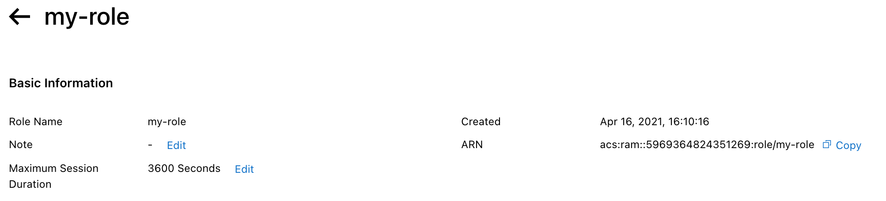

# RAM 

RAM (Resource Access Management) allows to manage the identity and
authorizations of users.

Users can be grouped into groups. Roles can be used to define virtual
users as well as authorization policies to control access to resources.
Finally, access can be secured by implementing dual authentication
(MFA).

## The users 

The RAM-User is an identity that links to an user or application.
Through the permissions that are granted to this identity, the user or
application can access resources in the cloud.

The overall process is as follows:
-   Log in to the main Alibaba Cloud account or with the account of a
    RAM user with RAM service access permission.
-   Create a RAM user.
-   Add it to a group.
-   Attach an authorization policy to the user or the group to which it
    belongs.
-   If the user needs to access the console, define a `logon
    password`.
-   If the user needs to call APIs, create an `access key`.

All that remains is to provide the user with the connection URL, the
user name and the associated password.

For console access, it is recommended to enable MFA, especially if the
user has sensitive permissions. This is a double authentication.

You can customize the login URL by specifying a company alias. To do
this:
-   Go to the `RAM` console,
-   Click on `Settings`,`
-   `Click on `Advanced`,
-   Click on `Edit` next to `Default Domain`,
-   Enter the new domain (in the form `XXX.onaliyun.com`),
-   Click on `OK`.

{width="3.184695975503062in"
height="0.8605555555555555in"}

To change the password policy:
-   Go to the `RAM` console,
-   Click on `Settings`,

`{width="4.5in" height="0.7881944444444444in"}
-   `Click on `Edit Password Rule` next to the text `Password
    Strength Settings`,
-   Change information,
-   Click on `OK`.

{width="2.9610148731408574in"
height="4.116632764654418in"}

To change the security configuration:
-   Go to the `RAM` console,
-   Click on `Settings`,`

`{width="4.5in"
height="0.6347222222222222in"}`
-   `Click on `User RAM User Security Settings`,
-   Enter the information,
-   Click on `Save Changes`.

{width="1.5771281714785652in"
height="2.984686132983377in"}

To create a RAM user:
-   Go to the `RAM` console,
-   Under `Identities`, click on `Users`,`
-   `Click on `Create User`,
-   Enter the information,
-   Click on `OK`.

{width="3.1633683289588803in"
height="1.7549857830271216in"}

To create an user by specifying a `login password`, required to access
the console:
-   Go to the `RAM` console,
-   Click on `Users`,`
-   `Click on `Create User`,
-   Enter the `Logon` Name,
-   Enter the display `name`,
-   Check `Access Console`,
-   Select `Custom Logon Password`,
-   Enter the password.

To specify the login password after the use is created:
-   Go to the `RAM` console,
-   Click on `Users`,`
-   `Click on the username,
-   Click on `Enable Console Logon`,
-   Select `Custom Logon Password`,
-   Enter the password.

You can optionally specify that the user must change this password on
the first login.

An `AccessKey` is the equivalent of the login password used for
console access but for API calls.

For security reasons, the `AccessKey` is displayed only during
creation. Remember to save it. If you lose it, you will have to recreate
another one.

To create an `AccessKey`:
-   Go to the `RAM` console,
-   Click on `Users`,`
-   `Click on the user,
-   Click on `Create AccessKey`.

Copy and save the values of `AccessKey ID` and `AccessKey Secret` or
download this information by clicking on `Download CSV File`.

MFA (Multi-Factor Authentication) increases the level of security by
requiring a six-digit verification code that changes every 30 seconds.
This code must be entered at login once the user has entered their
username and password.

To obtain this code, the user uses a "virtual MFA" mobile application
compatible with the TOTP (Time-based One-Time Password) algorithm of the
RFC 6238 standard.

To activate a virtual MFAn user for an user:
-   Go to the `RAM` console,
-   Click on `Users`,`
-   `Click on the username,
-   Click on `Enable Virtual MFA Device`.

In an MFA mobile application such as Google Authenticator, scan the
displayed QR code and enter two successive codes. The double
authentication is now activated.

## The groups 

To facilitate the management of users, they can be grouped into groups.

Before deleting the group, it is recommended to delete all users of this
group.

To create a group:
-   Go to the `RAM` console,
-   Click on `Groups`,`
-   `Click on `Create Group`,
-   `Group Name`: this is the name of the group that serves as an
    identifier,
-   `Display Name`: this is the name displayed for the group,
-   Click on `OK`.

{width="2.9814730971128607in"
height="2.362173009623797in"}

To add members of a group:
-   Go to the `RAM` console,
-   Click on `Groups`,`
-   `Click on the group name,
-   Click on `Add Group Members` of the group,
-   Click on the usernames to add them to the group,
-   Click on `OK`.

To remove a member from a group:
-   Go to the `RAM` console,
-   Click on `Groups`,`
-   `Click `Remove from Group` on the group member's line,
-   Click on `OK`.

To rename a group:
-   Go to the `RAM` console,
-   Click on `Groups`
-   Click on the group name,
-   Click on `Modify Basic Information`,
-   Modify the group,
-   Click on `OK`.

To delete an account:
-   Go to the `RAM` console,
-   Click on `Groups`,
-   Click on `Delete` on the line of the group,
-   Click on `OK`.

## The Roles 

Unlike a RAM user, a RAM role is a virtual user. It has no identity or
credentials and must be assumed by a trusted Alibaba Cloud account.

While an user has a login password or an `AccessKey` and can use MFA,
a role has none of that. Instead, it has permission policies.

For physical users, permissions are granted via a text-based role, while
for virtual users, permissions are granted via a role, which acts as a
virtual user.

When creating a role, you must:
-   specify the Alibaba Cloud account that assumes this role,
-   grant permissions to this role.

The user who assumes the role is then given an STS (temporary security
token) that allows them to access the authorized resources for that
role. This role token is a temporary `AccessKey` that can be used to
call Alibaba Cloud services APIs.

For an user to use a role that has been granted to him, he must log in
and then perform a `SwitchRole` operation to switch from his real
identity to the role identity. He can then perform the operations
allowed for this role. To return to the real identity, he must perform a
`Switch Back to Logon Identity` operation.

The role ARN is used to designate the role resource. It is displayed in
the role detail page.

{width="4.5in" height="1.0229166666666667in"}

The real user who assumes the role is designated by "Trusted Actors".

Roles are mainly used for:
-   access between accounts (e.g. to perform operations on resources or
    manage permissions between multiple accounts),
-   a temporary authorization (e.g. to allow a mobile application to
    perform operations on the resources).

A role can be assumed by a RAM user belonging to this or another Alibaba
Cloud account. For security reasons, a role cannot be assumed by this
account itself.

To create a role:
-   Go to the `RAM` console,
-   Click on `RAM Roles`,
-   Click on `Create RAM Role`,
-   Select a role type (`Alibaba Cloud Account`, `Alibaba Cloud
    Service` or `IdP`),
-   Select `Alibaba Cloud Account`,

{width="3.3278291776027995in"
height="1.9920756780402449in"}
-   Click on `Next`,
-   `RAM Role Name`: this`` is the name of the role,
-   `Trusted Alibaba Cloud Account`: select `Current Alibaba Cloud
    Account`,

This is the account that will assume this role: your own account
(`Current Alibaba Cloud Account`) or another one (`Other Alibaba
Cloud Account`).

{width="2.9487871828521435in"
height="2.4523173665791775in"}
-   Click on `OK`.

The created RAM role does not have any permissions at the moment. To add
the following permissions to the RAM user:
-   Go to the `RAM` console,
-   Click on RAM Roles,
-   Click on `Add Permissions` on the line of the role,
-   `Authorized Scope`: this`` is the authorization scope:

```{=html}
<!-- -->
```
-   `Alibaba Cloud Account`: permission takes effect on the current
    Alibaba Cloud Account,
-   `Specific Resource Group`: it takes effect on a specific resource
    group,

```{=html}
<!-- -->
```
-   `Principal`: this is the RAM role to which to give permissions (by
    default the current RAM role),
-   `Select Policy`: select policies,
-   Click on `OK`,
-   Click on `Complete`.

{width="4.1665879265091865in"
height="3.84251968503937in"}

To use this role in the console, you can connect to the console at
`https://signin.aliyun.com/switchRole`.

{width="2.329686132983377in"
height="1.9101268591426073in"}

The user can now perform operations in the console with the role
identity.

This role can also be used with the API by calling the `AssumeRole`
operation with the `AccessKey` to get an STS.

To get the ARN for the role or edit the role information, click on the
role name and then click `Copy` next to `ARN`.

To delete a role, click `Delete` on the line of the role.

## Access control to resources 

There are three ways to access the resources:
-   from the console,
-   by a call to an API,
-   by using a client tool.

Log in to the console from the `RAM user logon` URL displayed in the
`RAM` console `Overview` page. Enter the user name and password.

You are connected. Now you will assume a role. To do so, place the mouse
on your avatar and click on `Switch Identity:`

{width="1.5858398950131234in"
height="1.7444247594050744in"}

Now enter the company alias and the role name:

{width="2.5962325021872266in"
height="2.110240594925634in"}

Here you are connected by taking on a role.

To return to the identity, place the mouse on your avatar again and
click on `Back to Logon Identity`:

{width="1.7720866141732283in"
height="1.2166688538932633in"}

## Authorization policies

Permissions allow you to authorize or prohibit certain operations on
resources under certain conditions.

Each resource has an owner, which is an Alibaba Cloud account. It
controls the permissions on the resources and can give permission to an
user. However, the resources created by this user belong to the main
Alibaba Cloud account. So the main account owns all the resources.

By default, an user has no permissions. The owner of the main account
must give them some. An authorization policy is a group of permissions
described with the Authorization Policy Language (APL). It specifies the
resources, the operations allowed and the associated conditions.

There are two types of authorization policies:
-   system policies,
-   custom policies.

System policies are general permission groups managed by Alibaba Cloud
(example: full permissions for ECS). They are not editable.

Custom policiess are user-created policies and are therefore editable.
The permissions specified in them are more refined.

To grant an user a permission, you need to attach the permission policy
to the user or the group he belongs to. The two types of permission can
be mixed.

Here is an example of an authorization policy giving read-only
permission to objects in `oss://mybucket/website/` provided they are
accessed from IP address `17.1.2.3:`

{

"Version": "1",

"Statement": [

{

"Action": [ "oss:Get*", "oss:List*" ],

"Effect": "Allow",

"Resource": "acs:oss:*:*:mybucket/website/*",

"Condition": {

"IpAddress": { "acs:SourceIp": "17.1.2.3" }

}

}

]

}

A RAM authorization policy is therefore a JSON format file including the
version, a list of orders (`Statement`), each including four items:
-   the effects (`Effect`): this is the type of authorization
    (`Allow` or `Deny`),
-   resources (`Resource`): this is a list of objects on which the
    authorizations are based, expressed in the format
    `acs:<SERVICE_NAME>:<REGION>:<ACCOUNT_ID>:<RESOURCE_ID>`,
-   actions (`Action`): this is a list of operations performed on the
    specified resources, expressed in the format
    `<SERVICE_NAME>:<ACTION_NAME>`,
-   conditions (`Condition`): this is a list of conditions for the
    authorization to take effect.

It is possible to assign several policies to the same user. In this
case, `Deny` orders have priority over `Allow` orders.

When an item allows multiple values, it can be expressed with commas
(`,`) and square brackets (`[ ]`).

In addition, wildcards (`*` for zero to many letters) and (`?` for
one letter) can be used in strings.

The conditions are optional.

There can be several condition clauses (for example: `IpAddress`). In
this case, the condition is met when all the condition clauses are met.

When several values are specified, the condition is met when one of the
values is encountered.

A condition can be:
-   a type,
-   a keyword.

The type conditions are:
-   `String`: supported methods are `StringEquals`,
    `StringNotEquals`, `StringEqualsIgnoreCase`,
    `StringNotEqualsIgnoreCase`, `StringLike` and `StringNotLike`,
-   `Numeric`: the supported methods are `NumericEquals`,
    `NumericEquals`, `NumericLessThan`, `NumericLessThanEquals`,
    `NumericGreaterThan` and `NumericGreaterThanEquals`,
-   `Date`: the supported methods are `DateEquals`,
    `DateNotEquals`, `DateLessThan`, `DateLessThanEquals`,
    `DateGreaterThan` and `DateGreaterThanEquals`,
-   `Boolean:` the `Bool` method is supported,
-   `IP address:` the supported methods are `IpAddress` and
    `NotIpAddress`.

Keyword conditions are expressed in the format
`acs:<CONDITION_KEY>`:
-   `acs:CurrentTime`: this`` is the date and time of reception of
    the request, in ISO 8601 format (example: 2021-03-02T20:01:02Z),
-   `acs:SecureTransport:` indicates if a secure channel like HTTPS is
    used to send requests,
-   `acs:SourceIp:` corresponds to the IP address of the client
    sending the requests,
-   `acs:MFAPresent:` indicates if MFA is activated.

When the authorization policy includes several orders with an `Allow`
and `Deny` effect for the same resource, `Deny` has priority.

Authorization policies can be changed. However, the old authorization
policy remains available for some time. Moreover, if the new policy is
incorrect, a rollback must be performed. That's why Alibaba Cloud
allows managing multiple versions of authorization policies. The active
one is called the default verison.

If an authorization policy contains multiple versions, to delete it, you
must first delete all but the default version.

When an user tries to access a resource using a RAM role, thus using a
STS token, the evaluation process is as follows:
-   Does the authorization policy attached to the STS token allow
    access?
-   Does the authorization policy attached to the role identity allow
    access?
-   Does the user's primary account have access authorization?
-   Does the account have cross-account authorization (in case the
    account is not the owner of the resource)?

To view the list of system policies:
-   Go to the `RAM` console,
-   Click on `RAM Roles`,
-   Click on the role name.

To create an authorization policy for an account:
-   Go to the `RAM` console,
-   Click on `RAM Roles`,
-   Click on `Create RAM Role`,
-   `Select Trusted Entity`: select `Alibaba Cloud Account`,
-   Click on `Next`,

{width="2.901136264216973in"
height="2.157944006999125in"}
-   `RAM Role Name`: this`` is the name of the role,
-   `Note`: these are comments,
-   `Select Trusted Alibaba Cloud Account`: select `Current Alibaba
    Cloud Account`,
-   Click on `OK`.

{width="3.0758180227471565in"
height="3.069647856517935in"}

To change a policy:
-   Go to the `RAM` console,
-   Click on `RAM Roles`,
-   Click on the role name,
-   Click on the `Trust Policy Management` tab,
-   Click on `Edit Trust Policy`,
-   Change the policy,
-   Click on `OK`.

{width="4.5in"
height="2.701388888888889in"}

To delete an authorization policy:
-   Go to the `RAM` console,
-   Click on `RAM Roles`,
-   Click on `Delete` on the line of the role,
-   Click on `OK`.

To attach a policy to a RAM user:
-   Go to the `RAM` console,
-   Click on `Users`,
-   Click on `Add Permissions` on the user's line,
-   `Principal`: this is the user (or group or role) concerned,
-   `Select Policy`: select the policies to attach to the user,
-   Click on `OK,`
-   Click on `Complete`.

{width="4.5in"
height="3.654166666666667in"}

To attach a policy to an user group:
-   Go to the `RAM` console,
-   Click on `Groups`
-   Click on `Add Permissions` on the line of the group,
-   `Principal`: this is the group (or user or role) concerned,
-   `Select Policy`: select the policies to attach to the user,
-   Click `OK`.
-   Click `Complete`.

{width="4.5in"
height="3.6305555555555555in"}

