# Apsara for MySQL 

ApsaraDB for RDS (Relational Database Service) is a high performance
database service using SSD storage, supporting multiple database engines
(MySQL, SQL Server, PostgreSQL, MariaDB and PPAS - Oracle compatible)
and providing disaster tolerance, backup, recovery, monitoring and
migration services.

The connection to the database is done through an endpoint. This can be
internal or public. It is also necessary to create an account, which can
be standard or privileged, and to add the IP address of the client to
the whitelist. The incoming and outgoing traffic of ECS instances is
controlled by a security group.

Data between the client and the RDS instance is encrypted. Data on disk
can also be encrypted. TDE can encrypt and decrypt incoming and outgoing
data files in real time.

Read-only instances allow the RDS instance to be offloaded if it
receives too many requests. The dedicated proxy provides a single
endpoint for the application, unlike read-only instances.

RDS instances can be configured using a template. It is possible to
update minor and major versions under certain conditions. Maintenance
operations are performed during the maintenance window.

The backup policy allows to schedule data and log backups. A manual
backup is also possible. Backup between different regions is possible
using an OSS bucket. It is possible to backup and restore the whole
database or specific tables. Restoration can be done in another region.
In addition, binary log files can be uploaded to an OSS bucket.

It is also possible to create recovery instances in case of a
geographical disaster (geo-disaster). The switchover from the primary to
the secondary instance can be done manually or automatically. There are
two modes of data replication between the primary and secondary
instances: semi-synchronous and asynchronous.

DTS allows to migrate data between heterogeneous databases.

An ApsaraDB RDS for MySQL database instance can be synchronized with
another instance of the same or another MySQL engine.

Monitoring allows to monitor RDS instances and to trigger alerts. The
metrics can be related to the resources, to the engine and to the
deployment of an instance. The monitoring frequency can be modified.

It is possible to view error logs, slow query logs and operation and
maintenance events performed by both users and Alibaba Cloud on a RDS
instance. SQL Explorer is especially helpful for database
investigations.

## The different database engines 

ApsaraDB for RDS supports several database engines.

MySQL is the most popular open source database. It is part of LAMP, the
open source software stack (Linux + Apache + MySQL + PHP).

AliSQL, developed by Alibaba Cloud based on MySQL, offers advanced
features developed by Alibaba Cloud in addition to MySQL features:
enterprise level security, backup and restore, monitoring, performance
optimization, read-only instance.

SQL Server is one of the main commercial databases. It is part of the
Windows platform (IIS + .NET + SQL Server). It includes Management
Studio, which provides tools such as a script editor.

PostgreSQL is an open source database compatible with SQL but supporting
JSON, IP and geometric data. It supports the High Availability
architecture.

ApsaraDB for MyBase is an enterprise-class database developed by Alibaba
Cloud providing a dedicated cluster and multiple hosts as ECS instances
and advanced features. It supports MySQL, SQL Server and PostgreSQL
database engines. It helps to meet high regulatory compliance and
security requirements.

ApsaraDB RDS for PPAS is a relational database based on PostgreSQL,
secure and scalable enterprise level. Its performance has been improved
and its functionalities enriched. It also allows to run Oracle
applications directly.

ApsaraDB for MariaDB TX (Enterprise Edition) is an enterprise level
database compatible with Oracle. It offers advanced features. It uses
several storage engines, including MySQL InnoDB.

ApsaraDB PostgreSQL Ganos is a space-time engine providing data types,
functions and stored procedures to ApsaraDB for RDS.

In this chapter, we will discuss ApsaraDB for MySQL in more detail.

## The RDS instance 

In this section, we will study:
-   the creation of an instance,
-   the restart of an instance,
-   the release of an instance,
-   the recycle bin, which contains expired or overdue instances,
-   the use of tags.

### Create an instance 

`Pay-as-you-go` instances can be converted to `subscription`
instances, but the reverse is not true.

To create a RDS for MySQL instance:
-   Go to the `ApsaraDB for RDS` console,
-   Click on `Create Instance`,
-   `Billing Method`: this is the method of billing:

```{=html}
<!-- -->
```
-   `Subscription`: the insatnce is charged by prepayment (recommended
    for long-term needs),
-   `Pay-As-You-Go`: the instance is billed by the hour (recommended
    for short-term needs),

```{=html}
<!-- -->
```
-   `Region`: this is the region of the RDS instance.

It is recommended that you choose the same region as the ECS instance to
avoid having to pay Internet traffic usage fees and to ensure fast
access.

The region cannot be modified once created.
-   `Database Engine`: this is the database engine used (here:
    `MySQL`),

Supported engines are MySQL, Microsoft SQL Server, PostgreSQL, MariaDB
TX and PolarDB.
-   `Edition`: this is the edition of RDS:

```{=html}
<!-- -->
```
-   `Basic`,
-   `Company`,
-   `High-availability`,

The `Basic` edition has only one instance. This choice is not
recommended for production environments.

The `Enterprise` Edition consists of three instances: a primary
instance and two secondary instances. They are always located in
different areas of the same region to ensure service availability.

The `High-availability` edition consists of two instances: a primary
instance and a secondary instance.
-   `Storage Type`: this is the type of storage:

```{=html}
<!-- -->
```
-   `Local SSD`: this is a SSD located on the same node as the RDS
    instance, which reduces I/O latency,
-   `Enhanced SSD`: this is a SSD designed on the new distributed
    block storage architecture and 25GB and RDMA generation which allows
    to reduce latency,
-   `Standard SSD`: this is an elastic block storage device designed
    for distributed storage architecture,

`Local SSD` storage is an SSD located on the same node as the RDS
instance, which reduces I/O latency.

`Enhanced SSD` storage is an SSD designed on the new distributed block
storage architecture and 25GB and RDMA generation, which helps reduce
latency.

`Standard SSD` storage is an elastic block storage device designed for
a distributed storage architecture.
-   `Zone of Primary Node`: this is the zone to which the primary RDS
    instance belongs,
-   `Deployment Method`: this is`` the deployment method; it can be:

```{=html}
<!-- -->
```
-   `Single-zone Deployment`: deployment is done in a single zone; in
    this case, `Zone of Primary Node` and `Zone of Secondary Node`
    have the same value,
-   `Multi-zone Development`: deployment is done on several zones in
    order to guarantee disaster recovery,

```{=html}
<!-- -->
```
-   `Zone of Secondary Node`: this is the zone to which the secondary
    RDS instance belongs,

You can specify a zone or let Alibaba Cloud automatically select one for
you.
-   `Instance Type`: this is the type of RDS instance:

```{=html}
<!-- -->
```
-   `General-purpose (Entry-level)`,
-   `Dedicated instance (Enterprise-level)`,
-   `Dedicated (dedicated host)`,

The `General-purpose (Entry-level)` instance type provides dedicated
memory and I/O resources but shares CPU and storage with other instances
on the same server.

The `Dedicated` instance `(Enterprise-level)` instance type provides
dedicated CPU, memory, storage and I/O resources.

The `Dedicated` instance type provides all the resources of the server
where the instance is located.
-   `Capacity`: this is`` the storage capacity for data, system
    files, log files and transaction files,
-   `Click Next: Instance Configuration,`

+-----------------------------------------------------------------------+
| `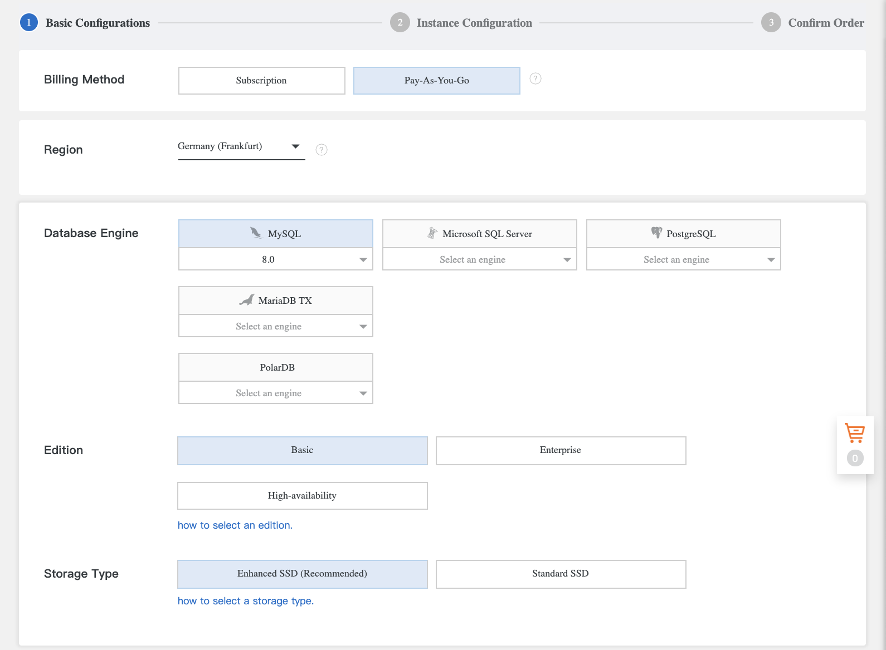{width="3.721247812773403in"               |
| height="2.733508311461067in"}                                         |
|                                                                       |
| {width="3.742688101487314in"                 |
| height="2.7457928696412948in"}                                        |
|                                                                       |
| {width="3.7862292213473316in"   |
| height="1.048225065616798in"}                                         |
|                                                                       |
| `                                                                    |
+=======================================================================+
+-----------------------------------------------------------------------+
-   `Network Type:` select the type of network (this must be the same
    as the RDS instance):

```{=html}
<!-- -->
```
-   `Classic Network`: Alibaba Cloud automatically assigns IP
    addresses,
-   `VPC` (recommended): allows to customize IP addresses,
-   `VPC`: this is the VPC in which the instance is created,
-   `VSwitch of Primary Node`: this is the VSwitch in which the
    instance is created,
-   `Minor Version Upgrade Policy`: the version upgrade can be done
    manually (`Manual Upgrade`) or automatically (`Automatic
    Upgrade`),
-   `Resource Group`: this is the group to which the instance belongs,

```{=html}
<!-- -->
```
-   Click `Next: Confirm Order`,

{width="3.5881091426071743in"
height="3.0155621172353455in"}
-   Click on `Buy Now`.

For a subscription instance, you can select `Auto-Renew Enabled` to
avoid paying the time extension fee.

### Restart an instance 

Restarting a RDS instance interrupts connections for up to 30 seconds.

To restart a RDS instance:
-   Go to the `ApsaraDB for RDS` console,
-   Click on `Instances`,
-   Click on the instance ID,
-   Click on `More | Restart Instance`,
-   Click on `OK`.

{width="4.5in"
height="1.6243055555555554in"}

### Release an instance 

When a RDS instance is released, its data is deleted. It is therefore
recommended to back up the data of the instance before releasing it.

To release a RDS subscription instance, it is necessary to open a
ticket.

To release a RDS Not-As-You-Go instance:
-   Go to the `ApsaraDB for RDS` console,
-   Click on `Instances`,
-   Click on the instance ID,
-   Click on `Release Instance` next to `Status`,
-   Click on `OK`.

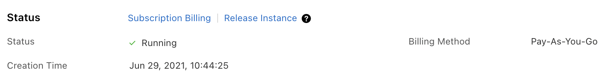{width="3.119892825896763in"
height="0.4289851268591426in"}

To cancel a subscription to a RDS instance, you have to open a ticket.

### Use the recycle bin 

The recycle bin is where expired or overdue instances are stored. It is
possible to unlock, recreate and destroy RDS instances. RDS instances
that are overdue or expired are placed in the recycle bin.

To unlock an instance that has been placed in the recycle bin:
-   Go to the `ApsaraDB for RDS` console,
-   Click on `Locked Instances (n)`.

{width="4.5in"
height="1.2006944444444445in"}

### Using tags 

If you have a large number of RDS instances, tags help you manage them
by linking them to ECS instances.

Each RDS instance can have up to 20 tags.

It is possible to filter the RDS instances by tag.

To add a tag:
-   Go to the `ApsaraDB for RDS` console,
-   Click on `Instances`,
-   Click on `+Add Label` on the line of the instance,
-   Click on `Create a label`,
-   `Key:` this is the key of the tag,
-   `Value:` this is the value of the tag,
-   Click on `OK`.

{width="2.424329615048119in"
height="1.2593044619422573in"}

## The account 

ApsaraDB RDS for MySQL supports two types of database accounts:
-   `Privileged` accounts.
-   `Standard` accounts.

All these accounts can be managed through the RDS console or through the
API. Standard accounts can also be managed by a SQL command.

A RDS instance can have only one `Privileged Account`.

A privileged account has the permissions to manage databases, manage
standard accounts, grant finer grained permissions, and log off a
standard user. A standard account has none of these permissions.

Database permissions must be granted for each standard account and
manually.

To create a privileged account:
-   Go to the `ApsaraDB for RDS` console,
-   Click on `Instances`,
-   Click on the RDS instance ID,
-   Click on `Accounts`,
-   Click on `Create Account`,
-   `Database Account`: this is`` the name of the database,
-   `Account Type`: select `Privilegied Account`,
-   `Password`: this is`` the password,
-   `Confirm Password`: this is a confirmation of the password,
-   `Description`: this is the description,
-   Click on `Create`.

{width="3.9005479002624672in"
height="3.3365332458442696in"}

To create a standard account:
-   Go to the `ApsaraDB for RDS` console,
-   Click on `Instances`,
-   Click on the RDS instance ID,
-   Click on `Accounts`,
-   Click on `Create Account`,
-   `Database Account`: this is`` the name of the account,
-   `Account Type`: select `Standard Account`,
-   `Authorized Databases`: these are the authorized databases,
-   `Password`: this is`` the account password,
-   `Confirm Password`: this is`` a confirmation of the password,
-   `Description`: this is the description,
-   Click on `Create`.

To reset an account password:
-   Go to the `ApsaraDB for RDS` console,
-   Click on `Instances`,
-   Click on the RDS instance ID,
-   Click on `Accounts`,
-   Click on `Reset Password`,
-   `New Password`: this is the new password,
-   `Confirm New Password`: this`` is the confirmation of the new
    password,
-   Click on `Create`.

{width="1.8575503062117236in"
height="1.2813659230096237in"}

If the privileged account is behaving strangely, you can reset the
permissions:
-   Go to the `ApsaraDB for RDS` console,
-   Click on `Instances`,
-   Click on the instance ID,
-   Click on `Accounts`,
-   Click on `Reset Permisions` on the line of the account,
-   Enter the password,
-   Click on `Create`.

{width="1.409359142607174in"
height="0.9619739720034995in"}

## The database 

In this section, we will study the creation and deletion of a database.

### Create a database 

To create a database:
-   Go to the `ApsaraDB for RDS` console,
-   Click on `Instances`,
-   Click on the instance ID,
-   Click on `Databases`,
-   Click on `Create Database`,
-   `Database Name`: this`` is the name of the database; this name
    must be unique among your RDS instances,
-   `Supported Character Set:` indicates the supported character set
    (supported values: `utf8`, `gbk`, `latin1` and `utf8mb4`),
-   `Authorized Account`: this is`` the account authorized to access
    the database, specified in a list,

The account can be specified later. It must be a standard account.
-   `Account type:` these are the permissions granted to the database
    (supported values: `Read/Write`, `Read-only`, `DDL Only` and
    `DML Only`),
-   `Description`: this is a description,
-   Click on `Create`.

{width="3.054209317585302in"
height="2.0238845144356956in"}

### Delete a database 

To delete a database:
-   Go to the `ApsaraDB for RDS` console,
-   Click on `Instances`,
-   Click on the instance ID,
-   Click on `Databases`,
-   Click on `Delete` on the line of the instance,
-   Click on `OK`.

## The instance parameters 

It is possible to reconfigure the settings of a RDS instance. A restart
is required for the changes to take effect.

To display the parameters:
-   Go to the `ApsaraDB for RDS` console,
-   Click on `Instances`,
-   Click on the instance ID,
-   Click on `Parameters`,
-   Click on the `Edit History` tab,
-   Select a time period,
-   Click on `Search`.

{width="4.5in" height="2.0256944444444445in"}

To reconfigure a parameter:
-   Go to the `ApsaraDB for RDS` console,
-   Click on `Instances`,
-   Click on the instance ID,
-   Click on `Parameters`,
-   Click on the `Editable Parameters` tab,
-   Click on the pen icon next to the setting you want to change,
-   Enter the new value,
-   Click on `OK`.

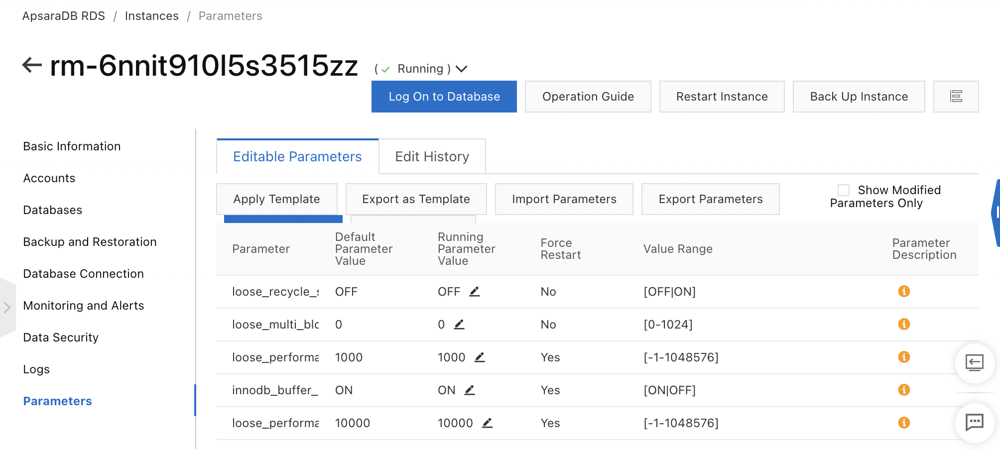{width="4.5in" height="2.0215277777777776in"}

Alibaba Cloud provides system templates for RDS instances. However, you
can create your own custom templates for the Enterprise edition.

To create a custom settings template:
-   Go to the `ApsaraDB for RDS` console,
-   Click on `Parameter Templates`,
-   Click on `Create Parameter Template`,
-   `Template Name`: this is the name of the template,
-   `Database Engine`: this is the database engine; select `MySQL`,
-   `Engine Version`: this is`` the version of the database engine,
-   `Description`: this is the description,
-   Click on `Add Parameter` to add a selected parameter to the list,

To import a previously exported template, click on `Import`.
-   Click on `Confirm`.

{width="4.5in"
height="2.5256944444444445in"}

To apply a parameter template to a RDS instance:
-   Go to the `ApsaraDB for RDS` console,
-   Click on `Parameter Templates`,
-   Click on the `Custom Parameter Templates` or `System Parameter
    Templates` tab,
-   Click on `Apply to Instance` on the line of the template,
-   Select RDS instances,
-   Click on `OK`.

{width="4.5in" height="1.3597222222222223in"}

To export a template:
-   Go to the `ApsaraDB for RDS` console,
-   Click on `Instances`,
-   Click on the instance ID,
-   Click on `Parameters`,
-   Click on the `Editable Parameters` tab,
-   Click on `Export as Template`,
-   `Template Name`: this is the name of the template,
-   `Description`: this is the description,
-   Click on `OK`.

{width="2.9716447944007in"
height="1.335865048118985in"}

## Securing 

In this section, we will study:
-   the whitelist that allows IP addresses to access the RDS instance,
-   the security group that allows to control the incoming and outgoing
    traffic of the ECS instances,
-   SSL encryption, which allows to reinforce the security and integrity
    of the data between the RDS instance and the client that connects to
    it,
-   encryption of the disks of the RDS instance,
-   TDE, which allows encryption and decryption of incoming and outgoing
    data files in real time.

### The whitelist 

The whitelist allows to allow IP addresses to access the RDS instance.
It is possible to specify:
-   A list of IP addresses,
-   A list of VPC security groups.

A list of IP addresses contains by default 127.0.0.1, which means that
no IP address can access the instance. You can enter a range of IP
addresses (example: 10.10.10.0/24) or an IP address. The items in the
list must be separated by a comma.

RDS offers two IP whitelisting modes:
-   standard whitelist mode: the specified IP addresses can access the
    RDS instance in both the classic network and the VPCs,
-   enhanced whitelist mode: the specified IP addresses are only
    relevant for the specified network type (classic network or VPC).

It is possible to switch from a standard whitelist to the enhanced
whitelist, but not vice versa. When you switch from the standard to the
enhanced whitelist, if the instance is in hybrid access mode, two new
whitelist groups are generated: one for classic networks and one for the
VPC.

To define a whitelist:
-   Go to the `ApsaraDB for RDS` console,
-   Click on `Instances`,
-   Click on the instance ID,
-   Click on `Data Security`.
-   Click on `Create Whitelist`,
-   `Network Type Allowed for Instance Access`: this is the network
    isolation mode (`VPC` or `Classic Network/Public IP`),
-   `Whitelist Name`: this is`` the name of the whitelist,
-   `IP Addresses`: enter the IP addresses or the CIDR block,

To find the IP addresses of the ECS instances, you can click on
`Loading ECS Inner IP`.
-   Click on `OK`.

{width="2.402366579177603in"
height="3.1219641294838145in"}

### The safety group 

A security group controls the incoming and outgoing traffic of ECS
instances. It acts as a virtual firewall. This security group can be
associated with a RDS instance. A RDS instance can have only one
security group.

To configure an ECS safety group:
-   Go to the `ApsaraDB for RDS` console,
-   Click on `Instances`,
-   Click on the instance ID,
-   Click on `Data Security`,
-   Click on the `Security Group` tab,
-   Click on `Add Security Group`,
-   Select the security group,
-   Click on `OK`.

### SSL encryption 

SSL encryption increases the security and integrity of data between the
RDS instance and the client that connects to it. The level of security
is thus increased but at the expense of access performance.

The disadvantage is that it increases the response time of connections
and consumes more CPU.

You must configure the CA SSL certificate at the client level for it to
connect to the RDS instance.

Only one connection can be encrypted (the public endpoint or the private
endpoint).

To enable SSL encryption:
-   Go to the `Apsara for RDS` console,
-   Click on `Instances`,
-   Click on the instance ID,
-   Click on `Data Security`,
-   Click on the `SSL Encryption` tab,
-   Enable `SSL Encryption`,
-   `Select Protected Address`: select the endpoint to encrypt,
-   Click on `OK`,
-   Click `Download CA Certificate`.

{width="4.5in" height="1.525in"}

This feature is only available for Enterprise and High-availability
editions.

The SSL certificate file is then downloaded in compressed format. This
file contains:
-   a `.p7b` file: this is the SSL certificate file used under
    Windows,
-   a `.pem` file: this is the SSL certificate file under other
    operating systems,
-   a `.jks` file: this is the SSL certificate file used by Java.

All that remains is to configure the SSL certificate on the client.

Disabling SSL encryption or updating the validity period of an SSL
certificate requires a restart of the RDS instance.

To update the validity period of an SSL certificate:
-   Go to the `Apsara for RDS` console,
-   Click on `Instances`,
-   Click on the instance ID,
-   Click on `Data Security` on the line of the instance,
-   Click on the `SSL Encryption` tab,
-   Click on `Update Validity.

`The certificate file must be downloaded and then configured.

ApsaraDB RDS triggers a primary/secondary failover to minimize
disruption to the service. It is still recommended to disable SSL in
off-peak periods.

To disable SSL encryption:
-   Go to the `Apsara for RDS` console,
-   Click on `Instances`,
-   Click on the instance ID,
-   Click on `Data Security`,
-   Click on the `SSL Encryption` tab,
-   Disable `SSL Encryption`,
-   Click on `OK`.

{width="4.5in" height="1.5486111111111112in"}

### Enable disk encryption 

Disk encryption allows data to be encrypted on the disks of the RDS
instance, further increasing the level of security.

This feature is available for Standard or Enhanced SSD storage and for
the High Availability Edition.

Please note that disk encryption cannot be disabled after it is
activated. Moreover, snapshots are also encrypted.

To enable disk encryption, simply activate the `Disk Encryption`
option.

{width="4.5in" height="0.6020833333333333in"}

### Encrypting with TDE 

TDE (Transparent Data Encryption) encrypts and decrypts incoming and
outgoing data files in real time. Data is encrypted before it is written
to disk and decrypted when it is read from disk into memory.

TDE does not increase the size of data files and its use is transparent
to developers.

Once activated, TDE cannot be deactivated and the key cannot be changed.

TDE uses a key managed by KMS. This key can either be generated by
Alibaba Cloud or customized.

To use the key generated by Alibaba Cloud:
-   Go to the `Apsara for RDS` console,
-   Click on `Instances`,
-   Click on the instance ID,
-   Click on `Data Security`,
-   Click on the `TDE` tab,
-   Activate `TDE Status`,
-   Check `Use an Automatically Generated Key`,
-   Click on `OK`.

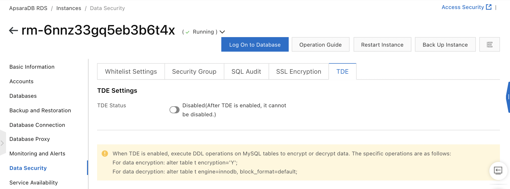{width="4.5in" height="1.6729166666666666in"}

This feature is available for the High-availability edition with local
SSDs.

To encrypt a table, execute the SQL command from the database (for MySQL
5.7 and higher):

`alter table < TABLENAME> encryption='Y';

`To decrypt a table, execute the SQL command:

`alter table <tablename> encryption='N';

## `Connection 

In order to connect to a RDS instance, an account and a whitelist must
be created.

To connect to a RDS for MySQL instance, you can use:
-   DMS (Data Management System): it is a graphical data management
    service provided by Alibaba Cloud supporting relational and NoSQL
    databases.
-   a database client: any MySQL database client can be used,
-   MySQL CLI: `mysql -h<HOSTNAME> -P<PORT> -u<USERNAME>
    -p<PASSWORD> -D<RDS_INSTANCE_NAME>.`

In this section, we will study how to connect with DMS and with private
and public endpoints.

### Connecting with DMS 

To connect to an instance with DMS:
-   Go to the `Apsara for RDS` console,
-   Click `Log On to Database`,
-   Click on `+ New`,
-   `Data Source`: select the source (here `MySQL`),
-   `Instance Region`: select the region where the instance to be
    accessed is located,
-   `Instance ID`: select the instance from the list,
-   `Database Account`: this is`` the name of the standard account
    that you created beforehand,
-   `Database password`: this is the associated password,

To test the connection, click on `Test Connection`. DMS will probably
display a list of IP addresses to add to the whitelist, unless they have
already been added.
-   Click on `Submit`.

{width="4.5in" height="3.0125in"}

### Connecting with endpoints 

ApsaraDB for RDS provides two types of endpoints:
-   interns,
-   audiences.

A private endpoint is provided by default. It allows for example an ECS
instance and a RDS instance in the same region and using the same type
of network to communicate. This is the option with the best security and
performance.

A public endpoint must be explicitly requested: it is not automatically
assigned. This is the least secure option. It should be avoided.

To request or release a public endpoint for an ApsaraDB RDS for MySQL
instance:
-   Go to the `Apsara for RDS` console,
-   Click on `Instances`,
-   Click on the instance ID,
-   Click on `Database Connection`,
-   Click `Apply for Public Endpoint`,

To release the public endpoint, click on `Release Public Endpoint`.
-   Click on `OK`.

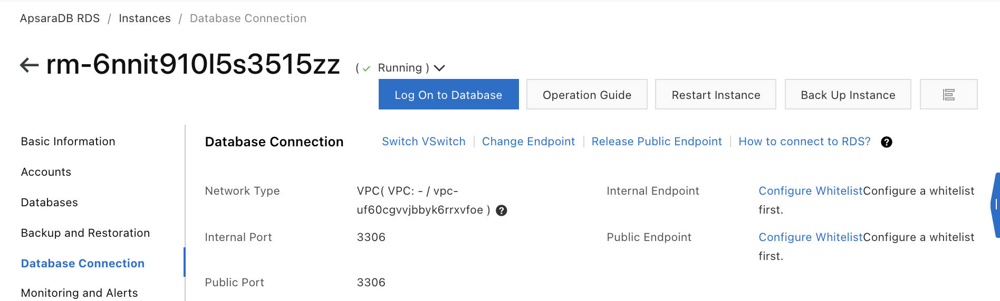{width="4.5in" height="1.3576388888888888in"}

To display the endpoint and the internal and public port of an instance:
-   Go to the `Apsara for RDS` console,
-   Click on `Instances`,
-   Click on the instance ID,
-   Click on `See Detail` next to `Network Type`.

{width="1.3322331583552056in"
height="0.640586176727909in"}

The information displayed is in this form:

{width="3.967422353455818in"
height="0.888996062992126in"}

To change the endpoint and the internal and public port of an instance:
-   Go to the `Apsara for RDS` console,
-   Click on `Instances`,
-   Click on the instance ID,
-   Click on `Database Connection` on the line of the instance,
-   Click on `Change Endpoint`,

{width="2.951898512685914in"
height="0.14531714785651795in"}
-   Select the connection type, the endpoint prefix and the port,
-   Click on `OK`.

{width="2.472843394575678in"
height="1.2520680227471566in"}

## The read-only instances 

If the RDS instance is overloaded by the number of requests, you can use
read-only instances to offload it. It can be created in any zone of the
same region. This will also increase the throughput.

A read-only instance is a read-only copy of the corresponding primary
instance. Changes made to the primary instance are automatically
replicated to all corresponding read-only instances. The life cycle of
the primary instance and the read-only instances are independent.

The read-only instance specifications and network type may be different
from those of the primary instance, but it is recommended that they be
greater than or equal to ensure that synchronization does not lag.

The number of read-only instances a primary instance can have depends on
its memory.

Although the whitelist is copied from the read-only instance creation,
its configuration is then independent.

Read-only instances do not support:
-   backup settings or manual backups,
-   data migration,
-   creation or deletion of databases,
-   creation or deletion of accounts,
-   account authorization,
-   change passwords.

### Create a read-only instance 

It is possible to create read-only instances for a primary RDS instance.
However, an existing instance cannot be switched to a read-only
instance.

A read-only instance does not inherit the parameters of the primary RDS
instance.

This feature is only available for the High-availability and Enterprise
editions.

To create a read-only instance:
-   Go to the `ApsaraDB for RDS` console,
-   Click on `Instances`,
-   Click on the RDS instance ID,
-   Click on `Add` next to `Read-only Instance`,

{width="3.0438812335958003in"
height="0.4105479002624672in"}
-   `Billing Method`: this is the payment method (`Subscription` or
    `Pay-As-You-Go`),
-   `Zone`: this is the zone where the instance is created,
-   `Instance Type`: this is the type of instance:

```{=html}
<!-- -->
```
-   `General-purpose (Entry-level)`: this is an instance with reserved
    memory and I/O resources but shared storage CPU,
-   `Dedicated (Enterprise-level)`: this is an instance with reserved
    memory, I/O resources, CPU and storage; it corresponds to a
    dedicated host instance or a dedicated instance,

```{=html}
<!-- -->
```
-   `Capacity`: this is the storage capacity,

{width="4.5in" height="2.8319444444444444in"}
-   Click on `Next: Instance Configuration`,
-   `Network Type`: this is the type of network:

```{=html}
<!-- -->
```
-   `Classic Network`: this is`` the traditional type of network,
-   `VPC`: this`` is the type of VPC network (recommended),

```{=html}
<!-- -->
```
-   `VPC`: this is the VPC where to create the instance,
-   `VSwitch of Primary Node`: this is the VSwitch where the instance
    is created,
-   `Resource Group`: this is the resource group to which the instance
    is associated,
-   Click `Next: Confirm Order`,

{width="4.5in" height="1.8416666666666666in"}
-   Click on `Pay Now`.

To view information about a read-only instance:
-   Go to the `ApsaraDB for RDS` console,
-   Click on `Instances`,
-   Click on the ID of the primary instance.

The number of read-only instances is displayed next to `Read-only
Instance`.

{width="3.522975721784777in"
height="0.36099628171478565in"}

### Change the replication latency 

To change the replication latency in a read-only RDS instance:
-   Go to the `Apsara for RDS` console,
-   Click on `Instances`,
-   Click on the instance ID,
-   Click on `Service Availability`,
-   Click on `Set Delayed Replication`,

{width="4.878163823272091in"
height="0.2085269028871391in"}
-   `Data Replication`: this is the latency value (in seconds),
-   Click on `OK`.

## The database proxies 

ApsaraDB RDS for MySQL offers two types of proxies: the shared proxy and
the dedicated proxy. The shared proxy, or multi-tenant proxy, offers
fewer features than the dedicated proxy. The dedicated proxy forwards
application requests either to the primary RDS instances or to the
read-only instances. It is located between the application and the
database. It allows automatic read/write splitting, transaction
splitting and connection pooling.

The read/write split can be achieved by manually adding the endpoints of
the primary and read-only RDS instances to the application. To avoid
updating the endpoint configuration in the application, the dedicated
proxy provides a unified proxy endpoint that the application can use.

## The disaster Recovery 

In this section, we will look at how to create a disaster recovery
instance and how to switch, manually or automatically, from the primary
instance to the secondary instance in case of a failure.

### Create a disaster recovery instance 

To improve data reliability, ApsaraDB RDS for MySQL provides
geo-disaster recovery instances. Data from the primary instance is
synchronized in real time with its geo-disaster recovery instance using
DTS (Data Transmission Service). DTS allows to modify synchronization
objects, synchronization speed parameters and latency alerts.

The primary instance and the recovery instance must have the same
specifications and configurations. Only the region of the disaster
recovery instance can be chosen. In addition, the billing method must be
Pay-As-You-Go.

Disaster recovery instances have their own endpoints for databases. To
switch to the geo-disaster recovery instance, all you have to do is
update the application endpoints.

Disaster recovery instances do not support backup, data migration,
database management, public endpoints or endpoint modification.

The account must have the permissions `SLAVE REPLICATION`, `CLIENT
REPLICATION` and execution of SQL commands on objects.

If a database is deleted from the primary instance, it is not
automatically deleted from the disaster recovery instance: it must be
deleted manually.

To create a disaster recovery instance:
-   Go to the `ApsaraDB for RDS` console,
-   Click on `Instances`,
-   Click on the instance ID,
-   Click on `Add` to the right of `DR Instance`,

{width="3.1846194225721787in"
height="0.43886811023622047in"}
-   `Database Account`: this`` is the account of the database,
-   `Database Password`: this is`` the password,
-   Click on `Buy Instance`,

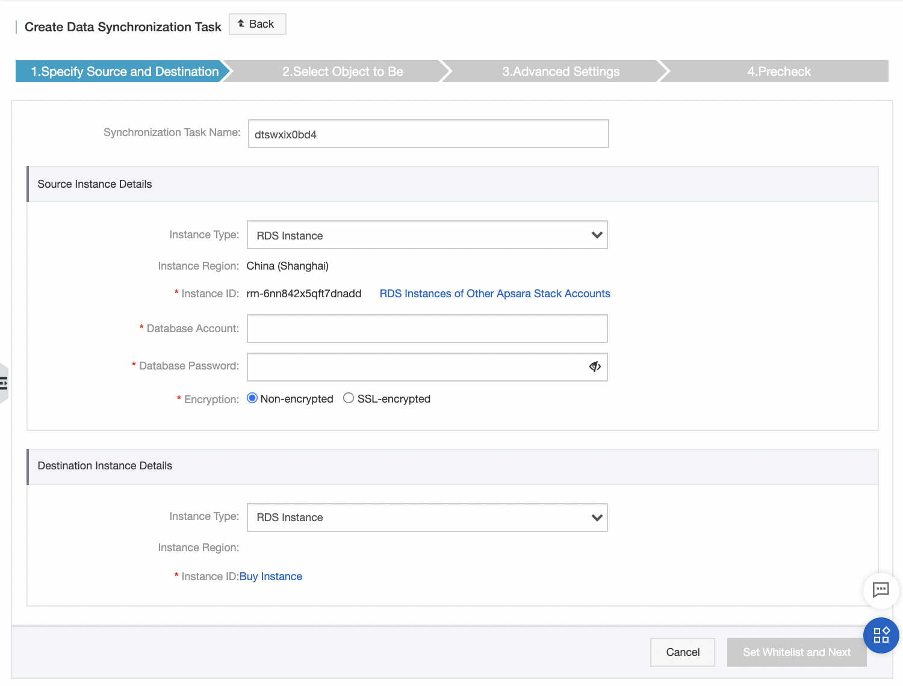{width="4.234543963254593in"
height="3.2183847331583553in"}
-   `Region`: this is the region,
-   Click on `Purchase`,

{width="2.1241502624671917in"
height="1.9153412073490814in"}
-   Click on `Create account`,
-   Click on `OK`,
-   `Database Account`: this is the account of the new instance,
-   `Database Password`: this is the password of the new instance,

{width="3.737390638670166in"
height="1.3507666229221347in"}
-   Click `Set Whitelist and Next`,
-   In the `Available` section, select the objects to synchronize,
-   Click on `Next`,

{width="4.5in"
height="3.1166666666666667in"}
-   Check `Initial Schema Synchronization`,
-   Click on `Precheck`,

{width="4.5in"
height="1.2548611111111112in"}
-   Click on `Start Task and configure alerts in CloudMonitor`,
-   Click on `Close`.

### Switch manually or automatically from the primary to the secondary instance 

The primary instance and the secondary instance must be in different
regions.

When the primary instance fails, you can perform an automatic switchover
to the secondary instance. The primary instance is then downgraded to
the secondary instance. The endpoint configuration of the application
must also be changed to use the endpoint of the secondary instance.

To manually switch from the primary instance to the secondary instance:
-   Go to the `ApsaraDB for RDS` console,
-   Click on `Instances`,
-   Click on the instance ID,
-   Click on `Service Availability`,
-   Click `Switch to Primary/Secondary Instance`,
-   `Automatic Switchover`: check `Switching Now` for an immediate
    switchover or `Switch Within Maintenance Window Current Setting`
    for a switchover in the maintenance window,
-   Click on `OK`.

## Modification of the instance 

The parameter templates allow you to manage RDS for MySQL instances in
batches.

In this section, we will study the modification of:
-   the configuration of a RDS instance,
-   the maintenance window, which is the period of time during which
    maintenance operations are performed,
-   the data replication mode between the RDS instance and its secondary
    RDS instances,
-   the billing method of an instance.

### Change the configuration 

You can change the configuration of a RDS instance. During this time,
the instance may be disconnected for about 30 seconds. In the case of
the `Basic` edition, this downtime can be up to 30 minutes.

To change the configuration:
-   Go to the `ApsaraDB for RDS` console,
-   Click on `Instances`,
-   Click on the instance ID,
-   Click on `Change Specifications`,

{width="4.5in" height="0.9680555555555556in"}
-   Modify the specifications of the instance,
-   `Switching Time:` indicates the time of the switch:

```{=html}
<!-- -->
```
-   `Switch Immediately After Data Migration`: immediately after data
    migration,`
-   Switch Within Maintenance Window`: during the specified maintenance
    window,

```{=html}
<!-- -->
```
-   Click on `Pay Now`.

{width="4.5in"
height="3.2506944444444446in"}

### Modify the maintenance window 

The maintenance window is the period of time during which any
maintenance operations are performed. Before the maintenance starts,
emails are sent to the contacts listed in Alibaba Cloud accounts.

In order to guarantee the stability of the RDS instances, the
maintenance of the instances is performed at irregular intervals. The
default maintenance window is from 02:00 to 06:00. It is possible to
change this maintenance window.

The instance changes to the `Maintaining Instance` state before the
maintenance time. In this state, modification operations (upgrade,
reboot, etc.) are not available.

The instance is disconnected once or twice. Applications using this
instance should set up an automatic reconnection to avoid service
interruptions.

To change the maintenance window:
-   Go to the `ApsaraDB for RDS` console,
-   Click on `Instances`,
-   Click on the instance ID,
-   Click on `Configure` next to `Maintenance Window`,

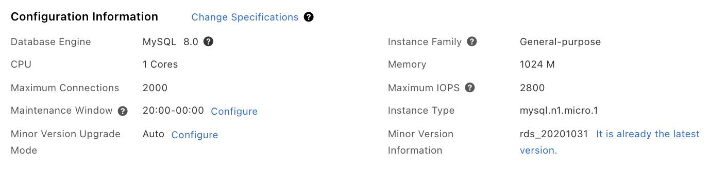{width="4.5in" height="1.0840277777777778in"}
-   Select the time window,
-   Click on `OK`.

{width="1.65836176727909in"
height="1.149306649168854in"}

### Change the data replication mode 

The data replication mode concerns the replication of data between the
RDS instance and its secondary RDS instances. This feature is available
for High-availability instances.

Two modes of data replication are available:
-   semi-synchronous,
-   asynchronous.

With the semi-synchronous mode, when the primary RDS instance receives
change requests from the application, it triggers a synchronization via
the logs on the secondary RDS instances. If the communication between
the primary and the secondaries encounters problems, the replication
mode becomes asynchronous.

With asynchronous mode, when the primary RDS instance receives change
requests, it processes the request, responds and then replicates the
data to the secondary RDS instances asynchronously afterwards.

To change the data replication mode:
-   Go to the `ApsaraDB for RDS` console,
-   Click on `Instances`,
-   Click on the instance ID,
-   Click on `Service Availability`,
-   Click `Change Data Replication Mode`,

{width="4.5in" height="0.15555555555555556in"}
-   `Data Replication`: this is the data replication mode
    (`Semi-synchronous` or `Asynchronous`),
-   Click on `OK`.

{width="1.8332272528433946in"
height="0.6540769903762029in"}

### Change the billing mode of an instance 

To change the billing mode of a RDS instance from `Pay-As-You-Go` to
`Subscription`:
-   Go to the `ApsaraDB for RDS` console,
-   Click on `Instances`,
-   Click on the instance ID,
-   Click on `Subscription Billing`,

{width="3.01378937007874in"
height="0.45392825896762906in"}

To switch from Subscription to `Pay-As-You-Go` billing, click on
`Switch to Pay-you-go Billing`.
-   `Duration`: this is the duration,
-   Click on `Pay Now`.

{width="4.5in"
height="1.6895833333333334in"}

## Upgrade of the RDS instance 

The automatic upgrade of minor versions is enabled by default. It is
performed during the maintenance window.

During this operation, the RDS instance must restart and is thus
unavailable for up to 30 seconds.

It is not possible to downgrade to the previous minor version.

To configure the update mode for the minor version of the engine:
-   Go to the `ApsaraDB for RDS` console,
-   Click on `Instances`,
-   Click on the instance ID,
-   Click on `Configure` to the`` right of `Minor Version Upgrade
    Mode`,

{width="3.059002624671916in"
height="0.828008530183727in"}
-   Select `Auto` or `Manual` mode,
-   Click on `OK`.

{width="1.9263845144356955in"
height="1.541107830271216in"}

To update the minor version of the engine:
-   Go to the `ApsaraDB for RDS` console,
-   Click on `Instances`,
-   Click on the instance ID,
-   Click on `Upgrade Kernel Version`,
-   `Upgrade Time`: this is the time of the upgrade (immediately,
    during the maintenance window or from a specific time),
-   Click on `OK`.

`Upgrade Kernel Version` is not visible if you use the latest minor
version of the engine:

{width="3.2116338582677164in"
height="1.0958202099737533in"}

It is possible to upgrade the database engine on major versions, but it
depends on the current version. See the official documentation for
details.

## Migration 

In this section, we will study:
-   data migration with DTS (Data Transmission Service) between
    heterogeneous databases,
-   synchronization of data from one ApsaraDB RDS for MySQL database
    instance with another instance.

### Migrating data with DTS 

DTS (Data Transmission Service) allows to migrate data between
heterogeneous databases thanks to its ETL (Extract, Transform, Load)
functions:
-   mapping of column, table and database names,
-   data filtering.

Migration is possible between an ApsaraDB RDS for MySQL instance and a
MySQL database installed on an ECS or on-premises instance, using a VPN
connection, a MySQL instance installed on another Cloud.

It is also possible between two MySQL databases installed by you and
between two Alibaba Cloud accounts.

To access Data Transmission Service (DTS):
-   Go to the `Data Transmission Service` console,
-   Click on `Data Migration`.

{width="3.8714326334208224in"
height="2.5337576552930883in"}

### Synchronize data 

It is possible to synchronize an ApsaraDB RDS for MySQL database
instance with another instance of the same or another MySQL engine.

Synchronization with an instance of the same engine can be done with
another ApsaraDB RDS for MySQL instance from your own Alibaba Cloud
account or another account, with a self-hosted MySQL instance on an ECS
instance, on an on-premises machine using a VPN.

Synchronization with another engine is possible using the MaxCompute
data warehouse solution.

## Monitoring and auditing 

In this section, we will study:
-   access to deployment metrics, on resources and on the engine,
-   modification of the monitoring frequency of the instance,
-   configuration of an alert rule for an instance,
-   the logs that allow to locate errors,
-   SQL Explorer to help with database troubleshooting,
-   access to the event history of a RDS instance.

### Display deployment, resource and engine metrics 

It is possible to display metrics on resources, engine and deployment of
an instance:
-   Go to the `ApsaraDB for RDS` console,
-   Click on `Instances`,
-   Click on the RDS instance ID,
-   Click on `Monitoring and Alerts`.

You can monitor the resources, the database engine or the deployment:

{width="4.5in"
height="1.4083333333333334in"}

For resource `monitoring`, the following metrics are available:
-   `Disk Space (MB)`: disk usage,
-   `IOPS`: number of input/output operations per second (IOPS),
-   `Total Connections`: number of active connections and total number
    of connections,
-   `CPU Utilization and Memory Usage (%)`: CPU and memory usage,
-   `Network Traffic (KB)`: incoming traffic volume per second and
    outgoing traffic volume per second.

For database engine `monitoring`, the following metrics are available:
-   `TPS/QPS`: average number of transactions per second (TPS) and
    average number of SQL statements executed per second,
-   `InnoDB Buffer Pool Read Hit Ratio`, `Usage Ratio` and `Dirty
    Block Ratio (%)`: ratio of read hit, usage and dirty block radio of
    the InnoDB buffer pool,
-   `InnoDB Read/Write Volume (KB)`: volume of data read from InnoDB
    per second and volume of data written to InnoDB per second,
-   `InnoDB Buffer Pool Read/Write Frequency`: number of reads from
    InnoDB per second and number of writes to InnoDB per second,
-   `InnoDB Log Read/Write/fsync`: frequency of reading/writing/fsync
    of InnoDB logs,
-   `Temporary Tables Automatically Created on Hard Disk when MySQL
    Statements Are Executed`: number of temporary tables created on
    hard disk when SQL statements are executed,
-   `MySQL_COMDML`: number of SQL statements executed per second,
-   `MySQL_RowDML`: number of operations performed by InnoDB per
    second,
-   `MyISAM Read/Write Frequency`: number of buffer pool reads/writes
    per MyISAM per second, number of hard disk reads/writes per MyISAM
    per second,
-   `MyISAM Key Buffer Read/Write/Usage Ratio (%)`: ratio of MyISAM
    key buffer reads, writes and uses per second,
-   `Running Threads`: number of active threads and number of
    connected threads.

For deployment `monitoring`, the following metrics are available:
-   `Replication Thread Status of Secondary Instances`: status of
    threads used to replicate data to the secondary RDS instance,
-   `Replication Latency of Secondary Instances`: latency of data
    replication to the secondary RDS instance (in seconds).

Please note that changing the frequency of some metrics may generate
fees.

### Change the monitoring frequency of the instance 

The monitoring frequency can be modified. The possible values depend on
the edition of the instance:
-   For the Basic edition, only the 300 second frequency is supported.
-   For the High Availability and Enterprise editions, the 60-second
    frequency is free. If the instance has a memory of more than 8 GB,
    the frequency can go up to every 5 seconds but with a fee.

It is possible to consult the monitoring data of the last 30 days.

To change the monitoring frequency of the instance:
-   Go to the `ApsaraDB for RDS` console,
-   Click on `Instances`,
-   Click on the RDS instance ID,
-   Click on `Monitoring and Alerts`,
-   Click `Set Monitoring Frequency`,

{width="1.5024759405074366in"
height="0.22365048118985126in"}
-   Select a monitoring frequency,
-   Click on `OK`.

{width="2.3007720909886262in"
height="0.9043318022747157in"}

### Configure an alert rule for an instance 

Cloud Monitor is used to monitor RDS instances. This allows the
configuration of metrics and alert rules. Alerts can be sent via email
to contacts in an associated alert group.

To configure an alert rule for a RDS istance:
-   Go to the `ApsaraDB for RDS` console,
-   Click on `Instances`,
-   Click on the RDS instance ID,
-   Click on `Monitoring and Alerts`,
-   Click on the `Alerts` tab,

{width="4.5in"
height="1.3020833333333333in"}
-   Click `Set Alert Rule`.

Alibaba Cloud redirects you to CloudMonitor:

{width="4.5in"
height="1.9180555555555556in"}

### View logs 

To locate errors, you should query the error logs and the slow request
logs.

To view the logs:
-   Go to the `ApsaraDB for RDS` console,
-   Click on the RDS instance ID,
-   Click on `Logs`,
-   Click on:

```{=html}
<!-- -->
```
-   `Binlog Subscription:` allows to subscribe to the MySQL binlog in
    real time,
-   `Error Logs`: records the SQL orders that failed to execute in the
    last month,
-   `Slow Log Query Details`: records SQL commands that lasted longer
    than one second in the last month,
-   `Slow Log Summary:` provides statistics and analysis reports for
    SQL orders that lasted longer than one second in the last month,
-   `Primary/Secondary Switching Logs`: logs for the primary and the
    secondary instance (except for the `Basic` edition).

{width="4.5in"
height="1.0819444444444444in"}

### Troubleshooting with SQL Explorer 

SQL Explorer helps with database troubleshooting, action analysis and
security auditing. It is an enhancement of SQL Audit.

It allows to consult the data for a period of up to 24 hours. Beyond
that, it is recommended to export the data locally to be consulted.

SQL Explorer also allows to interactively and visually analyze the logs
over a period of time to identify abnormal SQL statements and
performance problems.

Incremental data can be displayed via:
-   SQL logs,
-   binary logs.

SQL logs are similar to MySQL audit logs. They record information about
DML and DDL operations. This information is obtained by analyzing
network protocols. Since the actual values of the parameters are not
analyzed, if the volume of executed SQL queries is large, a small amount
of data may be lost.

Binary logs record information about add, delete and modify operations.
They also record incremental data used for data recovery. This data is
stored temporarily in the RDS instance. Periodically these logs are
uploaded to an OSS bucket, where they are kept for seven days. Note that
since binary log files being written cannot be backed up, some files may
not have been uploaded to OSS.

To reduce storage costs, SQL explorer uses columnar storage and
compression technology.

### View the event history of a RDS instance 

It is possible to display the operation and maintenance (O&M) events
performed by both users and Alibaba Cloud on a RDS instance: instance
creation, settings configuration, ...

To view the event history of a RDS instance:
-   Go to the `ApsaraDB for RDS` console,
-   Click on `Event`,
-   Click on the `Historical Events` tab.

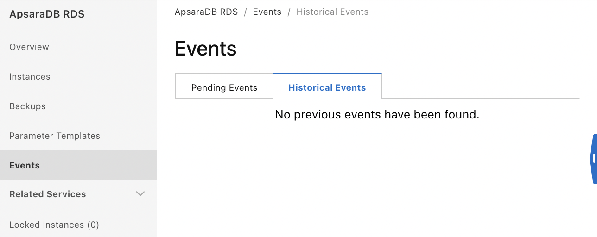{width="2.663280839895013in"
height="1.0587357830271216in"}

The event history of the instance is displayed, indicating the type of
resources, their name and the type of event.

## Backing up a database 

Backups allow you to restore a RDS instance from a backup file. Backups
can be automatic or manual. It is recommended to perform backups during
off-peak hours.

The backup files are kept for the specified retention time. They can be
kept after the release of the instance.

Read-only RDS instances do not support backup settings.

The backup can be of the data or the logs.

The log backup saves the binary logs generated by the RDS instance.
These backups are used for point-in-time restores. They occupy a storage
space of the instance. These files are not accessible.

It is possible to run queries directly on the data stored in the backup
files, without having to restore these files.

The backup can be:
-   logical: save objects (like tables) with `mysqldump`,
-   physical: backs up database files at the operating system level,
-   snapshots: save a copy of the data.

In this section, we will study:
-   data backup and recovery,
-   backup and restore data between regions,
-   Backup and restore a specific database and specific tables,
-   upload binary log files to an OSS bucket.

### Save data 

Data and logs can be saved:
-   automatically by defining a backup policy,
-   manually.

Each RDS instance has a quota of free backup space.

During the execution of DDL (Data Definition Language) commands, tables
are locked, preventing backups. Therefore, no DDL operations should be
performed during a backup.

To enable automatic backups of a RDS instance:
-   Go to the `ApsaraDB for RDS` console,
-   Click on the instance ID,
-   Click on `Backup and Restoration`,
-   Click on the `Backup Settings` tab,
-   Click on `Edit` next to `Data Backup Settings`,

{width="4.5in"
height="3.1152777777777776in"}
-   `Data Backup Retention (Days)`: this is the data retention period
    (from 7 to 730 days) (default 7 days); with the `Basic` edition,
    its value cannot be modified,
-   `Backup Cycle`: this`` is the duration of the backup cycle,
-   `Backup Time`: this`` is the scheduled time for the backup,

It is recommended to choose off-peak hours.
-   `Log Backup:` allows to save logs,
-   `Log Retention Period (Days)`: this is the log retention period
    (from 7 to 730 days) (by default 7 days); with the `Basic`
    edition, its value cannot be modified,
-   `Long-term Retention` (for High Availability Edition with local
    SSDs): retains backups after the RDS instance is released,
-   `Backup Retention Policy After Release` (for the High Availability
    Edition with local SSDs): this is the policy for retaining backup
    files after the release of a RDS instance (valid values are
    `None`, `Latest` and `All`),

To avoid data loss in case of involuntary interruption (late payment,
...), it is recommended to select `Latest` or `All`.
-   `Restore Individual Database/Table` (for High Availability edition
    with local SSDs): allows to restore specific databases and tables
    (the format of the backup files is modified for this purpose),
-   `Increase Snapshot Frequency Table` (for the High Availability
    edition with enhanced SSDs): this is the frequency of backup
    (maximum of once every 15 minutes),
-   `Single-digit Second Backup` (for the High Availability Edition
    with enhanced SSDs): allows to perform a backup in less than one
    second,

`Increase Snapshot Frequency Table` and `Single-digit Second Backup`
cannot be activated at the same time.
-   Click on `Save`.

{width="3.119416010498688in"
height="1.84998687664042in"}

To perform a backup manually:
-   Go to the `ApsaraDB for RDS` console,
-   Click on the RDS instance ID,
-   Click on `Back Up Instance`,

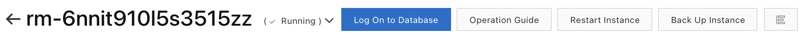{width="3.611324365704287in"
height="0.1761078302712161in"}
-   `Select Backup Mode` (for instances with local SSDs): this is the
    backup mode, which can be `Physical Backup` or `Logical Backup`
    (in this case you have to specify one or more databases),
-   `Backup Policy` (for instances with enhanced SSDs): this is the
    backup policy; select `Snapshot Backup`,
-   Click on `OK`.

{width="2.729948600174978in"
height="1.2651290463692038in"}

To view the status of the project, click on `Task Progress`.

### Restore data 

Data from a RDS for MySQL instance can be restored in two ways:
-   by restoring the data to a new RDS instance and then migrating the
    restored data to the original RDS instance,
-   by restoring data from a specific database or table to the original
    RDS instance or to a new RDS instance.

The original RDS instance must be in the `Running` state and not
locked.

To be able to restore data from a time point, the log backup must be
activated.

It is recommended not to perform DDL operations during data migration.

To restore data to a new instance:
-   Go to the `ApsaraDB for RDS` console,
-   Click on `Instances`,
-   Click on the instance ID,
-   Click on `Backup and Restoration`,
-   Click on `Restore Database (Previously Clone Instance)`,

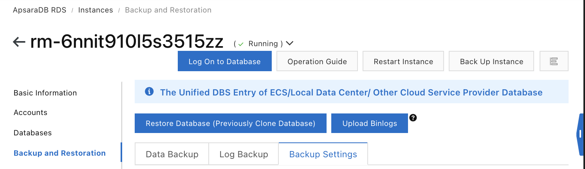{width="3.5021106736657917in"
height="1.0128018372703411in"}
-   `Billing Method`: this is the billing method (`Pay-As-You-Go` or
    `Subscription`); in the case of `Subscription`, you must also
    specify the duration and quantity,
-   `Restore Mode`: this`` is the restore mode (`By Time` to
    specify a point in time or `By Backup Set`),
-   `Zone of Primary Node`: this is`` the zone to which the primary
    RDS instance belongs,
-   `Deployment Method`: this is`` the deployment method:

```{=html}
<!-- -->
```
-   `Single-zone Deployment`: deployment is done in a single zone; in
    this case, `Zone of Primary Node` and `Zone of Secondary Node`
    have the same value,
-   `Multi-zone Development`: deployment is done on several zones in
    order to guarantee disaster recovery,

```{=html}
<!-- -->
```
-   `Zone of Secondary Node`: this is`` the zone to which the
    secondary RDS instance belongs,
-   `Instance Type`: this is the type of RDS instance:

```{=html}
<!-- -->
```
-   `General-purpose (Entry-level)`,
-   `Dedicated (Enterprise-level)`,

The `General-purpose (Entry-level)` instance type provides dedicated
memory and I/O resources but shares CPU and storage with other instances
on the same server.

The `Dedicated (Enterprise-level)` instance type provides dedicated
CPU, memory, storage and I/O resources.
-   `Capacity`: this is the storage capacity,
-   Click `Next: Instance Configuration`,
-   `Network Type`: this`` is the type of network (`Classic
    Network` or `VPC`),
-   Click `Next: Confirm Order`,
-   `Duration`: this`` is the duration (1 month or more),
-   `Purchase Plan`: this`` is the number of instances,
-   Click on `Pay Now`.

To migrate data between two RDS instances:
-   Go to the `Data Transmission Service` console,
-   Click on `Data Migration`,
-   Click on `Create Migration Task`,
-   Enter the parameters on the source database:

```{=html}
<!-- -->
```
-   `Instance Type`: this is the type of instance (user-created
    instance, RDS instance, etc.); select `RDS Instance`,
-   `Instance Region`: this is`` the region where the RDS instance
    is located,
-   `RDS Instance ID`: this is`` the ID of the new instance,
-   `Database Account`: this is`` the username of the RDS instance
    account,
-   `Database Password`: this is`` the password of the new RDS
    instance account,
-   `Encryption`: select `Non-encrypted`, (possible values are
    `Non-encrypted` and `SSL-encrypted`,

{width="4.5in"
height="2.561111111111111in"}
-   Enter the parameters on the destination database:

```{=html}
<!-- -->
```
-   `Instance Type`: this is the RDS instance,
-   `Instance Region`: this is`` the region where the original RDS
    instance is located,
-   `RDS Instance ID`: this is`` the ID of the original instance,
-   `Database Account`: this is`` the username of the RDS instance
    account,
-   `Database Password`: this is`` the password of the RDS instance
    account,

{width="4.5in"
height="1.7333333333333334in"}
-   Click `Set Whitelist and Next`,
-   Select the type of migration (`Schema Migration`) and the objects
    to migrate (`Full Data Migration`),
-   Select the objects to be migrated,
-   Click on `Precheck`,
-   Click on `Next`,
-   Click on `Buy and Start`.

### Save data between regions 

To perform data backup between regions, local backup files are
automatically replicated to an OSS bucket located in the destination
region. Then the RDS instance is restored in the other region from the
backup to the OSS bucket in that region.

This backup is independent of the RDS instance: it is not deleted even
after the RDS instance is released.

If no backup file was created less than 24 hours ago, a backup is made.
If a continuous binary log file has been generated, this data is dumped.
Otherwise, a backup is triggered.

The cross-region backup feature is not available in all regions. When it
is available, a `Cross-region Backup` item is added to the RDS Console
menu.

### Restore data from one RDS instance across multiple regions 

It is possible to restore data from a backup to an instance in another
region. To do this, the RDS instance must be backed up to several
regions.

To restore data from a RDS instance across multiple regions:
-   Go to the `ApsaraDB for RDS` console,
-   Click on `Backups`,
-   Click on the `Cross-region Backup` tab,
-   Click on the instance ID,

Cross-region backup must be enabled. If this is not the case, click on
`Settings` on the line of the instance and activate `Enable`.
-   Click on `Restore`,
-   Click on the `Data Backup` tab,
-   Click on `Restore` on the line of the backup,
-   Select `Restore To New Instance`: this is the restore destination,
-   Click on `OK`,
-   Click on the `Subscription` or `Pay-As-You-Go` tab,
-   `Restore Mode`: this is the restore mode; the possible values are:

```{=html}
<!-- -->
```
-   `By Backup Set`: the restoration of the whole backup is performed,
-   `By Time`: the restoration is done at a point in time of the
    backup; this option requires that the log backup is activated,

```{=html}
<!-- -->
```
-   `Backup Set`: this`` is the backup set to restore (only
    displayed if the restore mode is `By Backup Set`),
-   `Restore Point`: this is`` the time at which to start the
    restore (only displayed if the restore mode is `By Time`),
-   `Region`: this is the region to which the new instance belongs,
-   `Zone`: this is the zone where the new instance is located; it
    must be the same region as the original instance but the zone can be
    different,
-   `CPU and Memory`: this is`` the type of instance of the new
    instance,
-   `Capacity`: this is the storage capacity of the new instance,
-   `Network Type`: this`` is the type of network (`Classic
    Network` or `VPC`),
-   `Duration`: this`` is the duration (only in the case of
    subscription)
-   `Quantity`: this is`` the number of RDS instances,
-   Click on `Buy Now`,
-   Click on `Pay Now`.

{width="3.0299693788276465in"
height="1.3690966754155731in"}

### Backup a specific database and specific tables 

To set up an automatic individual database and table backup:
-   Go to the `ApsaraDB for RDS` console,
-   Select the region of the RDS instance,
-   Click on the RDS instance ID,
-   Click on `Backup and Restoration`,
-   Click on the `Backup Settings` tab,
-   Click on the `Edit` button next to `Data Backup Settings`,
-   Check `Restore Individual`,
-   Click on `Save`.

To back up a specific database and table:
-   Go to the `ApsaraDB for RDS` console,
-   Select the region of the RDS instance,
-   Click on the RDS instance ID,
-   Click on `Back Up Instance`,
-   `Select Backup Mode`: select `Logical Backup`,
-   `Backup Policy`: select `Database/Table Backup`,
-   Select the databases to be backed up,
-   Click on `OK`.

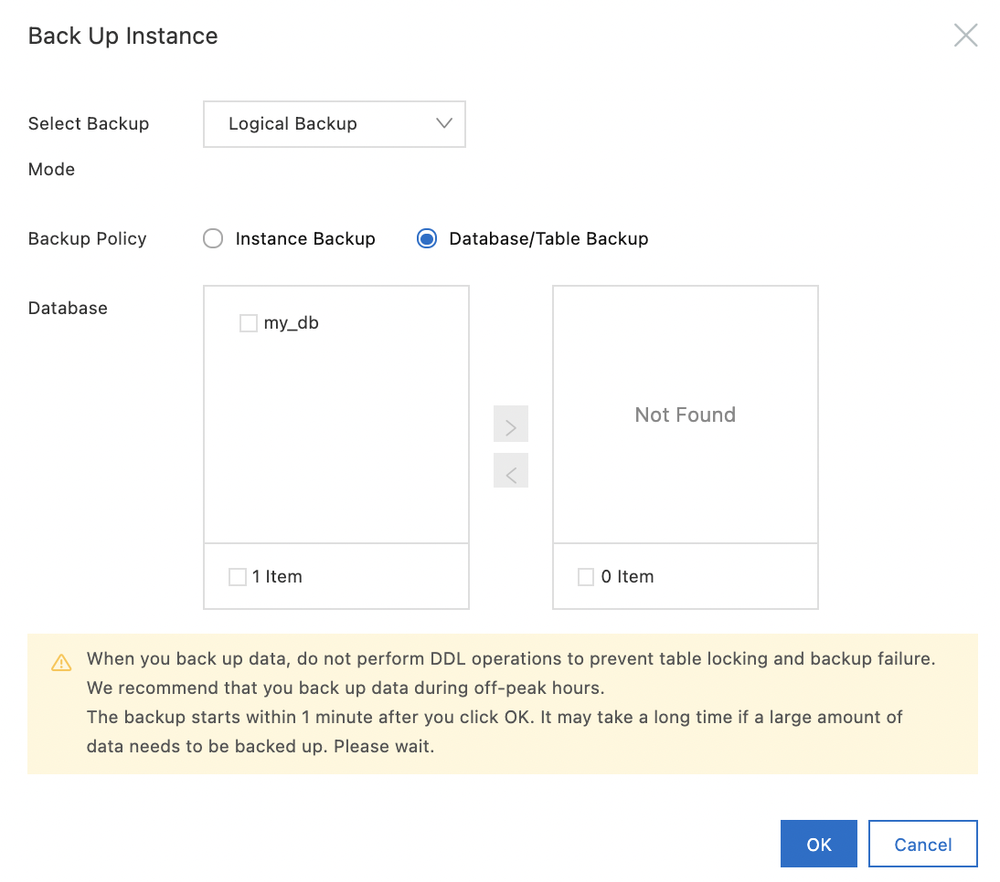{width="2.475702099737533in"
height="2.1861056430446193in"}

### Restore an individual database and table 

It is possible to restore a database or an individual table.

The destination RDS instance must be in the `Running` state and must
not be locked. No migration task must be running on this instance. In
addition, the log backup must be enabled.

In the case of recovery on the same instance, a primary/secondary
failover is triggered during the recovery. A service interruption of the
database may occur for about 30 seconds. The client must then reconnect
automatically. Databases and tables must have new names. By default, RDS
adds `_backup` to the original names.

This restore causes the backup file format to change from `tar` to
`xbstream`, which results in a slight increase in backup storage
space.

To restore an individual database or table:
-   Go to the `ApsaraDB for RDS` console,
-   Click on `Instances`,
-   Click on the instance ID,
-   Click on `Backup and Restoration`,
-   Click on `Restore Individual Database/Table`,

{width="2.9171675415573053in"
height="0.1967290026246719in"}
-   `Restore To`: this is the destination of the restore; the values
    can be:

```{=html}
<!-- -->
```
-   `Current Instance`: the restoration is done on the same instance,
-   `New Instance`: the restoration is done in a new instance,

```{=html}
<!-- -->
```
-   `Restore Method:` this is the restore method; the possible values
    are:

```{=html}
<!-- -->
```
-   `By Backup Set`: the restoration of the whole backup is performed,
-   `By Time`: the restoration is done at a point in time of the
    backup,

This option requires the activation of the log backup.
-   `Backup Set`: this is the backup set to restore (only displayed if
    the restore method is `By Backup Set`).

{width="2.949925634295713in"
height="1.3880129046369203in"}

If the restore method is `By Time`, other options are available in
addition:
-   `Restorable Time`: this is`` the time at which to start the
    restoration (only displayed if the restoration method is `By
    Time`),
-   `Restore Mode`: this is the restore mode (displayed only if
    read-only RDS instances are attached to the RDS instance); the
    possible values are:

```{=html}
<!-- -->
```
-   `Logical Restoration`: the restoration is slow,
-   `Physical Restoration`: the restoration is fast but triggers a
    primary/secondary failover and all attached read-only RDS instances
    are restarted, ­

```{=html}
<!-- -->
```
-   `Databases and Tables to Restore`: these are the databases and
    tables to restore,

The occupied storage space is displayed.
-   `Selected Databases and Tables`: these are the selected databases
    and tables,

It is possible to specify new names.

The occupied storage space and the free space are displayed.
-   Click on `OK`.

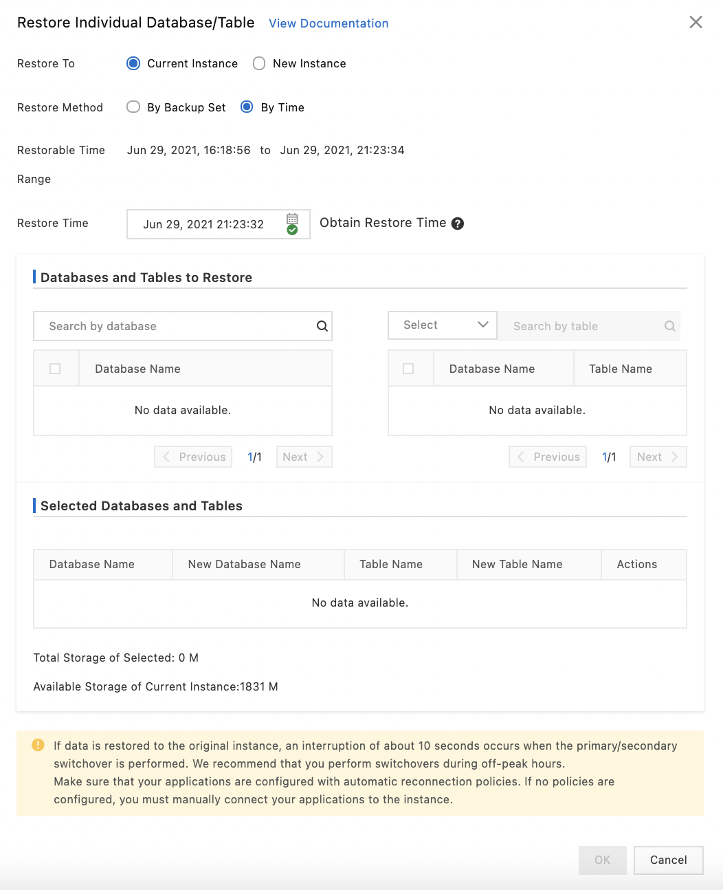{width="2.6086811023622047in"
height="3.2089195100612424in"}

If the value of the `Restore To` parameter is `New Instance`, the
following parameters must be filled in:
-   `Zone`: this is the zone where the new instance is located,

It must be the same region as the original instance but the area may be
different.
-   `CPU and Memory`: this is`` the type of instance of the new
    instance,
-   `Capacity`: this is the storage capacity of the new instance,
-   `Network Type`: this`` is the type of network (`Classic
    Network` or `VPC`).

### Upload binary log files to an OSS bucket 

It is possible to upload binary log files to an OSS bucket.

If the size of a backup file exceeds 500 MB, a new file is generated and
the previous one is stored in an OSS bucket.

By default, the system keeps the binary log files generated in the last
18 hours.

When the space is more than 80% used, local binary log files are deleted
once they have been uploaded to OSS.

To configure a rule to automatically upload binary log files:
-   Go to the `ApsaraDB for RDS` console,
-   Click on `Instances`,
-   Click on the instance ID,
-   Click on `Backup and Restoration`,
-   Click on `Edit` next to `Local Log Backup Settings`,

{width="1.3600820209973754in"
height="0.8113790463692039in"}
-   `Retention Period:` this is the retention period of the log files
    (from 0 to 168 hours, 18 hours by default),
-   `Max Storage Usage`: this is the maximum storage fill rate (from 0
    to 50%, 30% by default); beyond that, files are deleted,
-   `Retained Binlogs`: this is the maximum number of binary log files
    retained (from 6 to 100, 60 by default); beyond this limit, files
    are deleted, starting with the oldest,
-   `Protect Available Storage`: triggers the deletion of files
    starting with the oldest (80% full or free space less than 5 GB),
-   Click on `OK`.

{width="2.5576454505686788in"
height="2.2008388013998252in"}

To upload binary log files manually:
-   Go to the `ApsaraDB for RDS` console,
-   Click on `Instances`,
-   Click on the instance ID,
-   Click on `Backup and Restoration`,
-   Click on the `Upload Binlogs` tab,
-   Click on the `OK` tab.

{width="1.649313210848644in"
height="0.16798556430446193in"}

## Billing 

In this section, we will study:
-   Manual and automatic renewal of the proceedings,
-   The change from pay-as-you-go to subscription-based billing.

### Switch from pay-as-you-go to subscription billing 

Changing the billing mode does not interrupt the operation of a RDS
instance.

A RDS instance cannot switch from subscription billing to
fee-for-service.

### Renew manually 

You can manually renew a subscription-based instance before it expires
or within 15 days of its expiration.

It is possible to activate the automatic renewal.

### Renew automatically 

A `Pay-As-You-Go` instance has no expiration date and no renewal is
required.

If you have enabled auto-renewal for your subscription-based instance, a
payment will be deducted three days before the expiration date.

To enable or disable automatic renewal after purchasing a RDS instance:
-   Go to the `ApsaraDB for RDS` console,
-   Select `Expenses | Renewal Management` from the navigation bar.

{width="1.2244772528433945in"
height="0.5895636482939632in"}

Click `Enable Auto Renewal` on the instance to activate the renewal.

Click `Enable Manual Renewal` to disable renewal.

Click on `Edit Auto Renewal` to change the auto renewal cycle.

