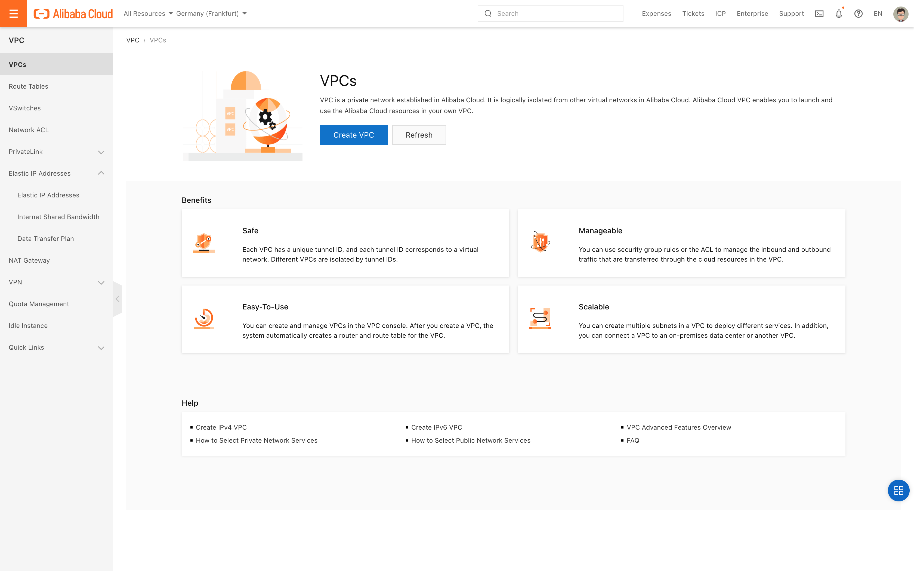
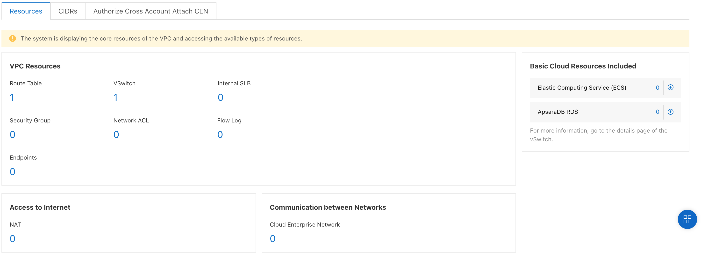
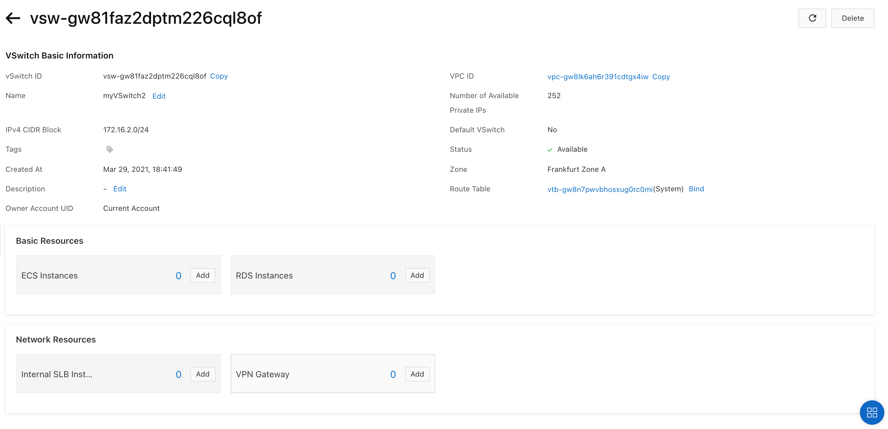
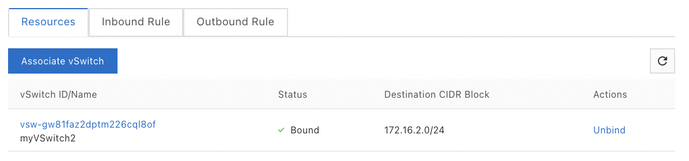

# VPC

Alibaba Cloud is a public cloud. VPC (Virtual Private Cloud) allows to
create your own private cloud within the Alibaba public cloud.

Specifically, VPC allows to create an isolated network environment on
Alibaba Cloud.

You can specify the IP address space and a CIDR (Classless Inter-Domain
Routing) block. The CIDR block is a method of allocating IP addresses. A
routing table is used to define the routes of packets.

NACLs (Network Access Control Lists) are used to manage network access
permissions at the VPC level using rules.

The vSwitch is used to connect cloud resources to a VPC. A default VPC
and vSwitch are created automatically.

The VRouter is a hub in a VPC, connecting the vSwitches of the VPC and
serving as a gateway to connect the VPC to other networks.

It is possible to establish a connection between the Alibaba Cloud VPC
and an existing data center via a physical connection or VPN,
facilitating a migration to the cloud.

## The VPC and classic networks 

The network can be of two types: VPC-based or traditional. Services
deployed within a classic network are deployed within the Alibaba Cloud
infrastructure while services deployed within a VPC network are deployed
in an isolated virtual environment within the Alibaba Cloud.

With the VPC network, private IP addresses are unique at the VPC level
while with the classic network, they are unique at the network level.
This means that two VPCs can have the same private IP address.

Moreover, with the VPC network, the instances can only communicate with
the instances of the same VPC, while with the classic network they can
communicate with all the instances of the same account and region.

## The VPC 

The VPC (Virtual Private Cloud) is a custom virtual private cloud. It is
possible to create instances of Alibaba Cloud products in these VPCs. It
is region specific and fully isolated.

VPCs can communicate with IPv4 or IPv6 addresses, although IPv4 is the
default protocol.

The VPC can communicate with the Internet using a NAT Gateway or an EIP
associated with an ECS instance.

It can also communicate with a Data Center or another VPC using Express
Connect, VPN Gateway or SAG (Smart Access Gateway).

By using Express Connect to interconnect VPCs, communication is done
through the Intranet. By avoiding the Internet, data is better protected
against theft. This also prevents the instability of the Internet
quality. Finally, it is possible to make VPCs from different regions
communicate.

There can be a maximum of two VPCs per account. It is possible to lift
this limit. To do so, you need to open a ticket for it.

To secure the data transmission, security isolation is provided with L2
logical isolation.

### VPC isolation 

Isolation is thus ensured at different levels:
-   ECS instances of different users are located in different VPCs,
-   VPCs are isolated using a tunnel ID,
-   vSwitches and VRouters are used to divide the VPC into subnets,
-   the ECS instances of a subnet are interconnected through the same
    vSwitch,
-   To interconnect VPCs, you must use a public IP address (EIP or IP
    NAT),
-   Security groups manage access control to ECS instances in a VPC
    (layer 3).

### CIDR blocks 

A CIDR (Classless Inter-Domain Routing) block is a method of allocating
IP addresses. It replaces the old system based on classes A, B and C.

The CIDR blocks available for VPCs are `192.168.0.0/16`,
`172.16.0.0/12` and `10.0.0.0/8`. The subnet mask, specified after
the `/`, must be between 8 and 24 bits long.

The CIDR blocks of the VPC cannot be modified once created. It is
therefore important to plan them broadly enough from the start. However,
it is possible to create a second CIDR, but it must be associated with a
different vSwitch.

### VPC management 

We will see how to display, create, modify and delete a VPC.

To create a VPC, you must specify:
-   a private network segment in the form of a CIDR block,
-   a vSwitch.

To create a VPC in the console:
-   Go to the `VPC` console,
-   Click on VPCs,

{width="4.5in" height="2.8125in"}
-   Select the region,
-   Click on `Create VPC`,
-   Enter the name of the VPC,
-   Refer to the CIDR,
-   Optionaly enter the description,
-   Click on `OK`.

{width="4.5in"
height="2.5555555555555554in"}

{width="4.5in" height="3.04375in"}

The VPC is created when its status changes to `Available`.

To view information about a VPC:
-   Go to the `VPC` console,
-   Click on `VPCs`,
-   Select the region,
-   Click on the instance ID.

The basic information about the VPC are displayed: name, ID, status,
region, CIDR, default VPC, creation date and time, ...

{width="4.5in" height="1.69375in"}

Information about the deployed resources are also displayed (ECS
instances, SLB, vSwitch, security groups).

{width="4.5in" height="1.6402777777777777in"}

The default VPCs are marked as `Default`.

To edit a VPC:
-   Go to the `VPC` console,
-   Click on `VPCs`,
-   Select the region,
-   Click on the instance ID,
-   To change the name of the VPC, click on `Edit` next to `Name`,
-   To change the description of the VPC, click on `Edit` next to
    `Description`.

To add a second CIDR block to a VPC:
-   Go to the `VPC` console,
-   Click on `VPCs`,
-   Select the region,
-   Click on `Manage` on the VPC line,
-   Click on `CIDRs`,
-   Click on `Add IPv4 CIDR`,
-   `VPC`: this is the VPC to which the CIDR block is added,
-   `Secondary CIDR`: this`` is the configuration method of the
    second CIDR block:

```{=html}
<!-- -->
```
-   `Default CIDR Block`: specifies the CIDR block,
-   `Custom CIDR Block`: specifies the CIDR block and the subnet,

```{=html}
<!-- -->
```
-   Click on `OK`.

The secondary CIDR block comes from the list of default CIDR blocks:
`192.168.0.0/16`, `172.16.0.0/12` and `10.0.0.0/8`.

To delete a VPC:
-   Go to the `VPC` console,
-   Click on `VPCs`,
-   Select the region,
-   Click on the ID of the VPC to be deleted,
-   Click on the trash can icon.

To delete a VPC, you must first delete all instances of the VPC.

## The VRouter 

The VRouter is a hub in a VPC, connecting the vSwitches of the VPC and
serving as a gateway to connect the VPC to other networks. A VPC can
only have one VRouter.

It is created automatically at the same time as the VPC and is destroyed
at the same time as the VPC.

The VRouter supports static routing (except ECMP equal cost routes) but
not dynamic routing (such as BGP and OSPF).

Each VRouter has a single routing table. This routing table contains a
list of routing entries. These entries affect all instances of the VPC.

Each entry in the routing table defines the "next hop", i.e. the next
destination of the data packets when routing the traffic. These entries
can be system or custom.

The "system" entries cannot be created or deleted. When a VPC is
created, a system route is automatically created to go from the VPC
instances to outside the VPC. In contrast, "custom" entries can be
created and deleted by users.

You cannot delete a routing table:
-   it is created automatically when the VPC is created,
-   it is deleted when the VPC is deleted.

Isolation is achieved through tunneling technology. Each VPC has a
unique tunnel ID. This tunnel ID is encapsulated in each data packet
transmitted between ECS instances within a VPC. Communication between
two tunnels is therefore impossible.

To create a routing table:
-   Go to the `VPC` console,
-   Click on `VPC`,
-   Select the region,
-   Click `Route Tables`,
-   Click `Create Route Table`,
-   `Resource Group:` this is`` the name of the group,
-   `VPC`: this is the VPC,
-   `Name`: this is the name of the routing table,
-   `Description`: this is the description,
-   Click on `OK`.

{width="2.8492508748906387in"
height="1.6260072178477691in"}

To add an entry to a routing table:
-   Go to the `VPC` console,
-   Click on `VPC`,
-   Select the region,
-   Click `Route Tables`,
-   Click on the instance ID,
-   Click on `Create Route entry`,
-   Click on the `Custom` tab,
-   Click `Add Route Entry`,
-   `Name`: this is`` the name of the entry,
-   `Destination CIDR Block:` this`` is the destination CIDR block,
-   `Next Hop Type`: this is the type of instance (`ECS Instance`,
    `VPN Gateway`, `NAT Gateway`, `Secondary ENI` or `Forwarding
    Router`),
-   Click on `OK`.

To delete a routing entry:
-   Go to the `VPC` console,
-   Click `Route Tables`,
-   Select the region,
-   Click on the instance ID,
-   Click on the `Route Entry List` tab,
-   Click on `Delete` on the line of the entry.

## The vSwitch 

The vSwitch is used to connect Cloud resources to a VPC. When creating
an instance of a Cloud product, you must specify the vSwitch in which
this instance is located.

When creating a vSwitch, you must specify a CIDR block. This CIDR block
must belong to the CIDR block of the VPC where the vSwitch is located.

The first and last three IP addresses of the CIDR block are reserved.
The remaining IP addresses are used to provide private IP addresses.

This CIDR block cannot conflict with a CIDR block of an existing
vSwitch. It also cannot contain a destination network segment in an
existing custom route.

An ECS instance can be migrated from one vSwitch to another provided it
is under the same VRouter of the same VPC.

To create a vSwitch from the console:
-   Go to the `VPC` console,
-   Select the region,
-   Click on `vSwitches`,
-   Click on `Create vSwitch`,
-   `Resource Group`: this is the resource group in which to add the
    vSwitch,
-   `Name`: this is the name of the vSwitch,
-   `VPC`: this is the VPC (not modifiable),
-   `CIDR`: this is the CIDR block of the VPC, displayed once the VPC
    is selected,
-   `Zone`: this is the zone,
-   `IPv4 CIDR Block`: this is the CIDR block of the VPC,
-   `Description`: this is the description,
-   Click on `OK`.

The subnet mask must be between 16 and 29. The available private IP
addresses come from this CIDR block.

{width="3.089229002624672in"
height="3.6846675415573054in"}

To modify a vSwitch:
-   Go to the `VPC` console,
-   Click on `VPCs`,
-   Select the region,
-   Click on `vSwitches`,
-   Click on the vSwitch ID,
-   Click `Edit` next to the vSwitch name or description.

To delete a vSwitch:
-   Go to the `VPC` console,
-   Click on `VPCs`,
-   Select the region,
-   Click on the vSwitch ID,
-   Click on `Delete`.

{width="4.5in" height="2.1770833333333335in"}

Before you can delete a vSwitch, you must delete all instances connected
to that vSwitch.

## The VPC and the default vSwitch 

A default VPC and vSwitch are created automatically to simplify the
setup of product instances. There is only one default VPC per region and
one default vSwitch per zone.

Default VPCs and default vSwitches are not included in the allocated VPC
and vSwitch quotas.

They cannot be created manually. If they have been deleted, they will be
recreated when they are needed, when an instance is created.

The default CIDR mask for a VPC is 16 bits (`/16`), which can provide
up to 65,536 private IP addresses. The default CIDR mask of a vSwitch is
20 bits (`/20`), which can provide up to 4096 private IP addresses.

## The Network ACLs 

NACLs (Network Access Control Lists) are used to manage network access
permissions at the VPC level using rules.

Once associated with a vSwitch, a network ACL controls the incoming and
outgoing traffic of the ECS instances associated with that vSwitch. The
network ACL and the vSwitch must be in the same VPC. In addition, a
vSwitch can only be associated with one NACL.

Network ACLs are stateless. This means that you must define incoming and
outgoing rules independently. A stateless network ACL denies all
incoming and outgoing access.

The network ACL does not filter traffic between ECS instances associated
with the vSwitch.

A rule includes the following information:
-   `Priority`: this is the priority,
-   `Policy`: this`` is the policy, which can be to allow
    (`allow`) traffic or to deny (`deny`) it,
-   `Protocol`: this is`` the type of protocol (`All`, `ICMP`,
    `GRE`, `TCP` or `UDP`),
-   `Source CIDR block`: this is the source CIDR block from which
    incoming traffic is transmitted,
-   `Destination CIDR block`: this is the destination CIDR block to
    which outgoing traffic is transmitted,
-   `Destination port range`: this is`` the destination port range
    to which the incoming rule applies,
-   `Destination port range`: this is`` the range of destination
    ports to which the outbound rule applies.

The smaller the value of the priority, the higher the priority. The
rules are therefore applied starting from priority 1 and the evaluation
stops as soon as a rule is applied.

When creating a network ACL, an inbound rule (with `Source CIDR
block`) and an outbound rule (with `Destination CIDR block`) are
created by default:
-   `Priority`: `1`
-   `Protocol:` `all`
-   `Source CIDR block/Destination CIDR block:` `0.0.0.0/0`
-   `Destination port range:` `-1/-1`
-   `Action:` `Allow`
-   `Type:` `Custom`

Let's look at the difference between the network ACLs of vSwitches and
the security groups of ECS instances.

Network ACLs are called stateless because the returned traffic must be
explicitly allowed by a rule. Security groups are called stateful
because the returned traffic is automatically authorized.

A vSwitch can only have one network ACL associated with it, while an ECS
instance can have multiple security groups associated with it.

Finally, with network ACLs, the evaluation stops at the first rule
checked, whereas with security groups, all rules are evaluated.

At the time of writing this book, network ACLs are not yet public. To
benefit from them, you may have to open a ticket.

To create a network ACL with the console Managing network ACLs with the
console:
-   Go to the `VPC` console,
-   Click on `ACL | Network ACL`,
-   Select a region,
-   Click on `Create Network ACL`,
-   `VPC`: this is the VPC where the network ACL is created,
-   `Name`: this is`` the name,
-   `Description`: this is the description,
-   Click on `OK`.

The network ACL must be in the same region as the VPC. Please note that
not all instance families support NACLs.

It is possible to create rules. Rules are either inbound or outbound.
Inbound rules indicate whether a vSwitch's ECS instances are accessible
from the Internet or private networks. Outbound rules manage the access
of a vSwitch's ECS instances to the Internet or to private networks.

To create a rule:
-   Go to the `VPC` console,
-   Click on `ACL | Network ACL`,
-   Select a region,
-   Click on the instance ID,

To create an inbound rule:
-   Click on the `Inbound Rule` tab,
-   Click `Manage Inbound Rule`,
-   `Priority`: this is the order in which the incoming rules take
    effect,

To change the priority, you must drag the rules to reorder them.
-   `Rule Name`: this is`` the name of the rule,
-   `Action`: this is`` the action of the rule; valid values are:

```{=html}
<!-- -->
```
-   `Accept`: the ECS instances in the vSwitch are accessible,
-   `Drop`: ECS instances in the vSwitch are not accessible,

```{=html}
<!-- -->
```
-   `Protocol:` this is the layer 4 protocol; the values are:

```{=html}
<!-- -->
```
-   `ALL`: all protocols,
-   `ICMP`: ICMP (Internet Control Message Protocol),
-   `GRE`: GRE (Generic Routing Encapsulation),
-   `TCP`: TCP (Transmission Control Protocol),
-   `UDP`: UDP (User Datagram Protocol),

```{=html}
<!-- -->
```
-   `Source IP Address`: this is the source CIDR block to which the
    data is transmitted (default value `0.0.0.0/32`),
-   `Source Port Range`: this is the range of source ports.

{width="4.5in"
height="1.6118055555555555in"}

ACL rules take effect in descending order of priority: a lower value
indicates a higher priority.

Port ranges are defined in the format `<FIRST_PORT>/<LAST_PORT>.`
Each port is a value that can range from 1 to 65535. `-1/-1` indicates
that all ports are available.

To create an outbound rule:
-   Click on the `Outbound Rule` tab,
-   Click `Manage Outbound Rule`,
-   `Priority`: this is the order in which the incoming rules take
    effect,

To change the priority, you must drag the rules to reorder them.
-   `Rule Name`: this is`` the name of the rule,
-   `Action`: this is`` the action of the rule; valid values are:

```{=html}
<!-- -->
```
-   `Accept`: the ECS instances in the vSwitch are accessible,
-   `Drop`: ECS instances in the vSwitch are not accessible,

```{=html}
<!-- -->
```
-   `Protocol:` this is the layer 4 protocol; the values are:

```{=html}
<!-- -->
```
-   `ALL`: all protocols,
-   `ICMP`: ICMP (Internet Control Message Protocol),
-   `GRE`: GRE (Generic Routing Encapsulation),
-   `TCP`: TCP (Transmission Control Protocol),
-   `UDP`: UDP (User Datagram Protocol),

```{=html}
<!-- -->
```
-   `Destination IP Address`: this is the destination CIDR block to
    which the data is transmitted (default value `0.0.0.0/32`),
-   `Destination Port Range`: this is the range of destination ports.

{width="4.5in"
height="1.5840277777777778in"}

To associate a network ACL with a vSwitch:
-   Go to the `VPC` console,
-   Click on `ACL | Network ACL`,
-   Select a region,
-   Click on `Associate vSwitch` on the NACL line,
-   Click on the `Resources` tab,
-   Click on `Associate vSwitch`,
-   Select the vSwitch,
-   Click on `Associate`.

{width="3.2634208223972005in"
height="2.6706660104986875in"}

To unlink a network ACL from a vSwitch:
-   Go to the `VPC` console,
-   Click on `Network ACL`,
-   Select a region,
-   Click on `Associate vSwitch` on the NACL line,
-   Click on the `Associate vSwitch` tab,
-   Click on `Unbind` on the vSwitch line,
-   Click on `OK`.

{width="4.218231627296588in"
height="0.9875087489063867in"}

The network ACL no longer controls the traffic of ECS instances in the
vSwitch.

To delete a network ACL:
-   Go to the `VPC` console,
-   Click on `Network ACL,`
-   Select a region,
-   Click on `Delete` on the NACL line,
-   Click on `OK`.

## To go further 

Shared VPCs allow multiple Alibaba Cloud accounts to share resources
from a shared VPC.

A VPC can be attached to a CEN (Cloud Enterprise Network) of the same or
another account. The CEN instance allows a private connection to be
established between two VPCs or between a VPC network and an on-premises
data center.

ClassicLink allows ECS instances connected to a classic network to
communicate with resources located in a VPC. These ECS instances can
only be connected to one VPC network of the same region and created with
the same account. They can only communicate with the ECS instances of
the primary CIDR block of the VPC. Several conditions must be met in
order to activate ClassicLink. See the documentation for details.

A HAVIP (High-Availability Virtual IP Address) is a private IP address
that can be created and released as a resource. HAVIPs can be used with
High Availability (HA) software. Each ECS instance has one private IP
address (a primary IP address). To increase the number of available
private IP addresses, you can associate HAVIPs with this ECS instance.
HAVIPs are floating private IP addresses: they can be associated with or
dissociated from ECS instances or ENIs by ARP announcements. The ECS or
ENI instance must belong to the same subnet as the HAVIP, i.e. to the
same vSwitch.

At the time of this writing, HAVIPs are not yet public. To benefit from
them, you may need to open a ticket.

VPC Flow provides flow logs of the incoming and outgoing traffic of the
ENIs of a VPC or vSwitch. These logs are used to monitor network traffic
and troubleshoot network problems. These logs are stored in the Log
Service. The maximum duration of the capture of this information is
about 10 minutes. At the time of writing, VPC Flow is not yet public. To
benefit from it, you may have to open a ticket.

DHCP (Dynamic Host Configuration Protocol) is used to transmit IP
addresses and domain names from DNS servers to servers on a network,
including ECS instances. By default, the IP addresses of Alibaba Cloud
DNS servers are stored on ECS instances. But private domain names cannot
be resolved by Alibaba Cloud DNS. The DHCP option set allows to define a
DNS configuration that is associated with the VPC. New ECS instances
deployed in this VPC then use this configuration.

At the time of writing this book, DHCP Options Set is not yet public. To
take advantage of it, you may have to open a ticket.

